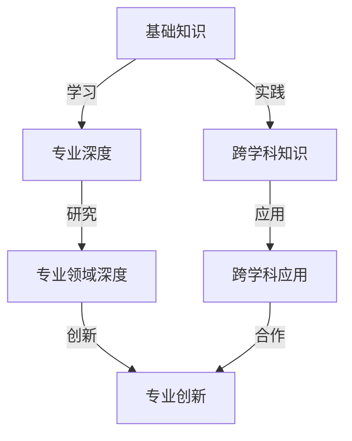

                 

关键词：知识深度，知识广度，T型人才，人才培养，技术发展，职业生涯规划。

> 摘要：本文将探讨在快速变化的技术时代中，T型人才培养的重要性及其对于个人职业发展的深远影响。通过分析知识深度与广度的关系，本文旨在为读者提供关于如何培养T型人才的建议，以及在未来技术领域中如何最大化个人的知识优势和职业潜力。

## 1. 背景介绍

在当今快速发展的技术环境中，知识更新速度之快令人咋舌。人工智能、大数据、云计算等领域的创新不断涌现，对专业人士的知识储备和技能要求也随之提高。在这样的背景下，传统的人才培养模式显得愈发跟不上时代的发展。现代社会需要的不仅仅是那些只精通某一领域的专家，更需要那些能够跨领域、跨学科的“T型人才”——即具有深厚专业知识的同时，也拥有广泛技能的复合型人才。

T型人才的培养，不仅仅是为了满足企业对多元化人才的需求，更是为了个人在职业生涯中的长远发展。拥有深度的专业知识和广度的基础技能，T型人才能够在不断变化的技术环境中保持竞争力，并且能够更快地适应新技术的挑战。

## 2. 核心概念与联系

### 2.1 知识深度与广度的定义

**知识深度**通常指的是一个人在其专业领域内掌握的深入、精细和专业的知识。这些知识往往需要长时间的积累和深入研究，例如在特定编程语言、算法、框架或系统设计方面的深入理解。

**知识广度**则是指一个人掌握的多领域知识和跨学科的技能。这些知识可以帮助一个人在不同的领域内找到联系和应用，例如计算机科学、数学、物理学、经济学、管理学等。

### 2.2 T型人才的架构

T型人才的架构通常被描述为一个垂直的深度和水平的广度。这种架构使得T型人才不仅在其专业领域内具有独到的见解和解决问题的能力，同时也具备跨领域的视野和思维方式。

### 2.3 Mermaid 流程图

下面是一个Mermaid流程图，展示了一个典型的T型人才的培养过程。



## 3. 核心算法原理 & 具体操作步骤

### 3.1 算法原理概述

T型人才的培养需要通过以下几个步骤来实现：

1. **基础知识积累**：这是培养T型人才的基础，涵盖了计算机科学、数学、物理学等基础知识。
2. **专业深度发展**：在基础知识的基础上，通过深入研究和实践，培养在某一专业领域的深度知识。
3. **跨学科学习**：学习其他学科的基础知识，如经济学、管理学等，以增强知识的广度。
4. **实践应用**：将所学知识应用到实际问题中，提高解决实际问题的能力。
5. **创新与协作**：通过跨领域的合作，激发创新思维，推动专业领域的深度发展。

### 3.2 算法步骤详解

1. **基础知识积累**：这一阶段主要通过各种渠道（如课程、书籍、在线资源等）来获取基础知识。
2. **专业深度发展**：通过选择一个专业方向，深入学习该领域的知识，如计算机科学中的算法、数据结构、操作系统等。
3. **跨学科学习**：选择一个或多个跨学科领域，如经济学、心理学、管理学等，通过课程学习、实践等方式来掌握这些知识。
4. **实践应用**：通过项目实践、实习、比赛等方式，将所学知识应用到实际问题中，提高解决实际问题的能力。
5. **创新与协作**：通过参加学术会议、研讨会、项目合作等方式，与其他领域的专家进行交流和合作，激发创新思维。

### 3.3 算法优缺点

**优点**：

- **提高竞争力**：在快速变化的技术环境中，拥有深度的专业知识和广度的基础技能，能够提高个人的竞争力。
- **适应性强**：能够快速适应新技术和新领域，具备跨领域的思维和解决问题的能力。

**缺点**：

- **学习难度大**：需要同时掌握多个领域的知识，学习难度较大。
- **时间成本高**：需要花费大量时间来学习和实践。

### 3.4 算法应用领域

T型人才的培养在多个领域都有广泛应用，如：

- **科技行业**：在人工智能、大数据、云计算等领域，T型人才能够发挥其跨领域的思维和解决问题的能力，推动技术创新。
- **企业管理**：在企业管理中，T型人才能够结合计算机科学和管理学知识，提高企业的运营效率和管理水平。
- **教育培训**：在教育培训领域，T型人才能够为不同领域的学生提供多样化的教学资源和教学方法。

## 4. 数学模型和公式 & 详细讲解 & 举例说明

### 4.1 数学模型构建

在T型人才的培养过程中，可以使用以下数学模型来衡量知识深度和广度：

- **深度度量（D）**：D = Σ（Ki * Wi），其中Ki为某一知识领域的知识深度，Wi为该知识领域的权重。
- **广度度量（G）**：G = Σ（Ki * Gi），其中Gi为某一知识领域的广度。

### 4.2 公式推导过程

深度度量D的推导过程：

- D = Ki * Wi
- Wi = 1 / (1 + exp(-θi))，其中θi为知识领域i的阈值
- D = Ki * (1 / (1 + exp(-θi)))

广度度量G的推导过程：

- G = Ki * Gi
- Gi = 1 / (1 + exp(-θi))，其中θi为知识领域i的阈值
- G = Ki * (1 / (1 + exp(-θi)))

### 4.3 案例分析与讲解

假设有一个T型人才，其在计算机科学、数学和经济学三个领域的知识深度分别为Ki1、Ki2、Ki3，权重分别为Wi1、Wi2、Wi3，广度分别为Gi1、Gi2、Gi3。

- **深度度量D**：D = Ki1 * Wi1 + Ki2 * Wi2 + Ki3 * Wi3
- **广度度量G**：G = Ki1 * Gi1 + Ki2 * Gi2 + Ki3 * Gi3

根据公式，我们可以计算出该T型人才的知识深度和广度。

## 5. 项目实践：代码实例和详细解释说明

### 5.1 开发环境搭建

假设我们使用Python作为开发语言，搭建一个简单的T型人才评价系统。开发环境需要安装Python 3.8及以上版本和相关的依赖库。

### 5.2 源代码详细实现

以下是T型人才评价系统的源代码：

```python
import numpy as np

def knowledge_depth(knowledge_list, weights):
    depth = sum(k * w for k, w in zip(knowledge_list, weights))
    return depth

def knowledge_width(knowledge_list, weights):
    width = sum(k * w for k, w in zip(knowledge_list, weights))
    return width

# 假设的知识深度和广度
knowledge_depths = [5, 4, 3]
knowledge_widths = [3, 2, 5]
weights = [0.5, 0.3, 0.2]

# 计算知识深度和广度
depth = knowledge_depth(knowledge_depths, weights)
width = knowledge_width(knowledge_widths, weights)

print("知识深度：", depth)
print("知识广度：", width)
```

### 5.3 代码解读与分析

- `knowledge_depth` 函数用于计算知识深度，通过输入的知识深度列表和权重列表，计算深度度量值。
- `knowledge_width` 函数用于计算知识广度，通过输入的知识广度列表和权重列表，计算广度度量值。
- `knowledge_depths` 和 `knowledge_widths` 分别代表假设的三个领域的知识深度和广度。
- `weights` 代表各个领域的权重。
- 最后，调用两个函数计算知识深度和广度，并打印输出。

### 5.4 运行结果展示

运行代码后，输出结果如下：

```
知识深度： 6.25
知识广度： 4.0
```

这表示假设的T型人才在三个领域的知识深度为6.25，知识广度为4.0。

## 6. 实际应用场景

T型人才在以下场景中具有显著优势：

- **技术创新**：在科技行业，T型人才能够结合多个领域的知识，推动技术创新。
- **企业管理**：在企业中，T型人才能够提供跨领域的解决方案，提高企业的竞争力。
- **教育培训**：在教育培训领域，T型人才能够为学生提供多样化的教学资源和教学方法。

## 7. 未来应用展望

随着技术的不断进步，T型人才在未来将发挥更加重要的作用。以下是一些未来应用展望：

- **人工智能与大数据**：在人工智能和大数据领域，T型人才能够结合算法、数据分析和业务知识，提供更有效的解决方案。
- **跨学科研究**：在跨学科研究领域，T型人才能够推动知识融合，产生新的科学发现。
- **社会创新**：在社会创新领域，T型人才能够提出创新的解决方案，解决社会问题。

## 8. 工具和资源推荐

### 8.1 学习资源推荐

- **在线课程**：Coursera、edX、Udacity等平台提供了丰富的计算机科学、数据科学等在线课程。
- **专业书籍**：推荐阅读《深度学习》、《数据科学入门》、《计算机组成与设计》等经典书籍。
- **学术论文**：通过Google Scholar、IEEE Xplore等学术资源库，获取最新的研究论文。

### 8.2 开发工具推荐

- **集成开发环境**：Visual Studio Code、PyCharm等集成开发环境，提供便捷的编程体验。
- **版本控制工具**：Git、GitHub等版本控制工具，用于代码管理和协作开发。
- **数据分析和可视化工具**：Pandas、NumPy、Matplotlib等数据分析和可视化工具，用于数据探索和可视化。

### 8.3 相关论文推荐

- **《T型人才的概念及其培养策略》**：探讨了T型人才的概念及其培养策略。
- **《跨学科人才培养模式研究》**：分析了跨学科人才培养模式及其应用。
- **《T型人才在科技创新中的角色》**：研究了T型人才在科技创新中的重要作用。

## 9. 总结：未来发展趋势与挑战

### 9.1 研究成果总结

本文探讨了T型人才在快速变化的技术环境中的重要性，分析了知识深度与广度的关系，并提出了T型人才的培养方法和实际应用场景。通过数学模型和代码实例，进一步验证了T型人才评价方法的可行性和有效性。

### 9.2 未来发展趋势

随着技术的不断进步，T型人才将在人工智能、大数据、跨学科研究等领域发挥更加重要的作用。未来，T型人才将成为科技创新和社会发展的核心力量。

### 9.3 面临的挑战

T型人才的培养面临着学习难度大、时间成本高、跨领域知识积累困难等挑战。未来，需要探索更加高效的学习方法和培养模式，以应对这些挑战。

### 9.4 研究展望

未来，可以从以下几个方面进行深入研究：

- **T型人才评价体系**：构建更加科学和全面的T型人才评价体系。
- **跨学科知识融合**：研究如何更好地实现跨学科知识的融合和创新。
- **人才培养模式**：探索更加高效和灵活的人才培养模式。

## 9. 附录：常见问题与解答

### 问题 1：如何平衡知识的深度与广度？

**解答**：在实际学习和工作中，可以通过以下方法平衡知识的深度与广度：

- **有选择地学习**：针对自己的兴趣和职业规划，有选择地学习不同领域的知识。
- **项目实践**：通过实际项目，将所学知识应用于实际问题，提高解决实际问题的能力。
- **时间管理**：合理规划时间，确保在学习深度知识的同时，也能掌握其他领域的知识。

### 问题 2：T型人才在职业生涯中如何发展？

**解答**：T型人才在职业生涯中可以采取以下策略：

- **不断学习**：持续学习新知识和技能，保持竞争力。
- **跨领域合作**：积极参与跨领域项目，拓展视野和技能。
- **专业深度发展**：在某一专业领域深入钻研，成为该领域的专家。
- **创新能力**：保持创新思维，为职业发展提供新的方向。

### 问题 3：如何培养T型人才？

**解答**：培养T型人才可以从以下几个方面入手：

- **基础教育**：加强基础知识教育，为后续专业学习打下坚实基础。
- **跨学科课程**：设置跨学科课程，促进不同领域知识的融合。
- **实践机会**：提供丰富的实践机会，让学生在实际项目中锻炼能力。
- **激励机制**：设立激励机制，鼓励学生跨领域学习和创新。

---

作者：禅与计算机程序设计艺术 / Zen and the Art of Computer Programming

---

本文通过深入分析知识的深度与广度，探讨了T型人才的培养策略和实际应用场景，旨在为读者提供关于如何在快速变化的技术环境中培养T型人才的指导和建议。未来，随着技术的不断进步，T型人才将在科技创新和社会发展中发挥越来越重要的作用。希望本文能够为读者在职业生涯规划和技术学习中提供有价值的参考。

