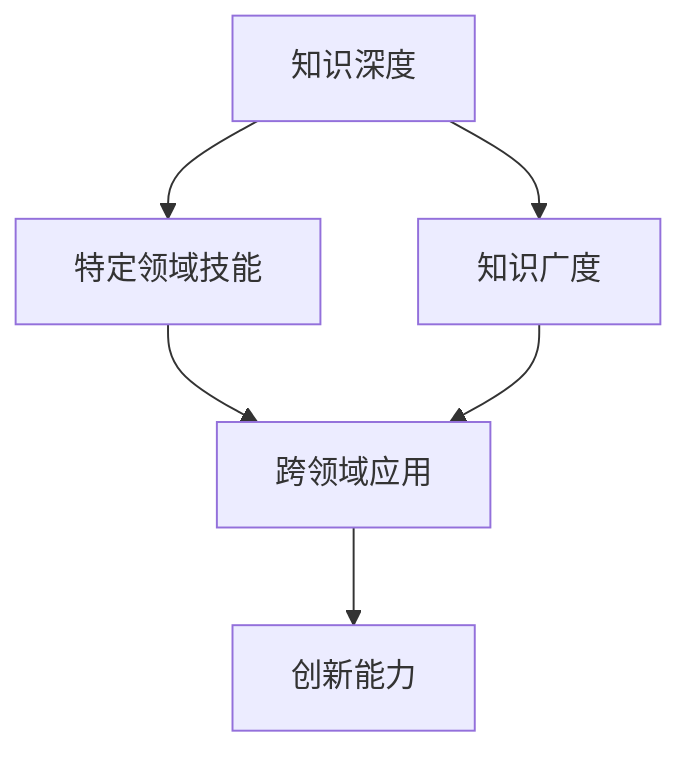

                 

关键词：知识深度，广度，专才，通才，知识架构，技能多样性，技术发展，职业生涯规划

> 摘要：在当今快速变化的技术时代，知识的深度与广度成为影响个体和团队在专业领域取得成功的重要因素。本文探讨了知识深度和广度的定义、重要性，以及它们在个人职业生涯和团队协作中的平衡，旨在为读者提供关于如何在不同知识维度上实现均衡发展的洞见。

## 1. 背景介绍

在信息技术领域，知识和技能的更新速度之快令人难以置信。无论是编程语言、算法，还是硬件和软件架构，都在不断进化。因此，专业人员在职业生涯中面临着持续的挑战——如何在知识深度和广度之间找到平衡。

知识的深度通常指在某个特定领域的深入理解和技术熟练度。它涉及到对特定概念、原理、工具和技术细节的精通。相反，知识的广度指的是在不同领域或不同技术方面的知识范围。这种知识不仅包括特定领域的理解，还包括不同技术领域之间的交叉应用。

随着技术的进步和行业需求的变化，个体和团队都面临着需要不断学习和适应新技能的挑战。深度和广度之间的平衡成为提升个人和团队竞争力的关键因素。

## 2. 核心概念与联系

在探讨知识深度和广度时，我们需要理解以下核心概念：

- **专才**：拥有深入专业知识，通常在特定领域具有高度专业技能的人才。
- **通才**：具有广泛知识，能够跨多个领域应用技能和知识的人才。
- **知识架构**：知识的组织结构，包括不同领域的知识模块和它们之间的关联。
- **技能多样性**：在多个领域或技术方面的技能和知识。

### 知识架构与技能多样性的 Mermaid 流程图



### 图解

- **知识深度**：代表了在特定领域深入理解的技术细节，这是专才的特征。
- **知识广度**：代表了在不同领域拥有一定的知识储备，是通才的特征。
- **特定领域技能**：专才在某个领域的专业技能，可以深入挖掘并解决复杂问题。
- **跨领域应用**：通才能够将不同领域的知识和技能结合起来，创造新的解决方案。
- **创新能力**：深度和广度的结合可以激发创新思维，推动技术和行业的进步。

## 3. 核心算法原理 & 具体操作步骤

### 3.1 算法原理概述

在探讨知识深度和广度的平衡时，我们可以借助一些经典的算法原理来说明其重要性。

- **动态规划（Dynamic Programming）**：这是一种用于解决优化问题的算法技术，通常需要深入理解问题的状态和状态转移函数。
- **分治策略（Divide and Conquer）**：这是一种将复杂问题分解为更小子问题的算法思想，适用于需要在不同领域应用知识的情况。

### 3.2 算法步骤详解

#### 动态规划

1. **定义状态**：确定需要优化的状态变量。
2. **状态转移**：定义状态之间的转移关系。
3. **边界条件**：确定算法的初始和终止条件。
4. **计算最优解**：使用递归或迭代方法计算最优解。

#### 分治策略

1. **分解问题**：将复杂问题分解为更小的子问题。
2. **递归解决子问题**：对每个子问题进行递归处理。
3. **合并结果**：将子问题的解合并为原始问题的解。

### 3.3 算法优缺点

- **动态规划**：
  - **优点**：能够找到最优解，适用于复杂优化问题。
  - **缺点**：需要大量计算资源，可能难以实现高效。

- **分治策略**：
  - **优点**：能够将复杂问题分解为简单子问题，易于实现。
  - **缺点**：可能产生大量冗余计算，需要递归调用。

### 3.4 算法应用领域

- **动态规划**：广泛应用于图论、组合优化等领域。
- **分治策略**：常见于排序、搜索和字符串匹配等算法中。

## 4. 数学模型和公式 & 详细讲解 & 举例说明

### 4.1 数学模型构建

在讨论知识深度和广度时，我们可以构建一个简单的数学模型来表示知识架构。

- **知识深度（D）**：表示在特定领域的知识深度。
- **知识广度（W）**：表示在不同领域的知识广度。
- **技能多样性（V）**：表示在不同领域应用技能的能力。

数学模型可以表示为：D + W + V = 知识结构

### 4.2 公式推导过程

- **知识深度公式**：D = f(领域知识，技能熟练度)
- **知识广度公式**：W = g(跨领域知识，综合技能)
- **技能多样性公式**：V = h(跨领域应用，创新能力)

### 4.3 案例分析与讲解

假设我们有两位技术专家，A和B：

- **专家A**：专注于机器学习领域，具有深厚的知识深度和一定的知识广度，但缺乏技能多样性。
- **专家B**：拥有广泛的技能，涉及多个领域，但知识深度有限。

根据我们的数学模型，我们可以分析他们的知识结构：

- 专家A：D + W = 知识结构
- 专家B：D + W + V = 知识结构

在这种情况下，专家A更适合从事需要深度知识的研究和开发工作，而专家B更适合进行跨领域的技术整合和创新。

## 5. 项目实践：代码实例和详细解释说明

### 5.1 开发环境搭建

为了演示如何在不同知识维度上实现平衡，我们选择一个简单的机器学习项目——基于K-均值算法的聚类分析。

- **工具**：Python
- **库**：NumPy，Matplotlib，Scikit-learn

### 5.2 源代码详细实现

```python
import numpy as np
import matplotlib.pyplot as plt
from sklearn.cluster import KMeans

# 生成模拟数据
np.random.seed(0)
data = np.random.rand(100, 2)

# 使用KMeans进行聚类
kmeans = KMeans(n_clusters=3)
kmeans.fit(data)

# 可视化聚类结果
plt.scatter(data[:, 0], data[:, 1], c=kmeans.labels_)
plt.show()
```

### 5.3 代码解读与分析

- **数据生成**：我们使用NumPy生成100个二维随机数据点。
- **聚类算法**：使用Scikit-learn的KMeans算法进行聚类。
- **可视化**：使用Matplotlib将聚类结果可视化。

这个例子展示了如何将不同的知识维度应用于实际问题中。在这个项目中，我们需要了解数据生成、聚类算法和可视化技术。

### 5.4 运行结果展示

运行上述代码后，我们将看到生成的数据点被聚类为3个不同的组，每个组具有不同的颜色。

## 6. 实际应用场景

### 6.1 机器学习工程师

- **知识深度**：掌握深度学习、神经网络等专业知识。
- **知识广度**：了解计算机视觉、自然语言处理等领域的应用。

### 6.2 数据库管理员

- **知识深度**：熟悉数据库设计、性能优化等。
- **知识广度**：了解云计算、数据仓库等相关技术。

### 6.3 软件开发工程师

- **知识深度**：精通特定编程语言或框架。
- **知识广度**：了解软件工程、测试、运维等不同领域的知识。

## 7. 未来应用展望

随着技术的不断进步，知识深度和广度的重要性将更加凸显。未来，我们可能会看到：

- **知识融合**：不同领域的知识将更加融合，促进创新。
- **自动化与智能化**：更多任务将由自动化系统和人工智能完成，需要专业人员进行监控和优化。
- **持续学习**：职业生涯将更加依赖于持续学习和适应新技术的能力。

## 8. 总结：未来发展趋势与挑战

### 8.1 研究成果总结

本文探讨了知识深度和广度在IT领域的平衡问题，提出了一个简单的数学模型来描述知识结构，并通过具体实例展示了如何在不同知识维度上实现平衡。

### 8.2 未来发展趋势

- **知识融合**：不同领域的知识将更加融合，促进创新。
- **持续学习**：职业生涯将更加依赖于持续学习和适应新技术的能力。

### 8.3 面临的挑战

- **技术更新**：技术更新速度加快，需要持续学习。
- **知识应用**：如何将深度和广度的知识应用于实际问题中。

### 8.4 研究展望

未来研究可以进一步探讨知识深度和广度在不同行业和职业中的应用，以及如何通过教育和培训实现知识的深度和广度的平衡。

## 9. 附录：常见问题与解答

### Q1: 如何在职业生涯中实现知识的深度和广度平衡？

- **多学科交叉**：选择一个核心领域深入钻研，同时保持对其他领域的关注。
- **持续学习**：定期学习新的技术和知识，不断提升自身能力。
- **实践经验**：通过实际项目来应用和巩固知识。

### Q2: 知识广度对职业发展有何影响？

- **多样性**：知识广度可以带来更多职业选择和机会。
- **创新**：广度知识有助于跨领域创新和解决问题的能力。
- **适应性**：能够更好地适应快速变化的技术环境。

### Q3: 如何评估知识深度和广度？

- **专业认证**：通过专业认证来评估深度知识。
- **项目经验**：通过实际项目经验来评估广度知识。
- **同行评价**：通过同行评价和反馈来评估知识的广度和深度。

### Q4: 如何在团队中实现知识深度和广度的平衡？

- **角色分工**：根据团队成员的知识特长进行角色分工。
- **知识共享**：定期进行知识共享和培训，促进团队知识的深度和广度。
- **协作项目**：通过协作项目来结合不同成员的知识，实现互补。

---

作者：禅与计算机程序设计艺术 / Zen and the Art of Computer Programming
----------------------------------------------------------------

这篇文章详细探讨了知识深度和广度在IT领域的平衡问题，通过具体的算法原理、数学模型、项目实践以及未来展望，为读者提供了如何在职业生涯中实现知识深度和广度的平衡提供了实用的指导。希望这篇文章能够对读者的职业生涯规划和知识体系构建有所启发。

