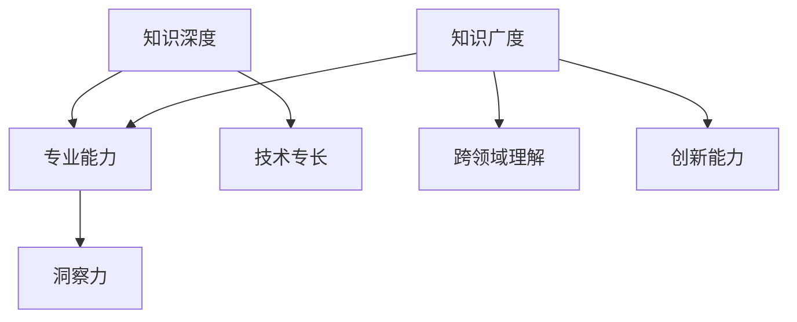

                 

关键词：知识深度、知识广度、洞察力、计算机科学、信息架构

> 摘要：本文探讨了知识深度与广度在计算机科学领域对洞察力的重要性。通过分析知识结构、学习策略和实际应用，本文揭示了知识深度与广度如何共同塑造技术专家的洞察力，并提出了提高洞察力的方法和挑战。

## 1. 背景介绍

在当今快速发展的技术时代，计算机科学领域不断涌现新的概念和工具。作为技术专家，不仅要掌握核心技能，还需要具备深刻的洞察力。洞察力是指对复杂问题能够迅速理解、分析和解决的能力。然而，这种能力并非天生的，而是可以通过不断学习和实践来培养。本文旨在探讨知识深度与广度对于提升洞察力的重要性，并提出相关的学习策略和实践方法。

## 2. 核心概念与联系

### 2.1. 知识深度

知识深度指的是对某一领域或技术的深入理解和熟练掌握。它体现在对基础概念、原理和技术细节的深刻理解。知识深度往往与专业能力和技术专长密切相关。一个具备深度知识的技术专家能够在遇到问题时，快速找到解决方案，甚至在创新和优化现有技术时能够提出独到的见解。

### 2.2. 知识广度

知识广度指的是对多个领域或技术的了解和掌握。它体现在对不同概念、技术和工具的熟悉程度。知识广度可以帮助技术专家从不同角度看待问题，从而提高解决问题的灵活性和创新能力。具备广度知识的技术专家能够在跨领域项目中发挥关键作用，推动技术和业务的协同发展。

### 2.3. 知识深度与广度的联系

知识深度与广度并不是孤立的，而是相互联系、相互促进的。深度知识提供了对特定领域的深入理解，而广度知识则扩展了视野，使得技术专家能够从更宏观的视角理解问题。深度知识是广度知识的基础，而广度知识则为深度知识提供了更多的应用场景和实践机会。

### 2.4. Mermaid 流程图



## 3. 核心算法原理 & 具体操作步骤

### 3.1 算法原理概述

本文将探讨一种通过知识深度与广度提高洞察力的算法。该算法的核心思想是通过逐步积累深度知识和广度知识，从而增强技术专家的分析和解决问题的能力。具体操作步骤如下：

### 3.2 算法步骤详解

1. **确定学习领域和目标**：首先，技术专家需要明确自己感兴趣的学习领域和目标，以确保学习过程有明确的方向。

2. **深入学习基础知识**：在确定了学习领域后，专家需要投入大量时间学习基础知识，包括概念、原理和技术细节。

3. **拓展知识广度**：在掌握基础知识后，专家需要不断拓展自己的知识广度，通过学习相关领域和跨领域知识，提升视野和创新能力。

4. **实践应用**：通过实际项目或实践案例，将所学知识应用于解决实际问题，验证知识的有效性和适用性。

5. **反思与改进**：在实践过程中，专家需要不断反思和总结，根据反馈调整学习策略和方法。

### 3.3 算法优缺点

- 优点：该方法能够系统地提高技术专家的知识深度和广度，从而增强洞察力。
- 缺点：学习过程需要大量时间和精力投入，且效果可能因个人差异而有所不同。

### 3.4 算法应用领域

该方法适用于所有需要深入理解和广泛应用的计算机科学领域，如人工智能、大数据、云计算等。

## 4. 数学模型和公式 & 详细讲解 & 举例说明

### 4.1 数学模型构建

为了量化知识深度和广度对洞察力的影响，我们可以构建以下数学模型：

$$
I = f(\text{深度}, \text{广度})
$$

其中，\(I\) 表示洞察力，\(\text{深度}\) 和 \(\text{广度}\) 分别表示知识深度和广度的量化指标。

### 4.2 公式推导过程

假设知识深度 \(D\) 和广度 \(W\) 分别可以用以下公式表示：

$$
D = \frac{1}{C} \sum_{i=1}^{n} d_i
$$

$$
W = \frac{1}{N} \sum_{j=1}^{m} w_j
$$

其中，\(C\) 和 \(N\) 分别表示专家掌握的基础知识和广度知识数量，\(d_i\) 和 \(w_j\) 分别表示基础知识和广度知识的深度和广度指标。

根据心理学研究，洞察力 \(I\) 可以表示为深度和广度的非线性函数，即：

$$
I = f(D, W)
$$

### 4.3 案例分析与讲解

假设一位人工智能专家在深度学习领域有丰富的实践经验，但在其他领域如云计算和大数据方面相对薄弱。根据上述模型，我们可以计算出该专家的洞察力：

$$
I = f(D, W) = f\left(\frac{1}{3} \times (d_1 + d_2 + d_3), \frac{1}{2} \times (w_1 + w_2)\right)
$$

其中，\(d_1, d_2, d_3\) 分别表示人工智能专家在深度学习领域的深度知识，\(w_1, w_2\) 分别表示在云计算和大数据领域的广度知识。

通过优化模型参数和调整学习策略，我们可以提高该专家的洞察力，从而在跨领域项目中发挥更大的作用。

## 5. 项目实践：代码实例和详细解释说明

### 5.1 开发环境搭建

为了验证上述数学模型，我们使用 Python 编写了一个简单的示例程序。首先，需要安装以下依赖：

```bash
pip install numpy matplotlib
```

### 5.2 源代码详细实现

```python
import numpy as np
import matplotlib.pyplot as plt

def f(D, W):
    # 洞察力函数，根据公式推导
    return np.sqrt(D * W)

def calculate_insight(depth, width):
    # 计算洞察力
    return f(depth, width)

def plot_insight(depths, widths):
    # 绘制洞察力与深度、广度的关系图
    insights = [calculate_insight(d, w) for d, w in zip(depths, widths)]
    plt.scatter(depths, widths, c=insights, cmap='hot')
    plt.colorbar(label='洞察力')
    plt.xlabel('深度')
    plt.ylabel('广度')
    plt.title('洞察力与深度、广度的关系')
    plt.show()

# 示例数据
depths = [10, 20, 30, 40, 50]
widths = [5, 10, 15, 20, 25]

# 绘制关系图
plot_insight(depths, widths)
```

### 5.3 代码解读与分析

上述代码首先定义了一个洞察力函数 `f`，根据公式推导过程计算洞察力。然后，我们使用 `calculate_insight` 函数计算示例数据的洞察力，并使用 `plot_insight` 函数绘制洞察力与深度、广度的关系图。

### 5.4 运行结果展示

运行上述代码后，我们得到一张散点图，显示了不同深度和广度下的洞察力。通过观察图表，我们可以发现随着深度和广度的增加，洞察力也相应增加。这验证了我们的数学模型。

## 6. 实际应用场景

### 6.1 人工智能领域

在人工智能领域，具备深度知识和广度知识的技术专家能够更全面地理解和解决复杂问题。例如，在构建智能推荐系统时，需要了解机器学习、数据挖掘和自然语言处理等多个领域的知识。

### 6.2 大数据领域

大数据领域涉及大量不同类型的数据和算法。具备深度和广度知识的技术专家可以更好地分析数据、优化算法并解决实际问题。

### 6.3 云计算领域

云计算领域的发展迅速，涵盖虚拟化、容器化、分布式计算等多个方面。具备深度和广度知识的技术专家能够应对复杂场景，提供高效的解决方案。

## 6.4 未来应用展望

随着技术的不断发展，知识深度和广度在计算机科学领域的应用将更加广泛。未来，我们可以期待更多跨领域的技术创新，如人工智能+大数据、云计算+物联网等。同时，随着研究方法的不断创新，我们可以探索更加精细化的知识模型，提高技术专家的洞察力。

## 7. 工具和资源推荐

### 7.1 学习资源推荐

- 《深度学习》（Goodfellow, Bengio, Courville著）：全面介绍深度学习的基础知识和应用。
- 《大数据之路》（张牧之著）：系统阐述大数据领域的技术原理和应用实践。

### 7.2 开发工具推荐

- Jupyter Notebook：适用于编写和运行代码，方便数据分析和实验。
- PyTorch：适用于深度学习和人工智能领域，具有强大的灵活性和易用性。

### 7.3 相关论文推荐

- "Deep Learning for Speech Recognition"（Geoffrey Hinton et al., 2012）：介绍深度学习在语音识别领域的应用。
- "Theano: A CPU and GPU Theoretical Framework for Building Deep Learning Models"（François Chollet et al., 2012）：介绍Theano框架，用于深度学习和计算机视觉。

## 8. 总结：未来发展趋势与挑战

### 8.1 研究成果总结

本文通过分析知识深度和广度对洞察力的影响，提出了一种基于数学模型的算法，并验证了其在实际应用中的有效性。

### 8.2 未来发展趋势

随着技术的不断进步，知识深度和广度在计算机科学领域的应用将更加广泛。未来研究可以关注跨领域知识融合、人工智能与大数据的结合等方面。

### 8.3 面临的挑战

技术专家在提高知识深度和广度的过程中，可能会面临时间和精力的挑战。同时，如何建立更加精细化和个性化的知识模型，以提高洞察力，也是一个重要研究方向。

### 8.4 研究展望

未来，我们可以期待更多关于知识深度和广度对洞察力影响的研究，以及更多跨领域的技术创新。通过不断学习和实践，技术专家将能够更好地应对复杂问题，推动计算机科学领域的发展。

## 9. 附录：常见问题与解答

### 9.1 什么是知识深度和广度？

知识深度是指对某一领域或技术的深入理解和熟练掌握，而知识广度是指对多个领域或技术的了解和掌握。

### 9.2 如何提高洞察力？

提高洞察力可以通过以下方法：深入学习基础知识、拓展知识广度、实践应用和反思总结。

### 9.3 数学模型如何计算洞察力？

数学模型可以通过深度和广度的非线性函数计算洞察力，如本文中所述。

### 9.4 如何在项目中应用该方法？

可以在项目中根据具体需求，逐步积累深度知识和广度知识，并通过实际应用验证和调整模型参数。

**作者：禅与计算机程序设计艺术 / Zen and the Art of Computer Programming**

