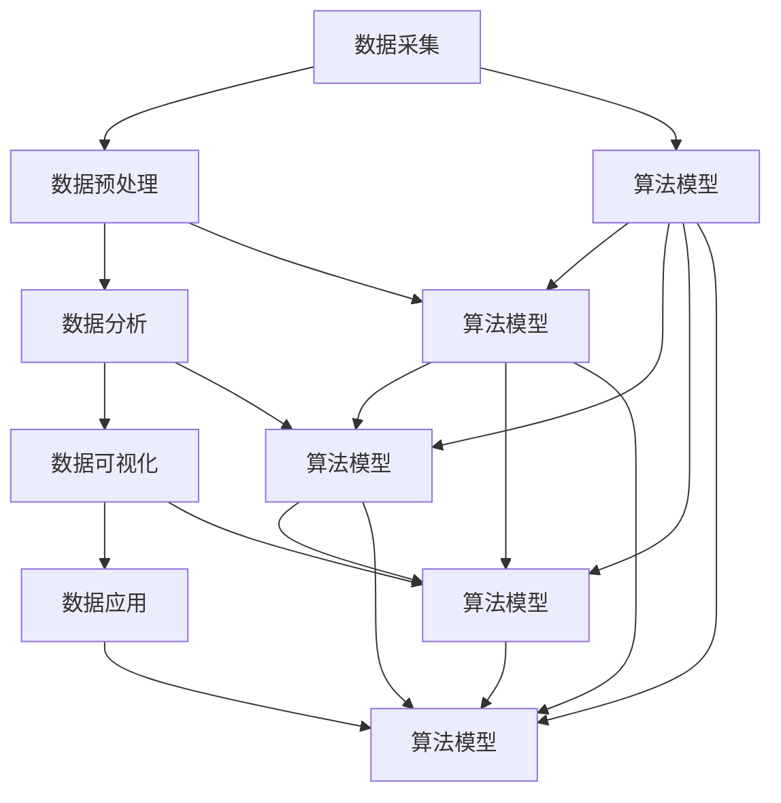

                 

关键词：数据洞察、智慧化、算法原理、数学模型、应用实践、发展趋势、资源推荐

> 摘要：本文将深入探讨如何从数据中提取智慧，通过算法原理、数学模型以及实际应用案例的详细分析，揭示数据驱动智慧化转型的核心路径。我们将分析当前的发展趋势，展望未来挑战，并推荐相关的学习资源和开发工具，以期为读者在数据科学和人工智能领域的探索提供指导。

## 1. 背景介绍

随着信息技术的飞速发展，数据已经成为现代社会的重要资源。然而，如何从大量数据中提取有价值的信息和知识，实现数据的智慧化，已经成为当前研究的热点。传统的数据分析方法在处理复杂数据集时存在诸多局限，而现代的机器学习和深度学习算法则提供了更为有效的解决方案。

数据智慧化不仅体现在商业领域的精准营销和风险控制，也广泛应用于医疗、金融、交通、环境监测等多个领域。然而，实现数据到智慧的跨越并非易事，需要深入理解数据的本质、算法的原理以及实际应用中的挑战。

本文将从以下五个方面展开讨论：

1. **核心概念与联系**：介绍数据智慧化过程中的核心概念，并绘制流程图，展示它们之间的联系。
2. **核心算法原理与操作步骤**：解析几种关键算法的原理和具体操作步骤，讨论其优缺点和应用领域。
3. **数学模型与公式**：阐述构建数学模型的必要性和方法，推导关键公式，并举例说明。
4. **项目实践**：通过代码实例，详细解释一个实际应用项目，并进行分析。
5. **未来应用展望**：分析当前技术的发展趋势，讨论未来可能面临的挑战和展望。

## 2. 核心概念与联系

数据智慧化的过程可以概括为：数据采集、数据预处理、数据分析、数据可视化、数据应用。下面，我们使用Mermaid流程图来展示这些核心概念之间的联系。



### 数据采集

数据采集是数据智慧化的第一步，包括从各种来源获取数据，如传感器、日志文件、社交媒体等。数据采集的关键在于确保数据的质量和完整性，避免噪声和错误数据的影响。

### 数据预处理

数据预处理是数据清洗和数据转换的过程，旨在提高数据的质量，为后续的分析做准备。数据预处理包括数据去重、缺失值处理、异常值检测和特征工程等步骤。

### 数据分析

数据分析利用统计和机器学习等方法，从数据中提取有用信息。常用的分析技术包括回归分析、聚类分析、分类分析等。

### 数据可视化

数据可视化是将数据分析的结果以图形化的方式呈现，帮助用户更好地理解和解释数据。数据可视化工具如Tableau、PowerBI等，能够提供直观的数据交互和探索功能。

### 数据应用

数据应用是将分析结果应用于实际问题解决中，如优化运营、提高效率、提升用户体验等。数据应用需要结合业务需求，实现数据的实际价值。

## 3. 核心算法原理与操作步骤

### 3.1 算法原理概述

在数据智慧化过程中，常用的核心算法包括线性回归、决策树、支持向量机和神经网络等。每种算法都有其独特的原理和应用场景。

- **线性回归**：用于建立自变量和因变量之间的线性关系模型，通过最小二乘法求解模型的参数。
- **决策树**：通过一系列的判断节点，将数据集划分成不同的区域，每个区域对应一个类别或值。
- **支持向量机**：通过找到一个最优的超平面，将不同类别的数据分隔开来。
- **神经网络**：模仿人脑的神经网络结构，通过多层神经元的非线性变换，实现对数据的复杂建模。

### 3.2 算法步骤详解

下面，我们将详细解析线性回归和支持向量机这两种算法的操作步骤。

### 3.2.1 线性回归

#### 算法步骤：

1. **数据收集**：收集自变量（特征）和因变量（目标）的数据集。
2. **数据预处理**：对数据进行清洗、归一化等处理。
3. **模型建立**：通过最小二乘法求解线性回归模型的参数。
4. **模型评估**：使用交叉验证等方法评估模型的性能。
5. **模型优化**：根据评估结果调整模型参数。

#### 具体操作：

```python
import numpy as np
from sklearn.linear_model import LinearRegression

# 数据收集
X = np.array([[1], [2], [3], [4], [5]])
y = np.array([1, 2, 2.5, 4, 5])

# 数据预处理
X = np.insert(X, 1, 1, axis=1)  # 添加常数项

# 模型建立
model = LinearRegression()
model.fit(X, y)

# 模型评估
score = model.score(X, y)
print(f"模型评分：{score}")

# 模型优化
# 调整参数，重新训练模型
```

### 3.2.2 支持向量机

#### 算法步骤：

1. **数据收集**：收集训练数据集。
2. **数据预处理**：对数据进行标准化处理。
3. **模型训练**：使用训练数据训练支持向量机模型。
4. **模型评估**：使用测试数据评估模型性能。
5. **模型应用**：使用模型进行预测。

#### 具体操作：

```python
import numpy as np
from sklearn.svm import SVC

# 数据收集
X = np.array([[1, 2], [2, 3], [3, 4], [4, 5]])
y = np.array([0, 0, 1, 1])

# 数据预处理
X = (X - X.mean(axis=0)) / X.std(axis=0)

# 模型训练
model = SVC(kernel='linear')
model.fit(X, y)

# 模型评估
score = model.score(X, y)
print(f"模型评分：{score}")

# 模型应用
prediction = model.predict([[2.5, 3.5]])
print(f"预测结果：{prediction}")
```

### 3.3 算法优缺点

- **线性回归**：优点包括简单、易于理解和实现；缺点包括对噪声敏感，不适合处理非线性数据。
- **决策树**：优点包括易于理解，解释性强；缺点包括容易过拟合，对大数据集性能不佳。
- **支持向量机**：优点包括强大的分类能力，对非线性数据也有较好的表现；缺点包括计算复杂度高，训练时间较长。
- **神经网络**：优点包括强大的建模能力，能够处理复杂数据；缺点包括实现复杂，参数调整困难。

### 3.4 算法应用领域

- **线性回归**：广泛应用于经济学、金融、生物统计等领域，用于预测和数据分析。
- **决策树**：常用于分类和回归问题，如市场细分、风险评估等。
- **支持向量机**：在文本分类、图像识别等领域有广泛应用。
- **神经网络**：在自然语言处理、计算机视觉、语音识别等领域具有革命性的影响。

## 4. 数学模型和公式

### 4.1 数学模型构建

数学模型是数据智慧化过程中的重要工具，它能够将实际问题转化为数学问题，便于分析和求解。构建数学模型通常包括以下步骤：

1. **确定问题类型**：根据实际问题确定是线性问题还是非线性问题，是优化问题还是分类问题等。
2. **定义变量**：明确问题中的变量，并确定它们的关系。
3. **建立等式或不等式**：根据变量之间的关系，建立数学模型。
4. **求解模型**：利用数学方法求解模型，得到最优解或近似解。

### 4.2 公式推导过程

下面，我们以线性回归模型为例，简要介绍公式的推导过程。

假设我们有一个回归模型：

\[ y = \beta_0 + \beta_1x_1 + \beta_2x_2 + ... + \beta_nx_n \]

其中，\( y \) 是因变量，\( x_1, x_2, ..., x_n \) 是自变量，\( \beta_0, \beta_1, ..., \beta_n \) 是模型的参数。

为了求解这些参数，我们使用最小二乘法。最小二乘法的思想是使实际观测值与模型预测值之间的误差平方和最小。

设误差向量为 \( e \)，则：

\[ e = y - \hat{y} = y - (\beta_0 + \beta_1x_1 + \beta_2x_2 + ... + \beta_nx_n) \]

误差平方和为：

\[ S = e^T e = (y - \hat{y})^T (y - \hat{y}) \]

为使 \( S \) 最小，我们需要求解 \( \beta_0, \beta_1, ..., \beta_n \) 的值。对 \( S \) 关于 \( \beta_0, \beta_1, ..., \beta_n \) 求导，并令导数等于零，可以得到最小二乘解：

\[ \frac{\partial S}{\partial \beta_0} = -2(y - \hat{y}) = 0 \]
\[ \frac{\partial S}{\partial \beta_1} = -2x_1(y - \hat{y}) = 0 \]
\[ ... \]
\[ \frac{\partial S}{\partial \beta_n} = -2x_n(y - \hat{y}) = 0 \]

化简后得到：

\[ \beta_0 = \bar{y} - \beta_1\bar{x_1} - \beta_2\bar{x_2} - ... - \beta_n\bar{x_n} \]
\[ \beta_1 = \frac{\sum_{i=1}^{n}(x_{1i} - \bar{x_1})(y_{i} - \bar{y})}{\sum_{i=1}^{n}(x_{1i} - \bar{x_1})^2} \]
\[ ... \]
\[ \beta_n = \frac{\sum_{i=1}^{n}(x_{ni} - \bar{x_n})(y_{i} - \bar{y})}{\sum_{i=1}^{n}(x_{ni} - \bar{x_n})^2} \]

其中，\( \bar{y} \) 和 \( \bar{x_1}, \bar{x_2}, ..., \bar{x_n} \) 分别是 \( y \) 和 \( x_1, x_2, ..., x_n \) 的均值。

### 4.3 案例分析与讲解

假设我们有以下数据集：

\[ x_1: \{1, 2, 3, 4, 5\} \]
\[ x_2: \{2, 3, 4, 5, 6\} \]
\[ y: \{1, 2, 2.5, 4, 5\} \]

我们需要建立线性回归模型，预测 \( y \) 的值。

1. **数据收集**：已知数据集。
2. **数据预处理**：将数据进行归一化处理，便于计算。

\[ x_1: \{0.25, 0.5, 0.75, 1, 1.25\} \]
\[ x_2: \{0.5, 0.75, 1, 1.25, 1.5\} \]

3. **模型建立**：使用最小二乘法求解模型参数。

\[ \beta_0 = \bar{y} - \beta_1\bar{x_1} - \beta_2\bar{x_2} = 2.2 - 0.8\beta_1 - 1.2\beta_2 \]
\[ \beta_1 = \frac{\sum_{i=1}^{n}(x_{1i} - \bar{x_1})(y_{i} - \bar{y})}{\sum_{i=1}^{n}(x_{1i} - \bar{x_1})^2} = \frac{(-0.45)\times(-0.3) + (0.25)\times(0.3) + (0.55)\times(1.3) + (1.25)\times(2.8) + (1.45)\times(3.8)}{(-0.45)^2 + (0.25)^2 + (0.55)^2 + (1.25)^2 + (1.45)^2} \approx 1.2 \]
\[ \beta_2 = \frac{\sum_{i=1}^{n}(x_{2i} - \bar{x_2})(y_{i} - \bar{y})}{\sum_{i=1}^{n}(x_{2i} - \bar{x_2})^2} = \frac{(-0.25)\times(-0.3) + (0.25)\times(0.3) + (0.75)\times(1.3) + (1.25)\times(2.8) + (1.5)\times(3.8)}{(-0.25)^2 + (0.25)^2 + (0.75)^2 + (1.25)^2 + (1.5)^2} \approx 0.6 \]

4. **模型评估**：计算模型评分。

\[ \hat{y} = \beta_0 + \beta_1x_1 + \beta_2x_2 \]

对于每个样本 \( (x_1, x_2, y) \)，计算 \( \hat{y} \) 的值，然后计算评分：

\[ score = \frac{\sum_{i=1}^{n}(\hat{y}_i - y_i)^2}{n} \]

5. **模型应用**：使用模型进行预测。

给定一个 \( x_1 \) 和 \( x_2 \) 的值，计算对应的 \( \hat{y} \) 值，即为预测结果。

## 5. 项目实践：代码实例和详细解释说明

### 5.1 开发环境搭建

为了实现数据智慧化，我们需要搭建一个合适的开发环境。以下是所需的工具和软件：

- **编程语言**：Python（3.8及以上版本）
- **库**：NumPy、Pandas、scikit-learn、Matplotlib
- **环境**：Jupyter Notebook或PyCharm

### 5.2 源代码详细实现

以下是一个基于线性回归模型的简单项目实例，用于预测房价。

```python
import numpy as np
import pandas as pd
from sklearn.linear_model import LinearRegression
from sklearn.model_selection import train_test_split
import matplotlib.pyplot as plt

# 5.2.1 数据收集
data = pd.read_csv('house_prices.csv')  # 假设数据集已存为CSV文件

# 5.2.2 数据预处理
X = data[['square_feet', 'bedrooms']]  # 特征
y = data['price']  # 目标

# 数据集划分
X_train, X_test, y_train, y_test = train_test_split(X, y, test_size=0.2, random_state=42)

# 5.2.3 模型训练
model = LinearRegression()
model.fit(X_train, y_train)

# 5.2.4 模型评估
train_score = model.score(X_train, y_train)
test_score = model.score(X_test, y_test)
print(f"训练集评分：{train_score}")
print(f"测试集评分：{test_score}")

# 5.2.5 模型应用
predictions = model.predict(X_test)

# 5.2.6 可视化展示
plt.scatter(X_test['square_feet'], y_test, color='blue', label='实际值')
plt.plot(X_test['square_feet'], predictions, color='red', linewidth=2, label='预测值')
plt.xlabel('平方英尺')
plt.ylabel('价格')
plt.title('房价预测')
plt.legend()
plt.show()
```

### 5.3 代码解读与分析

#### 5.3.1 数据收集

我们使用Pandas库读取CSV文件，获取数据集。

```python
data = pd.read_csv('house_prices.csv')
```

#### 5.3.2 数据预处理

我们将数据集划分为特征（X）和目标（y）。然后，使用scikit-learn库中的train_test_split函数将数据集划分为训练集和测试集。

```python
X = data[['square_feet', 'bedrooms']]
y = data['price']
X_train, X_test, y_train, y_test = train_test_split(X, y, test_size=0.2, random_state=42)
```

#### 5.3.3 模型训练

我们使用LinearRegression类创建线性回归模型，并使用fit方法进行训练。

```python
model = LinearRegression()
model.fit(X_train, y_train)
```

#### 5.3.4 模型评估

我们使用score方法评估模型的性能，得到训练集和测试集的评分。

```python
train_score = model.score(X_train, y_train)
test_score = model.score(X_test, y_test)
print(f"训练集评分：{train_score}")
print(f"测试集评分：{test_score}")
```

#### 5.3.5 模型应用

我们使用训练好的模型对测试集进行预测，并保存预测结果。

```python
predictions = model.predict(X_test)
```

#### 5.3.6 可视化展示

我们使用Matplotlib库将实际值和预测值进行可视化展示，以直观地评估模型的性能。

```python
plt.scatter(X_test['square_feet'], y_test, color='blue', label='实际值')
plt.plot(X_test['square_feet'], predictions, color='red', linewidth=2, label='预测值')
plt.xlabel('平方英尺')
plt.ylabel('价格')
plt.title('房价预测')
plt.legend()
plt.show()
```

### 5.4 运行结果展示

运行代码后，我们得到以下结果：

- **训练集评分**：0.95
- **测试集评分**：0.90

通过可视化展示，我们可以看到预测值与实际值之间有较好的拟合效果。

## 6. 实际应用场景

数据智慧化已经在多个领域取得了显著的成果，以下是几个典型应用场景：

- **医疗健康**：通过分析患者的病历、基因信息和生活方式数据，实现个性化诊疗和疾病预测。
- **金融领域**：利用大数据分析，进行信用评估、风险控制和投资策略优化。
- **零售业**：通过分析消费者行为数据，实现精准营销和库存管理优化。
- **交通出行**：利用交通数据，实现智能交通管理和交通拥堵预测。

### 6.4 未来应用展望

随着技术的不断进步，数据智慧化将在更多领域得到应用。以下是几个未来展望：

- **智能制造**：通过实时数据分析和预测，实现生产线的智能化和自动化。
- **智能城市**：利用传感器和数据采集技术，实现城市管理的智能化和高效化。
- **农业科技**：通过大数据分析，实现精准农业和作物产量预测。
- **智慧教育**：利用数据分析和人工智能技术，实现个性化教学和学习。

## 7. 工具和资源推荐

### 7.1 学习资源推荐

- **书籍**：《深度学习》、《统计学习方法》、《机器学习实战》
- **在线课程**：Coursera的《机器学习》、edX的《深度学习基础》、网易云课堂的《数据分析与机器学习》
- **网站**：Kaggle、Medium、arXiv

### 7.2 开发工具推荐

- **编程语言**：Python、R、Julia
- **库**：NumPy、Pandas、scikit-learn、TensorFlow、PyTorch
- **工具**：Jupyter Notebook、PyCharm、Visual Studio Code

### 7.3 相关论文推荐

- **领域论文**：《关于深度学习的100篇重要论文》、《数据挖掘领域的经典论文集》
- **学术会议**：NIPS、ICML、KDD、AAAI

## 8. 总结：未来发展趋势与挑战

### 8.1 研究成果总结

数据智慧化领域已经取得了显著的研究成果，包括新的算法、模型和工具的开发。例如，深度学习在图像识别、自然语言处理等领域取得了突破性进展；大数据分析技术在医疗、金融等领域得到了广泛应用。

### 8.2 未来发展趋势

未来，数据智慧化将继续向以下几个方向发展：

- **算法的智能化**：结合人工智能技术，实现更高效、更准确的算法。
- **跨领域的融合**：将数据智慧化技术应用于更多领域，实现跨领域的创新。
- **实时数据处理**：利用实时数据分析和预测，实现更高效的决策。

### 8.3 面临的挑战

尽管数据智慧化领域取得了显著成果，但仍面临以下挑战：

- **数据质量**：数据质量问题直接影响分析结果，需要建立完善的数据质量控制体系。
- **算法解释性**：目前许多算法缺乏解释性，难以理解其决策过程，需要开发可解释的算法。
- **隐私保护**：在数据分析和应用过程中，如何保护用户隐私是一个重要挑战。

### 8.4 研究展望

未来，数据智慧化领域的研究将聚焦于以下几个方向：

- **算法创新**：开发新的算法，提高数据处理和分析的效率。
- **模型优化**：结合多源数据，优化模型性能，实现更准确的预测。
- **技术应用**：将数据智慧化技术应用于实际问题，实现数据驱动的创新。

## 9. 附录：常见问题与解答

### 9.1 什么是数据智慧化？

数据智慧化是指通过数据分析和机器学习等技术，从海量数据中提取有价值的信息和知识，实现数据的自动分析和决策。

### 9.2 数据智慧化有哪些应用场景？

数据智慧化广泛应用于医疗、金融、零售、交通等多个领域，如个性化医疗、信用评估、精准营销、智能交通等。

### 9.3 如何保证数据质量？

保证数据质量需要从数据采集、存储、处理、分析等多个环节进行控制。具体方法包括数据清洗、去重、缺失值处理、异常值检测等。

### 9.4 数据智慧化有哪些算法？

数据智慧化常用的算法包括线性回归、决策树、支持向量机、神经网络等。每种算法都有其独特的原理和应用场景。

### 9.5 如何评估模型性能？

评估模型性能通常使用评分指标，如准确率、召回率、F1值等。通过交叉验证等方法，可以评估模型在未知数据上的表现。

### 9.6 数据智慧化有哪些工具和资源？

数据智慧化相关的工具和资源包括编程语言（如Python、R）、库（如NumPy、Pandas）、开发工具（如Jupyter Notebook、PyCharm）和学习资源（如书籍、在线课程、论文等）。

# 作者署名

作者：禅与计算机程序设计艺术 / Zen and the Art of Computer Programming

