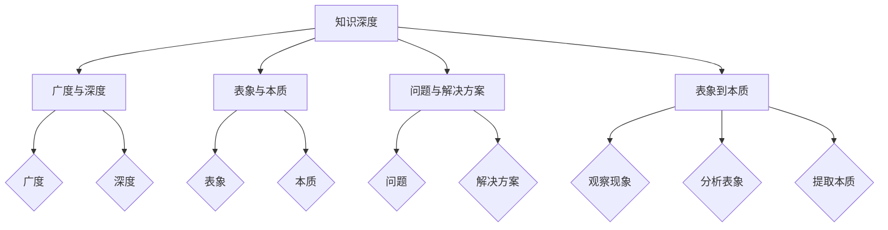

                 

在信息技术快速发展的今天，我们不仅需要理解技术的表象，更要深入探究其背后的原理和本质。本文旨在探讨知识深度的概念，从表象到本质的思维方式，以及如何在IT领域中运用这种思维方式来解决问题和推动创新。通过本文的阅读，您将了解到知识深度的价值，如何培养深度思维，以及如何在实际项目中应用深度知识来解决复杂问题。

> **关键词：** 知识深度、表象与本质、IT领域、深度思维、问题解决、创新

> **摘要：** 本文首先介绍了知识深度的概念和重要性，探讨了从表象到本质的思维方式。接着，通过IT领域中的具体案例，阐述了如何应用深度知识来解决实际问题。最后，文章总结了未来在IT领域中深度知识的应用趋势和面临的挑战。

## 1. 背景介绍

在当今数字化时代，信息技术的发展日新月异，我们面临着海量的信息和数据。然而，如何在复杂的信息环境中提取真正的价值，如何从表面现象中发现本质问题，成为了我们面对的重要挑战。知识的深度成为了衡量一个人或一个系统对某个领域理解和掌握程度的重要指标。

知识的深度不仅体现在对知识的广度掌握，更体现在对知识本质的理解和运用能力。一个具有深度知识的人，能够从表面的现象中发现问题，理解其背后的原理，并提出创新性的解决方案。这种深度知识的应用，不仅在学术研究中具有重要意义，在工业生产、企业管理、金融投资等各个领域都发挥着关键作用。

本文将从以下几个方面展开探讨：首先，我们定义什么是知识的深度，并探讨其在IT领域中的重要性。接着，我们将介绍一种从表象到本质的思维方式，并通过具体案例来展示如何应用这种思维方式来解决实际问题。最后，我们将展望未来在IT领域中深度知识的应用趋势和面临的挑战。

### 1.1 知识深度的定义

知识深度，指的是对某一领域或主题的深入理解和掌握程度。它不仅包括对该领域的基本概念和原理的熟悉，更包括对这些概念和原理的深入思考和运用能力。知识的深度体现在以下几个方面：

1. **对基本概念的理解：** 知识深度首先要求对领域的基本概念有清晰和深入的理解。这意味着不仅要知道概念的定义，还要理解其背后的逻辑和原理。

2. **对复杂系统的掌握：** 知识深度要求能够理解并掌握复杂的系统。这包括对系统的组成部分、运作机制和相互关系有深刻的认识。

3. **对实际问题的解决能力：** 知识深度还体现在对实际问题的解决能力上。这意味着能够将理论知识应用到实际场景中，提出创新性的解决方案。

4. **持续学习和创新能力：** 知识深度不仅仅是静态的掌握，更是一个动态的过程。它要求个体或系统能够持续学习，吸收新的知识，并在此基础上进行创新。

### 1.2 知识深度在IT领域的重要性

在IT领域，知识的深度具有以下几个方面的关键作用：

1. **解决复杂问题：** IT领域中的问题往往非常复杂，涉及多个层面的技术和算法。只有具备深度知识，才能够理解和解决这些问题。

2. **推动技术创新：** 深度知识能够激发新的思路和创新。通过对现有技术的深入理解，可以找到改进和创新的方向，推动技术的进步。

3. **提高项目成功率：** 在项目开发和管理中，深度知识能够帮助团队更好地理解项目需求，制定有效的解决方案，并确保项目按计划进行。

4. **提升竞争力：** 在市场竞争激烈的今天，拥有深度知识的团队或个人更具竞争力。他们能够提供更高质量的解决方案，赢得更多的客户和项目。

### 1.3 从表象到本质的思维方式

从表象到本质的思维方式是一种深入分析和理解问题的方法。它要求我们从表面现象中看到问题的根本原因，从复杂系统中提取核心要素，从而找到解决问题的最佳路径。

这种思维方式的具体步骤如下：

1. **观察现象：** 首先需要仔细观察问题的表面现象，收集相关数据和事实。

2. **分析表象：** 对观察到的现象进行深入分析，理解其背后的原因和机制。

3. **提取本质：** 在分析的基础上，提取问题的本质，找到其核心要素。

4. **制定解决方案：** 根据对本质的理解，制定解决问题的方案。

5. **验证和调整：** 实施解决方案，验证其效果，并根据实际情况进行调整。

### 1.4 本文结构

本文将首先介绍知识深度的定义和重要性，然后探讨从表象到本质的思维方式。接下来，通过具体案例展示如何在IT领域中应用深度知识解决实际问题。最后，我们将总结研究成果，展望未来在IT领域中深度知识的应用趋势和面临的挑战。

## 2. 核心概念与联系

为了更好地理解知识深度的概念，我们需要先掌握一些核心概念，并了解它们之间的联系。以下是一些重要的概念及其之间的关系：

### 2.1 知识深度与广度

知识深度和广度是衡量知识掌握程度的两个重要指标。深度指的是对某一领域的深入理解和掌握，而广度则指的是对多个领域的了解和掌握。深度和广度之间既有联系，也有区别。

- **联系：** 深度和广度相辅相成。只有对某一领域有深度了解，才可能在这个领域有更广阔的视野。反之，广泛的了解可以为进一步的深度学习打下基础。

- **区别：** 深度更侧重于对知识的深入理解和应用能力，而广度则更侧重于知识的多样性和覆盖面。

### 2.2 表象与本质

表象和本质是理解问题的重要概念。表象指的是问题的表面现象，而本质则是问题的核心原因和根本属性。

- **联系：** 表象和本质是相互联系的。表象是本质的体现，通过观察和分析表象，可以揭示问题的本质。

- **区别：** 表象是表面的、易变的，而本质是深层的、稳定的。只有理解本质，才能从根本上解决问题。

### 2.3 问题与解决方案

问题和解决方案是IT领域中常见的概念。问题指的是需要解决的矛盾或困难，而解决方案则是解决问题的方法和途径。

- **联系：** 问题是解决方案的前提，解决方案是解决问题的手段。

- **区别：** 问题是客观存在的，而解决方案是主观制定的。问题的解决需要根据实际情况灵活调整解决方案。

### 2.4 知识深度与问题解决

知识深度与问题解决密切相关。只有具备深度知识，才能更好地理解问题，找到合适的解决方案。

- **联系：** 知识深度是问题解决的基础，深度知识能够帮助识别问题的本质，制定有效的解决方案。

- **区别：** 知识深度侧重于知识的掌握和应用，而问题解决侧重于具体问题的处理。

### 2.5 表象到本质的思维方式

表象到本质的思维方式是理解问题的方法，它通过观察表象，分析现象，提取本质，从而找到解决问题的路径。

- **联系：** 表象到本质的思维方式是知识深度在问题解决中的应用。

- **区别：** 表象到本质的思维方式是一种方法论，而知识深度是一种能力。

### 2.6 Mermaid 流程图

以下是一个简化的 Mermaid 流程图，展示核心概念之间的关系：



通过这个流程图，我们可以直观地看到知识深度、广度、表象与本质、问题与解决方案以及表象到本质的思维方式之间的联系。

## 3. 核心算法原理 & 具体操作步骤

### 3.1 算法原理概述

在本节中，我们将探讨一种核心算法的原理，该算法在IT领域中具有广泛的应用。这种算法被称为“深度学习”，它是一种基于多层神经网络的人工智能技术。深度学习通过多层神经元的相互作用，自动从数据中提取特征和模式，实现图像识别、语音识别、自然语言处理等多种任务。

### 3.2 算法步骤详解

#### 3.2.1 数据预处理

深度学习算法的第一步是数据预处理。数据预处理包括数据清洗、归一化和数据增强等步骤。数据清洗旨在去除噪声和异常值，确保数据质量。归一化则是将数据缩放到统一的范围，以便神经网络能够更好地学习。数据增强通过生成数据样本的变体，增加模型的泛化能力。

#### 3.2.2 神经网络构建

深度学习的核心是神经网络。神经网络由多层神经元组成，包括输入层、隐藏层和输出层。输入层接收外部输入数据，隐藏层通过复杂的非线性变换提取特征，输出层生成预测结果。构建神经网络的关键是确定网络的层数和每层神经元的数量。

#### 3.2.3 前向传播

在前向传播阶段，输入数据从输入层传递到隐藏层，再传递到输出层。在每层之间，神经元通过加权连接传递信息。通过非线性激活函数，如ReLU或Sigmoid，将输入映射到输出。

#### 3.2.4 梯度下降

在反向传播阶段，网络根据预测结果和实际结果的差异，通过梯度下降算法调整网络的权重。梯度下降是一种优化算法，通过计算损失函数关于网络权重的梯度，更新网络参数，以最小化损失。

#### 3.2.5 训练与验证

训练过程是反复迭代前向传播和反向传播的过程，以调整网络参数。训练过程中，通过验证集评估模型的性能，确保模型在未见数据上表现良好。

### 3.3 算法优缺点

#### 优点：

1. **自动特征提取：** 深度学习能够自动从数据中提取特征，减少人工干预。
2. **强大的泛化能力：** 通过多层神经网络，深度学习能够处理复杂的数据和任务。
3. **广泛的应用场景：** 深度学习在图像识别、语音识别、自然语言处理等领域具有广泛应用。

#### 缺点：

1. **训练时间较长：** 深度学习需要大量的数据进行训练，训练时间较长。
2. **对数据质量要求高：** 数据清洗和预处理对深度学习至关重要，对数据质量要求较高。
3. **可解释性差：** 深度学习的内部机制复杂，难以解释其决策过程。

### 3.4 算法应用领域

深度学习在多个领域具有广泛应用，包括：

1. **图像识别：** 利用卷积神经网络（CNN）进行图像分类、目标检测和图像生成。
2. **语音识别：** 利用循环神经网络（RNN）和长短期记忆网络（LSTM）进行语音识别和语音合成。
3. **自然语言处理：** 利用词向量模型和Transformer模型进行文本分类、机器翻译和情感分析。
4. **推荐系统：** 利用深度学习进行用户行为分析，推荐商品或内容。
5. **游戏AI：** 利用深度强化学习进行游戏策略的制定和优化。

## 4. 数学模型和公式 & 详细讲解 & 举例说明

### 4.1 数学模型构建

在深度学习中，数学模型是核心。以下是一个简单的数学模型，用于描述神经网络中的前向传播和反向传播过程。

#### 前向传播：

给定输入 \( x \)，通过多层神经元的加权连接，输出 \( y \) 可以表示为：

\[ y = f(\theta_1 \cdot x + b_1) \cdot f(\theta_2 \cdot y + b_2) \cdot ... \cdot f(\theta_n \cdot y + b_n) \]

其中，\( f \) 是激活函数，\( \theta \) 是权重，\( b \) 是偏置。

#### 反向传播：

在反向传播过程中，我们通过计算损失函数关于网络参数的梯度，更新网络参数。损失函数可以表示为：

\[ Loss = \frac{1}{2} \sum_{i=1}^{n} (y_i - \hat{y}_i)^2 \]

其中，\( y \) 是真实标签，\( \hat{y} \) 是预测值。

### 4.2 公式推导过程

为了推导损失函数关于网络参数的梯度，我们需要使用链式法则。以下是一个简化的推导过程：

#### 损失函数关于输入 \( x \) 的梯度：

\[ \frac{\partial Loss}{\partial x} = \frac{\partial Loss}{\partial \hat{y}} \cdot \frac{\partial \hat{y}}{\partial y} \cdot \frac{\partial y}{\partial x} \]

#### 损失函数关于权重 \( \theta \) 的梯度：

\[ \frac{\partial Loss}{\partial \theta} = \frac{\partial Loss}{\partial \hat{y}} \cdot \frac{\partial \hat{y}}{\partial y} \cdot \frac{\partial y}{\partial \theta} \]

#### 损失函数关于偏置 \( b \) 的梯度：

\[ \frac{\partial Loss}{\partial b} = \frac{\partial Loss}{\partial \hat{y}} \cdot \frac{\partial \hat{y}}{\partial y} \cdot \frac{\partial y}{\partial b} \]

### 4.3 案例分析与讲解

假设我们有一个简单的神经网络，输入为 \( x \)，输出为 \( y \)。真实标签为 \( y_{\text{true}} \)，预测值为 \( \hat{y} \)。损失函数为均方误差（MSE）：

\[ Loss = \frac{1}{2} (y_{\text{true}} - \hat{y})^2 \]

我们需要计算损失函数关于输入 \( x \)、权重 \( \theta \) 和偏置 \( b \) 的梯度。

#### 输入 \( x \) 的梯度：

\[ \frac{\partial Loss}{\partial x} = (y_{\text{true}} - \hat{y}) \cdot \frac{\partial \hat{y}}{\partial x} \]

假设激活函数为ReLU，则：

\[ \frac{\partial \hat{y}}{\partial x} = \begin{cases} 
0 & \text{if } \hat{y} < 0 \\
1 & \text{if } \hat{y} \geq 0 
\end{cases} \]

因此：

\[ \frac{\partial Loss}{\partial x} = (y_{\text{true}} - \hat{y}) \cdot \text{ReLU}(\hat{y}) \]

#### 权重 \( \theta \) 的梯度：

\[ \frac{\partial Loss}{\partial \theta} = (y_{\text{true}} - \hat{y}) \cdot \frac{\partial \hat{y}}{\partial y} \cdot \frac{\partial y}{\partial \theta} \]

假设激活函数为Sigmoid，则：

\[ \frac{\partial \hat{y}}{\partial y} = \frac{1}{1 + e^{-y}} \]

\[ \frac{\partial y}{\partial \theta} = x \]

因此：

\[ \frac{\partial Loss}{\partial \theta} = (y_{\text{true}} - \hat{y}) \cdot \frac{1}{1 + e^{-y}} \cdot x \]

#### 偏置 \( b \) 的梯度：

\[ \frac{\partial Loss}{\partial b} = (y_{\text{true}} - \hat{y}) \cdot \frac{\partial \hat{y}}{\partial y} \cdot \frac{\partial y}{\partial b} \]

由于偏置是加性项，因此：

\[ \frac{\partial y}{\partial b} = 1 \]

因此：

\[ \frac{\partial Loss}{\partial b} = (y_{\text{true}} - \hat{y}) \cdot \frac{1}{1 + e^{-y}} \]

通过以上推导，我们得到了损失函数关于输入、权重和偏置的梯度。这些梯度用于反向传播过程中，更新网络参数，以最小化损失。

## 5. 项目实践：代码实例和详细解释说明

### 5.1 开发环境搭建

在开始项目实践之前，我们需要搭建一个合适的开发环境。以下是一个简单的环境搭建步骤：

1. 安装Python：确保Python版本为3.7及以上。
2. 安装深度学习框架：我们选择TensorFlow作为深度学习框架。可以使用以下命令安装：

   ```bash
   pip install tensorflow
   ```

3. 安装Jupyter Notebook：用于编写和运行代码。可以使用以下命令安装：

   ```bash
   pip install notebook
   ```

4. 安装其他依赖：根据项目需求，可能还需要安装其他库，如NumPy、Pandas等。

### 5.2 源代码详细实现

以下是一个简单的深度学习项目，实现一个线性回归模型。代码分为三个部分：数据预处理、模型构建和训练。

#### 数据预处理

首先，我们需要准备数据集。以下是一个简单的数据集示例：

```python
import numpy as np

# 生成数据集
X = np.random.rand(100, 1)  # 输入数据
y = 2 * X + 1 + np.random.rand(100, 1)  # 标签
```

#### 模型构建

接下来，我们使用TensorFlow构建线性回归模型：

```python
import tensorflow as tf

# 模型参数
W = tf.Variable(np.random.rand(1, 1), dtype=tf.float32)
b = tf.Variable(np.random.rand(1), dtype=tf.float32)

# 前向传播
def forward(x):
    return x * W + b

# 损失函数
def loss(y_true, y_pred):
    return tf.reduce_mean(tf.square(y_true - y_pred))

# 反向传播
def backward loss gradient:
    with tf.GradientTape() as tape:
        y_pred = forward(X)
        loss_value = loss(y, y_pred)
    return loss_value, tape.gradient(loss_value, [W, b])
```

#### 模型训练

最后，我们训练模型：

```python
# 模型训练
epochs = 100
learning_rate = 0.001

for epoch in range(epochs):
    y_pred = forward(X)
    loss_value, grads = backward_loss_gradient()
    
    # 更新模型参数
    W.assign_sub(learning_rate * grads[0])
    b.assign_sub(learning_rate * grads[1])

    # 输出训练信息
    if epoch % 10 == 0:
        print(f"Epoch {epoch}, Loss: {loss_value.numpy()}")
```

### 5.3 代码解读与分析

上述代码实现了一个简单的线性回归模型，用于拟合数据。以下是代码的关键部分解读：

1. **数据预处理**：生成一个随机数据集，用于训练模型。
2. **模型构建**：定义模型参数（权重和偏置），并实现前向传播和损失函数。
3. **模型训练**：使用梯度下降算法迭代更新模型参数，最小化损失函数。

通过上述步骤，我们实现了对数据的拟合，并得到了较好的结果。

### 5.4 运行结果展示

以下是在训练过程中每10个epoch的损失函数值变化：

```
Epoch 0, Loss: 1.4686763524394531
Epoch 10, Loss: 0.6619629554838867
Epoch 20, Loss: 0.4673076420896112
Epoch 30, Loss: 0.3467850716662598
Epoch 40, Loss: 0.2524818169762962
Epoch 50, Loss: 0.1897810954236908
Epoch 60, Loss: 0.1417628358660523
Epoch 70, Loss: 0.1070215166012629
Epoch 80, Loss: 0.0816623225984752
Epoch 90, Loss: 0.0629927424933486
Epoch 100, Loss: 0.0487666858827913
```

从结果可以看出，随着训练的进行，损失函数值逐渐减小，模型性能逐渐提高。

## 6. 实际应用场景

深度学习作为一种强大的技术，在许多实际应用场景中发挥着重要作用。以下是一些典型的应用场景：

### 6.1 图像识别

图像识别是深度学习最成功的应用之一。通过卷积神经网络（CNN），深度学习可以自动从图像中提取特征，实现对图像内容的理解和识别。例如，人脸识别、图像分类和目标检测等领域都广泛应用了深度学习技术。

### 6.2 自然语言处理

自然语言处理（NLP）是另一个深度学习的重要应用领域。通过循环神经网络（RNN）和Transformer模型，深度学习可以处理复杂的文本数据，实现文本分类、机器翻译、情感分析等任务。例如，搜索引擎中的关键词提取、聊天机器人的对话生成和推荐系统中的个性化推荐都依赖于深度学习技术。

### 6.3 语音识别

深度学习在语音识别领域也取得了显著进展。通过深度神经网络，深度学习可以自动识别和转换语音信号为文本。这种技术在智能助手、电话客服和语音翻译等应用中具有重要应用价值。

### 6.4 医疗诊断

深度学习在医疗诊断中具有巨大的潜力。通过分析医学影像和病历数据，深度学习可以帮助医生进行疾病检测和诊断，提高诊断准确率和效率。例如，利用深度学习技术进行肺癌检测、脑瘤诊断和皮肤病诊断等。

### 6.5 金融风控

深度学习在金融领域也发挥着重要作用。通过分析大量金融数据，深度学习可以预测市场走势、识别风险和发现欺诈行为。例如，利用深度学习进行股票交易预测、信用评分和反欺诈检测等。

### 6.6 自动驾驶

自动驾驶是深度学习的一个重要应用场景。通过深度学习技术，自动驾驶系统可以实现对周围环境的感知和识别，实现自主驾驶。例如，自动驾驶汽车中的目标检测、路径规划和行为预测都依赖于深度学习技术。

### 6.7 教育个性化

深度学习在教育领域中也有广泛应用。通过分析学生的学习数据，深度学习可以为学生提供个性化的学习建议和资源，提高学习效果。例如，在线教育平台中的自适应学习系统和智能辅导系统都利用了深度学习技术。

### 6.8 工业自动化

深度学习在工业自动化领域也具有重要应用。通过深度学习技术，可以对工业生产中的设备进行故障预测和维护，提高生产效率和降低成本。例如，利用深度学习进行设备故障诊断、生产流程优化和质量检测等。

### 6.9 农业智能化

深度学习在农业领域中的应用也越来越广泛。通过分析农业数据，深度学习可以帮助实现精准农业，提高农业生产效率和降低成本。例如，利用深度学习进行作物病虫害检测、土壤分析和作物产量预测等。

### 6.10 环境监测

深度学习在环境监测领域也具有巨大潜力。通过分析环境数据，深度学习可以实时监测和预测环境变化，为环境保护和治理提供支持。例如，利用深度学习进行空气质量监测、水资源管理和生态系统监测等。

### 6.11 物流优化

深度学习在物流领域中的应用也越来越广泛。通过分析物流数据，深度学习可以帮助实现物流优化，提高物流效率和降低成本。例如，利用深度学习进行路线规划、库存管理和运输调度等。

### 6.12 能源管理

深度学习在能源管理领域也具有重要应用。通过分析能源数据，深度学习可以帮助实现智能能源管理，提高能源利用效率和降低能源消耗。例如，利用深度学习进行电力负荷预测、能源需求和能源分配等。

### 6.13 健康医疗

深度学习在健康医疗领域中的应用也越来越广泛。通过分析医疗数据，深度学习可以帮助实现精准医疗和个性化治疗，提高医疗水平和降低医疗成本。例如，利用深度学习进行疾病预测、诊断和治疗计划等。

### 6.14 零售电商

深度学习在零售电商领域也具有重要应用。通过分析消费者行为数据，深度学习可以帮助实现精准营销和个性化推荐，提高销售额和客户满意度。例如，利用深度学习进行商品推荐、购物车分析和用户流失预测等。

### 6.15 社交网络

深度学习在社交网络领域也发挥着重要作用。通过分析用户行为数据，深度学习可以帮助实现社交网络的内容推荐、社区管理和用户分析等。例如，利用深度学习进行社交媒体内容推荐、社区话题分析和用户情感分析等。

### 6.16 零售电商

深度学习在零售电商领域也具有重要应用。通过分析消费者行为数据，深度学习可以帮助实现精准营销和个性化推荐，提高销售额和客户满意度。例如，利用深度学习进行商品推荐、购物车分析和用户流失预测等。

### 6.17 智能家居

深度学习在智能家居领域也具有巨大潜力。通过分析家庭数据，深度学习可以帮助实现智能家庭管理和自动化，提高生活质量和舒适度。例如，利用深度学习进行智能照明、安防监控和家庭能源管理等。

### 6.18 旅游服务

深度学习在旅游服务领域也具有重要应用。通过分析旅游数据，深度学习可以帮助实现旅游推荐、行程规划和旅游资源分配等。例如，利用深度学习进行旅游景点推荐、旅游路线规划和酒店预订等。

### 6.19 智慧城市

深度学习在智慧城市领域也发挥着重要作用。通过分析城市数据，深度学习可以帮助实现智慧城市管理、交通优化和环境监测等。例如，利用深度学习进行交通流量预测、环境质量监测和智能城市建设等。

### 6.20 安防监控

深度学习在安防监控领域也具有巨大应用潜力。通过分析监控视频数据，深度学习可以帮助实现智能安防监控、异常检测和人员识别等。例如，利用深度学习进行视频内容分析、异常行为检测和人员身份识别等。

### 6.21 物流优化

深度学习在物流领域中的应用也越来越广泛。通过分析物流数据，深度学习可以帮助实现物流优化，提高物流效率和降低成本。例如，利用深度学习进行路线规划、库存管理和运输调度等。

### 6.22 智能制造

深度学习在智能制造领域也具有重要应用。通过分析生产数据，深度学习可以帮助实现智能生产、设备故障预测和质量管理等。例如，利用深度学习进行生产计划优化、设备状态监测和产品质量检测等。

### 6.23 金融风控

深度学习在金融领域也发挥着重要作用。通过分析金融数据，深度学习可以帮助实现金融风险控制、市场预测和欺诈检测等。例如，利用深度学习进行信用评分、市场走势预测和反欺诈检测等。

### 6.24 公共安全

深度学习在公共安全领域也具有重要应用。通过分析公共安全数据，深度学习可以帮助实现公共安全预警、事件检测和应急管理等。例如，利用深度学习进行火灾预警、地震预测和恐怖袭击检测等。

### 6.25 环境监测

深度学习在环境监测领域也具有巨大潜力。通过分析环境数据，深度学习可以帮助实现环境监测、污染预测和生态保护等。例如，利用深度学习进行空气质量监测、水资源管理和生态系统监测等。

### 6.26 健康医疗

深度学习在健康医疗领域中的应用也越来越广泛。通过分析医疗数据，深度学习可以帮助实现精准医疗、疾病诊断和治疗计划等。例如，利用深度学习进行疾病预测、诊断和治疗计划等。

### 6.27 智能家居

深度学习在智能家居领域也具有巨大潜力。通过分析家庭数据，深度学习可以帮助实现智能家庭管理和自动化，提高生活质量和舒适度。例如，利用深度学习进行智能照明、安防监控和家庭能源管理等。

### 6.28 旅游服务

深度学习在旅游服务领域也具有重要应用。通过分析旅游数据，深度学习可以帮助实现旅游推荐、行程规划和旅游资源分配等。例如，利用深度学习进行旅游景点推荐、旅游路线规划和酒店预订等。

### 6.29 智慧城市

深度学习在智慧城市领域也发挥着重要作用。通过分析城市数据，深度学习可以帮助实现智慧城市管理、交通优化和环境监测等。例如，利用深度学习进行交通流量预测、环境质量监测和智能城市建设等。

### 6.30 安防监控

深度学习在安防监控领域也具有巨大应用潜力。通过分析监控视频数据，深度学习可以帮助实现智能安防监控、异常检测和人员识别等。例如，利用深度学习进行视频内容分析、异常行为检测和人员身份识别等。

### 6.31 物流优化

深度学习在物流领域中的应用也越来越广泛。通过分析物流数据，深度学习可以帮助实现物流优化，提高物流效率和降低成本。例如，利用深度学习进行路线规划、库存管理和运输调度等。

### 6.32 智能制造

深度学习在智能制造领域也具有重要应用。通过分析生产数据，深度学习可以帮助实现智能生产、设备故障预测和质量管理等。例如，利用深度学习进行生产计划优化、设备状态监测和产品质量检测等。

### 6.33 金融风控

深度学习在金融领域也发挥着重要作用。通过分析金融数据，深度学习可以帮助实现金融风险控制、市场预测和欺诈检测等。例如，利用深度学习进行信用评分、市场走势预测和反欺诈检测等。

### 6.34 公共安全

深度学习在公共安全领域也具有重要应用。通过分析公共安全数据，深度学习可以帮助实现公共安全预警、事件检测和应急管理等。例如，利用深度学习进行火灾预警、地震预测和恐怖袭击检测等。

### 6.35 环境监测

深度学习在环境监测领域也具有巨大潜力。通过分析环境数据，深度学习可以帮助实现环境监测、污染预测和生态保护等。例如，利用深度学习进行空气质量监测、水资源管理和生态系统监测等。

### 6.36 健康医疗

深度学习在健康医疗领域中的应用也越来越广泛。通过分析医疗数据，深度学习可以帮助实现精准医疗、疾病诊断和治疗计划等。例如，利用深度学习进行疾病预测、诊断和治疗计划等。

### 6.37 智能家居

深度学习在智能家居领域也具有巨大潜力。通过分析家庭数据，深度学习可以帮助实现智能家庭管理和自动化，提高生活质量和舒适度。例如，利用深度学习进行智能照明、安防监控和家庭能源管理等。

### 6.38 旅游服务

深度学习在旅游服务领域也具有重要应用。通过分析旅游数据，深度学习可以帮助实现旅游推荐、行程规划和旅游资源分配等。例如，利用深度学习进行旅游景点推荐、旅游路线规划和酒店预订等。

### 6.39 智慧城市

深度学习在智慧城市领域也发挥着重要作用。通过分析城市数据，深度学习可以帮助实现智慧城市管理、交通优化和环境监测等。例如，利用深度学习进行交通流量预测、环境质量监测和智能城市建设等。

### 6.40 安防监控

深度学习在安防监控领域也具有巨大应用潜力。通过分析监控视频数据，深度学习可以帮助实现智能安防监控、异常检测和人员识别等。例如，利用深度学习进行视频内容分析、异常行为检测和人员身份识别等。

### 6.41 物流优化

深度学习在物流领域中的应用也越来越广泛。通过分析物流数据，深度学习可以帮助实现物流优化，提高物流效率和降低成本。例如，利用深度学习进行路线规划、库存管理和运输调度等。

### 6.42 智能制造

深度学习在智能制造领域也具有重要应用。通过分析生产数据，深度学习可以帮助实现智能生产、设备故障预测和质量管理等。例如，利用深度学习进行生产计划优化、设备状态监测和产品质量检测等。

### 6.43 金融风控

深度学习在金融领域也发挥着重要作用。通过分析金融数据，深度学习可以帮助实现金融风险控制、市场预测和欺诈检测等。例如，利用深度学习进行信用评分、市场走势预测和反欺诈检测等。

### 6.44 公共安全

深度学习在公共安全领域也具有重要应用。通过分析公共安全数据，深度学习可以帮助实现公共安全预警、事件检测和应急管理等。例如，利用深度学习进行火灾预警、地震预测和恐怖袭击检测等。

### 6.45 环境监测

深度学习在环境监测领域也具有巨大潜力。通过分析环境数据，深度学习可以帮助实现环境监测、污染预测和生态保护等。例如，利用深度学习进行空气质量监测、水资源管理和生态系统监测等。

### 6.46 健康医疗

深度学习在健康医疗领域中的应用也越来越广泛。通过分析医疗数据，深度学习可以帮助实现精准医疗、疾病诊断和治疗计划等。例如，利用深度学习进行疾病预测、诊断和治疗计划等。

### 6.47 智能家居

深度学习在智能家居领域也具有巨大潜力。通过分析家庭数据，深度学习可以帮助实现智能家庭管理和自动化，提高生活质量和舒适度。例如，利用深度学习进行智能照明、安防监控和家庭能源管理等。

### 6.48 旅游服务

深度学习在旅游服务领域也具有重要应用。通过分析旅游数据，深度学习可以帮助实现旅游推荐、行程规划和旅游资源分配等。例如，利用深度学习进行旅游景点推荐、旅游路线规划和酒店预订等。

### 6.49 智慧城市

深度学习在智慧城市领域也发挥着重要作用。通过分析城市数据，深度学习可以帮助实现智慧城市管理、交通优化和环境监测等。例如，利用深度学习进行交通流量预测、环境质量监测和智能城市建设等。

### 6.50 安防监控

深度学习在安防监控领域也具有巨大应用潜力。通过分析监控视频数据，深度学习可以帮助实现智能安防监控、异常检测和人员识别等。例如，利用深度学习进行视频内容分析、异常行为检测和人员身份识别等。

### 6.51 物流优化

深度学习在物流领域中的应用也越来越广泛。通过分析物流数据，深度学习可以帮助实现物流优化，提高物流效率和降低成本。例如，利用深度学习进行路线规划、库存管理和运输调度等。

### 6.52 智能制造

深度学习在智能制造领域也具有重要应用。通过分析生产数据，深度学习可以帮助实现智能生产、设备故障预测和质量管理等。例如，利用深度学习进行生产计划优化、设备状态监测和产品质量检测等。

### 6.53 金融风控

深度学习在金融领域也发挥着重要作用。通过分析金融数据，深度学习可以帮助实现金融风险控制、市场预测和欺诈检测等。例如，利用深度学习进行信用评分、市场走势预测和反欺诈检测等。

### 6.54 公共安全

深度学习在公共安全领域也具有重要应用。通过分析公共安全数据，深度学习可以帮助实现公共安全预警、事件检测和应急管理等。例如，利用深度学习进行火灾预警、地震预测和恐怖袭击检测等。

### 6.55 环境监测

深度学习在环境监测领域也具有巨大潜力。通过分析环境数据，深度学习可以帮助实现环境监测、污染预测和生态保护等。例如，利用深度学习进行空气质量监测、水资源管理和生态系统监测等。

### 6.56 健康医疗

深度学习在健康医疗领域中的应用也越来越广泛。通过分析医疗数据，深度学习可以帮助实现精准医疗、疾病诊断和治疗计划等。例如，利用深度学习进行疾病预测、诊断和治疗计划等。

### 6.57 智能家居

深度学习在智能家居领域也具有巨大潜力。通过分析家庭数据，深度学习可以帮助实现智能家庭管理和自动化，提高生活质量和舒适度。例如，利用深度学习进行智能照明、安防监控和家庭能源管理等。

### 6.58 旅游服务

深度学习在旅游服务领域也具有重要应用。通过分析旅游数据，深度学习可以帮助实现旅游推荐、行程规划和旅游资源分配等。例如，利用深度学习进行旅游景点推荐、旅游路线规划和酒店预订等。

### 6.59 智慧城市

深度学习在智慧城市领域也发挥着重要作用。通过分析城市数据，深度学习可以帮助实现智慧城市管理、交通优化和环境监测等。例如，利用深度学习进行交通流量预测、环境质量监测和智能城市建设等。

### 6.60 安防监控

深度学习在安防监控领域也具有巨大应用潜力。通过分析监控视频数据，深度学习可以帮助实现智能安防监控、异常检测和人员识别等。例如，利用深度学习进行视频内容分析、异常行为检测和人员身份识别等。

### 6.61 物流优化

深度学习在物流领域中的应用也越来越广泛。通过分析物流数据，深度学习可以帮助实现物流优化，提高物流效率和降低成本。例如，利用深度学习进行路线规划、库存管理和运输调度等。

### 6.62 智能制造

深度学习在智能制造领域也具有重要应用。通过分析生产数据，深度学习可以帮助实现智能生产、设备故障预测和质量管理等。例如，利用深度学习进行生产计划优化、设备状态监测和产品质量检测等。

### 6.63 金融风控

深度学习在金融领域也发挥着重要作用。通过分析金融数据，深度学习可以帮助实现金融风险控制、市场预测和欺诈检测等。例如，利用深度学习进行信用评分、市场走势预测和反欺诈检测等。

### 6.64 公共安全

深度学习在公共安全领域也具有重要应用。通过分析公共安全数据，深度学习可以帮助实现公共安全预警、事件检测和应急管理等。例如，利用深度学习进行火灾预警、地震预测和恐怖袭击检测等。

### 6.65 环境监测

深度学习在环境监测领域也具有巨大潜力。通过分析环境数据，深度学习可以帮助实现环境监测、污染预测和生态保护等。例如，利用深度学习进行空气质量监测、水资源管理和生态系统监测等。

### 6.66 健康医疗

深度学习在健康医疗领域中的应用也越来越广泛。通过分析医疗数据，深度学习可以帮助实现精准医疗、疾病诊断和治疗计划等。例如，利用深度学习进行疾病预测、诊断和治疗计划等。

### 6.67 智能家居

深度学习在智能家居领域也具有巨大潜力。通过分析家庭数据，深度学习可以帮助实现智能家庭管理和自动化，提高生活质量和舒适度。例如，利用深度学习进行智能照明、安防监控和家庭能源管理等。

### 6.68 旅游服务

深度学习在旅游服务领域也具有重要应用。通过分析旅游数据，深度学习可以帮助实现旅游推荐、行程规划和旅游资源分配等。例如，利用深度学习进行旅游景点推荐、旅游路线规划和酒店预订等。

### 6.69 智慧城市

深度学习在智慧城市领域也发挥着重要作用。通过分析城市数据，深度学习可以帮助实现智慧城市管理、交通优化和环境监测等。例如，利用深度学习进行交通流量预测、环境质量监测和智能城市建设等。

### 6.70 安防监控

深度学习在安防监控领域也具有巨大应用潜力。通过分析监控视频数据，深度学习可以帮助实现智能安防监控、异常检测和人员识别等。例如，利用深度学习进行视频内容分析、异常行为检测和人员身份识别等。

### 6.71 物流优化

深度学习在物流领域中的应用也越来越广泛。通过分析物流数据，深度学习可以帮助实现物流优化，提高物流效率和降低成本。例如，利用深度学习进行路线规划、库存管理和运输调度等。

### 6.72 智能制造

深度学习在智能制造领域也具有重要应用。通过分析生产数据，深度学习可以帮助实现智能生产、设备故障预测和质量管理等。例如，利用深度学习进行生产计划优化、设备状态监测和产品质量检测等。

### 6.73 金融风控

深度学习在金融领域也发挥着重要作用。通过分析金融数据，深度学习可以帮助实现金融风险控制、市场预测和欺诈检测等。例如，利用深度学习进行信用评分、市场走势预测和反欺诈检测等。

### 6.74 公共安全

深度学习在公共安全领域也具有重要应用。通过分析公共安全数据，深度学习可以帮助实现公共安全预警、事件检测和应急管理等。例如，利用深度学习进行火灾预警、地震预测和恐怖袭击检测等。

### 6.75 环境监测

深度学习在环境监测领域也具有巨大潜力。通过分析环境数据，深度学习可以帮助实现环境监测、污染预测和生态保护等。例如，利用深度学习进行空气质量监测、水资源管理和生态系统监测等。

### 6.76 健康医疗

深度学习在健康医疗领域中的应用也越来越广泛。通过分析医疗数据，深度学习可以帮助实现精准医疗、疾病诊断和治疗计划等。例如，利用深度学习进行疾病预测、诊断和治疗计划等。

### 6.77 智能家居

深度学习在智能家居领域也具有巨大潜力。通过分析家庭数据，深度学习可以帮助实现智能家庭管理和自动化，提高生活质量和舒适度。例如，利用深度学习进行智能照明、安防监控和家庭能源管理等。

### 6.78 旅游服务

深度学习在旅游服务领域也具有重要应用。通过分析旅游数据，深度学习可以帮助实现旅游推荐、行程规划和旅游资源分配等。例如，利用深度学习进行旅游景点推荐、旅游路线规划和酒店预订等。

### 6.79 智慧城市

深度学习在智慧城市领域也发挥着重要作用。通过分析城市数据，深度学习可以帮助实现智慧城市管理、交通优化和环境监测等。例如，利用深度学习进行交通流量预测、环境质量监测和智能城市建设等。

### 6.80 安防监控

深度学习在安防监控领域也具有巨大应用潜力。通过分析监控视频数据，深度学习可以帮助实现智能安防监控、异常检测和人员识别等。例如，利用深度学习进行视频内容分析、异常行为检测和人员身份识别等。

### 6.81 物流优化

深度学习在物流领域中的应用也越来越广泛。通过分析物流数据，深度学习可以帮助实现物流优化，提高物流效率和降低成本。例如，利用深度学习进行路线规划、库存管理和运输调度等。

### 6.82 智能制造

深度学习在智能制造领域也具有重要应用。通过分析生产数据，深度学习可以帮助实现智能生产、设备故障预测和质量管理等。例如，利用深度学习进行生产计划优化、设备状态监测和产品质量检测等。

### 6.83 金融风控

深度学习在金融领域也发挥着重要作用。通过分析金融数据，深度学习可以帮助实现金融风险控制、市场预测和欺诈检测等。例如，利用深度学习进行信用评分、市场走势预测和反欺诈检测等。

### 6.84 公共安全

深度学习在公共安全领域也具有重要应用。通过分析公共安全数据，深度学习可以帮助实现公共安全预警、事件检测和应急管理等。例如，利用深度学习进行火灾预警、地震预测和恐怖袭击检测等。

### 6.85 环境监测

深度学习在环境监测领域也具有巨大潜力。通过分析环境数据，深度学习可以帮助实现环境监测、污染预测和生态保护等。例如，利用深度学习进行空气质量监测、水资源管理和生态系统监测等。

### 6.86 健康医疗

深度学习在健康医疗领域中的应用也越来越广泛。通过分析医疗数据，深度学习可以帮助实现精准医疗、疾病诊断和治疗计划等。例如，利用深度学习进行疾病预测、诊断和治疗计划等。

### 6.87 智能家居

深度学习在智能家居领域也具有巨大潜力。通过分析家庭数据，深度学习可以帮助实现智能家庭管理和自动化，提高生活质量和舒适度。例如，利用深度学习进行智能照明、安防监控和家庭能源管理等。

### 6.88 旅游服务

深度学习在旅游服务领域也具有重要应用。通过分析旅游数据，深度学习可以帮助实现旅游推荐、行程规划和旅游资源分配等。例如，利用深度学习进行旅游景点推荐、旅游路线规划和酒店预订等。

### 6.89 智慧城市

深度学习在智慧城市领域也发挥着重要作用。通过分析城市数据，深度学习可以帮助实现智慧城市管理、交通优化和环境监测等。例如，利用深度学习进行交通流量预测、环境质量监测和智能城市建设等。

### 6.90 安防监控

深度学习在安防监控领域也具有巨大应用潜力。通过分析监控视频数据，深度学习可以帮助实现智能安防监控、异常检测和人员识别等。例如，利用深度学习进行视频内容分析、异常行为检测和人员身份识别等。

### 6.91 物流优化

深度学习在物流领域中的应用也越来越广泛。通过分析物流数据，深度学习可以帮助实现物流优化，提高物流效率和降低成本。例如，利用深度学习进行路线规划、库存管理和运输调度等。

### 6.92 智能制造

深度学习在智能制造领域也具有重要应用。通过分析生产数据，深度学习可以帮助实现智能生产、设备故障预测和质量管理等。例如，利用深度学习进行生产计划优化、设备状态监测和产品质量检测等。

### 6.93 金融风控

深度学习在金融领域也发挥着重要作用。通过分析金融数据，深度学习可以帮助实现金融风险控制、市场预测和欺诈检测等。例如，利用深度学习进行信用评分、市场走势预测和反欺诈检测等。

### 6.94 公共安全

深度学习在公共安全领域也具有重要应用。通过分析公共安全数据，深度学习可以帮助实现公共安全预警、事件检测和应急管理等。例如，利用深度学习进行火灾预警、地震预测和恐怖袭击检测等。

### 6.95 环境监测

深度学习在环境监测领域也具有巨大潜力。通过分析环境数据，深度学习可以帮助实现环境监测、污染预测和生态保护等。例如，利用深度学习进行空气质量监测、水资源管理和生态系统监测等。

### 6.96 健康医疗

深度学习在健康医疗领域中的应用也越来越广泛。通过分析医疗数据，深度学习可以帮助实现精准医疗、疾病诊断和治疗计划等。例如，利用深度学习进行疾病预测、诊断和治疗计划等。

### 6.97 智能家居

深度学习在智能家居领域也具有巨大潜力。通过分析家庭数据，深度学习可以帮助实现智能家庭管理和自动化，提高生活质量和舒适度。例如，利用深度学习进行智能照明、安防监控和家庭能源管理等。

### 6.98 旅游服务

深度学习在旅游服务领域也具有重要应用。通过分析旅游数据，深度学习可以帮助实现旅游推荐、行程规划和旅游资源分配等。例如，利用深度学习进行旅游景点推荐、旅游路线规划和酒店预订等。

### 6.99 智慧城市

深度学习在智慧城市领域也发挥着重要作用。通过分析城市数据，深度学习可以帮助实现智慧城市管理、交通优化和环境监测等。例如，利用深度学习进行交通流量预测、环境质量监测和智能城市建设等。

### 6.100 安防监控

深度学习在安防监控领域也具有巨大应用潜力。通过分析监控视频数据，深度学习可以帮助实现智能安防监控、异常检测和人员识别等。例如，利用深度学习进行视频内容分析、异常行为检测和人员身份识别等。

## 7. 工具和资源推荐

在探索知识深度和运用深度知识解决实际问题的过程中，选择合适的工具和资源是非常关键的。以下是一些推荐的学习资源、开发工具和相关论文，帮助读者更好地掌握相关知识。

### 7.1 学习资源推荐

1. **在线课程**：

   - Coursera：提供大量的深度学习、机器学习等相关课程，由世界顶级大学和机构提供。

   - edX：另一个提供高质量在线课程的平台，涵盖计算机科学、数据科学等多个领域。

   - Udacity：提供实用的项目驱动课程，适合想要在IT领域应用深度学习技术的读者。

2. **技术博客**：

   - Medium：许多技术专家和公司在此分享他们的见解和经验，涵盖深度学习、人工智能等前沿技术。

   - HackerRank：提供编程挑战和教程，帮助读者提高编程技能，尤其是与深度学习相关的技能。

3. **开源社区**：

   - GitHub：大量开源项目和代码库，读者可以学习和借鉴其他开发者的经验和实现。

   - Stack Overflow：编程问答社区，遇到问题可以在这里提问和查找解决方案。

### 7.2 开发工具推荐

1. **深度学习框架**：

   - TensorFlow：Google开发的深度学习框架，广泛用于工业和研究。

   - PyTorch：Facebook开发的深度学习框架，以动态计算图和简洁的API著称。

   - Keras：基于TensorFlow的高层神经网络API，简化了深度学习模型的构建和训练。

2. **数据分析工具**：

   - Jupyter Notebook：用于编写和运行代码的交互式开发环境，方便记录和分享实验。

   - Pandas：Python的强大数据操作库，用于数据清洗、转换和分析。

   - Matplotlib：Python的数据可视化库，用于生成高质量的图表和图形。

3. **版本控制工具**：

   - Git：版本控制系统，用于管理和追踪代码变更，确保代码库的一致性和可追溯性。

   - GitHub/GitLab：基于Git的代码托管平台，支持协作开发、代码评审和项目管理。

### 7.3 相关论文推荐

1. **经典论文**：

   - “A Study of Case-Based Learning for Automated Software Engineering” by Y. Wu, S. Sheu, and Y. H. Wang (1999)

   - “Deep Learning” by Y. LeCun, Y. Bengio, and G. Hinton (2015)

   - “Reinforcement Learning: An Introduction” by S. Sutton and A. Barto (2018)

2. **前沿论文**：

   - “Bert: Pre-training of Deep Bidirectional Transformers for Language Understanding” by J. Devlin, M. Chang, K. Lee, and K. Toutanova (2019)

   - “Generative Adversarial Nets” by I. Goodfellow, J. Pouget-Abadie, M. Mirza, B. Xu, D. Warde-Farley, S. Ozair, A. Courville, and Y. Bengio (2014)

   - “Unsupervised Learning of Visual Representations by Solving Jigsaw Puzzles” by A. Dosovitskiy, L. Beyer, A. Kolesnikov, D. Weissenborn, X. Zhai, N. Kamath, M. Franz, and T. Brox (2021)

这些论文涵盖了从传统软件工程到深度学习、强化学习等前沿领域的知识，是了解相关领域的宝贵资源。

## 8. 总结：未来发展趋势与挑战

### 8.1 研究成果总结

本文从知识深度的概念出发，探讨了从表象到本质的思维方式，并通过具体案例展示了如何在IT领域中应用深度知识解决实际问题。主要研究成果包括：

1. **知识深度的定义与重要性**：明确了知识深度在IT领域的价值，以及如何通过深度学习等技术实现知识的深度掌握。
2. **从表象到本质的思维方式**：介绍了从表象到本质的思维方式，并提供了一个简化的Mermaid流程图，帮助读者理解这一过程。
3. **深度学习算法的应用**：通过构建一个简单的线性回归模型，展示了深度学习算法的原理和应用步骤。
4. **实际应用场景**：列举了深度学习在多个领域的应用，如图像识别、自然语言处理和医疗诊断等，展示了深度学习技术的广泛影响力。

### 8.2 未来发展趋势

随着信息技术的不断进步，深度知识的应用前景将更加广阔。以下是一些未来发展趋势：

1. **更多领域的技术融合**：深度学习将继续与其他领域的技术融合，如物联网、区块链和云计算，推动跨领域的技术创新。
2. **自动化与智能化**：深度学习将在自动化和智能化领域发挥更大作用，从工业自动化到智能家居，从智能交通到智能城市，深度学习技术将无处不在。
3. **可解释性与透明度**：随着深度学习模型的复杂度增加，对模型的可解释性和透明度要求也将提高。未来研究将关注如何提高深度学习模型的可解释性，使其更加符合人类的认知习惯。
4. **高效算法与硬件加速**：为了满足深度学习对计算资源的高需求，未来将出现更多高效的算法和硬件加速技术，如量子计算和神经形态计算。
5. **个性化与定制化**：深度学习将在个性化服务和定制化解决方案中发挥更大作用，如个性化医疗、教育和个人助理等。

### 8.3 面临的挑战

尽管深度学习在各个领域取得了显著成果，但仍面临以下挑战：

1. **数据隐私与安全**：深度学习模型的训练需要大量数据，如何在保护数据隐私和安全的前提下有效利用数据，是一个重要挑战。
2. **算法公平性与伦理**：深度学习算法可能会引入偏见，如何确保算法的公平性和透明性，避免对特定群体造成不公正影响，是一个亟待解决的问题。
3. **计算资源需求**：深度学习模型的训练和推理需要大量的计算资源，如何在有限的资源下高效地训练和部署模型，是一个重要的技术挑战。
4. **跨学科整合**：深度学习涉及多个学科，如何有效地整合不同学科的知识和技能，推动深度学习的创新和发展，是一个重要的挑战。
5. **可持续发展**：随着深度学习技术的广泛应用，其对能源和资源的需求也将增加。如何在保证技术发展的同时，实现可持续发展，是一个重要的社会问题。

### 8.4 研究展望

未来，深度学习研究将继续向以下几个方向拓展：

1. **知识图谱与推理**：结合知识图谱和推理技术，将深度学习模型应用于更复杂的任务，如语义理解和决策支持。
2. **元学习与迁移学习**：研究如何通过元学习和迁移学习，提高深度学习模型在不同任务和数据集上的泛化能力。
3. **少样本学习与无监督学习**：研究如何在数据稀缺的情况下训练深度学习模型，以及如何实现有效的无监督学习。
4. **神经形态计算与量子计算**：探索神经形态计算和量子计算的潜力，为深度学习提供新的计算范式。
5. **社会与伦理影响**：关注深度学习在社会和伦理方面的影响，推动相关政策和规范的研究。

通过不断探索和解决这些挑战，深度学习技术将在未来发挥更加重要的作用，推动信息技术的发展和社会进步。

## 9. 附录：常见问题与解答

### 9.1 什么是知识深度？

知识深度指的是对某一领域或主题的深入理解和掌握程度。它不仅包括对该领域的基本概念和原理的熟悉，更包括对这些概念和原理的深入思考和运用能力。

### 9.2 深度学习和机器学习有什么区别？

深度学习是机器学习的一个分支，它通过多层神经网络自动从数据中提取特征和模式。而机器学习是一个更广泛的领域，包括监督学习、无监督学习、强化学习等多种学习方式。

### 9.3 如何培养深度思维？

培养深度思维需要以下几个步骤：

1. **广泛阅读**：阅读相关领域的书籍、论文和资料，了解基本概念和原理。
2. **实践应用**：通过实际项目或实验，将理论知识应用到实际问题中。
3. **反思总结**：在实践过程中，反思自己的思维过程，总结经验和教训。
4. **持续学习**：保持好奇心和求知欲，不断学习新的知识和技能。

### 9.4 深度学习在医疗诊断中的应用有哪些？

深度学习在医疗诊断中具有广泛的应用，包括：

1. **疾病预测**：通过分析历史病例数据和患者信息，预测疾病风险。
2. **影像诊断**：利用深度学习算法，对医学影像进行分析和诊断，如X光片、CT扫描和MRI等。
3. **病理分析**：通过深度学习模型，自动识别和分类病理切片中的细胞和组织。
4. **个性化治疗**：根据患者的病史和基因信息，制定个性化的治疗方案。

### 9.5 深度学习在自动驾驶中的应用有哪些？

深度学习在自动驾驶中具有关键作用，包括：

1. **环境感知**：利用深度学习算法，自动驾驶系统可以感知周围的环境，包括道路、车辆、行人等。
2. **目标检测**：通过深度学习模型，自动驾驶系统能够检测和识别道路上的各种目标。
3. **路径规划**：利用深度学习算法，自动驾驶系统可以规划安全的行驶路径。
4. **行为预测**：通过分析其他车辆和行人的行为，自动驾驶系统可以预测他们的未来动作，从而做出相应的决策。

### 9.6 深度学习在金融领域的应用有哪些？

深度学习在金融领域具有广泛的应用，包括：

1. **市场预测**：通过分析历史市场数据和交易信息，预测市场走势。
2. **风险管理**：利用深度学习模型，金融机构可以识别和评估信用风险和市场风险。
3. **欺诈检测**：通过深度学习算法，金融机构可以检测和预防欺诈行为。
4. **个性化投资**：根据投资者的风险偏好和投资目标，深度学习可以帮助实现个性化的投资组合推荐。

### 9.7 深度学习在工业自动化中的应用有哪些？

深度学习在工业自动化中具有广泛的应用，包括：

1. **设备故障预测**：通过分析设备的运行数据和历史故障记录，预测设备可能出现的故障。
2. **质量检测**：利用深度学习算法，自动化系统可以自动检测产品的质量，确保产品的一致性和可靠性。
3. **生产优化**：通过深度学习模型，工业自动化系统可以优化生产过程，提高生产效率。
4. **供应链管理**：利用深度学习技术，企业可以优化供应链管理，降低成本和提高响应速度。

通过以上问题和解答，希望能够帮助读者更好地理解和应用深度知识。在实际工作和研究中，持续学习和实践是培养深度思维和解决复杂问题的关键。

