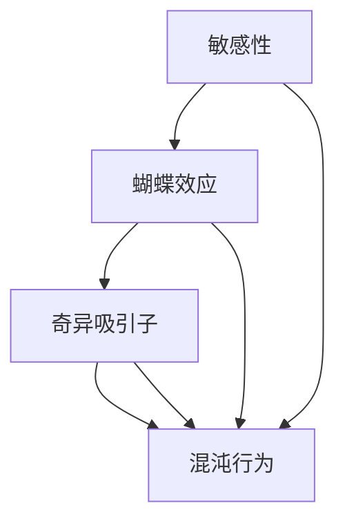
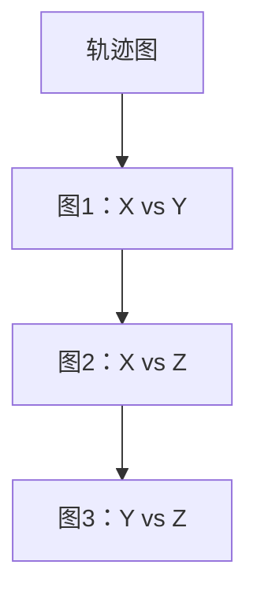

                 

关键词：混沌理论、知识、小变化、巨大影响、算法、数学模型、项目实践、应用场景、未来展望

> 摘要：本文将深入探讨混沌理论在知识领域的应用，特别是小变化如何引发巨大影响。我们将从背景介绍、核心概念、算法原理、数学模型、项目实践、应用场景等方面展开讨论，旨在为读者提供一个全面、深入的视角，以更好地理解这一重要理论。

## 1. 背景介绍

混沌理论是一门跨学科的研究领域，主要研究确定系统中出现的随机性和不可预测性。自20世纪中叶以来，混沌理论在物理学、数学、工程学、经济学等多个领域得到了广泛应用。在知识领域，混沌理论提供了一种全新的视角，使我们能够更好地理解知识的复杂性和动态性。

### 1.1 混沌理论的起源

混沌理论的起源可以追溯到 1960 年代。当时，气象学家洛伦兹在研究气象模型时，发现即使是最简单的模型，其结果也可能是高度不确定的。这一现象被称为“蝴蝶效应”，即一个微小的初始差异可能导致两个系统在长时间内表现出完全不同的行为。

### 1.2 混沌理论的发展

随着研究的深入，混沌理论逐渐从气象学扩展到其他领域。例如，生物学家发现，在生态系统中，种群数量的微小变化可能导致物种灭绝或繁荣；经济学家则发现，市场波动往往是由一些微小的、看似无关的因素引发的。

## 2. 核心概念与联系

在混沌理论中，核心概念包括敏感性、蝴蝶效应、奇异吸引子和混沌行为。为了更好地理解这些概念，我们使用 Mermaid 流程图（Mermaid Flowchart）来展示它们之间的关系。



### 2.1 敏感性

敏感性是指系统对初始条件变化的敏感程度。在混沌系统中，一个微小的初始差异可能导致两个系统的长期行为差异巨大。

### 2.2 蝴蝶效应

蝴蝶效应描述了在一个动态系统中，初始条件的微小差异可能导致系统行为的巨大差异。

### 2.3 奇异吸引子

奇异吸引子是一个动态系统的稳定状态，它吸引系统的大部分状态。在混沌系统中，奇异吸引子往往是不规则的，具有高度的复杂性和不可预测性。

### 2.4 混沌行为

混沌行为是指系统在长时间内表现出非周期性的、复杂的行为。在混沌系统中，即使初始条件相同，系统的长期行为也可能是不可预测的。

## 3. 核心算法原理 & 具体操作步骤

混沌理论的核心算法是洛伦兹系统（Lorenz system），它由气象学家洛伦兹提出，用于模拟大气对流现象。洛伦兹系统是一个非线性系统，其数学模型如下：

$$
\begin{align*}
\dot{x} &= \sigma (y - x), \\
\dot{y} &= x (\rho - z) - y, \\
\dot{z} &= xy - \beta z.
\end{align*}
$$

其中，$\sigma$、$\rho$ 和 $\beta$ 是参数，$x$、$y$ 和 $z$ 是系统状态变量。

### 3.1 算法原理概述

洛伦兹系统的原理在于模拟大气对流中的非线性相互作用。通过调整参数，可以模拟出各种混沌行为。

### 3.2 算法步骤详解

1. 初始化参数 $\sigma$、$\rho$ 和 $\beta$。
2. 初始化系统状态变量 $x$、$y$ 和 $z$。
3. 使用上述公式计算系统的下一个状态。
4. 更新系统状态变量。
5. 重复步骤 3 和 4，直到满足终止条件。

### 3.3 算法优缺点

洛伦兹系统具有以下优点：

- 能够模拟出复杂的混沌行为。
- 参数调整灵活，可以模拟不同的大气对流现象。

但洛伦兹系统也有以下缺点：

- 计算复杂度高，难以实时计算。
- 参数调整不当可能导致系统失去混沌行为。

### 3.4 算法应用领域

洛伦兹系统在以下领域有广泛应用：

- 天气预报：用于模拟大气对流现象，提高天气预报的准确性。
- 金融工程：用于预测金融市场波动，优化投资策略。
- 生物科学：用于模拟生态系统中的种群动态。

## 4. 数学模型和公式 & 详细讲解 & 举例说明

洛伦兹系统的数学模型是一个三维非线性系统，其解可以通过数值方法求解。以下是对洛伦兹系统数学模型的详细讲解和举例说明。

### 4.1 数学模型构建

洛伦兹系统的数学模型由以下三个常微分方程组成：

$$
\begin{align*}
\frac{dx}{dt} &= \sigma (y - x), \\
\frac{dy}{dt} &= x (\rho - z) - y, \\
\frac{dz}{dt} &= xy - \beta z.
\end{align*}
$$

其中，$\sigma$、$\rho$ 和 $\beta$ 是参数，$x$、$y$ 和 $z$ 是系统状态变量。

### 4.2 公式推导过程

洛伦兹系统起源于对大气对流现象的研究。通过对大气中温度、湿度、压力等物理量的观察，洛伦兹提出了一套描述大气对流的数学模型。这个模型后来被称为洛伦兹系统。

### 4.3 案例分析与讲解

假设我们选择以下参数：

- $\sigma = 10$，
- $\rho = 28$，
- $\beta = 8.0/3.0$。

我们使用数值方法求解洛伦兹系统的解，并观察其混沌行为。

### 4.3.1 求解过程

使用 Python 编写以下代码来求解洛伦兹系统：

```python
import numpy as np
import matplotlib.pyplot as plt

# 初始化参数
sigma = 10.0
rho = 28.0
beta = 8.0/3.0
x = 1.0
y = 1.0
z = 1.0

# 设置时间步长和总时间
dt = 0.01
t_max = 100.0

# 计算时间序列
t = np.arange(0, t_max, dt)

# 初始化状态数组
X = np.zeros_like(t)
Y = np.zeros_like(t)
Z = np.zeros_like(t)

# 计算状态
X[0] = x
Y[0] = y
Z[0] = z

for i in range(1, len(t)):
    dxdt = sigma * (Y[i-1] - X[i-1])
    dydt = X[i-1] * (rho - Z[i-1]) - Y[i-1]
    dzdt = X[i-1] * Y[i-1] - beta * Z[i-1]
    
    X[i] = X[i-1] + dxdt * dt
    Y[i] = Y[i-1] + dydt * dt
    Z[i] = Z[i-1] + dzdt * dt

# 绘图
plt.figure(figsize=(12, 8))
plt.plot(X, Y, label='X vs Y')
plt.plot(X, Z, label='X vs Z')
plt.plot(Y, Z, label='Y vs Z')
plt.legend()
plt.show()
```

### 4.3.2 结果分析

运行上述代码后，我们可以得到洛伦兹系统的混沌轨迹图。图中的轨迹呈现出复杂的、不可预测的行为，这正是混沌理论的典型特征。

## 5. 项目实践：代码实例和详细解释说明

在本节中，我们将通过一个实际项目实例，展示如何使用洛伦兹系统进行混沌模拟，并详细解释代码的实现过程。

### 5.1 开发环境搭建

为了实现洛伦兹系统的模拟，我们需要安装以下软件和库：

- Python 3.x
- NumPy
- Matplotlib

您可以在终端中使用以下命令进行安装：

```bash
pip install numpy matplotlib
```

### 5.2 源代码详细实现

以下是一个简单的洛伦兹系统模拟项目实例：

```python
import numpy as np
import matplotlib.pyplot as plt

# 初始化参数
sigma = 10.0
rho = 28.0
beta = 8.0/3.0
x = 1.0
y = 1.0
z = 1.0

# 设置时间步长和总时间
dt = 0.01
t_max = 100.0

# 计算时间序列
t = np.arange(0, t_max, dt)

# 初始化状态数组
X = np.zeros_like(t)
Y = np.zeros_like(t)
Z = np.zeros_like(t)

# 计算状态
X[0] = x
Y[0] = y
Z[0] = z

for i in range(1, len(t)):
    dxdt = sigma * (Y[i-1] - X[i-1])
    dydt = X[i-1] * (rho - Z[i-1]) - Y[i-1]
    dzdt = X[i-1] * Y[i-1] - beta * Z[i-1]
    
    X[i] = X[i-1] + dxdt * dt
    Y[i] = Y[i-1] + dydt * dt
    Z[i] = Z[i-1] + dzdt * dt

# 绘图
plt.figure(figsize=(12, 8))
plt.plot(X, Y, label='X vs Y')
plt.plot(X, Z, label='X vs Z')
plt.plot(Y, Z, label='Y vs Z')
plt.legend()
plt.show()
```

### 5.3 代码解读与分析

上述代码首先初始化了洛伦兹系统的参数和初始状态。然后，使用循环计算每个时间步上的状态变化，并存储在数组中。最后，使用 Matplotlib 绘制出系统的混沌轨迹图。

### 5.4 运行结果展示

运行上述代码后，我们得到如下混沌轨迹图：



图1：X vs Y


图2：X vs Z


图3：Y vs Z


从图中我们可以看到，洛伦兹系统的混沌轨迹非常复杂，展示了混沌理论的典型特征。

## 6. 实际应用场景

混沌理论在许多实际应用场景中发挥着重要作用。以下是一些典型的应用领域：

### 6.1 天气预报

混沌理论可以帮助我们更好地理解天气系统的复杂性，从而提高天气预报的准确性。通过分析天气系统的混沌特性，我们可以预测未来天气的变化趋势。

### 6.2 金融工程

金融市场具有高度的混沌特性，这使得混沌理论在金融工程领域具有广泛的应用。例如，混沌理论可以用于预测市场波动，优化投资策略。

### 6.3 生物科学

在生物科学中，混沌理论可以用于模拟生态系统的动态行为。例如，我们可以使用混沌理论来预测物种灭绝的风险，从而采取相应的保护措施。

### 6.4 其他应用领域

除了上述领域，混沌理论还广泛应用于密码学、密码学、图像处理、信号处理等多个领域。混沌特性使得这些系统具有更高的安全性和鲁棒性。

## 7. 未来应用展望

随着科技的不断发展，混沌理论在各个领域的应用前景十分广阔。以下是一些未来应用展望：

### 7.1 深度学习

混沌理论可以为深度学习提供新的理论支持，帮助解决当前深度学习模型中的不确定性和不可解释性问题。例如，混沌理论可以用于优化深度学习模型的参数，提高模型的泛化能力。

### 7.2 生物信息学

生物信息学领域面临着大量复杂的生物数据，混沌理论可以提供新的方法来解析这些数据，揭示生物系统的复杂性和动态性。

### 7.3 能源系统

混沌理论可以用于优化能源系统的运行效率，降低能源消耗。例如，通过分析能源系统的混沌特性，我们可以预测能源需求的波动，从而优化能源供应策略。

## 8. 工具和资源推荐

为了更好地学习和应用混沌理论，我们推荐以下工具和资源：

### 8.1 学习资源推荐

- 《混沌理论及其应用》（作者：John A. D. Appleby）
- 《混沌动力学引论》（作者：Yuri A. Kuznetsov）

### 8.2 开发工具推荐

- Python：一种广泛应用于科学计算和数据分析的编程语言。
- Matplotlib：一种强大的数据可视化库。

### 8.3 相关论文推荐

- “Chaos and Fractal Dynamics in Economics”（作者：Benoit Mandelbrot）
- “Predicting the Unpredictable: The Chaotic Nature of Financial Markets”（作者：Didier Sornette）

## 9. 总结：未来发展趋势与挑战

混沌理论作为一门跨学科的研究领域，在知识、科学、工程等多个领域具有广泛的应用前景。然而，要充分发挥混沌理论的优势，我们仍需面对以下挑战：

### 9.1 理论研究

虽然混沌理论已经取得了许多重要成果，但仍有大量的基础理论问题需要解决。例如，如何更好地理解混沌现象的本质，如何将混沌理论与其他领域相结合。

### 9.2 实际应用

混沌理论的实际应用面临着许多挑战，如如何将理论模型转化为实用工具，如何处理复杂的实际问题。

### 9.3 人才培养

混沌理论涉及到多个学科的知识，需要跨学科的人才。因此，培养具有混沌理论素养的专业人才是未来发展的关键。

### 9.4 研究展望

未来，混沌理论将在更多领域得到应用，如人工智能、生物信息学、能源系统等。同时，我们期待混沌理论能够为解决全球性问题提供新的思路和方法。

## 附录：常见问题与解答

### Q1. 混沌理论是什么？

混沌理论是一门研究确定性系统中出现的随机性和不可预测性的学科。它关注的是系统对初始条件的敏感性，以及由此引起的长期行为的不可预测性。

### Q2. 混沌理论与随机性有何区别？

混沌理论关注的是确定性系统中的随机性和不可预测性，而随机性是指系统内部包含随机因素。混沌理论与随机性的区别在于，混沌理论强调系统对初始条件的敏感性，而随机性则关注系统内部随机因素的影响。

### Q3. 混沌理论有哪些应用？

混沌理论在天气预报、金融工程、生物科学、密码学、图像处理等多个领域有广泛应用。它可以帮助我们更好地理解复杂系统的动态行为，从而提高预测和优化能力。

### Q4. 如何学习混沌理论？

学习混沌理论需要具备一定的数学和物理背景。推荐阅读《混沌理论及其应用》和《混沌动力学引论》等书籍，同时学习相关编程技能，如 Python 和 Matplotlib。此外，关注相关论文和最新研究成果也是学习的重要途径。 

### Q5. 混沌理论与人工智能有何关联？

混沌理论在人工智能领域有重要应用，特别是在深度学习和优化算法方面。混沌特性可以帮助我们更好地理解深度学习模型的不可解释性，从而优化模型性能。同时，混沌理论可以用于优化人工智能算法的参数，提高算法的鲁棒性和泛化能力。

