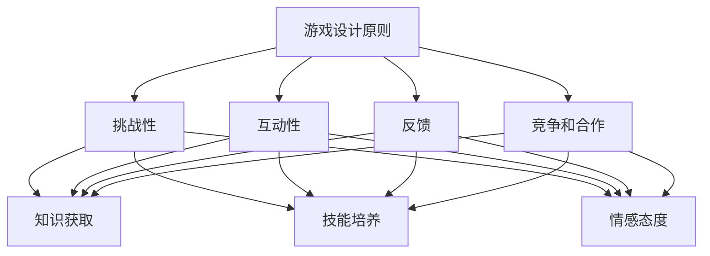

                 

关键词：知识游戏化，学习参与度，教育技术，用户体验，设计策略

> 摘要：本文探讨了知识游戏化的概念，以及如何将游戏元素巧妙地融入到教育技术中，以提高学习者的参与度和动机。通过分析游戏设计原则与教育目标之间的关系，提出了具体的设计策略和案例，旨在为教育领域提供创新的教学方法。

## 1. 背景介绍

在当今信息爆炸的时代，知识获取的方式和渠道日益丰富，但传统的教学模式仍然面临诸多挑战。学生的学习动机普遍较低，学习过程中缺乏参与感和成就感。教育工作者们不断探索如何通过创新的方式激发学生的学习兴趣，提高学习效果。知识游戏化作为一种新兴的教育技术，逐渐受到关注。

知识游戏化指的是将游戏设计原则和元素融入教育过程中，旨在提高学习者的参与度和动机。游戏化设计不仅能够提供娱乐性，还能够通过挑战、反馈和奖励等机制，增强学习者的成就感和满足感。这一概念的兴起，源于游戏设计的成功经验，以及教育心理学对学习动机和参与度研究的深入。

## 2. 核心概念与联系

### 2.1 游戏设计原则

游戏设计包含多个核心原则，如挑战性、互动性、反馈、竞争和合作等。这些原则不仅适用于娱乐游戏，同样可以应用于教育游戏。

**挑战性**：适当的难度和挑战能够激发学习者的学习兴趣和动机。挑战性需要根据学习者的能力水平来设计，确保既不会过于简单，也不会过于复杂。

**互动性**：游戏中的互动性是指学习者能够与环境、其他玩家以及游戏元素进行互动。这种互动性可以增强学习者的参与感和沉浸感。

**反馈**：及时的反馈能够帮助学习者了解自己的学习进度和效果，从而调整学习策略。

**竞争和合作**：竞争和合作机制可以培养学习者的竞争意识和团队合作能力。

### 2.2 教育目标

教育目标包括知识获取、技能培养、情感态度等方面。如何将这些目标与游戏设计原则相结合，是知识游戏化设计的关键。

**知识获取**：游戏化设计可以通过任务、挑战和问题解决等方式，使学习者主动探索和掌握知识。

**技能培养**：游戏中的实践操作和任务解决过程，有助于培养学习者的实际操作能力和问题解决能力。

**情感态度**：游戏中的奖励和反馈机制，可以增强学习者的成就感和满足感，从而培养积极的情感态度。

### 2.3 Mermaid 流程图

以下是一个简化的 Mermaid 流程图，展示了游戏设计原则与教育目标之间的联系：



## 3. 核心算法原理 & 具体操作步骤

### 3.1 算法原理概述

知识游戏化设计的核心算法原理主要包括以下几个方面：

1. **目标设定**：根据教育目标和学习者的特点，设定具体的学习目标。
2. **任务设计**：设计具有挑战性、互动性和反馈的任务，使学习者能够主动参与。
3. **反馈机制**：建立及时的反馈系统，帮助学习者了解学习进度和效果。
4. **奖励系统**：设计奖励系统，增强学习者的成就感和满足感。

### 3.2 算法步骤详解

1. **目标设定**：
   - 分析教育目标和学习者的需求。
   - 设定具体的学习目标，确保目标具有挑战性和可实现性。

2. **任务设计**：
   - 设计具有挑战性的任务，使学习者能够通过努力克服困难。
   - 确保任务具有互动性，使学习者能够与其他人或环境进行互动。
   - 提供反馈机制，使学习者能够及时了解自己的学习进度和效果。

3. **反馈机制**：
   - 设计多种反馈形式，如即时反馈、阶段性反馈和总结反馈。
   - 根据学习者的表现，给予正面的反馈，鼓励继续努力。

4. **奖励系统**：
   - 设定奖励标准，确保奖励与学习者的努力和进步相匹配。
   - 提供多样化的奖励，如积分、徽章、排名等，以满足学习者的不同需求。

### 3.3 算法优缺点

**优点**：
- 提高学习者的参与度和动机。
- 增强学习者的成就感和满足感。
- 提高学习效果，培养实际操作能力和问题解决能力。

**缺点**：
- 设计复杂，需要专业的游戏设计和教育心理学知识。
- 学习者可能对游戏化设计产生依赖，影响对传统学习方式的接受。

### 3.4 算法应用领域

知识游戏化设计可以应用于各个学科领域，如数学、科学、语言等。以下是一些具体的应用场景：

- **在线教育平台**：将知识游戏化设计应用于在线教育平台，提高学习者的学习兴趣和参与度。
- **课程设计**：在课程设计中融入游戏元素，使课程内容更具吸引力。
- **实践操作**：通过游戏化设计，提供实践操作的机会，培养学习者的实际操作能力。

## 4. 数学模型和公式 & 详细讲解 & 举例说明

### 4.1 数学模型构建

知识游戏化设计中的数学模型主要包括以下几个方面：

- **学习曲线**：描述学习者在学习过程中的进步情况。
- **反馈机制**：计算学习者所获得的反馈值。
- **奖励系统**：计算学习者所获得的奖励值。

### 4.2 公式推导过程

以下是一个简化的学习曲线公式：

$$
L(t) = \frac{1}{1 + e^{-kt}}
$$

其中，$L(t)$ 表示学习者在时间 $t$ 时的学习进度，$k$ 为学习速率参数。

### 4.3 案例分析与讲解

以一个数学课程为例，假设一个学生在学习数学课程的过程中，每天的学习进度可以用上述学习曲线来描述。以下是一个具体的案例分析：

- 学习速率参数 $k = 0.1$。
- 学生在第一天学习了 1 小时，学习进度为 $L(1) = 0.625$。
- 学生在第二天学习了 2 小时，学习进度为 $L(2) = 0.746$。

通过上述案例，我们可以看到学习曲线如何描述学生在学习过程中的进步情况。同时，我们还可以根据学习进度，设计相应的反馈和奖励机制，以激发学生的学习兴趣和动机。

## 5. 项目实践：代码实例和详细解释说明

### 5.1 开发环境搭建

为了演示知识游戏化设计的具体实现，我们将使用 Python 编程语言。首先，需要安装以下库：

- Python 3.8 或更高版本
- Flask（用于 Web 应用开发）
- SQLAlchemy（用于数据库操作）
- Flask-Login（用于用户认证）
- Pandas（用于数据处理）

安装命令如下：

```bash
pip install flask sqlalchemy flask-login pandas
```

### 5.2 源代码详细实现

以下是一个简单的知识游戏化设计示例，包括用户注册、登录、学习任务和奖励系统等功能。

```python
# app.py

from flask import Flask, render_template, request, redirect, url_for
from flask_sqlalchemy import SQLAlchemy
from flask_login import LoginManager, UserMixin, login_user, logout_user, login_required, current_user
from werkzeug.security import generate_password_hash, check_password_hash

app = Flask(__name__)
app.config['SQLALCHEMY_DATABASE_URI'] = 'sqlite:///users.db'
app.config['SECRET_KEY'] = 'your_secret_key'

db = SQLAlchemy(app)
login_manager = LoginManager(app)
login_manager.login_view = 'login'

class User(UserMixin, db.Model):
    id = db.Column(db.Integer, primary_key=True)
    username = db.Column(db.String(100), unique=True, nullable=False)
    password = db.Column(db.String(100), nullable=False)

@login_manager.user_loader
def load_user(user_id):
    return User.query.get(int(user_id))

@app.route('/')
@login_required
def home():
    return render_template('home.html')

@app.route('/login', methods=['GET', 'POST'])
def login():
    if request.method == 'POST':
        username = request.form['username']
        password = request.form['password']
        user = User.query.filter_by(username=username).first()
        if user and check_password_hash(user.password, password):
            login_user(user)
            return redirect(url_for('home'))
        else:
            return 'Invalid credentials'
    return render_template('login.html')

@app.route('/logout')
@login_required
def logout():
    logout_user()
    return redirect(url_for('login'))

@app.route('/register', methods=['GET', 'POST'])
def register():
    if request.method == 'POST':
        username = request.form['username']
        password = request.form['password']
        hashed_password = generate_password_hash(password, method='sha256')
        new_user = User(username=username, password=hashed_password)
        db.session.add(new_user)
        db.session.commit()
        return redirect(url_for('login'))
    return render_template('register.html')

if __name__ == '__main__':
    db.create_all()
    app.run(debug=True)
```

### 5.3 代码解读与分析

以上代码实现了一个简单的用户注册、登录和登出功能的 Web 应用。其中，核心部分包括以下三个方面：

- **用户认证**：使用 Flask-Login 提供用户认证功能，包括注册、登录和登出。
- **数据库操作**：使用 SQLAlchemy 进行数据库操作，存储用户信息。
- **Web 模板**：使用 Flask 提供的 Web 模板渲染功能，实现用户界面。

### 5.4 运行结果展示

运行以上代码后，可以通过浏览器访问 Web 应用，进行用户注册、登录和登出操作。以下是一个简单的运行结果展示：

- **用户注册**：用户可以填写注册表单，提交后系统会创建一个新的用户账号。

```html
<!DOCTYPE html>
<html>
<head>
    <title>Register</title>
</head>
<body>
    <h1>Register</h1>
    <form action="/register" method="post">
        <label for="username">Username:</label>
        <input type="text" id="username" name="username" required><br><br>
        <label for="password">Password:</label>
        <input type="password" id="password" name="password" required><br><br>
        <input type="submit" value="Register">
    </form>
</body>
</html>
```

- **用户登录**：用户可以填写登录表单，提交后系统会验证用户身份。

```html
<!DOCTYPE html>
<html>
<head>
    <title> Login</title>
</head>
<body>
    <h1>Login</h1>
    <form action="/login" method="post">
        <label for="username">Username:</label>
        <input type="text" id="username" name="username" required><br><br>
        <label for="password">Password:</label>
        <input type="password" id="password" name="password" required><br><br>
        <input type="submit" value="Login">
    </form>
</body>
</html>
```

- **用户登出**：用户可以在登录状态下，点击登出按钮，退出登录状态。

```html
<!DOCTYPE html>
<html>
<head>
    <title>Logout</title>
</head>
<body>
    <h1>Logout</h1>
    <form action="/logout" method="post">
        <input type="submit" value="Logout">
    </form>
</body>
</html>
```

## 6. 实际应用场景

知识游戏化设计可以广泛应用于各个领域，以下是一些典型的应用场景：

- **在线教育平台**：将知识游戏化设计应用于在线教育平台，可以提高学习者的学习兴趣和参与度。例如，通过设计具有挑战性和互动性的学习任务，使学习者能够在游戏中掌握知识。
- **课程设计**：在课程设计中融入游戏元素，可以增强课程内容的学习效果。例如，在数学课程中，设计数学谜题游戏，使学生在游戏中学习数学知识。
- **培训与考核**：将知识游戏化设计应用于培训与考核，可以增强培训效果和考核的公正性。例如，通过设计模拟考试游戏，使受训者能够在游戏中学习知识，并测试自己的学习成果。

### 6.4 未来应用展望

随着教育技术的不断发展，知识游戏化设计有望在以下方面得到进一步应用和改进：

- **个性化学习**：通过分析学习者的行为数据，设计更加个性化的知识游戏，以满足不同学习者的需求。
- **跨学科融合**：将知识游戏化设计与其他教育技术（如虚拟现实、人工智能等）相结合，实现跨学科的教育创新。
- **智能化反馈**：利用人工智能技术，实现更加智能化的反馈系统，为学习者提供更加精准的学习指导。

## 7. 工具和资源推荐

### 7.1 学习资源推荐

- **《游戏化设计指南》**：一本关于游戏化设计的经典著作，详细介绍了游戏化设计的理论和方法。
- **《游戏化心理学》**：探讨了游戏化设计在心理学中的应用，为教育工作者提供了有益的启示。

### 7.2 开发工具推荐

- **Flask**：一款轻量级的 Web 开发框架，适用于快速开发知识游戏化应用。
- **Pygame**：一款基于 Python 的游戏开发库，适用于开发图形界面的知识游戏。

### 7.3 相关论文推荐

- **“游戏化在教育中的应用”**：探讨了游戏化设计在教育领域的应用前景。
- **“知识游戏化设计的理论与实践”**：从理论和实践两个方面，分析了知识游戏化设计的原理和实施方法。

## 8. 总结：未来发展趋势与挑战

### 8.1 研究成果总结

本文从游戏设计原则、教育目标、数学模型、项目实践等多个角度，探讨了知识游戏化设计的方法和策略。研究结果表明，知识游戏化设计能够有效提高学习者的参与度和动机，具有广泛的应用前景。

### 8.2 未来发展趋势

未来，知识游戏化设计将继续在以下几个方面发展：

- **个性化学习**：通过大数据和人工智能技术，实现更加个性化的知识游戏设计。
- **跨学科融合**：将知识游戏化设计与其他教育技术相结合，实现跨学科的教育创新。
- **智能化反馈**：利用人工智能技术，实现更加智能化的反馈系统，为学习者提供更加精准的学习指导。

### 8.3 面临的挑战

尽管知识游戏化设计具有诸多优势，但在实际应用中仍面临以下挑战：

- **设计复杂性**：知识游戏化设计需要结合游戏设计和教育心理学知识，设计过程较为复杂。
- **学习依赖性**：学习者可能对游戏化设计产生依赖，影响对传统学习方式的接受。
- **教育资源**：知识游戏化设计需要大量的教育资源，如游戏素材、学习材料等，这对教育机构和教师提出了更高的要求。

### 8.4 研究展望

未来，知识游戏化设计研究可以从以下几个方面进行：

- **优化设计方法**：研究更加高效的知识游戏化设计方法，降低设计复杂性。
- **评估与反馈**：建立有效的评估和反馈机制，确保知识游戏化设计能够达到预期的教育效果。
- **跨学科研究**：开展跨学科的研究，探索知识游戏化设计在多个领域的应用价值。

## 9. 附录：常见问题与解答

### 9.1 什么是知识游戏化设计？

知识游戏化设计是将游戏设计原则和元素融入教育过程中，旨在提高学习者的参与度和动机。它通过挑战、反馈和奖励等机制，使学习过程更具娱乐性和吸引力。

### 9.2 知识游戏化设计有哪些优点？

知识游戏化设计可以提高学习者的参与度和动机，增强学习者的成就感和满足感，提高学习效果，培养实际操作能力和问题解决能力。

### 9.3 知识游戏化设计有哪些应用领域？

知识游戏化设计可以应用于在线教育平台、课程设计、培训与考核等多个领域。例如，在线教育平台可以通过知识游戏化设计，提高学习者的学习兴趣和参与度；课程设计可以通过知识游戏化设计，使课程内容更具吸引力；培训与考核可以通过知识游戏化设计，增强培训效果和考核的公正性。

### 9.4 如何进行知识游戏化设计？

进行知识游戏化设计需要结合游戏设计和教育心理学知识，具体步骤包括目标设定、任务设计、反馈机制和奖励系统设计等。同时，需要根据教育目标和学习者的特点，确保知识游戏化设计的有效性和可行性。

---

以上是关于知识游戏化设计的详细文章。文章涵盖了知识游戏化设计的背景、核心概念、算法原理、项目实践、实际应用场景、未来发展趋势与挑战，以及相关工具和资源推荐等内容。希望这篇文章能够为教育工作者和研究人员提供有价值的参考和启示。作者：禅与计算机程序设计艺术 / Zen and the Art of Computer Programming。  
------------------------------------------------------------------

