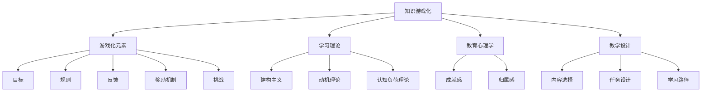

                 

关键词：知识游戏化、寓教于乐、学习革命、教育技术、互动学习

> 摘要：本文探讨了知识游戏化的理念，即通过将教育内容与游戏元素相结合，创造一种寓教于乐的学习体验。这种新兴的教育模式不仅能够提高学生的学习兴趣，还能有效提升其学习效果，为现代教育领域带来一场革命。

## 1. 背景介绍

在当今信息爆炸的时代，知识的获取变得前所未有的便捷。然而，传统的教育模式往往难以激发学生的主动学习热情，学习效果也往往不尽如人意。教育技术的不断发展，为我们提供了一种全新的解决方案——知识游戏化。知识游戏化旨在通过游戏的方式，将枯燥的知识点转化为有趣的游戏任务，从而激发学生的学习兴趣和积极性。

### 知识游戏化的定义

知识游戏化（Gamification of Learning）是一种将游戏设计原理应用于非游戏环境，特别是教育领域，以增强学习体验和效果的方法。这种方法的核心在于利用游戏中的激励机制、挑战、成就和社交互动，让学习过程变得更加有趣、有动力和有参与感。

### 知识游戏化的历史与发展

知识游戏化的概念起源于游戏设计，但它的应用范围逐渐扩展到教育领域。近年来，随着教育技术的进步和互联网的普及，知识游戏化在教育中的应用越来越广泛，不仅涵盖了K-12教育，也包括了成人教育和职业培训。

## 2. 核心概念与联系

### 核心概念

知识游戏化涉及多个核心概念，包括游戏化元素、学习理论、教育心理学和教学设计等。这些概念共同构成了知识游戏化的理论基础。

#### 游戏化元素

游戏化元素是指从游戏中提取并应用于非游戏情境的设计要素，如：

- **目标**：设定明确的学习目标和任务。
- **规则**：制定清晰的规则和操作指南。
- **反馈**：通过即时反馈鼓励用户进行正确操作。
- **奖励机制**：提供各种形式的奖励，如积分、徽章、排名等。
- **挑战**：设置难度逐渐增加的任务，以保持用户的学习动力。

#### 学习理论

知识游戏化融合了多种学习理论，如：

- **建构主义学习理论**：强调学习者通过主动构建知识体系来获得理解。
- **动机理论**：探讨如何通过外部和内部动机激发学习者的学习动力。
- **认知负荷理论**：研究如何有效分配认知资源，以减轻学习者的认知负荷。

#### 教育心理学

教育心理学在知识游戏化中的应用主要体现在对学习者心理需求的了解和满足，如：

- **成就感**：通过奖励和成就感的赋予，增强学习者的自信心和满足感。
- **归属感**：通过社交互动和团队合作，提升学习者的归属感和参与感。

#### 教学设计

知识游戏化要求教学设计者充分考虑游戏元素和教学内容的结合，设计出既有趣又有教育意义的课程。教学设计的关键在于：

- **内容选择**：选择与游戏元素结合紧密的知识点。
- **任务设计**：设计具有挑战性和趣味性的学习任务。
- **学习路径**：设计合理的难度递增和学习路径。

### Mermaid 流程图



## 3. 核心算法原理 & 具体操作步骤

### 3.1 算法原理概述

知识游戏化的核心算法原理可以概括为以下三个步骤：

1. **识别学习目标**：明确学生需要掌握的知识点和技能。
2. **设计游戏化元素**：根据学习目标，设计相应的游戏化元素，如任务、规则、反馈和奖励。
3. **实施教学**：将游戏化元素融入到教学过程中，创造一个有趣且有教育意义的学习环境。

### 3.2 算法步骤详解

1. **需求分析**：首先，分析学生的需求和学习目标，确定需要教授的知识点和技能。
2. **设计游戏框架**：根据需求分析结果，设计游戏的整体框架，包括游戏规则、任务、奖励机制等。
3. **开发游戏化内容**：将教学内容转化为游戏化内容，设计具体的任务和挑战，确保游戏内容与教学目标一致。
4. **实施教学**：将游戏化内容融入到实际教学过程中，监控学生的学习进度和表现，及时给予反馈和奖励。
5. **评估与优化**：通过评估学生的学习成果和反馈，不断优化游戏化内容和教学过程。

### 3.3 算法优缺点

#### 优点

- **提高学习兴趣**：游戏化的学习环境能够激发学生的学习兴趣，提高学习主动性。
- **增强学习动力**：通过奖励机制和成就感，增强学生的学习动力。
- **促进协作学习**：游戏化内容往往需要团队合作，有助于培养学生的团队合作能力和沟通技巧。
- **适应个性化学习**：游戏化内容可以根据学生的学习进度和兴趣进行个性化调整。

#### 缺点

- **设计成本高**：游戏化内容的设计和开发需要大量的时间和资源。
- **实施难度大**：游戏化教学需要教师具备一定的游戏设计和教学能力。
- **技术依赖性**：游戏化教学需要依赖一定的技术支持，如游戏引擎和教学平台。

### 3.4 算法应用领域

知识游戏化在教育领域的应用非常广泛，包括：

- **K-12教育**：通过游戏化的学习任务和挑战，提高学生的知识掌握能力和兴趣。
- **成人教育**：通过游戏化的培训项目，提高职场人士的专业技能和工作效率。
- **在线学习**：通过游戏化的课程设计和互动，提高远程教育的学习效果。

## 4. 数学模型和公式 & 详细讲解 & 举例说明

### 4.1 数学模型构建

知识游戏化的数学模型主要涉及以下几个方面：

1. **学习效果模型**：用于评估学生的学习成果。
2. **动机模型**：用于分析学生的学习动机。
3. **奖励机制模型**：用于设计奖励机制。

#### 学习效果模型

学习效果模型可以采用以下公式：

\[ E = f(K, M, R) \]

其中，\( E \) 表示学习效果，\( K \) 表示知识掌握度，\( M \) 表示学习动机，\( R \) 表示奖励机制。

#### 动机模型

动机模型可以采用以下公式：

\[ M = f(C, A, S) \]

其中，\( M \) 表示学习动机，\( C \) 表示挑战度，\( A \) 表示成就度，\( S \) 表示社交互动。

#### 奖励机制模型

奖励机制模型可以采用以下公式：

\[ R = f(I, T) \]

其中，\( R \) 表示奖励机制，\( I \) 表示即时反馈，\( T \) 表示任务完成度。

### 4.2 公式推导过程

#### 学习效果模型推导

学习效果模型主要基于以下假设：

- 知识掌握度 \( K \) 越高，学习效果 \( E \) 越好。
- 学习动机 \( M \) 越强，学习效果 \( E \) 越好。
- 奖励机制 \( R \) 越有效，学习效果 \( E \) 越好。

基于上述假设，我们可以得到以下推导：

\[ E = f(K, M, R) \]

#### 动机模型推导

动机模型主要基于以下假设：

- 挑战度 \( C \) 越高，学习动机 \( M \) 越强。
- 成就度 \( A \) 越高，学习动机 \( M \) 越强。
- 社交互动 \( S \) 越多，学习动机 \( M \) 越强。

基于上述假设，我们可以得到以下推导：

\[ M = f(C, A, S) \]

#### 奖励机制模型推导

奖励机制模型主要基于以下假设：

- 即时反馈 \( I \) 越及时，奖励机制 \( R \) 越有效。
- 任务完成度 \( T \) 越高，奖励机制 \( R \) 越有效。

基于上述假设，我们可以得到以下推导：

\[ R = f(I, T) \]

### 4.3 案例分析与讲解

#### 案例一：在线编程课程

假设我们设计一门在线编程课程，课程目标包括熟悉Python编程语言、掌握基本数据结构和算法。我们可以采用以下公式进行建模：

\[ E = f(K, M, R) \]

- **知识掌握度 \( K \)**：通过编程练习和测试，定期评估学生的知识掌握度。
- **学习动机 \( M \)**：设置难度逐渐增加的编程任务，让学生在不断挑战中保持学习动机。
- **奖励机制 \( R \)**：在每次编程任务完成后，给予即时反馈和积分奖励，激励学生继续学习。

#### 案例二：编程竞赛

假设我们组织一场编程竞赛，竞赛目标包括提高编程技能、培养团队合作精神。我们可以采用以下公式进行建模：

\[ M = f(C, A, S) \]

- **挑战度 \( C \)**：设置难度较高的编程题目，让学生在竞争中不断突破自我。
- **成就度 \( A \)**：通过排名和奖项，让学生感受到成就感和自豪感。
- **社交互动 \( S \)**：组织线下比赛和线上讨论，促进学生之间的交流和合作。

## 5. 项目实践：代码实例和详细解释说明

### 5.1 开发环境搭建

为了实现知识游戏化，我们需要搭建一个适当的技术环境。以下是一个简单的开发环境搭建步骤：

1. **安装Python**：确保计算机上安装了Python 3.x版本。
2. **安装游戏引擎**：可以选择Pygame等游戏引擎，用于实现游戏化功能。
3. **安装教学平台**：如Moodle等，用于管理课程内容和学生进度。

### 5.2 源代码详细实现

以下是一个简单的Python代码实例，实现了一个基础的知识游戏化教学任务：

```python
import pygame
from pygame.locals import *
from random import *

# 初始化Pygame
pygame.init()

# 设置屏幕尺寸
width, height = 800, 600
screen = pygame.display.set_mode((width, height))
pygame.display.set_caption("知识游戏化教学任务")

# 设置颜色
BLACK = (0, 0, 0)
WHITE = (255, 255, 255)

# 游戏循环标志
running = True

# 游戏主循环
while running:
    # 检查事件
    for event in pygame.event.get():
        if event.type == QUIT:
            running = False

    # 绘制背景
    screen.fill(WHITE)

    # 绘制文本
    font = pygame.font.SysFont(None, 36)
    text = font.render("请回答以下问题：Python的官方版本是哪个？", True, BLACK)
    screen.blit(text, (100, 100))

    # 绘制答案选择
    font = pygame.font.SysFont(None, 24)
    answer1 = font.render("2.x", True, BLACK)
    answer2 = font.render("3.x", True, BLACK)
    screen.blit(answer1, (100, 200))
    screen.blit(answer2, (100, 250))

    # 检测按键
    keys = pygame.key.get_pressed()
    if keys[K_a]:
        correct_answer = "3.x"
    elif keys[K_b]:
        correct_answer = "2.x"
    else:
        correct_answer = ""

    # 给出即时反馈
    if correct_answer:
        font = pygame.font.SysFont(None, 36)
        text = font.render("恭喜你，回答正确！", True, BLACK)
        screen.blit(text, (100, 300))
    else:
        font = pygame.font.SysFont(None, 36)
        text = font.render("请再尝试一下！", True, BLACK)
        screen.blit(text, (100, 300))

    # 更新屏幕
    pygame.display.flip()

# 退出游戏
pygame.quit()
```

### 5.3 代码解读与分析

上述代码实现了一个简单的知识游戏化教学任务，主要包含以下几个部分：

1. **初始化Pygame**：设置游戏窗口、标题和颜色。
2. **游戏主循环**：处理事件、绘制界面、检测按键和更新屏幕。
3. **文本和答案选择**：在屏幕上绘制问题和答案选项。
4. **即时反馈**：根据学生的答案，给出即时反馈。

### 5.4 运行结果展示

运行上述代码后，会打开一个窗口，显示问题和答案选项。学生可以通过键盘上的“A”或“B”键选择答案，系统会根据答案的正确性给出即时反馈。

## 6. 实际应用场景

知识游戏化在教育领域的实际应用场景非常广泛，以下列举几个典型的应用实例：

### 6.1 K-12教育

在K-12教育中，知识游戏化可以通过各种教育软件和应用程序，将数学、科学、语文等学科的知识点转化为有趣的游戏任务。例如，学生可以通过解决数学谜题、参与科学实验、阅读互动故事等方式学习知识。

### 6.2 成人教育

成人教育中，知识游戏化可以用于职业技能培训和继续教育。通过设计游戏化的培训项目，如模拟交易、项目管理竞赛等，可以提高职场人士的专业技能和工作效率。

### 6.3 在线学习

在线学习中，知识游戏化可以增强学生的学习体验和参与度。例如，通过设计游戏化的课程内容、互动讨论区和在线竞赛，可以提高远程教育的学习效果。

### 6.4 未来教育

随着人工智能和虚拟现实技术的不断发展，知识游戏化在未来教育中的应用前景将更加广阔。例如，通过构建虚拟现实课堂、智能辅导系统和个性化学习路径，可以实现更加高效和有趣的教育体验。

## 7. 工具和资源推荐

### 7.1 学习资源推荐

- **Codecademy**：一个在线编程学习平台，提供互动式的编程课程。
- **Khan Academy**：一个提供各种学科免费在线课程的非营利组织，包括数学、科学、编程等。
- **Duolingo**：一个流行的语言学习应用，采用游戏化元素提高学习兴趣。

### 7.2 开发工具推荐

- **Pygame**：一个流行的Python游戏开发库，适合初学者。
- **Unity**：一个功能强大的游戏开发引擎，支持多种平台。
- **Scratch**：一个面向儿童的编程工具，通过拖拽代码块实现编程。

### 7.3 相关论文推荐

- **"The Gamification of Learning and Instruction: Game-based Methods and Strategies for Training and Education"** by Karl M. Kapp
- **"Gamification at Work: Designing Engaging Business Software"** by G. J. Williams
- **"Using Games to Enhance Education"** by Constance Steinkuehler

## 8. 总结：未来发展趋势与挑战

### 8.1 研究成果总结

知识游戏化作为一种新兴的教育模式，已经在多个领域取得了显著的研究成果。研究表明，知识游戏化能够有效提高学生的学习兴趣、学习动力和学业成绩。此外，知识游戏化还促进了学生的协作学习、创新思维和问题解决能力。

### 8.2 未来发展趋势

未来，知识游戏化将继续在教育领域发挥重要作用，预计将有以下发展趋势：

- **个性化学习**：通过人工智能和大数据技术，实现更加个性化的知识游戏化教学。
- **跨学科整合**：知识游戏化将更加注重跨学科整合，促进学生的全面发展。
- **虚拟现实应用**：虚拟现实技术的普及将使知识游戏化教学更加沉浸和互动。

### 8.3 面临的挑战

尽管知识游戏化具有许多优点，但在实际应用中仍面临以下挑战：

- **设计成本**：知识游戏化内容的设计和开发需要大量的人力和时间投入。
- **教师培训**：教师需要接受相关培训，掌握知识游戏化的教学方法和技巧。
- **技术依赖**：知识游戏化教学需要依赖一定的技术支持，如游戏引擎和教学平台。

### 8.4 研究展望

未来，知识游戏化的研究应重点关注以下几个方面：

- **算法优化**：研究更加高效和智能的知识游戏化算法，提高学习效果。
- **教学效果评估**：建立科学的教学效果评估体系，为知识游戏化的应用提供数据支持。
- **跨学科融合**：探索知识游戏化在跨学科教育中的应用，促进学生的全面发展。

## 9. 附录：常见问题与解答

### 9.1 问题1：知识游戏化是否适用于所有学科？

答：知识游戏化可以适用于大部分学科，但某些学科可能需要特别的设计和调整。例如，艺术、历史等学科可能更适合采用图像、故事等游戏化元素。

### 9.2 问题2：知识游戏化如何保证学习效果？

答：知识游戏化通过设定明确的学习目标、设计挑战性和趣味性的任务、提供即时反馈和奖励机制等方式，确保学习效果。同时，教师应不断评估和调整游戏化内容，以适应学生的需求。

### 9.3 问题3：知识游戏化是否会影响学生的学术成绩？

答：研究表明，知识游戏化能够提高学生的学习兴趣和学业成绩。但具体效果取决于游戏化内容的设计和质量，以及教师的教学方法和学生个体差异。

### 9.4 问题4：知识游戏化是否需要教师具备特殊技能？

答：知识游戏化教学确实需要教师具备一定的游戏设计和教学能力。但通过相关培训，教师可以掌握知识游戏化的基本方法和技巧，有效实施游戏化教学。

作者：禅与计算机程序设计艺术 / Zen and the Art of Computer Programming
----------------------------------------------------------------

### 总结

知识游戏化作为一种创新的教育模式，通过将教育内容与游戏元素相结合，创造了一种寓教于乐的学习体验。这不仅激发了学生的学习兴趣和动力，还提升了其学习效果。随着教育技术的不断进步，知识游戏化在未来教育中将发挥更加重要的作用。然而，要实现知识游戏化的广泛应用，我们还需要克服设计成本、教师培训和技术依赖等挑战。通过持续的研究和探索，我们有理由相信，知识游戏化将为教育领域带来一场深刻的变革。

