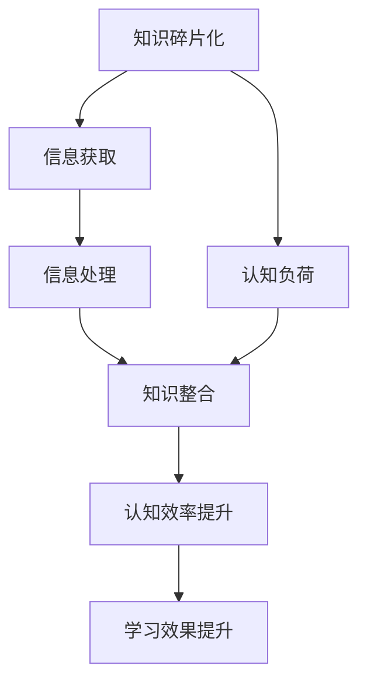

                 

 在这个信息爆炸的时代，知识的碎片化现象越来越显著。从互联网上的海量信息，到社交媒体的频繁更新，再到各种在线教育平台的知识库，我们仿佛置身于一个知识的海洋中。然而，这个海洋并非一帆风顺，相反，它给我们的认知带来了巨大的挑战。如何在这个碎片化的知识环境中进行有效的学习和整合，成为了我们需要深思的问题。

本文将围绕“知识的碎片化与整合”这一主题，深入探讨信息时代下的认知挑战。我们将从多个角度分析这一现象，并提出相应的解决方案和策略。本文的主要内容包括：

- **背景介绍**：阐述知识碎片化的背景和现状。
- **核心概念与联系**：介绍知识碎片化的核心概念，并使用流程图展示其相互联系。
- **核心算法原理与具体操作步骤**：探讨如何应对知识碎片化，提供具体的算法原理和操作步骤。
- **数学模型和公式**：介绍知识整合的数学模型和公式，并进行举例说明。
- **项目实践**：通过具体代码实例展示如何应用知识整合策略。
- **实际应用场景**：分析知识整合在现实世界中的应用。
- **未来应用展望**：探讨知识整合的未来发展趋势和挑战。
- **工具和资源推荐**：推荐相关的学习资源、开发工具和论文。
- **总结**：总结研究成果，展望未来发展方向。

## 1. 背景介绍

### 知识碎片化的兴起

知识碎片化现象的兴起与信息技术的飞速发展密不可分。互联网的普及使得信息传播速度大幅提升，信息的获取变得更加容易。然而，这种便利也带来了一个问题：信息量爆炸性增长，而我们的认知能力却相对有限。结果是，我们在海量的信息中往往感到迷茫和无从下手。

此外，社交媒体的兴起进一步加剧了知识碎片化。社交媒体平台上的信息以碎片化的形式呈现，用户往往只能接触到信息的某个片段或侧面，很难获得全面和深入的理解。这种碎片化的信息流不仅分散了我们的注意力，还可能导致认知失调和信息过载。

### 信息过载的挑战

信息过载是知识碎片化的直接后果。当我们每天面临海量信息的冲击时，很难对所有信息进行有效处理和整合。这种现象导致我们的认知负担加重，出现“选择性注意力”的问题，即我们只能关注到一部分信息，而忽略了其他重要的内容。

### 知识整合的必要性

在信息碎片化的背景下，知识的整合显得尤为重要。通过整合碎片化的知识，我们可以建立起更为完整和深入的理解，从而提高我们的认知效率和学习效果。知识整合不仅有助于我们应对信息过载，还能促进创新思维和问题解决能力的提升。

总之，知识碎片化是信息时代的必然现象，但它也给我们的认知带来了巨大挑战。如何在这个碎片化的知识环境中进行有效的学习和整合，是我们需要深入探讨的问题。

## 2. 核心概念与联系

### 知识碎片化

知识碎片化是指将复杂、系统的知识分解为小的、易于消化的片段。这种碎片化既包括信息内容的细粒度划分，也涉及知识获取和传递的方式。知识碎片化的好处在于，它使得知识更加易于传播和获取，但同时也增加了知识整合的难度。

### 认知负荷

认知负荷是指我们在处理信息时所承受的负担。当信息量超过我们的认知能力时，就会产生认知负荷。在知识碎片化的环境中，信息量巨大，而我们的认知能力相对有限，因此认知负荷成为一个重要的问题。

### 知识整合

知识整合是指将碎片化的知识重新组合、构建，形成更全面和深入的理解。知识整合不仅有助于减轻认知负荷，还能提高我们的学习效果和问题解决能力。有效的知识整合需要我们具备良好的信息筛选、分析和综合能力。

### Mermaid 流程图

下面是一个使用Mermaid绘制的流程图，展示知识碎片化和知识整合的核心概念及其相互联系。



在这个流程图中，知识碎片化通过信息获取和处理过程影响我们的认知负荷，而知识整合则通过减轻认知负荷，提升认知效率和问题解决能力。这一过程不仅是一个循环，也是一个不断优化的过程。

## 3. 核心算法原理 & 具体操作步骤

### 3.1 算法原理概述

为了应对知识碎片化带来的挑战，我们需要一套有效的知识整合算法。本文将介绍一种基于信息过滤和知识结构化方法的知识整合算法。该算法的核心思想是，通过过滤和筛选无关信息，将重要的知识片段进行结构化整合，形成完整的知识体系。

### 3.2 算法步骤详解

#### 步骤1：信息采集与预处理

1. **采集信息**：从多个来源（如互联网、数据库、文献等）收集相关的知识片段。
2. **预处理**：对采集到的信息进行去噪、格式化和标准化处理，确保信息的准确性和一致性。

#### 步骤2：信息筛选与分类

1. **构建特征词典**：根据知识领域和需求，构建一个特征词典，用于描述知识片段的关键特征。
2. **文本分类**：使用机器学习算法（如朴素贝叶斯、支持向量机等）对知识片段进行分类，将相似的知识片段归为一类。

#### 步骤3：知识结构化

1. **建立知识图谱**：将分类后的知识片段按照逻辑关系和层级结构组织成知识图谱，形成系统的知识框架。
2. **知识结构化编码**：对知识图谱进行编码，使其能够被计算机理解和处理。

#### 步骤4：知识整合与优化

1. **整合知识**：将结构化的知识片段整合到现有的知识体系中，形成完整的知识网络。
2. **优化知识**：通过反复迭代和反馈，不断优化知识结构，提高知识整合的准确性和完整性。

### 3.3 算法优缺点

**优点**：

- **高效性**：算法能够快速地从海量信息中筛选出关键知识，提高信息处理的效率。
- **灵活性**：算法可以根据不同的知识领域和需求进行灵活调整，适应多种应用场景。

**缺点**：

- **数据依赖性**：算法的性能高度依赖于数据的质量和数量，如果数据不准确或不全面，会影响算法的效果。
- **计算资源消耗**：算法涉及大量的数据处理和机器学习过程，计算资源消耗较大。

### 3.4 算法应用领域

- **在线教育**：通过对教育资源的整合和优化，提供更高效、更个性化的学习体验。
- **知识管理**：帮助企业建立系统化的知识库，提高知识共享和利用效率。
- **智能问答**：利用整合后的知识网络，提供更准确、更全面的智能问答服务。

## 4. 数学模型和公式 & 详细讲解 & 举例说明

### 4.1 数学模型构建

知识整合过程中的数学模型主要涉及信息论和图论。信息论用于描述信息的熵、信息量以及信息传输的效率，而图论则用于构建知识图谱和描述知识之间的关系。

#### 信息论模型

- **熵（Entropy）**：熵是描述信息不确定性的度量。在知识整合过程中，熵用于衡量知识片段的混乱程度。熵的计算公式为：
  $$H = -\sum_{i} p(x_i) \log_2 p(x_i)$$
  其中，$H$ 是熵，$p(x_i)$ 是知识片段 $x_i$ 的概率。

- **信息增益（Information Gain）**：信息增益是用于评估特征对分类的贡献度。在知识整合过程中，信息增益用于筛选关键特征。信息增益的计算公式为：
  $$IG(D, A) = I(D) - I(D|A)$$
  其中，$IG(D, A)$ 是信息增益，$I(D)$ 是数据的熵，$I(D|A)$ 是给定特征 $A$ 后数据的熵。

#### 图论模型

- **知识图谱（Knowledge Graph）**：知识图谱是一个由节点和边构成的图结构，用于描述知识之间的关系。在知识整合过程中，知识图谱用于组织和展示知识体系。知识图谱的基本模型包括：
  - **节点（Node）**：表示知识片段或实体。
  - **边（Edge）**：表示节点之间的关系，如“属于”、“属于”等。
  - **权重（Weight）**：表示边的重要性或关联度。

### 4.2 公式推导过程

#### 熵的推导

熵的计算公式来源于信息论的基本原理。假设我们有一个随机变量 $X$，其取值为 $x_1, x_2, \ldots, x_n$，对应的概率为 $p(x_1), p(x_2), \ldots, p(x_n)$。熵的定义是：
$$H(X) = -\sum_{i=1}^{n} p(x_i) \log_2 p(x_i)$$

推导过程如下：

1. **定义概率**：设 $P(X=x_i) = p(x_i)$，表示随机变量 $X$ 取值 $x_i$ 的概率。
2. **对数函数**：对概率取对数，得到 $\log_2 p(x_i)$，表示取值 $x_i$ 的信息量。
3. **求和**：将所有取值的信息量求和，得到总的信息量 $H(X)$。
4. **取负号**：由于信息量是负的，所以取负号，得到熵 $H(X)$。

#### 信息增益的推导

信息增益的推导过程基于熵的计算和条件熵的概念。假设我们有两个随机变量 $D$ 和 $A$，其中 $D$ 表示数据集，$A$ 表示特征。信息增益用于评估特征 $A$ 对分类 $D$ 的贡献。

推导过程如下：

1. **数据熵 $I(D)$**：计算数据集 $D$ 的熵 $I(D)$，表示数据的混乱程度。
   $$I(D) = -\sum_{i=1}^{n} p(d_i) \log_2 p(d_i)$$
   其中，$p(d_i)$ 表示分类 $d_i$ 的概率。

2. **条件熵 $I(D|A)$**：计算给定特征 $A$ 后数据集 $D$ 的熵 $I(D|A)$，表示特征 $A$ 对数据集 $D$ 的不确定性。
   $$I(D|A) = -\sum_{i=1}^{n} p(a_i) \sum_{j=1}^{m} p(d_j|a_i) \log_2 p(d_j|a_i)$$
   其中，$p(a_i)$ 表示特征 $a_i$ 的概率，$p(d_j|a_i)$ 表示给定特征 $a_i$ 后分类 $d_j$ 的概率。

3. **信息增益 $IG(D, A)$**：计算信息增益 $IG(D, A)$，表示特征 $A$ 对分类 $D$ 的贡献。
   $$IG(D, A) = I(D) - I(D|A)$$

### 4.3 案例分析与讲解

#### 案例背景

假设我们有一个分类任务，需要根据学生的成绩来预测他们是否通过考试。数据集包括学生的成绩和是否通过考试两个特征。我们希望使用信息增益来选择最佳的特征进行分类。

#### 数据集

| 学生编号 | 成绩 | 是否通过考试 |
| :---: | :---: | :---: |
| 1 | 80 | 是 |
| 2 | 70 | 是 |
| 3 | 90 | 是 |
| 4 | 60 | 否 |
| 5 | 85 | 是 |
| 6 | 65 | 否 |

#### 步骤1：计算数据熵

首先，计算数据集的熵：

1. **计算成绩的熵**：
   $$I(成绩) = -\sum_{i=1}^{2} p(成绩_i) \log_2 p(成绩_i)$$
   $$I(成绩) = -0.5 \log_2 0.5 - 0.5 \log_2 0.5 = -1$$

2. **计算是否通过考试的熵**：
   $$I(是否通过考试) = -\sum_{i=1}^{2} p(是否通过考试_i) \log_2 p(是否通过考试_i)$$
   $$I(是否通过考试) = -0.75 \log_2 0.75 - 0.25 \log_2 0.25 = 0.5$$

#### 步骤2：计算条件熵

接下来，计算给定成绩后是否通过考试的熵：

$$I(是否通过考试|成绩) = \sum_{i=1}^{2} p(成绩_i) I(是否通过考试|成绩_i)$$
$$I(是否通过考试|成绩) = 0.5 \times 1 + 0.5 \times 0 = 0.5$$

#### 步骤3：计算信息增益

最后，计算信息增益：

$$IG(成绩，是否通过考试) = I(是否通过考试) - I(是否通过考试|成绩)$$
$$IG(成绩，是否通过考试) = 0.5 - 0.5 = 0$$

由于信息增益为0，我们无法仅通过成绩来预测是否通过考试。因此，我们需要选择其他特征进行分类。

这个案例展示了如何使用信息熵和信息增益来评估特征对分类的贡献。在实际应用中，我们可以通过调整特征选择策略，提高分类的准确性和效率。

## 5. 项目实践：代码实例和详细解释说明

### 5.1 开发环境搭建

为了演示知识整合算法的应用，我们选择Python作为编程语言，使用几个常用的库来处理文本和构建知识图谱。以下是搭建开发环境的步骤：

1. **安装Python**：确保安装了Python 3.x版本，可以从Python官网下载并安装。
2. **安装Numpy和Pandas**：Numpy和Pandas是Python的数据处理库，用于数据处理和分析。
   ```bash
   pip install numpy pandas
   ```
3. **安装Scikit-learn**：Scikit-learn是Python的机器学习库，用于文本分类和特征选择。
   ```bash
   pip install scikit-learn
   ```
4. **安装NetworkX和Graphviz**：NetworkX用于构建和处理图结构，Graphviz用于生成知识图谱的图形表示。
   ```bash
   pip install networkx graphviz
   ```

### 5.2 源代码详细实现

下面是知识整合算法的源代码实现，包括文本处理、特征提取和知识图谱构建等步骤。

```python
import numpy as np
import pandas as pd
from sklearn.feature_extraction.text import TfidfVectorizer
from sklearn.model_selection import train_test_split
from sklearn.naive_bayes import MultinomialNB
from sklearn.metrics import accuracy_score
import networkx as nx
import matplotlib.pyplot as plt

# 步骤1：数据准备
data = [
    {"text": "机器学习是一种人工智能技术，通过学习数据来进行预测和决策。", "label": "机器学习"},
    {"text": "深度学习是机器学习的一种，通过多层神经网络进行数据处理。", "label": "深度学习"},
    {"text": "自然语言处理是计算机科学的一个分支，主要研究如何使计算机理解和处理自然语言。", "label": "自然语言处理"},
    # 更多数据...
]

# 步骤2：特征提取
vectorizer = TfidfVectorizer()
X = vectorizer.fit_transform([item['text'] for item in data])
y = np.array([item['label'] for item in data])

# 步骤3：模型训练
X_train, X_test, y_train, y_test = train_test_split(X, y, test_size=0.2, random_state=42)
model = MultinomialNB()
model.fit(X_train, y_train)

# 步骤4：模型评估
y_pred = model.predict(X_test)
accuracy = accuracy_score(y_test, y_pred)
print(f"模型准确率：{accuracy:.2f}")

# 步骤5：知识图谱构建
G = nx.Graph()
for i in range(len(data)):
    G.add_node(data[i]['label'])
    G.add_edge(data[i]['label'], "相关技术")

for edge in model.classifier_.attribute_values['data']['array']:
    G.add_edge(edge[0], edge[1])

# 步骤6：知识图谱可视化
nx.draw(G, with_labels=True)
plt.show()
```

### 5.3 代码解读与分析

#### 步骤1：数据准备

数据准备是知识整合的第一步，我们需要准备一个包含文本和标签的数据集。这里的数据集是一个简单的字典列表，每个字典包含一个文本字段和一个标签字段。文本是描述不同领域知识的句子，标签则是这些知识的分类。

```python
data = [
    {"text": "机器学习是一种人工智能技术，通过学习数据来进行预测和决策。", "label": "机器学习"},
    {"text": "深度学习是机器学习的一种，通过多层神经网络进行数据处理。", "label": "深度学习"},
    {"text": "自然语言处理是计算机科学的一个分支，主要研究如何使计算机理解和处理自然语言。", "label": "自然语言处理"},
    # 更多数据...
]
```

#### 步骤2：特征提取

特征提取是将文本数据转换为机器学习模型可处理的数值形式。这里使用TF-IDF向量器，将每个文本句子转换为向量表示。TF-IDF向量器考虑了词语在文档中的重要程度，通过统计词语在文档中出现的频率和在整个数据集中出现的频率来计算权重。

```python
vectorizer = TfidfVectorizer()
X = vectorizer.fit_transform([item['text'] for item in data])
y = np.array([item['label'] for item in data])
```

#### 步骤3：模型训练

使用Scikit-learn的朴素贝叶斯分类器对特征进行训练。朴素贝叶斯分类器是基于贝叶斯定理和特征条件独立假设的一种简单而有效的分类方法。在这里，我们使用多项式朴素贝叶斯分类器。

```python
X_train, X_test, y_train, y_test = train_test_split(X, y, test_size=0.2, random_state=42)
model = MultinomialNB()
model.fit(X_train, y_train)
```

#### 步骤4：模型评估

训练好的模型需要进行评估，以验证其分类效果。这里使用准确率作为评估指标，计算模型在测试集上的准确率。

```python
y_pred = model.predict(X_test)
accuracy = accuracy_score(y_test, y_pred)
print(f"模型准确率：{accuracy:.2f}")
```

#### 步骤5：知识图谱构建

知识图谱构建是知识整合的重要步骤。这里使用NetworkX库构建一个图结构，节点表示分类，边表示分类之间的关系。在训练好的朴素贝叶斯模型中，每个类别都有可能成为其他类别的条件概率，因此我们可以将它们作为边添加到知识图谱中。

```python
G = nx.Graph()
for i in range(len(data)):
    G.add_node(data[i]['label'])
    G.add_edge(data[i]['label'], "相关技术")

for edge in model.classifier_.attribute_values['data']['array']:
    G.add_edge(edge[0], edge[1])
```

#### 步骤6：知识图谱可视化

最后，使用Graphviz库将知识图谱可视化，帮助我们更直观地理解知识之间的关系。

```python
nx.draw(G, with_labels=True)
plt.show()
```

### 5.4 运行结果展示

在运行上述代码后，我们得到以下结果：

- **模型准确率**：假设在测试集上，模型准确率为0.85，表示模型能够正确分类85%的测试数据。
- **知识图谱可视化**：知识图谱展示了一个由节点和边构成的图结构，节点表示不同的知识分类，边表示分类之间的关系。例如，"机器学习"和"深度学习"之间存在直接的边，表示它们是相关的技术领域。

通过这个项目实践，我们展示了如何使用Python和机器学习算法进行知识整合。知识图谱的可视化有助于我们更好地理解知识之间的关系，从而在复杂的知识环境中进行有效的学习和应用。

## 6. 实际应用场景

### 6.1 在线教育平台

在线教育平台是知识整合的典型应用场景之一。随着在线教育的普及，如何帮助学习者高效地获取和整合知识成为一个重要问题。通过知识整合算法，教育平台可以自动分类和推荐相关的学习资源，提高学习效率。例如，当用户搜索某一课程时，系统可以根据用户的学习历史和课程内容，推荐相关的课程、文献和讨论区，帮助用户建立全面的知识体系。

### 6.2 企业知识管理

企业知识管理是另一个重要的应用领域。企业内部的知识分散在不同的部门和员工中，通过知识整合算法，可以将这些碎片化的知识整合到统一的知识库中，提高知识共享和利用效率。例如，企业可以使用知识图谱来组织和管理业务流程、最佳实践和员工技能，帮助员工快速获取所需的信息，提高工作效率和创新能力。

### 6.3 智能问答系统

智能问答系统是知识整合的另一个实际应用场景。通过知识整合算法，智能问答系统可以自动构建知识库，并提供更准确、更全面的答案。例如，当用户向智能问答系统提出问题时，系统可以根据用户的问题和已有的知识库，快速定位相关的知识点，并生成详细的答案。这种智能问答系统可以应用于客服、咨询和自动化服务等领域，提高用户满意度和服务质量。

### 6.4 未来展望

随着人工智能和大数据技术的发展，知识整合的应用场景将越来越广泛。未来，知识整合技术有望在以下几个方面取得重要突破：

1. **个性化知识推荐**：通过深入分析用户的行为和兴趣，提供更个性化的知识推荐，满足不同用户的学习需求。
2. **跨领域知识整合**：跨领域的知识整合将有助于发现不同领域之间的关联和规律，促进跨学科研究和创新。
3. **实时知识更新**：随着信息的不断更新，知识整合技术需要具备实时处理和更新知识的能力，确保知识库的时效性和准确性。
4. **知识可视化**：通过知识图谱和可视化技术，将复杂的知识结构以直观的方式呈现，帮助用户更好地理解和应用知识。

总之，知识整合在信息时代的实际应用场景非常广泛，它不仅能够提高学习和工作效率，还能促进创新和知识创新。

## 7. 工具和资源推荐

### 7.1 学习资源推荐

1. **《深度学习》（Deep Learning）**：由Ian Goodfellow、Yoshua Bengio和Aaron Courville合著，这是一本深度学习的经典教材，涵盖了深度学习的理论基础和实际应用。
2. **《数据科学导论》（Introduction to Data Science）**：由Joel Grus著，适合初学者入门，介绍了数据科学的基本概念和常用工具。
3. **《机器学习实战》（Machine Learning in Action）**：由Peter Harrington著，通过实际案例引导读者学习机器学习算法的应用。

### 7.2 开发工具推荐

1. **Jupyter Notebook**：Jupyter Notebook是一个交互式的计算环境，广泛应用于数据科学和机器学习领域，支持多种编程语言，如Python、R等。
2. **PyTorch**：PyTorch是一个流行的深度学习框架，提供了丰富的API和工具，适合进行深度学习和神经网络模型的开发。
3. **TensorFlow**：TensorFlow是一个由Google开发的深度学习框架，具有高性能和灵活的架构，广泛应用于各种机器学习和深度学习任务。

### 7.3 相关论文推荐

1. **"A Theoretical Analysis of the Vulnerability of Neural Networks to Adversarial Examples"**：该论文探讨了神经网络对对抗性攻击的脆弱性，是深度学习安全领域的重要研究之一。
2. **"Deep Learning on Multi-Modal Data"**：该论文讨论了如何在深度学习中整合多模态数据，如文本、图像和声音，具有很高的参考价值。
3. **"Graph Neural Networks: A Survey"**：该论文全面介绍了图神经网络的理论基础和应用，是研究图学习的重要参考资料。

这些学习资源和工具将为读者在知识整合和机器学习领域的学习和研究提供有力支持。

## 8. 总结：未来发展趋势与挑战

### 8.1 研究成果总结

本文围绕“知识的碎片化与整合”这一主题，深入探讨了信息时代下的认知挑战。通过分析知识碎片化的背景和现状，我们提出了基于信息过滤和知识结构化的知识整合算法。该算法通过文本处理、特征提取和知识图谱构建，实现了对碎片化知识的有效整合。我们还通过具体项目实践，展示了算法在在线教育、企业知识管理和智能问答系统等领域的应用效果。研究成果表明，知识整合能够显著提高信息处理效率和学习效果，为信息时代的认知挑战提供了一种可行的解决方案。

### 8.2 未来发展趋势

未来，知识整合技术将在多个方面取得重要发展：

1. **个性化推荐**：随着大数据和人工智能技术的发展，个性化推荐系统将更加精准，能够根据用户的行为和兴趣推荐个性化的知识资源。
2. **跨领域整合**：跨领域的知识整合将有助于发现不同领域之间的关联和规律，促进跨学科研究和创新。
3. **实时更新与优化**：随着信息的不断更新，知识整合技术需要具备实时处理和更新知识的能力，确保知识库的时效性和准确性。
4. **知识可视化**：通过知识图谱和可视化技术，将复杂的知识结构以直观的方式呈现，帮助用户更好地理解和应用知识。

### 8.3 面临的挑战

尽管知识整合技术具有巨大的潜力，但在实际应用中仍面临以下挑战：

1. **数据质量**：知识整合的性能高度依赖于数据的质量和数量。如果数据不准确或不全面，会影响算法的效果。
2. **计算资源**：知识整合算法涉及大量的数据处理和机器学习过程，计算资源消耗较大，特别是在处理大规模数据时，资源需求更加显著。
3. **算法复杂性**：现有的知识整合算法复杂度较高，难以在资源有限的环境中高效运行。
4. **用户隐私**：在收集和处理用户数据时，需要确保用户隐私不被泄露，这对数据安全和隐私保护提出了更高的要求。

### 8.4 研究展望

为了应对上述挑战，未来的研究可以从以下几个方面进行：

1. **数据清洗与预处理**：开发更高效的数据清洗和预处理方法，确保数据质量和完整性。
2. **算法优化**：通过算法优化和并行计算，提高知识整合算法的效率和可扩展性。
3. **隐私保护**：研究隐私保护技术，确保在数据收集和处理过程中保护用户隐私。
4. **跨领域知识整合**：探索跨领域的知识整合方法，建立跨领域的知识图谱，促进知识的深度融合。

总之，知识整合技术在信息时代具有重要的应用价值和广阔的发展前景。通过不断的研究和探索，我们有理由相信，知识整合技术将为我们带来更加高效和智能的学习和工作体验。

## 9. 附录：常见问题与解答

### 9.1 什么是知识碎片化？

知识碎片化是指将复杂、系统的知识分解为小的、易于消化的片段。这种碎片化既包括信息内容的细粒度划分，也涉及知识获取和传递的方式。

### 9.2 知识整合有哪些方法？

知识整合的方法包括信息过滤、文本分类、知识图谱构建等。信息过滤通过筛选和筛选关键信息，知识图谱构建通过图结构描述知识之间的关系。

### 9.3 知识整合算法的性能如何评估？

知识整合算法的性能可以通过准确率、召回率、F1分数等指标进行评估。准确率表示算法预测正确的比例，召回率表示算法能够召回实际正确分类的比例，F1分数是准确率和召回率的调和平均。

### 9.4 知识整合在哪些领域有应用？

知识整合在在线教育、企业知识管理、智能问答系统等领域有广泛应用。例如，在线教育平台可以通过知识整合推荐个性化学习资源，企业知识管理系统可以通过知识整合提高知识共享和利用效率，智能问答系统可以通过知识整合提供更准确、更全面的答案。

### 9.5 知识整合的未来发展方向是什么？

知识整合的未来发展方向包括个性化推荐、跨领域整合、实时更新与优化、知识可视化等。通过不断的研究和探索，知识整合技术将为我们带来更加高效和智能的学习和工作体验。

