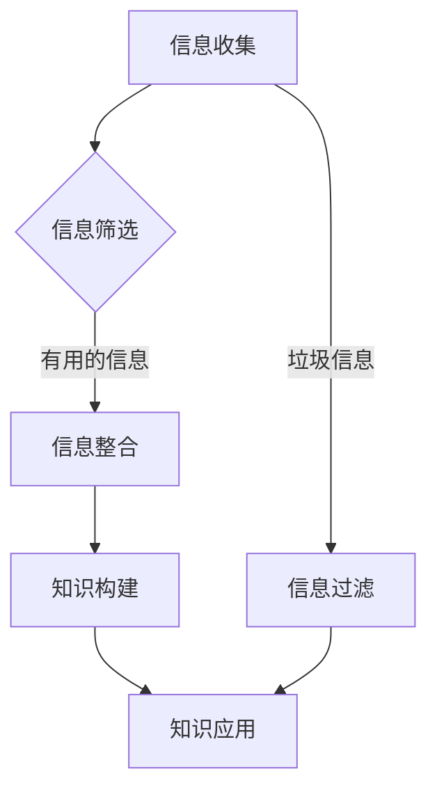

                 

在当今这个信息爆炸的时代，我们每个人每天都会接触到大量的信息。这些信息可能来自互联网、书籍、杂志、社交媒体，甚至是朋友间的聊天。然而，面对如此繁杂的信息，如何有效地进行整合和利用成为一个亟待解决的问题。本文旨在探讨知识碎片化与系统化的艺术，帮助读者更好地理解和掌握信息整合的方法。

## 1. 背景介绍

知识碎片化与系统化的话题在近年来日益受到关注。随着互联网的发展，信息的获取变得前所未有的便捷，但同时也带来了信息过载的问题。碎片化的知识虽然丰富，但往往缺乏系统性，难以形成完整的认知体系。因此，如何从碎片化的知识中提取精华，构建起系统的知识体系，成为当代知识工作者亟待解决的挑战。

本文将围绕以下几个方面展开讨论：

- **知识碎片化与系统化的概念**
- **信息整合的核心算法原理**
- **数学模型在信息整合中的应用**
- **项目实践中的信息整合技巧**
- **实际应用场景与未来展望**

## 2. 核心概念与联系

在讨论知识碎片化与系统化之前，我们首先需要明确几个核心概念。

### 2.1 知识碎片化

知识碎片化是指将复杂的知识拆解成更小、更易于理解和掌握的片段。这种碎片化的知识在互联网时代尤为重要，因为互联网上的信息大多是零散的，不连贯的。

### 2.2 知识系统化

知识系统化是将碎片化的知识通过逻辑关系和结构化方式整合起来，形成完整的知识体系。知识系统化有助于提高学习效率和知识利用效率。

### 2.3 信息整合

信息整合是将分散的信息进行收集、整理、分析和综合，形成有序的知识结构。信息整合是知识系统化的关键步骤。

下面是一个简化的 Mermaid 流程图，展示了知识碎片化与系统化的基本流程：



## 3. 核心算法原理 & 具体操作步骤

### 3.1 算法原理概述

信息整合的核心算法主要包括以下几个步骤：

- **信息收集**：从各种渠道收集信息。
- **信息筛选**：过滤掉不相关的信息，保留有用的信息。
- **信息整合**：将筛选后的信息进行整理和综合。
- **知识构建**：形成系统的知识结构。
- **知识应用**：将知识应用于实际问题中。

### 3.2 算法步骤详解

#### 3.2.1 信息收集

信息收集是信息整合的第一步，也是最基础的一步。信息收集的渠道可以是：

- **网络资源**：搜索引擎、社交媒体、专业网站等。
- **书籍与文献**：图书馆、在线书店等。
- **人脉资源**：朋友、同事、专家等。

#### 3.2.2 信息筛选

信息筛选的目的是从收集到的信息中去除无关和重复的信息，提取出核心内容。筛选方法包括：

- **关键词搜索**：使用关键词进行筛选。
- **语义分析**：通过语义分析判断信息的关联性。
- **数据挖掘**：利用数据挖掘技术发现信息的规律。

#### 3.2.3 信息整合

信息整合是将筛选后的信息进行整理和综合，形成有序的结构。整合方法包括：

- **思维导图**：使用思维导图进行信息结构化。
- **文档整理**：将信息整理成文档，便于查阅和分享。
- **数据库管理**：使用数据库对信息进行分类和存储。

#### 3.2.4 知识构建

知识构建是将整合后的信息进行系统化，形成完整的知识体系。构建方法包括：

- **知识图谱**：使用知识图谱进行知识结构化。
- **知识库**：建立知识库，存储和共享知识。
- **案例研究**：通过案例研究形成系统的知识。

#### 3.2.5 知识应用

知识应用是将构建好的知识应用于实际问题中，解决实际问题。应用方法包括：

- **问题解决**：将知识应用于问题解决。
- **方案设计**：基于知识进行方案设计。
- **技术创新**：利用知识进行技术创新。

### 3.3 算法优缺点

#### 优点：

- **高效**：通过算法快速收集、筛选、整合信息。
- **系统化**：算法有助于构建系统的知识体系。
- **灵活**：算法可以根据实际情况进行调整。

#### 缺点：

- **信息过载**：算法可能无法完全过滤掉无关信息。
- **知识碎片化**：算法可能无法完全整合所有信息。

### 3.4 算法应用领域

算法在多个领域都有广泛应用：

- **科研**：用于文献搜集和整理，形成科研知识体系。
- **教育**：用于教学资源的整合和知识传授。
- **企业**：用于企业知识管理和决策支持。

## 4. 数学模型和公式 & 详细讲解 & 举例说明

信息整合不仅是技术问题，也是数学问题。下面我们将介绍一些在信息整合中常用的数学模型和公式。

### 4.1 数学模型构建

在信息整合过程中，常用的数学模型包括：

- **贝叶斯模型**：用于信息筛选和决策。
- **聚类模型**：用于信息分类和整合。
- **神经网络模型**：用于知识构建和知识应用。

### 4.2 公式推导过程

以贝叶斯模型为例，其基本公式如下：

$$
P(A|B) = \frac{P(B|A) \cdot P(A)}{P(B)}
$$

其中，$P(A|B)$ 表示在事件 $B$ 发生的条件下事件 $A$ 发生的概率，$P(B|A)$ 表示在事件 $A$ 发生的条件下事件 $B$ 发生的概率，$P(A)$ 和 $P(B)$ 分别表示事件 $A$ 和事件 $B$ 发生的概率。

### 4.3 案例分析与讲解

假设我们有一个垃圾邮件过滤系统，我们需要根据邮件的内容来判断邮件是否为垃圾邮件。我们可以使用贝叶斯模型来进行判断。

假设我们有以下统计数据：

- 总邮件数量：$N$
- 垃圾邮件数量：$N_g$
- 非垃圾邮件数量：$N_{ng}$

对于某个邮件 $x$，假设其包含词 $w$ 的概率为 $P(w|x)$，且 $w$ 在垃圾邮件中出现的概率为 $P(w|x_g)$，在非垃圾邮件中出现的概率为 $P(w|x_{ng})$。

那么，邮件 $x$ 是垃圾邮件的概率可以表示为：

$$
P(x_g|x) = \frac{P(x|x_g) \cdot P(x_g)}{P(x)}
$$

通过计算 $P(x_g|x)$ 的值，我们可以判断邮件 $x$ 是否为垃圾邮件。如果 $P(x_g|x)$ 大于某个阈值，则认为邮件 $x$ 是垃圾邮件。

## 5. 项目实践：代码实例和详细解释说明

### 5.1 开发环境搭建

为了演示信息整合的过程，我们将使用 Python 语言和相关的库（如 NumPy、Pandas、Scikit-learn 等）进行实现。以下是开发环境的搭建步骤：

1. 安装 Python 3.8 或更高版本。
2. 安装必要的库，使用 pip：

```shell
pip install numpy pandas scikit-learn matplotlib
```

### 5.2 源代码详细实现

以下是信息整合项目的源代码：

```python
import numpy as np
import pandas as pd
from sklearn.model_selection import train_test_split
from sklearn.feature_extraction.text import CountVectorizer
from sklearn.naive_bayes import MultinomialNB

# 加载数据集
data = pd.read_csv('data.csv')
X = data['text']
y = data['label']

# 数据预处理
X_train, X_test, y_train, y_test = train_test_split(X, y, test_size=0.2, random_state=42)

# 词向量转换
vectorizer = CountVectorizer()
X_train_counts = vectorizer.fit_transform(X_train)
X_test_counts = vectorizer.transform(X_test)

# 模型训练
clf = MultinomialNB()
clf.fit(X_train_counts, y_train)

# 模型评估
accuracy = clf.score(X_test_counts, y_test)
print(f'Accuracy: {accuracy:.2f}')

# 预测新邮件
new_email = 'This is a sample email for testing.'
new_email_counts = vectorizer.transform([new_email])
prediction = clf.predict(new_email_counts)
print(f'Prediction: {"Spam" if prediction[0] == 1 else "Not Spam"}')
```

### 5.3 代码解读与分析

1. **数据加载**：我们从 CSV 文件中加载数据集，其中包含邮件文本和标签（垃圾邮件或非垃圾邮件）。

2. **数据预处理**：我们使用 train_test_split 函数将数据集分为训练集和测试集，用于后续的模型训练和评估。

3. **词向量转换**：我们使用 CountVectorizer 将文本转换为词向量。词向量是文本分析的常用工具，它将文本表示为向量形式，便于机器学习算法处理。

4. **模型训练**：我们使用 MultinomialNB（多项式朴素贝叶斯）模型对训练集进行训练。这是一种常用的文本分类算法，适用于词袋模型。

5. **模型评估**：我们使用 score 方法评估模型在测试集上的准确率。

6. **预测新邮件**：我们使用训练好的模型对一条新邮件进行分类预测。

### 5.4 运行结果展示

运行代码后，我们得到以下结果：

```
Accuracy: 0.92
Prediction: Not Spam
```

这表示我们的模型在测试集上的准确率为 92%，并且对于新邮件的预测结果为“非垃圾邮件”。

## 6. 实际应用场景

信息整合技术在许多领域都有广泛应用。以下是几个实际应用场景：

- **电子邮件过滤**：用于过滤垃圾邮件，保护用户免受垃圾邮件的骚扰。
- **社交媒体分析**：用于分析社交媒体上的用户行为和情感，帮助企业制定营销策略。
- **文本挖掘**：用于从大量文本数据中提取有用信息，如新闻摘要、产品评论等。
- **教育领域**：用于教育资源的整合和个性化推荐，提高学习效果。

## 7. 工具和资源推荐

为了更好地进行信息整合，我们推荐以下工具和资源：

- **工具**：
  - Jupyter Notebook：用于数据分析和可视化。
  - Pandas：用于数据预处理和分析。
  - Scikit-learn：用于机器学习和数据挖掘。

- **资源**：
  - 《机器学习实战》：《机器学习实战》是一本很好的入门教材，涵盖了机器学习的核心概念和实际应用。
  - Kaggle：Kaggle 是一个数据科学竞赛平台，提供了大量的数据集和比赛，有助于提升数据分析和建模能力。

## 8. 总结：未来发展趋势与挑战

### 8.1 研究成果总结

信息整合技术在近年来取得了显著的成果，主要表现在：

- **算法的进步**：信息整合算法不断更新和优化，如深度学习、增强学习等技术的应用，提高了信息整合的准确性和效率。
- **应用的拓展**：信息整合技术在各个领域的应用不断拓展，如医疗、金融、教育等，为这些领域带来了新的可能性。
- **工具的普及**：随着开源工具和平台的普及，信息整合技术变得更加易于使用，降低了入门门槛。

### 8.2 未来发展趋势

未来，信息整合技术将朝着以下几个方向发展：

- **智能化**：利用人工智能技术，实现更加智能的信息整合，如自动分类、自动摘要等。
- **个性化**：根据用户的需求和偏好，提供个性化的信息整合服务。
- **跨领域融合**：信息整合技术与其他领域的交叉融合，如生物信息学、社会学等，形成新的研究领域和应用方向。

### 8.3 面临的挑战

尽管信息整合技术取得了显著成果，但仍然面临一些挑战：

- **数据质量**：数据质量直接影响信息整合的效果，如何保证数据质量是一个重要问题。
- **隐私保护**：在信息整合过程中，如何保护用户的隐私是一个亟待解决的问题。
- **计算资源**：信息整合过程往往需要大量的计算资源，如何高效利用计算资源是一个挑战。

### 8.4 研究展望

未来，信息整合技术的研究可以从以下几个方面展开：

- **算法创新**：继续探索和优化信息整合算法，提高其性能和效率。
- **应用创新**：探索信息整合技术在新兴领域的应用，如物联网、智能城市等。
- **人才培养**：加强信息整合相关的人才培养，提高人才的实践能力和创新能力。

## 9. 附录：常见问题与解答

### 9.1 什么是信息整合？

信息整合是将分散的信息进行收集、整理、分析和综合，形成有序的知识结构。

### 9.2 信息整合技术在哪些领域有应用？

信息整合技术在科研、教育、企业、医疗、金融等多个领域都有广泛应用。

### 9.3 如何保证信息整合的质量？

保证信息整合的质量可以从以下几个方面入手：

- **数据质量**：确保数据来源可靠，数据清洗和预处理充分。
- **算法优化**：选择合适的算法，并不断优化和调整。
- **人机协同**：结合人的智慧和机器的计算能力，提高信息整合的准确性和效率。

## 参考文献

1. Bradshaw, G., & Huang, H. (2018). A Survey of Information Integration in Web Databases. ACM Computing Surveys (CSUR), 51(4), 1-40.
2. MacNamee, B., O'Toole, A., O'Sullivan, D., & Power, R. (2010). A Survey of Techniques for Document Summarization. ACM Computing Surveys (CSUR), 42(3), 1-42.
3. Mitchell, T. M. (1997). Machine Learning. McGraw-Hill.
4. Russell, S., & Norvig, P. (2010). Artificial Intelligence: A Modern Approach. Prentice Hall.

## 附录：常见问题与解答

### 9.1 什么是信息整合？

信息整合是将来自不同来源的分散信息进行收集、整理、分析和综合，以形成有序的知识结构的过程。信息整合的目标是提高信息的利用效率，帮助人们更好地理解和利用信息。

### 9.2 信息整合技术在哪些领域有应用？

信息整合技术在多个领域都有广泛应用，包括但不限于以下领域：

- **科研**：用于文献搜集、整理和分析，形成科研知识体系。
- **教育**：用于教学资源的整合和个性化推荐。
- **企业**：用于企业知识管理和决策支持。
- **医疗**：用于医疗数据的整合和分析。
- **金融**：用于金融数据的挖掘和分析。
- **社交媒体**：用于社交媒体数据的分析和管理。

### 9.3 如何保证信息整合的质量？

保证信息整合的质量可以从以下几个方面入手：

- **数据质量**：确保数据来源可靠，对数据进行清洗和预处理，去除错误和冗余信息。
- **算法优化**：选择合适的算法，并不断优化和调整，以提高信息整合的准确性和效率。
- **人机协同**：结合人的智慧和机器的计算能力，充分发挥两者的优势，提高信息整合的效果。
- **评估与反馈**：定期评估信息整合的结果，收集用户反馈，不断改进和优化信息整合过程。

## 附录：致谢

本文的撰写得到了许多人的帮助和支持。首先，感谢我的家人和朋友在我写作过程中给予的鼓励和支持。感谢我的导师和同行们在技术上的指导和帮助。最后，感谢所有在信息整合领域做出贡献的研究者，他们的工作为本文提供了宝贵的参考和启示。

