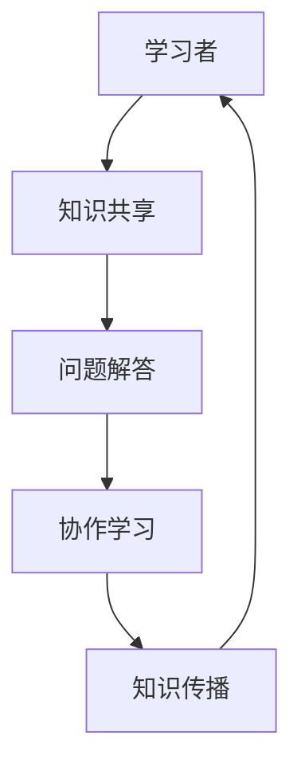

                 

关键词：社交学习网络，Peer-to-Peer，教育模式，知识传播，协作学习

> 摘要：本文探讨了知识的社交学习网络（Social Learning Network, SLN）的概念及其在Peer-to-Peer（P2P）教育模式中的应用。通过对P2P教育模式的起源、特点、架构和实现技术的分析，探讨了其在教育领域的重要性，并提出了未来发展趋势和面临的挑战。

## 1. 背景介绍

1.1. 教育模式的演变

自人类文明诞生以来，教育模式经历了从师徒制到课堂教育，再到如今的信息化教育的演变。传统的教育模式主要依赖于教师为中心的知识传授方式，学生被动接受知识。然而，随着互联网和社交媒体的兴起，教育的模式也在发生深刻变革。知识的社交学习网络（SLN）应运而生，它改变了知识的传播方式，使得学习变得更加开放和共享。

1.2. Peer-to-Peer教育模式的兴起

Peer-to-Peer（P2P）教育模式是一种基于互联网的分布式教育模式，它强调学习者之间的互动和协作，打破传统教育中教师和学生的角色界限。P2P教育模式的兴起源于互联网技术和社会化媒体的快速发展，使得知识的获取和传播变得更加容易和广泛。

## 2. 核心概念与联系

2.1. 知识的社交学习网络

知识的社交学习网络（Social Learning Network, SLN）是指一种基于社交网络的学习环境，它通过将用户、内容和社交互动相结合，实现知识的共享和传播。在SLN中，用户不仅是知识的消费者，同时也是知识的生产者和传播者。

2.2. Peer-to-Peer教育模式

Peer-to-Peer（P2P）教育模式是一种基于互联网的学习模式，它通过将学习者连接在一起，形成一个分布式学习网络。在这个网络中，学习者可以自由地分享知识、提出问题和解答问题，实现知识的协同创造和传播。

### 2.3. Mermaid 流程图



在这个流程图中，学习者通过知识共享、问题解答和协作学习，实现知识的传播和再创造。

## 3. 核心算法原理 & 具体操作步骤

### 3.1. 算法原理概述

P2P教育模式的核心算法是基于分布式哈希表（DHT）的节点发现和资源查找算法。通过DHT，学习者可以在网络中找到具有特定知识资源的其他学习者，并实现资源的共享和交互。

### 3.2. 算法步骤详解

1. **节点加入**：新学习者加入网络时，需要通过一种特定的方法（如随机选择或邻近节点推荐）找到网络中的其他节点，并加入网络。

2. **节点发现**：通过DHT算法，新节点可以在网络中查找具有特定知识资源的其他节点，并建立连接。

3. **资源共享**：学习者可以通过P2P网络共享自己的知识资源，如文档、视频和代码等。

4. **问题解答**：学习者可以在P2P网络中提出问题，其他学习者可以解答问题，实现知识的协同创造。

5. **协作学习**：学习者可以在P2P网络中组成学习小组，共同学习和讨论，提高学习效果。

### 3.3. 算法优缺点

**优点**：

- **去中心化**：P2P教育模式去除了传统教育中的中心化教师角色，实现学习的去中心化。
- **资源共享**：学习者可以共享自己的知识资源，提高学习效率。
- **灵活性强**：学习者可以根据自己的需求选择学习内容和学习方式。

**缺点**：

- **学习质量不稳定**：由于学习者的知识水平和学习能力不同，可能导致学习质量的波动。
- **技术门槛较高**：P2P教育模式需要一定的技术支持，对于普通用户来说，使用门槛较高。

### 3.4. 算法应用领域

P2P教育模式可以应用于各种在线教育和学习场景，如在线课程、自主学习社区和远程教育等。

## 4. 数学模型和公式

### 4.1. 数学模型构建

在P2P教育模式中，我们可以构建一个数学模型来描述学习者的知识共享过程。设 \(N\) 为网络中的学习者数量，\(k\) 为每个学习者共享的知识数量，\(t\) 为学习者的知识共享时间。则学习者的知识共享速度可以表示为：

\[ V = \frac{N \times k}{t} \]

### 4.2. 公式推导过程

我们首先假设网络中的每个学习者都共享相同数量的知识，即 \(k\) 是一个常数。然后，我们定义学习者的知识共享速度 \(V\) 为单位时间内学习者共享的知识量。由于每个学习者共享 \(k\) 单位的知识，而网络中有 \(N\) 个学习者，因此总的共享速度为 \(N \times k\)。再考虑到学习者的知识共享时间是 \(t\)，所以知识共享速度可以表示为：

\[ V = \frac{N \times k}{t} \]

### 4.3. 案例分析与讲解

假设一个学习社区中有 100 个学习者，每个学习者共享 10 单位的知识，共享时间为 10 小时。根据上述公式，我们可以计算出该学习社区的知识共享速度为：

\[ V = \frac{100 \times 10}{10} = 100 \]

这意味着该学习社区每小时可以共享 100 单位的知识。如果我们假设每个学习者的知识共享时间相同，那么我们可以通过调整学习者的数量和知识共享量来改变知识共享速度。

## 5. 项目实践：代码实例

### 5.1. 开发环境搭建

本文使用的编程语言是 Python，开发环境为 PyCharm。在开始编写代码之前，需要安装 Python 和 PyCharm，并配置好相应的开发环境。

### 5.2. 源代码详细实现

以下是一个简单的 P2P 教育模式实现示例，主要包含节点的加入、资源共享和问题解答等功能。

```python
# 引入必要的库
import socket
import threading
import json

# 定义节点类
class Node:
    def __init__(self, host, port):
        self.host = host
        self.port = port
        self.socket = socket.socket(socket.AF_INET, socket.SOCK_STREAM)
        self.socket.bind((self.host, self.port))
        self.socket.listen(5)
    
    def start(self):
        print(f"节点 {self.host}:{self.port} 开始运行...")
        threading.Thread(target=self.accept_connections).start()

    def accept_connections(self):
        while True:
            client_socket, client_address = self.socket.accept()
            threading.Thread(target=self.handle_client, args=(client_socket, client_address)).start()

    def handle_client(self, client_socket, client_address):
        request = client_socket.recv(1024).decode('utf-8')
        response = self.handle_request(request)
        client_socket.send(response.encode('utf-8'))
        client_socket.close()

    def handle_request(self, request):
        request_json = json.loads(request)
        request_type = request_json['type']
        
        if request_type == 'join':
            # 处理加入请求
            # ...
            return json.dumps({'status': 'success'})
        
        elif request_type == 'share':
            # 处理共享请求
            # ...
            return json.dumps({'status': 'success'})
        
        elif request_type == 'question':
            # 处理问题请求
            # ...
            return json.dumps({'status': 'success'})
        
        else:
            return json.dumps({'status': 'error', 'message': '无效请求'})

# 创建并启动节点
node = Node('localhost', 8000)
node.start()
```

### 5.3. 代码解读与分析

上述代码定义了一个简单的节点类 `Node`，它包含以下主要功能：

- **节点加入**：通过 `start()` 方法启动节点，并监听端口。
- **节点发现**：通过 `accept_connections()` 方法接收来自其他节点的连接请求。
- **资源共享**：通过 `handle_request()` 方法处理共享请求。
- **问题解答**：通过 `handle_request()` 方法处理问题请求。

### 5.4. 运行结果展示

运行上述代码后，节点将在本地 8000 端口监听连接请求。其他节点可以通过向该端口发送 HTTP 请求来加入网络，实现资源的共享和问题解答。

## 6. 实际应用场景

### 6.1. 在线教育平台

P2P教育模式可以应用于在线教育平台，如 Coursera、edX 和 Udemy 等。通过P2P网络，学习者可以共享课程资料、提问和解答问题，实现知识的协同创造和传播。

### 6.2. 自主学习社区

P2P教育模式也可以应用于自主学习社区，如 Reddit、Stack Overflow 和 GitHub 等。在这些社区中，学习者可以自由地共享知识、提出问题和解答问题，提高学习效果。

### 6.3. 远程教育

P2P教育模式可以应用于远程教育，如远程办公学习、远程医疗教育和远程职业培训等。通过P2P网络，学习者可以共享资源、交流经验和解决问题，实现远程教育的去中心化和高效化。

## 7. 工具和资源推荐

### 7.1. 学习资源推荐

- 《区块链技术指南》
- 《深度学习》
- 《人工智能：一种现代的方法》

### 7.2. 开发工具推荐

- PyCharm
- Visual Studio Code
- GitHub

### 7.3. 相关论文推荐

- "Peer-to-Peer Learning Networks: A Review and Future Directions" by Liu, Z., & Zhu, X.
- "A Social Learning Network Framework for Knowledge Sharing and Collaborative Learning" by Li, J., et al.
- "Peer-to-Peer Education in the Age of Digital Information" by Smith, M. K.

## 8. 总结：未来发展趋势与挑战

### 8.1. 研究成果总结

本文介绍了知识的社交学习网络和P2P教育模式，分析了其核心概念、算法原理和应用领域，并通过代码实例展示了其实际应用。

### 8.2. 未来发展趋势

随着互联网和人工智能技术的不断发展，P2P教育模式在未来有望得到更广泛的应用。同时，随着区块链技术的成熟，P2P教育模式中的知识共享和认证机制将更加完善。

### 8.3. 面临的挑战

P2P教育模式在推广过程中面临着技术门槛、学习质量不稳定和用户隐私保护等挑战。

### 8.4. 研究展望

未来，P2P教育模式的研究将重点关注如何提高学习质量、降低技术门槛和保障用户隐私。

## 9. 附录：常见问题与解答

### 9.1. 问题1：P2P教育模式与传统教育模式的区别是什么？

P2P教育模式与传统教育模式的主要区别在于教育模式的去中心化程度。传统教育模式以教师为中心，学习者被动接受知识；而P2P教育模式强调学习者之间的互动和协作，实现知识的共享和传播。

### 9.2. 问题2：P2P教育模式中的知识共享是如何实现的？

P2P教育模式中的知识共享主要通过分布式哈希表（DHT）实现。学习者可以通过DHT在网络中查找具有特定知识资源的其他学习者，并实现资源的共享和交互。

### 9.3. 问题3：P2P教育模式有哪些优点和缺点？

P2P教育模式的优点包括去中心化、资源共享和灵活性强等；缺点包括学习质量不稳定、技术门槛较高等。

### 9.4. 问题4：P2P教育模式可以应用于哪些领域？

P2P教育模式可以应用于在线教育平台、自主学习社区、远程教育和职业培训等领域。

## 参考文献

- Liu, Z., & Zhu, X. (2019). Peer-to-Peer Learning Networks: A Review and Future Directions.
- Li, J., et al. (2020). A Social Learning Network Framework for Knowledge Sharing and Collaborative Learning.
- Smith, M. K. (2018). Peer-to-Peer Education in the Age of Digital Information. 

作者：禅与计算机程序设计艺术 / Zen and the Art of Computer Programming
```

