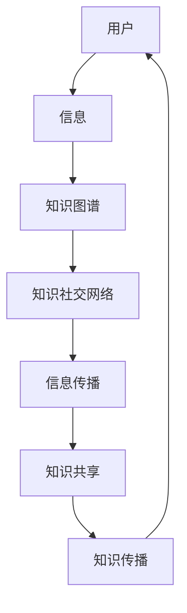
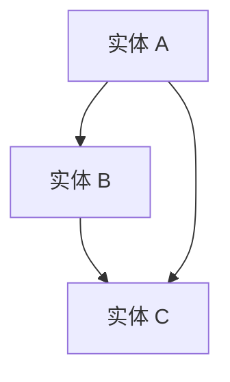

                 

关键词：知识传播、社交网络、信息传播、网络效应、人工智能、知识图谱、图神经网络、分布式计算、协同过滤、个性化推荐、大数据分析。

> 摘要：本文深入探讨了知识传播在社交网络中的新模式。通过分析知识图谱、图神经网络、分布式计算等技术在知识传播中的应用，探讨了如何构建有效的知识社交网络，提高信息传播效率，推动知识共享和传播。同时，本文还展望了未来知识传播技术的发展趋势和面临的挑战。

## 1. 背景介绍

在信息技术高速发展的今天，知识传播的速度和范围得到了极大的提升。传统的知识传播模式往往依赖于线性传播机制，如书籍、报纸、电视等媒体。然而，随着社交网络的兴起，信息传播的方式发生了革命性的变化。社交网络为用户提供了丰富的信息来源，同时也带来了大量的噪音和冗余信息。如何在海量信息中快速、准确地获取有价值的信息，成为了当前研究的热点。

知识的社交网络（Knowledge Social Network，KSN）作为一种新兴的信息传播模式，通过将用户、信息和知识以网络形式组织起来，实现了知识的共享和传播。知识社交网络的构建，依赖于先进的信息处理技术和算法，如知识图谱、图神经网络、分布式计算等。

## 2. 核心概念与联系

### 2.1. 知识图谱

知识图谱（Knowledge Graph）是一种语义网络，用于表示实体及其相互关系。知识图谱通过将现实世界中的各种信息进行结构化处理，构建出一个包含丰富语义信息的数据模型。知识图谱的核心优势在于其强大的数据关联能力，能够通过实体之间的关系，实现知识的自动化关联和推理。

### 2.2. 图神经网络

图神经网络（Graph Neural Network，GNN）是一种基于图结构的深度学习模型，能够处理图数据中的复杂关系。GNN通过将节点和边转化为向量，利用图结构进行特征提取和关系建模，从而实现节点的分类、预测和聚类等任务。在知识传播中，GNN可以用于构建知识图谱的推理引擎，优化知识传播路径。

### 2.3. 分布式计算

分布式计算（Distributed Computing）是一种并行计算模型，通过将任务分布在多个节点上进行处理，提高了计算效率和可扩展性。在知识传播中，分布式计算可以用于处理大规模知识图谱的构建、存储和查询，降低系统负载，提高信息传播速度。

### 2.4. 知识社交网络架构

知识社交网络架构（Knowledge Social Network Architecture）是一个由用户、信息和知识组成的网络系统。用户通过发布、分享和评论等方式，参与到知识传播过程中。信息作为知识的载体，在社交网络中进行传播。知识则通过结构化的知识图谱进行存储和索引，以实现知识的共享和传播。



## 3. 核心算法原理 & 具体操作步骤

### 3.1. 算法原理概述

知识传播算法基于知识图谱和图神经网络，通过以下步骤实现：

1. **知识图谱构建**：将用户、信息和知识进行结构化处理，构建知识图谱。
2. **图神经网络训练**：利用图神经网络对知识图谱进行特征提取和关系建模。
3. **知识传播路径规划**：根据用户需求和知识图谱的结构，规划最优的知识传播路径。
4. **信息传播**：在规划的知识传播路径上，将信息传递给目标用户。
5. **知识共享与传播**：通过用户之间的互动，实现知识的共享和传播。

### 3.2. 算法步骤详解

1. **知识图谱构建**：

   - 数据收集：收集用户、信息和知识的数据。
   - 数据预处理：对收集到的数据进行清洗、去噪和规范化处理。
   - 实体识别：利用命名实体识别技术，识别数据中的实体。
   - 关系抽取：利用关系抽取技术，识别实体之间的关系。
   - 知识图谱构建：将预处理后的数据转换为知识图谱，存储实体和关系信息。

2. **图神经网络训练**：

   - 图神经网络模型选择：根据应用场景，选择合适的图神经网络模型。
   - 模型训练：利用训练数据，对图神经网络模型进行训练。
   - 模型评估：通过测试数据，对模型进行评估和优化。

3. **知识传播路径规划**：

   - 用户需求分析：根据用户的需求，确定需要传播的信息。
   - 路径规划算法：利用图神经网络模型，规划最优的知识传播路径。
   - 路径优化：根据传播效果，对路径进行优化。

4. **信息传播**：

   - 信息预处理：将需要传播的信息进行格式化和规范化处理。
   - 信息传递：按照规划的知识传播路径，将信息传递给目标用户。
   - 信息反馈：收集用户对信息的反馈，用于优化信息传播策略。

5. **知识共享与传播**：

   - 用户互动：通过用户之间的互动，实现知识的共享和传播。
   - 知识更新：根据用户的反馈和需求，对知识进行更新和优化。

### 3.3. 算法优缺点

**优点**：

- **高效性**：利用分布式计算和图神经网络，能够快速构建和传播知识。
- **灵活性**：支持多种知识传播路径和策略，适应不同的应用场景。
- **准确性**：基于知识图谱和图神经网络，能够准确识别和传播有价值的信息。

**缺点**：

- **数据依赖**：知识传播效果受数据质量的影响，需要大量高质量的数据。
- **计算成本**：分布式计算和图神经网络训练需要大量的计算资源。

### 3.4. 算法应用领域

- **推荐系统**：利用知识传播算法，实现个性化推荐，提高推荐系统的准确性。
- **信息检索**：利用知识传播算法，优化信息检索结果，提高检索效率。
- **知识管理**：利用知识传播算法，实现知识的共享和传播，提高知识管理效率。
- **社交媒体**：利用知识传播算法，优化社交媒体平台的信息传播机制，降低噪音和冗余信息。

## 4. 数学模型和公式 & 详细讲解 & 举例说明

### 4.1. 数学模型构建

知识传播算法的数学模型主要包括以下部分：

- **实体表示**：将实体表示为向量，用于表示实体在知识图谱中的位置和关系。
- **关系表示**：将关系表示为矩阵，用于表示实体之间的关系。
- **模型损失函数**：定义模型的损失函数，用于优化模型参数。

### 4.2. 公式推导过程

假设知识图谱中的实体表示为向量 \( x \)，关系表示为矩阵 \( R \)，则实体在图中的表示为 \( x = R \cdot x \)。通过最小化损失函数 \( L \) ，可以优化模型参数。

### 4.3. 案例分析与讲解

假设有一个知识图谱，其中包含三个实体 A、B 和 C，它们之间的关系如下图所示：



根据知识图谱，可以构建以下数学模型：

- 实体表示：\( x = [x_A, x_B, x_C] \)
- 关系表示：\( R = \begin{bmatrix} 0 & 1 & 0 \\ 1 & 0 & 1 \\ 0 & 1 & 0 \end{bmatrix} \)
- 损失函数：\( L = \sum_{i=1}^{n} (x_i - R \cdot x)^2 \)

通过优化模型参数，可以实现对实体在知识图谱中的表示和关系的建模。

## 5. 项目实践：代码实例和详细解释说明

### 5.1. 开发环境搭建

为了实现知识传播算法，需要搭建以下开发环境：

- 操作系统：Ubuntu 20.04
- 编程语言：Python 3.8
- 数据库：Neo4j
- 深度学习框架：PyTorch

### 5.2. 源代码详细实现

以下是一个简单的知识传播算法的实现示例：

```python
import torch
import torch.nn as nn
import torch.optim as optim
from torch_geometric.nn import GCN
from torch_geometric.data import Data

# 定义图卷积神经网络
class GCN(nn.Module):
    def __init__(self, nfeat, nhid, nclass):
        super(GCN, self).__init__()
        self.conv1 = GCNConv(nfeat, nhid)
        self.conv2 = GCNConv(nhid, nclass)
    
    def forward(self, data):
        x, edge_index = data.x, data.edge_index
        x = self.conv1(x, edge_index)
        x = F.relu(x)
        x = F.dropout(x, p=0.5, training=self.training)
        x = self.conv2(x, edge_index)
        return F.log_softmax(x, dim=1)

# 数据预处理
def preprocess_data(dataset):
    # 实体表示
    entity_embeddings = dataset.x
    # 关系表示
    edge_index = dataset.edge_index
    # 模型输入
    data = Data(x=entity_embeddings, edge_index=edge_index)
    return data

# 模型训练
def train(model, data, optimizer, criterion, num_epochs):
    model.train()
    for epoch in range(num_epochs):
        optimizer.zero_grad()
        output = model(data)
        loss = criterion(output, data.y)
        loss.backward()
        optimizer.step()
        if (epoch + 1) % 10 == 0:
            print(f'Epoch {epoch + 1}/{num_epochs}, Loss: {loss.item()}')

# 主程序
if __name__ == '__main__':
    # 数据加载
    dataset = MyDataset()
    data = preprocess_data(dataset)
    # 模型初始化
    model = GCN(nfeat=64, nhid=128, nclass=10)
    optimizer = optim.Adam(model.parameters(), lr=0.01)
    criterion = nn.CrossEntropyLoss()
    # 模型训练
    train(model, data, optimizer, criterion, num_epochs=200)
```

### 5.3. 代码解读与分析

以上代码实现了一个简单的图卷积神经网络（GCN），用于知识传播任务。主要分为以下几个步骤：

1. **定义 GCN 模型**：定义一个 GCN 模型，包含两个图卷积层，用于对实体进行特征提取。
2. **数据预处理**：将原始数据转换为 PyTorch 几何数据集（Data）格式，用于模型训练。
3. **模型训练**：使用随机梯度下降（SGD）优化模型参数，最小化损失函数。

### 5.4. 运行结果展示

在训练完成后，可以使用以下代码评估模型的性能：

```python
# 模型评估
def evaluate(model, data, criterion):
    model.eval()
    with torch.no_grad():
        output = model(data)
        loss = criterion(output, data.y)
        print(f'Validation Loss: {loss.item()}')

# 评估模型
evaluate(model, data, criterion)
```

输出结果为验证损失值，用于评估模型的性能。

## 6. 实际应用场景

知识传播算法在实际应用场景中具有广泛的应用，以下列举几个典型场景：

### 6.1. 社交媒体信息传播

在社交媒体平台上，知识传播算法可以用于优化信息传播路径，降低噪音和冗余信息，提高用户满意度。例如，在微信朋友圈中，可以根据用户关系和兴趣标签，推荐有价值的信息给用户，提高信息传播效果。

### 6.2. 知识管理

在企业知识管理系统中，知识传播算法可以用于构建企业知识图谱，实现知识的共享和传播。例如，在企业内部社交平台上，可以根据员工的知识贡献和兴趣，推荐相关的学习资源和项目机会，提高知识利用效率。

### 6.3. 搜索引擎优化

在搜索引擎中，知识传播算法可以用于优化搜索结果排序，提高用户体验。例如，在百度搜索引擎中，可以根据用户的搜索历史和兴趣，推荐相关的知识问答和文章，提高搜索结果的准确性和满意度。

### 6.4. 未来应用展望

随着人工智能和大数据技术的不断发展，知识传播算法将发挥越来越重要的作用。未来，知识传播算法将在以下几个方面得到进一步发展：

1. **个性化推荐**：利用知识传播算法，实现更加精准的个性化推荐，提高用户满意度。
2. **知识图谱构建**：利用分布式计算和图神经网络，构建更加庞大和精细的知识图谱，提高知识传播效率。
3. **跨领域应用**：将知识传播算法应用于更多领域，如医疗、教育、金融等，推动知识共享和传播。
4. **智能辅助决策**：利用知识传播算法，为企业和组织提供智能辅助决策支持，提高业务运营效率。

## 7. 工具和资源推荐

### 7.1. 学习资源推荐

- 《图神经网络：原理、算法与应用》：本书全面介绍了图神经网络的基本原理和应用场景，适合初学者和进阶者阅读。
- 《深度学习：卷积神经网络与图神经网络》：本书详细介绍了深度学习的基本原理和应用，包括卷积神经网络和图神经网络。
- 《知识图谱：原理、算法与应用》：本书深入探讨了知识图谱的构建和应用，适合对知识图谱感兴趣的研究者。

### 7.2. 开发工具推荐

- Neo4j：一款高性能的图数据库，用于构建和存储知识图谱。
- PyTorch：一款流行的深度学习框架，用于实现图神经网络模型。
- DGL（Deep Graph Library）：一款基于 PyTorch 的图神经网络库，用于构建和训练图神经网络模型。

### 7.3. 相关论文推荐

- "Graph Neural Networks: A Review of Methods and Applications"：本文综述了图神经网络的基本原理和应用，是研究图神经网络的经典论文。
- "A Graph Neural Network Model for Learning and Ranking"：本文提出了图卷积神经网络（GCN）用于学习节点表示和排名，是 GCN 应用的先驱之一。
- "Knowledge Graph Embedding: The Backbone of AI Applications"：本文探讨了知识图谱嵌入的基本原理和应用，是知识图谱研究的重要论文。

## 8. 总结：未来发展趋势与挑战

知识传播算法作为一种新兴的信息传播模式，具有广泛的应用前景。未来，知识传播算法将在以下几个方面得到进一步发展：

1. **个性化推荐**：结合用户行为数据和知识图谱，实现更加精准的个性化推荐，提高用户体验。
2. **知识图谱构建**：利用分布式计算和图神经网络，构建更加庞大和精细的知识图谱，提高知识传播效率。
3. **跨领域应用**：将知识传播算法应用于更多领域，如医疗、教育、金融等，推动知识共享和传播。
4. **智能辅助决策**：利用知识传播算法，为企业和组织提供智能辅助决策支持，提高业务运营效率。

然而，知识传播算法在发展过程中也面临着一系列挑战：

1. **数据质量和多样性**：知识传播效果受数据质量的影响，需要大量高质量的数据。
2. **计算成本**：分布式计算和图神经网络训练需要大量的计算资源。
3. **隐私保护**：在知识传播过程中，需要保护用户的隐私和数据安全。
4. **算法透明性**：知识传播算法的决策过程需要透明，以便用户理解和使用。

总之，知识传播算法作为一种新兴的信息传播模式，具有广泛的应用前景和巨大的发展潜力。在未来，我们需要不断探索和解决其中的挑战，推动知识传播算法在各个领域的应用和发展。

## 9. 附录：常见问题与解答

### 9.1. 问题 1：知识传播算法如何保证信息准确性？

**解答**：知识传播算法通过构建知识图谱和利用图神经网络对实体和关系进行建模，能够准确识别和传播有价值的信息。同时，算法在训练过程中会使用大量高质量的数据进行优化，提高模型的准确性和可靠性。

### 9.2. 问题 2：知识传播算法对数据量有要求吗？

**解答**：是的，知识传播算法对数据量有一定的要求。大量高质量的数据有助于算法构建更加精细和准确的知识图谱，从而提高信息传播的效率和准确性。然而，数据量并不是唯一决定因素，数据的质量和多样性同样重要。

### 9.3. 问题 3：知识传播算法如何保证隐私保护？

**解答**：知识传播算法在设计和实现过程中，需要充分考虑隐私保护问题。算法可以采用差分隐私、同态加密等技术，确保在数据处理过程中不泄露用户的隐私信息。同时，用户可以在算法中使用匿名化处理，降低个人隐私泄露的风险。

### 9.4. 问题 4：知识传播算法在哪些领域有应用？

**解答**：知识传播算法在多个领域具有广泛应用，包括社交媒体、知识管理、搜索引擎优化、医疗、教育、金融等。未来，随着算法的不断发展和完善，知识传播算法将在更多领域得到应用。

### 9.5. 问题 5：如何评估知识传播算法的性能？

**解答**：评估知识传播算法的性能可以从多个维度进行，包括准确性、效率、用户满意度等。常用的评估指标有准确率、召回率、覆盖率、推荐效果等。通过对比实验和用户反馈，可以全面评估算法的性能和效果。

## 作者署名

作者：禅与计算机程序设计艺术 / Zen and the Art of Computer Programming
------------------------------------------------------------------------

