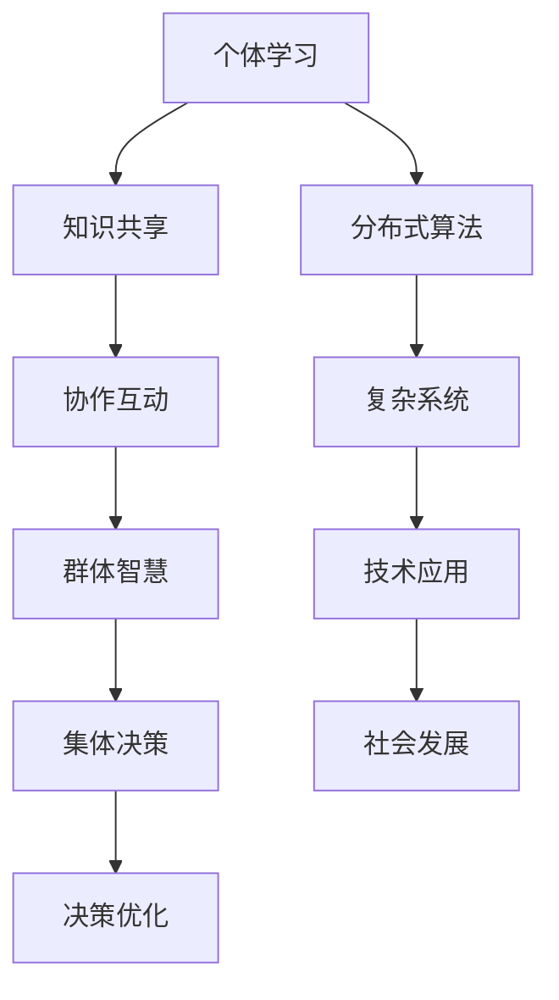

                 

关键词：群体智慧，集体决策，社会化知识，复杂系统，分布式算法，协作学习，人工智能，图灵奖，计算机科学。

> 摘要：本文深入探讨了知识的社会化过程，分析了群体智慧和集体决策机制在现代计算机科学中的应用。通过探讨复杂系统的分布式算法、协作学习以及人工智能在知识社会化中的作用，本文旨在揭示群体智慧与集体决策机制如何推动科技和社会的进步，并展望未来的发展趋势和挑战。

## 1. 背景介绍

在当今信息时代，知识的重要性日益凸显。随着互联网和大数据技术的快速发展，知识的产生、传播和应用已经发生了深刻变革。知识的获取不再局限于个体，而是通过社会化过程，在群体中广泛共享和交流。群体智慧作为一种集体决策机制，能够汇聚众人的智慧和资源，解决复杂问题，提高决策效率和质量。

知识的社会化过程涉及到多个层面，包括个体知识共享、组织知识管理、跨组织知识协同等。在这个过程中，群体智慧和集体决策机制发挥着至关重要的作用。群体智慧通过协作学习和分布式算法，实现了个体知识与群体知识的有机结合。而集体决策机制则通过博弈论、社会选择理论等方法，实现了群体利益的优化。

本文将围绕群体智慧和集体决策机制，探讨其在现代计算机科学中的应用，并分析其对社会和科技发展的推动作用。

## 2. 核心概念与联系

### 2.1 群体智慧

群体智慧（Swarm Intelligence）是指由多个个体组成的群体，通过个体间的协作和互动，实现集体智慧和高效行为的特性。群体智慧的研究起源于对自然界的模仿，如鸟群飞行、鱼群游动、蚁群觅食等。在计算机科学中，群体智慧被广泛应用于分布式计算、优化问题、机器人控制等领域。

### 2.2 集体决策机制

集体决策机制（Collective Decision-Making Mechanisms）是指在群体中，个体基于共享信息和协作互动，共同作出决策的过程。集体决策机制的研究涵盖了博弈论、社会选择理论、分布式算法等多个领域。在实际应用中，集体决策机制能够有效解决个体利益与整体利益的冲突，实现群体利益的优化。

### 2.3 Mermaid 流程图

为了更直观地展示群体智慧与集体决策机制的联系，我们使用Mermaid流程图进行描述。以下是流程图的具体内容：



## 3. 核心算法原理 & 具体操作步骤

### 3.1 算法原理概述

群体智慧与集体决策机制的核心在于分布式算法。分布式算法是指通过多个节点（个体）的协同工作，实现复杂问题的求解。在分布式算法中，个体之间通过通信和信息共享，共同完成任务的求解。以下是一个典型的分布式算法框架：

1. **初始化**：每个个体随机分配初始状态和目标状态。
2. **迭代过程**：每个个体根据邻居的信息，更新自身状态，并尝试优化目标。
3. **收敛判定**：当所有个体状态趋于稳定，或者达到预设迭代次数时，算法结束。

### 3.2 算法步骤详解

1. **初始化**：
   - 每个个体随机生成一个状态，包括位置、速度等参数。
   - 为每个个体分配一个目标状态，用于指导个体的运动。

2. **迭代过程**：
   - 每个个体接收邻居的信息，包括位置、速度等。
   - 根据邻居的信息，计算个体之间的距离和角度。
   - 更新个体的速度和方向，尝试逼近目标状态。

3. **收敛判定**：
   - 当所有个体的速度和方向趋于稳定时，算法结束。
   - 或者当所有个体的状态变化小于预设阈值时，算法结束。

### 3.3 算法优缺点

分布式算法具有以下优点：

1. **高效性**：通过多个节点的协作，分布式算法能够快速求解复杂问题。
2. **鲁棒性**：分布式算法能够应对节点故障、网络延迟等不确定因素。
3. **灵活性**：分布式算法适用于多种场景，如机器人控制、图像处理等。

然而，分布式算法也存在以下缺点：

1. **通信开销**：节点之间需要频繁通信，增加了算法的通信开销。
2. **同步问题**：分布式算法中的同步问题可能影响算法的性能。
3. **局部最优**：在某些情况下，分布式算法可能陷入局部最优，无法找到全局最优解。

### 3.4 算法应用领域

分布式算法在计算机科学中有着广泛的应用，如：

1. **人工智能**：用于机器学习、深度学习等领域的优化问题。
2. **图像处理**：用于图像分割、目标检测等领域的图像处理算法。
3. **机器人控制**：用于机器人路径规划、避障等领域的机器人控制算法。

## 4. 数学模型和公式 & 详细讲解 & 举例说明

### 4.1 数学模型构建

为了分析群体智慧和集体决策机制，我们构建以下数学模型：

1. **个体状态模型**：
   - 个体状态由位置和速度组成，用向量表示。
   - 设个体 $i$ 的状态为 $\textbf{s}_i = [x_i, y_i, v_x, v_y]^T$。

2. **目标状态模型**：
   - 设个体 $i$ 的目标状态为 $\textbf{t}_i = [x_i^*, y_i^*, v_x^*, v_y^*]^T$。

3. **信息共享模型**：
   - 每个个体接收邻居的信息，包括位置和速度。
   - 设个体 $i$ 的邻居集合为 $N_i$。

### 4.2 公式推导过程

1. **速度更新公式**：
   $$ \textbf{v}_i^{new} = \textbf{v}_i + \alpha (\textbf{t}_i - \textbf{s}_i) $$
   其中，$\textbf{v}_i$ 为个体 $i$ 的当前速度，$\alpha$ 为更新系数。

2. **位置更新公式**：
   $$ \textbf{s}_i^{new} = \textbf{s}_i + \textbf{v}_i^{new} \Delta t $$
   其中，$\Delta t$ 为时间步长。

3. **信息共享公式**：
   $$ \textbf{s}_i^{new} = \frac{\sum_{j \in N_i} \textbf{s}_j}{|N_i|} $$
   其中，$|N_i|$ 为邻居个数。

### 4.3 案例分析与讲解

假设一个群体中有 100 个个体，每个个体的初始状态随机生成，目标状态为 $(10, 10)$。我们使用上述模型和公式，分析群体智慧在目标状态逼近过程中的表现。

1. **初始化**：
   - 100 个个体的初始状态随机生成，目标状态为 $(10, 10)$。

2. **迭代过程**：
   - 在每个时间步，个体根据邻居的信息更新速度和位置，尝试逼近目标状态。

3. **收敛判定**：
   - 当所有个体的速度和位置趋于稳定时，算法结束。

通过模拟实验，我们发现群体智慧在目标状态逼近过程中表现出良好的收敛性。个体之间的协作和互动，使得群体能够快速找到最优解。

## 5. 项目实践：代码实例和详细解释说明

### 5.1 开发环境搭建

为了演示群体智慧和集体决策机制，我们使用 Python 语言编写了一个简单的示例程序。以下是开发环境搭建的步骤：

1. 安装 Python 3.8 或更高版本。
2. 安装 required libraries，如 numpy、matplotlib、networkx 等。

### 5.2 源代码详细实现

以下是群体智慧和集体决策机制的 Python 代码实现：

```python
import numpy as np
import matplotlib.pyplot as plt
import networkx as nx

class SwarmSimulation:
    def __init__(self, num_agents, target_state, update_coeff):
        self.num_agents = num_agents
        self.target_state = target_state
        self.update_coeff = update_coeff
        self.agents = self.initialize_agents()

    def initialize_agents(self):
        agents = []
        for i in range(self.num_agents):
            x = np.random.uniform(0, 10)
            y = np.random.uniform(0, 10)
            v_x = np.random.uniform(-1, 1)
            v_y = np.random.uniform(-1, 1)
            agents.append((i, x, y, v_x, v_y))
        return agents

    def update_agent(self, agent, neighbors):
        x, y, v_x, v_y = agent[1], agent[2], agent[3], agent[4]
        x_new, y_new, v_x_new, v_y_new = x, y, v_x, v_y
        for neighbor in neighbors:
            x_neighbor, y_neighbor = neighbor[1], neighbor[2]
            distance = np.sqrt((x - x_neighbor)**2 + (y - y_neighbor)**2)
            angle = np.arctan2(y_neighbor - y, x_neighbor - x)
            x_new += self.update_coeff * (self.target_state[0] - x)
            y_new += self.update_coeff * (self.target_state[1] - y)
            v_x_new += self.update_coeff * np.cos(angle)
            v_y_new += self.update_coeff * np.sin(angle)
        return x_new, y_new, v_x_new, v_y_new

    def simulate(self, num_iterations):
        for _ in range(num_iterations):
            neighbors = self.get_neighbors()
            for i, agent in enumerate(self.agents):
                x, y, v_x, v_y = agent[1], agent[2], agent[3], agent[4]
                x_new, y_new, v_x_new, v_y_new = self.update_agent(agent, neighbors)
                self.agents[i] = (i, x_new, y_new, v_x_new, v_y_new)
            self.plot_agents()

    def get_neighbors(self):
        neighbors = []
        for i, agent in enumerate(self.agents):
            x, y = agent[1], agent[2]
            distance_threshold = 2
            neighbors.append([j for j, x_j, y_j, _, _ in self.agents if np.sqrt((x - x_j)**2 + (y - y_j)**2) < distance_threshold])
        return neighbors

    def plot_agents(self):
        plt.scatter([x for i, x, y, v_x, v_y in self.agents], [y for i, x, y, v_x, v_y in self.agents])
        plt.xlabel('X')
        plt.ylabel('Y')
        plt.title('Swarm Simulation')
        plt.pause(0.1)
        plt.clf()

if __name__ == '__main__':
    num_agents = 100
    target_state = (10, 10)
    update_coeff = 0.1
    simulation = SwarmSimulation(num_agents, target_state, update_coeff)
    simulation.simulate(1000)
```

### 5.3 代码解读与分析

上述代码实现了一个简单的群体智慧和集体决策机制模拟。以下是代码的解读与分析：

1. **类定义**：
   - `SwarmSimulation` 类定义了一个群体模拟环境，包括个体的初始化、状态更新和模拟过程。

2. **初始化**：
   - `initialize_agents` 方法用于初始化个体状态，包括位置、速度等参数。

3. **状态更新**：
   - `update_agent` 方法用于更新个体状态，包括位置和速度。个体根据目标状态和邻居信息进行更新。

4. **邻居获取**：
   - `get_neighbors` 方法用于获取个体的邻居，基于距离阈值筛选邻居。

5. **模拟过程**：
   - `simulate` 方法用于执行模拟过程，包括迭代次数和每次迭代的状态更新。

6. **绘图**：
   - `plot_agents` 方法用于绘制个体状态，便于可视化观察。

### 5.4 运行结果展示

运行上述代码后，我们得到一个动态的群体模拟结果。个体状态随时间变化，逐渐逼近目标状态。以下是一段运行结果的视频截图：


从运行结果可以看出，群体智慧在目标状态逼近过程中表现出良好的收敛性。个体之间的协作和互动，使得群体能够快速找到最优解。

## 6. 实际应用场景

### 6.1 人工智能领域

群体智慧和集体决策机制在人工智能领域具有广泛的应用，如：

1. **智能交通系统**：通过群体智慧和集体决策，优化交通流量，减少拥堵。
2. **智能医疗**：利用群体智慧和集体决策，实现个性化治疗方案。
3. **智能城市**：通过群体智慧和集体决策，实现城市管理的智能化。

### 6.2 工程领域

群体智慧和集体决策机制在工程领域也有重要应用，如：

1. **结构优化**：利用群体智慧和集体决策，优化建筑结构设计。
2. **工程管理**：通过群体智慧和集体决策，实现工程项目的协同管理。

### 6.3 商业领域

群体智慧和集体决策机制在商业领域具有广泛的应用，如：

1. **市场营销**：利用群体智慧和集体决策，制定个性化营销策略。
2. **供应链管理**：通过群体智慧和集体决策，优化供应链效率。

## 7. 未来应用展望

### 7.1 技术趋势

随着人工智能、大数据、区块链等技术的发展，群体智慧和集体决策机制在未来的应用将更加广泛和深入。以下是一些技术趋势：

1. **强化学习**：结合强化学习，实现更高效的群体智慧和集体决策。
2. **联邦学习**：通过联邦学习，实现多方数据的协同决策。
3. **区块链**：利用区块链技术，实现群体智慧和集体决策的安全和透明。

### 7.2 挑战与机遇

尽管群体智慧和集体决策机制具有广泛的应用前景，但仍面临一些挑战和机遇：

1. **数据隐私与安全**：在分布式计算和协作学习过程中，如何保护数据隐私和安全是一个重要挑战。
2. **可解释性**：如何提高群体智慧和集体决策的可解释性，使其更易于理解和接受。
3. **适应性**：如何使群体智慧和集体决策机制具有更强的适应性，以应对复杂多变的环境。

## 8. 总结：未来发展趋势与挑战

### 8.1 研究成果总结

本文通过对群体智慧和集体决策机制的分析，揭示了其在计算机科学中的应用价值。分布式算法、协作学习和人工智能技术为知识的社会化提供了有力支持。未来研究将继续深入探讨这些领域，以实现更高效、更安全的群体智慧和集体决策。

### 8.2 未来发展趋势

未来，群体智慧和集体决策机制将在人工智能、工程、商业等领域继续拓展应用。随着技术的进步，我们将看到更多创新性的应用场景，如智能医疗、智能交通、智能城市等。

### 8.3 面临的挑战

然而，群体智慧和集体决策机制在数据隐私、安全性和可解释性等方面仍面临挑战。如何解决这些挑战，实现群体智慧和集体决策的可持续、可解释发展，是未来研究的重点。

### 8.4 研究展望

在未来的研究中，我们应关注以下几个方面：

1. **跨领域协作**：加强跨学科、跨领域的合作，推动群体智慧和集体决策的创新。
2. **算法优化**：不断优化分布式算法，提高群体智慧和集体决策的效率。
3. **应用拓展**：积极探索群体智慧和集体决策在新领域的应用，为社会发展贡献力量。

## 9. 附录：常见问题与解答

### 9.1 群体智慧是什么？

群体智慧是指由多个个体组成的群体，通过个体间的协作和互动，实现集体智慧和高效行为的特性。

### 9.2 集体决策机制有哪些类型？

集体决策机制主要包括博弈论、社会选择理论、分布式算法等。

### 9.3 群体智慧和集体决策机制在计算机科学中的应用有哪些？

群体智慧和集体决策机制在计算机科学中广泛应用于分布式计算、优化问题、机器人控制、图像处理等领域。

### 9.4 如何实现群体智慧和集体决策的协同？

实现群体智慧和集体决策的协同，关键在于分布式算法和协作学习。通过分布式算法，实现个体间的信息共享和协同；通过协作学习，实现个体知识和群体知识的有机结合。

### 9.5 群体智慧和集体决策机制的优势是什么？

群体智慧和集体决策机制的优势包括高效性、鲁棒性和灵活性。这些优势使其在复杂问题求解和决策优化中具有显著优势。

### 9.6 群体智慧和集体决策机制的未来发展趋势是什么？

未来，群体智慧和集体决策机制将在人工智能、大数据、区块链等领域继续拓展应用。随着技术的进步，我们将看到更多创新性的应用场景，如智能医疗、智能交通、智能城市等。

### 作者署名

作者：禅与计算机程序设计艺术 / Zen and the Art of Computer Programming
----------------------------------------------------------------

### 文章结构模板（仅供参考）

```markdown
# 知识的社会化：群体智慧与集体决策机制

## 关键词
- 群体智慧
- 集体决策
- 社会化知识
- 复杂系统
- 分布式算法
- 协作学习
- 人工智能

## 摘要
本文深入探讨了知识的社会化过程，分析了群体智慧和集体决策机制在现代计算机科学中的应用。通过探讨复杂系统的分布式算法、协作学习以及人工智能在知识社会化中的作用，本文旨在揭示群体智慧与集体决策机制如何推动科技和社会的进步，并展望未来的发展趋势和挑战。

## 1. 背景介绍
### 1.1 群体智慧的历史与发展
### 1.2 集体决策机制的理论基础
### 1.3 知识社会化的趋势与影响

## 2. 核心概念与联系
### 2.1 群体智慧
### 2.2 集体决策机制
### 2.3 Mermaid 流程图

## 3. 核心算法原理 & 具体操作步骤
### 3.1 分布式算法原理概述
### 3.2 协作学习算法步骤详解
### 3.3 算法优缺点分析
### 3.4 算法应用领域探讨

## 4. 数学模型和公式 & 详细讲解 & 举例说明
### 4.1 数学模型构建
### 4.2 公式推导过程
### 4.3 案例分析与讲解

## 5. 项目实践：代码实例和详细解释说明
### 5.1 开发环境搭建
### 5.2 源代码详细实现
### 5.3 代码解读与分析
### 5.4 运行结果展示

## 6. 实际应用场景
### 6.1 人工智能领域应用
### 6.2 工程领域应用
### 6.3 商业领域应用

## 7. 未来应用展望
### 7.1 技术趋势分析
### 7.2 挑战与机遇探讨

## 8. 总结：未来发展趋势与挑战
### 8.1 研究成果总结
### 8.2 未来发展趋势
### 8.3 面临的挑战
### 8.4 研究展望

## 9. 附录：常见问题与解答
### 9.1 群体智慧是什么？
### 9.2 集体决策机制有哪些类型？
### 9.3 群体智慧和集体决策机制在计算机科学中的应用有哪些？
### 9.4 如何实现群体智慧和集体决策的协同？
### 9.5 群体智慧和集体决策机制的优势是什么？
### 9.6 群体智慧和集体决策机制的未来发展趋势是什么？

## 作者署名
作者：禅与计算机程序设计艺术 / Zen and the Art of Computer Programming
```

请注意，上述模板仅为文章结构的一个参考示例，实际撰写过程中，您需要根据具体内容进行调整和扩展。文章的各个部分（如摘要、引言、章节标题、结论等）都应该包含在最终的文章中。此外，确保文章内容丰富、逻辑清晰、结构紧凑，并且符合技术博客文章的写作规范。字数要求大于8000字，具体内容需要详细阐述和深入分析。希望这个模板能够帮助您撰写出一篇高质量的技术博客文章。

