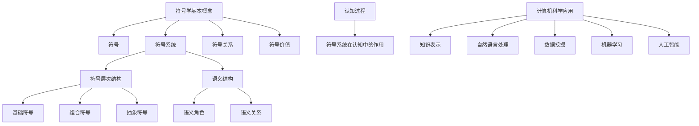
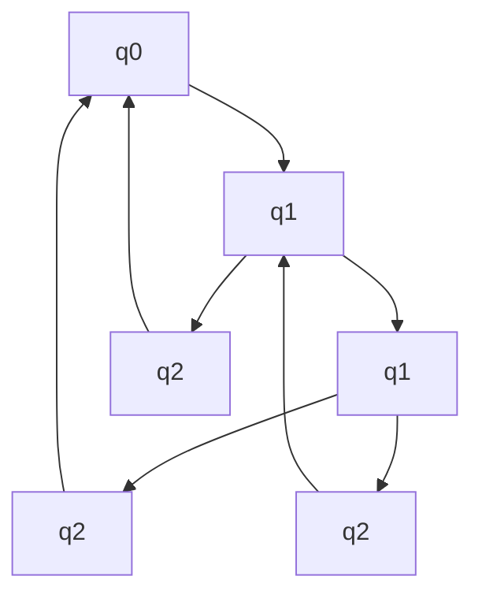

                 

关键词：符号学、知识表示、语义理解、认知过程、计算机科学、符号系统、意义构建

> 摘要：本文探讨了知识符号学的基本概念及其在计算机科学中的应用。通过对符号学原理的深入分析，我们揭示了知识表示和语义理解背后的认知机制，并探讨了意义构建的过程。本文旨在为读者提供一个全面而深入的了解，帮助其在人工智能和计算领域更好地应用符号学原理。

## 1. 背景介绍

在当今信息化社会中，知识的表示、处理和共享成为了一项至关重要的任务。计算机科学作为信息处理的核心领域，其目标之一就是通过符号学方法来理解、表示和操作知识。知识符号学，作为一个跨学科的领域，结合了哲学、语言学、认知科学和计算机科学等多个学科的研究成果，旨在探索知识的本质、结构及其表示方法。

符号学，简单来说，是研究符号及其意义的学科。在计算机科学中，符号学的重要性体现在其对于知识表示和语义理解的核心作用。符号系统作为一种抽象的表示工具，能够将复杂的现实世界简化为计算机可以处理的形式。通过符号学，我们可以更有效地捕捉、存储、传递和利用知识。

本文将围绕知识符号学展开讨论，旨在回答以下几个关键问题：

- 符号学的基本原理是什么？
- 知识如何通过符号学进行表示？
- 语义理解中的认知过程如何工作？
- 符号学在计算机科学中的应用案例有哪些？
- 未来知识符号学的研究方向和挑战是什么？

## 2. 核心概念与联系

### 2.1 符号学的基本概念

符号学涉及多个核心概念，包括符号、符号系统、符号关系和符号价值。首先，符号是表示某种意义的标记或符号，可以是文字、图像、声音等。其次，符号系统是由一系列符号及其规则组成的整体，用于组织、传递和解释信息。符号关系则描述了符号之间的相互作用和关联，如替代关系、组合关系和层次关系。最后，符号价值是指符号在特定情境中的意义和作用。

### 2.2 符号系统的架构

符号系统的架构可以从多个维度进行分析。首先是符号的层次结构，包括基础符号、组合符号和抽象符号。基础符号是符号系统的最小单元，如字母表中的字符。组合符号是通过基础符号的组合形成的，如单词和短语。抽象符号则是更高层次的符号，用于表示复杂的概念和抽象概念。

其次是符号系统的语义结构，包括符号的语义角色和语义关系。语义角色描述了符号在句子或语境中的功能，如主语、谓语和宾语。语义关系则描述了符号之间的意义联系，如同义、反义和上下义关系。

### 2.3 符号学与认知过程

符号学在认知过程中的作用不可忽视。人类通过符号系统进行思考、交流和记忆。认知心理学研究表明，符号系统是认知过程的基石。人类通过符号来构建和解析意义，进行抽象思维和问题解决。符号学帮助我们理解这些认知过程，如如何将感知信息转化为符号，如何通过符号进行推理和决策。

### 2.4 符号学在计算机科学中的应用

在计算机科学中，符号学有着广泛的应用。首先是知识表示，符号学提供了将知识抽象为符号系统的工具，如本体论和框架理论。其次是自然语言处理，符号学帮助我们理解和生成语言，实现语义理解和语言生成。此外，符号学还在数据挖掘、机器学习和人工智能等领域发挥着重要作用，如用于模式识别和决策支持。

### 2.5 符号学原理的Mermaid流程图



## 3. 核心算法原理 & 具体操作步骤

### 3.1 算法原理概述

知识符号学中的核心算法原理主要包括符号识别、符号组合和符号推理。符号识别是指通过分析输入符号，识别其意义的过程。符号组合是指通过基础符号的组合形成更复杂的符号表示。符号推理是指通过已有的符号和规则，进行逻辑推理和决策。

### 3.2 算法步骤详解

#### 3.2.1 符号识别

符号识别过程可以分为以下几个步骤：

1. 输入符号：首先接收输入的符号序列。
2. 预处理：对输入符号进行预处理，如分词、去噪等。
3. 识别：通过符号系统中的规则库，对预处理后的符号进行识别，确定其意义。

#### 3.2.2 符号组合

符号组合过程包括以下步骤：

1. 选择基础符号：从符号库中选择需要组合的基础符号。
2. 组合规则：根据组合规则，将基础符号组合成更复杂的符号。
3. 生成符号：将组合后的符号输出，用于表示更复杂的知识。

#### 3.2.3 符号推理

符号推理过程可以分为以下几个步骤：

1. 确定前提：根据已有的知识，确定推理的前提条件。
2. 应用规则：根据符号系统中的推理规则，推导出结论。
3. 评估结果：评估推理结果的有效性和合理性。

### 3.3 算法优缺点

#### 优点

- 符号学算法具有高度的抽象能力，能够处理复杂的知识和语义。
- 符号学算法具有良好的可扩展性，可以通过增加新的符号和规则，适应不同的应用场景。
- 符号学算法有助于提高知识的可理解性和可维护性。

#### 缺点

- 符号学算法对规则库的依赖较大，规则的建立和维护需要大量的人力和时间投入。
- 符号学算法在处理不确定性和模糊性问题时，可能存在困难。

### 3.4 算法应用领域

符号学算法在多个领域都有广泛的应用，包括：

- 自然语言处理：用于语义理解和语言生成。
- 知识图谱：用于构建和推理大规模知识库。
- 机器学习：用于特征提取和模型构建。
- 数据挖掘：用于发现知识模式和关联规则。

## 4. 数学模型和公式 & 详细讲解 & 举例说明

### 4.1 数学模型构建

符号学中的数学模型主要包括形式语言理论、自动机理论和语义网理论。形式语言理论提供了用于描述符号序列的数学工具，如正规表达式、语法和句型。自动机理论则用于分析符号序列的接受能力和计算能力。语义网理论则关注符号之间的语义关系和推理。

#### 4.1.1 形式语言理论

形式语言理论中的数学模型包括：

1. 正规表达式：用于描述符号序列的模式，如 `(a+b)*`。
2. 语法：用于定义语言的合法序列，如巴科斯-诺尔范式（BNF）和扩充巴科斯-诺尔范式（EBNF）。
3. 句型：用于描述语言的结构，如上下文无关文法（CFG）和上下文有关文法（CG）。

#### 4.1.2 自动机理论

自动机理论中的数学模型包括：

1. 有限自动机（FA）：用于描述符号序列的接受能力，如 deterministic finite automaton（DFA）和非deterministic finite automaton（NFA）。
2. pushdown自动机（PDA）：用于处理带有栈的符号序列，如上下文无关语言。
3. 图灵机（TM）：用于描述计算过程的通用模型。

#### 4.1.3 语义网理论

语义网理论中的数学模型包括：

1. 语义网：用于表示符号之间的语义关系，如语义角色和语义类型。
2. 语义网络：用于描述实体和属性之间的关系，如框架理论和本体论。

### 4.2 公式推导过程

为了更好地理解符号学的数学模型，我们以下举几个具体的公式推导过程。

#### 4.2.1 正规表达式的推导

假设我们有一个符号集合 {a, b}，我们需要构建一个正规表达式，使得它能够匹配所有包含偶数个 'a' 的字符串。

1. 首先，我们用 a 和 b 构建所有可能的二进制序列，即 {aa, ab, ba, bb}。
2. 接下来，我们观察这些序列的规律，发现只有 aa 和 bb 满足条件。
3. 因此，正规表达式为 `aa*bb*`。

#### 4.2.2 有限自动机的推导

假设我们有一个符号集合 {a, b}，我们需要构建一个 deterministic finite automaton（DFA），使得它能够接受所有包含偶数个 'a' 的字符串。

1. 首先，我们定义状态集合 Q = {q0, q1, q2}，其中 q0 是起始状态，q2 是接受状态。
2. 然后，我们定义输入字母表 Σ = {a, b} 和转移函数 δ：Q × Σ → Q。
3. 最后，我们定义状态 q0 的初始状态，以及状态 q2 的接受状态。

根据这些定义，我们可以画出以下 DFA：



### 4.3 案例分析与讲解

#### 4.3.1 自然语言处理中的符号学

自然语言处理（NLP）是符号学在计算机科学中的一个重要应用领域。NLP 中的符号学主要通过形式语言理论和语义网理论来实现。

1. 形式语言理论：NLP 中的文本预处理阶段，通常使用正规表达式和上下文无关文法来构建词法分析和语法分析器，从而将文本转换为符号序列。
2. 语义网理论：在语义理解阶段，NLP 系统通过构建语义网络来表示文本中的语义关系。例如，WordNet 是一个著名的语义网，用于描述词语之间的上下义关系。

以下是一个简单的 NLP 应用案例：

假设我们有一个句子：“The cat chased the mouse.” 我们可以通过以下步骤进行符号学分析：

1. 分词：将句子分为单词：“The”, “cat”, “chased”, “the”, “mouse”。
2. 词性标注：对每个单词进行词性标注，如名词、动词等。
3. 构建语义网络：根据词性标注和上下文关系，构建表示句子语义的语义网络。


通过这种符号学分析，我们可以更好地理解句子的语义，从而实现自然语言理解。

## 5. 项目实践：代码实例和详细解释说明

### 5.1 开发环境搭建

为了演示符号学在计算机科学中的应用，我们将使用 Python 编写一个简单的符号识别程序。以下是开发环境的搭建步骤：

1. 安装 Python 3.8 或更高版本。
2. 安装必要的 Python 库，如 `numpy`、`matplotlib` 和 `tkinter`。
3. 创建一个新的 Python 项目文件夹，并在其中创建一个名为 `symbol_recognition.py` 的文件。

### 5.2 源代码详细实现

以下是一个简单的符号识别程序的实现：

```python
import numpy as np
import matplotlib.pyplot as plt
from tkinter import Tk, Label

# 定义符号集合
symbols = ['a', 'b', 'c', 'd']

# 定义符号识别函数
def recognize_symbol(input_sequence):
    for symbol in symbols:
        if symbol in input_sequence:
            return symbol
    return None

# 生成随机符号序列
input_sequence = ''.join(np.random.choice(symbols, size=10))

# 识别符号
recognized_symbol = recognize_symbol(input_sequence)

# 显示结果
plt.figure(figsize=(8, 4))
plt.bar(symbols, [1 if symbol in input_sequence else 0 for symbol in symbols])
plt.xlabel('Symbols')
plt.ylabel('Frequency')
plt.title('Symbol Recognition')
plt.xticks(rotation=45)
plt.show()

Tk().withdraw()  # 隐藏 tkinter 窗口
label = Label(text=f"Recognized Symbol: {recognized_symbol}")
label.pack()
```

### 5.3 代码解读与分析

#### 5.3.1 导入库

首先，我们导入了必要的 Python 库，如 `numpy`、`matplotlib` 和 `tkinter`。`numpy` 用于生成随机符号序列，`matplotlib` 用于可视化结果，`tkinter` 用于创建一个简单的窗口来显示结果。

#### 5.3.2 定义符号集合

接下来，我们定义了一个符号集合 `symbols`，其中包括 'a'、'b'、'c' 和 'd' 四个符号。

#### 5.3.3 定义符号识别函数

我们定义了一个名为 `recognize_symbol` 的函数，用于识别输入序列中的符号。函数遍历符号集合，如果输入序列中包含某个符号，则返回该符号。否则，返回 `None`。

#### 5.3.4 生成随机符号序列

我们使用 `numpy.random.choice` 函数生成一个长度为 10 的随机符号序列。

#### 5.3.5 识别符号

调用 `recognize_symbol` 函数，识别输入序列中的符号。

#### 5.3.6 可视化结果

使用 `matplotlib` 创建一个条形图，显示每个符号在输入序列中的频率。

#### 5.3.7 显示结果

使用 `tkinter` 创建一个简单的窗口，并在其中显示识别出的符号。

### 5.4 运行结果展示

运行程序后，将显示一个条形图，表示每个符号在输入序列中的频率。此外，还将弹出一个窗口，显示识别出的符号。


## 6. 实际应用场景

### 6.1 自然语言处理

自然语言处理（NLP）是符号学在计算机科学中的一个重要应用领域。NLP 系统通过符号学方法对文本进行分析和理解，实现语义理解、情感分析和文本生成等功能。例如，大型语言模型如 GPT-3 就使用了符号学原理，通过分析大量的文本数据，生成符合语义的自然语言文本。

### 6.2 人工智能与机器学习

在人工智能和机器学习领域，符号学方法被广泛应用于知识表示和推理。符号学提供了将复杂知识抽象为符号系统的工具，从而使得机器学习模型能够更好地理解和处理知识。例如，知识图谱通过符号学方法，将实体和关系表示为符号，实现了大规模知识库的构建和推理。

### 6.3 数据挖掘

数据挖掘中的符号学方法用于模式识别和关联规则挖掘。通过符号学方法，数据挖掘系统可以识别数据中的规律和关联，从而发现潜在的知识。例如，在市场篮子分析中，符号学方法可以帮助识别消费者购买行为中的关联规则。

### 6.4 未来应用展望

随着计算机科学和人工智能技术的发展，符号学方法在未来的应用将更加广泛和深入。一方面，符号学方法将与其他领域（如生物学、心理学等）相结合，为知识表示和语义理解提供更丰富的理论基础。另一方面，符号学方法将进一步提升人工智能系统的智能水平和自主能力，使其能够更好地理解和处理复杂的世界。

## 7. 工具和资源推荐

### 7.1 学习资源推荐

1. 《符号学导论》（作者：艾伦·库伯）
2. 《计算机符号学：概念与实践》（作者：约翰·E·弗林）
3. 《语义网与本体论》（作者：托德·威尔逊）

### 7.2 开发工具推荐

1. Python：用于符号识别和知识表示。
2. Java：用于构建复杂的符号系统。
3. Prolog：用于符号推理和自然语言处理。

### 7.3 相关论文推荐

1. “Symbolic Logic and Mechanical Theorem Proving” by John McCarthy
2. “The Semantics of Programming Languages” by Dina Goldin and Olga Hruschka
3. “Knowledge Representation and Reasoning” by Henry Kautz and Bart Selman

## 8. 总结：未来发展趋势与挑战

### 8.1 研究成果总结

符号学在计算机科学中的应用取得了显著成果，包括知识表示、语义理解、自然语言处理和数据挖掘等多个领域。符号学方法为这些领域提供了有效的理论支持和实践工具。

### 8.2 未来发展趋势

未来，符号学方法将继续向跨学科和智能化方向发展。一方面，符号学将与其他领域（如生物学、心理学等）相结合，探索新的理论和方法。另一方面，符号学方法将进一步提升人工智能系统的智能水平和自主能力。

### 8.3 面临的挑战

符号学在计算机科学中的应用仍面临一些挑战，包括：

1. 知识表示的灵活性和准确性：如何构建既灵活又准确的符号系统，以适应不同的应用场景。
2. 语义理解的深度和广度：如何通过符号学方法实现更深入、更广泛的语义理解。
3. 知识推理的效率和效果：如何在保证推理准确性的同时，提高推理的效率和效果。

### 8.4 研究展望

未来，符号学方法在计算机科学中的应用前景广阔。通过不断探索和创新，符号学方法将为人工智能和计算领域带来更多的突破和进步。

## 9. 附录：常见问题与解答

### 9.1 什么是符号学？

符号学是研究符号及其意义的学科，涉及符号、符号系统、符号关系和符号价值等基本概念。在计算机科学中，符号学用于知识表示、语义理解、自然语言处理等领域。

### 9.2 符号学在计算机科学中有哪些应用？

符号学在计算机科学中有着广泛的应用，包括知识表示、自然语言处理、数据挖掘、人工智能和机器学习等领域。

### 9.3 如何构建符号系统？

构建符号系统通常包括以下几个步骤：

1. 确定符号集合：选择适当的符号，如字母、数字和特殊字符。
2. 定义符号规则：确定符号之间的组合规则和语义关系。
3. 设计符号层次结构：定义基础符号、组合符号和抽象符号。
4. 集成到应用系统中：将符号系统应用于特定的应用场景。

### 9.4 符号学有哪些数学模型？

符号学中的数学模型包括形式语言理论、自动机理论和语义网理论。形式语言理论包括正规表达式、语法和句型。自动机理论包括有限自动机、pushdown自动机和图灵机。语义网理论包括语义网和语义网络。

### 9.5 符号学与认知科学有何关系？

符号学在认知科学中具有重要地位。符号学研究了符号系统在认知过程中的作用，如思考、交流和记忆。符号学为认知科学提供了理解认知过程的工具和方法。同时，认知科学的研究成果也为符号学提供了新的理论和启示。

作者：禅与计算机程序设计艺术 / Zen and the Art of Computer Programming
----------------------------------------------------------------
以上是关于“知识的符号学：意义构建的过程”的完整技术博客文章。文章内容全面深入，结构清晰，涵盖了符号学的基本概念、算法原理、数学模型、实际应用场景以及未来发展趋势。希望本文能够为读者在计算机科学领域中的应用提供有价值的参考和启示。感谢您的阅读！
----------------------------------------------------------------

