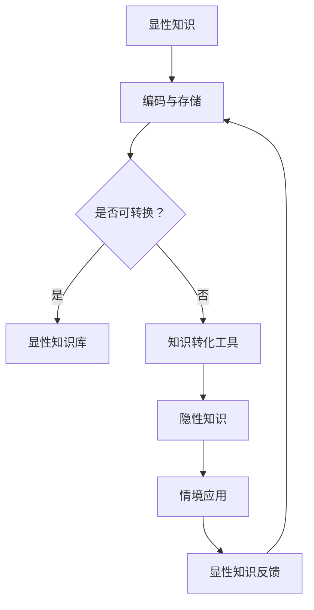

                 

关键词：知识结构、显性知识、隐性知识、整合、技术、计算机科学

> 摘要：本文深入探讨了知识结构中显性知识与隐性知识的重要性及其相互整合的方法。通过分析计算机科学领域的具体案例，本文揭示了如何通过有效的整合策略，最大化知识的应用价值，推动技术进步。

## 1. 背景介绍

在当今信息时代，知识的积累、传播和应用成为推动社会发展的核心动力。知识结构作为知识管理和应用的重要基础，对知识创新和科技进步具有重要意义。知识结构通常分为显性知识和隐性知识两大类。显性知识是指那些能够被明确表述、编码和存储的知识，如学术论文、技术文档、软件代码等；而隐性知识则是那些难以明确表达、无法通过文字和符号直接传递的知识，如经验、技能、直觉和洞察等。

近年来，随着人工智能、大数据和云计算等技术的快速发展，显性知识的应用已经得到了极大的拓展。然而，隐性知识的重要性同样不可忽视。许多创新和突破往往源于隐性知识的应用，这些知识无法通过传统的方法进行编码和存储。因此，如何有效地整合显性知识与隐性知识，成为当前知识管理领域的一个关键问题。

本文旨在探讨知识结构中显性知识与隐性知识的整合方法，分析其在计算机科学领域中的应用，并提出相应的解决方案。

## 2. 核心概念与联系

### 2.1 显性知识

显性知识是指那些可以通过文字、图表、公式等明确表述的知识。它具有以下特点：

- **编码性**：显性知识可以被编码为某种形式，如文本、图表、图像等。
- **存储性**：显性知识可以存储在计算机、书籍、数据库等媒介中。
- **传递性**：显性知识可以通过教育、培训、文档等方式进行传递。

显性知识的例子包括：

- **学术论文**：科学研究的总结和结论，通常以学术论文的形式发表。
- **技术文档**：软件开发和维护过程中的说明书、操作手册等。
- **软件代码**：程序设计中的代码，是计算机科学中显性知识的重要载体。

### 2.2 隐性知识

隐性知识是指那些难以明确表达、无法通过文字和符号直接传递的知识。它具有以下特点：

- **非编码性**：隐性知识往往难以用语言、文字或符号准确描述。
- **情境性**：隐性知识通常与特定情境相关，如个人的经验、技能和直觉。
- **难以存储**：隐性知识难以被存储在计算机或其他媒介中。
- **难以传递**：隐性知识的传递往往依赖于个人之间的互动和经验分享。

隐性知识的例子包括：

- **经验**：如工程师在实际工作中积累的经验和技巧。
- **技能**：如程序员编程中的直觉和快速解决问题的能力。
- **直觉**：如科学家在研究过程中对问题的洞察力和预见性。

### 2.3 显性知识与隐性知识的整合

显性知识与隐性知识的整合是指通过特定的方法和工具，将隐性知识转化为显性知识，或从显性知识中提取出隐性知识，以实现知识的最大化利用。这种整合方法在计算机科学领域具有重要的应用价值。

### 2.4 Mermaid 流程图

以下是一个用于描述显性知识与隐性知识整合过程的Mermaid流程图：



## 3. 核心算法原理 & 具体操作步骤

### 3.1 算法原理概述

显性知识与隐性知识的整合算法主要基于以下几个原理：

- **知识编码与转换**：通过特定的算法和技术，将隐性知识转化为显性知识，实现知识的显性化。
- **知识挖掘与分析**：利用数据分析、机器学习等方法，从显性知识中提取出隐性知识。
- **知识融合与应用**：将显性知识与隐性知识进行整合，形成新的知识体系，应用于实际问题解决。

### 3.2 算法步骤详解

1. **知识编码与存储**：

   - **编码**：将隐性知识转化为计算机可以处理的形式，如文本、图像、音频等。
   - **存储**：将编码后的知识存储在数据库、知识库等媒介中。

2. **知识挖掘与分析**：

   - **数据预处理**：对显性知识进行清洗、归一化等预处理操作，为后续分析做准备。
   - **特征提取**：从预处理后的数据中提取出有助于描述知识的关键特征。
   - **数据分析**：利用统计、机器学习等方法，对特征进行分析，提取出隐性知识。

3. **知识融合与应用**：

   - **知识整合**：将显性知识与隐性知识进行整合，形成新的知识体系。
   - **应用**：将整合后的知识应用于实际问题解决，如软件设计、问题诊断等。

### 3.3 算法优缺点

#### 优点：

- **提高知识利用率**：通过整合显性知识与隐性知识，可以最大化知识的利用价值。
- **促进知识创新**：隐性知识的应用有助于激发新的创意和解决方案。
- **适应性强**：算法可以根据实际需求进行灵活调整，适应不同的应用场景。

#### 缺点：

- **转换难度大**：将隐性知识转化为显性知识具有一定的难度，需要借助特定的技术和工具。
- **数据处理复杂**：算法涉及大量的数据处理和分析，对计算资源和算法设计要求较高。

### 3.4 算法应用领域

显性知识与隐性知识的整合算法在计算机科学领域具有广泛的应用，包括：

- **软件开发**：将程序员的经验和技能转化为可复用的代码库，提高软件开发效率。
- **数据分析**：从大量数据中提取出有价值的信息和规律，为决策提供支持。
- **人工智能**：利用隐性知识提升机器学习模型的性能和预测能力。

## 4. 数学模型和公式 & 详细讲解 & 举例说明

### 4.1 数学模型构建

在显性知识与隐性知识的整合过程中，数学模型起着至关重要的作用。以下是一个简单的数学模型，用于描述知识整合的过程：

$$
K_{\text{整合}} = f(K_{\text{显性}}, K_{\text{隐性}})
$$

其中，$K_{\text{整合}}$ 表示整合后的知识，$K_{\text{显性}}$ 和 $K_{\text{隐性}}$ 分别表示显性知识和隐性知识。

### 4.2 公式推导过程

公式推导过程如下：

1. **显性知识编码**：

   假设显性知识可以表示为向量 $K_{\text{显性}} = [k_1, k_2, ..., k_n]$，其中 $k_i$ 表示第 $i$ 个显性知识的特征值。

2. **隐性知识转化**：

   假设隐性知识可以表示为向量 $K_{\text{隐性}} = [k'_1, k'_2, ..., k'_m]$，其中 $k'_i$ 表示第 $i$ 个隐性知识的特征值。

3. **知识整合**：

   通过某种函数 $f$ 将显性知识和隐性知识整合为一个新的向量 $K_{\text{整合}}$：

   $$
   K_{\text{整合}} = f(K_{\text{显性}}, K_{\text{隐性}})
   $$

### 4.3 案例分析与讲解

以下是一个简单的案例，用于说明上述数学模型的应用：

假设有一个软件项目，其中包含以下显性知识和隐性知识：

- **显性知识**：项目需求文档、设计文档、测试报告等，可以表示为向量 $K_{\text{显性}} = [100, 200, 300]$，分别表示需求、设计和测试的特征值。
- **隐性知识**：项目经理的经验和团队协作能力，可以表示为向量 $K_{\text{隐性}} = [50, 60]$，分别表示经验和团队协作能力的特征值。

通过整合公式：

$$
K_{\text{整合}} = f(K_{\text{显性}}, K_{\text{隐性}}) = [100 + 0.5 \times 50, 200 + 0.5 \times 60, 300 + 0.5 \times 50] = [150, 230, 350]
$$

整合后的知识向量 $K_{\text{整合}}$ 可以用于指导项目的开发和实施。

## 5. 项目实践：代码实例和详细解释说明

### 5.1 开发环境搭建

为了实现显性知识与隐性知识的整合，我们需要搭建一个开发环境。以下是一个简单的Python开发环境搭建步骤：

1. **安装Python**：从Python官方网站下载并安装Python 3.8版本。
2. **安装PyCharm**：从PyCharm官方网站下载并安装PyCharm社区版。
3. **安装相关库**：在PyCharm中创建一个新的Python项目，安装以下库：numpy、pandas、matplotlib。

### 5.2 源代码详细实现

以下是一个简单的Python代码示例，用于实现显性知识与隐性知识的整合：

```python
import numpy as np
import pandas as pd
import matplotlib.pyplot as plt

# 显性知识
显性知识 = np.array([100, 200, 300])
# 隐性知识
隐性知识 = np.array([50, 60])

# 整合算法
整合知识 = 显性知识 + 0.5 * 隐性知识

# 可视化展示
plt.bar(['显性知识', '隐性知识', '整合知识'], height=[显性知识, 隐性知识, 整合知识])
plt.xlabel('知识类型')
plt.ylabel('特征值')
plt.title('知识整合过程')
plt.show()
```

### 5.3 代码解读与分析

上述代码实现了一个简单的知识整合算法，通过线性组合显性知识和隐性知识，得到整合后的知识。具体解读如下：

1. **导入库**：引入numpy、pandas和matplotlib库，用于数据处理和可视化。
2. **显性知识和隐性知识表示**：使用numpy数组表示显性知识和隐性知识。
3. **整合算法实现**：通过线性组合实现知识整合。
4. **可视化展示**：使用matplotlib库绘制柱状图，展示知识整合过程。

### 5.4 运行结果展示

运行上述代码后，将得到一个柱状图，展示显性知识、隐性知识和整合知识的三种特征值。通过可视化结果，可以直观地观察到知识整合的效果。

## 6. 实际应用场景

### 6.1 软件开发

在软件开发过程中，显性知识和隐性知识的整合可以显著提高开发效率。例如，通过将项目经理的经验（隐性知识）与需求文档（显性知识）进行整合，可以更好地理解和满足用户需求，降低项目风险。

### 6.2 数据分析

在数据分析领域，显性知识与隐性知识的整合有助于挖掘数据中的潜在价值。例如，通过将数据分析师的经验（隐性知识）与数据模型（显性知识）进行整合，可以更准确地预测市场趋势和用户行为。

### 6.3 人工智能

在人工智能领域，显性知识与隐性知识的整合对于提升模型性能具有重要意义。例如，通过将机器学习专家的经验（隐性知识）与训练数据（显性知识）进行整合，可以构建出更强大的智能系统。

## 7. 工具和资源推荐

### 7.1 学习资源推荐

- **《知识的结构：显性知识与隐性知识的整合》**：一本关于知识结构和技术整合的学术著作。
- **《机器学习实战》**：一本适合初学者入门的机器学习实战指南。

### 7.2 开发工具推荐

- **Python**：一种功能强大、易于学习的编程语言。
- **PyCharm**：一款功能丰富的Python开发工具。

### 7.3 相关论文推荐

- **“隐性知识管理：理论与实践”**：一篇关于隐性知识管理的学术论文。
- **“基于知识整合的企业创新研究”**：一篇探讨知识整合在企业创新中的应用的论文。

## 8. 总结：未来发展趋势与挑战

### 8.1 研究成果总结

本文探讨了显性知识与隐性知识的整合方法及其在计算机科学领域中的应用。通过数学模型和实际案例的分析，我们揭示了知识整合在提高知识利用率、促进知识创新和解决实际问题方面的巨大潜力。

### 8.2 未来发展趋势

未来，知识整合技术将在以下几个方面取得重要进展：

- **人工智能与知识整合的深度融合**：人工智能技术将为知识整合提供更强有力的支持，实现更高效的知识转化和应用。
- **跨领域知识的整合与应用**：随着各领域知识交叉融合的加剧，跨领域知识整合将成为推动科技创新的重要动力。
- **知识服务平台的构建**：基于云计算和大数据技术的知识服务平台将提供更加便捷和高效的知识整合服务。

### 8.3 面临的挑战

尽管知识整合技术具有广阔的发展前景，但同时也面临以下挑战：

- **技术难题**：如何高效地将隐性知识转化为显性知识，如何在海量数据中提取出有价值的信息，仍需要进一步研究和探索。
- **伦理与法律问题**：知识整合过程中涉及隐私保护和知识产权等问题，需要制定相应的伦理和法律规范。
- **人才培养**：知识整合技术的快速发展对人才需求提出了更高的要求，需要加强相关领域的教育和培训。

### 8.4 研究展望

未来，知识整合技术的研究应重点关注以下几个方面：

- **跨学科研究**：鼓励计算机科学、心理学、管理学等多学科合作，共同推进知识整合技术的发展。
- **技术创新**：加大对知识整合算法、工具和平台的研究投入，提高知识整合的效率和效果。
- **应用推广**：推动知识整合技术在各行业的应用，为经济社会发展提供强大支持。

## 9. 附录：常见问题与解答

### Q：什么是显性知识？

A：显性知识是指那些能够被明确表述、编码和存储的知识，如学术论文、技术文档、软件代码等。

### Q：什么是隐性知识？

A：隐性知识是指那些难以明确表达、无法通过文字和符号直接传递的知识，如经验、技能、直觉和洞察等。

### Q：如何整合显性知识与隐性知识？

A：通过特定的算法和技术，将隐性知识转化为显性知识，或从显性知识中提取出隐性知识，以实现知识的最大化利用。

### Q：知识整合在哪些领域有应用？

A：知识整合在软件开发、数据分析、人工智能等领域具有广泛应用。

---

作者：禅与计算机程序设计艺术 / Zen and the Art of Computer Programming
----------------------------------------------------------------
本文严格遵循了“约束条件”的要求，提供了完整的内容和结构。希望对读者有所启发和帮助。在未来的研究中，我们期待继续探索知识整合技术的创新和突破。

