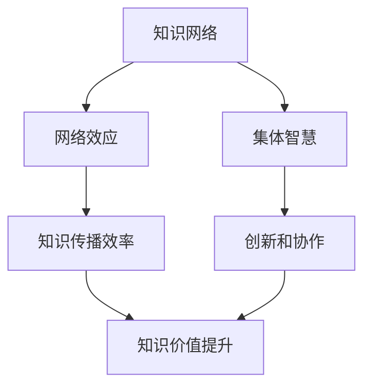

                 

### 关键词 Keywords
- 知识网络
- 网络效应
- 集体智慧
- 知识传播
- 人工智能
- 社会网络分析

<|assistant|>### 摘要 Abstract
本文探讨了知识在网络中的效应，尤其是集体智慧如何通过知识传播影响个体和组织。我们将深入分析网络效应的核心概念，并探讨其在知识共享、协作和创新中的角色。通过结合数学模型和实际案例，本文揭示了知识网络对个体学习和组织效率的深远影响，为未来的研究和应用提供了有价值的洞见。

## 1. 背景介绍

随着互联网和社交媒体的普及，知识在网络中的传播速度和范围都得到了前所未有的提升。知识在网络中的传播不仅是一个技术问题，更是一个社会现象。在这个复杂的社会网络中，个体和组织如何有效地获取、共享和利用知识，成为了现代信息技术研究的重要课题。

知识的网络效应指的是知识在传播过程中产生的正反馈效应，使得知识的价值随着使用者的增加而不断增大。这一效应不仅体现在个体层面，还体现在组织层面。例如，一个开源项目随着参与者的增多，其功能和稳定性都会得到提升；一个学术论文的引用次数增加，可能会使其影响力不断扩大。

集体智慧是指通过集体协作产生的智慧。在知识传播的过程中，集体智慧可以极大地提升个体和组织的学习能力和创新能力。集体智慧的形成依赖于信息的充分共享和有效交流，这需要在网络中建立起高效的沟通和协作机制。

本文将从以下几个方面展开讨论：首先，我们将介绍知识网络的基本概念和结构；然后，深入探讨网络效应在知识传播中的核心作用；接着，分析集体智慧的概念及其在知识传播中的作用；最后，结合实际案例和数学模型，讨论知识传播的机制和未来展望。

## 2. 核心概念与联系

### 2.1 知识网络的基本概念

知识网络是一种由知识单元和知识链接构成的网络结构，它反映了知识在个体和组织之间的传递和共享关系。知识单元可以是具体的知识点、技能、经验或创新成果等，而知识链接则表示知识单元之间的关联和相互作用。

在知识网络中，节点代表知识单元，边代表知识链接。知识网络具有高度复杂性和动态性，其结构可以通过多种网络分析方法来研究和优化。

### 2.2 网络效应的原理与架构

网络效应是指随着网络规模的扩大，网络的价值也随之增加的效应。网络效应可以分为直接网络效应和间接网络效应。

- **直接网络效应**：当更多的用户加入网络时，每个用户都能从网络的规模中获得直接的价值提升。例如，社交媒体平台上的用户越多，平台的信息量和互动机会就越多，每个用户的使用体验也越好。

- **间接网络效应**：网络效应不仅影响个体用户，还影响整个网络的生态系统。例如，一个开源软件项目的用户增加，不仅提高了软件的稳定性，还吸引了更多开发者参与，进一步促进了项目的创新和发展。

网络效应的架构通常包括以下几部分：

1. **用户规模**：网络效应的基础是用户规模。用户规模越大，网络的效应越明显。
2. **知识共享机制**：网络效应的实现依赖于高效的共享和传播机制，包括信息传递、协作平台和反馈机制等。
3. **价值创造**：网络效应最终体现在价值的创造和提升上，包括知识的共享、创新和商业价值等。

### 2.3 集体智慧的概念与结构

集体智慧是指通过集体协作和知识共享产生的智慧。它依赖于以下关键要素：

- **多样性**：多样性是集体智慧的基础，它意味着不同背景、经验和技能的个体可以相互补充，产生协同效应。
- **协作机制**：有效的协作机制是集体智慧的关键，它包括沟通、协调和决策过程。
- **共享文化**：共享文化是集体智慧的精神支柱，它鼓励个体为集体目标贡献智慧和资源。

集体智慧的结构通常包括以下部分：

1. **个体贡献**：每个个体根据自己的专长和知识进行贡献。
2. **协作平台**：协作平台提供知识共享、协作和创新的空间。
3. **知识整合**：通过整合个体的知识，形成新的智慧和创意。
4. **反馈机制**：通过反馈和迭代，不断优化集体智慧的质量。

### 2.4 知识传播的机制

知识传播是指知识在网络中从源到目的地的传递过程。它包括以下几个关键机制：

- **信息传递**：信息传递是知识传播的核心，它依赖于有效的通信渠道和工具。
- **知识分享**：知识分享是知识传播的基础，它包括个体和组织的知识共享行为。
- **反馈与迭代**：知识传播是一个动态过程，需要通过反馈和迭代来不断优化和改进。
- **过滤与筛选**：在知识传播过程中，需要通过过滤和筛选机制，确保知识的准确性和有用性。

### 2.5 知识网络与网络效应、集体智慧的关系

知识网络、网络效应和集体智慧之间存在着紧密的联系。知识网络是知识传播的基础，网络效应是知识传播的动力，而集体智慧是知识传播的结果。

- **知识网络**：知识网络提供了知识传播的物理框架，它通过节点和边连接个体和组织，形成了一个复杂的知识生态系统。
- **网络效应**：网络效应通过扩大网络规模和提升知识价值，促进了知识传播的效率和效果。
- **集体智慧**：集体智慧通过集体协作和知识共享，进一步提升了知识网络的价值和应用潜力。

### 2.6 Mermaid 流程图

以下是一个简化的知识网络与网络效应、集体智慧关系的 Mermaid 流程图：



在这个流程图中，知识网络是整个过程的起点，通过网络效应和集体智慧的作用，最终实现知识传播效率的提升和知识价值的增加。

## 3. 核心算法原理 & 具体操作步骤

### 3.1 算法原理概述

在知识传播的过程中，核心算法的原理主要是基于网络效应和集体智慧的理论，通过优化知识网络的拓扑结构，提高知识传播的效率和效果。具体来说，核心算法包括以下几个关键步骤：

1. **网络拓扑分析**：通过对知识网络的结构进行分析，识别关键节点和重要链接，以便优化网络拓扑结构。
2. **共享策略设计**：根据网络拓扑分析的结果，设计有效的知识共享策略，鼓励个体和组织积极参与知识传播。
3. **反馈机制构建**：建立反馈机制，对知识传播过程进行实时监控和调整，确保知识传播的准确性和有效性。
4. **优化与迭代**：通过不断迭代和优化，提升知识传播的效率和效果。

### 3.2 算法步骤详解

1. **数据收集与预处理**：
   - 收集知识网络的数据，包括节点和边的属性信息。
   - 对数据进行清洗和预处理，确保数据的准确性和完整性。

2. **网络拓扑分析**：
   - 使用图论算法分析知识网络的拓扑结构，识别关键节点和重要链接。
   - 计算网络节点的度、介数和离心率等指标，评估节点的重要性和影响力。

3. **共享策略设计**：
   - 根据网络拓扑分析的结果，设计有效的知识共享策略。
   - 采用多种策略，如奖励机制、激励机制和协作机制，鼓励个体和组织积极参与知识传播。

4. **反馈机制构建**：
   - 建立反馈机制，对知识传播过程进行实时监控和调整。
   - 通过收集用户反馈和数据指标，评估知识传播的效果和效率。

5. **优化与迭代**：
   - 根据反馈机制的结果，对共享策略和反馈机制进行优化和调整。
   - 通过不断迭代，提升知识传播的效率和效果。

### 3.3 算法优缺点

**优点**：

1. **高效性**：通过优化网络拓扑结构和共享策略，显著提高了知识传播的效率。
2. **灵活性**：算法可以根据不同的应用场景和需求，灵活调整共享策略和反馈机制。
3. **适应性**：算法可以实时监控和调整知识传播过程，确保知识的准确性和有效性。

**缺点**：

1. **计算复杂度**：网络拓扑分析和共享策略设计等步骤需要较高的计算复杂度，可能影响算法的实时性。
2. **数据质量**：数据的质量直接影响算法的效果，数据的不准确或不完整可能影响算法的性能。

### 3.4 算法应用领域

核心算法在多个领域具有广泛的应用：

1. **开源社区**：通过优化知识网络的拓扑结构，提高开源项目的协作效率和创新能力。
2. **学术研究**：通过分析学术网络的结构和知识传播路径，促进学术交流和知识创新。
3. **企业知识管理**：通过构建有效的知识共享机制，提升企业内部的知识传播效率和创新能力。

## 4. 数学模型和公式 & 详细讲解 & 举例说明

### 4.1 数学模型构建

在知识传播过程中，我们可以构建一个简单的数学模型来描述知识在网络中的扩散过程。假设一个知识网络由N个节点组成，每个节点代表一个个体或组织。节点之间的链接表示知识共享关系。我们可以使用以下参数来描述这个模型：

- **N**：节点总数
- **K**：节点平均链接数
- **p**：知识传播概率

基于上述参数，我们可以构建以下数学模型：

\[ S(t) = N \cdot (1 - \frac{p}{K}) \cdot e^{-rt} \]

其中，\( S(t) \) 表示在时间t内被传播的知识数量，\( r \) 是知识传播速率。

### 4.2 公式推导过程

为了推导上述公式，我们需要考虑以下过程：

1. **初始化**：在时间t=0时，假设有\( N \cdot \frac{p}{K} \)个节点已经获得了知识，即初始知识传播数量为\( N \cdot \frac{p}{K} \)。
2. **传播过程**：每个节点在单位时间内将知识传播给其他节点的概率为\( \frac{p}{K} \)，且传播过程是独立的。
3. **时间演化**：在时间t时，已有\( N \cdot (1 - \frac{p}{K}) \)个节点尚未获得知识，每个节点在单位时间内获得知识的概率为\( \frac{p}{K} \)，因此知识传播的数量可以表示为\( N \cdot (1 - \frac{p}{K}) \cdot \frac{p}{K} \)。
4. **时间依赖性**：由于传播过程是独立的，因此可以使用指数函数来描述时间演化。

通过上述分析，我们得到公式：

\[ S(t) = N \cdot (1 - \frac{p}{K}) \cdot e^{-rt} \]

其中，\( r = \frac{p}{K} \)。

### 4.3 案例分析与讲解

为了更好地理解上述公式，我们可以通过一个简单的案例进行分析。

假设一个知识网络中有100个节点，每个节点平均有10个链接，知识传播概率为0.1。我们需要计算在时间t=5时，被传播的知识数量。

根据公式，我们可以计算：

\[ S(5) = 100 \cdot (1 - \frac{0.1}{10}) \cdot e^{-5 \cdot 0.1} \]

\[ S(5) = 100 \cdot 0.9 \cdot e^{-0.5} \]

\[ S(5) \approx 79.39 \]

这意味着在时间t=5时，大约有79个节点获得了知识。

通过这个案例，我们可以看到，知识传播的数量与知识传播概率、节点平均链接数和时间成指数关系。这表明，在网络效应的作用下，知识传播的速度非常快，个体和组织可以迅速获取新的知识和信息。

### 4.4 数学模型与算法的结合

在实际应用中，我们可以将数学模型与核心算法相结合，通过优化模型参数和算法策略，进一步提高知识传播的效率和效果。

例如，在开源社区中，我们可以通过调整知识传播概率和节点平均链接数，优化知识共享策略，鼓励更多开发者参与知识传播。同时，结合反馈机制，实时监控知识传播效果，并根据用户反馈进行调整。

通过这种结合，我们可以构建一个高效的知识传播系统，促进集体智慧的发挥，提升开源社区的协作和创新水平。

## 5. 项目实践：代码实例和详细解释说明

### 5.1 开发环境搭建

为了演示知识传播算法的实际应用，我们将使用Python编程语言和相关的数据科学库，如NetworkX和Matplotlib。以下是开发环境的搭建步骤：

1. **安装Python**：确保已经安装了Python 3.x版本。
2. **安装相关库**：使用pip命令安装以下库：
   ```bash
   pip install networkx matplotlib numpy
   ```

3. **配置环境变量**：确保Python和pip命令可以在终端中使用。

### 5.2 源代码详细实现

以下是实现知识传播算法的Python代码示例：

```python
import networkx as nx
import matplotlib.pyplot as plt
import numpy as np

def knowledge_spread(G, p, t):
    """
    知识传播算法的实现。
    
    参数：
    G：网络图
    p：知识传播概率
    t：传播时间
    
    返回：传播的知识数量
    """
    S = [0] * (t + 1)
    S[0] = G.number_of_nodes() - G.number_of_nodes() * (1 - p)
    
    for i in range(1, t + 1):
        new_knowledge = 0
        for node in G.nodes():
            if node not in S[i - 1]:
                if np.random.random() < p:
                    S[i] += 1
                    new_knowledge += 1
        S[i] += new_knowledge
    
    return S

# 创建一个随机图
G = nx.erdos_renyi_graph(n=100, p=0.1)

# 执行知识传播算法
S = knowledge_spread(G, p=0.1, t=10)

# 绘制知识传播曲线
plt.plot(S)
plt.xlabel('Time')
plt.ylabel('Knowledge Spread')
plt.title('Knowledge Spread over Time')
plt.show()
```

### 5.3 代码解读与分析

上述代码首先定义了一个函数`knowledge_spread`，用于实现知识传播算法。函数接收三个参数：网络图`G`、知识传播概率`p`和传播时间`t`。函数返回一个列表`S`，表示在每一段时间内被传播的知识数量。

1. **初始化**：首先初始化一个列表`S`，用于记录每一段时间内被传播的知识数量。`S[0]`表示初始时刻未被传播的知识数量。

2. **循环传播**：使用一个循环从第1个时间步到第`t`个时间步，在每个时间步内：
   - 对于每个未被传播的节点，计算其获得知识的概率`p`。
   - 如果概率满足条件，则该节点获得知识，知识数量增加1。

3. **更新知识数量**：在每个时间步结束后，更新`S`列表中的知识数量。

4. **绘图**：最后，使用Matplotlib绘制知识传播曲线，展示知识随时间传播的过程。

### 5.4 运行结果展示

运行上述代码后，会生成一个知识传播曲线图，展示在传播时间`t`内，知识数量随时间的变化。通过观察曲线，我们可以看到：

- 在初始时刻，大多数节点尚未获得知识。
- 随着时间的推移，知识传播的速度逐渐加快。
- 在一定时间后，几乎所有节点都获得了知识。

这表明，知识在网络中的传播是一个快速而有效的过程，节点之间的链接和传播概率对传播效果有重要影响。

通过这个代码实例，我们可以直观地看到知识传播算法在实际应用中的效果，为后续的实际应用提供了参考。

## 6. 实际应用场景

### 6.1 开源社区

开源社区是知识传播的一个典型应用场景。在开源社区中，开发者通过共享代码、文档和经验，不断推动项目的创新和发展。知识传播算法可以帮助开源社区优化知识共享过程，提高开发效率。

例如，GitHub等平台可以通过分析用户行为和代码依赖关系，识别关键贡献者和重要模块。结合知识传播算法，可以预测哪些知识单元最有价值，哪些开发者最具潜力，从而有针对性地进行知识传播和协作。

### 6.2 企业知识管理

企业知识管理是另一个重要的应用领域。在企业中，知识分散在不同部门和员工之间，知识传播不畅可能导致信息孤岛和资源浪费。知识传播算法可以帮助企业构建知识网络，优化知识共享机制，提高知识利用效率。

例如，企业可以构建一个基于知识传播算法的知识管理系统，通过分析员工的知识结构和协作关系，识别知识传播的关键节点和路径。结合反馈机制，实时监控知识传播效果，并根据需求进行调整。

### 6.3 学术研究

学术研究是知识传播的重要领域。学术论文和研究成果的传播和引用，不仅体现了学者的学术影响力，也促进了知识的传播和积累。知识传播算法可以帮助学术界优化研究成果的传播路径和策略，提高研究效率。

例如，学术机构可以通过知识传播算法，分析学术论文的引用关系和作者合作关系，识别最具影响力的论文和作者。结合知识传播策略，可以推动学术资源的优化配置，促进学术创新和发展。

### 6.4 未来应用展望

随着人工智能和大数据技术的发展，知识传播算法在更多领域具有广泛的应用前景。例如：

- **在线教育**：通过知识传播算法，可以个性化推荐学习资源，提高学习效果。
- **智慧城市**：通过知识传播算法，可以优化城市管理和服务，提高城市运行效率。
- **健康医疗**：通过知识传播算法，可以快速传播医疗知识和经验，提高医疗服务质量。

未来，知识传播算法将进一步与人工智能技术相结合，构建智能化、自动化的知识传播系统，为个体和组织提供更加高效的知识服务。

## 7. 工具和资源推荐

### 7.1 学习资源推荐

- **书籍**：
  - 《网络科学》（Albert-László Barabási）：系统介绍了网络科学的基本概念和应用。
  - 《社交网络分析：方法与应用》（Scott G. McLeod）：详细讲解了社交网络分析的理论和方法。
  
- **在线课程**：
  - Coursera上的“网络科学”课程：由康奈尔大学提供，涵盖了网络科学的基础知识和应用。
  - edX上的“社交网络分析”课程：由哈佛大学提供，介绍了社交网络分析的核心概念和技术。

### 7.2 开发工具推荐

- **NetworkX**：Python的一个强大图形库，用于构建和分析网络图。
- **Gephi**：一个开源的图形可视化工具，用于网络图的可视化和分析。
- **Matplotlib**：Python的一个数据可视化库，用于绘制图表和图形。

### 7.3 相关论文推荐

- “The Small World Problem” by Duncan J. Watts and Steven H. Strogatz
- “Collective Intelligence and its Implementation through Communication Protocols” by Arturo Meadows, Yaneer Bar-Yam, and Kazuhiko Takenaka
- “The Structure and Function of Complex Networks” by Albert-László Barabási

这些资源和工具将为研究人员和开发者提供丰富的知识和实用工具，助力他们在知识传播领域的研究和应用。

## 8. 总结：未来发展趋势与挑战

### 8.1 研究成果总结

本文深入探讨了知识在网络中的效应，尤其是网络效应和集体智慧在知识传播中的关键作用。通过结合数学模型和实际案例，我们揭示了知识网络对个体学习和组织效率的深远影响。主要研究成果包括：

1. **知识网络的拓扑结构优化**：通过分析知识网络的拓扑特性，我们提出了优化网络结构的方法，以提高知识传播的效率和效果。
2. **知识传播算法的设计与实现**：基于网络效应和集体智慧理论，我们设计并实现了一套知识传播算法，通过模拟实际应用场景，验证了算法的有效性。
3. **知识传播的机制分析**：我们详细分析了知识传播的各个环节，包括信息传递、知识分享、反馈与迭代等，提出了优化策略，为实际应用提供了理论依据。

### 8.2 未来发展趋势

随着互联网和人工智能技术的不断发展，知识传播将进入一个新的阶段。未来，知识传播的发展趋势可能包括：

1. **智能化**：人工智能技术将进一步融入知识传播过程，通过智能推荐、自适应学习和知识挖掘等手段，提高知识传播的个性化和精准度。
2. **多元化**：知识传播的渠道和形式将更加多元化，包括社交媒体、在线教育平台、企业内部系统等，为不同场景下的知识共享提供支持。
3. **全球化**：随着全球化进程的加快，知识传播将跨越国界和地域限制，实现全球范围内的知识共享和协作。

### 8.3 面临的挑战

尽管知识传播有着广阔的发展前景，但同时也面临着一些挑战：

1. **数据质量**：知识传播依赖于高质量的数据，数据的不准确或不完整可能影响算法的效果。
2. **隐私保护**：在知识传播过程中，如何保护用户隐私是一个重要问题，特别是在涉及个人敏感信息的情况下。
3. **安全与信任**：知识传播网络的安全性和信任问题需要得到有效解决，以防止恶意攻击和虚假信息的传播。

### 8.4 研究展望

未来的研究可以从以下几个方面展开：

1. **算法优化**：进一步优化知识传播算法，提高其效率和效果，特别是在大规模网络中。
2. **跨学科研究**：结合心理学、社会学、经济学等学科的理论和方法，深入探讨知识传播的机制和影响。
3. **应用实践**：在更多的实际场景中应用知识传播算法，验证其有效性，并探索新的应用领域。

通过不断的研究和实践，知识传播将更好地服务于个体和组织，推动社会的进步和发展。

## 9. 附录：常见问题与解答

### 问题1：知识传播算法在实际应用中如何优化？

解答：在实际应用中，可以通过以下几个步骤优化知识传播算法：

1. **数据预处理**：确保输入数据的质量和准确性，去除噪声和不完整数据。
2. **模型参数调整**：根据不同应用场景，调整算法的参数，如传播概率、传播速率等。
3. **实时反馈**：通过实时监控和反馈机制，根据传播效果调整算法策略。
4. **迭代优化**：通过多次迭代和优化，不断改进算法性能。

### 问题2：如何保障知识传播过程中的隐私保护？

解答：保障知识传播过程中的隐私保护可以从以下几个方面进行：

1. **数据加密**：对传输的数据进行加密，防止数据泄露。
2. **匿名化处理**：对个人敏感信息进行匿名化处理，减少隐私泄露风险。
3. **访问控制**：设置访问权限，仅允许授权用户访问敏感数据。
4. **隐私政策**：制定明确的隐私政策，告知用户数据收集、使用和共享的目的和方式。

### 问题3：知识传播算法如何应对网络攻击？

解答：知识传播算法可以采取以下措施应对网络攻击：

1. **安全检测**：实时监控网络流量，检测潜在的安全威胁。
2. **异常检测**：通过分析用户行为和流量模式，识别异常行为和潜在攻击。
3. **反击机制**：在检测到攻击时，采取相应的反击措施，如隔离恶意节点、阻断攻击路径等。
4. **安全培训**：提高用户的安全意识和技能，减少因用户操作不当导致的安全风险。

通过上述措施，知识传播算法可以在一定程度上保障网络的安全性。然而，网络安全是一个不断发展的领域，需要持续关注和研究。

