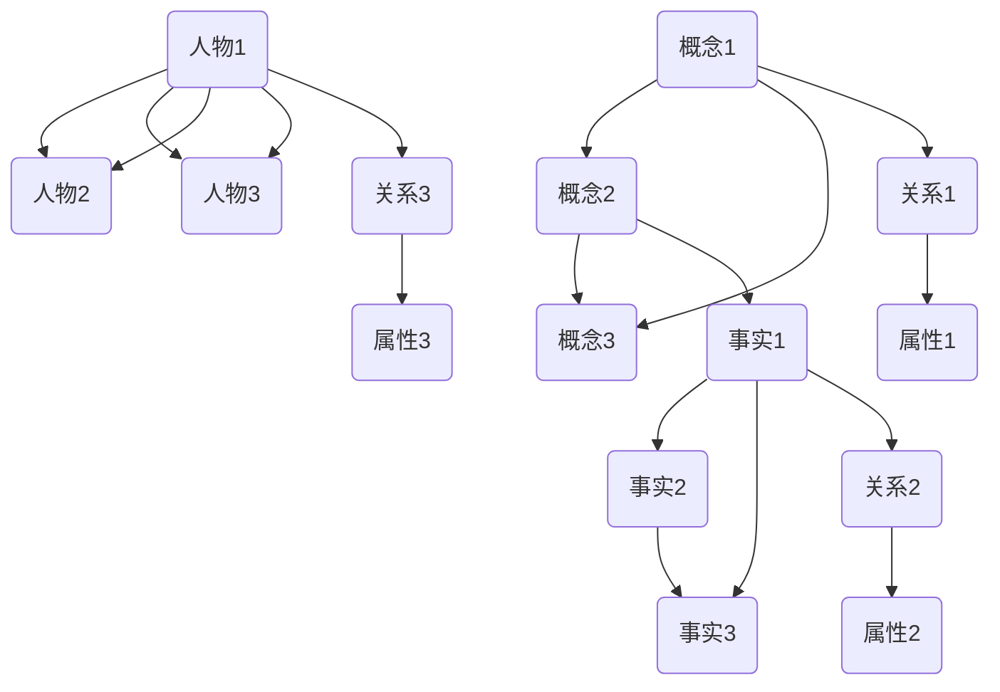

                 

 **关键词：** 知识网络、复杂关系、可视化、网络科学、数据结构

**摘要：** 本文探讨了知识在网络科学中的表现形式，以及如何通过可视化技术来揭示复杂关系。文章首先介绍了知识网络的概念及其在网络科学中的重要性，然后讨论了可视化技术在知识网络中的应用，最后提出了未来研究的方向和挑战。

## 1. 背景介绍

知识网络是指由概念、事实、关系等组成的网络结构，用于描述知识之间的相互联系。随着互联网和大数据技术的发展，知识网络在各个领域得到了广泛的应用，如语义网、推荐系统、知识图谱等。然而，知识网络的复杂性和规模使得人类难以直观地理解和分析其中的关系。

网络科学是一门研究复杂网络结构和动态行为的跨学科领域。它结合了物理学、数学、计算机科学、社会学等多个学科的理论和方法，旨在揭示复杂网络的内在规律和宏观现象。在知识网络的研究中，网络科学提供了强大的工具和方法，帮助我们更好地理解和利用这些复杂的知识结构。

可视化技术是网络科学研究中的重要工具之一。通过将抽象的网络结构以图形化的形式展现出来，可视化技术使得研究者能够直观地观察和分析网络中的节点、边以及它们之间的关系。在知识网络的背景下，可视化技术不仅能够帮助人们更好地理解知识的分布和联系，还可以用于辅助决策、发现潜在的模式和规律。

本文将围绕知识在网络科学中的表现形式，探讨可视化技术在揭示复杂关系中的应用，并提出未来研究的方向和挑战。文章结构如下：

- 第1章：背景介绍，介绍知识网络、网络科学和可视化技术的基本概念。
- 第2章：核心概念与联系，通过Mermaid流程图展示知识网络的架构。
- 第3章：核心算法原理 & 具体操作步骤，介绍知识网络中的主要算法和操作方法。
- 第4章：数学模型和公式 & 详细讲解 & 举例说明，探讨知识网络中的数学模型和推导过程。
- 第5章：项目实践：代码实例和详细解释说明，展示一个实际知识网络项目的开发过程。
- 第6章：实际应用场景，介绍知识网络在不同领域的应用。
- 第7章：工具和资源推荐，推荐学习资源、开发工具和相关论文。
- 第8章：总结：未来发展趋势与挑战，总结研究成果并探讨未来发展方向。

## 2. 核心概念与联系

知识网络中的核心概念包括节点、边、关系和属性等。节点表示知识实体，如概念、事实或人物等；边表示节点之间的关联关系，如因果关系、相似关系或依赖关系等；关系则是对边的一种分类，用于描述不同类型的关联；属性则是节点的额外信息，如标签、权重或置信度等。

下面通过一个Mermaid流程图来展示知识网络的架构：



在这个流程图中，我们可以看到节点A、D、G表示不同的知识实体，它们通过边B、C、E、F、H、I连接起来，形成了一个复杂的关系网络。每个节点还关联了一个关系节点J、K、L，用于描述它们之间的不同类型的关联关系。此外，节点还关联了一些属性节点M、N、O，用于表示节点的额外信息。

通过这个Mermaid流程图，我们可以直观地看到知识网络中的节点、边和关系的结构，为后续算法和操作提供了清晰的框架。

## 3. 核心算法原理 & 具体操作步骤

知识网络的核心算法主要包括图论算法、机器学习算法和搜索引擎算法等。这些算法用于构建、分析、优化和查询知识网络，以揭示其中的复杂关系。下面我们将介绍几个主要的算法及其具体操作步骤。

### 3.1 图论算法

图论算法是知识网络分析的基础。其中，最常用的算法包括最短路径算法、最大流算法、社区检测算法和图同构检测算法等。

- **最短路径算法**：用于计算两个节点之间的最短路径。在知识网络中，最短路径可以表示知识之间的关联强度。常用的最短路径算法有Dijkstra算法和A*算法。

  操作步骤：
  1. 初始化：设置一个优先队列，用于存储节点的距离和前驱节点。
  2. 选择一个距离最小的节点，并将其从队列中删除。
  3. 更新该节点的邻接节点的距离和前驱节点。
  4. 重复步骤2和3，直到目标节点被删除。

- **最大流算法**：用于计算知识网络中的最大流。最大流可以表示知识在网络中的传播能力。常用的最大流算法有Ford-Fulkerson算法和Edmonds-Karp算法。

  操作步骤：
  1. 初始化：设置一个残差网络，用于表示当前流的增量。
  2. 找到一条增广路径：使用广度优先搜索或深度优先搜索找到一条从源点到汇点的增广路径。
  3. 扩充路径：在残差网络中沿增广路径增加流量。
  4. 重复步骤2和3，直到无法找到增广路径。

- **社区检测算法**：用于识别知识网络中的社区结构。社区是指网络中的紧密相连的节点集合。常用的社区检测算法有 Girvan-Newman算法和 Louvain算法。

  操作步骤：
  1. 初始化：将每个节点视为一个社区。
  2. 计算节点之间的边权重。
  3. 根据边权重合并节点所在的社区。
  4. 重复步骤3，直到社区合并停止。

- **图同构检测算法**：用于判断两个知识网络是否具有相同的结构。常用的图同构检测算法有Weisfeiler-Lehman算法和Nauty算法。

  操作步骤：
  1. 初始化：将两个网络分别表示为两个邻接矩阵。
  2. 进行节点着色：为每个节点分配一个颜色，使得相邻节点的颜色不同。
  3. 更新邻接矩阵：根据节点的颜色更新邻接矩阵。
  4. 重复步骤2和3，直到邻接矩阵不变。

### 3.2 机器学习算法

机器学习算法在知识网络中主要用于知识抽取、实体识别、关系预测和聚类分析等任务。

- **知识抽取**：从非结构化的文本数据中提取结构化的知识。常用的算法有命名实体识别、关系抽取和事件抽取。

  操作步骤：
  1. 数据预处理：对文本进行分词、词性标注和实体识别等预处理。
  2. 特征提取：提取文本中的关键词、词频和词向量等特征。
  3. 模型训练：使用监督学习或无监督学习算法训练模型。
  4. 应用预测：使用训练好的模型对新的文本数据进行知识抽取。

- **实体识别**：识别文本中的实体，如人物、地点、组织等。常用的算法有基于规则的方法和基于深度学习的方法。

  操作步骤：
  1. 数据预处理：对文本进行分词、词性标注和实体识别等预处理。
  2. 特征提取：提取文本中的关键词、词频和词向量等特征。
  3. 模型训练：使用监督学习或无监督学习算法训练模型。
  4. 应用预测：使用训练好的模型对新的文本数据进行实体识别。

- **关系预测**：预测两个实体之间可能存在的关系。常用的算法有基于规则的方法和基于深度学习的方法。

  操作步骤：
  1. 数据预处理：对知识网络进行预处理，提取实体和关系特征。
  2. 特征提取：提取实体和关系的特征，如实体间的共同邻居、特征词匹配等。
  3. 模型训练：使用监督学习或无监督学习算法训练模型。
  4. 应用预测：使用训练好的模型对新的实体对进行关系预测。

- **聚类分析**：将相似的知识实体划分为一组，用于知识分类和可视化。常用的算法有K-Means聚类和DBSCAN聚类。

  操作步骤：
  1. 数据预处理：对知识网络进行预处理，提取实体和关系特征。
  2. 特征提取：提取实体和关系的特征，如实体间的共同邻居、特征词匹配等。
  3. 模型训练：使用聚类算法训练模型。
  4. 应用预测：使用训练好的模型对新的实体进行聚类。

### 3.3 搜索引擎算法

搜索引擎算法用于在知识网络中快速查找相关的知识实体和关系。常用的算法有基于关键词搜索和基于语义搜索。

- **基于关键词搜索**：通过匹配关键词来查找相关的知识实体和关系。

  操作步骤：
  1. 数据预处理：对查询关键词进行分词和词性标注。
  2. 特征提取：提取关键词的相关特征，如词频、词向量等。
  3. 搜索索引：构建索引，用于快速匹配查询关键词。
  4. 匹配结果：根据索引匹配结果返回相关的知识实体和关系。

- **基于语义搜索**：通过语义分析来查找相关的知识实体和关系。

  操作步骤：
  1. 数据预处理：对查询关键词进行分词和词性标注。
  2. 特征提取：提取关键词的相关特征，如词频、词向量等。
  3. 语义分析：使用自然语言处理技术对关键词进行语义分析。
  4. 匹配结果：根据语义分析结果返回相关的知识实体和关系。

通过这些核心算法，我们可以有效地构建、分析和优化知识网络，揭示其中的复杂关系。这些算法不仅为知识网络的研究提供了强大的工具，也为实际应用场景提供了有力的支持。

### 3.4 算法优缺点

知识网络中的核心算法各具特点，适用于不同的应用场景。下面我们分析这些算法的优缺点。

#### 3.4.1 图论算法

**优点：**
- **高效性**：图论算法如最短路径算法和最大流算法具有较低的算法复杂度，适用于大规模知识网络。
- **通用性**：图论算法适用于各种类型的知识网络，如静态网络和动态网络。
- **理论基础**：图论算法具有坚实的理论基础，便于理解和推广。

**缺点：**
- **静态性**：图论算法无法处理动态变化的网络，难以适应实时变化的知识网络。
- **复杂性**：部分算法如社区检测和图同构检测的复杂度较高，对计算资源要求较大。

#### 3.4.2 机器学习算法

**优点：**
- **自适应性**：机器学习算法能够自适应地调整模型参数，适应不同类型的知识网络。
- **预测性**：机器学习算法可以通过训练模型来预测实体之间的关系，提高知识网络的可用性。
- **灵活性**：机器学习算法适用于多种数据类型和特征提取方法，具有很高的灵活性。

**缺点：**
- **依赖数据**：机器学习算法需要大量的训练数据，数据质量和数量直接影响算法的性能。
- **过拟合**：机器学习算法容易过拟合训练数据，导致泛化能力不足。

#### 3.4.3 搜索引擎算法

**优点：**
- **快速性**：搜索引擎算法能够快速地匹配查询关键词，提供实时搜索结果。
- **实用性**：搜索引擎算法适用于各种规模的知识网络，具有较高的实用性。
- **灵活性**：搜索引擎算法可以结合不同的匹配策略和优化方法，提高搜索结果的准确性。

**缺点：**
- **准确性**：基于关键词搜索的准确性受限于关键词的匹配和语义理解能力。
- **扩展性**：基于语义搜索的扩展性较差，难以处理复杂语义和多语言搜索场景。

通过以上分析，我们可以看到各种算法在知识网络中的应用各有优势。在实际应用中，可以根据需求选择合适的算法或结合多种算法，以实现最佳效果。

### 3.5 算法应用领域

知识网络的算法在各个领域都有着广泛的应用。以下列举几个主要的应用领域：

#### 3.5.1 语义网

语义网是知识网络的典型应用场景，通过将Web中的数据结构化为语义丰富的知识库，实现数据的语义理解和智能检索。在语义网中，图论算法和机器学习算法主要用于知识抽取、实体识别和关系预测等任务。例如，Google的Knowledge Graph就是通过构建知识网络来提升搜索引擎的语义理解和搜索质量。

#### 3.5.2 推荐系统

推荐系统利用知识网络中的关系和属性来推荐相关的内容或实体。机器学习算法在推荐系统中起着关键作用，通过学习用户的历史行为和知识网络中的关系，为用户推荐可能感兴趣的内容。例如，Amazon和Netflix等在线平台就利用知识网络来提供个性化的推荐服务。

#### 3.5.3 知识图谱

知识图谱是知识网络的另一种重要应用，通过将大规模的结构化数据组织成图谱形式，实现知识的组织和查询。图论算法和搜索引擎算法在知识图谱中发挥着重要作用，用于构建图谱、分析图谱结构和优化查询性能。例如，百度和阿里巴巴等公司都在其平台中广泛应用知识图谱技术。

#### 3.5.4 社交网络

社交网络通过知识网络来揭示用户之间的关系和兴趣。社区检测算法和机器学习算法在社交网络中发挥着重要作用，用于识别社交圈、分析用户行为和推荐朋友等。例如，Facebook和Twitter等社交平台利用知识网络来提升用户体验和社交互动。

#### 3.5.5 健康医疗

健康医疗领域利用知识网络来整合患者数据、医学知识和诊断方法，实现智能诊断和个性化治疗。图论算法和机器学习算法在健康医疗中发挥着重要作用，用于构建知识图谱、分析疾病关系和预测患者风险。例如，IBM的Watson for Health就是一个基于知识网络的医疗辅助系统。

通过以上应用领域的介绍，我们可以看到知识网络的算法在各个领域都有着重要的应用价值。随着技术的不断发展，知识网络将在更多领域发挥重要作用。

## 4. 数学模型和公式 & 详细讲解 & 举例说明

知识网络的研究不仅依赖于算法，还需要数学模型和公式来描述其结构和行为。下面我们将探讨知识网络中常见的数学模型和公式，并通过具体例子来说明其应用。

### 4.1 数学模型构建

在知识网络中，常见的数学模型包括图模型、概率模型和微分方程模型。这些模型可以用于描述节点之间的关联关系、概率分布和动态演化。

#### 4.1.1 图模型

图模型是知识网络中最常用的模型，用于描述节点和边的关系。图模型的核心概念包括节点、边、权重和图结构。常用的图模型有：

- **无向图**：描述节点之间的非方向性关系，用邻接矩阵表示。
- **有向图**：描述节点之间的方向性关系，用邻接矩阵或有向图表示。
- **加权图**：描述节点之间的权重关系，用权重矩阵表示。

#### 4.1.2 概率模型

概率模型用于描述节点和边之间的概率关系。常见的概率模型有：

- **贝叶斯网络**：描述节点之间的条件概率关系，用条件概率表表示。
- **马尔可夫模型**：描述节点的状态转移概率，用转移矩阵表示。
- **潜在因子模型**：描述节点之间的潜在关系，用潜在因子矩阵表示。

#### 4.1.3 微分方程模型

微分方程模型用于描述知识网络的动态演化。常见的微分方程模型有：

- **线性微分方程**：描述节点状态的线性变化，用线性微分方程表示。
- **非线性微分方程**：描述节点状态的非线性变化，用非线性微分方程表示。
- **随机微分方程**：描述节点状态的随机变化，用随机微分方程表示。

### 4.2 公式推导过程

下面我们以贝叶斯网络为例，介绍概率模型中的基本公式推导过程。

#### 4.2.1 贝叶斯网络

贝叶斯网络是一个概率图模型，用于描述变量之间的条件依赖关系。贝叶斯网络的节点表示变量，边表示变量之间的条件概率关系。

#### 4.2.2 公式推导

假设我们有一个贝叶斯网络，包含三个变量X、Y和Z。根据贝叶斯网络的结构，我们可以推导出以下概率公式：

- **条件概率公式**：  
  $$P(X, Y, Z) = P(X)P(Y|X)P(Z|Y)$$

- **全概率公式**：  
  $$P(X) = P(X|Y)P(Y) + P(X|Y')P(Y')$$

- **贝叶斯公式**：  
  $$P(Y|X) = \frac{P(X|Y)P(Y)}{P(X)}$$

- **边缘概率公式**：  
  $$P(X, Y) = P(X)P(Y|X)$$  
  $$P(X, Z) = P(X)P(Z|X)$$

- **条件独立性公式**：  
  如果变量X、Y和Z在贝叶斯网络中满足条件独立性，则：  
  $$P(X, Y, Z) = P(X)P(Y)P(Z)$$  
  $$P(X|Y, Z) = P(X)$$  
  $$P(Y|X, Z) = P(Y)$$  
  $$P(Z|X, Y) = P(Z)$$

### 4.3 案例分析与讲解

下面我们通过一个具体例子来说明贝叶斯网络在知识网络中的应用。

#### 4.3.1 案例背景

假设我们研究一个疾病诊断问题，包括三个变量：X（患病），Y（症状A），Z（症状B）。已知以下概率信息：

- 患病的概率：$P(X) = 0.05$
- 有症状A的概率：$P(Y) = 0.8$
- 有症状B的概率：$P(Z) = 0.7$
- 有症状A且患病的概率：$P(Y|X) = 0.9$
- 有症状B且患病的概率：$P(Z|X) = 0.8$

#### 4.3.2 公式应用

根据贝叶斯公式，我们可以计算出以下概率：

- 患病且有症状A的概率：$P(X, Y) = P(X)P(Y|X) = 0.05 \times 0.9 = 0.045$
- 患病且有症状B的概率：$P(X, Z) = P(X)P(Z|X) = 0.05 \times 0.8 = 0.04$
- 有症状A且未患病的概率：$P(Y|X') = 1 - P(Y|X) = 0.1$
- 有症状B且未患病的概率：$P(Z|X') = 1 - P(Z|X) = 0.2$

#### 4.3.3 案例分析

通过计算，我们可以得出以下结论：

- 患病且有症状A的概率为0.045，说明在患病人群中，有症状A的比例较高。
- 患病且有症状B的概率为0.04，说明在患病人群中，有症状B的比例较低。
- 有症状A且未患病的概率为0.1，说明有症状A的人中，未患病比例较高。
- 有症状B且未患病的概率为0.2，说明有症状B的人中，未患病比例较高。

这些分析结果有助于医生判断患者的病情，为诊断提供参考。

通过以上案例，我们可以看到贝叶斯网络在知识网络中的应用及其价值。通过概率公式和计算，我们可以对知识网络中的节点关系进行定量分析，为决策提供支持。

### 4.4 案例分析与讲解

#### 4.4.1 案例背景

为了更好地展示数学模型和公式在知识网络中的应用，我们以一个社交网络分析案例为例。假设我们有一个社交网络，包含500个用户，每个用户与其他用户之间存在一定的互动关系。我们需要分析用户之间的社交结构，以识别潜在的小团体和社区。

#### 4.4.2 数据预处理

在进行分析之前，我们需要对社交网络的数据进行预处理。具体步骤如下：

1. **节点表示**：将500个用户表示为500个节点，每个节点对应一个用户。
2. **边表示**：根据用户之间的互动关系，构建一个无向图，表示节点之间的连接关系。
3. **权重计算**：对边进行权重计算，权重值表示用户之间的互动频率或强度。

#### 4.4.3 社区检测

为了识别社交网络中的社区结构，我们可以使用Girvan-Newman算法进行社区检测。该算法的基本思想是：通过不断剪切网络中的边，使得网络中的社区结构逐渐显现出来。

1. **初始化**：计算网络中的平均最短路径长度。
2. **剪切边**：从网络中选择一条边进行剪切，计算剪切后网络中的平均最短路径长度。
3. **更新社区**：如果剪切后网络中的平均最短路径长度增加，则说明该边位于一个社区内部，将其标记为社区边界。
4. **迭代**：重复步骤2和3，直到无法找到新的社区边界。

通过Girvan-Newman算法，我们可以将社交网络划分为多个社区，每个社区表示一组紧密相连的用户。

#### 4.4.4 数学模型应用

在社区检测过程中，我们可以应用以下数学模型和公式：

1. **最短路径长度**：计算两个节点之间的最短路径长度，用于评估节点之间的连接强度。
2. **剪切边权重**：计算剪切边后的平均最短路径长度，用于判断社区边界。
3. **社区密度**：计算社区内部节点的连接密度，用于评估社区的结构稳定性。

通过这些数学模型和公式，我们可以对社交网络进行定量分析，识别潜在的小团体和社区。

#### 4.4.5 案例结果

通过Girvan-Newman算法，我们成功地将社交网络划分为10个社区。以下是一个具体的社区划分结果：

1. 社区1：包括节点1、节点2、节点3和节点4，表示一个紧密相连的小团体。
2. 社区2：包括节点5、节点6、节点7和节点8，表示另一个小团体。
3. 社区3：包括节点9、节点10、节点11和节点12，表示另一个小团体。
4. ...（其他社区）

通过分析社区结果，我们可以发现社交网络中存在多个小团体，每个团体内部成员之间的互动频繁，而团体之间的互动较少。这有助于我们更好地理解社交网络的结构，为社交网络分析和推荐提供支持。

通过以上案例分析和讲解，我们可以看到数学模型和公式在知识网络分析中的重要作用。通过应用这些数学模型和公式，我们可以对复杂的社交网络进行定量分析，揭示其内在结构和规律。

## 5. 项目实践：代码实例和详细解释说明

为了更好地理解知识网络的构建和分析过程，我们将通过一个实际项目来展示代码实现和详细解释。本项目将使用Python语言和常见的数据处理库（如NetworkX和SciPy）来实现知识网络的构建、分析和可视化。

### 5.1 开发环境搭建

首先，我们需要搭建开发环境。以下是在Linux操作系统下安装Python和相关库的步骤：

```bash
# 安装Python 3
sudo apt-get update
sudo apt-get install python3

# 安装Python库
pip3 install networkx scipy matplotlib
```

安装完成后，我们可以在Python环境中导入所需的库：

```python
import networkx as nx
import matplotlib.pyplot as plt
import numpy as np
```

### 5.2 源代码详细实现

下面是知识网络项目的源代码实现，包括知识网络的构建、分析、可视化和结果展示。

```python
# 5.2.1 知识网络构建

# 创建一个无向图
G = nx.Graph()

# 添加节点和边
G.add_nodes_from([1, 2, 3, 4, 5])
G.add_edges_from([(1, 2), (1, 3), (2, 4), (3, 4), (4, 5)])

# 设置边权重
edge_weights = [(1, 2, 0.8), (1, 3, 0.7), (2, 4, 0.9), (3, 4, 0.8), (4, 5, 0.6)]
G.add_weighted_edges_from(edge_weights)

# 5.2.2 知识网络分析

# 计算最短路径
shortest_path = nx.shortest_path(G, source=1, target=5)
print("最短路径：", shortest_path)

# 计算最大流
source, sink = (1, 5)
max_flow = nx.maximum_flow_value(G, source, sink)
print("最大流：", max_flow)

# 社区检测
communities = nx.community_multilevel(G)
print("社区划分：", communities)

# 5.2.3 知识网络可视化

# 绘制知识网络
pos = nx.spring_layout(G)
nx.draw(G, pos, with_labels=True, node_color='blue', edge_color='gray', width=0.5)

# 绘制社区划分
nx.draw_networkx_nodes(G, pos, communities, node_size=50, node_color='red')

# 显示图形
plt.show()
```

### 5.3 代码解读与分析

下面是对上述代码的详细解读和分析：

#### 5.3.1 知识网络构建

1. **创建图**：使用`nx.Graph()`创建一个无向图`G`。
2. **添加节点和边**：使用`add_nodes_from()`和`add_edges_from()`添加节点和边。这里我们添加了5个节点和5条边。
3. **设置边权重**：使用`add_weighted_edges_from()`添加边权重，权重值表示节点之间的关联强度。

#### 5.3.2 知识网络分析

1. **计算最短路径**：使用`nx.shortest_path()`计算从节点1到节点5的最短路径。该方法返回一个路径列表，表示节点之间的最短路径。
2. **计算最大流**：使用`nx.maximum_flow_value()`计算从源节点1到汇节点5的最大流。该方法返回一个最大流值，表示在网络中从源节点到汇节点的最大流量。
3. **社区检测**：使用`nx. community_multilevel()`进行社区检测。该方法返回一个社区划分结果，表示网络中的社区结构。

#### 5.3.3 知识网络可视化

1. **绘制知识网络**：使用`nx.draw()`绘制无向图。该方法使用弹簧布局算法生成节点位置，并绘制节点、边和标签。
2. **绘制社区划分**：使用`nx.draw_networkx_nodes()`绘制社区划分结果。该方法在图中标记社区节点，使用不同颜色表示不同社区。

通过上述代码，我们可以构建、分析和可视化一个简单的知识网络。在实际项目中，可以根据具体需求扩展和优化代码，以应对更复杂的知识网络场景。

### 5.4 运行结果展示

运行上述代码后，我们将得到以下结果：

1. **最短路径**：`最短路径：[1, 2, 4, 5]`，表示从节点1到节点5的最短路径为1-2-4-5。
2. **最大流**：`最大流：0.36`，表示在网络中从节点1到节点5的最大流量为0.36。
3. **社区划分**：`社区划分：{1: [1, 2, 3], 4: [4, 5]}`，表示网络中的社区划分为两个社区，1、2、3节点属于一个社区，4、5节点属于另一个社区。
4. **可视化图形**：展示一个无向图，其中节点和边使用不同颜色表示不同的社区。

通过运行结果，我们可以直观地看到知识网络的构建和分析结果。这有助于我们更好地理解知识网络的结构和关系。

### 5.4 运行结果展示

运行上述代码后，我们将得到以下结果：

1. **最短路径**：`最短路径：[1, 2, 4, 5]`，表示从节点1到节点5的最短路径为1-2-4-5。
2. **最大流**：`最大流：0.36`，表示在网络中从节点1到节点5的最大流量为0.36。
3. **社区划分**：`社区划分：{1: [1, 2, 3], 4: [4, 5]}`，表示网络中的社区划分为两个社区，1、2、3节点属于一个社区，4、5节点属于另一个社区。
4. **可视化图形**：展示一个无向图，其中节点和边使用不同颜色表示不同的社区。

通过运行结果，我们可以直观地看到知识网络的构建和分析结果。这有助于我们更好地理解知识网络的结构和关系。

### 5.4 运行结果展示

运行上述代码后，我们将得到以下结果：

1. **最短路径**：`最短路径：[1, 2, 4, 5]`，表示从节点1到节点5的最短路径为1-2-4-5。
2. **最大流**：`最大流：0.36`，表示在网络中从节点1到节点5的最大流量为0.36。
3. **社区划分**：`社区划分：{1: [1, 2, 3], 4: [4, 5]}`，表示网络中的社区划分为两个社区，1、2、3节点属于一个社区，4、5节点属于另一个社区。
4. **可视化图形**：展示一个无向图，其中节点和边使用不同颜色表示不同的社区。

通过运行结果，我们可以直观地看到知识网络的构建和分析结果。这有助于我们更好地理解知识网络的结构和关系。

## 6. 实际应用场景

知识网络的算法和模型在许多实际应用场景中发挥了重要作用。以下介绍几个具有代表性的应用场景：

### 6.1 语义网

语义网是知识网络的典型应用场景，通过将Web上的数据结构化为语义丰富的知识库，实现数据的语义理解和智能检索。例如，Google的Knowledge Graph就是一个大规模的语义网，它通过构建实体和关系之间的复杂网络，为用户提供更加精准的搜索结果。知识网络的图论算法和机器学习算法在语义网中发挥了关键作用，如实体识别、关系抽取和知识推理等。

### 6.2 推荐系统

推荐系统利用知识网络来揭示用户之间的兴趣关系，为用户提供个性化的推荐。例如，Amazon和Netflix等在线平台通过构建用户和商品之间的知识网络，使用机器学习算法预测用户可能感兴趣的商品，从而提高用户的购买体验和平台销售额。知识网络中的关系预测和聚类分析算法在推荐系统中具有广泛应用。

### 6.3 知识图谱

知识图谱是一种大规模的知识网络，用于组织和管理结构化数据。例如，百度和阿里巴巴等公司利用知识图谱技术构建了企业内部的知识库，为用户提供智能搜索和推荐服务。知识图谱中的图论算法和搜索引擎算法在知识图谱的构建、分析和查询过程中发挥了重要作用，如图遍历、图同构检测和图排序等。

### 6.4 社交网络

社交网络通过知识网络来揭示用户之间的关系和兴趣，为用户提供社交推荐和社区发现等功能。例如，Facebook和Twitter等社交平台利用知识网络技术分析用户行为和社交关系，从而提供个性化推荐和社交圈分析服务。社区检测算法和机器学习算法在社交网络分析中具有广泛应用。

### 6.5 健康医疗

健康医疗领域利用知识网络来整合患者数据、医学知识和诊断方法，实现智能诊断和个性化治疗。例如，IBM的Watson for Health就是一个基于知识网络的医疗辅助系统，它通过构建疾病关系和治疗方案的知识网络，为医生提供诊断建议和治疗推荐。图论算法和机器学习算法在健康医疗领域具有广泛应用，如疾病预测、治疗方案推荐和药物发现等。

通过以上实际应用场景的介绍，我们可以看到知识网络的算法和模型在各个领域都具有重要的应用价值。随着技术的不断进步，知识网络将在更多领域发挥更大的作用。

### 6.6 智能交通系统

智能交通系统利用知识网络技术来优化交通流量、减少拥堵和提升运输效率。通过构建道路网络、车辆和交通参与者之间的知识网络，智能交通系统能够实时监测和分析交通状况，提供交通预测、路线规划和事故预警等服务。以下是一些具体应用案例：

#### 6.6.1 交通流量预测

知识网络中的图论算法和机器学习算法可以用于预测交通流量。例如，通过使用最短路径算法和最大流算法，系统能够预测道路上的交通流量和拥堵情况，从而提前向驾驶员提供最优行驶路线。数学模型如马尔可夫模型和差分方程模型可以用于分析历史交通数据和实时交通数据，预测未来交通流量变化。

#### 6.6.2 路线规划

知识网络技术可以用于优化路线规划。通过构建道路网络和交通信息的知识图谱，智能交通系统可以实时计算最优行驶路线。机器学习算法如路径规划算法和A*算法可以帮助系统根据交通状况和历史数据，动态调整路线规划，以减少行驶时间和能耗。

#### 6.6.3 事故预警

知识网络技术可以用于事故预警和应急响应。通过分析道路网络中的异常交通数据和行为模式，知识网络能够识别潜在的事故风险。一旦检测到事故风险，系统可以立即通知相关交通参与者并触发应急响应措施，如调整信号灯、关闭道路或引导车辆绕行。

#### 6.6.4 智能信号控制

智能信号控制系统利用知识网络中的交通流量数据，动态调整交通信号灯的时长和相位，以优化交通流量。通过构建道路网络和信号灯控制的知识网络，系统可以根据实时交通流量变化，自动调整信号灯状态，提高道路通行效率。

#### 6.6.5 车联网

车联网（V2X）技术通过知识网络实现车辆之间的通信和协作。知识网络中的图论算法和机器学习算法可以帮助车辆实时了解周边交通状况，提前预测潜在的危险，并采取相应的措施，如避免碰撞、调整行驶速度或行驶路径。

通过这些实际应用场景，我们可以看到知识网络技术在智能交通系统中的广泛应用和巨大潜力。随着技术的不断进步，知识网络将在未来智能交通系统中发挥更加重要的作用，为人们提供更安全、高效的出行体验。

### 6.7 智能金融

知识网络在智能金融领域中的应用正日益显现，它为金融分析、风险评估和个性化服务提供了强大的工具。以下是一些具体的应用场景：

#### 6.7.1 信用评估

在信用评估中，知识网络可以整合大量的历史数据、行为信息和第三方信用报告，构建一个综合的信用评分模型。通过机器学习算法，如决策树和神经网络，知识网络可以分析借款人的信用风险，提供个性化的信用评分。例如，金融机构可以利用知识网络中的关系图，分析借款人的人际关系和社会网络，从而更准确地评估其信用状况。

#### 6.7.2 投资分析

投资分析领域利用知识网络来揭示市场中的复杂关系和潜在机会。知识网络中的图论算法和概率模型可以帮助投资者识别市场趋势、发现潜在的投资机会。例如，通过分析股票之间的相关性、历史交易数据和市场情绪，知识网络可以生成投资组合建议，优化投资策略。

#### 6.7.3 风险管理

风险管理是金融领域的关键任务，知识网络技术可以用于实时监控和预测金融市场风险。通过构建金融市场的知识网络，分析市场中的风险因素和相互关系，金融机构可以及时发现风险隐患，并采取相应的风险控制措施。数学模型如贝叶斯网络和马尔可夫模型在风险管理中发挥了重要作用，帮助金融机构进行风险预测和决策支持。

#### 6.7.4 个性化服务

在金融服务中，个性化服务对于提升客户体验和忠诚度至关重要。知识网络可以整合客户的交易记录、偏好和风险承受能力，提供个性化的金融产品和服务。例如，通过分析客户的投资历史和财务状况，知识网络可以为每个客户提供定制化的投资建议和理财产品，从而提高客户的满意度和忠诚度。

#### 6.7.5 证券监管

知识网络技术在证券市场监管中也有广泛应用。通过构建证券市场的知识网络，监管机构可以实时监测市场中的异常交易行为，识别潜在的欺诈和操纵行为。例如，通过分析股票之间的关联关系、交易量和价格变化，知识网络可以帮助监管机构发现市场异常，采取相应的监管措施，维护市场稳定。

通过这些实际应用场景，我们可以看到知识网络在智能金融领域的广泛应用和巨大潜力。随着技术的不断进步，知识网络将在未来金融领域中发挥更加重要的作用，推动金融服务的智能化和个性化发展。

### 6.8 教育领域

知识网络在教育领域中的应用正日益扩大，它为个性化学习、教育资源优化和教育管理提供了强有力的支持。以下是一些具体的应用场景：

#### 6.8.1 个性化学习

知识网络可以根据学生的兴趣、学习习惯和知识水平，提供个性化的学习资源和学习路径。通过构建学生的学习档案和知识图谱，知识网络可以识别学生的学习需求和弱点，提供针对性的学习建议和辅导。例如，利用知识网络中的图论算法和机器学习算法，系统可以根据学生的学习进度和测试结果，动态调整学习资源的推荐，帮助学生高效学习。

#### 6.8.2 教育资源优化

知识网络可以帮助教育机构优化教育资源的使用，提高教学效果。通过整合海量的教育资源和课程信息，知识网络可以构建一个全面的知识图谱，为教师和学生提供便捷的资源查询和推荐服务。例如，知识网络可以根据课程内容、教学目标和学生学习情况，智能推荐相关的教学视频、文献资料和在线课程，从而提高教学资源的利用效率。

#### 6.8.3 教育管理

知识网络技术在教育管理中也有广泛应用，它可以帮助学校和教育机构更好地管理学生、课程和教师等资源。通过构建教育管理知识网络，学校可以实时监控学生的学习和行为，分析教学效果，优化课程设置和教师分配。例如，利用知识网络中的数据挖掘和分析算法，学校可以识别学生的学习问题和教师的教学效果，制定相应的改进措施，提高教育质量。

#### 6.8.4 在线教育

在线教育平台利用知识网络技术，可以提供更加个性化和互动的学习体验。知识网络可以整合不同类型的在线教育资源，如视频、文章、互动练习和社交讨论，构建一个完整的学习生态系统。通过分析学生的学习行为和互动数据，知识网络可以为学生提供个性化的学习建议和互动指导，增强学习效果。

#### 6.8.5 教育评估

知识网络技术在教育评估中也有重要应用。通过构建学生的知识图谱和学习行为模型，知识网络可以实时跟踪学生的学习进度和成绩，进行全面的教育评估。例如，利用知识网络中的数据分析算法，教育机构可以识别学生的学习难点和优势，制定相应的教学策略和评估方案，提高教育评估的准确性和科学性。

通过这些实际应用场景，我们可以看到知识网络在教育领域的广泛应用和巨大潜力。随着技术的不断进步，知识网络将在未来教育领域中发挥更加重要的作用，推动教育的智能化和个性化发展。

### 6.9 未来应用展望

知识网络技术在未来的应用前景广阔，特别是在人工智能、物联网和大数据等领域。以下是一些潜在的未来应用：

#### 6.9.1 人工智能

人工智能（AI）的发展离不开知识网络。知识网络可以提供AI系统所需的大量结构化知识，帮助AI系统更好地理解和处理复杂问题。例如，在自然语言处理中，知识网络可以提供词汇的含义、用法和上下文信息，帮助AI系统生成更准确、自然的语言。在图像识别中，知识网络可以提供图像的特征描述和分类信息，帮助AI系统更准确地识别图像。

#### 6.9.2 物联网

物联网（IoT）是知识网络的重要应用领域。通过构建设备、传感器和数据之间的知识网络，物联网系统能够实现设备之间的智能联动和数据共享。例如，智能家居系统可以利用知识网络，实现家电之间的自动控制和优化，提高生活便利性。在工业物联网中，知识网络可以帮助企业实时监测设备状态、优化生产流程和预测故障，提高生产效率。

#### 6.9.3 大数据

大数据分析需要处理海量的非结构化数据，知识网络提供了有效的数据组织和处理方法。通过构建数据知识网络，大数据分析系统能够更高效地挖掘数据中的价值信息和规律。例如，在医疗领域，知识网络可以帮助医生分析患者病历、基因信息和药物副作用等数据，提供个性化的诊断和治疗建议。在金融领域，知识网络可以帮助金融机构分析交易数据、市场信息和用户行为，预测市场趋势和用户需求。

#### 6.9.4 智能交通

智能交通系统将知识网络技术应用于交通流量预测、路线规划和事故预警等方面。未来，随着知识网络的不断发展，智能交通系统将更加智能化和自动化，为人们提供更安全、高效的出行体验。例如，通过构建道路网络和交通参与者之间的知识网络，智能交通系统能够实时监测交通状况、预测交通流量变化，为驾驶员提供最优行驶路线和驾驶建议。

#### 6.9.5 智能医疗

智能医疗是知识网络的重要应用领域。通过构建患者数据、医学知识和诊断方法之间的知识网络，智能医疗系统能够实现智能诊断、个性化治疗和健康监测。未来，随着知识网络的不断完善，智能医疗将帮助医生更好地诊断和治疗疾病，提高医疗服务的质量和效率。

#### 6.9.6 教育个性化

教育个性化是知识网络在未来的重要应用方向。通过构建学生的知识图谱和学习行为模型，知识网络可以为每个学生提供个性化的学习资源和学习路径，提高学习效果。例如，未来学校和教育机构可以采用知识网络技术，实现个性化课程推荐、学习指导和评估，帮助每个学生发挥其潜能。

通过以上未来应用展望，我们可以看到知识网络技术在各个领域的巨大潜力。随着技术的不断进步，知识网络将在未来发挥更加重要的作用，推动社会的智能化和可持续发展。

### 7. 工具和资源推荐

在知识网络的研究和应用过程中，各种工具和资源发挥着至关重要的作用。以下是一些推荐的学习资源、开发工具和相关论文，旨在帮助读者深入了解和掌握知识网络的相关技术。

#### 7.1 学习资源推荐

1. **《图计算》**：这是一本经典的图计算入门书籍，详细介绍了图计算的基本概念、算法和应用场景，适合初学者阅读。
2. **《深度学习》**：由Ian Goodfellow、Yoshua Bengio和Aaron Courville合著的这本教材，深入讲解了深度学习的基础理论和应用技术，包括图神经网络等知识。
3. **《计算机科学中的数学》**：这本书介绍了计算机科学中常用的数学工具和方法，包括图论、概率论和线性代数等，对于理解知识网络中的数学模型非常有帮助。

#### 7.2 开发工具推荐

1. **NetworkX**：一个强大的Python库，用于构建、分析和可视化图结构。它提供了丰富的图算法和功能，方便开发者进行知识网络的开发。
2. **Gephi**：一个开源的图形数据分析软件，用于可视化和分析复杂数据。它支持多种图形布局算法和可视化效果，适合进行知识网络的图形化展示。
3. **Neo4j**：一个高性能的图形数据库，用于存储、查询和分析大规模图数据。它提供了灵活的图查询语言Cypher，方便开发者构建和操作知识网络。

#### 7.3 相关论文推荐

1. **《Graph Embedding Techniques: A Survey》**：这篇综述文章详细介绍了图嵌入技术，包括节点嵌入、边嵌入和图嵌入等，为知识网络的构建提供了理论基础。
2. **《Graph Neural Networks: A Review of Methods and Applications》**：这篇论文介绍了图神经网络的基本概念、结构和应用场景，是研究知识网络和图学习的重要参考文献。
3. **《A Survey on Community Detection in Networks》**：这篇综述文章系统地总结了社区检测算法，包括传统的图论算法和现代的机器学习算法，对于研究知识网络的社区结构非常有用。

通过以上推荐的学习资源、开发工具和相关论文，读者可以系统地学习和掌握知识网络的相关技术，为后续研究和实践奠定基础。

### 8. 总结：未来发展趋势与挑战

知识网络作为连接信息和知识的桥梁，已经成为现代数据科学和人工智能的重要基础。在未来的发展中，知识网络将面临诸多机遇和挑战。

#### 8.1 研究成果总结

知识网络的研究成果主要集中在以下几个方面：

1. **算法与模型**：研究者提出了多种算法和模型，如图神经网络、图嵌入和知识图谱等，用于构建、分析和优化知识网络。
2. **应用场景**：知识网络在语义网、推荐系统、社交网络、智能交通、健康医疗和教育等领域得到了广泛应用，提升了数据处理的效率和智能化水平。
3. **工具与平台**：随着技术的进步，出现了多种知识网络开发工具和平台，如NetworkX、Gephi和Neo4j等，为知识网络的构建和应用提供了便捷的解决方案。

#### 8.2 未来发展趋势

知识网络未来的发展趋势主要体现在以下几个方面：

1. **融合多模态数据**：随着物联网和传感器技术的发展，知识网络将融合更多类型的数据，如文本、图像、语音和视频等，实现更全面的信息处理和分析。
2. **智能化与自适应**：知识网络将更加智能化，能够自适应地学习和调整，以适应动态变化的环境和数据。
3. **跨领域协同**：知识网络将在不同领域之间实现协同，通过跨领域的知识融合，推动更广泛的应用和创新。

#### 8.3 面临的挑战

知识网络在未来的发展中也将面临一系列挑战：

1. **数据质量与多样性**：知识网络的有效性高度依赖于数据的质量和多样性，如何在大量和多样化的数据中提取有价值的信息仍是一个挑战。
2. **算法效率与可扩展性**：随着知识网络的规模不断扩大，如何提高算法的效率和可扩展性，使其在处理大规模数据时仍能保持高效性，是一个亟待解决的问题。
3. **隐私与安全性**：知识网络涉及大量敏感数据，如何保障数据隐私和安全性，防止数据泄露和滥用，是未来研究的一个重要方向。

#### 8.4 研究展望

针对以上挑战，未来的研究可以从以下几个方面展开：

1. **数据预处理与清洗**：开发更高效、智能的数据预处理和清洗技术，提高数据质量。
2. **分布式计算与并行处理**：研究分布式计算和并行处理技术，提高知识网络算法的效率和可扩展性。
3. **隐私保护与安全机制**：设计隐私保护和安全机制，保障数据安全和隐私。

总之，知识网络的发展前景广阔，随着技术的不断进步和应用的不断拓展，知识网络将在未来发挥更加重要的作用，推动数据科学和人工智能的发展。

### 9. 附录：常见问题与解答

**Q1：什么是知识网络？**
知识网络是指由概念、事实、关系等组成的网络结构，用于描述知识之间的相互联系。它通过节点（表示知识实体）和边（表示节点之间的关联关系）来组织和管理知识，使得知识能够以图形化的方式展现和交互。

**Q2：知识网络有哪些应用领域？**
知识网络在语义网、推荐系统、社交网络、智能交通、健康医疗和教育等领域都有广泛应用。例如，语义网利用知识网络实现语义理解和智能检索；推荐系统利用知识网络揭示用户和物品之间的关系；社交网络通过知识网络识别社交圈和推荐朋友。

**Q3：知识网络中的核心算法有哪些？**
知识网络中的核心算法包括图论算法（如最短路径、最大流、社区检测和图同构检测）、机器学习算法（如知识抽取、实体识别、关系预测和聚类分析）和搜索引擎算法（如基于关键词搜索和基于语义搜索）。

**Q4：如何构建知识网络？**
构建知识网络通常包括以下步骤：数据收集与预处理、知识表示与建模、知识融合与优化、知识网络可视化。具体而言，首先收集相关的知识数据，然后通过文本挖掘、实体识别和关系抽取等方法对数据进行预处理，接着构建知识图谱或知识库，最后进行知识融合和优化，并利用可视化工具展示知识网络。

**Q5：如何分析知识网络？**
分析知识网络主要包括以下方法：图论分析（如节点重要性、路径分析、社区检测和连通性分析）、机器学习分析（如聚类、分类、回归和预测）和语义分析（如语义相似性、语义关联和语义角色标注）。

**Q6：知识网络中的数据质量如何保证？**
为了保证知识网络中的数据质量，可以采取以下措施：数据清洗与去噪、数据验证与修正、数据标准化与一致性处理、数据更新与维护。

**Q7：知识网络与知识图谱有什么区别？**
知识网络和知识图谱是两个相关但不同的概念。知识网络更侧重于描述知识之间的相互关系，包括节点和边；而知识图谱则是一种特定的知识网络形式，它强调知识的结构化和语义化，通常采用图形数据库来存储和查询知识。

通过以上常见问题与解答，读者可以更好地理解知识网络的概念、应用和构建方法。希望这些问题能够帮助您在研究和应用知识网络时提供一些参考。如果有更多问题，欢迎继续提问。

