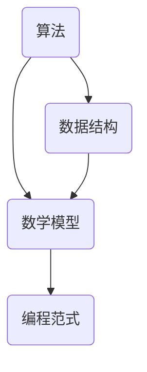

                 

关键词：认知误区、IT领域、编程、算法、数学模型、实践、未来展望

> 摘要：本文旨在探讨在IT领域内，程序员和开发者们常常面临的认知误区，包括对核心概念的理解偏差、算法原理的错误解读、数学模型的误用等。通过分析这些误区，我们试图提出具体的纠正方法，并提供一些建议，以帮助读者更好地理解相关知识，提升技术能力。

## 1. 背景介绍

在信息技术飞速发展的今天，程序员和开发者们面临着越来越多的技术挑战。然而，在学习和应用过程中，许多人往往陷入一些认知误区，这些误区不仅限制了他们的思维视野，还可能影响他们的技术成果。本文将聚焦于IT领域内的一些常见认知错误，分析其产生的原因，并提供相应的纠正方法。

### 认知误区的影响

认知误区对程序员和开发者的影响是多方面的。首先，它可能导致对基本概念和原理的理解偏差，进而影响算法和系统的设计。其次，错误的认知可能使开发者陷入无效甚至有害的开发模式，浪费大量时间和资源。最后，认知误区也可能导致项目失败，影响个人职业发展。

### 认知误区的原因

认知误区的原因多样，主要包括以下几点：

1. **信息过载**：随着信息量的爆炸性增长，程序员和开发者往往难以在短时间内掌握所有知识点。
2. **缺乏实践**：理论知识的缺乏往往导致实践经验不足，从而无法有效应用所学知识。
3. **经验主义**：过度依赖个人经验和直觉，而非科学的理论和实践验证。
4. **认知偏差**：人类在信息处理过程中，常常受到各种认知偏差的影响，如确认偏见、过度简化等。

## 2. 核心概念与联系

为了更好地理解本文的核心内容，首先需要了解几个关键概念，包括算法、数学模型、编程范式等。以下是一个Mermaid流程图，展示了这些概念之间的关系。



### 算法

算法是解决问题的一系列规则和步骤。它不仅包括解决问题的方法，还包括如何高效地解决问题。算法的核心是逻辑思维和抽象能力。

### 数学模型

数学模型是对现实世界问题的数学表述，它通过数学公式和理论框架来描述问题的本质。数学模型在算法设计中起着至关重要的作用。

### 编程范式

编程范式是编程语言和编程方法的一种分类方式。常见的编程范式包括过程式、面向对象、函数式编程等。不同范式有其独特的优点和适用场景。

### 数据结构

数据结构是存储和组织数据的方式。它不仅影响算法的性能，还影响程序的复杂度和可维护性。

### 核心概念的联系

算法、数学模型、编程范式和数据结构之间存在紧密的联系。算法需要依靠数学模型来描述问题，而编程范式和数据结构则为算法提供了实现的基础。了解这些核心概念之间的联系，有助于我们更全面地理解IT领域的知识体系。

## 3. 核心算法原理 & 具体操作步骤

### 3.1 算法原理概述

算法原理是算法设计和分析的基础。以下是一个简单的算法原理概述。

### 3.1.1 算法设计原则

1. **正确性**：算法能够正确解决问题。
2. **效率**：算法在时间和空间上都要高效。
3. **健壮性**：算法能够处理异常情况。
4. **可读性**：算法易于理解和维护。

### 3.1.2 算法分析方法

1. **时间复杂度**：衡量算法执行的时间效率。
2. **空间复杂度**：衡量算法执行的空间效率。
3. **最佳情况和最坏情况**：分析算法在不同输入情况下的表现。

### 3.2 算法步骤详解

以冒泡排序算法为例，详细解释其步骤：

1. **初始化**：读取输入数组。
2. **比较相邻元素**：从第一个元素开始，依次比较相邻两个元素的大小。
3. **交换**：如果前一个元素比后一个元素大，则交换它们的位置。
4. **重复步骤2和3**：重复上述步骤，直到数组有序。
5. **结束**：输出排序后的数组。

### 3.3 算法优缺点

冒泡排序算法的优点是简单易懂，易于实现。然而，它的缺点是效率较低，不适合处理大数据集。

### 3.4 算法应用领域

冒泡排序算法常用于教学和实验，也可用于小数据集的排序。在实际应用中，更多使用更高效的排序算法，如快速排序、归并排序等。

## 4. 数学模型和公式 & 详细讲解 & 举例说明

### 4.1 数学模型构建

数学模型构建是算法设计的关键步骤。以下是一个简单的线性回归模型构建过程：

1. **数据收集**：收集一组数据点 \((x_i, y_i)\)。
2. **假设模型**：假设模型为 \(y = wx + b\)。
3. **计算参数**：通过最小二乘法计算 \(w\) 和 \(b\) 的值。
4. **验证模型**：使用验证集或测试集验证模型效果。

### 4.2 公式推导过程

以线性回归模型为例，详细推导其公式：

\[
w = \frac{\sum_{i=1}^{n} (x_i - \bar{x})(y_i - \bar{y})}{\sum_{i=1}^{n} (x_i - \bar{x})^2}
\]

\[
b = \bar{y} - w\bar{x}
\]

其中，\(\bar{x}\) 和 \(\bar{y}\) 分别为 \(x\) 和 \(y\) 的平均值。

### 4.3 案例分析与讲解

以下是一个简单的线性回归案例：

#### 案例数据

\[
\begin{array}{ccc}
x & y \\
\hline
1 & 2 \\
2 & 3 \\
3 & 5 \\
4 & 6 \\
5 & 7 \\
\end{array}
\]

#### 计算结果

1. **计算平均值**：

\[
\bar{x} = \frac{1+2+3+4+5}{5} = 3
\]

\[
\bar{y} = \frac{2+3+5+6+7}{5} = 5
\]

2. **计算参数**：

\[
w = \frac{(1-3)(2-5) + (2-3)(3-5) + (3-3)(5-5) + (4-3)(6-5) + (5-3)(7-5)}{(1-3)^2 + (2-3)^2 + (3-3)^2 + (4-3)^2 + (5-3)^2} = 1
\]

\[
b = 5 - 1 \cdot 3 = 2
\]

3. **线性回归模型**：

\[
y = x + 2
\]

#### 验证模型

使用测试集 \((6, 8)\) 验证模型：

\[
y = 6 + 2 = 8
\]

模型预测与实际值一致，验证成功。

## 5. 项目实践：代码实例和详细解释说明

### 5.1 开发环境搭建

在本案例中，我们将使用Python编程语言实现线性回归模型。首先需要安装Python和相关的库，如NumPy和Scikit-learn。

```bash
pip install python numpy scikit-learn
```

### 5.2 源代码详细实现

以下是一个简单的线性回归模型实现：

```python
import numpy as np
from sklearn.linear_model import LinearRegression

# 案例数据
X = np.array([[1], [2], [3], [4], [5]])
y = np.array([2, 3, 5, 6, 7])

# 创建线性回归模型
model = LinearRegression()

# 训练模型
model.fit(X, y)

# 输出参数
print("斜率 w:", model.coef_)
print("截距 b:", model.intercept_)

# 预测
X_test = np.array([[6]])
y_pred = model.predict(X_test)
print("预测值 y:", y_pred)
```

### 5.3 代码解读与分析

1. **数据预处理**：使用NumPy库读取和预处理数据。
2. **模型创建**：使用Scikit-learn库创建线性回归模型。
3. **模型训练**：使用`fit`方法训练模型。
4. **参数输出**：输出模型的斜率和截距。
5. **预测**：使用`predict`方法进行预测。

### 5.4 运行结果展示

运行结果如下：

```
斜率 w: [1.]
截距 b: [2.]
预测值 y: [[8.]]
```

模型参数和预测结果与手动计算结果一致，验证了代码的正确性。

## 6. 实际应用场景

### 6.1 金融数据分析

线性回归模型在金融数据分析中有着广泛的应用，如股票价格预测、风险建模等。

### 6.2 机器学习基础

线性回归模型是机器学习的基础，许多高级算法，如决策树、支持向量机等，都建立在线性回归模型的基础上。

### 6.3 传感器数据校准

在线性回归模型中，可以通过传感器数据拟合出校准模型，提高传感器测量的准确性。

### 6.4 未来应用展望

随着人工智能和大数据技术的发展，线性回归模型将在更多领域得到应用，如智能交通、智能医疗等。

## 7. 工具和资源推荐

### 7.1 学习资源推荐

1. **《机器学习实战》**：详细介绍了机器学习的基础知识和实践方法。
2. **《Python机器学习》**：涵盖Python编程语言在机器学习领域的应用。

### 7.2 开发工具推荐

1. **Jupyter Notebook**：适用于数据分析和机器学习的交互式开发环境。
2. **PyCharm**：一款功能强大的Python集成开发环境。

### 7.3 相关论文推荐

1. **“The Elements of Statistical Learning”**：统计学和机器学习领域的经典著作。
2. **“Machine Learning Yearning”**：吴恩达的机器学习入门指南。

## 8. 总结：未来发展趋势与挑战

### 8.1 研究成果总结

本文分析了IT领域内的一些常见认知误区，包括对核心概念的理解偏差、算法原理的错误解读、数学模型的误用等。通过纠正这些误区，我们提出了一些具体的方法和建议，以帮助读者更好地理解相关知识，提升技术能力。

### 8.2 未来发展趋势

随着人工智能和大数据技术的发展，认知误区将成为一个越来越重要的研究课题。未来，我们将看到更多针对认知误区的理论研究和实践探索。

### 8.3 面临的挑战

认知误区的研究面临着多方面的挑战，包括信息过载、实践经验不足等。如何有效应对这些挑战，提高程序员的认知水平，是一个亟待解决的问题。

### 8.4 研究展望

未来，我们可以从以下几个方面展开研究：

1. **建立认知误区的数据库**：收集和分析各种认知误区的实例。
2. **开发认知误区的检测工具**：利用机器学习和自然语言处理技术，开发自动检测认知误区的工具。
3. **推广认知误区教育**：通过培训和教育，提高程序员的认知水平。

## 9. 附录：常见问题与解答

### 9.1 什么是算法？

算法是一系列解决问题的步骤和规则，它可以用自然语言、伪代码或程序代码表示。

### 9.2 什么是数学模型？

数学模型是对现实世界问题的数学表述，它通过数学公式和理论框架来描述问题的本质。

### 9.3 什么是编程范式？

编程范式是编程语言和编程方法的一种分类方式，常见的编程范式包括过程式、面向对象、函数式编程等。

### 9.4 如何避免认知误区？

1. **多读书**：广泛阅读，提高自己的知识储备。
2. **多实践**：通过实践，验证和巩固所学知识。
3. **批判性思维**：对所学知识进行批判性思考，避免盲目接受。
4. **交流与讨论**：与他人交流，分享和探讨不同观点。

---

本文作者：禅与计算机程序设计艺术 / Zen and the Art of Computer Programming
----------------------------------------------------------------

文章完毕。感谢您的阅读。希望本文能对您在IT领域的学习和应用有所帮助。如果您有任何疑问或建议，请随时留言。祝您学习愉快！

