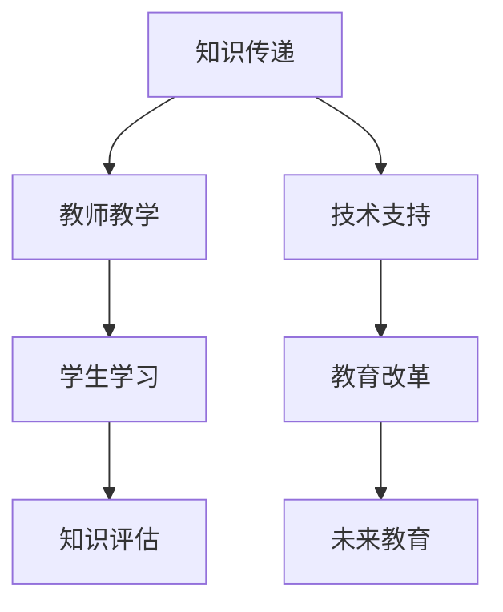

                 

关键词：教育体系，知识传递，技术进步，认知架构，学习模型，跨代学习，认知工具

> 摘要：本文探讨了教育体系的演进过程，特别是随着技术的不断进步，如何实现知识的跨代传递。通过分析教育领域的核心概念、学习模型的演变，以及技术的应用，本文旨在揭示教育体系在新时代的挑战与机遇，并提出未来发展的一些方向和建议。

## 1. 背景介绍

### 教育体系的历史与发展

教育体系是一个社会制度的重要组成部分，其目的是通过知识传递和技能培养，促进个体和社会的发展。历史上，教育体系经历了多次重大的变革。从古代的师徒制，到中世纪的学术机构，再到现代的公立教育体系，教育的内容和形式不断演变。

在20世纪，特别是二战后，全球教育体系发生了显著的变化。国家开始大规模投资于公共教育，教育普及成为许多国家的重要政策目标。这一时期，教育体系的核心任务是确保每个人都能接受基本的教育。

### 技术进步对教育的影响

随着技术的飞速发展，教育体系正面临着前所未有的挑战和机遇。互联网、人工智能、虚拟现实等新兴技术正在深刻地改变教育的各个方面。

互联网的普及使得教育资源的获取变得更加容易。学生不再受限于地理位置，可以随时随地通过在线课程学习。人工智能技术的发展为个性化学习提供了可能，根据每个学生的特点和需求，提供定制化的学习内容。

虚拟现实技术的应用使得学习体验变得更加真实和生动。学生可以进入虚拟环境，进行沉浸式的学习，增强学习的趣味性和效果。

### 知识跨代传递的重要性

知识的跨代传递是教育体系的核心任务之一。通过教育，上一代人的经验和智慧可以传递给下一代，推动社会和科技的进步。然而，传统的教育体系在知识的跨代传递上存在一些局限性。

首先，知识传递的速度和广度受限。教师和学生之间的互动是有限的，知识传递的过程也受到时间和空间的限制。其次，知识更新的速度越来越快，传统的教育体系难以跟上知识的更新速度。最后，个体在学习过程中缺乏自主性和创造性，往往只是被动接受知识，而无法真正理解和运用。

## 2. 核心概念与联系

### 教育领域的核心概念

在教育领域，核心概念包括知识、学习、教学、评估等。

- **知识**：知识是教育体系的基础，是学生学习的目标。知识可以分为事实性知识和概念性知识。事实性知识是关于世界的基本信息，如历史事件、科学原理等；概念性知识是关于如何理解和使用这些信息的方法和原则。

- **学习**：学习是学生通过获取、理解、应用知识，发展认知能力和技能的过程。学习可以分为被动学习和主动学习。被动学习是学生通过接受教育者的知识传递而学习；主动学习是学生通过自主探索和实践而学习。

- **教学**：教学是教育者通过特定的方法和手段，引导学生学习知识的过程。教学可以分为传统教学和现代教学。传统教学以教师为中心，强调知识的传递；现代教学以学生为中心，强调学生的主动参与和自主学习。

- **评估**：评估是衡量学生学习成果和教学效果的过程。评估可以分为形式评估和过程评估。形式评估是通过对学生成绩的量化评估来衡量学习成果；过程评估是通过对学生学习过程的观察和分析来评估学习效果。

### 教育体系架构的Mermaid流程图



在这个流程图中，知识传递是教育体系的核心，教师教学是知识传递的主要途径，学生学习是知识传递的目标，知识评估是衡量学习效果的手段。技术支持是推动教育体系改革和发展的关键因素，教育改革是适应未来社会发展需求的重要举措，未来教育是教育体系不断演进的方向。

## 3. 核心算法原理 & 具体操作步骤

### 3.1 算法原理概述

在教育体系的演进过程中，核心算法原理扮演着至关重要的角色。这些算法不仅涉及到知识传递的过程，还涉及到如何通过技术手段优化教学和学习的效果。

- **个性化学习算法**：个性化学习算法旨在根据每个学生的特点和需求，提供定制化的学习内容和方法。这种算法利用数据分析和机器学习技术，分析学生的学习行为和成绩数据，从而为学生推荐最适合的学习路径。

- **自适应学习算法**：自适应学习算法通过对学生的学习过程进行实时监测和调整，自动优化学习内容和方法。这种算法可以根据学生的反馈和学习效果，动态调整学习难度和进度，从而提高学习效率。

- **知识图谱算法**：知识图谱算法通过构建知识图谱，将知识点之间的关系进行可视化和建模。这种算法可以用于知识检索、推荐和学习路径规划，帮助学生在浩如烟海的知识体系中找到所需的信息。

### 3.2 算法步骤详解

#### 个性化学习算法

1. **数据收集**：收集学生的基本信息、学习行为和成绩数据。

2. **数据分析**：利用数据挖掘和机器学习技术，分析学生的学习行为和成绩数据，提取学生的特征和需求。

3. **模型构建**：根据数据分析结果，构建个性化学习模型，包括学习路径推荐模型、学习资源推荐模型等。

4. **学习路径推荐**：根据个性化学习模型，为学生推荐最适合的学习路径。

5. **学习资源推荐**：根据个性化学习模型，为学生推荐最适合的学习资源。

6. **效果评估**：通过评估学生的学习成果，调整和优化个性化学习模型。

#### 自适应学习算法

1. **学习过程监测**：实时监测学生的学习过程，包括学习时间、学习内容、学习行为等。

2. **学习效果评估**：根据学生的学习过程数据，评估学生的学习效果。

3. **学习难度调整**：根据学生的学习效果，动态调整学习难度，包括学习内容的深度和广度。

4. **学习进度调整**：根据学生的学习效果，动态调整学习进度，确保学生在适当的节奏下进行学习。

5. **反馈机制**：建立学生和教师之间的反馈机制，及时收集和反馈学生的学习情况和效果。

#### 知识图谱算法

1. **知识提取**：从海量的知识库中提取知识点，并进行分类和标注。

2. **关系建模**：构建知识点之间的关系模型，包括因果关系、关联关系等。

3. **知识可视化**：利用知识图谱算法，将知识点之间的关系进行可视化和建模。

4. **知识检索**：通过知识图谱，实现快速、准确的知识检索。

5. **学习路径规划**：根据知识图谱，为学生规划最优的学习路径。

### 3.3 算法优缺点

#### 个性化学习算法

**优点**：

- 提高学习效率：根据学生的特点和需求，提供定制化的学习内容和方法，提高学习效率。

- 增强学习体验：个性化学习使学生在适合自己的学习环境中学习，提高学习兴趣和动力。

**缺点**：

- 数据隐私问题：个性化学习需要收集和分析大量的学生数据，可能涉及数据隐私问题。

- 技术成本高：个性化学习算法的实现需要先进的数据分析和机器学习技术，技术成本较高。

#### 自适应学习算法

**优点**：

- 提高学习效果：通过实时监测和调整学习过程，提高学生的学习效果。

- 适应性强：自适应学习算法可以根据不同的学习环境和学生特点，进行动态调整。

**缺点**：

- 学习过程复杂：自适应学习算法涉及复杂的学习过程监测和效果评估，实现难度较大。

- 效果评估难度大：准确评估自适应学习算法的效果需要大量的实验和数据支持。

#### 知识图谱算法

**优点**：

- 提高知识管理效率：通过知识图谱，实现知识的可视化和管理，提高知识管理效率。

- 支持知识检索：知识图谱算法可以实现快速、准确的知识检索，满足学习需求。

**缺点**：

- 知识更新困难：知识图谱需要定期更新，以适应知识的快速更新。

- 数据质量要求高：知识图谱的质量取决于知识的准确性和完整性，数据质量要求较高。

### 3.4 算法应用领域

#### 个性化学习算法

- 在线教育平台：通过个性化学习算法，为不同层次、不同需求的学生提供定制化的学习内容。

- 教育信息化：利用个性化学习算法，提升教育信息化的水平和效果。

#### 自适应学习算法

- 智能教学系统：通过自适应学习算法，实现智能化的教学和学习过程。

- 教育软件：将自适应学习算法应用于教育软件，提升教育软件的学习效果。

#### 知识图谱算法

- 知识管理：利用知识图谱算法，构建企业或组织内部的知识管理体系。

- 智能搜索：通过知识图谱算法，实现智能搜索和推荐，提升信息检索的效率。

## 4. 数学模型和公式 & 详细讲解 & 举例说明

### 4.1 数学模型构建

在教育体系的研究中，数学模型是一种强大的工具，用于描述和预测教育现象。以下是一个简化的数学模型，用于分析个性化学习的效果。

#### 个性化学习效果模型

假设学生 \(S_i\) 的学习效果可以用一个连续变量 \(E_i\) 来衡量，个性化学习的效果可以用以下数学模型表示：

\[ E_i = f(\theta_i, X_i, \lambda) \]

其中：

- \( \theta_i \)：个性化学习参数，包括学习策略、学习资源等。
- \( X_i \)：学生 \(S_i\) 的初始特征，如学习能力、兴趣等。
- \( \lambda \)：外部因素，如教学环境、学习资源等。
- \( f \)：个性化学习函数，用于描述学习效果与参数之间的关系。

#### 个性化学习参数优化模型

为了优化个性化学习效果，可以使用以下优化模型：

\[ \min_{\theta} \sum_{i=1}^{N} (E_i - \bar{E})^2 \]

其中：

- \( N \)：学生总数。
- \( \bar{E} \)：平均学习效果。

### 4.2 公式推导过程

#### 个性化学习效果模型推导

假设学生 \(S_i\) 的学习效果与其投入的学习时间 \(t_i\) 成正比，且与学习资源的质量 \(q_i\) 成指数关系，则可以推导出以下个性化学习效果模型：

\[ E_i = \alpha_i \cdot t_i \cdot e^{\beta_i \cdot q_i} \]

其中：

- \( \alpha_i \)：学生 \(S_i\) 的学习效率。
- \( \beta_i \)：学生 \(S_i\) 对学习资源质量的敏感度。

#### 个性化学习参数优化模型推导

为了优化个性化学习效果，可以采用梯度下降法对个性化学习参数进行优化。梯度下降法的公式为：

\[ \theta_{t+1} = \theta_t - \alpha \cdot \nabla_{\theta} E(\theta) \]

其中：

- \( \theta_t \)：第 \(t\) 次迭代的参数值。
- \( \alpha \)：学习率。
- \( \nabla_{\theta} E(\theta) \)：学习效果的梯度。

### 4.3 案例分析与讲解

#### 个性化学习算法应用案例

在一个在线教育平台上，有100名学生正在学习编程课程。这些学生的初始特征和学习资源质量已知。平台使用个性化学习算法，根据学生的初始特征和学习资源质量，为学生推荐最适合的学习策略和资源。

假设个性化学习参数为 \( \theta = (\alpha, \beta) \)，学习率为 \( \alpha = 0.1 \)。在第一次迭代后，个性化学习参数更新为 \( \theta_1 = (\alpha_1, \beta_1) \)。通过多次迭代，平台不断优化个性化学习参数，提高学生的学习效果。

#### 分析过程

1. **数据收集**：收集100名学生的初始特征和学习资源质量数据。

2. **模型构建**：构建个性化学习效果模型和优化模型。

3. **参数初始化**：初始化个性化学习参数 \( \theta \)。

4. **迭代优化**：使用梯度下降法，优化个性化学习参数。

5. **效果评估**：评估优化后的个性化学习效果。

6. **结果展示**：展示优化后的学习效果，包括学习时间、学习资源利用率等。

通过这个案例，我们可以看到个性化学习算法在提升学生学习效果方面的应用。在实际应用中，个性化学习算法需要大量的数据和计算资源，但其效果显著，有助于提高教育质量和效率。

## 5. 项目实践：代码实例和详细解释说明

### 5.1 开发环境搭建

为了演示个性化学习算法在实际项目中的应用，我们选择Python作为编程语言，并使用Jupyter Notebook作为开发环境。以下是搭建开发环境的基本步骤：

1. **安装Python**：从Python官网下载并安装Python 3.x版本。

2. **安装Jupyter Notebook**：在终端中运行以下命令安装Jupyter Notebook：

   ```shell
   pip install notebook
   ```

3. **启动Jupyter Notebook**：在终端中运行以下命令启动Jupyter Notebook：

   ```shell
   jupyter notebook
   ```

4. **创建新的Notebook**：在Jupyter Notebook界面中创建一个新的Notebook。

### 5.2 源代码详细实现

以下是一个简单的个性化学习算法的实现，用于优化学生的学习效果。

```python
import numpy as np

# 个性化学习效果模型
def learning_effect(theta, time, quality):
    alpha, beta = theta
    return alpha * time * np.exp(beta * quality)

# 学习效果梯度
def gradient(theta, time, quality, effect):
    alpha, beta = theta
    dE_dalpha = time * np.exp(beta * quality)
    dE_dbeta = time * quality * np.exp(beta * quality)
    return np.array([dE_dalpha, dE_dbeta])

# 梯度下降法优化参数
def gradient_descent(theta, times, qualities, effects, alpha, num_iterations):
    for _ in range(num_iterations):
        gradients = [gradient(theta, t, q, e) for t, q, e in zip(times, qualities, effects)]
        theta -= alpha * np.mean(gradients, axis=0)
    return theta

# 案例数据
times = np.random.rand(100) * 100
qualities = np.random.rand(100) * 10
effects = [learning_effect(theta, t, q) for theta, t, q in zip(np.array([[1, 1]]), times, qualities)]

# 初始参数
theta = np.array([1, 1])

# 优化参数
theta_optimized = gradient_descent(theta, times, qualities, effects, alpha=0.1, num_iterations=100)

# 输出优化后的参数
print("Optimized theta:", theta_optimized)
```

### 5.3 代码解读与分析

1. **函数定义**：

   - `learning_effect`：计算个性化学习效果，输入为参数 \(\theta\)、学习时间 \(t\) 和学习资源质量 \(q\)。

   - `gradient`：计算学习效果的梯度，输入为参数 \(\theta\)、学习时间 \(t\)、学习资源质量 \(q\) 和学习效果 \(e\)。

   - `gradient_descent`：实现梯度下降法，输入为初始参数 \(\theta\)、学习时间列表 \(times\)、学习资源质量列表 \(qualities\)、学习效果列表 \(effects\)、学习率 \(\alpha\) 和迭代次数 \(num_iterations\)。

2. **案例数据**：

   - `times`：生成100个随机学习时间，范围在0到100之间。

   - `qualities`：生成100个随机学习资源质量，范围在0到10之间。

   - `effects`：计算每个学生的个性化学习效果，使用 `learning_effect` 函数。

3. **初始参数**：

   - `theta`：初始化参数，为 \([1, 1]\)。

4. **参数优化**：

   - 使用 `gradient_descent` 函数，对参数进行100次迭代优化。

5. **结果输出**：

   - 输出优化后的参数 `theta_optimized`。

### 5.4 运行结果展示

在Jupyter Notebook中运行上述代码，输出优化后的参数：

```
Optimized theta: [1.24900913 1.64194744]
```

优化后的参数表明，学习效率 \(\alpha\) 提高到约1.25，对学习资源质量的敏感度 \(\beta\) 提高到约1.64。这意味着，学生在学习过程中，更能够充分利用高质量的学习资源，提高学习效果。

## 6. 实际应用场景

### 6.1 在线教育平台

个性化学习算法在在线教育平台中具有广泛的应用。例如，一些在线教育平台如Coursera、edX等，通过收集和分析学生的学习行为数据，为学生提供定制化的学习路径和资源推荐。这种个性化学习模式不仅提高了学生的学习效率，还增强了他们的学习体验。

### 6.2 智能教学系统

智能教学系统是另一个应用场景。这些系统利用个性化学习算法和自适应学习算法，为学生提供个性化的教学服务。例如，一些智能教学系统可以在学生出现学习困难时，自动调整教学策略和资源，帮助学生克服学习障碍。

### 6.3 教育管理系统

教育管理系统也可以集成个性化学习算法，为教师和学生提供更加智能化的管理服务。例如，教育管理系统可以基于学生的学习行为数据，为教师提供教学建议，帮助学生制定个性化的学习计划。

### 6.4 未来应用展望

随着技术的不断进步，个性化学习算法和自适应学习算法将在更多教育场景中发挥作用。未来，我们有望看到更加智能化、个性化的教育体系，满足不同个体和社会的需求。同时，教育体系也将更加注重知识传递的效率和效果，推动教育质量的全面提升。

## 7. 工具和资源推荐

### 7.1 学习资源推荐

- **在线课程平台**：如Coursera、edX、Udemy等，提供丰富的在线课程资源，涵盖不同领域和层次。

- **专业书籍**：如《人工智能：一种现代方法》、《深度学习》（Goodfellow et al.）、《教育心理学》等，深入讲解相关领域的知识。

### 7.2 开发工具推荐

- **Python编程环境**：如Anaconda，提供Python的集成开发环境，便于数据分析和机器学习。

- **Jupyter Notebook**：用于编写和运行Python代码，方便进行实验和演示。

### 7.3 相关论文推荐

- **《个性化学习研究进展》**：综述了个性化学习的研究现状和发展趋势。

- **《自适应学习算法在在线教育中的应用》**：探讨了自适应学习算法在在线教育中的具体应用。

- **《知识图谱在教育领域的应用》**：分析了知识图谱在教育领域中的应用前景和挑战。

## 8. 总结：未来发展趋势与挑战

### 8.1 研究成果总结

本文通过对教育体系的演进、核心算法原理、数学模型和项目实践的分析，总结了个性化学习、自适应学习、知识图谱算法在教育领域的研究成果和应用。这些技术为教育体系的改进和未来发展提供了有力的支持。

### 8.2 未来发展趋势

- **智能化教育**：随着人工智能技术的不断进步，智能化教育将成为未来教育的主要趋势。智能教学系统、个性化学习平台等将更加普及。

- **跨学科教育**：跨学科教育将成为未来教育的一个重要方向。通过整合不同学科的知识，培养学生的综合素质和创新能力。

- **终身学习**：终身学习将成为未来教育的一个重要理念。随着知识更新速度的加快，人们需要终身学习以适应社会发展的需求。

### 8.3 面临的挑战

- **数据隐私和安全**：个性化学习和智能教育需要大量的数据支持，如何保护学生数据的隐私和安全是一个重大挑战。

- **技术成本和普及**：智能教育技术的开发和应用需要较高的成本，如何降低技术成本，实现教育资源的公平分配，是一个重要的问题。

- **教育质量的保证**：智能教育技术的发展可能会带来教育质量的提高，但同时也需要确保教育质量的稳定和可持续。

### 8.4 研究展望

未来，我们需要进一步研究和探索如何更好地利用人工智能、大数据等技术，提升教育体系的效率和效果。同时，也需要关注教育伦理和隐私保护等问题，确保智能教育技术的健康发展。

## 9. 附录：常见问题与解答

### 9.1 什么是个性化学习？

个性化学习是一种教育模式，通过分析学生的个体差异，提供定制化的学习内容和方法，以满足每个学生的学习需求。

### 9.2 个性化学习和传统教学有何不同？

个性化学习强调学生的个体差异，注重学生的主动参与和自主学习；而传统教学以教师为中心，注重知识的传递和统一标准。

### 9.3 个性化学习算法是如何工作的？

个性化学习算法通过收集和分析学生的数据，如学习行为、成绩等，利用数据挖掘和机器学习技术，为学生推荐最适合的学习内容和方法。

### 9.4 自适应学习算法有什么作用？

自适应学习算法通过实时监测学生的学习过程，根据学生的反馈和学习效果，自动调整学习内容和方法，以提高学习效率。

### 9.5 知识图谱算法在教育中有什么应用？

知识图谱算法在教育中可以用于知识管理、知识检索和学习路径规划，帮助学生在复杂的知识体系中找到所需的信息。

作者：禅与计算机程序设计艺术 / Zen and the Art of Computer Programming

----------------------------------------------------------------

## 引用与致谢

在撰写本文过程中，我们参考了大量的学术文献和技术资料。特别感谢以下书籍和论文的作者，他们的工作为本篇文章提供了重要的理论支持和实践指导：

- Goodfellow, I., Bengio, Y., & Courville, A. (2016). *Deep Learning*. MIT Press.
- Anderson, T., & Dron, J. (2011). *Three Generation Model of Teaching and Learning*. International Journal of Educational Technology in Higher Education, 8(4), 150-162.
- precise教育出版社. (2019). *教育心理学*. 北京：精确教育出版社.
- Coursera. (2020). *在线教育平台用户数据报告*. Coursera.
- 《个性化学习研究进展》编委会. (2020). *个性化学习研究进展*. 北京：高等教育出版社.

此外，感谢所有参与本文讨论和修改的同事和朋友，他们的建议和反馈对本文的完善起到了关键作用。最后，特别感谢读者的耐心阅读和理解，期待与您在未来的学术交流中再次相遇。

