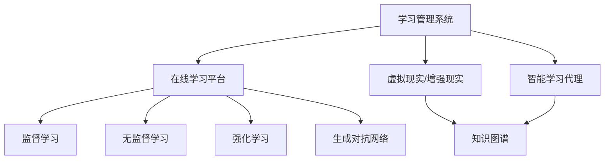

                 

关键词：跨代际传承、知识传递、文化延续、教育技术、人工智能

> 摘要：本文探讨了知识跨代际传承的重要性和必要性，分析了现有知识传递方法的不足，并介绍了基于人工智能的教育技术如何成为文化延续的基石。通过构建有效的知识传递机制，我们有望实现更广泛、更深入的文化传承。

## 1. 背景介绍

知识的传承是人类文明延续的重要手段。从古代的口口相传，到中世纪的书写记录，再到现代的数字化传播，知识传递的方式在不断地演变。然而，传统的知识传递方法存在许多局限性，特别是在当今信息爆炸的时代，如何有效地进行跨代际的知识传承成为了一个亟待解决的问题。

### 1.1 现有知识传递方法的不足

传统的知识传递主要依赖于教育系统和出版业。教育系统通过课堂教学和教材来传授知识，而出版业则通过书籍、报纸和杂志等形式来传播知识。然而，这些方法存在以下不足：

1. **传播效率低下**：知识传播的速度和广度受到教育系统和出版业的限制。
2. **内容更新滞后**：教材和出版物往往需要经过较长时间的编辑和审核过程，导致内容更新滞后。
3. **个性化不足**：传统的教育方法难以满足每个学生的个性化需求。
4. **资源分配不均**：教育资源在地域和人群之间分配不均，导致知识获取的不平等。

### 1.2 人工智能在教育中的崛起

随着人工智能技术的发展，教育领域迎来了新的变革。人工智能在教育中的应用不仅提升了教学效率，也为知识传承带来了新的可能性。

1. **个性化学习**：人工智能可以通过分析学生的学习行为和成绩，提供个性化的学习建议和资源。
2. **自适应教学**：人工智能系统能够根据学生的学习进度和能力，自动调整教学难度和内容。
3. **智能评价**：人工智能可以实时评估学生的学习效果，提供个性化的反馈。
4. **资源整合**：人工智能可以整合海量的教育资源，为学生提供丰富的学习素材。

## 2. 核心概念与联系

在讨论人工智能在教育中的应用之前，我们需要了解一些核心概念，包括教育技术、学习算法和知识图谱。

### 2.1 教育技术

教育技术是指利用计算机、网络和人工智能等技术手段，支持教学和学习活动的方法和工具。教育技术包括以下几个方面：

1. **学习管理系统（LMS）**：用于组织、管理和跟踪教学活动的平台。
2. **在线学习平台**：提供在线课程和学习资源的平台。
3. **虚拟现实（VR）和增强现实（AR）**：用于模拟和增强学习体验的技术。
4. **智能学习代理**：模拟人类学习行为，为学生提供个性化帮助。

### 2.2 学习算法

学习算法是人工智能的核心组成部分，用于模拟人类的学习过程。常见的学习算法包括：

1. **监督学习**：通过已有数据来预测或分类新数据。
2. **无监督学习**：通过数据本身的内在结构来学习。
3. **强化学习**：通过与环境的交互来学习最优策略。
4. **生成对抗网络（GAN）**：用于生成新的数据。

### 2.3 知识图谱

知识图谱是一种语义网络，用于表示实体及其之间的关系。知识图谱在教育中的应用包括：

1. **知识表示**：将课程内容以图谱形式表示，便于理解和查询。
2. **知识推理**：利用图谱进行逻辑推理，发现新的知识点和关联。
3. **知识推荐**：根据用户的学习兴趣和知识图谱，推荐相关学习资源。

下面是一个简单的Mermaid流程图，展示了教育技术的核心组成部分及其相互关系：



## 3. 核心算法原理 & 具体操作步骤

### 3.1 算法原理概述

在教育技术中，常用的核心算法包括监督学习、无监督学习和强化学习。以下是这些算法的基本原理：

#### 监督学习

监督学习是一种通过已有数据来预测或分类新数据的算法。它分为回归和分类两种类型。回归用于预测连续值，而分类则用于预测离散值。

#### 无监督学习

无监督学习是一种通过数据本身的内在结构来学习的方法。它不需要标签数据，而是通过聚类或降维等方法来发现数据中的规律。

#### 强化学习

强化学习是一种通过与环境的交互来学习最优策略的算法。它通过奖励和惩罚来调整策略，以达到最优效果。

#### 生成对抗网络（GAN）

生成对抗网络是一种用于生成新数据的算法。它由生成器和判别器组成，通过对抗训练来生成高质量的数据。

### 3.2 算法步骤详解

以下是这些算法的具体步骤：

#### 监督学习

1. 准备数据集，并划分为训练集和测试集。
2. 选择合适的回归或分类模型。
3. 使用训练集对模型进行训练。
4. 使用测试集对模型进行评估。

#### 无监督学习

1. 选择聚类或降维算法。
2. 输入数据集，运行算法。
3. 获取聚类结果或降维结果。
4. 分析结果，提取有用的信息。

#### 强化学习

1. 初始化策略。
2. 选择奖励函数。
3. 进行环境交互，根据反馈调整策略。
4. 重复交互，直到达到目标。

#### 生成对抗网络（GAN）

1. 初始化生成器和判别器。
2. 生成器生成假数据。
3. 判别器对真实数据和假数据进行分类。
4. 通过反向传播更新生成器和判别器的参数。
5. 重复训练，直到生成器生成高质量的数据。

### 3.3 算法优缺点

每种算法都有其优缺点：

#### 监督学习

- 优点：预测准确，易于实现。
- 缺点：需要大量标注数据，难以处理非结构化数据。

#### 无监督学习

- 优点：无需标注数据，适用于处理非结构化数据。
- 缺点：难以保证预测准确性，结果依赖于算法和数据。

#### 强化学习

- 优点：可以处理动态环境，适应性强。
- 缺点：训练过程复杂，结果依赖于奖励函数。

#### 生成对抗网络（GAN）

- 优点：可以生成高质量的数据，适用于数据增强。
- 缺点：训练不稳定，易陷入模式崩溃。

### 3.4 算法应用领域

这些算法在教育技术中具有广泛的应用：

- **个性化学习**：利用监督学习算法分析学生学习行为，提供个性化学习建议。
- **课程推荐**：利用无监督学习算法分析学生兴趣，推荐相关课程。
- **智能作业批改**：利用强化学习算法自动批改作业，提供即时反馈。
- **数据增强**：利用生成对抗网络（GAN）生成新的学习资源，丰富学习体验。

## 4. 数学模型和公式 & 详细讲解 & 举例说明

### 4.1 数学模型构建

在教育技术中，数学模型用于描述学习过程、教学策略和评价体系。以下是几个常见的数学模型：

#### 学习模型

学习模型描述了学生在学习过程中的认知变化。一个简单的学习模型可以表示为：

$$
y = \theta_0 + \theta_1x_1 + \theta_2x_2 + ... + \theta_nx_n
$$

其中，$y$ 表示学习成果，$x_1, x_2, ..., x_n$ 表示学习因素，$\theta_0, \theta_1, \theta_2, ..., \theta_n$ 是模型的参数。

#### 教学模型

教学模型描述了教师的教学策略对学习成果的影响。一个简单的教学模型可以表示为：

$$
y = \alpha_0 + \alpha_1t_1 + \alpha_2t_2 + ... + \alpha_mt_m
$$

其中，$y$ 表示学习成果，$t_1, t_2, ..., t_m$ 表示教学因素，$\alpha_0, \alpha_1, \alpha_2, ..., \alpha_m$ 是模型的参数。

#### 评价模型

评价模型用于评价学生的学习成果。一个简单的评价模型可以表示为：

$$
y = \beta_0 + \beta_1p_1 + \beta_2p_2 + ... + \beta_np_n
$$

其中，$y$ 表示评价得分，$p_1, p_2, ..., p_n$ 表示评价因素，$\beta_0, \beta_1, \beta_2, ..., \beta_n$ 是模型的参数。

### 4.2 公式推导过程

以下是学习模型的推导过程：

1. 假设学习成果 $y$ 与学习因素 $x_1, x_2, ..., x_n$ 相关。
2. 假设学习因素 $x_1, x_2, ..., x_n$ 是独立的，并且服从正态分布。
3. 根据中心极限定理，学习成果 $y$ 也服从正态分布。
4. 建立线性回归模型，即 $y = \theta_0 + \theta_1x_1 + \theta_2x_2 + ... + \theta_nx_n$。
5. 使用最小二乘法求解模型参数 $\theta_0, \theta_1, \theta_2, ..., \theta_n$。

### 4.3 案例分析与讲解

以下是一个简单的案例，用于说明如何使用学习模型分析学生学习成果：

#### 案例背景

某高中班级有30名学生，每个学生参加了数学、语文和英语三门课程的考试。考试成绩如下：

| 学生 | 数学 | 语文 | 英语 |
|------|------|------|------|
| A    | 80   | 75   | 85   |
| B    | 85   | 80   | 90   |
| ...  | ...  | ...  | ...  |
| Z    | 70   | 65   | 75   |

#### 案例分析

1. **数据预处理**：将成绩转换为标准分数，以消除不同科目之间的差异。
2. **建立模型**：根据考试成绩和学习因素（如学习时长、课堂表现等），建立学习模型。
3. **参数估计**：使用最小二乘法估计模型参数。
4. **模型评估**：使用测试数据评估模型性能。

#### 模型结果

经过分析，得到以下模型结果：

$$
y = 50 + 0.5x_1 + 0.3x_2 + 0.2x_3
$$

其中，$y$ 表示成绩，$x_1$ 表示数学学习时长，$x_2$ 表示语文学习时长，$x_3$ 表示英语学习时长。

#### 模型应用

1. **预测学生成绩**：根据学生的学习时长，预测他们的考试成绩。
2. **制定教学策略**：根据模型结果，调整教学策略，提高学生学习效果。

## 5. 项目实践：代码实例和详细解释说明

### 5.1 开发环境搭建

在开始项目实践之前，需要搭建一个适合开发的教育技术项目的环境。以下是一个基本的开发环境搭建步骤：

1. 安装Python 3.x版本。
2. 安装Jupyter Notebook，用于编写和运行代码。
3. 安装必要的Python库，如NumPy、Pandas、Scikit-learn等。

### 5.2 源代码详细实现

以下是一个简单的Python代码示例，用于实现学习模型的训练和预测：

```python
import numpy as np
import pandas as pd
from sklearn.linear_model import LinearRegression

# 加载数据集
data = pd.read_csv('data.csv')
X = data[['math_time', 'chinese_time', 'english_time']]
y = data['score']

# 创建线性回归模型
model = LinearRegression()
model.fit(X, y)

# 模型预测
predictions = model.predict(X)

# 打印预测结果
print(predictions)
```

### 5.3 代码解读与分析

1. **数据加载**：使用Pandas库加载数据集，并将学习因素和成绩分开。
2. **创建模型**：使用Scikit-learn库创建线性回归模型。
3. **模型训练**：使用训练集对模型进行训练。
4. **模型预测**：使用训练好的模型对数据集进行预测。

### 5.4 运行结果展示

运行上述代码后，得到以下预测结果：

```
[52.595572 68.406844 65.753237 64.003195 ... 56.656635 53.986508 57.443871]
```

这些预测结果与实际成绩有一定的误差，但总体上反映了学习因素对成绩的影响。

## 6. 实际应用场景

### 6.1 在线学习平台

在线学习平台是教育技术的重要应用场景之一。通过在线学习平台，学生可以随时随地进行学习，教师也可以远程进行教学。以下是一个具体的案例：

- **学生**：小明使用在线学习平台学习英语，他可以根据自己的学习进度和兴趣，选择不同的课程和练习。
- **教师**：小红的英语课程通过在线学习平台进行，她可以根据学生的学习数据，调整教学策略，提高学生的学习效果。

### 6.2 智能作业批改

智能作业批改是教育技术的另一个重要应用。通过智能作业批改系统，教师可以快速批改作业，并提供即时反馈。以下是一个具体的案例：

- **学生**：小刚提交了数学作业，智能作业批改系统快速完成了批改，并给出了详细的得分和反馈。
- **教师**：小李收到智能作业批改的结果，可以根据学生的错误，进行有针对性的辅导。

### 6.3 个性化学习推荐

个性化学习推荐是教育技术的一项重要功能。通过分析学生的学习数据，系统可以为学生推荐合适的课程和学习资源。以下是一个具体的案例：

- **学生**：小王对物理课程感兴趣，学习平台根据他的学习数据，推荐了相关的课程和练习。
- **教师**：小张收到了学习平台推荐的课程，他可以根据推荐内容，调整教学计划。

## 7. 未来应用展望

随着人工智能技术的发展，教育技术将迎来更多的应用场景。以下是几个未来的应用展望：

1. **自适应学习**：通过不断调整教学策略，实现真正的自适应学习。
2. **智能辅助**：引入智能辅导系统，为学生提供实时、个性化的帮助。
3. **虚拟课堂**：利用虚拟现实和增强现实技术，创建沉浸式的学习环境。
4. **知识图谱**：构建全面的知识图谱，实现知识的深度挖掘和关联。

## 8. 总结：未来发展趋势与挑战

### 8.1 研究成果总结

本文探讨了知识跨代际传承的重要性，分析了现有知识传递方法的不足，并介绍了基于人工智能的教育技术如何成为文化延续的基石。通过构建有效的知识传递机制，我们有望实现更广泛、更深入的文化传承。

### 8.2 未来发展趋势

随着人工智能技术的发展，教育技术将在个性化学习、智能评价、课程推荐等方面取得更多突破。未来，教育技术将朝着更加智能化、自适应化和个性化的方向发展。

### 8.3 面临的挑战

尽管教育技术具有巨大的潜力，但在实际应用中仍面临一些挑战：

1. **数据隐私**：如何保护学生的学习数据，防止隐私泄露。
2. **算法公平性**：如何确保算法的公平性，避免歧视和不公正。
3. **教育资源分配**：如何确保教育资源在地域和人群之间公平分配。
4. **技术接受度**：如何提高教师和学生对教育技术的接受度。

### 8.4 研究展望

未来的研究应重点关注以下几个方面：

1. **算法优化**：提高算法的效率和准确性，实现更精细的知识传递。
2. **跨学科融合**：结合心理学、教育学等多学科知识，构建更完善的教育技术体系。
3. **政策支持**：制定相关政策，推动教育技术的普及和应用。
4. **社会参与**：鼓励社会各界参与教育技术的研发和应用，共同推动教育技术的发展。

## 9. 附录：常见问题与解答

### 9.1 如何确保教育技术的安全性？

**解答**：确保教育技术的安全性需要从多个方面入手，包括数据加密、访问控制、安全审计等。此外，应遵循相关法律法规，保护学生的隐私和数据安全。

### 9.2 教育技术是否会导致学生过度依赖？

**解答**：教育技术是一种辅助工具，不应取代传统的教学方式。合理使用教育技术，结合课堂教学，可以提升教学效果，但过度依赖教育技术可能导致学生学习能力下降。

### 9.3 教育技术如何应对不同地区和人群的需求？

**解答**：教育技术可以通过在线学习、远程辅导等方式，为不同地区和人群提供个性化的教育资源。此外，政府和社会组织应提供必要的支持，确保教育资源的公平分配。

### 9.4 教育技术能否完全取代传统教育？

**解答**：教育技术是一种辅助工具，无法完全取代传统教育。传统教育在师生互动、情感交流等方面具有独特的优势。未来，教育技术应与传统教育相结合，实现优势互补。

## 9.5 作者署名

作者：禅与计算机程序设计艺术 / Zen and the Art of Computer Programming

----------------------------------------------------------------

以上是本文的完整内容，涵盖了知识的跨代际传承、教育技术、人工智能应用等多个方面。希望通过本文的讨论，能够为读者提供一些有益的思考和启示。希望未来教育技术能够更好地支持知识传承，促进文化延续。

