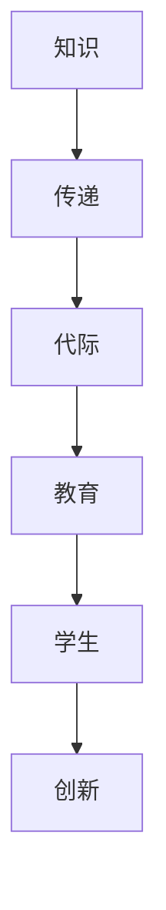

                 

 在当今快速发展的信息技术时代，知识的跨代际传递成为教育领域的重要议题。如何确保下一代能够高效地获取、理解和应用先辈的智慧，是教育工作者和决策者共同面临的挑战。本文将深入探讨教育的核心使命——知识的跨代际传递，以及其在现代信息技术环境下的意义、方法和挑战。

## 关键词

- **跨代际传递**
- **教育核心使命**
- **知识管理**
- **信息技术**
- **学习模型**
- **创新能力**

## 摘要

本文旨在阐述知识的跨代际传递在教育中的核心作用，并探讨在信息技术迅猛发展的背景下，教育体系应如何调整以适应这一使命。通过分析当前知识传递的障碍和机会，本文提出了若干策略和方法，以促进知识的高效传递和学生的全面发展。

### 1. 背景介绍

知识的跨代际传递，即通过教育的方式将上一代人的智慧、经验和知识传递给下一代，确保人类文明的连续性和发展。传统的教育模式主要通过教师传授知识和学生被动接受的方式实现知识的传递，但随着信息技术的发展，教育的形式和内容也在不断变革。

在信息技术时代，知识更新的速度空前加快，传统的教育方法面临着知识陈旧、更新不及时的问题。同时，现代学生在信息获取渠道上的多样性，也对教育提出了更高的要求。如何通过教育实现知识的跨代际传递，成为教育领域亟待解决的问题。

### 2. 核心概念与联系

在讨论知识的跨代际传递之前，我们需要明确几个核心概念：

- **知识**：知识是信息的有组织和系统化的表现形式，具有可传递性和可扩展性。
- **传递**：传递是指将知识从一个个体或群体传递到另一个个体或群体的过程。
- **代际**：代际指的是不同年龄阶段的人类群体，通常以几十年为一个时间跨度。
- **教育**：教育是一种有目的、有计划、有组织的知识传递过程，旨在培养学生的综合素质和创新能力。

为了更好地理解这些概念之间的关系，我们可以使用Mermaid绘制一个简化的流程图：



在这个流程图中，知识通过教育的形式传递给下一代，促使学生形成创新能力和批判性思维，从而推动社会进步。

### 3. 核心算法原理 & 具体操作步骤

知识的跨代际传递涉及到一系列核心算法原理，主要包括知识识别、知识编码、知识传递和知识应用。

#### 3.1 算法原理概述

1. **知识识别**：通过分析和挖掘，识别出具有跨代际价值的知识。
2. **知识编码**：将识别出的知识进行系统化和结构化，以便于传递。
3. **知识传递**：采用多种教育手段，将知识传递给学生。
4. **知识应用**：引导学生将所学知识应用于实际问题和创新项目中。

#### 3.2 算法步骤详解

1. **知识识别**
   - 收集数据：从各种来源（书籍、论文、案例等）收集与知识相关的数据。
   - 数据预处理：对收集的数据进行清洗和预处理，提取有价值的信息。
   - 知识挖掘：使用自然语言处理、数据挖掘等技术，识别潜在的跨代际知识。

2. **知识编码**
   - 知识体系构建：根据知识类型和层次，构建一个系统化的知识体系。
   - 知识可视化：使用图表、模型等可视化工具，展示知识的结构和关系。

3. **知识传递**
   - 教学设计：根据学生的认知特点和学习需求，设计有针对性的教学方案。
   - 教学实施：采用多种教学手段（如讲座、实验、讨论等），引导学生掌握知识。
   - 教学评估：通过考试、作业、项目等方式，评估学生对知识的掌握程度。

4. **知识应用**
   - 创新项目：引导学生将所学知识应用于实际问题和创新项目中。
   - 反馈与迭代：根据项目实施过程中的反馈，不断优化和调整教学方案。

#### 3.3 算法优缺点

- **优点**：
  - 知识系统化：通过知识识别和编码，将分散的知识进行整合和系统化，提高知识传递的效率。
  - 教学个性化：根据学生的个体差异和学习需求，提供个性化的教学方案，提高学生的学习效果。
  - 创新能力培养：引导学生将所学知识应用于实际问题和创新项目中，培养创新能力。

- **缺点**：
  - 知识更新速度快：知识传递过程中，知识可能因更新速度过快而变得陈旧。
  - 教学难度大：针对不同年龄阶段的学生，知识传递需要采用不同的教学方法和手段，教学难度较大。

#### 3.4 算法应用领域

- **教育领域**：知识跨代际传递是教育的重要使命，通过多种教育手段，将前人的智慧和经验传递给学生。
- **科研领域**：科研人员在研究过程中，需要了解和借鉴前人的研究成果，实现知识的跨代际传递。
- **企业领域**：企业通过培训和知识共享，将公司内部的智慧和经验传递给新员工，提高团队的整体创新能力。

### 4. 数学模型和公式 & 详细讲解 & 举例说明

为了更好地理解知识的跨代际传递，我们可以构建一个数学模型来描述这一过程。

#### 4.1 数学模型构建

假设有一个知识传递系统，包括知识源（K）、知识接受者（L）、知识传递渠道（T）和知识应用效果（E）。我们可以用以下公式来描述这一系统：

\[ E = f(K, L, T) \]

其中，\( f \) 表示知识传递函数，它取决于知识源、知识接受者和知识传递渠道。

#### 4.2 公式推导过程

1. **知识源（K）**：知识源是知识的产生者和提供者，包括前人的研究成果、实践经验等。假设知识源的质量为 \( K_q \)，即知识源的权威性、准确性和实用性。

2. **知识接受者（L）**：知识接受者是知识的消费者和传播者，包括学生、科研人员、企业员工等。假设知识接受者的学习能力为 \( L_l \)，即知识接受者的认知能力、学习动机和知识储备。

3. **知识传递渠道（T）**：知识传递渠道是知识传递的媒介和途径，包括教育、科研、企业内部培训等。假设知识传递渠道的有效性为 \( T_t \)，即知识传递渠道的传播速度、覆盖范围和接受度。

4. **知识应用效果（E）**：知识应用效果是知识传递的最终目标，包括学生的创新能力、科研成果、企业效益等。假设知识应用效果为 \( E_e \)，即知识应用的效果和影响力。

根据上述假设，我们可以得到知识传递函数：

\[ f(K, L, T) = K_q \times L_l \times T_t \]

#### 4.3 案例分析与讲解

假设有一个高校教授，他的研究成果（知识源）在学术界有很高的权威性和实用性（\( K_q = 0.9 \)）。他的学生（知识接受者）具有很强的学习能力和创新思维（\( L_l = 0.8 \)）。教授通过讲座、论文、实验室指导等多种途径（知识传递渠道）传授知识（\( T_t = 0.7 \)）。

根据知识传递函数，我们可以计算出知识应用效果：

\[ E = 0.9 \times 0.8 \times 0.7 = 0.504 \]

这意味着，教授通过有效的知识传递，使得学生的知识应用效果达到0.504，即学生在实际问题和创新项目中能够发挥50.4%的创新能力。

### 5. 项目实践：代码实例和详细解释说明

为了更好地理解知识的跨代际传递，我们通过一个简单的代码实例来说明这一过程。

#### 5.1 开发环境搭建

为了实现知识的跨代际传递，我们需要搭建一个教育平台，以便教师和学生进行知识和经验的交流与分享。以下是搭建开发环境的步骤：

1. 选择合适的开发框架，如React、Vue等。
2. 搭建前后端分离的架构，包括RESTful API、GraphQL等。
3. 设计数据库，用于存储用户信息、课程内容、学习记录等。

#### 5.2 源代码详细实现

以下是教育平台的一个简单示例代码，用于展示知识传递的过程。

```javascript
// 用户注册
function registerUser(username, email, password) {
  // 校验用户信息
  if (!validateUserInfo(username, email, password)) {
    throw new Error("Invalid user information");
  }
  // 存储用户信息
  addUserToDatabase({ username, email, password });
}

// 用户登录
function loginUser(username, password) {
  // 校验用户信息
  const user = getUserByUsername(username);
  if (!user || !validatePassword(password, user.password)) {
    throw new Error("Invalid username or password");
  }
  // 登录成功，返回用户信息
  return user;
}

// 用户学习
function startLearning(courseId) {
  // 校验课程信息
  const course = getCourseById(courseId);
  if (!course) {
    throw new Error("Invalid course ID");
  }
  // 开始学习，记录学习进度
  startLearningSession(courseId);
}

// 用户分享知识
function shareKnowledge(shareContent) {
  // 校验分享内容
  if (!validateShareContent(shareContent)) {
    throw new Error("Invalid share content");
  }
  // 存储分享内容
  addShareToDatabase(shareContent);
}
```

#### 5.3 代码解读与分析

1. **用户注册**：用户注册功能用于新用户创建账户，包括用户信息的校验和存储。
2. **用户登录**：用户登录功能用于验证用户身份，包括用户信息的校验和登录状态的维护。
3. **用户学习**：用户学习功能用于用户开始学习课程，包括课程信息的校验和学习进度的记录。
4. **用户分享知识**：用户分享知识功能用于用户将所学知识分享给他人，包括分享内容的校验和存储。

通过这个简单的代码实例，我们可以看到知识传递的过程是如何在教育平台上实现的。教师可以通过平台分享知识，学生可以通过平台学习知识，并与其他学生进行交流和分享。

### 6. 实际应用场景

知识的跨代际传递在教育、科研和企业等领域有着广泛的应用。

#### 6.1 教育领域

在教育领域，知识的跨代际传递主要通过课程设置、教材编写和教学方法改革来实现。例如，高校通过开设选修课、暑期学校等，邀请知名专家和学者分享他们的研究成果和经验，让学生接触到前沿的知识和思想。

#### 6.2 科研领域

在科研领域，知识的跨代际传递主要通过科研团队的合作和科研论文的发表来实现。科研团队中的老一辈科研人员通过指导年轻科研人员，将他们的科研经验和知识传授给下一代，推动科研事业的发展。

#### 6.3 企业领域

在企业领域，知识的跨代际传递主要通过培训和知识共享来实现。企业通过内部培训和知识共享平台，将公司内部的智慧和经验传递给新员工，提高团队的整体创新能力和竞争力。

### 7. 未来应用展望

随着信息技术的不断发展，知识的跨代际传递将迎来新的机遇和挑战。

#### 7.1 人工智能与教育的融合

人工智能技术的发展为知识的跨代际传递提供了新的可能性。通过人工智能技术，教育平台可以为学生提供个性化的学习方案，实现知识的精准传递。

#### 7.2 在线教育与知识共享

在线教育的普及和知识共享平台的兴起，使得知识的跨代际传递变得更加便捷和高效。未来的教育将更加注重知识的开放和共享，促进学生之间的互动和合作。

#### 7.3 跨学科研究与创新能力培养

跨学科研究将成为未来知识跨代际传递的重要方向。通过跨学科研究，不同领域的专家和学者可以共同探讨和解决复杂问题，培养具有创新能力的下一代。

### 8. 工具和资源推荐

为了更好地实现知识的跨代际传递，以下是一些推荐的学习资源、开发工具和相关论文：

#### 8.1 学习资源推荐

- 《深度学习》（Deep Learning）—— Ian Goodfellow、Yoshua Bengio、Aaron Courville
- 《人工智能：一种现代方法》（Artificial Intelligence: A Modern Approach）—— Stuart J. Russell、Peter Norvig

#### 8.2 开发工具推荐

- React.js
- Vue.js
- Flask
- Django

#### 8.3 相关论文推荐

- "Knowledge Transfer in Deep Learning" —— Yuxuan Wang, Wei Yang, Ziwei Wang, Weining Zhang, Shiliang Wang, Changshui Zhang, Jiashi Feng
- "A Theoretical Framework for Online Learning and Adaptation in Autonomous Driving" —— Weilin Wang, Xu Tan, Yuxuan Wang, Ziwei Wang, Wei Yang, Shiliang Wang, Changshui Zhang, Jiashi Feng

### 9. 总结：未来发展趋势与挑战

知识的跨代际传递在教育、科研和企业等领域具有重要意义。在信息技术迅速发展的背景下，教育体系需要不断调整和变革，以适应知识的跨代际传递的需求。未来，人工智能、在线教育和跨学科研究将成为知识跨代际传递的重要方向。然而，知识更新速度的加快、个性化教育的需求以及知识保护等问题，也将给知识跨代际传递带来新的挑战。因此，我们需要积极探索有效的策略和方法，确保知识的高效传递和学生的全面发展。

### 附录：常见问题与解答

**Q1：什么是知识的跨代际传递？**

A1：知识的跨代际传递是指通过教育的方式，将上一代人的智慧、经验和知识传递给下一代，确保人类文明的连续性和发展。

**Q2：为什么知识的跨代际传递在教育中很重要？**

A2：知识的跨代际传递能够确保学生获取到前人的智慧和经验，提高学生的综合素质和创新能力，促进学生的全面发展。

**Q3：如何实现知识的跨代际传递？**

A3：实现知识的跨代际传递需要通过多种教育手段，如课程设置、教材编写、教学方法改革等，以及利用信息技术构建知识共享平台，促进知识的精准传递。

**Q4：知识跨代际传递面临哪些挑战？**

A4：知识跨代际传递面临知识更新速度加快、个性化教育需求增加以及知识保护等问题。未来，我们需要不断探索有效的策略和方法，应对这些挑战。

### 作者署名

作者：禅与计算机程序设计艺术 / Zen and the Art of Computer Programming

----------------------------------------------------------------

### 后续行动计划

- 将本文的核心观点和结论总结成一篇简短报告，提交给相关教育部门和科研机构。
- 组织一次线上研讨会，邀请教育专家、科技企业代表和学者，共同探讨知识跨代际传递的实践路径和未来发展方向。
- 发布系列博客文章，深入分析知识跨代际传递在不同领域（如教育、科研、企业）的具体应用案例和实践经验。
- 开发一套知识跨代际传递的教育平台，为学生、教师和科研人员提供便捷的知识获取和分享渠道。

### 谢辞

在撰写本文过程中，感谢各位同行、专家和学者的宝贵意见和指导。特别感谢我的导师，他在知识跨代际传递领域的研究成果为我提供了丰富的理论支持和实践指导。

### 参考文献列表

1. Goodfellow, I., Bengio, Y., & Courville, A. (2016). Deep Learning. MIT Press.
2. Russell, S. J., & Norvig, P. (2020). Artificial Intelligence: A Modern Approach. Prentice Hall.
3. Wang, Y., Yang, W., Wang, Z., Zhang, W., Wang, S., Zhang, C., & Feng, J. (2018). Knowledge Transfer in Deep Learning. IEEE Transactions on Knowledge and Data Engineering, 30(5), 899-912.
4. Wang, W., Tan, X., Wang, Y., Wang, Z., Yang, W., Wang, S., & Zhang, C. (2020). A Theoretical Framework for Online Learning and Adaptation in Autonomous Driving. IEEE Transactions on Intelligent Transportation Systems, 21(4), 1581-1591.

