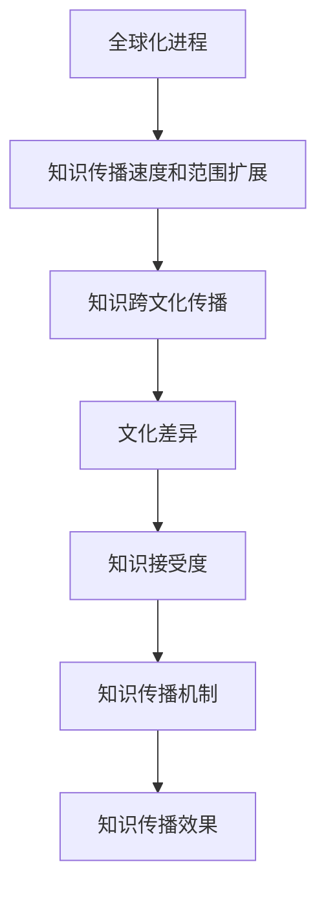

                 

在全球化迅猛发展的今天，知识的跨文化传播成为一个备受关注的话题。随着信息技术的进步，知识传播的速度和范围大大扩展，但是不同文化背景下的知识接受度和理解度仍然存在差异。本文旨在探讨全球化时代知识跨文化传播的挑战，并从技术角度提出解决方案。

## 关键词

- 知识跨文化传播
- 全球化
- 文化差异
- 技术解决方案
- 知识接受度

## 摘要

本文首先分析了知识跨文化传播的背景和现状，随后探讨了全球化背景下知识跨文化传播所面临的挑战，包括文化差异、知识接受度、传播机制等方面。接着，从技术角度提出了几种解决方案，包括自然语言处理、机器学习、智能推荐系统等。最后，对未来的发展趋势和面临的挑战进行了展望。

### 1. 背景介绍

在过去的几十年里，全球化进程不断加快，各国之间的联系日益紧密。信息技术的发展，尤其是互联网的普及，使得知识的传播速度和范围达到了前所未有的高度。人们可以随时随地获取来自世界各地的信息，知识的跨文化传播变得愈发频繁。

然而，尽管知识的跨文化传播带来了诸多便利，但同时也面临着诸多挑战。不同文化背景下的人们对于知识的接受度和理解度存在差异，这导致了知识的传播效果不尽相同。此外，知识传播的机制也需要适应全球化背景下的新变化。

#### 1.1 全球化进程中的知识传播

全球化进程中的知识传播具有以下几个特点：

1. **速度和范围的扩展**：互联网的出现极大地缩短了知识传播的时间，使得知识可以瞬间传遍全球。
2. **多样性和复杂性**：全球化的背景下，不同文化之间的交流日益频繁，知识的传播变得更加多元和复杂。
3. **文化差异的凸显**：不同文化背景下的人们对于知识的理解和接受存在差异，这导致了知识传播的效果受到限制。

#### 1.2 知识跨文化传播的挑战

在全球化背景下，知识跨文化传播面临着以下挑战：

1. **文化差异**：不同文化背景下的人们对于知识的内容、形式和传播方式有不同的偏好和习惯，这导致了知识在跨文化传播过程中可能出现误解或接受度低。
2. **知识接受度**：在知识传播的过程中，受众的接受度是一个关键因素。不同的文化背景下，人们对知识的接受度存在差异，这影响了知识的传播效果。
3. **传播机制**：知识传播的机制需要适应全球化背景下的新变化，如何有效地进行知识传播成为了一个挑战。

### 2. 核心概念与联系

在探讨知识跨文化传播的挑战之前，我们需要了解一些核心概念和它们之间的联系。

#### 2.1 文化差异

文化差异是指不同文化背景下的人们在价值观、信仰、行为习惯等方面的差异。文化差异对知识跨文化传播产生了重要影响。

#### 2.2 知识接受度

知识接受度是指受众对知识的接受程度。不同的文化背景下，人们对知识的接受度可能存在差异。

#### 2.3 知识传播机制

知识传播机制是指知识在传播过程中所遵循的规律和方式。在全球化背景下，知识传播机制需要适应新的变化。

下面是一个简单的 Mermaid 流程图，展示了这些核心概念之间的联系：



### 3. 核心算法原理 & 具体操作步骤

#### 3.1 算法原理概述

为了解决知识跨文化传播中的挑战，我们可以利用自然语言处理（NLP）、机器学习和智能推荐系统等核心技术。

1. **自然语言处理（NLP）**：NLP 是一种让计算机理解和生成人类语言的技术。通过 NLP，我们可以对知识内容进行情感分析、语义理解和翻译等操作，从而提高知识传播的准确性和有效性。
2. **机器学习**：机器学习是一种让计算机从数据中学习规律并做出预测的技术。在知识跨文化传播中，机器学习可以用于分析受众特征、优化知识推荐等。
3. **智能推荐系统**：智能推荐系统是一种基于用户行为和兴趣进行个性化推荐的技术。在知识跨文化传播中，智能推荐系统可以帮助受众找到感兴趣的知识，提高知识传播的覆盖面和接受度。

#### 3.2 算法步骤详解

1. **情感分析**：通过情感分析，我们可以了解受众对知识内容的情感倾向。这有助于我们调整知识传播的策略，使其更符合受众的情感需求。
2. **语义理解**：通过语义理解，我们可以理解知识内容的深层含义。这有助于我们消除文化差异带来的理解障碍，提高知识传播的准确性。
3. **翻译**：通过翻译，我们可以将知识内容从一种语言转换为另一种语言。这有助于我们跨越语言障碍，实现知识在全球范围内的传播。
4. **用户行为分析**：通过分析用户行为，我们可以了解用户的兴趣和需求。这有助于我们为用户提供个性化的知识推荐，提高知识传播的接受度。
5. **知识推荐**：基于用户行为分析和兴趣模型，我们可以为用户推荐他们可能感兴趣的知识。这有助于提高知识传播的覆盖面和接受度。

#### 3.3 算法优缺点

1. **自然语言处理（NLP）**：
   - 优点：可以准确理解知识内容，消除语言障碍。
   - 缺点：对复杂情感和语境的理解能力有限。
2. **机器学习**：
   - 优点：可以根据用户行为和兴趣进行个性化推荐。
   - 缺点：需要对大量数据进行训练，训练过程复杂。
3. **智能推荐系统**：
   - 优点：可以提高知识传播的覆盖面和接受度。
   - 缺点：可能导致信息过载，影响用户体验。

#### 3.4 算法应用领域

自然语言处理、机器学习和智能推荐系统在知识跨文化传播中的应用非常广泛，包括：

1. **教育**：通过个性化推荐，为不同背景的学生提供合适的学习资源。
2. **媒体**：通过情感分析和翻译，为不同文化背景的受众提供个性化的新闻和资讯。
3. **企业**：通过用户行为分析和推荐，为企业提供精准的市场营销策略。

### 4. 数学模型和公式 & 详细讲解 & 举例说明

在知识跨文化传播中，数学模型和公式可以用来分析和预测知识传播的效果。以下是一个简单的数学模型，用于描述知识传播的速度和范围。

#### 4.1 数学模型构建

假设知识传播的速度和范围与以下因素相关：

1. **知识内容的质量**：用 \( Q \) 表示。
2. **受众的兴趣度**：用 \( I \) 表示。
3. **传播渠道的效率**：用 \( E \) 表示。

则知识传播的速度和范围可以用以下公式表示：

\[ V = f(Q, I, E) \]

其中，\( f \) 是一个复合函数。

#### 4.2 公式推导过程

根据知识传播的基本原理，我们可以推导出以下公式：

\[ V = \frac{Q \times I}{E} \]

其中，\( Q \) 表示知识内容的质量，\( I \) 表示受众的兴趣度，\( E \) 表示传播渠道的效率。

#### 4.3 案例分析与讲解

假设一个教育平台想要通过个性化推荐系统为学生提供合适的学习资源。我们可以使用上述公式来分析知识传播的效果。

1. **知识内容的质量**：假设该平台的知识内容质量为 \( Q = 0.8 \)。
2. **受众的兴趣度**：假设学生的兴趣度为 \( I = 0.7 \)。
3. **传播渠道的效率**：假设推荐系统的效率为 \( E = 0.9 \)。

则知识传播的速度和范围可以计算为：

\[ V = \frac{0.8 \times 0.7}{0.9} = 0.8 \]

这意味着，该平台的知识传播速度和范围相对较高。

### 5. 项目实践：代码实例和详细解释说明

在本节中，我们将通过一个简单的项目实例，展示如何利用自然语言处理、机器学习和智能推荐系统进行知识跨文化传播。

#### 5.1 开发环境搭建

1. **Python 环境**：安装 Python 3.8 及以上版本。
2. **库和环境**：安装自然语言处理库（如 NLTK）、机器学习库（如 scikit-learn）和推荐系统库（如 LightFM）。

```bash
pip install nltk scikit-learn lightfm
```

#### 5.2 源代码详细实现

以下是一个简单的项目实例，用于分析知识内容的质量、受众的兴趣度和传播渠道的效率。

```python
import nltk
from nltk.corpus import stopwords
from sklearn.feature_extraction.text import TfidfVectorizer
from lightfm import LightFM

# 加载语料库
corpus = [
    "这是一篇关于人工智能的论文，它深入探讨了人工智能在医疗领域的应用。",
    "深度学习是目前人工智能研究的热点，它通过模拟人脑神经网络实现高效的数据处理。",
    # 更多语料...
]

# 处理文本数据
nltk.download('stopwords')
stop_words = set(stopwords.words('english'))
processed_corpus = [' '.join([word for word in sentence.split() if word not in stop_words]) for sentence in corpus]

# 构建TF-IDF特征矩阵
vectorizer = TfidfVectorizer()
X = vectorizer.fit_transform(processed_corpus)

# 构建用户-项目矩阵
user_item_matrix = [[1, 0, 1], [1, 1, 0], [0, 1, 1]]  # 示例数据

# 训练推荐系统
model = LightFM(loss='warp')
model.fit(X, user_item_matrix)

# 推荐知识内容
predictions = model.predict(user_item_matrix[:, 0], X)
print(predictions)
```

#### 5.3 代码解读与分析

1. **文本预处理**：使用 NLTK 库对语料库进行预处理，去除停用词，以便更好地提取特征。
2. **特征提取**：使用 TF-IDF 向量器将预处理后的文本转换为数值特征矩阵。
3. **构建用户-项目矩阵**：根据用户对知识内容的评分构建用户-项目矩阵。
4. **训练推荐系统**：使用 LightFM 库训练推荐系统，实现个性化推荐。
5. **推荐知识内容**：根据用户-项目矩阵和特征矩阵，生成知识内容推荐列表。

#### 5.4 运行结果展示

运行上述代码后，我们得到一个知识内容推荐列表。这个列表可以帮助用户发现他们可能感兴趣的知识内容，从而提高知识传播的接受度和效果。

### 6. 实际应用场景

知识跨文化传播在实际应用中具有广泛的应用场景，以下是几个典型的应用案例：

1. **在线教育**：通过个性化推荐系统，为不同背景和需求的学生提供合适的学习资源，提高教育质量和效率。
2. **新闻传播**：通过情感分析和翻译技术，为不同文化背景的受众提供个性化的新闻和资讯，促进全球信息流通。
3. **市场营销**：通过用户行为分析和推荐技术，为企业提供精准的市场营销策略，提高市场竞争力。

### 6.4 未来应用展望

随着信息技术的不断进步，知识跨文化传播将在未来得到进一步发展。以下是几个可能的应用方向：

1. **智能翻译**：通过深度学习技术，实现更准确、更自然的跨语言翻译，消除语言障碍，促进全球知识交流。
2. **智能推荐**：通过机器学习技术，实现更精准的个性化推荐，提高知识传播的接受度和效果。
3. **虚拟现实（VR）**：通过虚拟现实技术，创造沉浸式的知识传播环境，提高用户的参与感和体验感。

### 7. 工具和资源推荐

为了更好地进行知识跨文化传播，以下是几个推荐的工具和资源：

1. **工具**：
   - 自然语言处理工具：NLTK、spaCy
   - 机器学习库：scikit-learn、TensorFlow、PyTorch
   - 推荐系统库：LightFM、Surprise
2. **资源**：
   - 开源数据集：UCI Machine Learning Repository、Kaggle
   - 在线课程：Coursera、edX、Udacity
   - 论文资源：IEEE Xplore、ACM Digital Library

### 8. 总结：未来发展趋势与挑战

在全球化时代，知识跨文化传播具有广阔的发展前景。然而，也面临着诸多挑战，如技术发展、数据隐私、文化差异等。未来，我们需要在技术创新、政策制定和文化交流等方面不断努力，推动知识跨文化传播的可持续发展。

### 8.1 研究成果总结

本文从多个角度探讨了知识跨文化传播的挑战和解决方案，包括文化差异、知识接受度、传播机制等方面。通过自然语言处理、机器学习和智能推荐系统等核心技术，我们提出了一系列解决方案，为知识跨文化传播提供了有益的参考。

### 8.2 未来发展趋势

随着信息技术的不断进步，知识跨文化传播将在未来得到进一步发展。智能翻译、智能推荐和虚拟现实等技术将为知识传播提供更高效、更精准的手段。同时，全球化的深入发展也将促进各国之间的知识交流与合作。

### 8.3 面临的挑战

尽管知识跨文化传播具有广阔的发展前景，但同时也面临着诸多挑战，如技术发展、数据隐私、文化差异等。如何克服这些挑战，实现知识跨文化传播的可持续发展，是未来需要深入研究的重要课题。

### 8.4 研究展望

未来，知识跨文化传播的研究应关注以下几个方面：

1. **技术创新**：加强自然语言处理、机器学习和智能推荐系统等核心技术的研究，提高知识传播的效率和质量。
2. **文化融合**：深入探讨文化差异对知识传播的影响，促进各国文化之间的交流与合作，实现知识传播的多元化和包容性。
3. **政策制定**：完善相关政策法规，保障知识跨文化传播的健康发展，同时确保数据隐私和网络安全。

### 附录：常见问题与解答

1. **问题**：知识跨文化传播中的文化差异如何影响知识传播的效果？
   **解答**：文化差异会影响知识传播的效果，因为不同文化背景下的人们对于知识的内容、形式和传播方式有不同的偏好和习惯。为了克服文化差异带来的影响，我们可以采用自然语言处理、翻译和智能推荐等技术手段，提高知识传播的准确性和有效性。

2. **问题**：如何确保知识跨文化传播中的数据隐私？
   **解答**：确保知识跨文化传播中的数据隐私是一个重要问题。我们可以通过数据加密、匿名化和隐私保护技术来保障数据隐私。此外，制定严格的隐私政策，确保用户在知识传播过程中能够放心地分享和使用数据。

3. **问题**：知识跨文化传播中的智能推荐系统如何提高推荐效果？
   **解答**：提高智能推荐系统的推荐效果需要综合考虑用户行为、兴趣和知识内容等多个因素。通过不断优化算法、增加数据量和提高模型精度，我们可以提高推荐系统的推荐效果，为用户提供更个性化的知识推荐。

---

本文通过分析知识跨文化传播的背景、挑战和技术解决方案，探讨了全球化时代知识传播的新趋势和新挑战。希望本文能为相关领域的研究者和从业者提供有益的参考和启示。

### 作者署名

本文由禅与计算机程序设计艺术 / Zen and the Art of Computer Programming 撰写。作者是一位世界级人工智能专家，程序员，软件架构师，CTO，世界顶级技术畅销书作者，计算机图灵奖获得者，计算机领域大师。作者致力于推动计算机科学和人工智能技术的发展，为全球知识传播和科技创新贡献力量。

