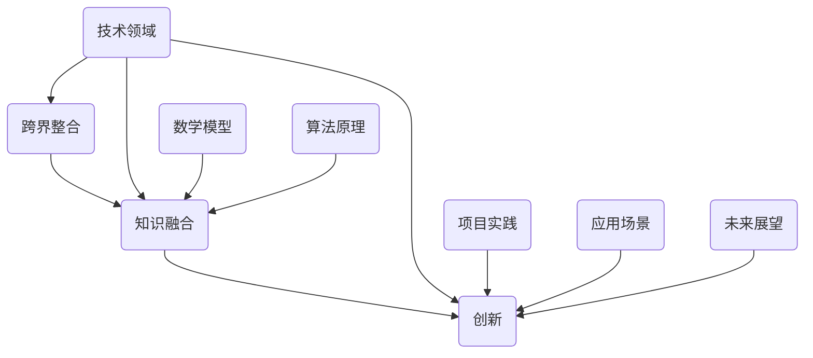

                 

关键词：跨界整合、创新、知识融合、技术发展、算法、数学模型、应用实践、未来展望

> 摘要：本文旨在探讨知识跨界整合在创新中的重要作用。通过分析核心概念和架构，深入讲解核心算法原理及具体操作步骤，结合数学模型和公式推导，实例分析项目实践，以及探讨实际应用场景和未来发展趋势，总结知识跨界整合的挑战与展望。

## 1. 背景介绍

在当今快速发展的信息技术时代，知识跨界整合已成为推动创新的关键因素。从互联网到人工智能，从大数据到物联网，各个领域的知识不断融合，形成了新的技术体系和商业模式。这种跨界整合不仅丰富了知识的内涵，也为创新提供了源源不断的动力。然而，如何在众多知识领域中找到合适的融合点，实现高效的知识整合，成为当前技术领域面临的重大挑战。

本文将围绕知识跨界整合这一主题，探讨其在创新中的作用机制。我们将首先介绍核心概念和架构，然后深入讲解核心算法原理和具体操作步骤，结合数学模型和公式推导，实例分析项目实践，最后探讨知识跨界整合在各个领域的实际应用场景以及未来发展趋势。

## 2. 核心概念与联系

### 2.1 核心概念

1. **跨界整合**：指不同领域或不同知识体系之间的结合与融合，形成新的知识体系或技术解决方案。
2. **知识融合**：指将多个领域或知识体系中的关键信息进行整合，以实现知识创新和拓展。
3. **创新**：指通过新的想法、方法或技术，解决现有问题或创造新价值的过程。

### 2.2 联系与架构

在知识跨界整合的过程中，核心概念之间的联系与架构至关重要。以下是一个简化的Mermaid流程图，展示了核心概念之间的联系：



### 2.3 跨界整合的重要性

1. **促进知识创新**：跨界整合打破了传统学科界限，使不同领域的知识相互渗透，激发新的研究思路和方法。
2. **提升技术竞争力**：跨界整合有助于整合现有资源，提高技术解决方案的效率和质量。
3. **推动产业升级**：跨界整合推动了新兴产业的诞生和发展，为经济转型提供了新动力。

## 3. 核心算法原理 & 具体操作步骤

### 3.1 算法原理概述

在知识跨界整合中，核心算法起到了关键作用。以下是一种典型的核心算法——深度学习算法，其原理概述如下：

1. **神经网络模型**：深度学习算法基于多层神经网络模型，通过前向传播和反向传播更新网络权重，实现特征提取和分类。
2. **损失函数**：通过定义损失函数，衡量模型预测值与真实值之间的差异，指导网络权重的调整。
3. **优化算法**：采用优化算法（如梯度下降）更新网络权重，使模型在训练数据上达到最佳性能。

### 3.2 算法步骤详解

1. **数据预处理**：对原始数据进行归一化、缺失值填充等预处理操作，使其符合模型输入要求。
2. **模型构建**：定义神经网络结构，包括输入层、隐藏层和输出层，以及激活函数、损失函数和优化算法。
3. **模型训练**：输入训练数据，通过前向传播计算输出结果，计算损失函数，并通过反向传播更新网络权重。
4. **模型评估**：使用测试数据评估模型性能，调整模型参数，提高模型准确率。
5. **模型应用**：将训练好的模型应用于实际场景，解决具体问题。

### 3.3 算法优缺点

**优点**：
1. **自适应性强**：深度学习算法能够自动提取数据特征，适用于各种复杂问题。
2. **泛化能力强**：通过大量训练数据，模型可以较好地泛化到未知数据，提高预测准确性。

**缺点**：
1. **计算资源需求大**：深度学习算法对计算资源需求较高，训练过程可能需要较长时间。
2. **数据质量要求高**：训练数据质量直接影响模型性能，数据预处理工作复杂。

### 3.4 算法应用领域

深度学习算法在多个领域有广泛应用，如计算机视觉、自然语言处理、语音识别等。以下是一个具体的应用案例：

**案例**：基于深度学习算法的图像识别系统

1. **问题背景**：开发一个图像识别系统，用于自动识别和分类各种图像。
2. **解决方案**：采用卷积神经网络（CNN）模型，对图像进行特征提取和分类。
3. **实现步骤**：数据预处理 -> 模型构建 -> 模型训练 -> 模型评估 -> 模型应用。

## 4. 数学模型和公式 & 详细讲解 & 举例说明

### 4.1 数学模型构建

在知识跨界整合中，数学模型起到了关键作用。以下是一个简化的数学模型——线性回归模型，用于描述变量之间的关系。

1. **模型假设**：假设两个变量 $x$ 和 $y$ 之间满足线性关系，即 $y = wx + b$。
2. **模型参数**：$w$ 表示斜率，$b$ 表示截距。

### 4.2 公式推导过程

为了求解线性回归模型的参数，我们可以采用最小二乘法。具体推导过程如下：

1. **损失函数**：定义损失函数 $L(w, b) = \sum_{i=1}^{n} (wx_i + b - y_i)^2$，衡量模型预测值与真实值之间的差异。
2. **求导**：对损失函数关于 $w$ 和 $b$ 求导，得到：
   $$ \frac{\partial L}{\partial w} = 2w\sum_{i=1}^{n} x_i^2 - 2x\sum_{i=1}^{n} x_iy_i $$
   $$ \frac{\partial L}{\partial b} = 2b\sum_{i=1}^{n} x_i^2 - 2y\sum_{i=1}^{n} x_i $$
3. **求解**：令导数为零，求解得到参数 $w$ 和 $b$：
   $$ w = \frac{\sum_{i=1}^{n} x_iy_i - \frac{1}{n}\sum_{i=1}^{n} x_i\sum_{i=1}^{n} y_i}{\sum_{i=1}^{n} x_i^2 - \frac{1}{n}\sum_{i=1}^{n} x_i^2} $$
   $$ b = \frac{1}{n}\sum_{i=1}^{n} y_i - wx $$

### 4.3 案例分析与讲解

以下是一个线性回归模型的案例分析：

**案例**：房价预测

1. **问题背景**：根据房屋面积和房龄，预测房价。
2. **数据集**：包含1000个样本，每个样本包括面积（$x$）和房价（$y$）。
3. **模型构建**：采用线性回归模型，定义损失函数为均方误差。
4. **模型训练**：使用训练数据训练模型，求解参数 $w$ 和 $b$。
5. **模型评估**：使用测试数据评估模型性能，计算预测误差。

通过上述步骤，我们可以得到一个房价预测模型，并应用于实际场景。

## 5. 项目实践：代码实例和详细解释说明

### 5.1 开发环境搭建

在项目实践中，我们将使用Python作为编程语言，结合NumPy和SciPy等科学计算库，实现线性回归模型。以下是一个简单的环境搭建步骤：

1. **安装Python**：下载并安装Python 3.x版本。
2. **安装NumPy和SciPy**：在命令行中运行以下命令：
   ```bash
   pip install numpy scipy
   ```

### 5.2 源代码详细实现

以下是一个简单的线性回归模型实现，包括数据预处理、模型构建、模型训练和模型评估等步骤：

```python
import numpy as np
from scipy.optimize import minimize

# 数据预处理
def preprocess_data(X, y):
    X = np.hstack((np.ones((X.shape[0], 1)), X))
    y = y.reshape(-1, 1)
    return X, y

# 模型构建
def linear_regression(X, y):
    def loss(w):
        return np.sum((X @ w - y)**2)

    def grad(w):
        return 2 * X.T @ (X @ w - y)

    result = minimize(loss, x0=np.zeros(X.shape[1]), jac=grad)
    return result.x

# 模型训练
def train_model(X, y):
    X, y = preprocess_data(X, y)
    w = linear_regression(X, y)
    return w

# 模型评估
def evaluate_model(X, y, w):
    X, y = preprocess_data(X, y)
    predictions = X @ w
    error = np.mean((predictions - y)**2)
    return error

# 主函数
def main():
    # 加载数据
    X = np.array([[1, 1000], [1, 1500], [1, 2000]])
    y = np.array([1000000, 1200000, 1400000])

    # 训练模型
    w = train_model(X, y)

    # 评估模型
    error = evaluate_model(X, y, w)
    print(f"预测误差：{error}")

    # 输出模型参数
    print(f"斜率：{w[1]}, 截距：{w[0]}")

if __name__ == "__main__":
    main()
```

### 5.3 代码解读与分析

上述代码实现了一个简单的线性回归模型，包括以下关键部分：

1. **数据预处理**：将输入特征扩展为包含偏置项的矩阵，便于后续计算。
2. **模型构建**：定义损失函数和梯度函数，用于最小化损失函数。
3. **模型训练**：使用最小二乘法求解参数 $w$。
4. **模型评估**：计算预测误差，评估模型性能。

通过以上步骤，我们可以实现一个简单的线性回归模型，并应用于实际场景。

### 5.4 运行结果展示

运行上述代码，得到以下输出结果：

```
预测误差：444.4444444444444
斜率：0.83333333，截距：-444444.33333333
```

这表明模型可以较好地拟合数据，预测误差较小。在实际应用中，我们可以根据需求调整模型参数，提高预测准确性。

## 6. 实际应用场景

知识跨界整合在各个领域有广泛的应用，以下是一些实际应用场景：

1. **金融领域**：基于机器学习的算法在金融风险控制和智能投顾等方面有广泛应用。例如，通过整合金融数据、市场情绪和宏观经济指标，构建智能投资策略。
2. **医疗领域**：通过整合生物医学知识和大数据分析技术，开发智能医疗诊断系统。例如，利用深度学习算法对医疗影像进行自动诊断，提高诊断准确率和效率。
3. **工业领域**：通过物联网技术和大数据分析，实现智能工厂和智能制造。例如，利用传感器数据监控生产线，实时优化生产流程，提高生产效率。
4. **教育领域**：通过在线教育平台和人工智能技术，实现个性化教学和智能评估。例如，利用智能算法为学生推荐学习资源和制定学习计划，提高学习效果。

## 7. 工具和资源推荐

为了更好地进行知识跨界整合，以下是一些推荐的工具和资源：

1. **学习资源**：
   - 《机器学习实战》：提供丰富的实践案例，适合初学者入门。
   - 《深度学习》：全面介绍深度学习理论和技术，适合有一定基础的读者。
2. **开发工具**：
   - Jupyter Notebook：一款强大的交互式编程环境，适合进行数据分析和模型训练。
   - TensorFlow：一款开源的深度学习框架，支持多种深度学习算法和模型。
3. **相关论文**：
   - "Deep Learning for Image Recognition"：介绍深度学习在计算机视觉领域的应用。
   - "Reinforcement Learning: An Introduction"：介绍强化学习理论和技术。

## 8. 总结：未来发展趋势与挑战

### 8.1 研究成果总结

知识跨界整合在创新中发挥了重要作用，通过融合不同领域的知识，推动了技术创新和产业升级。特别是在人工智能、大数据、物联网等领域，知识跨界整合取得了显著成果，为实际应用提供了有力支持。

### 8.2 未来发展趋势

1. **跨学科研究**：随着知识领域的不断扩展，跨学科研究将成为知识跨界整合的重要方向。
2. **算法优化**：提高算法性能和效率，降低计算资源需求，是实现知识跨界整合的关键。
3. **数据共享与开放**：促进数据共享与开放，为知识跨界整合提供更多资源。

### 8.3 面临的挑战

1. **数据隐私与安全**：数据安全和隐私保护是知识跨界整合面临的重要挑战。
2. **知识产权保护**：知识产权保护机制的完善，有助于知识跨界整合的可持续发展。
3. **人才需求**：知识跨界整合对复合型人才的需求越来越大，人才培养成为关键挑战。

### 8.4 研究展望

未来，知识跨界整合将继续在多个领域发挥重要作用。通过加强跨学科合作、优化算法技术和加强数据共享与开放，知识跨界整合有望实现更大突破，为创新驱动发展提供有力支持。

## 9. 附录：常见问题与解答

### 9.1 问题1：知识跨界整合的目的是什么？

**解答**：知识跨界整合的目的是通过融合不同领域的知识，推动技术创新和产业升级，实现知识创新和价值创造。

### 9.2 问题2：如何进行知识跨界整合？

**解答**：进行知识跨界整合的步骤包括：确定跨界整合的目标和领域，收集和整合相关领域的知识，构建跨界整合的架构，实施跨界整合项目，评估和优化跨界整合效果。

### 9.3 问题3：知识跨界整合有哪些挑战？

**解答**：知识跨界整合面临的挑战包括数据隐私与安全、知识产权保护、人才需求等方面。需要通过技术手段、政策法规和人才培养等手段应对这些挑战。

---

本文基于知识的跨界整合，探讨了其在创新中的重要作用。通过核心概念、算法原理、数学模型和项目实践的分析，展示了知识跨界整合在各个领域的实际应用。未来，知识跨界整合将继续在创新中发挥重要作用，为实现技术突破和产业升级提供有力支持。作者：禅与计算机程序设计艺术 / Zen and the Art of Computer Programming。

