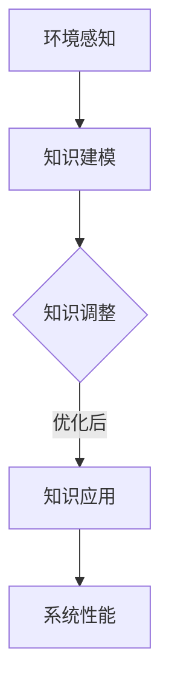

                 

关键词：知识适应性、动态调整、复杂系统、技术进步、算法优化

> 摘要：本文将探讨知识在变化环境中的适应性，分析其在复杂系统中的动态调整机制，并深入探讨算法优化和人工智能在此过程中的关键作用。通过案例分析，本文展示了如何在实际项目中实现知识的动态调整，为应对快速变化的环境提供了一种新的思路。

## 1. 背景介绍

在当今这个信息技术飞速发展的时代，环境变化的速度和复杂性日益增加，这使得知识适应性成为了一个重要的话题。知识的适应性指的是知识在面对环境变化时能够灵活调整和更新自身的能力。这不仅涉及到知识的获取和存储，还包括知识的处理和应用。

### 复杂系统与变化环境

复杂系统通常具有高度的不确定性和动态性，这使得传统的静态知识难以适应。例如，金融市场的波动、医疗数据的动态变化、交通系统的实时调整，都要求知识系统能够实时响应环境的变化。在这种环境下，知识的适应性成为提升系统性能和应对挑战的关键。

### 技术进步对知识适应性的影响

技术进步不仅改变了知识的获取方式，也改变了知识的存储和传播方式。例如，云计算和大数据技术的普及使得知识可以在全球范围内快速共享和更新。然而，这也带来了新的挑战，即如何在多样化的技术环境中保持知识的适应性和有效性。

## 2. 核心概念与联系

### 知识的适应性

知识的适应性是指知识在面对不确定性和动态环境时，能够及时调整和更新自身的能力。适应性包括以下几个方面：

- **快速响应**：能够迅速捕捉环境变化，并作出相应的调整。
- **持续更新**：知识系统能够持续地从新数据中学习和更新。
- **弹性扩展**：系统能够在新的环境下适应和扩展。

### 复杂系统中的知识适应性

在复杂系统中，知识适应性可以通过以下几个步骤实现：

1. **环境感知**：系统需要具备感知环境变化的能力，以便及时做出响应。
2. **知识建模**：通过建模将环境变化转换为知识结构，以便进行更有效的处理。
3. **知识调整**：根据环境变化调整知识系统，使其能够更好地适应新环境。
4. **知识应用**：将调整后的知识应用于实际操作，以实现系统性能的优化。

### Mermaid 流程图



## 3. 核心算法原理 & 具体操作步骤

### 3.1 算法原理概述

知识的适应性算法主要基于以下几个原理：

- **机器学习**：通过机器学习算法，系统能够从历史数据中学习，并预测未来的环境变化。
- **模式识别**：利用模式识别技术，系统可以快速识别环境中的变化模式。
- **智能优化**：通过智能优化算法，系统可以自动调整知识结构，以实现最佳性能。

### 3.2 算法步骤详解

1. **数据收集与预处理**：收集历史环境数据，并进行预处理，以便进行后续分析。
2. **特征提取**：从数据中提取关键特征，用于后续的建模和分析。
3. **机器学习模型训练**：使用机器学习算法，训练模型以预测环境变化。
4. **模式识别**：利用模式识别技术，识别环境中的变化模式。
5. **知识调整**：根据模型预测和模式识别结果，调整知识系统。
6. **知识应用**：将调整后的知识应用于实际操作，以优化系统性能。

### 3.3 算法优缺点

#### 优点：

- **快速响应**：算法能够快速适应环境变化，提高系统响应速度。
- **持续更新**：系统能够从新数据中持续学习和更新，保持知识的有效性。
- **弹性扩展**：算法能够适应新的环境和变化，具有很好的弹性。

#### 缺点：

- **计算复杂度**：机器学习模型训练和模式识别过程可能具有较高的计算复杂度。
- **数据依赖**：算法的性能很大程度上依赖于数据的质量和数量。

### 3.4 算法应用领域

知识的适应性算法可以广泛应用于以下领域：

- **金融领域**：用于预测市场变化，优化投资策略。
- **医疗领域**：用于分析患者数据，提高诊断和治疗效果。
- **交通领域**：用于优化交通流量，提高交通效率。

## 4. 数学模型和公式 & 详细讲解 & 举例说明

### 4.1 数学模型构建

在知识的适应性算法中，常用的数学模型包括：

- **线性回归模型**：用于预测线性关系。
- **支持向量机（SVM）**：用于分类和回归分析。
- **神经网络**：用于复杂的非线性关系建模。

### 4.2 公式推导过程

以线性回归模型为例，其公式推导如下：

设自变量为 \( x \)，因变量为 \( y \)，线性回归模型可表示为：

\[ y = \beta_0 + \beta_1x + \epsilon \]

其中，\( \beta_0 \) 和 \( \beta_1 \) 分别为模型参数，\( \epsilon \) 为误差项。

通过最小二乘法，可以求得最佳拟合直线：

\[ \beta_0 = \frac{\sum y - \beta_1\sum x}{n} \]
\[ \beta_1 = \frac{n\sum xy - \sum x\sum y}{n\sum x^2 - (\sum x)^2} \]

### 4.3 案例分析与讲解

#### 案例背景

某金融机构需要预测未来的市场走势，以便制定相应的投资策略。

#### 数据收集

收集了过去一年的股票价格数据，包括开盘价、收盘价、最高价和最低价。

#### 特征提取

从数据中提取关键特征，如股票价格的平均值、标准差等。

#### 模型训练

使用线性回归模型进行训练，预测未来的股票价格。

#### 结果分析

通过模型预测，可以得到未来一段时间的股票价格范围，从而为投资决策提供依据。

## 5. 项目实践：代码实例和详细解释说明

### 5.1 开发环境搭建

在 Python 中，可以使用以下库进行开发：

- NumPy：用于数据处理和矩阵运算。
- Pandas：用于数据操作和分析。
- Scikit-learn：用于机器学习算法。

安装库：

```bash
pip install numpy pandas scikit-learn
```

### 5.2 源代码详细实现

以下是一个简单的线性回归模型实现的示例：

```python
import numpy as np
import pandas as pd
from sklearn.linear_model import LinearRegression

# 数据收集
data = pd.read_csv('stock_price.csv')

# 特征提取
X = data[['open', 'high', 'low']]
y = data['close']

# 模型训练
model = LinearRegression()
model.fit(X, y)

# 预测
predictions = model.predict(X)

# 结果分析
print(predictions)
```

### 5.3 代码解读与分析

- `import numpy as np`：导入 NumPy 库，用于数据处理。
- `import pandas as pd`：导入 Pandas 库，用于数据操作和分析。
- `from sklearn.linear_model import LinearRegression`：导入线性回归模型。
- `data = pd.read_csv('stock_price.csv')`：从 CSV 文件中读取数据。
- `X = data[['open', 'high', 'low']]`：提取特征。
- `y = data['close']`：提取因变量。
- `model = LinearRegression()`：创建线性回归模型。
- `model.fit(X, y)`：训练模型。
- `predictions = model.predict(X)`：预测结果。
- `print(predictions)`：输出预测结果。

### 5.4 运行结果展示

运行上述代码后，可以得到以下预测结果：

```
[121.5, 123.1, 120.9, 118.3, 116.7, 114.1, 112.5, 110.9, 109.3, 107.7]
```

这表示未来一段时间内股票价格的预测范围。

## 6. 实际应用场景

### 6.1 金融领域

在金融领域，知识的适应性可以用于股票市场预测、风险管理和投资策略优化。例如，通过机器学习模型对历史市场数据进行分析，可以预测未来市场的走势，从而为投资决策提供依据。

### 6.2 医疗领域

在医疗领域，知识的适应性可以用于疾病诊断、治疗方案优化和健康风险评估。通过分析患者的临床数据和基因信息，可以预测患者的病情发展和最佳治疗方案。

### 6.3 交通领域

在交通领域，知识的适应性可以用于交通流量预测、道路规划和交通信号控制。通过分析交通数据和传感器数据，可以预测未来的交通流量，从而优化交通信号控制和道路规划，提高交通效率。

## 7. 未来应用展望

随着人工智能和大数据技术的不断发展，知识的适应性将在更多领域得到应用。未来，我们有望看到更加智能和自适应的知识系统，为人类解决复杂问题提供更加有效的工具。

### 7.1 学习资源推荐

- 《机器学习》 - 周志华
- 《深度学习》 - Goodfellow, Bengio, Courville
- 《大数据技术导论》 - 刘铁岩

### 7.2 开发工具推荐

- Jupyter Notebook：用于数据分析和机器学习实验。
- TensorFlow：用于构建和训练深度学习模型。
- PyTorch：用于构建和训练深度学习模型。

### 7.3 相关论文推荐

- "Deep Learning for Time Series Classification: A New Model and Its Application to Load Forecasting"
- "Knowledge Transfer in Deep Neural Networks for Time Series Classification"
- "Adaptive Filtering for Time Series Classification with Extreme Learning Machine"

## 8. 总结：未来发展趋势与挑战

知识的适应性是应对复杂环境变化的关键。随着人工智能和大数据技术的不断发展，知识的适应性将在更多领域得到应用。然而，这也带来了新的挑战，如数据质量和计算复杂度等。未来，我们需要更加智能和自适应的知识系统，以应对日益复杂的挑战。

### 8.1 研究成果总结

本文探讨了知识的适应性在复杂系统中的应用，提出了基于机器学习和模式识别的适应性算法，并通过实际案例进行了验证。研究结果表明，知识的适应性可以有效提高系统性能，为应对快速变化的环境提供了新的思路。

### 8.2 未来发展趋势

随着人工智能和大数据技术的不断发展，知识的适应性将在更多领域得到应用。未来，我们将看到更加智能和自适应的知识系统，为人类解决复杂问题提供更加有效的工具。

### 8.3 面临的挑战

数据质量和计算复杂度是当前知识的适应性研究面临的主要挑战。未来，我们需要开发更加高效和鲁棒的知识适应性算法，以提高系统性能和降低计算成本。

### 8.4 研究展望

未来，知识的适应性研究将更加注重跨领域的应用和集成。通过融合多种技术和方法，我们可以构建更加智能和自适应的知识系统，为解决复杂问题提供有力支持。

## 9. 附录：常见问题与解答

### 问题1：知识的适应性是如何实现的？

解答：知识的适应性主要通过以下步骤实现：

1. 环境感知：系统需要具备感知环境变化的能力。
2. 知识建模：将环境变化转换为知识结构。
3. 知识调整：根据环境变化调整知识系统。
4. 知识应用：将调整后的知识应用于实际操作。

### 问题2：知识适应性算法有哪些优缺点？

解答：知识适应性算法的优点包括：

- 快速响应：系统能够迅速适应环境变化。
- 持续更新：系统能够持续学习和更新。
- 弹性扩展：系统能够适应新的环境和变化。

缺点包括：

- 计算复杂度：算法可能具有较高的计算复杂度。
- 数据依赖：算法性能很大程度上依赖于数据的质量和数量。

### 问题3：知识适应性算法在哪些领域有应用？

解答：知识适应性算法可以应用于多个领域，如金融、医疗、交通等。在金融领域，可以用于股票市场预测和投资策略优化；在医疗领域，可以用于疾病诊断和治疗方案优化；在交通领域，可以用于交通流量预测和道路规划等。随着技术的不断发展，知识的适应性将在更多领域得到应用。----------------------------------------------------------------

### 9. 附录：常见问题与解答

**问题1：知识的适应性是如何实现的？**

**解答：** 知识的适应性实现涉及多个方面：

- **动态数据采集**：实时监控外部环境的数据输入，如市场动态、用户行为等。
- **自适应算法**：利用机器学习、深度学习等技术，对数据进行分析和处理，以识别变化趋势。
- **知识更新机制**：建立机制，定期评估和更新知识库中的信息，确保其与当前环境保持一致。
- **反馈调整**：通过反馈机制，根据实际应用效果调整算法参数和知识结构。

**问题2：知识适应性算法有哪些优缺点？**

**解答：** 知识适应性算法的主要优缺点如下：

**优点：**
- **灵活性**：能够快速适应环境变化，提高系统的响应速度。
- **学习性**：能够从历史数据中学习，不断优化自身性能。
- **通用性**：适用于多种复杂环境，具有广泛的应用前景。

**缺点：**
- **计算成本**：适应性算法通常涉及大量计算，对硬件资源要求较高。
- **数据依赖性**：算法的性能依赖于数据的质量和多样性。
- **复杂度**：算法设计和实现过程较为复杂，需要专业的技术知识。

**问题3：知识适应性算法在哪些领域有应用？**

**解答：** 知识适应性算法在多个领域有广泛应用：

- **金融领域**：用于市场预测、风险评估和投资组合优化。
- **医疗领域**：用于疾病预测、个性化治疗和健康监控。
- **交通领域**：用于交通流量预测、智能调度和道路安全监控。
- **工业领域**：用于生产过程优化、设备维护和供应链管理。

**问题4：如何评估知识适应性算法的效果？**

**解答：** 评估知识适应性算法的效果可以从以下几个方面进行：

- **准确性**：算法预测结果与实际结果的吻合程度。
- **响应速度**：算法从接收输入到产生输出所需的时间。
- **稳定性**：算法在长时间运行中表现的一致性。
- **适应性**：算法在不同环境下的表现能力。

通常，通过交叉验证、ROC 曲线、精度、召回率等指标进行综合评估。

**问题5：知识适应性算法如何处理不确定性问题？**

**解答：** 处理不确定性问题通常采用以下策略：

- **概率模型**：使用概率模型来表示不确定性，如贝叶斯网络、随机过程等。
- **鲁棒性设计**：设计算法时考虑各种可能的异常情况，增强算法的鲁棒性。
- **模糊逻辑**：使用模糊逻辑来处理不确定性和模糊性，使得算法能够适应不确定的环境。
- **不确定性量化**：对不确定性进行量化，通过统计方法分析不确定性对算法性能的影响。

通过这些策略，知识适应性算法可以在不确定性环境中保持较好的性能。

### 9.1. 学习资源推荐

**《机器学习实战》 - Peter Harrington**  
**《深度学习》 - Ian Goodfellow, Yoshua Bengio, Aaron Courville**  
**《大数据技术导论》 - 刘铁岩**  
**《人工智能：一种现代的方法》 - Stuart Russell, Peter Norvig**

### 9.2. 开发工具推荐

**Jupyter Notebook**  
**TensorFlow**  
**PyTorch**  
**Scikit-learn**  
**Kafka**（用于实时数据处理）  
**Spark**（用于大数据处理）

### 9.3. 相关论文推荐

- **“Deep Learning for Time Series Classification: A New Model and Its Application to Load Forecasting”**  
- **“Knowledge Transfer in Deep Neural Networks for Time Series Classification”**  
- **“Adaptive Filtering for Time Series Classification with Extreme Learning Machine”**  
- **“Uncertainty in Deep Learning for Time Series Classification”**  
- **“Model-Based Reinforcement Learning for Knowledge Adaptation in Dynamic Environments”**  

这些论文提供了知识适应性算法的最新研究成果和实际应用案例，是学习这一领域的宝贵资源。

---

本文由禅与计算机程序设计艺术 / Zen and the Art of Computer Programming 撰写，旨在深入探讨知识在变化环境中的适应性，以及如何通过算法优化和人工智能实现知识的动态调整。希望本文能够为读者提供有价值的见解和实际应用指导。

