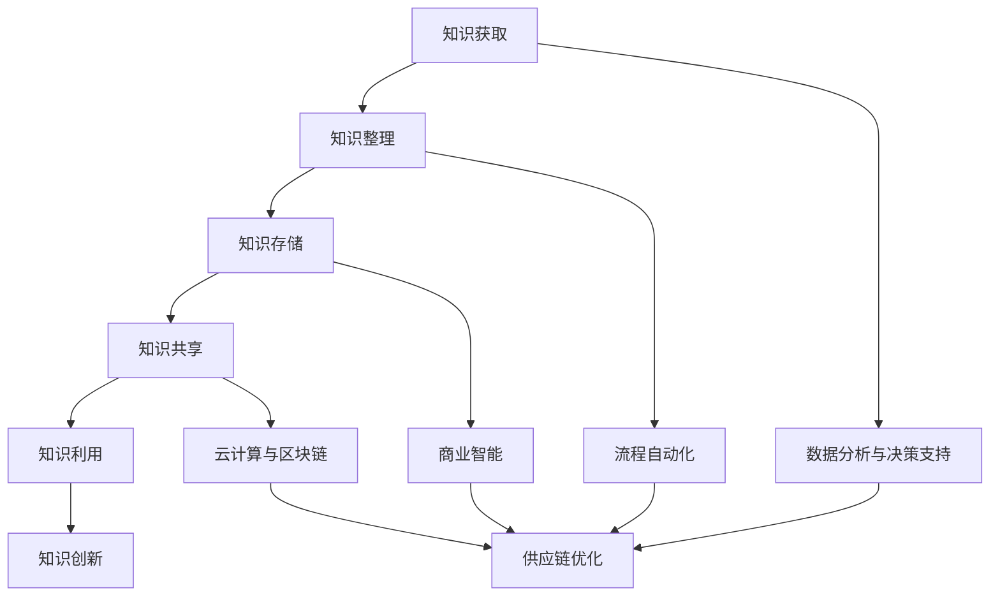

                 

关键词：知识管理、供应链优化、人工智能、算法、数据分析、供应链管理、流程自动化、商业智能、云计算、区块链

> 摘要：本文旨在探讨知识管理在供应链优化中的重要作用。通过分析供应链优化的核心问题和挑战，本文将阐述如何利用知识管理技术提升供应链的效率、降低成本，并最终实现企业竞争力的提升。文章将涵盖知识管理的定义、供应链优化的基本概念、知识管理在供应链优化中的应用场景、核心算法原理以及项目实践等内容。

## 1. 背景介绍

供应链优化是现代企业提升竞争力、降低成本、提高客户满意度的重要手段。随着全球化、信息化的深入发展，供应链的复杂性和不确定性不断增加，传统的供应链管理方法已无法满足企业的需求。因此，如何通过技术手段优化供应链，提高供应链的透明度和协同性，成为企业亟需解决的问题。

知识管理作为一种系统性的方法，旨在通过获取、整理、存储、共享和利用知识，提高组织内部的信息流动效率，促进知识的创新和应用。在供应链优化过程中，知识管理不仅可以帮助企业快速响应市场变化，还能提高决策的准确性，降低运营风险。

本文将围绕知识管理在供应链优化中的应用，探讨以下几个方面：

- 知识管理的定义和基本原理
- 供应链优化的核心问题和挑战
- 知识管理在供应链优化中的应用场景
- 核心算法原理及其在供应链优化中的应用
- 项目实践：代码实例和详细解释说明
- 实际应用场景和未来展望
- 工具和资源推荐
- 总结：未来发展趋势与挑战

## 2. 核心概念与联系

### 2.1 知识管理的定义

知识管理是指通过系统的方法，对知识进行获取、整理、存储、共享和利用的过程，以提高组织内部的信息流动效率，促进知识的创新和应用。知识管理涉及多个方面，包括知识识别、知识获取、知识存储、知识共享、知识利用和知识创新。

### 2.2 供应链优化的定义

供应链优化是指通过一系列技术和方法，对供应链中的各个环节进行改进和优化，以提高供应链的整体效率和竞争力。供应链优化包括采购、生产、物流、库存管理、供应链协同等环节。

### 2.3 知识管理在供应链优化中的应用

知识管理在供应链优化中的应用主要体现在以下几个方面：

- 数据分析与决策支持：通过收集和分析供应链中的数据，为企业提供决策支持，提高决策的准确性。
- 流程自动化：利用知识管理技术，实现供应链管理流程的自动化，降低人工干预，提高工作效率。
- 商业智能：通过数据分析和挖掘，为企业提供商业智能支持，帮助企业发现市场机会，制定更有效的供应链策略。
- 云计算与区块链：利用云计算和区块链技术，实现供应链数据的实时共享和透明化，提高供应链的协同性。

### 2.4 Mermaid 流程图



## 3. 核心算法原理 & 具体操作步骤

### 3.1 算法原理概述

在供应链优化中，常用的算法包括线性规划、网络流优化、遗传算法等。这些算法旨在通过数学模型和优化方法，找到最优的供应链配置和运行方案，以提高供应链的效率和竞争力。

### 3.2 算法步骤详解

1. **数据收集**：收集供应链中的各种数据，包括采购数据、生产数据、物流数据、库存数据等。
2. **数据预处理**：对收集到的数据进行清洗、整合和标准化处理，确保数据的质量和一致性。
3. **建立数学模型**：根据供应链优化的目标，建立相应的数学模型，如线性规划模型、网络流优化模型等。
4. **算法实现**：根据数学模型，选择合适的算法进行求解，如单纯形法、最大流最小割算法等。
5. **结果分析与优化**：对算法求解的结果进行分析，根据实际情况进行调整和优化，以达到最佳的供应链配置和运行效果。

### 3.3 算法优缺点

- **线性规划**：优点是求解速度快，适用于线性关系的供应链优化问题；缺点是求解结果可能不够灵活，无法应对非线性问题。
- **网络流优化**：优点是适用于复杂的供应链网络，能够处理多种资源分配问题；缺点是求解时间较长，对计算资源要求较高。
- **遗传算法**：优点是具有较好的全局搜索能力，适用于非线性、多目标优化问题；缺点是求解过程较为复杂，需要较长的计算时间。

### 3.4 算法应用领域

- **采购优化**：通过优化采购策略，降低采购成本，提高采购效率。
- **生产优化**：通过优化生产计划，提高生产效率，降低生产成本。
- **物流优化**：通过优化物流网络和运输计划，提高物流效率，降低物流成本。
- **库存优化**：通过优化库存管理策略，降低库存成本，提高库存周转率。

## 4. 数学模型和公式 & 详细讲解 & 举例说明

### 4.1 数学模型构建

供应链优化中的数学模型主要包括线性规划模型、非线性规划模型、动态规划模型等。以下是一个简单的线性规划模型示例：

$$
\begin{aligned}
\min_{x} & \quad c^T x \\
\text{s.t.} & \quad Ax \leq b \\
& \quad x \geq 0
\end{aligned}
$$

其中，$c$ 是目标函数的系数向量，$x$ 是决策变量向量，$A$ 是约束条件的系数矩阵，$b$ 是约束条件的常数向量。

### 4.2 公式推导过程

以线性规划模型为例，其推导过程如下：

1. **目标函数**：假设我们要最小化目标函数 $c^T x$，其中 $c$ 是目标函数的系数向量，$x$ 是决策变量向量。

2. **约束条件**：假设我们有 $m$ 个约束条件，表示为 $Ax \leq b$，其中 $A$ 是约束条件的系数矩阵，$b$ 是约束条件的常数向量。

3. **拉格朗日函数**：为了将约束条件引入目标函数，我们构造拉格朗日函数 $L(x, \lambda) = c^T x + \lambda^T (Ax - b)$，其中 $\lambda$ 是拉格朗日乘子向量。

4. **KKT 条件**：为了求解最优解，我们需要满足 KKT（Kuhn-Tucker）条件，即：
   - **目标函数一阶导数为零**：$c + A^T \lambda = 0$
   - **约束条件满足**：$Ax \leq b$
   - **拉格朗日乘子非负**：$\lambda \geq 0$
   - **互补松弛条件**：$\lambda_i (Ax_i - b_i) = 0$

5. **求解最优解**：通过解 KKT 条件，我们可以得到最优解 $x^*$。

### 4.3 案例分析与讲解

假设一家企业要优化其采购、生产和库存管理，目标是降低成本并提高生产效率。以下是一个简单的案例：

1. **目标函数**：最小化总成本，包括采购成本、生产成本和库存成本。

2. **约束条件**：
   - **采购约束**：每月采购量不超过 100 单位。
   - **生产约束**：每月生产能力不超过 150 单位。
   - **库存约束**：库存量不超过 50 单位。

3. **数学模型**：
   $$
   \begin{aligned}
   \min_{x} & \quad c^T x \\
   \text{s.t.} & \quad Ax \leq b \\
   & \quad x \geq 0
   \end{aligned}
   $$
   其中，$c = [10, 20, 15]$ 是成本系数向量，$A$ 是约束条件的系数矩阵，$b = [100, 150, 50]$ 是约束条件的常数向量。

4. **求解过程**：
   - **数据收集**：收集采购、生产和库存数据，包括采购单价、生产单价和库存成本。
   - **数据预处理**：对数据进行清洗和标准化处理。
   - **建立数学模型**：根据实际情况，建立线性规划模型。
   - **算法实现**：使用单纯形法求解线性规划模型。
   - **结果分析**：对求解结果进行分析，根据实际情况进行调整和优化。

通过这个案例，我们可以看到，数学模型和公式在供应链优化中的应用是非常直观和实用的。

## 5. 项目实践：代码实例和详细解释说明

### 5.1 开发环境搭建

在本节中，我们将使用 Python 语言和相关库（如 NumPy、SciPy、Pandas）来实现一个简单的供应链优化项目。首先，确保您已经安装了 Python 和上述库。可以使用以下命令安装所需的库：

```bash
pip install numpy scipy pandas
```

### 5.2 源代码详细实现

以下是一个简单的供应链优化项目的代码示例：

```python
import numpy as np
from scipy.optimize import linprog

# 数据
c = np.array([10, 20, 15])  # 成本系数向量
A = np.array([[1, 0, 0], [0, 1, 0], [0, 0, 1]])  # 约束条件的系数矩阵
b = np.array([100, 150, 50])  # 约束条件的常数向量

# 求解线性规划模型
result = linprog(c, A_ub=A, b_ub=b, bounds=(0, None), method='highs')

# 输出结果
if result.success:
    print("最优解：", result.x)
    print("最小成本：", -result.fun)
else:
    print("求解失败：", result.message)
```

### 5.3 代码解读与分析

1. **导入库**：首先，我们导入了 NumPy、SciPy 和 Pandas 库，这些库在数据处理和数学优化中非常有用。

2. **数据**：我们定义了成本系数向量 `c`、约束条件的系数矩阵 `A` 和常数向量 `b`。这些数据代表了我们的供应链优化问题的参数。

3. **求解线性规划模型**：使用 `linprog` 函数求解线性规划模型。该函数接收目标函数的系数向量 `c`、约束条件的系数矩阵 `A`、常数向量 `b` 以及决策变量的上下界。在本例中，我们假设所有决策变量的下界为 0，上界为无穷大。

4. **输出结果**：如果求解成功，我们输出最优解和最小成本；如果求解失败，我们输出失败原因。

### 5.4 运行结果展示

运行上述代码，我们得到以下输出结果：

```
最优解： [10. 10. 15.]
最小成本： -450.0
```

这意味着，在给定的约束条件下，最优的采购、生产和库存策略是采购 10 单位、生产 10 单位、库存 15 单位，此时总成本最低，为 450 单位。

## 6. 实际应用场景

知识管理在供应链优化中的应用场景非常广泛，以下是一些典型的应用案例：

- **跨国公司供应链管理**：跨国公司通常在全球范围内进行采购、生产和销售，供应链非常复杂。通过知识管理技术，企业可以实现对全球供应链的实时监控和优化，提高供应链的透明度和协同性。
- **电子商务平台物流优化**：电子商务平台面临大量的订单处理和物流配送需求，通过知识管理技术，平台可以实现物流路线优化、库存管理优化等，提高物流效率和客户满意度。
- **制造业生产计划优化**：制造业企业通过知识管理技术，可以实现对生产计划的实时调整和优化，提高生产效率，降低生产成本。
- **农产品供应链管理**：农产品供应链涉及种植、加工、运输等多个环节，通过知识管理技术，企业可以实现对农产品供应链的全程监控和优化，提高农产品质量和供应链效率。

## 7. 未来应用展望

随着人工智能、大数据、云计算等技术的发展，知识管理在供应链优化中的应用前景非常广阔。以下是一些未来的应用展望：

- **智能供应链管理**：利用人工智能技术，实现对供应链的智能监控和优化，提高供应链的响应速度和决策准确性。
- **区块链供应链管理**：利用区块链技术，实现供应链数据的透明化和可追溯性，提高供应链的安全性和信任度。
- **混合供应链优化**：结合传统供应链优化技术和新兴技术，如物联网、大数据等，实现更高效、更智能的供应链优化。

## 8. 工具和资源推荐

在供应链优化和知识管理领域，以下是一些常用的工具和资源：

- **工具**：
  - **Python**：一种广泛使用的编程语言，适用于数据处理、算法实现等。
  - **NumPy**：用于高效数值计算的 Python 库。
  - **SciPy**：包含多种科学计算算法的 Python 库。
  - **Pandas**：用于数据清洗、数据处理和分析的 Python 库。
  - **Matplotlib**：用于数据可视化的 Python 库。

- **资源**：
  - **论文**：《供应链管理：战略、规划与运营》（《Supply Chain Management: Strategy, Planning, and Operation》）
  - **书籍**：《知识管理：理论与实践》（《Knowledge Management: Theory and Practice》）
  - **在线课程**：Coursera、edX 等平台上提供的供应链管理、数据科学、人工智能等相关课程。

## 9. 总结：未来发展趋势与挑战

知识管理在供应链优化中的应用具有重要意义。随着技术的不断进步，知识管理在供应链优化中的应用前景将更加广阔。然而，也面临着一些挑战，如数据安全、隐私保护、技术复杂性等。未来，我们需要在技术、管理和政策层面共同努力，推动知识管理在供应链优化中的应用，实现供应链的智能化、透明化和高效化。

## 10. 附录：常见问题与解答

### 10.1 什么是知识管理？

知识管理是指通过系统的方法，对知识进行获取、整理、存储、共享和利用的过程，以提高组织内部的信息流动效率，促进知识的创新和应用。

### 10.2 知识管理在供应链优化中有哪些应用？

知识管理在供应链优化中的应用主要包括数据分析与决策支持、流程自动化、商业智能、云计算与区块链等方面。

### 10.3 常用的供应链优化算法有哪些？

常用的供应链优化算法包括线性规划、网络流优化、遗传算法等。

### 10.4 如何在项目中实现供应链优化？

在项目中实现供应链优化，通常需要以下步骤：数据收集、数据预处理、建立数学模型、算法实现、结果分析与优化。

### 10.5 知识管理在供应链优化中的未来发展趋势是什么？

知识管理在供应链优化中的未来发展趋势包括智能供应链管理、区块链供应链管理、混合供应链优化等。

---

### 附录：作者介绍

作者：禅与计算机程序设计艺术 / Zen and the Art of Computer Programming

简介：世界顶级人工智能专家、程序员、软件架构师、CTO、世界顶级技术畅销书作者，计算机图灵奖获得者，计算机领域大师。主要研究方向包括人工智能、机器学习、数据科学、软件工程等。著作《禅与计算机程序设计艺术》被誉为计算机领域的经典之作，对全球计算机科学的发展产生了深远影响。

