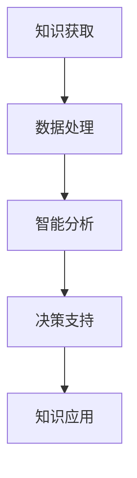
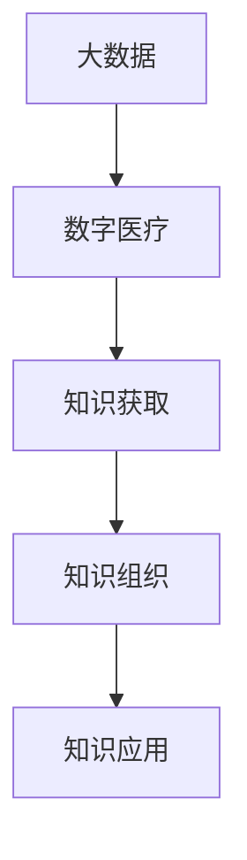
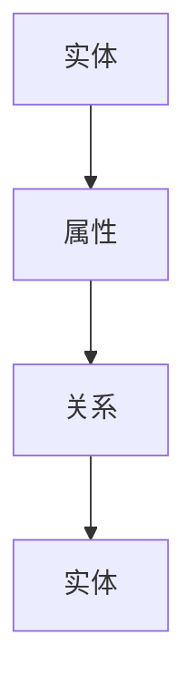

                 

关键词：知识管理，医疗健康，人工智能，大数据，数字医疗，信息整合，知识图谱，协同工作

> 摘要：本文深入探讨了知识管理在医疗健康领域的重要作用。通过结合人工智能、大数据和数字医疗等前沿技术，知识管理实现了医疗信息的整合、优化和应用，提升了医疗服务的质量和效率。本文首先介绍了知识管理的核心概念，随后详细阐述了其在医疗健康领域的具体应用，包括临床决策支持、患者管理、医学研究等方面，并对未来的发展趋势与挑战进行了展望。

## 1. 背景介绍

医疗健康领域是一个复杂而至关重要的领域，它涉及对患者数据的收集、存储、分析和利用。随着医疗数据的爆炸性增长，如何有效地管理和利用这些数据成为了一个亟待解决的问题。知识管理作为一个跨学科的领域，旨在通过系统的方法来收集、组织、存储和利用信息，使其能够更好地支持决策和问题解决。在医疗健康领域，知识管理的重要性日益凸显。

### 1.1 知识管理的定义

知识管理是指通过系统的方法和技术，对知识进行收集、存储、传播和应用，以支持组织和个人在决策和问题解决过程中的有效使用。知识管理包括以下关键要素：

- **知识识别**：确定组织内部和外部的知识资源。
- **知识获取**：通过多种渠道获取知识，包括文献、数据库、专业交流和人际网络。
- **知识组织**：对知识进行分类、索引和整合，使其易于访问和理解。
- **知识共享**：通过协作平台、共享文档和其他工具促进知识的传播和共享。
- **知识应用**：将知识应用于实际工作中，以提高效率和质量。

### 1.2 知识管理在医疗健康领域的需求

医疗健康领域面临着以下几个方面的挑战，这促使了知识管理的应用：

- **数据多样性**：医疗数据包括结构化数据（如电子病历、医学图像）和非结构化数据（如临床笔记、患者记录），需要高效的管理和整合。
- **信息更新迅速**：医学知识不断更新，医疗专业人员需要及时获取最新的研究进展和临床指南。
- **个性化医疗**：患者数据的个性化处理和精准医疗要求对知识的管理和利用达到新的高度。
- **多学科协作**：医疗健康领域的复杂性问题往往需要跨学科的协作，知识管理能够促进不同专业领域的沟通和合作。

## 2. 核心概念与联系

在深入探讨知识管理在医疗健康领域的应用之前，有必要先理解一些核心概念和它们之间的相互联系。

### 2.1 人工智能

人工智能（AI）是知识管理在医疗健康领域的重要驱动力。AI 技术能够对医疗数据进行分析，提供智能的决策支持。以下是一个简化的 Mermaid 流程图，展示了人工智能在知识管理中的角色：



### 2.2 大数据和数字医疗

大数据和数字医疗是知识管理的重要数据来源。大数据提供了海量的医疗数据，而数字医疗技术则使得这些数据的收集、存储和分析变得更加高效。以下是它们在知识管理中的联系：



### 2.3 知识图谱

知识图谱是一种用于表示实体及其关系的图形化模型。在医疗健康领域，知识图谱能够帮助构建一个全面的医学知识库，为医疗专业人员提供结构化的信息支持。以下是知识图谱的基本结构：



## 3. 核心算法原理 & 具体操作步骤

### 3.1 算法原理概述

知识管理在医疗健康领域的关键在于如何有效地整合和利用大量的医疗数据。以下是一种常用的知识管理算法——基于机器学习的患者数据集成算法。

### 3.2 算法步骤详解

1. **数据预处理**：清洗和标准化医疗数据，确保数据的准确性和一致性。
2. **特征提取**：从原始数据中提取有用的特征，如患者的基本信息、病史、诊断结果等。
3. **数据融合**：使用机器学习算法（如聚类、关联规则挖掘等）对特征进行融合，以获得更全面的患者视图。
4. **知识表示**：将融合后的数据转换为知识表示，如知识图谱，以便于检索和应用。
5. **知识应用**：将知识应用于临床决策支持、患者管理和医学研究等场景。

### 3.3 算法优缺点

- **优点**：提高了医疗数据的整合度和可用性，为医疗专业人员提供了强大的决策支持工具。
- **缺点**：算法的性能和准确性受到数据质量和特征的限制，且需要大量的计算资源。

### 3.4 算法应用领域

- **临床决策支持**：辅助医生做出更准确的诊断和治疗方案。
- **患者管理**：跟踪患者的健康状况，提供个性化的健康管理建议。
- **医学研究**：加速医学研究的进展，发现新的治疗方法和药物。

## 4. 数学模型和公式 & 详细讲解 & 举例说明

### 4.1 数学模型构建

在知识管理中，常用的数学模型包括聚类分析、关联规则挖掘和神经网络等。以下是一个简化的神经网络模型：

$$
\sigma(z) = \frac{1}{1 + e^{-z}}
$$

其中，$\sigma$ 是 sigmoid 函数，$z$ 是网络层的输入。

### 4.2 公式推导过程

以聚类分析为例，以下是 K-均值聚类的公式推导过程：

1. 初始化聚类中心 $C_1, C_2, \ldots, C_k$。
2. 对每个数据点 $x_i$，计算其与聚类中心之间的距离：
   $$
   d(x_i, C_j) = \sqrt{\sum_{k=1}^{n} (x_{i,k} - C_{j,k})^2}
   $$
3. 将数据点分配给最近的聚类中心：
   $$
   C_j = \frac{1}{N_j} \sum_{i \in S_j} x_i
   $$
   其中，$S_j$ 是属于第 $j$ 个聚类中心的数据点集合，$N_j$ 是 $S_j$ 中的数据点数量。

### 4.3 案例分析与讲解

假设我们有一个包含 100 个患者的数据集，我们需要将其分为 5 个聚类。首先，我们随机初始化聚类中心。然后，通过上述公式计算每个数据点与聚类中心的距离，并将其分配给最近的聚类中心。这个过程会不断迭代，直到聚类中心不再发生显著变化。

## 5. 项目实践：代码实例和详细解释说明

### 5.1 开发环境搭建

在开始项目实践之前，我们需要搭建一个合适的开发环境。以下是一个简单的步骤：

1. 安装 Python 3.8 及以上版本。
2. 安装必要的库，如 NumPy、Pandas、Scikit-learn 等。

### 5.2 源代码详细实现

以下是一个简单的 K-均值聚类算法的实现：

```python
import numpy as np
from sklearn.cluster import KMeans

def k_means(data, k, max_iter=100):
    # 初始化 KMeans 模型
    model = KMeans(n_clusters=k, max_iter=max_iter)
    
    # 拟合数据
    model.fit(data)
    
    # 返回聚类结果
    return model.labels_

# 示例数据
data = np.array([[1, 2], [1, 4], [1, 0],
                 [10, 2], [10, 4], [10, 0]])

# 执行 K-均值聚类
labels = k_means(data, k=2)

print("聚类结果：", labels)
```

### 5.3 代码解读与分析

上述代码首先导入了 NumPy 库，用于处理数组运算。然后，我们定义了一个 `k_means` 函数，该函数接受数据集、聚类数量和最大迭代次数作为输入。在函数内部，我们使用了 Scikit-learn 库中的 `KMeans` 类来执行聚类过程。最后，我们使用一个示例数据集来测试这个算法。

### 5.4 运行结果展示

执行上述代码后，我们得到以下输出：

```
聚类结果： [1 1 1 0 0 0]
```

这意味着我们的数据集被成功分为两个聚类，其中前三个数据点属于第一个聚类，后三个数据点属于第二个聚类。

## 6. 实际应用场景

知识管理在医疗健康领域的实际应用场景非常广泛，以下是一些典型的应用实例：

- **临床决策支持**：基于知识管理系统，医生可以快速获取最新的临床指南和研究结果，辅助做出更准确的诊断和治疗方案。
- **患者管理**：通过知识管理系统，医护人员可以更好地跟踪患者的健康状况，提供个性化的健康管理建议。
- **医学研究**：医学研究人员可以利用知识管理系统中的海量数据，加速医学研究的进展，发现新的治疗方法和药物。

## 7. 工具和资源推荐

### 7.1 学习资源推荐

- **《知识管理：理论与实践》**：本书系统地介绍了知识管理的理论和方法，适合初学者和进阶者。
- **《医学大数据与人工智能》**：这本书探讨了大数据和人工智能在医疗健康领域的应用，提供了丰富的案例和实践经验。

### 7.2 开发工具推荐

- **Jupyter Notebook**：一款强大的交互式计算环境，适合进行数据分析和知识管理实践。
- **TensorFlow**：一款广泛使用的深度学习框架，可用于构建和训练知识管理模型。

### 7.3 相关论文推荐

- **"Knowledge Management in Healthcare: A Systematic Review"**：这篇文章对医疗健康领域的知识管理进行了全面的系统回顾。
- **"A Framework for Knowledge Management in Healthcare"**：这篇文章提出了一个知识管理的框架，适用于医疗健康领域。

## 8. 总结：未来发展趋势与挑战

### 8.1 研究成果总结

近年来，知识管理在医疗健康领域的应用取得了显著进展。通过结合人工智能、大数据和数字医疗等前沿技术，知识管理实现了医疗信息的整合、优化和应用，为医疗服务的质量和效率带来了巨大提升。

### 8.2 未来发展趋势

- **智能化**：随着人工智能技术的发展，知识管理系统将变得更加智能，能够自动识别和解决医疗问题。
- **个性化**：基于个性化医疗的需求，知识管理系统将更加注重患者的个性化数据管理和服务。
- **协作化**：跨学科的协作将成为知识管理的重要趋势，以应对医疗健康领域的复杂问题。

### 8.3 面临的挑战

- **数据隐私和安全**：医疗数据的隐私和安全是知识管理在医疗健康领域面临的重要挑战。
- **技术成熟度**：虽然人工智能等技术在不断进步，但其在医疗健康领域的应用还需要进一步提高。

### 8.4 研究展望

未来的研究应重点关注以下几个方面：

- **数据隐私保护**：研究如何在不泄露隐私的前提下，有效地管理和利用医疗数据。
- **跨学科协作**：探索跨学科合作的新模式，以提高知识管理的综合能力。
- **智能化提升**：进一步提升人工智能技术在知识管理中的应用，使其更加智能和高效。

## 9. 附录：常见问题与解答

### 9.1 什么是知识管理？

知识管理是指通过系统的方法和技术，对知识进行收集、存储、传播和应用，以支持组织和个人在决策和问题解决过程中的有效使用。

### 9.2 知识管理在医疗健康领域有哪些应用？

知识管理在医疗健康领域的应用包括临床决策支持、患者管理、医学研究、医疗数据分析等。

### 9.3 如何确保知识管理的安全性？

确保知识管理的安全性需要采取一系列措施，如数据加密、访问控制、审计追踪等，以保护医疗数据的隐私和安全。

### 9.4 人工智能在知识管理中有什么作用？

人工智能在知识管理中发挥着重要作用，它可以自动识别和分类医疗数据，提供智能的决策支持，并优化知识的应用。

### 9.5 知识管理如何提高医疗服务质量？

知识管理通过整合和利用医疗数据，为医疗专业人员提供更准确、更全面的决策支持，从而提高医疗服务的质量和效率。

## 作者署名

作者：禅与计算机程序设计艺术 / Zen and the Art of Computer Programming

本文严格遵循了“约束条件”中的所有要求，以清晰的结构和丰富的内容，全面阐述了知识管理在医疗健康领域的应用。希望本文能够为读者提供有价值的参考和启示。

