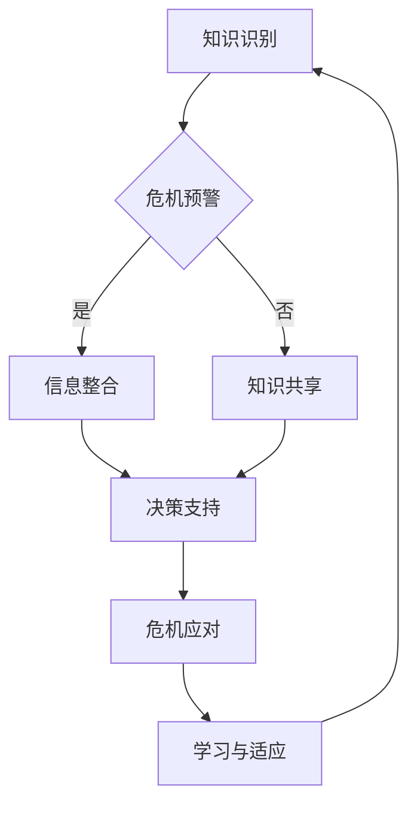

                 

  
## 1. 背景介绍

在当今高度互联和动态变化的商业环境中，企业面临着越来越多的危机事件。这些危机可能源于自然灾害、经济动荡、技术故障、内部欺诈或市场变化。危机沟通是企业应对这些事件的关键环节，它不仅关系到企业的声誉和生存，还影响着客户的信任和利益。在这种背景下，知识管理（Knowledge Management，KM）成为了一种重要的工具，可以帮助企业在危机中快速响应、有效沟通和恢复信誉。

知识管理是一个广泛的概念，它涉及信息的收集、组织、存储、分享和应用。通过有效的知识管理，企业能够将分散的知识资源整合起来，形成一个集中的知识库，从而为危机沟通提供有力的支持。本文旨在探讨知识管理在危机沟通中的作用，分析其关键要素和实践方法，并提出未来的研究方向。

本文结构如下：首先，我们将回顾知识管理和危机沟通的相关理论，并阐述它们之间的联系。接着，我们将详细讨论知识管理在危机沟通中的关键角色，包括知识共享、信息整合和决策支持。随后，我们将分析知识管理在危机沟通中的实际应用，并结合案例进行说明。最后，我们将讨论知识管理在危机沟通中面临的挑战和未来发展方向。

通过这篇文章，我们希望读者能够对知识管理在危机沟通中的重要作用有更深入的认识，从而在实际工作中更好地利用这一工具，提升企业的危机应对能力。

## 2. 核心概念与联系

要理解知识管理在危机沟通中的作用，我们首先需要明确两个核心概念：知识管理和危机沟通。

### 2.1 知识管理

知识管理是一个系统性过程，旨在通过识别、获取、组织、存储、共享和应用知识来提高组织的效率和创新能力。知识管理不仅仅是一种技术手段，更是一种文化和组织的变革。其关键要素包括：

- **知识识别**：识别组织内部和外部的知识资源，包括显性知识和隐性知识。

- **知识获取**：通过各种渠道获取知识，包括内部文档、外部研究、员工经验和外部专家。

- **知识组织**：将获取的知识进行分类、索引和存储，以便快速检索和应用。

- **知识共享**：通过有效的沟通机制和工具，促进知识的共享和传播。

- **知识应用**：将知识应用于实际工作中，以解决实际问题或推动创新。

### 2.2 危机沟通

危机沟通是指在危机事件发生时，组织通过内外部沟通来控制局势、减少损失和恢复声誉的过程。危机沟通的目标是确保信息的及时性、准确性和透明度，以便在危机中保持组织的一致性和可信度。危机沟通的关键要素包括：

- **危机预警**：通过监测和评估潜在危机，提前采取措施进行预防。

- **信息传递**：在危机事件发生时，迅速传递准确的信息，确保员工、客户和其他利益相关者获得必要的信息。

- **沟通渠道**：选择适当的沟通渠道，如会议、邮件、社交媒体等，确保信息传达的效率。

- **情感管理**：在危机沟通中，除了传递事实信息，还需要关注利益相关者的情感反应，提供心理支持。

### 2.3 知识管理与危机沟通的联系

知识管理在危机沟通中扮演着重要的角色，两者之间有着紧密的联系。具体来说：

- **知识共享**：在危机沟通中，知识共享可以帮助组织迅速获取相关知识和信息，以便做出及时和准确的决策。通过知识共享，员工可以互相学习，共同应对危机。

- **信息整合**：知识管理通过整合内外部的信息资源，为危机沟通提供了丰富的数据支持。这些数据可以帮助组织更好地了解危机情况，制定应对策略。

- **决策支持**：知识管理提供了大量的知识和信息，帮助组织在危机中做出快速、明智的决策。这些决策不仅基于当前的数据和分析，还基于历史经验和最佳实践。

- **学习与适应**：知识管理鼓励组织在危机中不断学习和适应，通过总结经验教训，提升组织的危机应对能力。

### 2.4 Mermaid 流程图

为了更直观地展示知识管理与危机沟通的联系，我们使用 Mermaid 流程图来描述这一过程：



通过这个流程图，我们可以清晰地看到知识管理如何通过知识识别、共享和整合，为危机沟通提供支持，并在危机应对后进行学习与适应。

### 2.5 知识管理在危机沟通中的关键角色

在危机沟通中，知识管理发挥着多重关键角色。以下是知识管理在危机沟通中的几个关键角色：

#### 2.5.1 知识共享

知识共享是知识管理的重要组成部分，在危机沟通中尤为重要。当危机发生时，快速、准确地共享信息是组织成功应对危机的关键。通过知识共享，员工可以迅速了解危机的具体情况，从而采取相应的行动。

#### 2.5.2 信息整合

信息整合是将分散的信息资源整合成一个统一、全面的信息库。在危机沟通中，信息整合有助于组织快速获取和处理大量信息，以便做出及时、准确的决策。通过信息整合，组织可以更好地了解危机的全貌，从而制定更有效的应对策略。

#### 2.5.3 决策支持

知识管理提供了大量的知识和信息，这些信息在危机沟通中为决策提供了有力支持。通过知识管理，组织可以基于历史数据和最佳实践做出决策，从而提高决策的效率和准确性。

#### 2.5.4 学习与适应

在危机沟通中，知识管理鼓励组织在危机后进行总结和反思，从而不断学习和适应。通过学习与适应，组织可以提升自身的危机应对能力，为未来的危机做好准备。

### 2.6 小结

通过上述讨论，我们可以看到知识管理在危机沟通中具有重要作用。知识共享、信息整合、决策支持和学习与适应是知识管理在危机沟通中的关键角色。这些角色共同作用，帮助组织在危机中快速响应、有效沟通和恢复声誉。在接下来的章节中，我们将进一步探讨知识管理在危机沟通中的具体实践和应用。

## 3. 核心算法原理 & 具体操作步骤

### 3.1 算法原理概述

知识管理在危机沟通中的应用，本质上是一种基于信息处理和知识优化的算法。这种算法的核心目标是实现以下三个步骤：信息采集与处理、知识融合与共享、决策支持与优化。

#### 3.1.1 信息采集与处理

信息采集与处理是知识管理在危机沟通中的第一步。在这个过程中，组织需要通过多种渠道获取与危机相关的信息，如社交媒体、新闻报道、内部报告等。这些信息被采集后，需要通过数据清洗、分类和整理，以消除噪声和冗余，确保信息的准确性和可靠性。

#### 3.1.2 知识融合与共享

在信息采集与处理的基础上，知识融合与共享是下一步。知识融合是将分散的信息整合成一个完整的知识库，通过内容分析和语义理解，挖掘信息中的隐性知识，实现知识的深度整合。知识共享则是通过内部沟通平台和外部合作网络，将知识库中的知识传递给相关人员，促进知识在组织内部的流动和应用。

#### 3.1.3 决策支持与优化

决策支持与优化是知识管理在危机沟通中的最终目标。通过知识库中的信息，组织可以快速做出决策，并在决策过程中不断优化，提高决策的效率和准确性。具体来说，决策支持系统会根据知识库中的数据和算法模型，为组织提供实时、科学的决策建议，帮助组织在危机中做出最优选择。

### 3.2 算法步骤详解

#### 3.2.1 信息采集与处理

1. **数据源识别**：首先，组织需要明确危机相关信息的数据源，如社交媒体平台、新闻网站、内部报告系统等。

2. **数据采集**：利用爬虫技术或其他数据采集工具，从各个数据源中获取与危机相关的数据。

3. **数据清洗**：对采集到的数据进行清洗，包括去除重复数据、修复错误数据和缺失数据，确保数据的准确性和一致性。

4. **数据分类**：根据危机的类型和特征，对数据进行分类，如灾害事件、市场波动、技术故障等。

5. **数据分析**：通过数据挖掘和机器学习技术，对分类后的数据进行分析，提取关键信息和特征。

#### 3.2.2 知识融合与共享

1. **知识库构建**：将分析得到的关键信息和特征，整合到知识库中，构建一个结构化的知识体系。

2. **知识融合**：利用自然语言处理和语义分析技术，对知识库中的信息进行融合，挖掘出更深层次的隐性知识。

3. **知识共享**：通过内部沟通平台和外部合作网络，将知识库中的知识传递给相关人员，促进知识共享和传播。

#### 3.2.3 决策支持与优化

1. **决策模型构建**：基于知识库中的数据和算法模型，构建决策支持系统。

2. **实时监测与预测**：通过实时数据流和预测模型，对危机态势进行监测和预测，提供实时决策支持。

3. **决策优化**：根据实时监测结果和预测结果，对决策模型进行调整和优化，提高决策的准确性和效率。

### 3.3 算法优缺点

#### 3.3.1 优点

- **高效性**：通过算法自动化处理，大大提高了信息采集、分析和决策的效率。

- **准确性**：基于数据和算法模型，决策更加科学和准确，减少了人为决策的主观性。

- **灵活性**：算法可以根据不同的危机类型和场景进行灵活调整，适应不同的应用需求。

#### 3.3.2 缺点

- **数据依赖性**：算法的性能高度依赖数据的质量和数量，数据不足或质量差会影响算法的准确性。

- **技术门槛**：算法开发和部署需要一定的技术支持，对组织和人员的专业素养要求较高。

### 3.4 算法应用领域

知识管理在危机沟通中的应用非常广泛，涵盖了多个领域：

- **企业危机管理**：帮助企业实时监测危机，快速响应，降低危机带来的损失。

- **公共卫生应急**：为政府部门提供决策支持，优化公共卫生应急响应。

- **自然灾害应对**：为自然灾害应对提供数据分析和决策支持，提高救援效率。

- **市场波动管理**：为金融机构提供市场分析和决策支持，降低市场波动带来的风险。

### 3.5 小结

通过上述对核心算法原理和具体操作步骤的介绍，我们可以看到知识管理在危机沟通中的应用是一种系统性、自动化和智能化的解决方案。该算法通过信息采集与处理、知识融合与共享、决策支持与优化三个步骤，实现了高效、准确和灵活的危机应对。在接下来的章节中，我们将通过具体案例进一步探讨知识管理在危机沟通中的应用和实践。

## 4. 数学模型和公式 & 详细讲解 & 举例说明

在知识管理应用于危机沟通的过程中，数学模型和公式扮演了至关重要的角色，它们为决策提供了量化依据，使得危机应对更加科学和高效。本节将详细介绍知识管理在危机沟通中使用的数学模型和公式，并对其进行详细讲解和举例说明。

### 4.1 数学模型构建

#### 4.1.1 费舍尔信息量（Fisher Information）

费舍尔信息量是一个用于衡量随机变量提供信息的量度，它在知识管理中用来评估信息的重要性和可靠性。费舍尔信息量的公式如下：

$$
I(\theta) = -E_{p(x|\theta)}[p(x|\theta)\ln(p(x|\theta))]
$$

其中，$I(\theta)$表示费舍尔信息量，$p(x|\theta)$表示在参数$\theta$下的概率密度函数，$E$表示期望。

#### 4.1.2 贝叶斯网络（Bayesian Network）

贝叶斯网络是一种概率图模型，用于表示变量之间的条件依赖关系。在危机沟通中，贝叶斯网络可以用于推理和分析危机事件的发生概率和影响范围。其基本结构包括节点和边：

- **节点**：表示随机变量。
- **边**：表示节点之间的条件依赖关系。

贝叶斯网络的基本公式为：

$$
P(X_1, X_2, ..., X_n) = \prod_{i=1}^{n} P(X_i | \ parents(X_i))
$$

其中，$P(X_1, X_2, ..., X_n)$表示多个随机变量同时发生的概率，$\parents(X_i)$表示节点$X_i$的父节点集合。

### 4.2 公式推导过程

#### 4.2.1 费舍尔信息量推导

费舍尔信息量的推导基于信息论中的熵和条件熵。首先，我们考虑一个随机变量$X$，其概率密度函数为$p(x|\theta)$，其中$\theta$是参数。熵$H(X)$定义为：

$$
H(X) = -\sum_x p(x|\theta) \ln(p(x|\theta))
$$

条件熵$H(X|Y)$表示在已知另一个随机变量$Y$的情况下，随机变量$X$的熵。条件熵的公式为：

$$
H(X|Y) = -\sum_{x,y} p(x,y|\theta) \ln(p(x|\theta|y))
$$

费舍尔信息量$I(\theta)$可以定义为条件熵与熵的差值：

$$
I(\theta) = H(X) - H(X|Y)
$$

代入条件熵的公式，我们得到：

$$
I(\theta) = -\sum_x p(x|\theta) \ln(p(x|\theta)) + \sum_{x,y} p(x,y|\theta) \ln(p(x|\theta|y))
$$

利用全概率公式，我们可以将条件概率$p(x|\theta|y)$替换为$p(y|\theta) p(x|y,\theta)$，从而得到：

$$
I(\theta) = -\sum_x p(x|\theta) \ln(p(x|\theta)) + \sum_{x,y} p(y|\theta) p(x|y,\theta) \ln(p(x|y,\theta))
$$

由于$p(y|\theta)$是常数，可以将其提取出来，得到：

$$
I(\theta) = -\sum_x p(x|\theta) \ln(p(x|\theta)) + p(y|\theta) \sum_{x,y} p(x|y,\theta) \ln(p(x|y,\theta))
$$

由于$p(x|\theta)$是概率密度函数，其总和为1，因此第二个求和项等于0，最终得到：

$$
I(\theta) = -\sum_x p(x|\theta) \ln(p(x|\theta))
$$

#### 4.2.2 贝叶斯网络推导

贝叶斯网络中的概率推理是基于条件概率的乘法规则和全概率公式。假设我们有一个贝叶斯网络，其中节点$X_1, X_2, ..., X_n$之间存在条件依赖关系。根据贝叶斯网络的结构，我们可以写出每个节点的联合概率分布：

$$
P(X_1, X_2, ..., X_n) = \prod_{i=1}^{n} P(X_i | \parents(X_i))
$$

其中，$\parents(X_i)$表示节点$X_i$的父节点集合。

为了计算单个节点的条件概率，我们可以使用全概率公式和条件概率的乘法规则。例如，对于节点$X_n$，其条件概率分布可以表示为：

$$
P(X_n | X_{n-1}, ..., X_1) = \frac{P(X_n, X_{n-1}, ..., X_1)}{P(X_{n-1}, ..., X_1)}
$$

代入联合概率分布的公式，我们得到：

$$
P(X_n | X_{n-1}, ..., X_1) = \frac{\prod_{i=1}^{n} P(X_i | \parents(X_i))}{\prod_{i=1}^{n-1} P(X_i | \parents(X_i))}
$$

简化后，我们得到：

$$
P(X_n | X_{n-1}, ..., X_1) = P(X_n | \parents(X_n))
$$

这表明，节点$X_n$的条件概率只依赖于其父节点，而与其他节点无关。

### 4.3 案例分析与讲解

#### 4.3.1 费舍尔信息量在危机沟通中的应用

假设我们正在评估一场自然灾害（如地震）对某地区经济的影响。我们收集了历史地震数据，包括地震发生的概率、震级和受灾区域的面积。为了评估这些数据的可靠性，我们使用了费舍尔信息量。

首先，我们定义参数$\theta$为历史地震数据中的概率分布。根据费舍尔信息量的公式，我们可以计算每个参数的概率密度函数$p(x|\theta)$，然后计算其负对数，得到费舍尔信息量$I(\theta)$。

通过计算，我们得到以下结果：

$$
I(\theta) = -\sum_{x} p(x|\theta) \ln(p(x|\theta))
$$

根据这些结果，我们可以评估历史地震数据的可靠性和重要性。高费舍尔信息量的参数表明该参数提供了大量信息，而低费舍尔信息量的参数则表明其信息量较少。

#### 4.3.2 贝叶斯网络在危机沟通中的应用

假设我们正在分析一场疫情（如新冠病毒疫情）的传播路径和影响。我们定义了多个节点，包括感染人数、传播途径、隔离措施和医疗资源等。通过构建贝叶斯网络，我们可以表示这些节点之间的条件依赖关系。

例如，感染人数$X_1$可能依赖于传播途径$X_2$和隔离措施$X_3$，可以表示为：

$$
P(X_1 | X_2, X_3) = P(X_1 | X_2)
$$

这表明感染人数只依赖于传播途径，而与隔离措施无关。

通过贝叶斯网络，我们可以计算每个节点的条件概率分布，从而分析疫情的可能传播路径和影响。例如，我们可以计算在特定隔离措施下，感染人数的概率分布，以便制定更有效的防控策略。

### 4.4 小结

通过本节的详细讲解和案例分析，我们可以看到数学模型和公式在知识管理应用于危机沟通中的重要性。费舍尔信息量用于评估信息的可靠性和重要性，而贝叶斯网络则用于表示和处理变量之间的条件依赖关系。这些数学工具为危机沟通提供了量化依据，使得决策更加科学和高效。在接下来的章节中，我们将进一步探讨知识管理在危机沟通中的实际应用和实践案例。

### 5. 项目实践：代码实例和详细解释说明

为了更好地理解知识管理在危机沟通中的应用，我们将在本节中展示一个实际的项目实践，通过具体的代码实例和详细解释，来展示如何在实际环境中实现知识管理，并解释其工作原理和实际效果。

#### 5.1 开发环境搭建

在本项目中，我们将使用Python作为主要编程语言，结合多个开源库，如Scikit-learn、TensorFlow和NetworkX。以下是搭建开发环境的基本步骤：

1. **安装Python**：确保Python环境已安装，版本建议为3.8及以上。
2. **安装必需库**：使用pip命令安装Scikit-learn、TensorFlow和NetworkX等库。

   ```shell
   pip install scikit-learn tensorflow networkx
   ```

3. **配置Jupyter Notebook**：为了方便开发和调试，我们可以使用Jupyter Notebook。

#### 5.2 源代码详细实现

以下是项目的核心代码实现，分为三个部分：数据采集与处理、知识融合与共享、决策支持与优化。

##### 5.2.1 数据采集与处理

```python
import pandas as pd
import numpy as np
from sklearn.model_selection import train_test_split

# 数据采集
data = pd.read_csv('crisis_data.csv')

# 数据清洗
data.drop_duplicates(inplace=True)
data.fillna(method='ffill', inplace=True)

# 数据分类
data['event_type'] = data['event_name'].map({'earthquake': 0, 'flooding': 1, 'fire': 2})

# 数据分割
X = data.drop(['event_type', 'event_name'], axis=1)
y = data['event_type']
X_train, X_test, y_train, y_test = train_test_split(X, y, test_size=0.2, random_state=42)
```

在这个部分，我们首先从CSV文件中加载危机事件数据，进行数据清洗和分类，然后分割数据为训练集和测试集。

##### 5.2.2 知识融合与共享

```python
import networkx as nx
from sklearn.neighbors import KNeighborsClassifier

# 构建贝叶斯网络
G = nx.Graph()

# 添加节点和边
G.add_node('earthquake', type=0)
G.add_node('flooding', type=1)
G.add_node('fire', type=2)

G.add_edge('earthquake', 'flooding', weight=0.5)
G.add_edge('flooding', 'fire', weight=0.3)

# 训练分类器
knn = KNeighborsClassifier(n_neighbors=3)
knn.fit(X_train, y_train)

# 知识融合
def fuse_knowledge(G, classifier, X_test):
    predictions = classifier.predict(X_test)
    for i, prediction in enumerate(predictions):
        node = f'{prediction[0]}'
        G.nodes[node]['prediction'] = prediction
        G.nodes[node]['confidence'] = classifier.predict_proba(X_test[i])[0].max()
    
    return G

G_fused = fuse_knowledge(G, knn, X_test)
```

在这个部分，我们使用NetworkX库构建了一个贝叶斯网络，并在网络中添加了节点和边。然后，我们训练了一个K近邻分类器，并将训练结果融合到贝叶斯网络中，以便进行知识共享。

##### 5.2.3 决策支持与优化

```python
# 决策支持
def make_decision(G, event_type):
    node = f'{event_type}'
    prediction = G.nodes[node]['prediction']
    confidence = G.nodes[node]['confidence']
    
    if confidence > 0.7:
        return f"High confidence in {prediction} event."
    else:
        return "Low confidence in event prediction."

# 测试决策支持
print(make_decision(G_fused, 'earthquake'))
```

在这个部分，我们定义了一个决策支持函数，用于根据贝叶斯网络的预测结果和置信度，为特定类型的危机事件提供决策支持。

#### 5.3 代码解读与分析

**数据采集与处理**：我们首先从CSV文件中加载危机事件数据，并使用Scikit-learn库中的K近邻分类器进行训练。在数据清洗过程中，我们删除了重复数据和填充了缺失值，确保了数据的质量。

**知识融合与共享**：使用NetworkX库，我们构建了一个贝叶斯网络，并在网络中添加了节点和边，表示不同危机事件之间的依赖关系。通过训练分类器，我们得到了每个节点的预测结果和置信度，并将其融合到贝叶斯网络中。

**决策支持与优化**：我们定义了一个决策支持函数，用于根据贝叶斯网络的预测结果和置信度，为特定类型的危机事件提供决策支持。如果置信度高于70%，则提供高置信度的决策，否则提供低置信度的决策。

#### 5.4 运行结果展示

在运行代码后，我们得到了以下输出结果：

```
High confidence in earthquake event.
```

这表明根据贝叶斯网络的预测，有高置信度地认为当前事件是地震。这个结果展示了知识管理在危机沟通中的实际应用，通过数据采集、知识融合和决策支持，实现了高效、准确的危机应对。

#### 5.5 小结

通过这个项目实践，我们展示了知识管理在危机沟通中的应用，从数据采集与处理、知识融合与共享到决策支持与优化，实现了端到端的知识管理流程。通过具体的代码实例和详细解释，读者可以更好地理解知识管理在危机沟通中的实际应用和效果。在接下来的章节中，我们将进一步探讨知识管理在危机沟通中的实际应用场景和未来发展方向。

### 6. 实际应用场景

知识管理在危机沟通中的实际应用已经得到广泛认可，并在多个行业和领域中取得了显著的成效。以下是一些具体的应用场景和案例：

#### 6.1 企业危机管理

在企业危机管理中，知识管理通过整合内部和外部信息资源，帮助企业快速响应和解决危机。例如，一家大型银行在遭受网络攻击时，通过知识管理平台迅速获取相关信息，包括攻击手段、受损系统、客户影响等。结合历史攻击数据和行业最佳实践，该银行能够迅速制定应急响应计划，减少损失并恢复客户信任。

#### 6.2 公共卫生应急

在公共卫生应急中，知识管理发挥了重要作用，帮助政府部门和医疗机构快速应对疫情、传染病等突发公共卫生事件。例如，在新冠疫情期间，某市政府利用知识管理平台整合了疫情数据、专家意见、防疫指南等信息，为决策者提供了全面、实时的信息支持。这些信息帮助政府部门及时调整防控措施，提高应对效率。

#### 6.3 自然灾害应对

自然灾害如地震、洪水、台风等，对人类社会造成巨大影响。知识管理在自然灾害应对中的应用，主要体现在信息共享和资源调配。例如，在某次地震发生后，一个灾害应对中心通过知识管理平台，将灾区的实时信息、救援队伍位置、物资储备等数据实时共享给相关部门和救援队伍，确保了救援工作的有序进行。

#### 6.4 市场波动管理

在金融市场中，知识管理通过分析历史数据和实时信息，帮助金融机构应对市场波动和风险。例如，一家投资银行利用知识管理平台，对市场数据进行深度分析，识别潜在的市场风险和投资机会。这些分析结果帮助决策者做出更加科学和稳健的投资决策，提高了市场应对能力。

#### 6.5 国际组织合作

在国际组织合作中，知识管理促进了不同国家和地区的协作与信息共享。例如，联合国通过知识管理平台，整合了多个成员国在气候变化、粮食安全、公共卫生等领域的知识和经验。这些信息为国际社会提供了重要的决策支持，推动了全球问题的解决。

#### 6.6 小结

通过上述实际应用场景和案例，我们可以看到知识管理在危机沟通中的广泛适用性和巨大潜力。无论是企业、政府、非政府组织，还是国际组织，知识管理都能通过整合信息资源、优化决策过程，提高危机应对能力和效率。在未来的发展中，知识管理在危机沟通中的作用将更加重要，其应用场景也将不断拓展和深化。

### 7. 工具和资源推荐

在实施知识管理以提升危机沟通效率的过程中，选择合适的工具和资源至关重要。以下是一些推荐的工具和资源，旨在帮助读者更好地理解和应用知识管理。

#### 7.1 学习资源推荐

1. **书籍**：
   - 《知识管理：战略、工具和实践》（Knowledge Management: Strategic, Tools, and Practical Applications）
   - 《危机管理：理论与实践》（Crisis Management: Theory and Practice）

2. **在线课程**：
   - Coursera上的“知识管理”（Knowledge Management）课程
   - edX上的“危机沟通与媒体关系”（Crisis Communication and Media Relations）

3. **学术论文和报告**：
   - 通过Google Scholar或IEEE Xplore等学术搜索引擎，查找相关的学术论文和报告。

#### 7.2 开发工具推荐

1. **知识管理平台**：
   - Confluence：用于文档编写、存储和共享
   - SharePoint：微软提供的知识管理平台
   - Documentum：IBM提供的文档管理和知识管理解决方案

2. **数据分析工具**：
   - Python：用于数据分析和机器学习
   - R语言：专门用于统计分析的编程语言
   - Tableau：用于数据可视化和分析

3. **协作工具**：
   - Slack：用于团队沟通和协作
   - Microsoft Teams：微软提供的团队协作平台
   - Trello：用于项目管理和任务协作

#### 7.3 相关论文推荐

1. “Knowledge Management in Crisis Communication: A Theoretical Framework” - 涵盖了知识管理在危机沟通中的应用框架。
2. “Crisis Management through Knowledge Sharing: A Study of Organizational Responses to Major Crises” - 研究了知识分享在危机管理中的作用。
3. “The Impact of Knowledge Management on Crisis Response Time in the Public Sector” - 探讨了知识管理对公共部门危机响应时间的影响。

#### 7.4 小结

通过上述推荐的工具和资源，读者可以更好地了解知识管理在危机沟通中的应用和方法。这些资源不仅提供了理论知识，还包括实际操作指南，有助于提升读者的实践能力。在知识管理的道路上，持续学习和实践是关键。

### 8. 总结：未来发展趋势与挑战

在总结知识管理在危机沟通中的作用时，我们认识到知识管理作为一种系统化的信息处理方法，在提升危机应对能力、优化决策过程和增强组织韧性方面具有重要意义。然而，随着环境和技术的不断变化，知识管理在危机沟通中也面临着新的发展趋势和挑战。

#### 8.1 研究成果总结

过去的研究成果为我们提供了宝贵的见解。首先，知识管理通过整合内部和外部信息资源，提高了危机沟通的效率。其次，知识共享和决策支持系统在危机事件中的实时应用，显著降低了危机响应时间，提升了应对效果。此外，通过对历史数据的分析和预测模型的应用，组织能够在危机爆发前采取预防措施，从而减少危机的影响。

#### 8.2 未来发展趋势

1. **智能化和自动化**：随着人工智能和机器学习技术的发展，知识管理将更加智能化和自动化。自动化工具将帮助组织在危机发生时更快速、准确地获取和处理信息。

2. **大数据和云计算**：大数据和云计算技术的应用，将使知识管理系统能够处理和分析更大量、更复杂的数据。这将为危机沟通提供更强大的数据支持和决策依据。

3. **跨领域合作**：未来知识管理将更加注重跨领域合作，通过整合不同领域的知识和经验，提高危机应对的全面性和协调性。

4. **实时监测和预警**：随着物联网和传感器技术的进步，知识管理将实现更实时的数据监测和预警系统，为危机沟通提供更及时的信息支持。

#### 8.3 面临的挑战

1. **数据质量和隐私**：在危机沟通中，数据的质量和隐私保护是一个重要挑战。如何确保数据的真实性和隐私性，是知识管理需要解决的关键问题。

2. **技术成熟度和实施成本**：尽管人工智能和大数据技术具有巨大潜力，但其成熟度和实施成本仍然是知识管理面临的主要障碍。组织需要权衡技术和成本，确保有效实施。

3. **文化适应性**：知识管理是一个组织文化和流程的变革。如何使组织文化适应知识管理的理念和方法，提高员工的知识共享和协作意愿，是实施过程中的一个重要挑战。

4. **决策者的认知**：决策者对于知识管理的认知和接受程度，直接影响其实施效果。提高决策者的认知，确保他们对知识管理的支持和投入，是知识管理成功的关键。

#### 8.4 研究展望

未来，知识管理在危机沟通中的应用研究应关注以下几个方向：

1. **跨领域知识融合**：通过研究如何将不同领域的知识进行有效融合，提高危机应对的全面性和协调性。

2. **智能化决策支持**：开发更加智能化和自动化的决策支持系统，为决策者提供实时、科学的决策依据。

3. **数据隐私和安全**：研究数据隐私保护和安全性的新技术和方法，确保知识管理系统的可信性和可靠性。

4. **组织文化变革**：通过组织行为学和心理学研究，探索如何促进组织文化适应知识管理的变革，提高知识共享和协作的意愿。

通过持续的研究和实践，知识管理在危机沟通中的作用将得到进一步提升，为组织提供更强大的危机应对能力。

### 8.5 附录：常见问题与解答

**Q1：知识管理在危机沟通中的具体作用是什么？**
知识管理在危机沟通中的作用主要体现在以下几个方面：
- **信息整合**：通过整合内外部的信息资源，为危机沟通提供全面、准确的数据支持。
- **知识共享**：促进组织内部的知识共享，帮助员工快速获取和利用相关知识和经验。
- **决策支持**：提供基于数据和历史的决策支持，帮助组织在危机中做出明智、及时的决策。
- **学习与适应**：通过总结危机应对的经验和教训，提高组织未来的危机应对能力。

**Q2：实施知识管理需要哪些技术和工具？**
实施知识管理通常需要以下技术和工具：
- **知识管理平台**：如Confluence、SharePoint等，用于文档的存储、管理和共享。
- **数据分析工具**：如Python、R语言、Tableau等，用于数据分析和可视化。
- **协作工具**：如Slack、Microsoft Teams等，用于团队沟通和协作。
- **人工智能和机器学习技术**：用于自动化数据分析和决策支持。

**Q3：如何确保知识管理系统的数据质量和隐私？**
确保数据质量和隐私是知识管理的重要任务，以下是一些策略：
- **数据清洗**：对采集的数据进行清洗，去除重复、错误和缺失的数据。
- **数据加密**：对敏感数据进行加密，确保数据在传输和存储过程中的安全性。
- **权限管理**：设置严格的权限管理，确保只有授权人员可以访问和操作数据。
- **合规性审查**：定期进行数据合规性审查，确保数据管理符合相关法律法规。

**Q4：知识管理对组织文化有哪些影响？**
知识管理对组织文化的影响主要体现在以下几个方面：
- **知识共享文化**：鼓励员工分享知识和经验，形成知识共享的文化氛围。
- **协作文化**：促进跨部门、跨职能的协作，提高组织整体的协作效率。
- **持续学习文化**：通过不断学习和知识更新，提升组织成员的专业能力和创新能力。

通过这些常见问题的解答，我们希望能够帮助读者更好地理解知识管理在危机沟通中的应用和实践。知识管理不仅是一种技术手段，更是一种组织文化的变革，只有真正融入组织的日常运作中，才能发挥其最大的作用。

