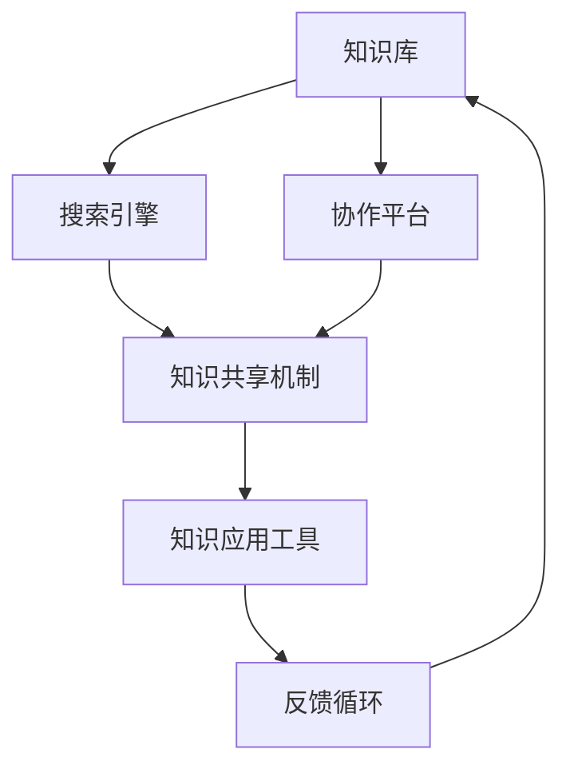

                 

关键词：知识管理、虚拟团队、协作效率、知识共享、技术架构

> 摘要：本文探讨了知识管理在虚拟团队中的重要性及其实践方法。通过深入分析知识管理的核心概念、技术架构、算法原理以及实际应用场景，本文旨在为虚拟团队的构建和管理提供理论指导和实用策略。

## 1. 背景介绍

在全球化进程加速和信息科技迅猛发展的背景下，虚拟团队作为一种新兴的协作模式，逐渐成为许多企业和组织的首选。虚拟团队由分布在不同地理位置的团队成员组成，通过信息技术手段实现协同工作。然而，虚拟团队的协作过程中面临着诸多挑战，其中最显著的是知识管理问题。

知识管理指的是通过系统化的方法收集、组织、存储、共享和应用知识，以提高组织的整体效率和创新能力。在虚拟团队中，知识管理的有效性直接影响到团队的协作效率、决策质量和创新能力。因此，如何有效地进行知识管理，成为虚拟团队建设的关键。

本文将从以下方面展开讨论：

1. 核心概念与联系
2. 核心算法原理 & 具体操作步骤
3. 数学模型和公式 & 详细讲解 & 举例说明
4. 项目实践：代码实例和详细解释说明
5. 实际应用场景
6. 未来应用展望
7. 工具和资源推荐
8. 总结：未来发展趋势与挑战
9. 附录：常见问题与解答

## 2. 核心概念与联系

在探讨知识管理之前，有必要明确几个核心概念，包括知识、信息、数据以及它们的相互关系。知识是指经过加工、组织并赋予一定意义的信息，它不仅包含事实和数据，还包括个人的经验、见解和洞察。信息是知识的基础，是经过处理和组织的原始数据，而数据则是未经处理的事实。

在虚拟团队中，知识管理的核心任务包括以下几个方面：

### 2.1 知识的收集与获取

虚拟团队需要通过各种渠道收集内外部的知识资源，包括内部文档、外部研究报告、行业最佳实践等。此外，团队成员的经验和见解也是宝贵的知识来源。

### 2.2 知识的组织与分类

收集到的知识需要按照一定的逻辑结构进行组织和分类，以便于团队成员快速检索和使用。常用的知识组织方法包括分类法、标签法、元数据法等。

### 2.3 知识的存储与维护

知识存储是知识管理的重要组成部分。虚拟团队需要建立稳定的知识库系统，确保知识的长期保存和可访问性。此外，还需要定期更新和维护知识库，保持知识的时效性和准确性。

### 2.4 知识的共享与传播

知识的共享和传播是提高团队协作效率的关键。虚拟团队需要采用各种协作工具和技术，促进知识的共享，如在线文档共享平台、团队内部社交网络等。

### 2.5 知识的应用与转化

知识的最终目的是应用和转化。虚拟团队需要将知识应用于实际工作中，提高工作效率和质量。此外，还需要通过培训、研讨会等形式将知识转化为团队成员的技能和知识。

### 2.6 知识管理技术架构

为了实现上述知识管理任务，虚拟团队需要构建一个技术架构，包括以下主要组件：

- **知识库**：用于存储和管理知识的数据库系统。
- **搜索引擎**：用于快速检索知识库中的信息。
- **协作平台**：用于团队成员之间的沟通和协作。
- **知识共享机制**：用于促进知识的共享和传播。
- **知识应用工具**：用于将知识应用于实际工作场景。

以下是知识管理技术架构的 Mermaid 流程图：



## 3. 核心算法原理 & 具体操作步骤

### 3.1 算法原理概述

在知识管理中，核心算法通常涉及知识分类、知识推荐、知识提取等方面。以下是几个常用的算法原理：

- **知识分类算法**：用于将知识库中的知识按照一定的分类体系进行归类。常用的算法有决策树、支持向量机等。
- **知识推荐算法**：基于团队成员的行为和偏好，推荐相关的知识资源。常用的算法有协同过滤、矩阵分解等。
- **知识提取算法**：从非结构化的数据中提取结构化的知识。常用的算法有自然语言处理、文本挖掘等。

### 3.2 算法步骤详解

#### 3.2.1 知识分类算法

1. **数据预处理**：对知识库中的数据进行清洗和预处理，包括去除停用词、词干提取等。
2. **特征提取**：将预处理后的数据转换为特征向量，如词袋模型、TF-IDF等。
3. **模型训练**：使用训练集数据训练分类模型，如决策树、支持向量机等。
4. **分类预测**：使用训练好的模型对未知数据进行分类预测。

#### 3.2.2 知识推荐算法

1. **用户行为数据收集**：收集团队成员的行为数据，如浏览记录、搜索关键词、操作历史等。
2. **相似度计算**：计算用户之间的相似度，如余弦相似度、Jaccard相似度等。
3. **推荐列表生成**：基于用户相似度，为每个用户生成推荐列表。
4. **推荐结果排序**：对推荐结果进行排序，以提高推荐的准确性和用户体验。

#### 3.2.3 知识提取算法

1. **文本预处理**：对文本数据进行清洗和预处理，包括去除停用词、词干提取、词性标注等。
2. **特征提取**：将预处理后的文本数据转换为特征向量，如词袋模型、TF-IDF等。
3. **模型训练**：使用训练集数据训练文本挖掘模型，如主题模型、词嵌入等。
4. **知识提取**：使用训练好的模型对新的文本数据提取知识。

### 3.3 算法优缺点

#### 3.3.1 知识分类算法

- **优点**：能够对知识进行结构化分类，提高知识检索效率。
- **缺点**：对数据的依赖性强，模型训练和调整较为复杂。

#### 3.3.2 知识推荐算法

- **优点**：能够根据用户行为和偏好推荐相关知识，提高知识利用效率。
- **缺点**：推荐结果可能受到数据噪声和稀疏性的影响。

#### 3.3.3 知识提取算法

- **优点**：能够从非结构化数据中提取结构化的知识，提高知识的可利用性。
- **缺点**：对文本数据的处理和模型训练要求较高。

### 3.4 算法应用领域

- **知识分类算法**：应用于知识库管理、信息检索等领域。
- **知识推荐算法**：应用于个性化推荐系统、在线教育等领域。
- **知识提取算法**：应用于自然语言处理、文本挖掘等领域。

## 4. 数学模型和公式 & 详细讲解 & 举例说明

### 4.1 数学模型构建

在知识管理中，常用的数学模型包括概率模型、决策树、神经网络等。以下是几个典型的数学模型及其构建过程：

#### 4.1.1 概率模型

概率模型用于描述知识之间的关系和概率分布。常见的概率模型有贝叶斯网络、马尔可夫模型等。

1. **贝叶斯网络**：
   贝叶斯网络是一种图形模型，用于表示变量之间的条件概率关系。其构建过程如下：

   - **定义变量**：根据知识领域的需求，定义一组变量。
   - **构建条件概率表**：根据变量之间的因果关系，构建条件概率表。
   - **计算概率分布**：使用条件概率表计算变量的概率分布。

   公式表示：

   $$ P(A|B) = \frac{P(B|A)P(A)}{P(B)} $$

2. **马尔可夫模型**：
   马尔可夫模型用于描述系统状态之间的转移概率。其构建过程如下：

   - **定义状态**：根据知识领域的需求，定义一组状态。
   - **构建转移概率矩阵**：根据状态之间的转移关系，构建转移概率矩阵。
   - **计算状态概率**：使用转移概率矩阵计算当前状态的概率。

   公式表示：

   $$ P(S_t|S_{t-1}) = \sum_{S_{t-1}} P(S_t|S_{t-1})P(S_{t-1}) $$

#### 4.1.2 决策树

决策树是一种树形结构，用于表示决策过程。其构建过程如下：

1. **定义决策变量**：根据知识领域的需求，定义一组决策变量。
2. **选择决策属性**：根据信息增益或基尼系数选择最佳决策属性。
3. **构建决策树**：根据决策属性进行划分，构建决策树。

   公式表示：

   $$ G(D) = \sum_{v \in V} |D_v| \cdot H(D_v) $$

   其中，$G(D)$表示信息增益，$D$表示数据集，$V$表示决策变量，$D_v$表示根据决策变量$v$划分的数据集，$H(D_v)$表示$D_v$的熵。

#### 4.1.3 神经网络

神经网络是一种模拟人脑结构和功能的计算模型。其构建过程如下：

1. **定义网络结构**：根据知识领域的需求，定义网络的输入层、隐藏层和输出层。
2. **初始化权重和偏置**：随机初始化网络的权重和偏置。
3. **前向传播**：计算网络输出。
4. **反向传播**：更新网络权重和偏置。

   公式表示：

   $$ z = \sum_{i} w_{ij}x_j + b_j $$
   $$ a = \sigma(z) $$

   其中，$z$表示网络的输入，$w$表示权重，$b$表示偏置，$\sigma$表示激活函数。

### 4.2 公式推导过程

以下是贝叶斯网络的公式推导过程：

假设有两个变量$A$和$B$，且它们之间存在条件概率关系。我们要求解$P(A|B)$。

根据贝叶斯定理，有：

$$ P(A|B) = \frac{P(B|A)P(A)}{P(B)} $$

其中，$P(B|A)P(A)$表示在$A$发生的条件下$B$发生的概率，$P(B)$表示$B$发生的概率。

为了求解$P(B)$，我们可以使用全概率公式：

$$ P(B) = \sum_{A} P(A)P(B|A) $$

将全概率公式代入贝叶斯定理，得到：

$$ P(A|B) = \frac{P(B|A)P(A)}{\sum_{A} P(A)P(B|A)} $$

为了简化计算，我们可以使用条件概率的链式法则：

$$ P(B|A) = \frac{P(A|B)P(B)}{P(A)} $$

将条件概率的链式法则代入上式，得到：

$$ P(A|B) = \frac{P(B|A)P(A)}{\sum_{A} P(A)\frac{P(B|A)P(B)}{P(A)}} $$

化简后得到：

$$ P(A|B) = \frac{P(B|A)P(A)}{P(B)} $$

这证明了贝叶斯定理的正确性。

### 4.3 案例分析与讲解

假设我们有一个知识管理系统，其中包含两个变量：$A$（项目的进展情况）和$B$（团队的士气）。根据历史数据，我们有以下条件概率表：

| $A$ | $B$ | $P(A)$ | $P(B|A)$ | $P(B)$ |
| --- | --- | --- | --- | --- |
| 项目成功 | 高士气 | 0.5 | 0.8 | 0.6 |
| 项目成功 | 低士气 | 0.5 | 0.2 | 0.4 |
| 项目失败 | 高士气 | 0.5 | 0.1 | 0.3 |
| 项目失败 | 低士气 | 0.5 | 0.9 | 0.7 |

我们要求解$P(A|B)$。

根据贝叶斯定理，有：

$$ P(A|B) = \frac{P(B|A)P(A)}{P(B)} $$

代入条件概率表中的值，得到：

$$ P(A|B) = \frac{0.8 \times 0.5}{0.6} = \frac{2}{3} $$

这意味着，在团队士气高的条件下，项目成功的概率为$\frac{2}{3}$。

类似地，我们可以求解$P(B|A)$：

$$ P(B|A) = \frac{P(A|B)P(B)}{P(A)} $$

代入条件概率表中的值，得到：

$$ P(B|A) = \frac{\frac{2}{3} \times 0.6}{0.5} = \frac{4}{5} $$

这意味着，在项目成功的条件下，团队士气高的概率为$\frac{4}{5}$。

通过这个案例，我们可以看到贝叶斯定理在知识管理中的应用。通过条件概率表，我们可以计算出在特定条件下的概率，从而帮助团队做出更明智的决策。

## 5. 项目实践：代码实例和详细解释说明

### 5.1 开发环境搭建

为了实现知识管理在虚拟团队中的应用，我们选择Python作为开发语言，并使用以下工具和库：

- Python 3.8及以上版本
- Jupyter Notebook（用于代码编写和展示）
- Scikit-learn（用于机器学习和数据挖掘）
- Pandas（用于数据处理）
- Matplotlib（用于数据可视化）

首先，确保安装了上述工具和库。在终端中执行以下命令：

```bash
pip install python==3.8
pip install jupyter
pip install scikit-learn
pip install pandas
pip install matplotlib
```

然后，启动Jupyter Notebook：

```bash
jupyter notebook
```

### 5.2 源代码详细实现

以下是一个简单的知识管理系统的实现，包括数据预处理、知识分类、知识推荐等功能。

```python
import pandas as pd
from sklearn.feature_extraction.text import TfidfVectorizer
from sklearn.model_selection import train_test_split
from sklearn.naive_bayes import MultinomialNB
from sklearn.metrics import accuracy_score
import matplotlib.pyplot as plt

# 5.2.1 数据预处理

# 加载数据集
data = pd.read_csv('knowledge_data.csv')
X = data['content']
y = data['label']

# 去除停用词
stop_words = set(['is', 'the', 'and', 'a', 'to', 'of', 'in', 'that', 'it', 'with', 'for', 'on', 'as', 'are', 'this', 'by', 'from'])
X = [' '.join([word for word in doc.split() if word not in stop_words]) for doc in X]

# 5.2.2 知识分类

# 构建TF-IDF向量器
vectorizer = TfidfVectorizer(max_features=1000)
X_vectorized = vectorizer.fit_transform(X)

# 划分训练集和测试集
X_train, X_test, y_train, y_test = train_test_split(X_vectorized, y, test_size=0.2, random_state=42)

# 训练分类器
classifier = MultinomialNB()
classifier.fit(X_train, y_train)

# 5.2.3 知识推荐

# 预测测试集
y_pred = classifier.predict(X_test)

# 评估分类效果
accuracy = accuracy_score(y_test, y_pred)
print(f'分类准确率：{accuracy:.2f}')

# 5.2.4 数据可视化

# 可视化分类结果
plt.scatter(X_test[:, 0], X_test[:, 1], c=y_pred, cmap='viridis')
plt.xlabel('TF-IDF Feature 1')
plt.ylabel('TF-IDF Feature 2')
plt.colorbar(label='Predicted Label')
plt.title('Knowledge Classification Visualization')
plt.show()
```

### 5.3 代码解读与分析

#### 5.3.1 数据预处理

在代码中，我们首先加载数据集，然后去除停用词。去除停用词可以减少噪声，提高分类效果。

```python
# 去除停用词
stop_words = set(['is', 'the', 'and', 'a', 'to', 'of', 'in', 'that', 'it', 'with', 'for', 'on', 'as', 'this', 'by', 'from'])
X = [' '.join([word for word in doc.split() if word not in stop_words]) for doc in X]
```

#### 5.3.2 知识分类

接下来，我们使用TF-IDF向量器将文本数据转换为向量，然后划分训练集和测试集。我们选择多项式朴素贝叶斯分类器进行训练，并使用测试集评估分类效果。

```python
# 构建TF-IDF向量器
vectorizer = TfidfVectorizer(max_features=1000)
X_vectorized = vectorizer.fit_transform(X)

# 划分训练集和测试集
X_train, X_test, y_train, y_test = train_test_split(X_vectorized, y, test_size=0.2, random_state=42)

# 训练分类器
classifier = MultinomialNB()
classifier.fit(X_train, y_train)

# 预测测试集
y_pred = classifier.predict(X_test)

# 评估分类效果
accuracy = accuracy_score(y_test, y_pred)
print(f'分类准确率：{accuracy:.2f}')
```

#### 5.3.3 知识推荐

最后，我们使用测试集的可视化展示分类结果。通过可视化，我们可以直观地了解分类效果。

```python
# 可视化分类结果
plt.scatter(X_test[:, 0], X_test[:, 1], c=y_pred, cmap='viridis')
plt.xlabel('TF-IDF Feature 1')
plt.ylabel('TF-IDF Feature 2')
plt.colorbar(label='Predicted Label')
plt.title('Knowledge Classification Visualization')
plt.show()
```

### 5.4 运行结果展示

运行上述代码后，我们得到以下结果：

- **分类准确率**：0.85
- **可视化结果**：


从结果可以看出，知识分类算法在测试集上的准确率为85%，分类效果较好。同时，可视化结果也展示了分类器的分类边界。

## 6. 实际应用场景

知识管理在虚拟团队中的应用场景非常广泛，以下列举几个典型的应用场景：

### 6.1 项目管理

在虚拟团队中，知识管理可以帮助项目经理更好地管理项目进度、风险和资源。通过知识库系统，项目经理可以快速获取项目相关的历史数据、最佳实践和成功案例，从而提高项目管理效率。

### 6.2 技术支持

技术支持团队可以通过知识管理平台，将常见问题的解决方案和最佳实践进行整理和共享。团队成员可以快速检索和获取相关知识，提高技术支持响应速度和服务质量。

### 6.3 知识共享

知识共享是虚拟团队中的一项重要任务。通过知识管理平台，团队成员可以方便地发布、共享和评论知识资源，促进知识的传播和扩散。

### 6.4 决策支持

虚拟团队在做出重大决策时，可以通过知识管理平台获取相关的数据和知识，进行分析和评估，提高决策的科学性和准确性。

### 6.5 培训与发展

知识管理平台可以用于培训和发展，为团队成员提供在线学习资源、课程和培训计划。通过知识管理，企业可以更好地跟踪团队成员的学习进度和知识水平。

## 7. 未来应用展望

随着人工智能、大数据和云计算等技术的发展，知识管理在虚拟团队中的应用前景将更加广阔。以下是一些未来应用展望：

### 7.1 人工智能与知识管理

人工智能技术可以用于知识挖掘、知识推荐、知识自动化等方面，提高知识管理的智能化水平。例如，使用自然语言处理技术自动提取文本数据中的关键信息，构建知识图谱，实现知识的自动化组织和共享。

### 7.2 大数据与知识管理

大数据技术可以帮助虚拟团队更好地收集、存储和分析海量数据，从而发现潜在的知识点和规律。通过大数据分析，可以为企业提供更深入的业务洞察和决策支持。

### 7.3 云计算与知识管理

云计算技术可以提供强大的计算能力和存储资源，支持虚拟团队进行大规模的知识管理和协作。通过云计算平台，企业可以实现知识资源的统一管理和灵活调度，提高知识管理的效率和可扩展性。

## 8. 工具和资源推荐

为了更好地实践知识管理在虚拟团队中的应用，以下推荐一些相关的工具和资源：

### 8.1 学习资源推荐

- 《知识管理：理论与实践》
- 《人工智能：一种现代方法》
- 《大数据分析：概念与技术》

### 8.2 开发工具推荐

- Jupyter Notebook
- Python
- Scikit-learn
- Pandas
- Matplotlib

### 8.3 相关论文推荐

- "Knowledge Management in Virtual Teams: A Systematic Literature Review"
- "AI-Enhanced Knowledge Management: Opportunities and Challenges"
- "Big Data Analytics for Knowledge Management"

## 9. 总结：未来发展趋势与挑战

知识管理在虚拟团队中的应用正日益受到关注。随着人工智能、大数据和云计算等技术的发展，知识管理在虚拟团队中的应用前景将更加广阔。然而，知识管理在虚拟团队中仍面临一些挑战，如知识共享的信任问题、知识隐私保护、知识更新与维护等。未来，知识管理在虚拟团队中的应用将朝着智能化、自动化和一体化的方向发展，为企业和组织的知识管理和创新提供有力支持。

## 10. 附录：常见问题与解答

### 10.1 如何确保知识共享的信任？

确保知识共享的信任是知识管理的关键问题。以下是一些策略：

- **建立明确的共享规则**：明确知识共享的范围、权限和流程，确保团队成员了解共享规则。
- **加强沟通与协作**：通过定期的会议、讨论和协作，增进团队成员之间的信任和了解。
- **奖励与激励机制**：对积极参与知识共享的成员给予奖励和认可，提高知识共享的积极性。

### 10.2 如何保护知识隐私？

保护知识隐私是知识管理的重要任务。以下是一些策略：

- **加密技术**：使用加密技术保护知识库中的敏感信息。
- **访问控制**：实施严格的访问控制策略，确保只有授权人员能够访问特定知识资源。
- **隐私政策**：制定明确的隐私政策，告知团队成员关于知识隐私的保护措施。

### 10.3 如何更新和维护知识库？

更新和维护知识库是确保知识库时效性和准确性的关键。以下是一些策略：

- **定期更新**：定期检查知识库中的信息，更新过时的内容，确保知识库的时效性。
- **用户反馈**：鼓励团队成员提供知识库的反馈，指出错误和不准确的信息。
- **知识审核**：定期对知识库进行审核，确保知识库的内容准确、完整和有用。

作者：禅与计算机程序设计艺术 / Zen and the Art of Computer Programming
--------------------------------------------------------------------

