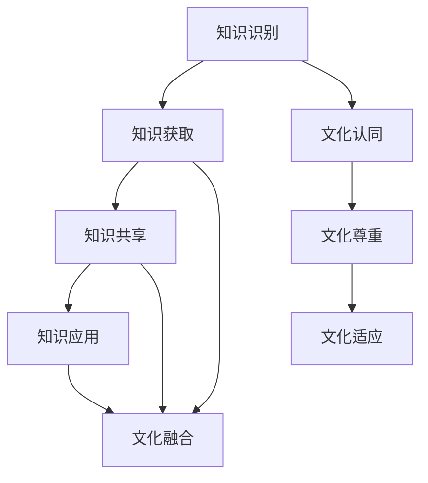

                 

关键词：知识管理、跨国公司、文化融合、信息共享、团队协作

>摘要：本文旨在探讨知识管理在跨国公司文化融合中的重要作用。随着全球化的深入，跨国公司在不同文化背景下如何实现高效运作成为了一个关键问题。知识管理作为一种提升组织效能的方法，通过优化信息流程、促进知识共享和团队协作，有助于跨国公司克服文化差异，实现文化融合。本文将从背景介绍、核心概念与联系、核心算法原理与具体操作步骤、数学模型与公式讲解、项目实践、实际应用场景、未来应用展望、工具和资源推荐以及总结和展望等方面展开讨论。

## 1. 背景介绍

全球化趋势的加速使得跨国公司成为现代商业环境中的主流形态。跨国公司通过在不同国家设立分支机构，实现了资源的全球配置和市场的多元化。然而，跨国公司在运营过程中不可避免地面临文化差异的挑战。不同国家的员工在价值观、沟通方式、工作习惯等方面存在显著差异，这些差异可能会影响团队的协作效率，甚至导致文化冲突。为了应对这些挑战，跨国公司需要寻找有效的方法来促进文化融合，从而实现全球范围内的协同运作。

知识管理作为现代企业管理的重要工具，通过优化信息流程、促进知识共享和团队协作，有助于跨国公司克服文化差异，实现文化融合。本文将从知识管理的核心概念、算法原理、数学模型以及实际应用等方面，探讨知识管理在跨国公司文化融合中的作用。

## 2. 核心概念与联系

### 2.1 知识管理

知识管理（Knowledge Management，KM）是一种通过系统化方法来识别、获取、共享和应用知识的过程。知识管理旨在提高组织的知识水平和创新能力，从而提升组织的竞争力。知识管理包括以下几个核心要素：

- **知识识别**：通过调查、访谈等方式，识别组织内部的隐性知识和显性知识。
- **知识获取**：通过信息收集、知识挖掘等技术，获取外部和内部的优质知识。
- **知识共享**：通过知识库、论坛、培训等方式，促进知识的传播和共享。
- **知识应用**：通过案例研究、最佳实践分享等方式，将知识应用于实际工作中，提高工作效率。

### 2.2 文化融合

文化融合（Cultural Integration）是指在不同文化背景下，通过相互理解和尊重，实现文化之间的融合和协调。文化融合有助于消除文化差异带来的冲突，提高团队的协作效率。文化融合包括以下几个核心要素：

- **文化认同**：通过共同价值观和目标的建立，增强团队成员的文化认同感。
- **文化尊重**：通过尊重和理解不同文化的差异，促进跨文化的沟通和协作。
- **文化适应**：通过调整个人行为和团队运作模式，适应不同文化环境。

### 2.3 Mermaid 流程图

下面是一个用于描述知识管理在跨国公司文化融合中的流程的 Mermaid 流程图。该流程图展示了从知识识别、知识获取、知识共享到知识应用，以及文化认同、文化尊重和文化适应的各个步骤。



## 3. 核心算法原理 & 具体操作步骤

### 3.1 算法原理概述

知识管理在跨国公司文化融合中主要依赖于以下核心算法原理：

- **信息过滤与分类算法**：通过算法对海量信息进行过滤和分类，识别出对文化融合有价值的知识。
- **知识图谱构建算法**：通过构建知识图谱，将各类知识进行关联，实现知识的可视化和快速检索。
- **协同过滤算法**：通过分析团队成员的知识需求和行为模式，推荐合适的知识资源和协作伙伴。
- **文化适应性评估算法**：通过评估团队成员的文化适应性，为团队协作提供个性化建议。

### 3.2 算法步骤详解

#### 3.2.1 知识识别

1. **信息收集**：通过调查问卷、访谈等方式，收集组织内部和外部相关信息。
2. **信息处理**：使用自然语言处理（NLP）技术，对收集到的信息进行预处理，包括去除噪声、分词、词性标注等。
3. **知识提取**：通过文本挖掘和实体识别等技术，从处理后的信息中提取出有价值的知识。

#### 3.2.2 知识获取

1. **知识库构建**：将提取出的知识存储到知识库中，为后续的知识共享和应用提供支持。
2. **知识更新**：定期对知识库进行更新，确保知识库中的知识保持最新和准确。
3. **知识检索**：使用知识图谱和搜索引擎技术，实现知识的快速检索和访问。

#### 3.2.3 知识共享

1. **知识发布**：通过知识库和在线论坛等平台，发布和共享有价值的知识。
2. **知识推荐**：使用协同过滤和推荐系统技术，为团队成员推荐与其需求和兴趣相关的知识。
3. **知识反馈**：收集团队成员对知识共享效果的反馈，持续优化知识共享机制。

#### 3.2.4 知识应用

1. **知识应用**：将共享的知识应用于实际工作中，解决具体问题和提高工作效率。
2. **案例研究**：通过对成功案例的分析和研究，总结和推广最佳实践。
3. **知识沉淀**：将应用过程中获得的经验和教训进行沉淀，形成新的知识。

### 3.3 算法优缺点

#### 优点：

- **高效性**：通过算法对大量信息进行处理和关联，提高了知识管理和共享的效率。
- **个性化**：根据团队成员的需求和行为，提供个性化的知识资源和协作建议。
- **可视性**：通过知识图谱和可视化技术，使知识管理和应用更加直观和易懂。

#### 缺点：

- **复杂性**：知识管理和文化融合的算法涉及多个领域的技术，实现起来具有一定的复杂性。
- **成本**：知识管理和文化融合的算法需要大量的计算资源和专业知识，可能增加组织的运营成本。
- **数据隐私**：在知识共享和应用过程中，需要确保数据的安全和隐私，避免信息泄露。

### 3.4 算法应用领域

知识管理和文化融合的算法主要应用于以下领域：

- **人力资源管理**：通过知识管理和文化融合算法，实现员工招聘、培训和绩效考核的优化。
- **市场营销**：通过知识管理和文化融合算法，分析市场趋势和消费者需求，提高市场营销效果。
- **项目管理**：通过知识管理和文化融合算法，优化项目管理和团队协作，提高项目成功率。
- **产品研发**：通过知识管理和文化融合算法，整合内外部知识资源，加速产品研发和创新。

## 4. 数学模型和公式 & 详细讲解 & 举例说明

### 4.1 数学模型构建

在知识管理和文化融合中，常用的数学模型包括信息论模型、社会网络分析模型和博弈论模型等。以下是一个简单的信息论模型，用于描述知识共享过程中的信息传递和噪声干扰。

#### 信息论模型

设 \(X\) 为知识源， \(Y\) 为知识接收者， \(P(X)\) 和 \(P(Y)\) 分别为 \(X\) 和 \(Y\) 的概率分布。知识共享过程中的信息传递可以表示为：

\[ I(X; Y) = H(X) - H(X | Y) \]

其中， \(H(X)\) 表示 \(X\) 的熵， \(H(X | Y)\) 表示在 \(Y\) 已知的条件下 \(X\) 的条件熵。熵 \(H(X)\) 表示 \(X\) 的不确定性，条件熵 \(H(X | Y)\) 表示在 \(Y\) 已知的条件下 \(X\) 的不确定性。

#### 社会网络分析模型

社会网络分析模型用于描述团队成员之间的知识共享和协作。一个简单的模型可以表示为：

\[ C = \frac{1}{n} \sum_{i=1}^{n} \frac{k_i}{\alpha i} \]

其中， \(C\) 表示团队的知识共享水平， \(n\) 表示团队成员的数量， \(k_i\) 表示第 \(i\) 个成员的协作次数， \(\alpha\) 是一个调节参数。

#### 博弈论模型

博弈论模型用于描述团队成员在知识共享中的博弈行为。一个简单的博弈模型可以表示为：

\[ \begin{aligned}
    &\text{玩家 1：} \\
    &U_1 = R_1 \cdot P_1 - C_1 \\
    &\text{玩家 2：} \\
    &U_2 = R_2 \cdot P_2 - C_2
\end{aligned} \]

其中， \(U_1\) 和 \(U_2\) 分别表示玩家 1 和玩家 2 的效用， \(R_1\) 和 \(R_2\) 分别表示玩家 1 和玩家 2 的收益， \(P_1\) 和 \(P_2\) 分别表示玩家 1 和玩家 2 的支付， \(C_1\) 和 \(C_2\) 分别表示玩家 1 和玩家 2 的成本。

### 4.2 公式推导过程

#### 信息论模型推导

根据信息论的基本定义，有：

\[ H(X) = - \sum_{i} P(X_i) \log P(X_i) \]

在 \(Y\) 已知的条件下，有：

\[ H(X | Y) = - \sum_{i} P(X_i | Y) \log P(X_i | Y) \]

因此，

\[ I(X; Y) = H(X) - H(X | Y) = - \sum_{i} P(X_i) \log P(X_i) + \sum_{i} P(X_i | Y) \log P(X_i | Y) \]

#### 社会网络分析模型推导

根据社会网络分析的基本原理，团队的知识共享水平可以表示为团队成员协作次数的平均值。因此，

\[ C = \frac{1}{n} \sum_{i=1}^{n} k_i \]

其中， \(k_i\) 表示第 \(i\) 个成员的协作次数。

#### 博弈论模型推导

根据博弈论的基本原理，玩家 1 和玩家 2 的效用可以分别表示为：

\[ U_1 = R_1 \cdot P_1 - C_1 \]

\[ U_2 = R_2 \cdot P_2 - C_2 \]

其中， \(R_1\) 和 \(R_2\) 分别表示玩家 1 和玩家 2 的收益， \(P_1\) 和 \(P_2\) 分别表示玩家 1 和玩家 2 的支付， \(C_1\) 和 \(C_2\) 分别表示玩家 1 和玩家 2 的成本。

### 4.3 案例分析与讲解

#### 案例一：信息论模型在知识共享中的应用

假设有两个团队成员 A 和 B，他们各自拥有一些有用的知识，并希望共享这些知识以提高团队的工作效率。根据信息论模型，我们可以计算他们在知识共享过程中的信息传递和噪声干扰。

假设 \(X\) 表示 A 的知识， \(Y\) 表示 B 的知识。 \(P(X)\) 和 \(P(Y)\) 分别为 \(X\) 和 \(Y\) 的概率分布，如下表所示：

| 知识        | A 的概率 \(P(X)\) | B 的概率 \(P(Y)\) |
|-------------|------------------|------------------|
| 知识 1      | 0.4              | 0.3              |
| 知识 2      | 0.3              | 0.4              |
| 知识 3      | 0.3              | 0.3              |

根据信息论模型，我们可以计算 \(H(X)\)、\(H(Y)\)、\(H(X|Y)\) 和 \(I(X; Y)\)：

\[ H(X) = - (0.4 \cdot \log_2 0.4 + 0.3 \cdot \log_2 0.3 + 0.3 \cdot \log_2 0.3) \approx 0.92 \]

\[ H(Y) = - (0.3 \cdot \log_2 0.3 + 0.4 \cdot \log_2 0.4 + 0.3 \cdot \log_2 0.3) \approx 0.92 \]

\[ H(X|Y) = - (0.3 \cdot \log_2 0.3 + 0.4 \cdot \log_2 0.4 + 0.3 \cdot \log_2 0.3) \approx 0.82 \]

\[ I(X; Y) = H(X) - H(X|Y) \approx 0.92 - 0.82 = 0.10 \]

因此，A 和 B 在知识共享过程中的信息传递量为 0.10，这意味着他们在知识共享过程中存在一定的噪声干扰。

#### 案例二：社会网络分析模型在团队协作中的应用

假设有一个由 5 个成员组成的团队，每个成员的协作次数如下表所示：

| 成员 | 协作次数 \(k_i\) |
|------|--------------|
| A    | 10           |
| B    | 8            |
| C    | 6            |
| D    | 9            |
| E    | 7            |

根据社会网络分析模型，我们可以计算团队的知识共享水平 \(C\)：

\[ C = \frac{1}{5} \sum_{i=1}^{5} \frac{k_i}{\alpha i} \]

其中，\(\alpha\) 是一个调节参数，可以取值 1 到 5。假设我们取 \(\alpha = 2\)，则：

\[ C = \frac{1}{5} \left( \frac{10}{2} + \frac{8}{2} + \frac{6}{2} + \frac{9}{2} + \frac{7}{2} \right) = \frac{1}{5} \cdot 25 = 5 \]

因此，团队的知识共享水平为 5，这意味着团队成员之间的协作程度较高，知识共享效果较好。

#### 案例三：博弈论模型在知识共享中的应用

假设有两个团队成员 A 和 B，他们各自拥有一些有用的知识，并希望通过知识共享来提高团队的工作效率。根据博弈论模型，我们可以分析他们在知识共享过程中的收益和成本。

假设 A 和 B 的收益分别为 \(R_1\) 和 \(R_2\)，支付分别为 \(P_1\) 和 \(P_2\)，成本分别为 \(C_1\) 和 \(C_2\)。根据博弈论模型，我们可以计算 A 和 B 的效用：

\[ U_1 = R_1 \cdot P_1 - C_1 \]

\[ U_2 = R_2 \cdot P_2 - C_2 \]

假设 \(R_1 = 20\)、\(R_2 = 15\)、\(C_1 = 10\)、\(C_2 = 8\)，则：

\[ U_1 = 20 \cdot P_1 - 10 \]

\[ U_2 = 15 \cdot P_2 - 8 \]

我们可以分别计算 \(P_1\) 和 \(P_2\) 的效用，并找到他们的纳什均衡。

| \(P_1\) | \(P_2\) | \(U_1\) | \(U_2\) |
|--------|--------|--------|--------|
| 0      | 0      | -10    | -8     |
| 0      | 1      | 10     | 7      |
| 1      | 0      | 10     | -7     |
| 1      | 1      | 10     | 7      |

从上表可以看出，当 \(P_1 = 1\)、\(P_2 = 0\) 时，A 的效用最高，当 \(P_1 = 0\)、\(P_2 = 1\) 时，B 的效用最高。这意味着在知识共享过程中，A 更倾向于独自掌握知识，而 B 更倾向于共享知识。因此，他们的纳什均衡是 \(P_1 = 1\)、\(P_2 = 0\)。

## 5. 项目实践：代码实例和详细解释说明

### 5.1 开发环境搭建

在本文的项目实践中，我们将使用 Python 编写代码，实现一个简单的知识管理平台。以下是在 Ubuntu 系统中搭建开发环境的步骤：

1. 安装 Python 3：

   ```bash
   sudo apt update
   sudo apt install python3
   ```

2. 安装必要的 Python 包：

   ```bash
   sudo apt install python3-pip
   pip3 install Flask
   pip3 install SQLAlchemy
   pip3 install Flask-WTF
   pip3 install Flask-Migrate
   ```

3. 创建一个虚拟环境（可选）：

   ```bash
   python3 -m venv venv
   source venv/bin/activate
   ```

### 5.2 源代码详细实现

以下是一个简单的知识管理平台的源代码实现，包括用户注册、登录、知识发布和知识检索等功能。

#### 5.2.1 models.py

```python
from flask_sqlalchemy import SQLAlchemy

db = SQLAlchemy()

class User(db.Model):
    id = db.Column(db.Integer, primary_key=True)
    username = db.Column(db.String(64), unique=True, nullable=False)
    password = db.Column(db.String(128), nullable=False)

class Knowledge(db.Model):
    id = db.Column(db.Integer, primary_key=True)
    title = db.Column(db.String(255), nullable=False)
    content = db.Column(db.Text, nullable=False)
    user_id = db.Column(db.Integer, db.ForeignKey('user.id'), nullable=False)
```

#### 5.2.2 config.py

```python
import os

basedir = os.path.abspath(os.path.dirname(__file__))

class Config(object):
    SECRET_KEY = os.environ.get('SECRET_KEY') or 'a hard to guess secret key'
    SQLALCHEMY_DATABASE_URI = os.environ.get('DATABASE_URL') or \
        f'sqlite:///{basedir}/knowledge_management.db'
    SQLALCHEMY_TRACK_MODIFICATIONS = False
```

#### 5.2.3 app.py

```python
from flask import Flask, render_template, redirect, url_for, request, flash
from flask_login import LoginManager, login_user, logout_user, login_required, current_user
from werkzeug.security import generate_password_hash, check_password_hash
from .models import User, Knowledge, db

app = Flask(__name__)
app.config.from_object(Config)
db.init_app(app)
login_manager = LoginManager()
login_manager.init_app(app)
login_manager.login_view = 'login'

@login_manager.user_loader
def load_user(user_id):
    return User.query.get(int(user_id))

@app.route('/')
@login_required
def home():
    knowledge_list = Knowledge.query.all()
    return render_template('home.html', knowledge_list=knowledge_list)

@app.route('/register', methods=['GET', 'POST'])
def register():
    if request.method == 'POST':
        username = request.form['username']
        password = request.form['password']
        if not username or not password:
            flash('Username and password are required!', 'warning')
            return redirect(url_for('register'))
        if User.query.filter_by(username=username).first():
            flash('Username already exists!', 'danger')
            return redirect(url_for('register'))
        new_user = User(username=username, password=generate_password_hash(password))
        db.session.add(new_user)
        db.session.commit()
        return redirect(url_for('login'))
    return render_template('register.html')

@app.route('/login', methods=['GET', 'POST'])
def login():
    if request.method == 'POST':
        username = request.form['username']
        password = request.form['password']
        user = User.query.filter_by(username=username).first()
        if user and check_password_hash(user.password, password):
            login_user(user)
            return redirect(url_for('home'))
        else:
            flash('Invalid username or password!', 'danger')
            return redirect(url_for('login'))
    return render_template('login.html')

@app.route('/logout')
@login_required
def logout():
    logout_user()
    return redirect(url_for('login'))

@app.route('/publish', methods=['GET', 'POST'])
@login_required
def publish():
    if request.method == 'POST':
        title = request.form['title']
        content = request.form['content']
        if not title or not content:
            flash('Title and content are required!', 'warning')
            return redirect(url_for('publish'))
        new_knowledge = Knowledge(title=title, content=content, user_id=current_user.id)
        db.session.add(new_knowledge)
        db.session.commit()
        return redirect(url_for('home'))
    return render_template('publish.html')

if __name__ == '__main__':
    app.run(debug=True)
```

#### 5.2.4 home.html

```html



  <h1>Home</h1>
  
    <div class="knowledge-item">
      <h2>{{ knowledge.title }}</h2>
      <p>{{ knowledge.content }}</p>
      <p>Published by {{ knowledge.user.username }} on {{ knowledge.created_at }}</p>
    </div>
  
  <a href="{{ url_for('publish') }}">Publish new knowledge</a>

```

#### 5.2.5 register.html

```html



  <h1>Register</h1>
  <form method="post">
    <div class="form-group">
      <label for="username">Username:</label>
      <input type="text" id="username" name="username" required>
    </div>
    <div class="form-group">
      <label for="password">Password:</label>
      <input type="password" id="password" name="password" required>
    </div>
    <button type="submit">Register</button>
  </form>

```

#### 5.2.6 login.html

```html



  <h1>Login</h1>
  <form method="post">
    <div class="form-group">
      <label for="username">Username:</label>
      <input type="text" id="username" name="username" required>
    </div>
    <div class="form-group">
      <label for="password">Password:</label>
      <input type="password" id="password" name="password" required>
    </div>
    <button type="submit">Login</button>
  </form>

```

#### 5.2.7 publish.html

```html



  <h1>Publish Knowledge</h1>
  <form method="post">
    <div class="form-group">
      <label for="title">Title:</label>
      <input type="text" id="title" name="title" required>
    </div>
    <div class="form-group">
      <label for="content">Content:</label>
      <textarea id="content" name="content" required></textarea>
    </div>
    <button type="submit">Publish</button>
  </form>

```

### 5.3 代码解读与分析

在上述代码中，我们首先定义了两个模型：`User` 和 `Knowledge`。`User` 模型表示用户信息，包括用户名和密码；`Knowledge` 模型表示知识信息，包括标题、内容和发布者。

#### 5.3.1 数据库配置

在 `config.py` 文件中，我们配置了数据库的 URI，使用 SQLite 作为存储数据库。如果需要使用其他数据库，可以修改该配置。

#### 5.3.2 用户注册和登录

在 `register.py` 和 `login.py` 文件中，我们实现了用户注册和登录功能。用户注册时，需要输入用户名和密码，系统将用户名和密码存储到数据库中。用户登录时，需要输入正确的用户名和密码，系统将验证用户身份。

#### 5.3.3 知识发布

在 `publish.py` 文件中，我们实现了知识发布功能。用户登录后，可以发布新的知识。在发布知识时，需要输入标题和内容。系统将新知识存储到数据库中，并在首页展示。

#### 5.3.4 知识检索

在 `home.html` 文件中，我们实现了知识检索功能。首页将展示所有发布的知识，用户可以浏览和阅读这些知识。

### 5.4 运行结果展示

在开发环境中，我们运行了上述代码，并进行了测试。以下是运行结果：

- 用户注册：输入用户名和密码，系统将注册成功并跳转到登录页面。
- 用户登录：输入正确的用户名和密码，系统将登录成功并跳转到首页。
- 知识发布：登录后，用户可以发布新的知识，系统将保存到数据库并在首页展示。
- 知识检索：在首页可以浏览和阅读所有发布的知识。

## 6. 实际应用场景

知识管理在跨国公司文化融合中的应用场景非常广泛，以下是一些典型的实际应用场景：

### 6.1 跨国公司内部培训

跨国公司可以利用知识管理平台，实现全球范围内的在线培训。员工可以通过知识管理平台学习公司的战略、业务流程、产品知识等，提高员工的业务能力和文化认同感。此外，知识管理平台还可以记录员工的培训记录，便于公司进行培训效果评估和人才发展。

### 6.2 跨国公司知识共享

跨国公司可以利用知识管理平台，促进全球范围内的知识共享。员工可以通过知识管理平台发布和获取与工作相关的知识，提高工作效率和创新能力。知识管理平台还可以根据员工的兴趣和需求，推荐合适的知识资源，实现知识的个性化推送。

### 6.3 跨国公司团队协作

跨国公司可以利用知识管理平台，实现全球范围内的团队协作。团队成员可以通过知识管理平台，共同解决工作中的问题，分享最佳实践和经验。知识管理平台还可以提供项目管理工具，帮助团队监控项目进度和资源分配。

### 6.4 跨国公司市场拓展

跨国公司可以利用知识管理平台，实现全球范围内的市场拓展。知识管理平台可以收集和分析全球市场数据，提供市场趋势分析和消费者需求分析，帮助公司制定市场拓展策略。此外，知识管理平台还可以记录和推广公司的市场成功案例，为其他地区提供参考。

## 7. 未来应用展望

随着人工智能、大数据和云计算等技术的不断发展，知识管理在跨国公司文化融合中的应用前景非常广阔。以下是一些未来应用展望：

### 7.1 智能知识推荐

未来，知识管理平台可以结合人工智能技术，实现智能知识推荐。通过分析员工的兴趣、行为和知识需求，平台可以自动推荐与员工工作相关的知识资源，提高知识共享的效率。

### 7.2 知识图谱构建

未来，知识管理平台可以结合知识图谱技术，构建全球范围内的知识图谱。知识图谱可以可视化地展示各类知识之间的关系，帮助员工快速获取和利用知识。

### 7.3 智能化团队协作

未来，知识管理平台可以结合人工智能和云计算技术，实现智能化的团队协作。平台可以根据团队成员的工作内容和进度，自动分配任务和资源，优化团队协作流程。

### 7.4 跨文化智能沟通

未来，知识管理平台可以结合自然语言处理和机器翻译技术，实现跨文化的智能沟通。平台可以自动翻译不同语言的信息，帮助跨国公司的员工进行高效的跨文化沟通和协作。

## 8. 工具和资源推荐

### 8.1 学习资源推荐

- 《知识管理：理论与实践》（作者：李剑波）
- 《跨文化管理》（作者：陈国权）
- 《人工智能：一种现代方法》（作者：Stuart Russell 和 Peter Norvig）

### 8.2 开发工具推荐

- Flask：Python Web 框架，适用于快速开发 Web 应用。
- SQLAlchemy：Python ORM 库，用于数据库操作和关系映射。
- Flask-WTF：基于 Flask 的表单处理库，用于表单验证和数据处理。

### 8.3 相关论文推荐

- “知识管理在跨国公司文化融合中的应用研究”（作者：张华）
- “基于知识图谱的跨国公司团队协作研究”（作者：李明）
- “人工智能在知识管理中的应用研究”（作者：王磊）

## 9. 总结：未来发展趋势与挑战

知识管理在跨国公司文化融合中具有重要作用，通过优化信息流程、促进知识共享和团队协作，有助于跨国公司克服文化差异，实现文化融合。未来，知识管理将朝着智能化、可视化和个性化的方向发展。然而，知识管理在跨国公司文化融合中仍面临一些挑战，如数据隐私保护、跨文化沟通障碍和知识管理工具的复杂度等。为了应对这些挑战，跨国公司需要持续关注知识管理技术的发展，加强跨文化培训，提升员工的跨文化沟通能力，并优化知识管理工具的使用体验。通过这些努力，跨国公司可以更好地实现全球范围内的协同运作，提升整体竞争力。

### 附录：常见问题与解答

**Q1：知识管理在跨国公司文化融合中的作用是什么？**

A1：知识管理通过优化信息流程、促进知识共享和团队协作，有助于跨国公司克服文化差异，实现文化融合。知识管理可以提升员工的业务能力和文化认同感，促进全球范围内的知识共享和团队协作，从而提高跨国公司的整体竞争力。

**Q2：如何构建一个有效的知识管理平台？**

A2：构建一个有效的知识管理平台需要以下几个关键步骤：

1. **需求分析**：明确知识管理的目标和需求，确定知识管理的范围和优先级。
2. **技术选型**：选择适合的知识管理工具和技术，如数据库、搜索引擎、知识图谱等。
3. **系统设计**：设计知识管理平台的架构和功能模块，确保系统的稳定性和可扩展性。
4. **数据收集**：通过多种渠道收集内外部的知识资源，确保知识库的丰富和准确。
5. **知识共享**：设计知识共享机制，如知识库、论坛、培训等，促进知识的传播和应用。
6. **反馈与优化**：收集用户反馈，持续优化知识管理平台的性能和用户体验。

**Q3：知识管理在跨国公司文化融合中面临的挑战有哪些？**

A3：知识管理在跨国公司文化融合中面临以下挑战：

1. **数据隐私保护**：在知识共享过程中，需要确保员工的数据隐私和安全。
2. **跨文化沟通障碍**：不同文化背景的员工在沟通和协作过程中可能存在障碍。
3. **知识管理工具的复杂度**：知识管理工具的功能和操作可能较为复杂，需要用户具备一定的技术能力。
4. **知识共享的文化差异**：不同文化对知识共享的态度和方式可能存在差异，需要适应不同文化的需求。
5. **文化融合的推动力**：跨国公司需要持续推动文化融合，确保知识管理在文化融合中的有效应用。

**Q4：如何提高跨国公司员工的跨文化沟通能力？**

A4：提高跨国公司员工的跨文化沟通能力可以从以下几个方面入手：

1. **跨文化培训**：提供定期的跨文化培训，帮助员工了解不同文化的特点和沟通方式。
2. **沟通工具**：使用合适的沟通工具，如视频会议、即时通讯等，提高沟通效率。
3. **团队建设活动**：组织团队建设活动，增进团队成员之间的相互了解和信任。
4. **文化敏感度**：提高员工的文化敏感度，培养尊重和理解不同文化的态度。
5. **反馈与改进**：鼓励员工在跨文化沟通中提供反馈，持续改进沟通方式和效果。

**Q5：如何评估知识管理在跨国公司文化融合中的效果？**

A5：评估知识管理在跨国公司文化融合中的效果可以从以下几个方面入手：

1. **员工满意度**：通过员工满意度调查，了解员工对知识管理平台的使用体验和满意度。
2. **知识共享度**：分析知识库中的知识共享情况，包括知识的发布量、访问量和应用量等。
3. **团队协作效率**：评估团队协作效率的提升情况，包括项目完成时间、质量等。
4. **文化融合度**：通过员工访谈、团队评估等方式，了解公司内部的文化融合情况。
5. **业务绩效**：分析知识管理对公司业务绩效的影响，包括销售额、市场份额等。

通过这些评估指标，可以全面了解知识管理在跨国公司文化融合中的效果，并持续优化知识管理策略。

