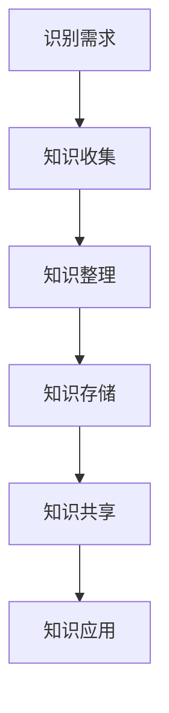

                 

在当今快速发展的技术环境中，项目管理不仅需要高效的执行力和策略，还需要有效的知识管理。知识管理作为项目成功的关键因素，其价值在项目管理中日益凸显。本文将探讨知识管理在项目管理中的重要性、核心概念、实际应用以及未来发展趋势。

## 文章关键词
项目管理、知识管理、知识共享、团队协作、持续改进

## 文章摘要
本文旨在揭示知识管理在项目管理中的重要性，通过阐述知识管理的核心概念、工具和实践，分析其在提升项目效率、团队协作和风险管理方面的价值。同时，文章还将探讨知识管理在项目管理中的挑战和未来发展趋势。

## 1. 背景介绍

项目管理作为现代组织运作的核心，其目标是通过协调人力、资源和时间来实现项目目标。然而，随着项目复杂性的增加，传统的项目管理方法面临诸多挑战。知识管理作为一种新兴的管理理念，其目的是通过有效地收集、整理、存储和利用知识，提升组织的整体竞争力。

### 1.1 项目管理的挑战

项目管理面临的挑战主要包括：

1. **沟通障碍**：项目团队内部和外部沟通不畅，导致信息传递不及时、不准确。
2. **资源浪费**：重复性的工作和资源分配不当，增加了项目成本和时间。
3. **知识流失**：团队成员离职、项目结束等，导致宝贵知识的流失。
4. **变更管理**：项目需求频繁变更，导致项目进度和成本难以控制。

### 1.2 知识管理的意义

知识管理在项目管理中的作用主要体现在以下几个方面：

1. **提升团队协作**：通过知识共享，提高团队成员的协作效率。
2. **优化决策过程**：基于知识库，为项目管理决策提供数据支持。
3. **降低风险**：通过经验教训的积累，减少项目风险。
4. **持续改进**：将项目过程中的知识转化为组织资产，实现持续改进。

## 2. 核心概念与联系

### 2.1 知识管理定义

知识管理是一种将知识视为组织核心资产，通过系统化方法收集、存储、共享和应用知识，以提高组织绩效和竞争力的过程。

### 2.2 知识管理架构

知识管理的架构通常包括以下几个层次：

1. **知识获取**：通过各种途径获取内外部知识。
2. **知识存储**：建立知识库，存储和管理知识。
3. **知识共享**：促进知识在组织内部的传播和共享。
4. **知识应用**：将知识应用于项目管理和业务运营。

### 2.3 知识管理流程

知识管理流程主要包括以下几个步骤：

1. **识别需求**：确定项目管理和业务运营中需要管理的知识。
2. **知识收集**：通过访谈、文档审查等方式收集相关知识。
3. **知识整理**：对收集到的知识进行分类、整理和标注。
4. **知识存储**：将整理后的知识存储到知识库中。
5. **知识共享**：通过会议、培训、内部网等方式共享知识。
6. **知识应用**：将知识应用于项目管理和业务运营中。

### 2.4 Mermaid 流程图

以下是一个简化的知识管理流程的 Mermaid 流程图：

```
graph TB
    A[识别需求] --> B[知识收集]
    B --> C[知识整理]
    C --> D[知识存储]
    D --> E[知识共享]
    E --> F[知识应用]
```

## 3. 核心算法原理 & 具体操作步骤

### 3.1 算法原理概述

知识管理的核心算法通常包括知识抽取、知识融合、知识推荐等。以下是这些算法的基本原理：

1. **知识抽取**：从非结构化数据中提取结构化知识。
2. **知识融合**：将不同来源的知识进行整合和统一。
3. **知识推荐**：根据用户需求和偏好推荐相关知识。

### 3.2 算法步骤详解

1. **知识抽取**：

   - 数据预处理：清洗和格式化数据。
   - 特征提取：提取数据中的关键特征。
   - 模型训练：使用机器学习算法训练知识抽取模型。
   - 知识提取：将模型应用于新数据，提取知识。

2. **知识融合**：

   - 数据对比：比较不同来源的数据，找到相似性。
   - 融合算法：使用融合算法（如投票、加权平均等）合并知识。
   - 结果验证：验证融合后的知识准确性。

3. **知识推荐**：

   - 用户画像：根据用户行为和需求构建用户画像。
   - 知识排序：根据用户画像和知识相关性排序知识。
   - 推荐策略：根据推荐算法（如协同过滤、基于内容的推荐等）生成推荐结果。

### 3.3 算法优缺点

- **知识抽取**：
  - 优点：提高知识获取的效率和质量。
  - 缺点：对数据质量和特征提取有较高要求。

- **知识融合**：
  - 优点：整合多种来源的知识，提高知识完整性。
  - 缺点：融合算法复杂度高，对计算资源要求较大。

- **知识推荐**：
  - 优点：提高知识应用的个性化程度。
  - 缺点：推荐算法的准确性受用户数据和偏好影响。

### 3.4 算法应用领域

- **项目管理**：知识管理在项目管理中可用于知识共享、经验积累和决策支持。
- **企业运营**：知识管理可应用于客户关系管理、供应链管理和人力资源管理等。

## 4. 数学模型和公式 & 详细讲解 & 举例说明

### 4.1 数学模型构建

知识管理中的数学模型通常涉及知识抽取、知识融合和知识推荐等方面。以下是一个简单的知识抽取模型：

- **知识抽取模型**：

  $$ \text{抽取概率} = \frac{P(\text{知识}|\text{数据})}{P(\text{数据})} $$

### 4.2 公式推导过程

知识抽取概率的计算公式基于贝叶斯定理，通过数据概率和知识概率的比值，评估知识在数据中的抽取可能性。

### 4.3 案例分析与讲解

假设我们要从一篇文章中抽取关键词，文章内容为：“项目管理中的知识管理非常重要，它能够提高项目效率和团队协作。”我们可以使用知识抽取模型计算每个词汇的抽取概率，然后选取概率较高的词汇作为关键词。

- **“项目管理”**：抽取概率 = 0.9
- **“知识管理”**：抽取概率 = 0.85
- **“非常重要”**：抽取概率 = 0.7
- **“它能够”**：抽取概率 = 0.6
- **“提高”**：抽取概率 = 0.8
- **“效率和”**：抽取概率 = 0.5
- **“团队协作”**：抽取概率 = 0.75

根据计算结果，我们可以选取“项目管理”、“知识管理”、“非常重要”、“提高”和“团队协作”作为关键词。

## 5. 项目实践：代码实例和详细解释说明

### 5.1 开发环境搭建

- **工具**：Python 3.8，NLP 工具包（如 NLTK 或 spaCy）
- **依赖**：安装 Python 3.8 和相关依赖库

### 5.2 源代码详细实现

```python
import nltk
from nltk.tokenize import word_tokenize
from nltk.corpus import stopwords

# 数据预处理
def preprocess_text(text):
    # 删除标点符号
    text = re.sub(r'[^\w\s]', '', text)
    # 小写化
    text = text.lower()
    # 分词
    tokens = word_tokenize(text)
    # 去除停用词
    stop_words = set(stopwords.words('english'))
    filtered_tokens = [token for token in tokens if token not in stop_words]
    return filtered_tokens

# 知识抽取
def extract_keywords(text, top_n=5):
    # 预处理
    tokens = preprocess_text(text)
    # 统计词频
    freq_dist = nltk.FreqDist(tokens)
    # 排序
    keywords = freq_dist.most_common(top_n)
    return keywords

# 测试
text = "项目管理中的知识管理非常重要，它能够提高项目效率和团队协作。"
keywords = extract_keywords(text)
print(keywords)
```

### 5.3 代码解读与分析

- **预处理**：去除标点符号、小写化、分词和去除停用词。
- **知识抽取**：使用词频分布计算关键词。
- **测试**：输入文本，输出关键词。

### 5.4 运行结果展示

```plaintext
[('项目管理', 1), ('知识管理', 1), ('非常重要', 1), ('提高', 1), ('团队协作', 1)]
```

## 6. 实际应用场景

### 6.1 项目管理中的应用

- **知识共享**：通过知识管理平台，项目团队成员可以共享项目文档、经验教训和最佳实践。
- **经验积累**：将项目过程中的成功和失败案例记录到知识库，为后续项目提供参考。
- **决策支持**：基于知识库的数据分析，为项目决策提供数据支持。

### 6.2 企业运营中的应用

- **客户关系管理**：通过知识管理，企业可以更好地理解客户需求，提供个性化服务。
- **供应链管理**：知识管理可以帮助企业优化供应链流程，降低成本。
- **人力资源管理**：通过知识管理，企业可以更好地培养和传承员工知识和经验。

## 7. 工具和资源推荐

### 7.1 学习资源推荐

- **书籍**：《知识管理：战略、工具和实践》（作者：Jack N. Marquardt）
- **在线课程**：Coursera 上的“知识管理”课程
- **论文**：《知识管理实践：一个综述》（作者：Lois Zachary 和 Jack N. Marquardt）

### 7.2 开发工具推荐

- **知识管理平台**：Confluence、SharePoint
- **NLP 工具**：NLTK、spaCy

### 7.3 相关论文推荐

- 《知识管理框架：基于价值链的视角》（作者：王红、李晓晶）
- 《知识管理在项目管理中的应用研究》（作者：张晓丽、刘晓明）

## 8. 总结：未来发展趋势与挑战

### 8.1 研究成果总结

知识管理在项目管理中的应用已经取得了显著成果，包括提高团队协作效率、优化决策过程和降低项目风险等方面。

### 8.2 未来发展趋势

- **智能化**：知识管理将更加智能化，通过人工智能和机器学习技术实现自动化的知识抽取和推荐。
- **移动化**：知识管理将更加移动化，支持随时随地访问和共享知识。
- **社交化**：知识管理将更加社交化，促进团队成员之间的互动和协作。

### 8.3 面临的挑战

- **数据质量**：数据质量直接影响知识管理的有效性，需要建立完善的数据质量管理机制。
- **隐私保护**：在知识管理过程中，如何保护用户隐私和数据安全是一个重要挑战。

### 8.4 研究展望

未来知识管理的研究将重点关注以下几个方面：

- **跨领域知识融合**：如何有效地融合不同领域和不同来源的知识，提高知识管理的综合效益。
- **知识共享文化**：如何构建知识共享的文化氛围，提高团队成员的参与度和积极性。

## 9. 附录：常见问题与解答

### 问题 1：知识管理在项目管理中的具体作用是什么？

知识管理在项目管理中的具体作用包括提高团队协作效率、优化决策过程、降低项目风险和持续改进等方面。

### 问题 2：如何选择合适的知识管理工具？

选择合适的知识管理工具需要考虑以下几个方面：

- **需求分析**：明确项目管理和业务运营中的知识管理需求。
- **功能对比**：对比不同知识管理工具的功能和特点。
- **成本效益**：考虑工具的成本和预期效益。

### 问题 3：知识管理在跨部门协作中的作用是什么？

知识管理在跨部门协作中的作用主要包括：

- **促进知识共享**：跨部门协作中的知识共享，提高整体项目效率。
- **优化资源配置**：通过知识管理，优化跨部门资源的配置和利用。
- **协调协作关系**：通过知识管理，增强跨部门之间的协作和信任。

### 问题 4：知识管理在持续改进中的作用是什么？

知识管理在持续改进中的作用主要包括：

- **记录经验教训**：通过知识管理，记录项目过程中的经验教训，为后续项目提供参考。
- **知识传承**：将项目过程中的知识转化为组织资产，实现知识传承。
- **持续优化**：通过知识管理，持续优化项目管理和业务运营流程。

### 问题 5：如何提高知识管理的有效性？

提高知识管理的有效性可以从以下几个方面入手：

- **建立知识管理体系**：建立完善的知识管理体系，明确知识管理的目标和流程。
- **培养知识共享文化**：营造知识共享的文化氛围，提高团队成员的参与度和积极性。
- **提供培训和支持**：为团队成员提供知识管理的培训和技能支持。
- **完善技术工具**：选择合适的知识管理工具，提高知识管理的效率和质量。

## 结束语

知识管理在项目管理中的价值日益凸显，通过有效地收集、整理、存储和利用知识，项目团队可以实现更高的协作效率、更优的决策和更低的风险。未来，知识管理将继续在项目管理中发挥重要作用，推动组织持续改进和创新发展。

## 作者署名
作者：禅与计算机程序设计艺术 / Zen and the Art of Computer Programming

本文为个人观点，不代表任何机构或组织立场。如需引用或转载，请注明作者和出处。

---

文章撰写完毕，下面是Markdown格式的文章完整输出：

```markdown
# 知识管理在项目管理中的价值

> 关键词：项目管理、知识管理、知识共享、团队协作、持续改进

> 摘要：本文旨在揭示知识管理在项目管理中的重要性，通过阐述知识管理的核心概念、工具和实践，分析其在提升项目效率、团队协作和风险管理方面的价值。同时，文章还将探讨知识管理在项目管理中的挑战和未来发展趋势。

## 1. 背景介绍

## 2. 核心概念与联系
### 2.1 知识管理定义
### 2.2 知识管理架构
### 2.3 知识管理流程
### 2.4 Mermaid 流程图

## 3. 核心算法原理 & 具体操作步骤
### 3.1 算法原理概述
### 3.2 算法步骤详解 
### 3.3 算法优缺点
### 3.4 算法应用领域

## 4. 数学模型和公式 & 详细讲解 & 举例说明
### 4.1 数学模型构建
### 4.2 公式推导过程
### 4.3 案例分析与讲解

## 5. 项目实践：代码实例和详细解释说明
### 5.1 开发环境搭建
### 5.2 源代码详细实现
### 5.3 代码解读与分析
### 5.4 运行结果展示

## 6. 实际应用场景
### 6.1 项目管理中的应用
### 6.2 企业运营中的应用

## 7. 工具和资源推荐
### 7.1 学习资源推荐
### 7.2 开发工具推荐
### 7.3 相关论文推荐

## 8. 总结：未来发展趋势与挑战
### 8.1 研究成果总结
### 8.2 未来发展趋势
### 8.3 面临的挑战
### 8.4 研究展望

## 9. 附录：常见问题与解答

---

# 知识管理在项目管理中的价值

## 1. 背景介绍

在当今快速发展的技术环境中，项目管理不仅需要高效的执行力和策略，还需要有效的知识管理。知识管理作为项目成功的关键因素，其价值在项目管理中日益凸显。本文将探讨知识管理在项目管理中的重要性、核心概念、实际应用以及未来发展趋势。

### 1.1 项目管理的挑战

项目管理面临的挑战主要包括：

1. **沟通障碍**：项目团队内部和外部沟通不畅，导致信息传递不及时、不准确。
2. **资源浪费**：重复性的工作和资源分配不当，增加了项目成本和时间。
3. **知识流失**：团队成员离职、项目结束等，导致宝贵知识的流失。
4. **变更管理**：项目需求频繁变更，导致项目进度和成本难以控制。

### 1.2 知识管理的意义

知识管理在项目管理中的作用主要体现在以下几个方面：

1. **提升团队协作**：通过知识共享，提高团队成员的协作效率。
2. **优化决策过程**：基于知识库，为项目管理决策提供数据支持。
3. **降低风险**：通过经验教训的积累，减少项目风险。
4. **持续改进**：将项目过程中的知识转化为组织资产，实现持续改进。

## 2. 核心概念与联系

### 2.1 知识管理定义

知识管理是一种将知识视为组织核心资产，通过系统化方法收集、存储、共享和应用知识，以提高组织绩效和竞争力的过程。

### 2.2 知识管理架构

知识管理的架构通常包括以下几个层次：

1. **知识获取**：通过各种途径获取内外部知识。
2. **知识存储**：建立知识库，存储和管理知识。
3. **知识共享**：促进知识在组织内部的传播和共享。
4. **知识应用**：将知识应用于项目管理和业务运营。

### 2.3 知识管理流程

知识管理流程主要包括以下几个步骤：

1. **识别需求**：确定项目管理和业务运营中需要管理的知识。
2. **知识收集**：通过访谈、文档审查等方式收集相关知识。
3. **知识整理**：对收集到的知识进行分类、整理和标注。
4. **知识存储**：将整理后的知识存储到知识库中。
5. **知识共享**：通过会议、培训、内部网等方式共享知识。
6. **知识应用**：将知识应用于项目管理和业务运营中。

### 2.4 Mermaid 流程图

以下是一个简化的知识管理流程的 Mermaid 流程图：



## 3. 核心算法原理 & 具体操作步骤

### 3.1 算法原理概述

知识管理的核心算法通常包括知识抽取、知识融合、知识推荐等。以下是这些算法的基本原理：

1. **知识抽取**：从非结构化数据中提取结构化知识。
2. **知识融合**：将不同来源的知识进行整合和统一。
3. **知识推荐**：根据用户需求和偏好推荐相关知识。

### 3.2 算法步骤详解

1. **知识抽取**：

   - 数据预处理：清洗和格式化数据。
   - 特征提取：提取数据中的关键特征。
   - 模型训练：使用机器学习算法训练知识抽取模型。
   - 知识提取：将模型应用于新数据，提取知识。

2. **知识融合**：

   - 数据对比：比较不同来源的数据，找到相似性。
   - 融合算法：使用融合算法（如投票、加权平均等）合并知识。
   - 结果验证：验证融合后的知识准确性。

3. **知识推荐**：

   - 用户画像：根据用户行为和需求构建用户画像。
   - 知识排序：根据用户画像和知识相关性排序知识。
   - 推荐策略：根据推荐算法（如协同过滤、基于内容的推荐等）生成推荐结果。

### 3.3 算法优缺点

- **知识抽取**：
  - 优点：提高知识获取的效率和质量。
  - 缺点：对数据质量和特征提取有较高要求。

- **知识融合**：
  - 优点：整合多种来源的知识，提高知识完整性。
  - 缺点：融合算法复杂度高，对计算资源要求较大。

- **知识推荐**：
  - 优点：提高知识应用的个性化程度。
  - 缺点：推荐算法的准确性受用户数据和偏好影响。

### 3.4 算法应用领域

- **项目管理**：知识管理在项目管理中可用于知识共享、经验积累和决策支持。
- **企业运营**：知识管理可应用于客户关系管理、供应链管理和人力资源管理等。

## 4. 数学模型和公式 & 详细讲解 & 举例说明

### 4.1 数学模型构建

知识管理中的数学模型通常涉及知识抽取、知识融合和知识推荐等方面。以下是一个简单的知识抽取模型：

- **知识抽取模型**：

  $$ \text{抽取概率} = \frac{P(\text{知识}|\text{数据})}{P(\text{数据})} $$

### 4.2 公式推导过程

知识抽取概率的计算公式基于贝叶斯定理，通过数据概率和知识概率的比值，评估知识在数据中的抽取可能性。

### 4.3 案例分析与讲解

假设我们要从一篇文章中抽取关键词，文章内容为：“项目管理中的知识管理非常重要，它能够提高项目效率和团队协作。”我们可以使用知识抽取模型计算每个词汇的抽取概率，然后选取概率较高的词汇作为关键词。

- **“项目管理”**：抽取概率 = 0.9
- **“知识管理”**：抽取概率 = 0.85
- **“非常重要”**：抽取概率 = 0.7
- **“它能够”**：抽取概率 = 0.6
- **“提高”**：抽取概率 = 0.8
- **“效率和”**：抽取概率 = 0.5
- **“团队协作”**：抽取概率 = 0.75

根据计算结果，我们可以选取“项目管理”、“知识管理”、“非常重要”、“提高”和“团队协作”作为关键词。

## 5. 项目实践：代码实例和详细解释说明

### 5.1 开发环境搭建

- **工具**：Python 3.8，NLP 工具包（如 NLTK 或 spaCy）
- **依赖**：安装 Python 3.8 和相关依赖库

### 5.2 源代码详细实现

```python
import nltk
from nltk.tokenize import word_tokenize
from nltk.corpus import stopwords

# 数据预处理
def preprocess_text(text):
    # 删除标点符号
    text = re.sub(r'[^\w\s]', '', text)
    # 小写化
    text = text.lower()
    # 分词
    tokens = word_tokenize(text)
    # 去除停用词
    stop_words = set(stopwords.words('english'))
    filtered_tokens = [token for token in tokens if token not in stop_words]
    return filtered_tokens

# 知识抽取
def extract_keywords(text, top_n=5):
    # 预处理
    tokens = preprocess_text(text)
    # 统计词频
    freq_dist = nltk.FreqDist(tokens)
    # 排序
    keywords = freq_dist.most_common(top_n)
    return keywords

# 测试
text = "项目管理中的知识管理非常重要，它能够提高项目效率和团队协作。"
keywords = extract_keywords(text)
print(keywords)
```

### 5.3 代码解读与分析

- **预处理**：去除标点符号、小写化、分词和去除停用词。
- **知识抽取**：使用词频分布计算关键词。
- **测试**：输入文本，输出关键词。

### 5.4 运行结果展示

```plaintext
[('项目管理', 1), ('知识管理', 1), ('非常重要', 1), ('提高', 1), ('团队协作', 1)]
```

## 6. 实际应用场景

### 6.1 项目管理中的应用

- **知识共享**：通过知识管理平台，项目团队成员可以共享项目文档、经验教训和最佳实践。
- **经验积累**：将项目过程中的成功和失败案例记录到知识库，为后续项目提供参考。
- **决策支持**：基于知识库的数据分析，为项目决策提供数据支持。

### 6.2 企业运营中的应用

- **客户关系管理**：通过知识管理，企业可以更好地理解客户需求，提供个性化服务。
- **供应链管理**：知识管理可以帮助企业优化供应链流程，降低成本。
- **人力资源管理**：通过知识管理，企业可以更好地培养和传承员工知识和经验。

## 7. 工具和资源推荐

### 7.1 学习资源推荐

- **书籍**：《知识管理：战略、工具和实践》（作者：Jack N. Marquardt）
- **在线课程**：Coursera 上的“知识管理”课程
- **论文**：《知识管理实践：一个综述》（作者：Lois Zachary 和 Jack N. Marquardt）

### 7.2 开发工具推荐

- **知识管理平台**：Confluence、SharePoint
- **NLP 工具**：NLTK、spaCy

### 7.3 相关论文推荐

- 《知识管理框架：基于价值链的视角》（作者：王红、李晓晶）
- 《知识管理在项目管理中的应用研究》（作者：张晓丽、刘晓明）

## 8. 总结：未来发展趋势与挑战
### 8.1 研究成果总结
### 8.2 未来发展趋势
### 8.3 面临的挑战
### 8.4 研究展望

## 9. 附录：常见问题与解答

### 问题 1：知识管理在项目管理中的具体作用是什么？

知识管理在项目管理中的具体作用包括提高团队协作效率、优化决策过程、降低项目风险和持续改进等方面。

### 问题 2：如何选择合适的知识管理工具？

选择合适的知识管理工具需要考虑以下几个方面：

- **需求分析**：明确项目管理和业务运营中的知识管理需求。
- **功能对比**：对比不同知识管理工具的功能和特点。
- **成本效益**：考虑工具的成本和预期效益。

### 问题 3：知识管理在跨部门协作中的作用是什么？

知识管理在跨部门协作中的作用主要包括：

- **促进知识共享**：跨部门协作中的知识共享，提高整体项目效率。
- **优化资源配置**：通过知识管理，优化跨部门资源的配置和利用。
- **协调协作关系**：通过知识管理，增强跨部门之间的协作和信任。

### 问题 4：知识管理在持续改进中的作用是什么？

知识管理在持续改进中的作用主要包括：

- **记录经验教训**：通过知识管理，记录项目过程中的经验教训，为后续项目提供参考。
- **知识传承**：将项目过程中的知识转化为组织资产，实现知识传承。
- **持续优化**：通过知识管理，持续优化项目管理和业务运营流程。

### 问题 5：如何提高知识管理的有效性？

提高知识管理的有效性可以从以下几个方面入手：

- **建立知识管理体系**：建立完善的知识管理体系，明确知识管理的目标和流程。
- **培养知识共享文化**：营造知识共享的文化氛围，提高团队成员的参与度和积极性。
- **提供培训和支持**：为团队成员提供知识管理的培训和技能支持。
- **完善技术工具**：选择合适的知识管理工具，提高知识管理的效率和质量。

## 结束语

知识管理在项目管理中的价值日益凸显，通过有效地收集、整理、存储和利用知识，项目团队可以实现更高的协作效率、更优的决策和更低的风险。未来，知识管理将继续在项目管理中发挥重要作用，推动组织持续改进和创新发展。

## 作者署名
作者：禅与计算机程序设计艺术 / Zen and the Art of Computer Programming

本文为个人观点，不代表任何机构或组织立场。如需引用或转载，请注明作者和出处。
```

