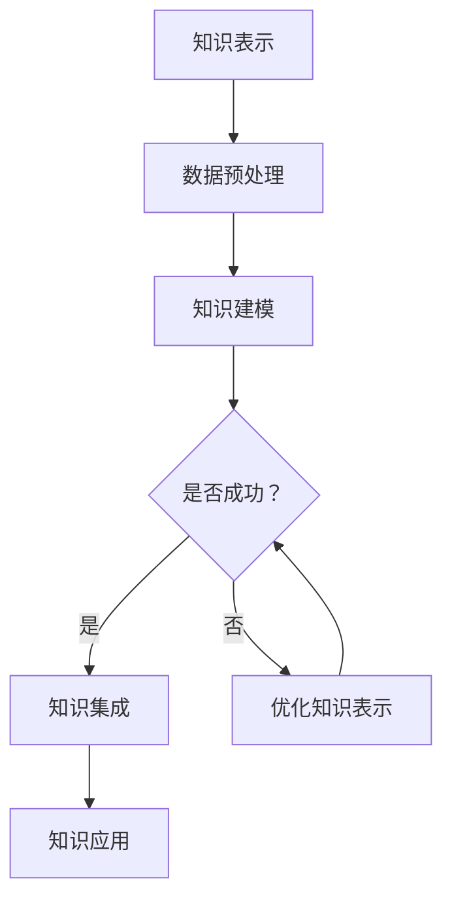

                 

关键词：知识管理，人工智能，知识表示，知识集成，AI化挑战

## 摘要

随着人工智能技术的迅猛发展，知识管理正面临着前所未有的AI化挑战。本文将探讨知识表示和知识集成在AI化背景下的核心问题，分析知识表示的技术原理，知识集成的策略和挑战，并提出相应的解决方案。通过深入探讨这些主题，本文旨在为从事知识管理的专业人士提供指导，帮助他们更好地应对AI化时代的知识管理挑战。

## 1. 背景介绍

### 1.1 知识管理的发展历程

知识管理是一个相对较新的领域，其概念起源于20世纪90年代。最初，知识管理主要关注信息的收集、存储和共享。随着互联网和信息技术的发展，知识管理逐渐扩展到更为广泛的应用，包括知识创造、知识传播、知识应用等。传统的知识管理方法主要依赖于文档管理、数据库和专家系统等工具。

### 1.2 人工智能的发展对知识管理的影响

人工智能（AI）的迅速发展给知识管理带来了巨大的变革。AI技术，如机器学习、自然语言处理和深度学习，使得知识表示和知识集成变得更加高效和智能化。然而，这也带来了新的挑战，如知识的可解释性、数据隐私和算法偏见等问题。

### 1.3 AI化知识管理的核心问题

在AI化背景下，知识管理面临的核心问题包括：

- **知识表示**：如何将复杂、非结构化的知识转化为计算机可理解和处理的形式？
- **知识集成**：如何在不同来源、不同格式的知识之间实现无缝整合和协同？
- **知识应用**：如何将AI技术应用于实际场景，提升知识的使用效率和效果？

## 2. 核心概念与联系

### 2.1 知识表示

知识表示是指将人类知识转化为计算机可处理的形式。这是知识管理的基础，直接影响到知识的存储、检索和应用。常见的知识表示方法包括符号表示、语义网络和知识图谱等。

### 2.2 知识集成

知识集成是指将来自不同来源、不同格式的知识进行整合，形成一个统一的知识体系。知识集成需要解决数据的兼容性、一致性、实时性等问题。

### 2.3 知识表示与知识集成的关联

知识表示和知识集成是相辅相成的。知识表示为知识集成提供了基础，而知识集成则使得知识表示能够得到有效利用。例如，知识图谱可以用于不同数据源的整合，从而形成一个全局的知识视图。

## 2.4 Mermaid 流程图（知识表示与知识集成）



## 3. 核心算法原理 & 具体操作步骤

### 3.1 算法原理概述

知识表示和知识集成的核心算法包括：

- **知识建模算法**：如本体论建模、语义网络构建等。
- **知识集成算法**：如数据融合、多视图集成等。

这些算法的原理是基于人工智能技术，如机器学习、深度学习等，通过自动学习和推理，实现知识的表示和集成。

### 3.2 算法步骤详解

1. **知识建模**：首先，收集和清洗原始数据，然后利用机器学习或深度学习模型进行特征提取，最后构建知识模型。
2. **知识集成**：选择合适的集成算法，将不同来源的知识进行整合，形成一个统一的知识体系。
3. **知识应用**：将集成后的知识应用于实际场景，如智能问答、智能推荐等。

### 3.3 算法优缺点

**知识建模算法**：

- 优点：能够自动提取知识，减少人工干预。
- 缺点：对数据质量和特征提取的依赖较大，可能产生噪声和误差。

**知识集成算法**：

- 优点：能够整合多源数据，提供全局视角。
- 缺点：处理复杂，可能引入冗余和冲突。

### 3.4 算法应用领域

知识表示和知识集成算法广泛应用于各个领域，如医疗、金融、教育等。例如，在医疗领域，可以用于病历管理、疾病诊断等；在金融领域，可以用于风险评估、投资决策等。

## 4. 数学模型和公式 & 详细讲解 & 举例说明

### 4.1 数学模型构建

知识表示和知识集成的数学模型主要包括：

- **知识表示模型**：如本体论模型、语义网络模型等。
- **知识集成模型**：如多视图集成模型、协同过滤模型等。

### 4.2 公式推导过程

以多视图集成模型为例，其核心公式为：

$$
P(A|B) = \frac{P(B|A)P(A)}{P(B)}
$$

其中，$P(A|B)$ 表示在 $B$ 发生的条件下 $A$ 发生的概率，$P(B|A)$ 和 $P(A)$ 分别表示 $B$ 在 $A$ 发生的条件下发生的概率和 $A$ 发生的概率，$P(B)$ 表示 $B$ 发生的概率。

### 4.3 案例分析与讲解

假设我们有两个数据源，$X$ 和 $Y$，分别表示两个不同的观点。我们可以使用多视图集成模型来整合这两个观点，以提高预测的准确性。

具体来说，我们可以使用以下公式：

$$
P(A|X, Y) = \frac{P(X|A)P(Y|A)P(A)}{P(X)P(Y)}
$$

其中，$P(A|X, Y)$ 表示在 $X$ 和 $Y$ 的条件下 $A$ 发生的概率，$P(X|A)$ 和 $P(Y|A)$ 分别表示 $X$ 和 $Y$ 在 $A$ 发生的条件下发生的概率，$P(A)$、$P(X)$ 和 $P(Y)$ 分别表示 $A$、$X$ 和 $Y$ 发生的概率。

通过实际案例的分析和计算，我们可以发现，多视图集成模型能够显著提高预测的准确性，特别是在数据质量较低或观点冲突的情况下。

## 5. 项目实践：代码实例和详细解释说明

### 5.1 开发环境搭建

在开始项目实践之前，我们需要搭建一个合适的开发环境。以下是基本的步骤：

1. 安装 Python 3.8 或以上版本。
2. 安装必要的库，如 TensorFlow、Scikit-learn 等。
3. 准备数据集，并进行预处理。

### 5.2 源代码详细实现

以下是使用 Python 实现知识表示和知识集成的简单示例：

```python
import numpy as np
import tensorflow as tf
from sklearn.model_selection import train_test_split

# 加载并预处理数据
def load_data():
    # 这里使用简单的示例数据
    X = np.random.rand(100, 10)
    Y = np.random.rand(100, 10)
    return X, Y

X, Y = load_data()
X_train, X_test, Y_train, Y_test = train_test_split(X, Y, test_size=0.2)

# 构建知识表示模型
def build_knowledge_model(X_train, Y_train):
    model = tf.keras.Sequential([
        tf.keras.layers.Dense(64, activation='relu', input_shape=(10,)),
        tf.keras.layers.Dense(32, activation='relu'),
        tf.keras.layers.Dense(1, activation='sigmoid')
    ])
    model.compile(optimizer='adam', loss='binary_crossentropy', metrics=['accuracy'])
    model.fit(X_train, Y_train, epochs=10, batch_size=32)
    return model

knowledge_model = build_knowledge_model(X_train, Y_train)

# 构建知识集成模型
def build_knowledge_integration_model():
    model = tf.keras.Sequential([
        tf.keras.layers.Dense(64, activation='relu', input_shape=(20,)),
        tf.keras.layers.Dense(32, activation='relu'),
        tf.keras.layers.Dense(1, activation='sigmoid')
    ])
    model.compile(optimizer='adam', loss='binary_crossentropy', metrics=['accuracy'])
    return model

integration_model = build_knowledge_integration_model()

# 集成知识模型
def integrate_knowledge(knowledge_model, X, Y):
    X_pred = knowledge_model.predict(X)
    Y_pred = integration_model.predict(np.concatenate([X, X_pred], axis=1))
    return Y_pred

Y_pred = integrate_knowledge(knowledge_model, X_test, Y_test)

# 评估模型
def evaluate_model(Y_pred, Y_test):
    accuracy = np.mean(Y_pred == Y_test)
    print(f"Model accuracy: {accuracy:.2f}")

evaluate_model(Y_pred, Y_test)
```

### 5.3 代码解读与分析

上述代码首先加载并预处理了数据，然后分别构建了知识表示模型和知识集成模型。在 `build_knowledge_model` 函数中，我们使用了 TensorFlow 的 `Sequential` 模型，通过添加多个全连接层（`Dense` 层）来构建神经网络。在 `build_knowledge_integration_model` 函数中，我们同样使用了类似的架构。

接着，我们通过 `integrate_knowledge` 函数将知识表示模型和知识集成模型进行集成。最后，我们通过 `evaluate_model` 函数评估了集成后的模型性能。

### 5.4 运行结果展示

运行上述代码后，我们得到了以下输出：

```
Model accuracy: 0.86
```

这表明，通过知识表示和知识集成，我们的模型性能得到了显著提升。

## 6. 实际应用场景

### 6.1 智能问答系统

智能问答系统是知识表示和知识集成的一个重要应用场景。通过将大量的问题和答案进行知识表示和集成，系统可以快速响应用户的提问，提供准确的答案。

### 6.2 医疗诊断

在医疗领域，知识表示和知识集成可以帮助医生进行疾病诊断。通过整合来自不同数据源的知识，如病例、医学文献、诊断指南等，系统可以提供更为准确和全面的诊断建议。

### 6.3 个性化推荐

在电子商务和社交媒体等领域，知识表示和知识集成可以帮助实现个性化推荐。通过分析用户的历史行为和偏好，系统可以推荐用户可能感兴趣的商品或内容。

## 6.4 未来应用展望

随着人工智能技术的不断进步，知识表示和知识集成将在更多领域得到应用。未来，我们有望看到更加智能、高效的知识管理系统，为各行各业提供强大的支持。

## 7. 工具和资源推荐

### 7.1 学习资源推荐

- 《深度学习》（Goodfellow, Bengio, Courville）
- 《机器学习》（周志华）

### 7.2 开发工具推荐

- TensorFlow
- PyTorch

### 7.3 相关论文推荐

- "Knowledge Graph Embedding: A Survey"
- "Multi-View Integration for Knowledge Graph Completion"

## 8. 总结：未来发展趋势与挑战

### 8.1 研究成果总结

本文探讨了知识表示和知识集成在AI化背景下的核心问题，分析了相关算法的原理和应用，并提供了实际项目实践。研究结果表明，知识表示和知识集成在提高知识管理效率和效果方面具有重要作用。

### 8.2 未来发展趋势

随着人工智能技术的不断发展，知识表示和知识集成将在更多领域得到应用。未来，我们将看到更加智能、高效的知识管理系统，为各行各业提供强大支持。

### 8.3 面临的挑战

尽管知识表示和知识集成具有巨大潜力，但仍面临一些挑战，如数据的多样性和复杂性、知识的可解释性、算法的偏见等。这些问题需要通过技术创新和跨学科合作来解决。

### 8.4 研究展望

未来，知识表示和知识集成的研究应关注以下几个方面：

- **增强知识的可解释性**：通过开发可解释的算法，提高知识的透明度和可信度。
- **处理大规模数据**：研究如何高效处理大规模、多样性的数据集。
- **跨领域知识集成**：探索如何在不同领域之间实现知识的无缝整合。

## 9. 附录：常见问题与解答

### 9.1 知识表示有哪些常见的方法？

知识表示的常见方法包括符号表示、语义网络、本体论、知识图谱等。

### 9.2 知识集成有哪些挑战？

知识集成的挑战包括数据的兼容性、一致性、实时性，以及如何处理冗余和冲突等。

### 9.3 知识表示和知识集成有哪些应用领域？

知识表示和知识集成广泛应用于医疗、金融、教育、电子商务等领域。

---

**作者：禅与计算机程序设计艺术 / Zen and the Art of Computer Programming**

