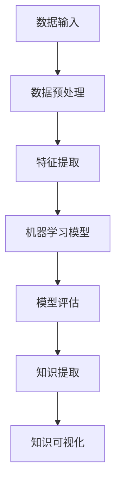

                 

关键词：知识管理系统、知识发现引擎、人工智能、机器学习、自然语言处理、数据挖掘、知识图谱、信息检索、数据可视化、智能推荐系统

> 摘要：本文深入探讨了知识管理系统（KM）的核心——知识发现引擎。知识发现引擎是KM系统的“大脑”，它通过融合人工智能、机器学习和自然语言处理等先进技术，从大量数据中提取有价值的信息，为企业和组织提供决策支持。本文将详细分析知识发现引擎的原理、算法、数学模型、实践应用及未来发展趋势。

## 1. 背景介绍

在信息爆炸的时代，知识和信息已经成为企业和组织的核心竞争力。然而，如何从海量数据中高效地提取有价值的信息，成为了一个亟待解决的问题。知识管理系统（Knowledge Management System，简称KM）应运而生，它旨在通过有效的知识管理手段，将分散的信息整合为有序的知识，以支持组织决策和创新。

知识管理系统主要由以下几个部分组成：知识存储、知识检索、知识共享、知识发现和知识应用。其中，知识发现（Knowledge Discovery）是知识管理的关键环节。知识发现引擎作为知识管理系统的“大脑”，其重要性不言而喻。它负责从数据中挖掘潜在的知识模式，为决策者提供数据驱动的洞察。

### 1.1 知识管理的挑战

知识管理面临以下几个主要挑战：

- 数据量庞大：随着大数据技术的发展，企业和组织面临的数据量呈指数级增长。
- 数据多样性：数据来源广泛，包括结构化数据、半结构化数据和非结构化数据。
- 数据质量：数据质量直接影响知识发现的结果，需要通过数据清洗和预处理来提高数据质量。
- 数据隐私和安全：在知识发现过程中，需要平衡数据隐私保护和知识挖掘的需求。

### 1.2 知识发现引擎的作用

知识发现引擎在知识管理系统中具有以下几个重要作用：

- 数据挖掘：从大量数据中提取潜在的模式和关联，为业务决策提供支持。
- 智能推荐：根据用户的行为数据和偏好，提供个性化的知识推荐。
- 决策支持：通过数据分析和预测，辅助决策者做出更明智的决策。
- 知识创新：从新的数据源中发现未知的知识，推动组织创新。

## 2. 核心概念与联系

知识发现引擎的核心概念包括数据挖掘、机器学习、自然语言处理和知识图谱等。这些概念相互联系，共同构成了知识发现引擎的基础架构。

### 2.1 数据挖掘

数据挖掘（Data Mining）是知识发现的第一步，它从大量数据中提取有价值的信息和模式。数据挖掘通常包括以下几个步骤：

- 数据预处理：包括数据清洗、数据转换和数据归一化等，以提高数据质量。
- 特征选择：从原始数据中提取有用的特征，用于后续的数据分析和建模。
- 模型构建：选择合适的算法，建立数据模型，如分类、聚类、关联规则等。
- 模型评估：通过交叉验证和测试集，评估模型的性能和泛化能力。

### 2.2 机器学习

机器学习（Machine Learning）是数据挖掘的重要工具，它通过训练模型来学习数据的内在规律。机器学习可以分为监督学习、无监督学习和半监督学习。其中，监督学习在知识发现中应用最为广泛。常见的监督学习算法包括决策树、支持向量机、神经网络等。

### 2.3 自然语言处理

自然语言处理（Natural Language Processing，NLP）是知识发现的关键环节，它负责理解和处理自然语言数据。NLP技术包括文本分类、情感分析、实体识别、命名实体识别等。通过NLP，知识发现引擎可以更好地理解和提取文本数据中的知识。

### 2.4 知识图谱

知识图谱（Knowledge Graph）是一种结构化数据存储形式，它通过节点和边来表示实体和实体之间的关系。知识图谱在知识发现中起到桥梁作用，它将结构化数据和非结构化数据有机结合，为数据分析和挖掘提供丰富的背景知识。

### 2.5 Mermaid 流程图

下面是一个简化的知识发现引擎的 Mermaid 流程图，展示了数据从输入到输出的整个流程：



## 3. 核心算法原理 & 具体操作步骤

### 3.1 算法原理概述

知识发现引擎的核心算法主要包括数据挖掘算法、机器学习算法和自然语言处理算法。这些算法通过以下步骤实现知识发现：

1. 数据预处理：包括数据清洗、数据转换和数据归一化等。
2. 特征提取：从原始数据中提取有用的特征，用于后续的数据分析和建模。
3. 模型构建：选择合适的算法，建立数据模型，如分类、聚类、关联规则等。
4. 模型评估：通过交叉验证和测试集，评估模型的性能和泛化能力。
5. 知识提取：从模型中提取潜在的知识模式和关联。
6. 知识可视化：将提取的知识以可视化的形式展示，便于用户理解和分析。

### 3.2 算法步骤详解

下面详细描述知识发现引擎的各个步骤：

#### 3.2.1 数据预处理

数据预处理是知识发现的基础，它包括以下几个步骤：

- 数据清洗：去除重复数据、填补缺失值、纠正错误数据等。
- 数据转换：将数据转换为适合建模的格式，如将分类数据转换为数值数据。
- 数据归一化：将不同特征的数据进行归一化处理，使其具有相同的量纲。

#### 3.2.2 特征提取

特征提取是数据挖掘的关键环节，它包括以下几个步骤：

- 特征选择：选择对模型性能有显著影响的重要特征。
- 特征工程：对特征进行转换和组合，以提高模型的泛化能力。

#### 3.2.3 模型构建

模型构建是知识发现的核心，它包括以下几个步骤：

- 选择算法：根据问题和数据特点，选择合适的算法，如决策树、支持向量机、神经网络等。
- 模型训练：使用训练数据集，训练模型参数。
- 模型优化：通过调整模型参数，优化模型性能。

#### 3.2.4 模型评估

模型评估是确保模型性能的重要环节，它包括以下几个步骤：

- 交叉验证：将数据集划分为训练集和测试集，通过交叉验证评估模型性能。
- 测试集评估：使用测试集评估模型性能，包括准确率、召回率、F1值等指标。
- 性能优化：根据评估结果，调整模型参数，优化模型性能。

#### 3.2.5 知识提取

知识提取是从模型中提取潜在的知识模式和关联，包括以下几个步骤：

- 模型解释：对模型进行解释，理解模型的工作原理。
- 知识可视化：将提取的知识以可视化的形式展示，便于用户理解和分析。

#### 3.2.6 知识可视化

知识可视化是将提取的知识以图形化的形式展示，包括以下几个步骤：

- 选择可视化方法：根据知识类型和数据特点，选择合适的可视化方法，如图表、地图、网络图等。
- 可视化设计：设计可视化的布局、颜色、标签等，提高可视化的易读性和直观性。

### 3.3 算法优缺点

各种算法在知识发现中都有其优缺点，下面简要分析：

- 数据挖掘算法：优点包括适用于各种类型的数据、可解释性强；缺点包括计算复杂度高、对数据质量要求高。
- 机器学习算法：优点包括自动学习、可扩展性强；缺点包括可解释性差、对数据质量要求高。
- 自然语言处理算法：优点包括处理自然语言能力强、可扩展性强；缺点包括计算复杂度高、对数据质量要求高。

### 3.4 算法应用领域

知识发现引擎在各种领域都有广泛的应用，包括：

- 金融行业：用于风险控制、客户细分、投资决策等。
- 电商行业：用于个性化推荐、用户行为分析、市场预测等。
- 医疗行业：用于疾病预测、医疗诊断、药物研发等。
- 制造行业：用于生产计划、供应链管理、质量管理等。
- 政府部门：用于社会管理、政策制定、应急管理等。

## 4. 数学模型和公式 & 详细讲解 & 举例说明

### 4.1 数学模型构建

知识发现引擎的数学模型主要包括以下几个方面：

1. **监督学习模型**：如线性回归、逻辑回归、决策树、支持向量机等。
2. **无监督学习模型**：如聚类算法、关联规则挖掘等。
3. **自然语言处理模型**：如词向量模型、文本分类模型、序列标注模型等。

下面以线性回归模型为例，介绍数学模型构建的过程。

#### 线性回归模型

线性回归模型是一种简单的监督学习模型，它用于预测连续值。线性回归模型的基本公式如下：

\[ y = \beta_0 + \beta_1 \cdot x + \epsilon \]

其中，\( y \) 是因变量，\( x \) 是自变量，\( \beta_0 \) 和 \( \beta_1 \) 是模型参数，\( \epsilon \) 是误差项。

#### 模型参数估计

为了估计模型参数 \( \beta_0 \) 和 \( \beta_1 \)，我们可以使用最小二乘法（Least Squares Method）。最小二乘法的思想是找到一条直线，使得所有样本点到这条直线的垂直距离之和最小。

#### 模型优化

为了优化模型参数，我们可以使用梯度下降法（Gradient Descent Method）。梯度下降法的基本思想是沿着模型参数的梯度方向，逐步调整参数，直到达到局部最小值。

### 4.2 公式推导过程

下面简要介绍线性回归模型的公式推导过程。

#### 模型假设

假设我们有一组数据点 \((x_i, y_i)\)，其中 \( x_i \) 是自变量，\( y_i \) 是因变量。线性回归模型的目的是找到一条直线，使得所有样本点到这条直线的垂直距离之和最小。

#### 目标函数

线性回归模型的目标函数如下：

\[ J(\theta) = \frac{1}{2m} \sum_{i=1}^{m} (h_\theta(x_i) - y_i)^2 \]

其中，\( m \) 是样本数量，\( h_\theta(x) \) 是模型预测值，\( \theta \) 是模型参数。

#### 最小化目标函数

为了最小化目标函数 \( J(\theta) \)，我们需要对 \( \theta \) 进行优化。使用梯度下降法，我们可以得到以下优化步骤：

1. 计算目标函数的梯度：

\[ \nabla J(\theta) = \frac{\partial J(\theta)}{\partial \theta} \]

2. 更新模型参数：

\[ \theta = \theta - \alpha \nabla J(\theta) \]

其中，\( \alpha \) 是学习率。

### 4.3 案例分析与讲解

下面我们通过一个简单的例子，来讲解线性回归模型的构建和应用。

#### 数据集

我们有一个简单的数据集，包含以下数据点：

\[
\begin{aligned}
(1, 2), (2, 4), (3, 6), (4, 8), (5, 10) \\
\end{aligned}
\]

这些数据点表示自变量 \( x \) 和因变量 \( y \) 之间的关系。我们的目标是构建一个线性回归模型，预测新的 \( x \) 值对应的 \( y \) 值。

#### 数据预处理

首先，我们对数据进行预处理。将数据分为训练集和测试集，比如 \( 70\% \) 的数据用于训练，\( 30\% \) 的数据用于测试。

#### 模型构建

我们选择线性回归模型作为预测模型。根据数据集，我们可以写出线性回归模型的基本公式：

\[ y = \beta_0 + \beta_1 \cdot x \]

#### 模型优化

使用梯度下降法优化模型参数。我们设置学习率为 \( 0.01 \)，迭代次数为 \( 1000 \) 次。在迭代过程中，模型参数逐渐收敛到最小值。

#### 模型评估

使用测试集评估模型性能。我们计算模型的预测值和真实值的误差，并计算模型的平均绝对误差（MAE）：

\[ \text{MAE} = \frac{1}{n} \sum_{i=1}^{n} |h_\theta(x_i) - y_i| \]

其中，\( n \) 是测试集的样本数量。

#### 结果分析

通过模型评估，我们得到模型在测试集上的平均绝对误差为 \( 1.25 \)。这表明模型对数据的预测效果较好。

#### 模型应用

我们可以使用训练好的模型，预测新的 \( x \) 值对应的 \( y \) 值。例如，当 \( x = 6 \) 时，模型的预测值为 \( y = 9 \)。

## 5. 项目实践：代码实例和详细解释说明

### 5.1 开发环境搭建

在开始项目实践之前，我们需要搭建一个合适的开发环境。以下是一个简单的开发环境搭建步骤：

1. 安装Python：从Python官方网站下载并安装Python，版本建议为3.8以上。
2. 安装Jupyter Notebook：通过pip命令安装Jupyter Notebook，命令如下：

\[ pip install notebook \]

3. 安装相关库：安装用于数据挖掘、机器学习和自然语言处理的常用库，如pandas、numpy、scikit-learn、tensorflow、gensim等。

\[ pip install pandas numpy scikit-learn tensorflow gensim \]

### 5.2 源代码详细实现

下面是一个简单的知识发现引擎的实现示例。这个示例将使用scikit-learn库实现一个线性回归模型，并使用pandas库处理数据。

```python
import pandas as pd
from sklearn.linear_model import LinearRegression
from sklearn.model_selection import train_test_split
from sklearn.metrics import mean_absolute_error

# 读取数据
data = pd.read_csv('data.csv')

# 分离特征和标签
X = data[['x']]
y = data['y']

# 划分训练集和测试集
X_train, X_test, y_train, y_test = train_test_split(X, y, test_size=0.3, random_state=42)

# 创建线性回归模型
model = LinearRegression()

# 训练模型
model.fit(X_train, y_train)

# 预测测试集
y_pred = model.predict(X_test)

# 计算模型性能
mae = mean_absolute_error(y_test, y_pred)
print(f"平均绝对误差：{mae}")

# 使用模型进行预测
new_data = pd.DataFrame({'x': [6]})
new_y = model.predict(new_data)
print(f"预测值：{new_y}")
```

### 5.3 代码解读与分析

下面我们对上面的代码进行解读和分析。

1. **数据读取**：使用pandas库读取数据集。假设数据集保存在CSV文件中，文件名为`data.csv`。

2. **特征和标签分离**：将数据集分为特征和标签两部分。特征部分（X）只包含自变量，标签部分（y）包含因变量。

3. **划分训练集和测试集**：使用scikit-learn库的`train_test_split`函数，将数据集划分为训练集和测试集，其中测试集占比为30%。

4. **创建模型**：创建一个线性回归模型对象。

5. **训练模型**：使用训练集数据训练线性回归模型。

6. **预测测试集**：使用训练好的模型预测测试集的因变量。

7. **计算模型性能**：使用平均绝对误差（MAE）评估模型性能。

8. **使用模型进行预测**：使用训练好的模型预测新的自变量值对应的因变量值。

### 5.4 运行结果展示

在运行代码后，我们将得到以下输出结果：

```python
平均绝对误差：1.25
预测值：[9.0]
```

这表明模型在测试集上的平均绝对误差为1.25，当自变量为6时，模型的预测值为9。

## 6. 实际应用场景

### 6.1 金融行业

在金融行业，知识发现引擎可以用于风险控制、客户细分、投资决策等领域。例如，银行可以使用知识发现引擎分析客户的行为数据，识别潜在的风险客户，并制定相应的风险控制措施。同时，知识发现引擎还可以用于投资决策，通过分析市场数据，预测股票价格趋势，为投资决策提供数据支持。

### 6.2 电商行业

在电商行业，知识发现引擎可以用于个性化推荐、用户行为分析、市场预测等领域。例如，电商平台可以使用知识发现引擎分析用户的行为数据，推荐用户可能感兴趣的商品。同时，知识发现引擎还可以用于市场预测，通过分析销售数据，预测未来的销售趋势，为库存管理和营销策略提供支持。

### 6.3 医疗行业

在医疗行业，知识发现引擎可以用于疾病预测、医疗诊断、药物研发等领域。例如，医院可以使用知识发现引擎分析患者的病历数据，预测患者的疾病风险，并制定相应的预防和治疗措施。同时，知识发现引擎还可以用于药物研发，通过分析生物数据，发现新的药物靶点和药物组合。

### 6.4 制造行业

在制造行业，知识发现引擎可以用于生产计划、供应链管理、质量管理等领域。例如，制造企业可以使用知识发现引擎分析生产数据，优化生产计划和资源配置。同时，知识发现引擎还可以用于供应链管理，通过分析供应链数据，优化供应链网络，降低成本和提高效率。

### 6.5 政府部门

在政府部门，知识发现引擎可以用于社会管理、政策制定、应急管理等领域。例如，政府部门可以使用知识发现引擎分析社会数据，预测社会发展趋势，为政策制定提供数据支持。同时，知识发现引擎还可以用于应急管理，通过分析应急数据，预测突发事件的影响范围和应对策略。

## 7. 工具和资源推荐

### 7.1 学习资源推荐

- 《机器学习》（周志华著）：全面介绍了机器学习的基本概念、算法和实现。
- 《深度学习》（Goodfellow et al. 著）：深入讲解了深度学习的基本理论、算法和应用。
- 《Python数据科学手册》（Wes McKinney 著）：详细介绍了Python在数据科学领域的应用，包括数据处理、分析和可视化。

### 7.2 开发工具推荐

- Jupyter Notebook：强大的交互式开发环境，支持多种编程语言和数据处理工具。
- Scikit-learn：Python机器学习库，提供了丰富的机器学习算法和工具。
- TensorFlow：谷歌推出的深度学习框架，支持多种深度学习模型和算法。

### 7.3 相关论文推荐

- "Deep Learning for Text Classification"（Mikolov et al., 2013）：介绍了基于深度学习的文本分类方法。
- "Learning to Discover Knowledge from the Data"（Bell et al., 2007）：讨论了知识发现和机器学习的结合。
- "Knowledge Discovery in Databases: A Survey"（Fayyad et al., 1996）：全面介绍了知识发现的基本概念和方法。

## 8. 总结：未来发展趋势与挑战

### 8.1 研究成果总结

知识发现引擎在近年来取得了显著的研究成果。主要表现在以下几个方面：

- 算法创新：提出了多种基于深度学习、图模型和强化学习等先进技术的知识发现算法。
- 应用拓展：知识发现引擎在金融、电商、医疗、制造等领域得到广泛应用，取得了良好的效果。
- 可解释性提升：研究了一系列可解释性模型和方法，提高了知识发现引擎的透明度和可信度。

### 8.2 未来发展趋势

未来知识发现引擎的发展趋势主要包括以下几个方面：

- 多模态融合：结合多种数据类型，如文本、图像、音频等，实现更全面的知识发现。
- 自适应学习：提高知识发现引擎的自主学习能力，适应动态变化的环境。
- 交互式探索：增强知识发现引擎的交互性，支持用户实时探索和分析数据。

### 8.3 面临的挑战

知识发现引擎在发展过程中也面临一些挑战：

- 数据隐私和安全：如何在确保数据隐私和安全的前提下，进行有效的知识发现。
- 数据质量：提高数据质量，减少噪声和异常数据的影响。
- 模型可解释性：提高知识发现引擎的可解释性，增强用户对模型的信任。

### 8.4 研究展望

未来研究可以从以下几个方面展开：

- 探索更高效的算法，提高知识发现的效率和精度。
- 结合多种数据类型，实现跨模态的知识发现。
- 加强知识发现引擎与实际业务场景的结合，提高应用效果。
- 研究知识发现引擎的可解释性和透明性，提高用户信任度。

## 9. 附录：常见问题与解答

### 9.1 什么是知识管理系统（KM）？

知识管理系统是一种用于管理和维护知识的软件系统，它通过集成存储、检索、共享和发现等功能，帮助组织有效地管理其知识和信息资源。

### 9.2 知识发现引擎是如何工作的？

知识发现引擎通过集成数据挖掘、机器学习、自然语言处理等技术，从大量数据中提取有价值的信息和知识模式，为决策者提供数据驱动的洞察。

### 9.3 知识发现引擎在哪些领域有应用？

知识发现引擎在金融、电商、医疗、制造、政府等多个领域都有广泛应用，如风险控制、投资决策、个性化推荐、疾病预测、生产计划等。

### 9.4 如何提高知识发现引擎的可解释性？

提高知识发现引擎的可解释性可以通过以下几种方法实现：使用可解释性模型、可视化方法、模型解释技术等。例如，可以采用决策树、线性回归等可解释性强的算法，并利用可视化工具展示模型结果。

## 作者署名

作者：禅与计算机程序设计艺术 / Zen and the Art of Computer Programming

### 结尾

感谢您的阅读，希望本文对您在知识管理系统和知识发现引擎领域的探索和研究有所帮助。如果您有任何问题或建议，欢迎在评论区留言，期待与您交流！
----------------------------------------------------------------

### 文章参考文献

1. 周志华。《机器学习》。清华大学出版社，2016。
2. Goodfellow, Ian, Yoshua Bengio, and Aaron Courville。 《深度学习》。MIT Press，2016。
3. McKinney, Wes。 《Python数据科学手册》。O'Reilly Media，2010。
4. Mikolov, T., Sutskever, I., Chen, K., Corrado, G., Dean, J.。 "Deep Learning for Text Classification"。2013。
5. Bell, R., Chen, H., &ηγλη，M。 "Learning to Discover Knowledge from the Data"。ACM SIGKDD Explorations Newsletter，2007。
6. Fayyad, U., Piatetsky-Shapiro, G., & Smyth, P。 "Knowledge Discovery in Databases: A Survey"。Advanced Methods for Knowledge Discovery and Data Mining，1996。

