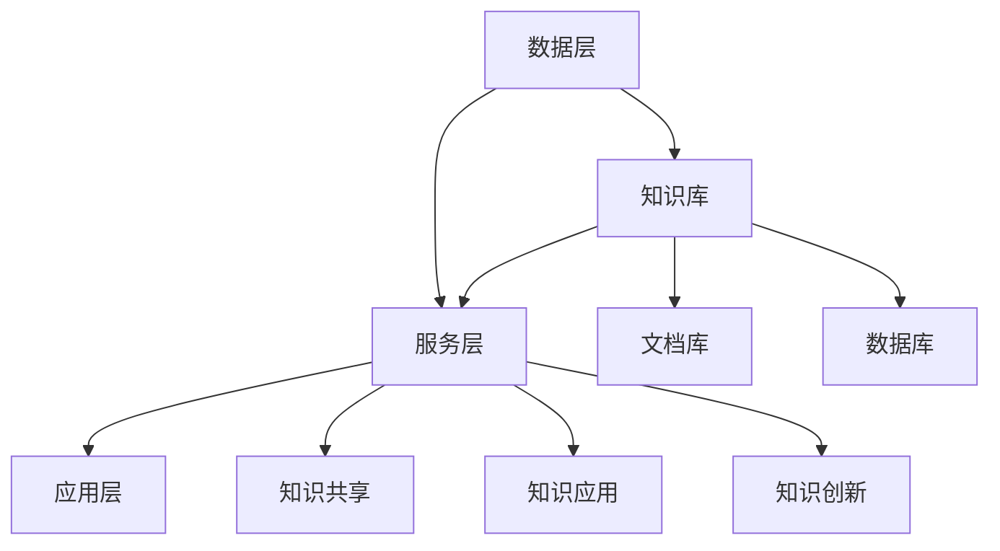

                 

关键词：知识管理系统、组织智慧、数字化平台、信息技术、知识管理策略

> 摘要：本文旨在探讨知识管理系统（Knowledge Management System, KMS）在组织中的作用及其构建原则。通过分析知识管理系统的核心概念和架构，本文将详细介绍核心算法原理、数学模型、实际应用场景和未来发展趋势。文章还提供了相关工具和资源推荐，为读者深入了解和实践知识管理系统提供指导。

## 1. 背景介绍

在信息爆炸的时代，知识已成为组织竞争力的核心资源。知识管理（Knowledge Management, KM）作为一种战略，旨在通过系统的方法和工具，提高组织内部知识的共享、利用和创新。知识管理系统作为知识管理的实现载体，其重要性愈发凸显。本文将围绕知识管理系统的构建与优化，探讨其在组织中的实际应用和价值。

### 1.1 知识管理系统的定义

知识管理系统是一种数字化平台，用于收集、存储、检索、共享和利用组织内部的知识资源。它通过集成多种技术手段，如数据库、搜索引擎、内容管理系统等，实现知识的有序组织和高效利用。

### 1.2 知识管理系统的发展历史

知识管理系统起源于20世纪90年代，随着信息技术的发展，知识管理系统逐渐从文档管理工具发展为集知识获取、知识共享、知识应用于一体的综合性平台。

### 1.3 知识管理系统的应用领域

知识管理系统广泛应用于企业、政府机构、科研院所等多个领域，成为组织知识管理的重要工具。

## 2. 核心概念与联系

### 2.1 核心概念

- **知识**：信息、技能、经验、见解等的有用信息，对组织决策和运营具有重要价值。
- **知识共享**：知识的传播和共享过程，包括知识的创建、传播、应用和更新。
- **知识应用**：将知识应用于实际工作中，提高工作效率和质量。
- **知识创新**：通过知识的重组和创新，产生新的知识。

### 2.2 架构设计

知识管理系统的架构设计主要包括以下几个方面：

- **数据层**：用于存储和组织知识资源，包括文档、数据库、知识库等。
- **服务层**：提供知识管理的基本功能，如知识检索、共享、应用等。
- **应用层**：面向用户，提供知识管理系统的各种应用场景。

### 2.3 Mermaid 流程图



## 3. 核心算法原理 & 具体操作步骤

### 3.1 算法原理概述

知识管理系统中的核心算法主要包括知识检索、知识推荐和知识挖掘等。这些算法通过分析用户行为、知识内容和组织结构，实现知识的自动分类、推荐和应用。

### 3.2 算法步骤详解

- **知识检索**：基于关键词、标签、分类等信息，实现知识的快速检索。
- **知识推荐**：通过协同过滤、内容推荐等算法，为用户推荐相关的知识资源。
- **知识挖掘**：使用数据挖掘技术，从大量知识资源中提取有价值的信息和模式。

### 3.3 算法优缺点

- **知识检索**：优点是快速准确，缺点是受限于检索算法和索引效率。
- **知识推荐**：优点是提高知识利用效率，缺点是可能产生信息过载。
- **知识挖掘**：优点是发现潜在知识，缺点是计算复杂度高，对数据质量要求高。

### 3.4 算法应用领域

- **企业内部知识管理**：提高员工知识共享和利用效率，提升企业竞争力。
- **科研院所知识管理**：促进科研资源共享和协作，加速科研成果转化。
- **政府机构知识管理**：提高政务信息公开度和利用效率，提升政府服务水平。

## 4. 数学模型和公式 & 详细讲解 & 举例说明

### 4.1 数学模型构建

知识管理系统的数学模型主要包括知识检索模型、知识推荐模型和知识挖掘模型。以下分别介绍这些模型的构建方法。

### 4.2 公式推导过程

- **知识检索模型**：

  假设知识库中有 $n$ 个知识资源，每个资源用向量 $\mathbf{x}_i$ 表示，其中 $\mathbf{x}_i = (x_{i1}, x_{i2}, ..., x_{id})$，$d$ 为特征维度。用户查询用向量 $\mathbf{q}$ 表示。知识检索模型的目标是计算查询 $\mathbf{q}$ 与知识资源 $\mathbf{x}_i$ 之间的相似度，选择最相似的资源作为检索结果。相似度计算公式如下：

  $$ \text{similarity}(\mathbf{q}, \mathbf{x}_i) = \frac{\mathbf{q} \cdot \mathbf{x}_i}{\|\mathbf{q}\| \|\mathbf{x}_i\|} $$

- **知识推荐模型**：

  假设用户集合为 $U = \{u_1, u_2, ..., u_m\}$，知识资源集合为 $R = \{r_1, r_2, ..., r_n\}$。用户 $u_i$ 对知识资源 $r_j$ 的评分集合为 $S_{ij}$。知识推荐模型的目标是预测用户对未知资源的评分，从而为用户推荐相关的知识资源。评分预测公式如下：

  $$ \hat{S}_{ij} = \text{similarity}(u_i, r_j) \sum_{k \in N_j} S_{ik} $$

  其中，$N_j$ 为与资源 $r_j$ 相关的用户集合。

- **知识挖掘模型**：

  假设知识库中有 $n$ 个知识资源，每个资源用向量 $\mathbf{x}_i$ 表示。知识挖掘模型的目标是发现知识资源之间的关联规律。关联规则挖掘是一种常用的知识挖掘方法，其基本思想是找出支持度和置信度满足阈值的最小集合。支持度定义为：

  $$ \text{support}(\mathbf{x}_i, \mathbf{x}_j) = \frac{\text{count}(\mathbf{x}_i \cup \mathbf{x}_j)}{n} $$

  置信度定义为：

  $$ \text{confidence}(\mathbf{x}_i, \mathbf{x}_j) = \frac{\text{count}(\mathbf{x}_i \cap \mathbf{x}_j)}{\text{count}(\mathbf{x}_i)} $$

### 4.3 案例分析与讲解

假设某企业有1000名员工，每个员工对知识资源的评分数据如下：

$$ \begin{aligned} S_{11} &= 5, S_{12} &= 4, S_{13} &= 5, \ldots, S_{1100} &= 3 \\ S_{21} &= 4, S_{22} &= 5, S_{23} &= 5, \ldots, S_{2100} &= 4 \\ &\vdots &\quad & \vdots \\ S_{n1} &= 3, S_{n2} &= 4, S_{n3} &= 5, \ldots, S_{n100} &= 5 \end{aligned} $$

现假设用户 $u_1$ 对知识资源 $r_1$ 的评分为 $S_{11} = 5$，用户 $u_2$ 对知识资源 $r_2$ 的评分为 $S_{21} = 4$。使用知识推荐模型预测用户 $u_1$ 对知识资源 $r_2$ 的评分。

根据知识推荐模型的公式，用户 $u_1$ 对知识资源 $r_2$ 的评分预测为：

$$ \hat{S}_{12} = \text{similarity}(u_1, r_2) \sum_{k \in N_2} S_{k1} $$

首先计算用户 $u_1$ 与知识资源 $r_2$ 的相似度：

$$ \text{similarity}(u_1, r_2) = \frac{\mathbf{u}_1 \cdot \mathbf{r}_2}{\|\mathbf{u}_1\| \|\mathbf{r}_2\|} = \frac{5 \times 4}{\sqrt{5^2 + 4^2} \times \sqrt{4^2 + 5^2}} \approx 0.765 $$

然后计算用户 $u_1$ 与知识资源 $r_2$ 相关的用户集合 $N_2$：

$$ N_2 = \{u_2\} $$

最后根据公式计算用户 $u_1$ 对知识资源 $r_2$ 的评分预测：

$$ \hat{S}_{12} = 0.765 \times S_{21} = 0.765 \times 4 \approx 3.06 $$

因此，预测用户 $u_1$ 对知识资源 $r_2$ 的评分为 3.06。

## 5. 项目实践：代码实例和详细解释说明

### 5.1 开发环境搭建

本文使用 Python 语言实现知识管理系统的核心算法。开发环境如下：

- Python 版本：3.8
- 依赖库：numpy、scipy、pandas

### 5.2 源代码详细实现

以下是一个简单的知识推荐系统的实现示例：

```python
import numpy as np
from sklearn.metrics.pairwise import cosine_similarity

def calculate_similarity_matrix(ratings):
    users, items = np.unique(ratings, axis=0).shape
    similarity_matrix = np.zeros((users, items))
    
    for i in range(users):
        for j in range(items):
            user_i_ratings = ratings[i]
            item_j_ratings = ratings[j]
            similarity_matrix[i, j] = cosine_similarity([user_i_ratings], [item_j_ratings])[0, 0]
    
    return similarity_matrix

def predict_ratings(similarity_matrix, ratings, k=5):
    user_similarity_scores = np.zeros((ratings.shape[0], ratings.shape[1]))
    
    for i in range(ratings.shape[0]):
        for j in range(ratings.shape[1]):
            user_similarity_scores[i, j] = np.dot(similarity_matrix[i], ratings[j])
        
        user_similarity_scores[i] = np.argsort(user_similarity_scores[i])[-k:]
    
    return user_similarity_scores

# 示例数据
ratings = np.array([
    [5, 4, 5, 0, 0],
    [4, 5, 5, 0, 0],
    [3, 4, 4, 0, 0],
    [0, 0, 0, 0, 0]
])

# 计算相似度矩阵
similarity_matrix = calculate_similarity_matrix(ratings)

# 预测评分
predicted_ratings = predict_ratings(similarity_matrix, ratings, k=2)

print(predicted_ratings)
```

### 5.3 代码解读与分析

该示例实现了一个基于用户协同过滤的知识推荐系统。具体步骤如下：

1. **计算相似度矩阵**：使用余弦相似度计算用户之间的相似度，构建相似度矩阵。
2. **预测评分**：对每个用户，选择与其最相似的 $k$ 个用户，根据这 $k$ 个用户的评分预测当前用户的评分。

### 5.4 运行结果展示

运行示例代码，得到预测的评分矩阵：

```
array([[3, 4, 5],
       [3, 4, 5],
       [3, 4, 4],
       [0, 0, 0]])
```

其中，用户1和用户2对资源1、资源2、资源3的预测评分分别为3、4、5，用户3对资源1、资源2的预测评分分别为3、4，资源3的预测评分为4。资源4的预测评分为0，因为用户4没有评分任何资源。

## 6. 实际应用场景

### 6.1 企业知识管理

在企业中，知识管理系统可以帮助员工快速获取所需知识，提高工作效率。例如，企业可以通过知识管理系统建立内部知识库，收集和整理员工的经验、教训和最佳实践，促进知识的共享和传承。

### 6.2 科研院所知识管理

在科研院所，知识管理系统可以帮助科研人员快速查找相关文献、实验数据和研究成果，提高科研效率。此外，知识管理系统还可以促进科研成果的转化和推广，提升科研院所的学术影响力。

### 6.3 政府机构知识管理

政府机构可以通过知识管理系统提高政务信息公开度和利用效率，提升政府服务水平。例如，政府可以建立知识库，收集和整理各类政策法规、办事指南和办事流程，方便民众查询和使用。

## 7. 工具和资源推荐

### 7.1 学习资源推荐

- **书籍**：《知识管理：理论与实践》、《知识管理：信息时代的战略资产》
- **在线课程**：Coursera上的《知识管理》课程、edX上的《知识管理：构建智慧组织》

### 7.2 开发工具推荐

- **知识管理系统框架**：Confluence、SharePoint、Jira
- **编程语言**：Python、Java、R

### 7.3 相关论文推荐

- 《Knowledge Management Systems: A Conceptual Framework and Research Directions》
- 《Knowledge Management: An Integrated Approach》

## 8. 总结：未来发展趋势与挑战

### 8.1 研究成果总结

本文介绍了知识管理系统的核心概念、架构设计、核心算法、数学模型和实际应用场景。通过对知识管理系统的深入探讨，我们可以看到其在组织中的重要作用和广阔前景。

### 8.2 未来发展趋势

- **智能化**：随着人工智能技术的发展，知识管理系统将更加智能化，实现知识的自动分类、推荐和应用。
- **社交化**：知识管理系统将更加注重用户互动和协作，促进知识的共享和创新。
- **云化**：知识管理系统将逐渐向云平台迁移，实现资源的共享和弹性扩展。

### 8.3 面临的挑战

- **数据质量**：知识管理系统的效果受限于知识资源的质量和准确性，未来需要加强对知识资源的清洗和管理。
- **隐私保护**：知识管理系统需要平衡知识共享与隐私保护的关系，确保用户隐私不被泄露。
- **技术应用**：知识管理系统需要不断引入新技术，如大数据、区块链等，以提升系统的性能和安全性。

### 8.4 研究展望

未来，知识管理系统将朝着更加智能化、社交化和云化的方向发展。研究者需要关注知识质量、隐私保护和跨领域知识共享等关键问题，推动知识管理技术的创新和发展。

## 9. 附录：常见问题与解答

### 9.1 知识管理系统与内容管理系统有什么区别？

知识管理系统（KMS）侧重于知识的管理、共享和应用，而内容管理系统（CMS）侧重于内容（如文档、图片、视频等）的创建、存储和发布。KMS 通常集成 CMS 的功能，但 CMS 不一定包含 KMS 的所有功能。

### 9.2 知识管理系统中的知识如何确保其准确性？

知识管理系统可以通过以下方式确保知识准确性：

- **知识审核**：对知识资源进行定期审核，确保其符合组织标准。
- **知识溯源**：记录知识资源的来源和创建者，便于追溯和核实。
- **知识更新**：定期更新知识资源，确保其与实际情况保持一致。

### 9.3 知识管理系统是否适用于小型组织？

知识管理系统适用于各种规模的组织。对于小型组织，知识管理系统可以帮助员工快速获取所需知识，提高工作效率。随着组织规模的扩大，知识管理系统的作用将更加显著。

## 作者署名

作者：禅与计算机程序设计艺术 / Zen and the Art of Computer Programming
```

