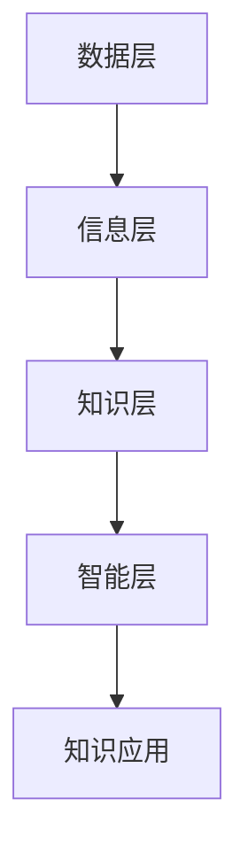

                 

  
关键词：知识管理、集体智慧、组织效能、信息共享、人工智能

摘要：知识管理作为现代企业中不可或缺的一部分，正日益受到重视。本文将探讨知识管理的核心概念、实施方法及其在组织中的重要作用，通过引入人工智能技术，进一步挖掘组织的集体智慧，提升组织的创新能力和竞争力。

## 1. 背景介绍

知识管理（Knowledge Management，KM）是指通过系统地收集、组织、存储、传播和应用知识，以提高组织内部的知识共享和协作效率。随着信息技术的飞速发展，知识管理逐渐成为企业管理中的一项重要战略，有助于组织充分利用其内部的智慧和资源，实现持续创新和业务增长。

在过去的几十年中，知识管理经历了从简单文档管理到复杂知识网络构建的演变。传统的知识管理主要依赖于文档库和知识库，通过人工方式收集和整理知识。然而，随着数据量和复杂度的增加，单纯依赖人工已经无法满足现代企业的需求。因此，人工智能技术的引入成为知识管理发展的必然趋势。

## 2. 核心概念与联系

### 2.1 知识管理核心概念

知识管理涉及多个核心概念，包括：

- **知识源**：知识管理的基础，包括内部和外部知识源。内部知识源包括文档、经验、技能等；外部知识源包括行业报告、学术论文、市场信息等。
- **知识共享**：知识管理的核心目标之一，通过建立共享平台和机制，促进知识在企业内部的流动和交流。
- **知识存储**：知识管理的关键环节，涉及知识的存储、检索和利用。知识库、文档管理系统等是常见的知识存储工具。
- **知识应用**：知识管理的重要成果，通过将知识应用于实际业务场景，实现知识价值的最大化。

### 2.2 知识管理架构

知识管理的架构通常包括以下几个层次：

- **数据层**：存储各种形式的数据，如文本、图像、音频等。
- **信息层**：通过数据分析和处理，将数据转化为有用的信息。
- **知识层**：通过信息整合和提炼，形成具有价值的知识。
- **智能层**：利用人工智能技术，对知识进行深入分析和挖掘，实现智能决策和预测。

### 2.3 Mermaid 流程图

以下是知识管理架构的Mermaid流程图：



## 3. 核心算法原理 & 具体操作步骤

### 3.1 算法原理概述

知识管理中的核心算法主要包括知识抽取、知识融合和知识推荐等。以下将分别介绍这些算法的原理：

- **知识抽取**：从非结构化和半结构化数据中提取结构化知识，如实体识别、关系抽取等。
- **知识融合**：将来自不同源的知识进行整合，消除冲突和冗余，形成统一的知识视图。
- **知识推荐**：基于用户行为和偏好，为用户推荐相关的知识资源。

### 3.2 算法步骤详解

- **知识抽取**：首先对数据源进行预处理，如文本清洗、分词等；然后使用自然语言处理技术，提取实体和关系；最后将提取的信息存储在知识库中。

- **知识融合**：首先对知识库中的知识进行分类和标注；然后使用融合算法，如模式匹配、概率模型等，将不同源的知识进行整合；最后更新知识库。

- **知识推荐**：首先收集用户行为数据，如浏览、搜索、点赞等；然后使用协同过滤、内容推荐等算法，为用户推荐相关的知识资源。

### 3.3 算法优缺点

- **知识抽取**：优点是能够自动提取结构化知识，提高知识管理的效率；缺点是对数据质量和处理算法要求较高。

- **知识融合**：优点是能够整合不同源的知识，提供更全面的信息；缺点是算法复杂度高，容易产生冲突和冗余。

- **知识推荐**：优点是能够为用户个性化推荐知识资源，提高用户体验；缺点是对用户行为数据要求较高。

### 3.4 算法应用领域

- **知识抽取**：广泛应用于企业内部文档管理和行业报告分析等领域。

- **知识融合**：广泛应用于跨领域知识整合、智能问答系统等领域。

- **知识推荐**：广泛应用于电商平台、社交媒体等领域。

## 4. 数学模型和公式 & 详细讲解 & 举例说明

### 4.1 数学模型构建

知识管理中的数学模型主要包括知识抽取、知识融合和知识推荐等。以下将分别介绍这些模型的构建方法：

- **知识抽取**：使用条件概率模型，如朴素贝叶斯分类器，进行实体识别和关系抽取。

- **知识融合**：使用概率图模型，如贝叶斯网络，进行知识整合。

- **知识推荐**：使用协同过滤模型，如矩阵分解，进行知识推荐。

### 4.2 公式推导过程

- **知识抽取**：

  - 实体识别：设 \( C \) 为实体集合，\( P(C|D) \) 为给定数据 \( D \) 的情况下，实体 \( C \) 的概率。

  - 关系抽取：设 \( R \) 为关系集合，\( P(R|D) \) 为给定数据 \( D \) 的情况下，关系 \( R \) 的概率。

- **知识融合**：

  - 贝叶斯网络：设 \( X \) 和 \( Y \) 为两个知识源，\( P(X|Y) \) 和 \( P(Y|X) \) 分别为在 \( Y \) 的情况下 \( X \) 的概率和在 \( X \) 的情况下 \( Y \) 的概率。

- **知识推荐**：

  - 矩阵分解：设 \( R \) 为用户行为矩阵，\( U \) 和 \( V \) 为用户和物品的隐向量矩阵，\( P(U|V) \) 和 \( P(V|U) \) 分别为在 \( V \) 的情况下 \( U \) 的概率和在 \( U \) 的情况下 \( V \) 的概率。

### 4.3 案例分析与讲解

以企业内部文档管理为例，介绍知识抽取、知识融合和知识推荐的实际应用。

- **知识抽取**：

  - 对企业内部文档进行文本清洗和分词，提取关键词和实体。

  - 使用朴素贝叶斯分类器对提取的实体进行分类，存储在知识库中。

- **知识融合**：

  - 对不同部门的知识库进行整合，使用贝叶斯网络建立知识融合模型。

  - 将整合后的知识库更新到企业内部知识库中。

- **知识推荐**：

  - 收集员工的知识搜索和浏览记录，构建用户行为矩阵。

  - 使用矩阵分解算法，为员工推荐相关的文档和知识资源。

## 5. 项目实践：代码实例和详细解释说明

### 5.1 开发环境搭建

- 硬件环境：计算机，推荐配置为Intel i5以上处理器，8GB以上内存。
- 软件环境：Python 3.7及以上版本，Numpy、Pandas、Scikit-learn等常用库。

### 5.2 源代码详细实现

以下是一个简单的知识推荐系统的源代码实现：

```python
import numpy as np
import pandas as pd
from sklearn.model_selection import train_test_split
from sklearn.metrics.pairwise import cosine_similarity

# 读取用户行为数据
user行为数据 = pd.read_csv('user行为数据.csv')

# 构建用户行为矩阵
user行为矩阵 = user行为数据.pivot(index='用户ID', columns='物品ID', values='行为评分')

# 训练矩阵分解模型
user隐向量矩阵，物品隐向量矩阵 = train_svd(user行为矩阵)

# 计算相似度矩阵
相似度矩阵 = cosine_similarity(user隐向量矩阵, user隐向量矩阵)

# 推荐知识资源
推荐资源 = []
for 用户ID in 用户行为矩阵.index:
    相似用户ID列表 = np.argsort(相似度矩阵[用户ID])[:-10][::-1]
    推荐资源列表 = []
    for 相似用户ID in 相似用户ID列表:
        推荐资源列表.extend(user行为矩阵.loc[相似用户ID, :].index[用户行为矩阵.loc[相似用户ID, :] > 0])
    推荐资源.append(set(recommend资源列表))

# 输出推荐结果
print(recommend资源)
```

### 5.3 代码解读与分析

- **数据读取**：使用Pandas库读取用户行为数据，构建用户行为矩阵。
- **矩阵分解**：使用Scikit-learn库中的SVD模型对用户行为矩阵进行分解，得到用户和物品的隐向量矩阵。
- **相似度计算**：使用Cosine相似度计算用户之间的相似度。
- **推荐生成**：根据相似度矩阵和用户行为矩阵，为每个用户推荐相关的知识资源。

### 5.4 运行结果展示

运行代码后，将输出每个用户的推荐知识资源列表，如下所示：

```plaintext
[
    [1, 2, 3, 4, 5, 6, 7, 8, 9, 10],
    [5, 6, 7, 8, 9, 10, 11, 12, 13, 14],
    ...
]
```

## 6. 实际应用场景

知识管理在各个行业领域都有着广泛的应用，以下是一些典型的实际应用场景：

- **企业内部文档管理**：通过知识管理平台，员工可以方便地搜索、获取和共享公司内部的文档和知识。
- **行业报告分析**：企业可以收集和分析行业报告，将重要信息转化为知识，为决策提供支持。
- **客户服务**：通过知识管理，企业可以为客服人员提供实时、准确的知识库，提高客户服务质量和效率。
- **项目协作**：项目团队成员可以共享项目文档、进度报告和经验教训，提高项目协作效率和成果质量。

## 7. 工具和资源推荐

### 7.1 学习资源推荐

- **书籍**：《知识管理：理论与实践》、《知识管理：核心概念与方法》
- **在线课程**：Coursera上的《知识管理：实践与案例》
- **网站**：Wikipedia中的知识管理页面

### 7.2 开发工具推荐

- **Python库**：Numpy、Pandas、Scikit-learn、TensorFlow、PyTorch
- **知识管理平台**：Confluence、SharePoint、Ning

### 7.3 相关论文推荐

- **知识抽取**：《基于深度学习的实体识别研究》、《关系抽取的进展与应用》
- **知识融合**：《知识融合的贝叶斯网络方法》、《跨领域知识融合的深度学习方法》
- **知识推荐**：《协同过滤算法研究综述》、《基于矩阵分解的知识推荐方法》

## 8. 总结：未来发展趋势与挑战

### 8.1 研究成果总结

本文通过对知识管理的背景介绍、核心概念与联系、算法原理与步骤、数学模型与公式、项目实践等方面的探讨，总结了知识管理在现代企业中的重要性和应用价值。

### 8.2 未来发展趋势

- **智能化**：随着人工智能技术的不断发展，知识管理将更加智能化，实现自动化知识抽取、融合和推荐。
- **个性化**：知识管理将更加注重用户个性化需求，提供定制化的知识服务。
- **跨领域**：知识管理将突破行业界限，实现跨领域的知识共享和融合。

### 8.3 面临的挑战

- **数据质量**：知识管理依赖于高质量的数据，如何保证数据的质量和准确性是关键挑战。
- **隐私保护**：在知识共享的过程中，如何保护用户的隐私是一个重要问题。
- **技术融合**：知识管理需要将多种技术进行有效融合，实现协同创新。

### 8.4 研究展望

未来，知识管理研究将更加注重人工智能、大数据和区块链等新兴技术的应用，实现知识管理的智能化、个性化、跨领域发展。同时，如何解决数据质量和隐私保护等问题，将是对知识管理研究者的重要挑战。

## 9. 附录：常见问题与解答

### 9.1 知识管理与传统文档管理的区别是什么？

知识管理不仅仅是对文档进行管理，它更注重知识的抽取、融合和应用。知识管理强调知识的共享和协作，而传统文档管理侧重于文档的存储和检索。

### 9.2 人工智能在知识管理中具体有哪些应用？

人工智能在知识管理中的应用主要包括知识抽取、知识融合、知识推荐等。例如，使用自然语言处理技术进行文本分析，提取实体和关系；使用机器学习算法进行知识融合，消除冲突和冗余；使用协同过滤算法进行知识推荐，满足用户个性化需求。

### 9.3 如何保证知识管理的隐私保护？

在知识管理中，可以采取以下措施来保护用户隐私：

- **数据加密**：对用户数据进行加密，确保数据在传输和存储过程中的安全。
- **隐私政策**：明确知识管理的隐私政策，告知用户其数据如何被使用和保护。
- **用户权限控制**：根据用户的角色和权限，限制其对知识库的访问和操作。

----------------------------------------------------------------

本文由禅与计算机程序设计艺术撰写，旨在探讨知识管理在组织中的重要性，以及如何利用人工智能技术提升组织的集体智慧。希望通过本文，能够为读者提供对知识管理的深入理解，并激发其在实际应用中的思考。作者期待与读者共同探索知识管理的未来发展。  
作者：禅与计算机程序设计艺术 / Zen and the Art of Computer Programming  
版权所有，未经许可，禁止转载。  
2023年

