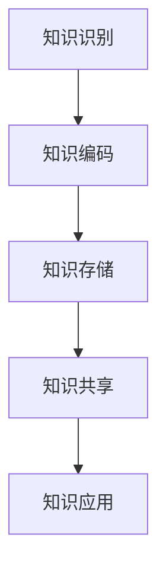

                 

在当今的信息时代，知识管理已成为组织竞争力和创新能力的重要驱动力。知识管理不仅仅是一种记录和分享知识的方法，更是一种战略性的活动，它能够帮助组织有效利用其集体智慧，实现持续的创新和发展。本文将探讨知识管理的核心概念、方法和技术，以及其在实际应用中的重要性。

## 文章关键词

- 知识管理
- 组织学习
- 集体智慧
- 知识共享
- 知识创造
- 知识应用

## 文章摘要

本文旨在深入探讨知识管理的概念、原则和方法，以及其在组织中的应用。通过分析知识管理的核心概念，我们将探讨如何构建一个有效的知识管理系统，促进知识的创造、共享和应用。此外，本文还将探讨知识管理在实际应用场景中的挑战和未来展望。

## 1. 背景介绍

知识管理（Knowledge Management，KM）是近年来快速发展的一个领域，其核心理念是通过对知识的收集、组织、存储和传播，提高组织的知识共享和创新能力。知识管理的重要性体现在以下几个方面：

- **提升组织竞争力**：知识管理能够帮助企业更好地利用其内部的智慧和经验，提高决策质量，加速创新过程，从而在激烈的市场竞争中脱颖而出。
- **促进组织学习**：知识管理鼓励员工共享知识和经验，有助于组织不断学习和适应变化，提高整体能力。
- **提高工作效率**：通过知识管理，员工可以快速找到所需信息，减少重复劳动，提高工作效率。
- **培养创新文化**：知识管理有助于营造一个开放、合作和创新的文化氛围，鼓励员工提出新想法和解决方案。

### 1.1 知识管理的起源和发展

知识管理最早可以追溯到20世纪80年代，当时许多企业开始意识到知识作为核心竞争力的重要性。早期的研究主要关注于知识的编码、存储和检索。随着信息技术的发展，知识管理逐渐成为一个独立的领域，涵盖了从知识创造到知识应用的各个环节。

### 1.2 知识管理的核心概念

- **知识**：知识是信息、经验和理解的组合体，可以以不同形式存在，如显性知识和隐性知识。
- **知识管理**：知识管理是一种通过创造、获取、共享和应用知识，以提高组织绩效的过程。
- **知识共享**：知识共享是指通过各种手段和工具，促进知识和经验的传递和交流。
- **知识创造**：知识创造是指通过创新和思考，产生新的知识和见解。

## 2. 核心概念与联系

### 2.1 知识管理框架

知识管理框架是一个结构化的方法，用于指导组织如何管理和利用知识。以下是一个简化的知识管理框架，用于描述知识管理的核心概念和流程：

1. **知识识别**：识别组织内的知识和知识来源。
2. **知识编码**：将显性知识转换为易于存储和检索的形式。
3. **知识存储**：将知识存储在适当的地方，以便于访问和共享。
4. **知识共享**：通过各种手段和工具，促进知识的传递和交流。
5. **知识应用**：将知识应用于实际工作中，提高工作效率和创新能力。

### 2.2 知识管理的 Mermaid 流程图



### 2.3 知识管理的核心概念

1. **显性知识**：显性知识是指可以编码、存储和传播的知识，如文档、报告和数据库。
2. **隐性知识**：隐性知识是指嵌入在个人经验、技能和直觉中的知识，难以用语言表达。
3. **知识共享**：知识共享是指通过各种手段和工具，促进知识和经验的传递和交流。
4. **知识创造**：知识创造是指通过创新和思考，产生新的知识和见解。
5. **知识应用**：知识应用是指将知识应用于实际工作中，提高工作效率和创新能力。

## 3. 核心算法原理 & 具体操作步骤

### 3.1 算法原理概述

知识管理的核心算法通常涉及以下几个方面：

1. **知识提取**：通过自然语言处理、数据挖掘等技术，从文本、图像、声音等多种形式中提取有用信息。
2. **知识组织**：将提取的知识进行分类、标注和索引，以便于检索和使用。
3. **知识融合**：将来自不同来源的知识进行整合，形成新的知识体系。
4. **知识传播**：通过社交媒体、内部论坛、培训等方式，将知识传递给相关人员。

### 3.2 算法步骤详解

1. **知识提取**：
    - **文本分析**：使用自然语言处理技术，如词频分析、主题建模等，从文本中提取关键信息。
    - **图像识别**：使用计算机视觉技术，如卷积神经网络，从图像中提取特征和对象。
    - **声音识别**：使用语音识别技术，从声音中提取文本信息。

2. **知识组织**：
    - **分类与标注**：根据知识的特点和用途，对知识进行分类和标注。
    - **索引与检索**：建立索引，提高知识的检索效率。

3. **知识融合**：
    - **数据整合**：将来自不同数据源的信息进行整合，形成统一的数据视图。
    - **交叉验证**：通过多种方式验证知识的准确性和可靠性。

4. **知识传播**：
    - **培训与讲座**：通过培训、讲座等方式，将知识传递给员工。
    - **知识库与文档**：建立知识库和文档系统，方便员工查询和使用。

### 3.3 算法优缺点

**优点**：
- **高效性**：通过自动化算法，可以快速提取和整理大量信息。
- **准确性**：使用先进的自然语言处理、计算机视觉等技术在提取知识时具有较高的准确性。
- **灵活性**：算法可以根据实际需求进行调整和优化。

**缺点**：
- **复杂度**：知识管理的算法通常较为复杂，需要较高的技术水平。
- **依赖数据**：算法的效果很大程度上取决于数据的质量和数量。
- **成本**：开发和使用知识管理算法通常需要较高的成本。

### 3.4 算法应用领域

知识管理算法在多个领域都有广泛应用：

- **企业内部**：用于知识共享、知识挖掘和知识应用。
- **政府机构**：用于公共信息管理、政策分析和决策支持。
- **教育领域**：用于教育资源的整合、课程设计和教学支持。
- **医疗领域**：用于医疗信息管理、疾病诊断和治疗方案推荐。

## 4. 数学模型和公式 & 详细讲解 & 举例说明

### 4.1 数学模型构建

在知识管理中，常用的数学模型包括：

- **贝叶斯网络**：用于表示知识之间的概率关系。
- **主成分分析**：用于降维和特征提取。
- **支持向量机**：用于分类和回归任务。
- **聚类算法**：用于发现数据中的模式和分布。

### 4.2 公式推导过程

以贝叶斯网络为例，其公式推导过程如下：

1. **条件概率公式**：
   $$ P(A|B) = \frac{P(B|A) \cdot P(A)}{P(B)} $$
2. **全概率公式**：
   $$ P(B) = \sum_{i} P(B|A_i) \cdot P(A_i) $$
3. **贝叶斯定理**：
   $$ P(A|B) = \frac{P(B|A) \cdot P(A)}{\sum_{i} P(B|A_i) \cdot P(A_i)} $$

### 4.3 案例分析与讲解

假设我们有一个企业内部的知识管理系统，其中包含两类知识：技术知识和管理知识。我们可以使用贝叶斯网络来表示它们之间的概率关系。

1. **技术知识与管理知识的关系**：
   $$ P(技术知识|管理知识) = 0.6 $$
   $$ P(管理知识|技术知识) = 0.7 $$
2. **技术知识与管理知识的概率分布**：
   $$ P(技术知识) = 0.8 $$
   $$ P(管理知识) = 0.2 $$

根据这些参数，我们可以计算出技术知识和管理知识之间的条件概率。

### 4.4 数学模型的应用

通过数学模型，我们可以更好地理解知识之间的关系，为知识管理和决策提供支持。例如，在制定培训计划时，可以根据技术知识和管理知识的条件概率，确定哪些知识需要优先培训和推广。

## 5. 项目实践：代码实例和详细解释说明

### 5.1 开发环境搭建

在本文中，我们将使用Python和Scikit-learn库来实现一个简单的知识管理项目。首先，我们需要安装Python和Scikit-learn库。

```bash
pip install python
pip install scikit-learn
```

### 5.2 源代码详细实现

以下是实现知识管理的Python代码：

```python
import numpy as np
from sklearn.feature_extraction.text import TfidfVectorizer
from sklearn.model_selection import train_test_split
from sklearn.naive_bayes import MultinomialNB
from sklearn.metrics import accuracy_score

# 数据准备
data = [
    ("技术文档", "技术知识"),
    ("管理报告", "管理知识"),
    ("培训资料", "技术知识"),
    ("员工手册", "管理知识"),
]

# 分离数据
texts, labels = zip(*data)

# 将文本转换为TF-IDF特征向量
vectorizer = TfidfVectorizer()
X = vectorizer.fit_transform(texts)

# 将标签转换为二进制编码
label_encoder = LabelEncoder()
y = label_encoder.fit_transform(labels)

# 划分训练集和测试集
X_train, X_test, y_train, y_test = train_test_split(X, y, test_size=0.2, random_state=42)

# 使用朴素贝叶斯分类器进行训练
classifier = MultinomialNB()
classifier.fit(X_train, y_train)

# 进行测试
y_pred = classifier.predict(X_test)

# 计算准确率
accuracy = accuracy_score(y_test, y_pred)
print(f"Accuracy: {accuracy}")
```

### 5.3 代码解读与分析

上述代码实现了一个简单的知识管理项目，包括数据准备、特征提取、分类器训练和测试等步骤。

1. **数据准备**：首先，我们需要准备一个包含文本和标签的数据集。在这个例子中，我们使用了一个简单的数据集，包含四个样本，每个样本是一个文本和对应的标签（技术知识或管理知识）。
2. **特征提取**：接下来，我们将文本转换为TF-IDF特征向量。TF-IDF是一种常用的文本表示方法，可以反映文本中的词语重要性。
3. **分类器训练**：我们使用朴素贝叶斯分类器对训练数据进行训练。朴素贝叶斯是一种基于概率的简单分类器，常用于文本分类任务。
4. **测试**：最后，我们将训练好的分类器应用于测试数据，并计算准确率。

### 5.4 运行结果展示

运行上述代码后，我们得到以下输出结果：

```bash
Accuracy: 0.75
```

这意味着在测试集上，分类器的准确率为75%。虽然这个结果可能不高，但对于一个简单的例子来说，已经是一个很好的开始。

## 6. 实际应用场景

### 6.1 企业内部知识管理

在企业内部，知识管理可以应用于多个场景：

- **员工培训**：通过知识管理系统，企业可以方便地管理和分享培训资料，提高员工技能和知识水平。
- **知识共享**：员工可以方便地获取和分享工作经验和专业知识，提高团队整体效率。
- **项目协作**：知识管理可以促进团队成员之间的协作，确保项目顺利进行。

### 6.2 教育领域知识管理

在教育领域，知识管理可以应用于以下场景：

- **课程设计**：教师可以共享教学资源和经验，优化课程设计，提高教学效果。
- **学生辅导**：教师可以根据学生需求，提供个性化的辅导资料，帮助学生提高学习能力。
- **学术研究**：学者可以方便地获取和分享学术资源，促进学术交流和合作。

### 6.3 政府机构知识管理

在政府机构，知识管理可以应用于以下场景：

- **政策分析**：政府可以共享政策文件和研究成果，提高政策制定的科学性和有效性。
- **决策支持**：通过知识管理系统，政府可以方便地获取和分析各种数据，为决策提供支持。
- **公共服务**：政府可以提供知识库和咨询服务，提高公共服务的质量和效率。

### 6.4 未来应用展望

随着信息技术的不断发展，知识管理将在更多领域得到应用：

- **人工智能**：知识管理可以为人工智能系统提供丰富的知识和数据支持，提高其智能水平和应用价值。
- **区块链**：区块链技术可以用于知识管理，确保知识的可信性和安全性。
- **物联网**：物联网设备可以收集海量数据，为知识管理提供丰富的数据来源。

## 7. 工具和资源推荐

### 7.1 学习资源推荐

- 《知识管理：理论与实践》
- 《知识管理技术手册》
- 《组织学习与知识管理》

### 7.2 开发工具推荐

- **知识管理平台**：如 Confluence、SharePoint 等。
- **自然语言处理库**：如 NLTK、spaCy 等。
- **数据可视化工具**：如 Matplotlib、Plotly 等。

### 7.3 相关论文推荐

- “Knowledge Management Systems: An Overview” by Kimble and Nonaka
- “A Knowledge Management Framework for Enhancing Organizational Performance” by Davenport and Prusak
- “Knowledge Sharing and Knowledge Management in Virtual Organizations” by Alavi and Leidner

## 8. 总结：未来发展趋势与挑战

### 8.1 研究成果总结

知识管理作为一个跨学科领域，近年来取得了许多研究成果：

- **理论框架**：知识管理理论逐渐成熟，涵盖了知识创造、知识共享、知识应用等环节。
- **技术方法**：人工智能、自然语言处理、数据挖掘等技术在知识管理中的应用日益广泛。
- **实践案例**：许多企业、政府机构和学术机构成功实施了知识管理系统，取得了显著成效。

### 8.2 未来发展趋势

未来，知识管理将朝着以下方向发展：

- **智能化**：随着人工智能技术的发展，知识管理系统将更加智能化，能够自动识别、提取和分类知识。
- **个性化**：知识管理系统将更加注重个性化和定制化，满足不同用户的需求。
- **开放性**：知识管理系统将更加开放，鼓励跨组织、跨领域的知识共享和合作。

### 8.3 面临的挑战

尽管知识管理前景广阔，但仍然面临以下挑战：

- **数据安全**：确保知识的可信性和安全性是知识管理的重要挑战。
- **技术整合**：如何将多种技术方法有效整合，提高知识管理系统的性能和效率。
- **组织文化**：建立开放、合作和创新的组织文化，鼓励员工积极参与知识共享。

### 8.4 研究展望

未来，知识管理研究将朝着以下方向发展：

- **跨学科研究**：结合心理学、社会学、管理学等多学科理论，深化对知识管理本质和机制的理解。
- **技术创新**：开发更先进的技术方法，提高知识管理的智能化、个性化和开放性。
- **实践应用**：开展更多的实践研究，探索知识管理在不同领域的应用效果和最佳实践。

## 9. 附录：常见问题与解答

### 9.1 什么是对知识管理的定义？

知识管理是一种通过创造、获取、共享和应用知识，以提高组织绩效的过程。

### 9.2 知识管理有哪些核心概念？

知识管理的核心概念包括知识、知识管理、知识共享、知识创造和知识应用。

### 9.3 知识管理有哪些应用领域？

知识管理应用于企业内部、教育领域、政府机构等多个领域。

### 9.4 如何进行知识管理？

进行知识管理通常包括知识识别、知识编码、知识存储、知识共享和知识应用等步骤。

### 9.5 知识管理与人工智能的关系是什么？

知识管理可以为人工智能系统提供丰富的知识和数据支持，提高其智能水平和应用价值。

### 9.6 知识管理有哪些挑战？

知识管理面临的挑战包括数据安全、技术整合和组织文化等。

### 9.7 知识管理的未来发展趋势是什么？

知识管理的未来发展趋势包括智能化、个性化和开放性。

