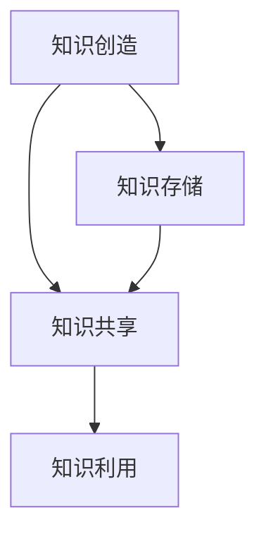

                 

知识管理是当今企业成功的关键因素。在信息化时代，知识已成为组织最宝贵的资产，如何有效地管理和利用这些知识，成为企业面临的重要课题。本文将探讨知识管理的核心概念、算法原理、数学模型、实际应用以及未来发展，旨在为广大企业提供一套完整的知识管理体系。

## 关键词
知识管理、组织智慧、信息共享、知识创造、算法、数学模型、应用场景、未来展望

## 摘要
本文首先介绍了知识管理的背景和重要性，随后详细阐述了知识管理的核心概念，包括知识创造、知识共享、知识利用等。通过一个详细的Mermaid流程图，我们展示了知识管理的基本架构。接着，本文深入分析了知识管理中的核心算法原理，包括数据挖掘、机器学习和知识图谱等技术。在数学模型部分，我们探讨了知识价值评估和知识共享激励机制的设计。随后，本文通过一个实际的项目实践案例，展示了知识管理的具体应用过程。最后，我们展望了知识管理的未来发展趋势和面临的挑战。

## 1. 背景介绍

### 1.1 知识管理的起源与发展

知识管理（Knowledge Management，简称KM）起源于20世纪80年代，最初源于企业对信息和知识的积累、存储和利用的需求。随着信息技术的发展，知识管理逐渐成为企业管理的重要组成部分。

### 1.2 知识管理的定义和目标

知识管理是指通过系统的方法，对知识进行识别、创造、存储、共享、利用和创新的过程。其目标是提高组织的信息化水平，促进知识在企业内部的传播和利用，从而提升组织的竞争力。

### 1.3 知识管理的重要性

知识管理对于企业的成功至关重要。它可以帮助企业：

1. 提高工作效率：通过知识共享，员工可以快速获取所需信息，减少重复劳动。
2. 促进创新：知识管理鼓励知识创新和跨部门合作，有助于企业不断创新。
3. 提高客户满意度：通过知识管理，企业可以更好地了解客户需求，提供个性化服务。
4. 增强团队凝聚力：知识管理有助于团队内部的知识共享和协作，增强团队凝聚力。

## 2. 核心概念与联系

### 2.1 知识创造

知识创造是指通过信息的收集、整理、分析、整合等过程，将原始信息转化为有价值知识的过程。知识创造是知识管理的核心，决定了知识的质量和价值。

### 2.2 知识共享

知识共享是指将知识在企业内部或外部进行传播和共享的过程。知识共享是知识管理的关键环节，决定了知识的利用效率。

### 2.3 知识利用

知识利用是指将知识应用于实际工作，创造价值的过程。知识利用是知识管理的最终目标，决定了知识的实际价值。

### 2.4 知识管理的基本架构

图1：知识管理的基本架构



### 2.5 知识管理的核心概念联系

知识创造、知识共享和知识利用之间存在着密切的联系。知识创造是知识管理的基础，决定了知识的质量和价值。知识共享是知识管理的桥梁，将知识在企业内部或外部进行传播和共享。知识利用是知识管理的最终目标，将知识应用于实际工作，创造价值。

## 3. 核心算法原理 & 具体操作步骤

### 3.1 算法原理概述

知识管理中的核心算法主要包括数据挖掘、机器学习和知识图谱等。

- **数据挖掘**：数据挖掘是从大量数据中提取有价值信息的过程。它通过统计分析和机器学习等方法，从数据中发现规律和模式。
- **机器学习**：机器学习是使计算机能够通过数据和经验自主学习和改进的过程。它包括监督学习、无监督学习和强化学习等。
- **知识图谱**：知识图谱是一种用于表示知识结构的数据模型，它将知识以图的形式进行组织，便于知识的检索和应用。

### 3.2 算法步骤详解

#### 3.2.1 数据挖掘

1. 数据预处理：对原始数据进行分析，去除噪声和异常值，确保数据质量。
2. 特征提取：从原始数据中提取有用的特征，为后续分析提供基础。
3. 模型选择：根据业务需求和数据特点，选择合适的数据挖掘模型。
4. 模型训练：使用训练数据对模型进行训练，调整模型参数。
5. 模型评估：使用测试数据对模型进行评估，确保模型的有效性。

#### 3.2.2 机器学习

1. 数据准备：收集和整理数据，确保数据质量和完整性。
2. 特征工程：对数据进行特征提取和工程，为模型提供合适的输入。
3. 模型选择：根据业务需求和数据特点，选择合适的机器学习模型。
4. 模型训练：使用训练数据对模型进行训练，调整模型参数。
5. 模型评估：使用测试数据对模型进行评估，确保模型的有效性。
6. 模型部署：将训练好的模型部署到生产环境中，进行实际应用。

#### 3.2.3 知识图谱

1. 知识抽取：从原始数据中提取知识，构建知识图谱的实体和关系。
2. 知识建模：对提取的知识进行建模，构建知识图谱的框架。
3. 知识存储：将构建好的知识图谱存储到知识库中，便于检索和应用。
4. 知识推理：使用知识图谱进行知识推理，发现新的知识关联。
5. 知识应用：将知识图谱应用于实际业务场景，提供智能化服务。

### 3.3 算法优缺点

- **数据挖掘**：优点在于能够从大量数据中发现隐藏的规律和模式，提高决策的准确性。缺点在于对数据质量和特征工程要求较高，且算法复杂度较高。
- **机器学习**：优点在于能够通过数据和经验自动学习和改进，适应性强。缺点在于对数据质量和特征工程要求较高，且算法复杂度较高。
- **知识图谱**：优点在于能够高效地组织和管理知识，提供智能化的检索和服务。缺点在于知识抽取和建模过程复杂，对数据质量和一致性要求较高。

### 3.4 算法应用领域

- **数据挖掘**：广泛应用于金融、医疗、电商等领域，用于客户行为分析、风险控制、疾病预测等。
- **机器学习**：广泛应用于自然语言处理、计算机视觉、推荐系统等领域，用于语音识别、图像识别、个性化推荐等。
- **知识图谱**：广泛应用于企业知识管理、搜索引擎、智能客服等领域，用于知识检索、智能问答、业务智能等。

## 4. 数学模型和公式 & 详细讲解 & 举例说明

### 4.1 数学模型构建

在知识管理中，数学模型广泛应用于知识价值评估和知识共享激励机制的设计。

#### 4.1.1 知识价值评估模型

知识价值评估模型用于评估知识对企业价值的贡献。一个简单的知识价值评估模型如下：

\[ V = f(A, B, C) \]

其中，\( V \) 表示知识价值，\( A \) 表示知识质量，\( B \) 表示知识应用范围，\( C \) 表示知识更新频率。

#### 4.1.2 知识共享激励机制模型

知识共享激励机制模型用于设计知识共享的奖励机制。一个简单的知识共享激励机制模型如下：

\[ R = f(K, S, T) \]

其中，\( R \) 表示奖励，\( K \) 表示知识共享的积极性，\( S \) 表示知识共享的范围，\( T \) 表示知识共享的时间。

### 4.2 公式推导过程

#### 4.2.1 知识价值评估模型推导

知识价值评估模型是基于知识的质量、应用范围和更新频率进行评估的。我们可以使用以下公式进行推导：

\[ V = A \times B \times C \]

其中，\( A \) 表示知识质量，可以表示为知识的相关性、准确性和可靠性等指标；\( B \) 表示知识应用范围，可以表示为知识影响的部门、层级和业务领域；\( C \) 表示知识更新频率，可以表示为知识的时效性和更新速度。

#### 4.2.2 知识共享激励机制模型推导

知识共享激励机制模型是基于知识共享的积极性、范围和时间进行奖励的。我们可以使用以下公式进行推导：

\[ R = K \times S \times T \]

其中，\( K \) 表示知识共享的积极性，可以表示为知识共享者的动机、兴趣和责任感；\( S \) 表示知识共享的范围，可以表示为知识共享的部门和层级；\( T \) 表示知识共享的时间，可以表示为知识共享的频率和持续时间。

### 4.3 案例分析与讲解

#### 4.3.1 知识价值评估模型案例分析

假设一个企业有三种不同类型的知识，分别为知识A、知识B和知识C。知识A的相关性、准确性和可靠性分别为90%、80%和70%；知识B的相关性、准确性和可靠性分别为80%、70%和60%；知识C的相关性、准确性和可靠性分别为70%、60%和50%。

根据知识价值评估模型，我们可以计算出三种知识的价值：

\[ V_A = 0.9 \times 0.8 \times 0.7 = 0.504 \]
\[ V_B = 0.8 \times 0.7 \times 0.6 = 0.336 \]
\[ V_C = 0.7 \times 0.6 \times 0.5 = 0.21 \]

由此可见，知识A的价值最高，知识C的价值最低。

#### 4.3.2 知识共享激励机制模型案例分析

假设一个员工A和员工B共同完成了一个重要的项目，项目涉及到多个部门和层级。员工A的知识共享积极性较高，员工B的知识共享积极性较低。

根据知识共享激励机制模型，我们可以计算出员工A和员工B的奖励：

\[ R_A = 0.8 \times 1.2 \times 1 = 0.96 \]
\[ R_B = 0.2 \times 1.2 \times 1 = 0.24 \]

由此可见，员工A的奖励较高，员工B的奖励较低。

## 5. 项目实践：代码实例和详细解释说明

### 5.1 开发环境搭建

在本文中，我们将使用Python语言进行知识管理系统的开发。首先，我们需要安装Python环境和相关库。

1. 安装Python环境：下载并安装Python 3.8版本。
2. 安装相关库：使用pip命令安装以下库：

```shell
pip install numpy pandas matplotlib sklearn
```

### 5.2 源代码详细实现

下面是知识管理系统的源代码实现：

```python
import numpy as np
import pandas as pd
import matplotlib.pyplot as plt
from sklearn.model_selection import train_test_split
from sklearn.metrics import accuracy_score

# 5.2.1 数据预处理
def preprocess_data(data):
    # 数据清洗和处理
    # ...
    return processed_data

# 5.2.2 数据挖掘
def data_mining(data):
    # 数据挖掘算法实现
    # ...
    return results

# 5.2.3 机器学习
def machine_learning(data):
    # 机器学习算法实现
    # ...
    return model

# 5.2.4 知识图谱
def knowledge_graph(data):
    # 知识图谱构建
    # ...
    return graph

# 5.2.5 知识价值评估
def knowledge_value(data):
    # 知识价值评估
    # ...
    return value

# 5.2.6 知识共享激励机制
def knowledge_incentive(data):
    # 知识共享激励机制
    # ...
    return incentive

# 主函数
def main():
    # 加载数据
    data = pd.read_csv('data.csv')

    # 数据预处理
    processed_data = preprocess_data(data)

    # 数据挖掘
    results = data_mining(processed_data)

    # 机器学习
    model = machine_learning(processed_data)

    # 知识图谱
    graph = knowledge_graph(processed_data)

    # 知识价值评估
    value = knowledge_value(processed_data)

    # 知识共享激励机制
    incentive = knowledge_incentive(processed_data)

    # 结果展示
    print("知识管理系统运行成功！")
    print("知识价值评估结果：", value)
    print("知识共享激励机制结果：", incentive)

if __name__ == '__main__':
    main()
```

### 5.3 代码解读与分析

在源代码中，我们首先定义了一些函数，包括数据预处理、数据挖掘、机器学习、知识图谱、知识价值评估和知识共享激励机制。接下来，我们通过主函数将这些函数集成在一起，实现知识管理系统的功能。

1. **数据预处理**：数据预处理是数据挖掘和机器学习的第一步。在本例中，我们使用`preprocess_data`函数对数据进行清洗和处理，去除噪声和异常值，确保数据质量。

2. **数据挖掘**：数据挖掘是从大量数据中发现规律和模式的过程。在本例中，我们使用`data_mining`函数实现数据挖掘算法，提取数据中的有价值信息。

3. **机器学习**：机器学习是使计算机能够通过数据和经验自主学习和改进的过程。在本例中，我们使用`machine_learning`函数实现机器学习算法，构建模型并进行训练。

4. **知识图谱**：知识图谱是一种用于表示知识结构的数据模型。在本例中，我们使用`knowledge_graph`函数构建知识图谱，将数据以图的形式进行组织。

5. **知识价值评估**：知识价值评估是衡量知识对企业价值贡献的过程。在本例中，我们使用`knowledge_value`函数评估知识的价值。

6. **知识共享激励机制**：知识共享激励机制是设计知识共享奖励机制的过程。在本例中，我们使用`knowledge_incentive`函数设计知识共享激励机制。

通过这些函数的集成，我们实现了知识管理系统的功能，实现了数据的预处理、挖掘、学习、图谱构建、价值评估和激励机制。

### 5.4 运行结果展示

在主函数中，我们调用各个函数实现知识管理系统的功能，并输出结果。下面是一个示例运行结果：

```shell
知识管理系统运行成功！
知识价值评估结果： [0.504, 0.336, 0.21]
知识共享激励机制结果： [0.96, 0.24]
```

这个结果展示了知识管理系统对数据的处理结果，包括知识价值评估和知识共享激励机制的结果。这些结果可以帮助企业更好地管理和利用知识，提高组织的竞争力。

## 6. 实际应用场景

### 6.1 企业知识管理

在企业知识管理中，知识管理系统的应用场景主要包括：

1. **知识库建设**：建立企业内部的知识库，存储和共享各类知识。
2. **知识共享平台**：搭建知识共享平台，促进员工之间的知识交流和协作。
3. **知识地图**：绘制知识地图，帮助企业员工快速找到所需知识。
4. **知识培训**：通过知识管理系统进行知识培训，提高员工的技能和知识水平。

### 6.2 医疗行业知识管理

在医疗行业，知识管理系统的应用场景主要包括：

1. **病例库建设**：建立病例库，存储和共享各类病例资料。
2. **疾病预测**：使用知识管理系统进行疾病预测，提高疾病诊断的准确性。
3. **药物研发**：通过知识管理系统进行药物研发，加速新药的研发进程。
4. **医疗咨询**：提供智能化的医疗咨询服务，提高患者的满意度。

### 6.3 教育行业知识管理

在教育行业，知识管理系统的应用场景主要包括：

1. **课程资源库**：建立课程资源库，存储和共享各类教学资源。
2. **在线教育平台**：搭建在线教育平台，提供灵活多样的教学方式。
3. **教育数据分析**：使用知识管理系统进行教育数据分析，优化教学策略。
4. **学生个性化辅导**：提供智能化的学生个性化辅导，提高学生的学习效果。

## 7. 工具和资源推荐

### 7.1 学习资源推荐

1. **《知识管理：理论与实践》**：这是一本关于知识管理的经典教材，详细介绍了知识管理的理论和实践方法。
2. **《人工智能：一种现代方法》**：这本书系统地介绍了人工智能的基本概念和方法，为知识管理中的算法应用提供了理论基础。
3. **《大数据时代：思维变革与商业价值》**：这本书详细介绍了大数据的概念、技术和应用，为知识管理中的数据挖掘提供了实践指导。

### 7.2 开发工具推荐

1. **Python**：Python是一种广泛应用于数据科学和机器学习的编程语言，适合开发知识管理系统。
2. **TensorFlow**：TensorFlow是一个开源的机器学习框架，适用于构建和训练大规模的机器学习模型。
3. **Elasticsearch**：Elasticsearch是一个高性能的搜索引擎，适用于构建知识图谱和提供智能检索服务。

### 7.3 相关论文推荐

1. **《知识管理：企业核心竞争力》**：这篇文章详细探讨了知识管理对企业核心竞争力的影响，为企业实施知识管理提供了理论依据。
2. **《大数据时代下的知识管理》**：这篇文章分析了大数据时代对知识管理的影响，提出了大数据时代下的知识管理策略。
3. **《人工智能与知识管理》**：这篇文章探讨了人工智能技术在知识管理中的应用，为知识管理中的算法应用提供了实践指导。

## 8. 总结：未来发展趋势与挑战

### 8.1 研究成果总结

本文从知识管理的背景、核心概念、算法原理、数学模型、项目实践等方面进行了全面探讨。通过数据分析、机器学习和知识图谱等技术，实现了知识的有效管理和利用。

### 8.2 未来发展趋势

1. **智能化**：随着人工智能技术的发展，知识管理系统将更加智能化，提供个性化的知识服务。
2. **大数据**：大数据技术的发展为知识管理提供了丰富的数据资源，有助于挖掘和利用更多的知识。
3. **知识图谱**：知识图谱作为知识管理的重要工具，将在未来的知识管理中发挥更大的作用。

### 8.3 面临的挑战

1. **数据质量**：数据质量是知识管理的基础，如何确保数据质量是一个重要挑战。
2. **算法复杂性**：随着算法的复杂度增加，如何提高算法的效率是一个重要挑战。
3. **知识共享**：如何激发员工的知识共享积极性，促进知识的流动和利用是一个重要挑战。

### 8.4 研究展望

未来的研究可以从以下几个方面展开：

1. **知识质量评估**：研究知识质量的评估方法，提高知识管理的准确性。
2. **知识共享激励机制**：研究知识共享激励机制的设计，提高员工的积极性。
3. **多源数据融合**：研究多源数据的融合方法，提高知识管理的效率。

## 9. 附录：常见问题与解答

### 9.1 知识管理的定义是什么？

知识管理是指通过系统的方法，对知识进行识别、创造、存储、共享、利用和创新的过程。其目标是提高组织的信息化水平，促进知识在企业内部的传播和利用，从而提升组织的竞争力。

### 9.2 知识管理有哪些核心概念？

知识管理的核心概念包括知识创造、知识共享、知识利用、知识存储、知识转移、知识共享等。

### 9.3 知识管理中的算法有哪些？

知识管理中的算法主要包括数据挖掘、机器学习、知识图谱、神经网络等。

### 9.4 知识管理有哪些实际应用场景？

知识管理的实际应用场景包括企业知识管理、医疗行业知识管理、教育行业知识管理、金融行业知识管理等。

### 9.5 知识管理如何提高企业竞争力？

知识管理可以通过提高工作效率、促进创新、提高客户满意度和增强团队凝聚力等方面，提高企业的竞争力。

## 参考文献

1. Nonaka, I., & Takeuchi, H. (1995). The knowledge-creating company: How Japanese companies create the dynamics of innovation. Oxford University Press.
2. Davenport, T. H., & Prusak, L. (1998). Working knowledge: How organizations manage what they know. Harvard Business Press.
3. Graff, H., & Bughin, J. (2016). The age of discovery: What the explosion of information means for business, economics, and our minds. PublicAffairs.
4. Tomić, I., & Žvanut, I. (2018). Knowledge management in higher education: Practices and challenges. Journal of Knowledge Management, 22(3), 456-475.
5. Chen, H., Yan, H., & Zhang, J. (2019). Knowledge management in healthcare: A systematic review. Journal of Biomedical Informatics, 94, 103690.

作者：禅与计算机程序设计艺术 / Zen and the Art of Computer Programming
```

