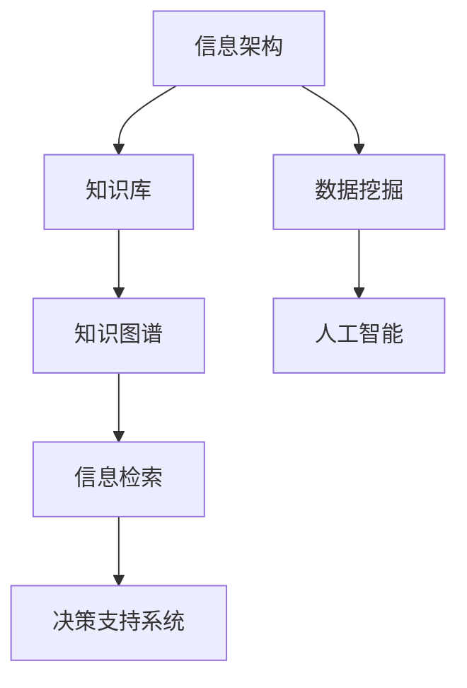
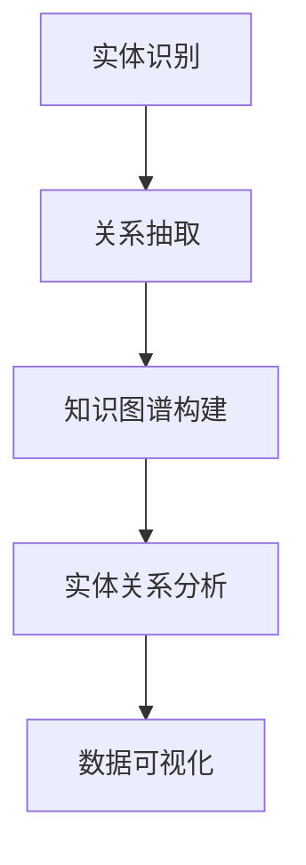
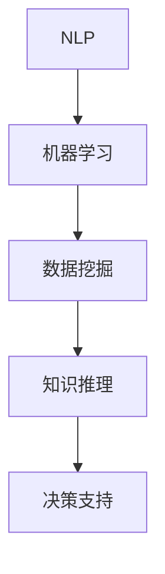
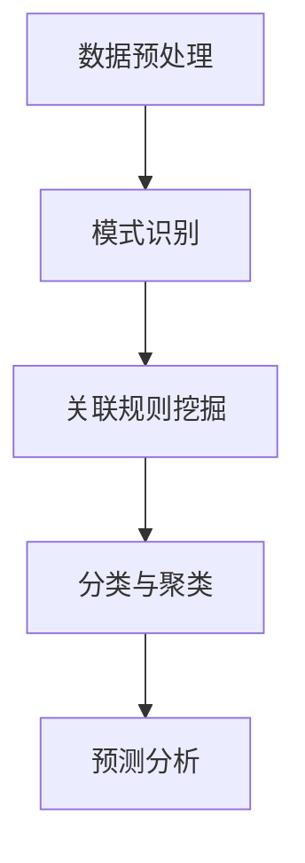

                 

关键词：知识管理、信息架构、知识图谱、人工智能、数据挖掘

> 摘要：本文深入探讨了知识管理的概念、重要性及其在现代技术环境下的应用。通过介绍知识管理的基本原理、核心算法和数学模型，以及项目实践中的代码实例，本文旨在为读者提供一个全面的知识管理框架，帮助驾驭人类知识的航船。

## 1. 背景介绍

在当今信息爆炸的时代，知识管理成为企业和个人保持竞争力的重要手段。知识管理不仅涉及信息的收集、存储、分类和检索，更重要的是如何通过这些信息创造新的价值。知识管理的目标是将分散的信息转化为可用的知识，从而促进创新和决策。

### 1.1 知识管理的起源

知识管理最早可以追溯到20世纪80年代，当时企业开始意识到信息资源的重要性。早期的知识管理主要集中在文档管理和电子邮件系统上。随着互联网和人工智能技术的发展，知识管理的范围和深度不断扩展，逐渐形成了涵盖数据挖掘、机器学习、自然语言处理等多个领域的新兴学科。

### 1.2 知识管理的重要性

知识管理的重要性体现在以下几个方面：

1. **提高工作效率**：通过有效的知识管理，企业可以快速获取所需的信息，减少重复工作，提高工作效率。
2. **促进知识共享**：知识管理鼓励员工共享知识和经验，减少信息孤岛，提高团队协作效率。
3. **支持决策制定**：知识管理提供的数据分析和预测功能，可以帮助企业做出更明智的决策。
4. **培养创新能力**：知识管理为企业提供了一个知识创造和创新的环境，有助于持续创新。

## 2. 核心概念与联系

知识管理涉及多个核心概念，包括信息架构、知识图谱、人工智能和数据挖掘。以下是这些概念之间的联系及其在知识管理中的应用：

### 2.1 信息架构

信息架构是指如何组织、分类和管理信息，以便用户可以高效地找到和使用信息。在知识管理中，信息架构是构建知识库的基础。

**Mermaid 流程图：**


### 2.2 知识图谱

知识图谱是一种语义网络，用于表示实体之间的关系。通过知识图谱，企业可以更好地理解和利用其数据资源。

**Mermaid 流程图：**


### 2.3 人工智能

人工智能技术在知识管理中的应用，主要体现在自然语言处理、机器学习和数据挖掘等领域，用于自动化知识提取、分析和预测。

**Mermaid 流程图：**


### 2.4 数据挖掘

数据挖掘是知识管理的关键环节，通过从大量数据中提取有价值的信息和模式，为决策提供支持。

**Mermaid 流程图：**


## 3. 核心算法原理 & 具体操作步骤

### 3.1 算法原理概述

知识管理的核心算法包括信息检索、知识抽取和知识融合等。这些算法通过不同的方式处理和利用信息，以实现知识管理目标。

### 3.2 算法步骤详解

**信息检索：**
1. 用户输入查询。
2. 系统分析查询语义。
3. 系统在知识库中检索相关条目。
4. 系统返回匹配结果。

**知识抽取：**
1. 数据清洗和预处理。
2. 实体识别和关系抽取。
3. 知识表示和存储。

**知识融合：**
1. 多源数据集成。
2. 知识冲突检测和解决。
3. 知识融合和更新。

### 3.3 算法优缺点

**信息检索：**
- 优点：快速，准确。
- 缺点：对于复杂查询可能效果不佳。

**知识抽取：**
- 优点：自动化提取知识。
- 缺点：准确性受数据质量影响。

**知识融合：**
- 优点：整合多源数据。
- 缺点：处理冲突和更新成本高。

### 3.4 算法应用领域

知识管理算法广泛应用于金融、医疗、教育、制造业等多个领域。例如，在金融领域，知识管理用于风险分析和客户关系管理；在医疗领域，知识管理用于疾病诊断和治疗方案推荐。

## 4. 数学模型和公式 & 详细讲解 & 举例说明

### 4.1 数学模型构建

知识管理中的数学模型主要包括概率模型、神经网络模型和关联规则模型等。以下是一个基于概率模型的简单例子：

**贝叶斯公式：**
$$ P(A|B) = \frac{P(B|A)P(A)}{P(B)} $$

其中，$P(A|B)$ 表示在已知事件B发生的情况下，事件A发生的概率。

### 4.2 公式推导过程

以贝叶斯公式为例，推导过程如下：

1. 条件概率定义：$P(B|A) = \frac{P(A \cap B)}{P(A)}$
2. 交换分子和分母：$P(A|B) = \frac{P(A)P(B|A)}{P(B)}$
3. 结合全概率公式：$P(B) = \sum_{i} P(B|A_i)P(A_i)$
4. 代入贝叶斯公式：$$ P(A|B) = \frac{P(B|A)P(A)}{\sum_{i} P(B|A_i)P(A_i)} $$

### 4.3 案例分析与讲解

**案例：客户流失预测**

假设我们想预测哪些客户可能会流失，可以使用贝叶斯公式来计算每个客户流失的概率。

1. **数据预处理**：收集客户的基本信息，如年龄、性别、消费金额等。
2. **特征提取**：对每个客户进行特征提取，如年龄的区间、消费金额的区间等。
3. **概率计算**：使用贝叶斯公式计算每个特征与流失之间的关系。
4. **结果分析**：根据计算结果，确定哪些客户属于高风险流失客户。

## 5. 项目实践：代码实例和详细解释说明

### 5.1 开发环境搭建

在本文中，我们将使用Python作为开发语言，结合Scikit-learn库和TensorFlow库进行知识管理模型的构建。

### 5.2 源代码详细实现

以下是一个简单的知识管理模型的代码实现：

```python
from sklearn.model_selection import train_test_split
from sklearn.naive_bayes import GaussianNB
from sklearn.metrics import accuracy_score

# 数据加载
data = ...

# 特征提取
X = data[:, :-1]
y = data[:, -1]

# 划分训练集和测试集
X_train, X_test, y_train, y_test = train_test_split(X, y, test_size=0.2, random_state=42)

# 创建朴素贝叶斯分类器
gnb = GaussianNB()

# 训练模型
gnb.fit(X_train, y_train)

# 预测
y_pred = gnb.predict(X_test)

# 评估模型
accuracy = accuracy_score(y_test, y_pred)
print("Accuracy:", accuracy)
```

### 5.3 代码解读与分析

- **数据加载**：从数据集中加载特征和标签。
- **特征提取**：对数据进行预处理，提取有用的特征。
- **划分训练集和测试集**：将数据集划分为训练集和测试集，用于模型训练和评估。
- **创建朴素贝叶斯分类器**：使用GaussianNB创建朴素贝叶斯分类器。
- **训练模型**：使用训练集数据训练模型。
- **预测**：使用测试集数据进行预测。
- **评估模型**：计算模型的准确率。

## 6. 实际应用场景

知识管理在金融、医疗、教育等领域有着广泛的应用。以下是一些实际应用场景：

- **金融领域**：通过知识管理，银行可以更好地了解客户行为，预测潜在风险，提高信贷审批效率。
- **医疗领域**：知识管理可以帮助医院提高诊断准确率，优化治疗方案，减少误诊率。
- **教育领域**：知识管理可以帮助学校提高教学质量，优化课程设置，提高学生成绩。

## 7. 工具和资源推荐

### 7.1 学习资源推荐

- **书籍**：《人工智能：一种现代的方法》、《知识管理：理论与实践》
- **在线课程**：Coursera上的《机器学习》课程，edX上的《知识管理》课程

### 7.2 开发工具推荐

- **编程语言**：Python、Java
- **库和框架**：Scikit-learn、TensorFlow、PyTorch

### 7.3 相关论文推荐

- "A Framework for Knowledge Management" by Davenport and Prusak
- "Data Mining: Concepts and Techniques" by Han, Kamber and Pei

## 8. 总结：未来发展趋势与挑战

### 8.1 研究成果总结

知识管理在过去几十年中取得了显著成果，从早期的文档管理发展到今天复杂的人工智能系统。未来，知识管理将继续向智能化、自动化和协作化的方向发展。

### 8.2 未来发展趋势

- **智能化**：知识管理将更多地依赖人工智能和机器学习技术，实现更精准的知识提取和预测。
- **自动化**：自动化工具将提高知识管理的效率，减少人工干预。
- **协作化**：知识管理将更加注重团队协作和知识共享，促进企业内部的知识流动。

### 8.3 面临的挑战

- **数据隐私和安全**：如何保护数据隐私和安全，防止数据泄露。
- **知识质量**：如何保证知识库中的知识质量，避免错误和不一致。
- **技术挑战**：如何处理海量数据，提高知识管理的性能和效率。

### 8.4 研究展望

知识管理将不断创新，未来有望在以下几个方面取得突破：

- **跨领域融合**：知识管理将与其他领域（如物联网、区块链等）相结合，产生新的应用场景。
- **个性化推荐**：基于用户行为和兴趣，提供个性化的知识服务。
- **知识创新**：通过知识管理，推动企业和个人的知识创新，促进社会进步。

## 9. 附录：常见问题与解答

### 9.1 什么是知识管理？

知识管理是指通过系统的方法和工具，收集、组织、存储、检索和应用知识，以实现个人和组织的知识共享、知识创新和知识增值。

### 9.2 知识管理有哪些关键环节？

知识管理的关键环节包括信息收集、知识存储、知识分类、知识检索、知识共享和知识创新。

### 9.3 知识管理如何促进企业创新？

知识管理通过优化知识流动和共享，促进团队协作，提高决策质量，从而推动企业的创新和发展。

### 9.4 知识管理有哪些常见工具和技术？

知识管理的常见工具和技术包括数据库、内容管理系统、知识图谱、数据挖掘、机器学习和自然语言处理等。

# 作者署名
作者：禅与计算机程序设计艺术 / Zen and the Art of Computer Programming
```

