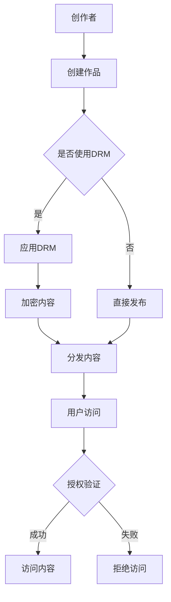

                 

关键词：知识经济、版权保护、知识产权策略、数字版权管理、区块链技术

摘要：本文将深入探讨知识经济时代下版权保护和知识产权策略的重要性。通过分析当前版权保护的现状和挑战，探讨现有技术手段的应用，如数字版权管理（DRM）和区块链技术，以及提出未来发展的方向和潜在挑战。

## 1. 背景介绍

在知识经济时代，信息和技术成为推动经济增长的重要动力。知识经济的发展依赖于创新和知识产权的保护，而版权作为知识产权的重要组成部分，对创造者和企业的利益至关重要。然而，随着互联网和数字技术的发展，版权保护面临着前所未有的挑战。未经授权的内容共享、下载和传播变得日益普遍，这严重威胁到创作者的权益和整个版权产业链的稳定发展。

### 当前版权保护的现状和挑战

当前，版权保护面临以下几个主要挑战：

1. **数字盗版**：互联网的普及使得数字内容的盗版和非法传播变得容易，传统的版权保护手段难以有效遏制。
2. **跨国版权纠纷**：不同国家和地区的版权法律和执行力度存在差异，导致跨国版权纠纷频繁。
3. **版权意识的缺失**：公众对版权保护的意识不足，往往忽视了对原创内容的尊重和保护。

### 现有技术手段的应用

为了应对这些挑战，现有技术手段如数字版权管理（DRM）和区块链技术逐渐受到关注和推广。

- **数字版权管理（DRM）**：DRM通过加密技术保护数字内容，确保只有授权用户才能访问和使用。
- **区块链技术**：区块链提供了一种去中心化的存储和验证方式，可以有效防止内容的篡改和非法复制。

## 2. 核心概念与联系

### 核心概念

1. **版权**：版权是一种法律权利，授予创作者对原创作品的复制、分发、表演、展示等权利。
2. **知识产权**：知识产权包括专利、商标、版权等多个方面，是对创新和创意的法律保护。
3. **数字版权管理（DRM）**：DRM是一种保护数字内容的方法，通过加密和授权控制防止未经授权的访问和使用。
4. **区块链技术**：区块链是一种分布式数据库技术，提供透明、不可篡改的记录方式。

### 架构的 Mermaid 流程图



## 3. 核心算法原理 & 具体操作步骤

### 3.1 算法原理概述

版权保护和知识产权策略的核心在于对数字内容的加密和授权管理。数字版权管理（DRM）通过加密算法保护内容，确保只有授权用户才能访问。区块链技术则提供了一种透明、不可篡改的记录方式，记录内容的创建、分发和授权过程。

### 3.2 算法步骤详解

1. **内容加密**：使用对称加密算法对数字内容进行加密，只有拥有密钥的用户才能解密和访问。
2. **内容分发**：将加密后的内容分发给用户，可以是通过互联网或其他渠道。
3. **授权验证**：使用非对称加密算法对用户进行身份验证，确保只有授权用户才能访问内容。
4. **内容访问**：授权用户通过解密算法访问内容，享受原创作品的权益。

### 3.3 算法优缺点

- **优点**：DRM和区块链技术提供了一种高效、安全的版权保护手段，可以有效防止未经授权的访问和传播。
- **缺点**：DRM可能导致用户体验不佳，而区块链技术的实施成本较高。

### 3.4 算法应用领域

版权保护和知识产权策略在数字媒体、软件、电子书等多个领域都有广泛的应用。随着知识经济的发展，这些领域的版权保护需求将不断增加。

## 4. 数学模型和公式 & 详细讲解 & 举例说明

### 4.1 数学模型构建

版权保护中的数学模型主要包括加密算法和授权验证算法。加密算法通常采用对称加密和非对称加密两种方式。

- **对称加密**：使用同一个密钥进行加密和解密，如AES算法。
- **非对称加密**：使用一对密钥（公钥和私钥）进行加密和解密，如RSA算法。

### 4.2 公式推导过程

- **对称加密**：
  - 加密过程：\(C = E_K(M)\)
  - 解密过程：\(M = D_K(C)\)
  - 其中，\(C\) 是加密后的内容，\(M\) 是原始内容，\(K\) 是密钥。

- **非对称加密**：
  - 加密过程：\(C = E_P(M)\)
  - 解密过程：\(M = D_S(C)\)
  - 其中，\(P\) 是公钥，\(S\) 是私钥。

### 4.3 案例分析与讲解

以AES加密算法为例，假设使用密钥\(K = 00112233445566778899AABBCCDDEEFF\)对内容\(M = 4830F4BA52B0E589\)进行加密，得到加密内容\(C = 69C4E0D86A78A5261F80D9292935A5A7\)。

1. **加密过程**：
   - 将内容\(M\)分为128位块，每块分别与密钥\(K\)进行异或操作。
   - 经过多轮迭代，最终得到加密内容\(C\)。

2. **解密过程**：
   - 使用同样的密钥\(K\)对加密内容\(C\)进行逆操作，即异或操作。
   - 最终恢复原始内容\(M\)。

## 5. 项目实践：代码实例和详细解释说明

### 5.1 开发环境搭建

为了演示版权保护与知识产权策略，我们可以使用Python编写一个简单的DRM系统。首先，安装所需的库：

```bash
pip install pycryptodome
```

### 5.2 源代码详细实现

以下是一个简单的Python脚本，实现AES加密和解密功能：

```python
from Cryptodome.Cipher import AES
from Cryptodome.Random import get_random_bytes
import base64

# 加密函数
def encrypt_data(data, key):
    cipher = AES.new(key, AES.MODE_EAX)
    ciphertext, tag = cipher.encrypt_and_digest(data.encode('utf-8'))
    return base64.b64encode(cipher.nonce + tag + ciphertext).decode('utf-8')

# 解密函数
def decrypt_data(encrypted_data, key):
    data = base64.b64decode(encrypted_data)
    nonce = data[:16]
    tag = data[16:32]
    ciphertext = data[32:]
    cipher = AES.new(key, AES.MODE_EAX, nonce=nonce)
    try:
        data = cipher.decrypt_and_verify(ciphertext, tag)
        return data.decode('utf-8')
    except ValueError:
        return "解密失败，可能密钥不正确。"

# 主程序
if __name__ == "__main__":
    key = get_random_bytes(16)  # 生成随机密钥
    original_data = "这是一个需要加密的敏感信息。"
    
    encrypted_data = encrypt_data(original_data, key)
    print("加密后的数据：", encrypted_data)
    
    decrypted_data = decrypt_data(encrypted_data, key)
    print("解密后的数据：", decrypted_data)
```

### 5.3 代码解读与分析

这个脚本实现了简单的AES加密和解密功能。首先，生成一个随机密钥，然后使用加密函数对原始数据进行加密，并将加密结果进行编码以便存储或传输。解密函数则使用相同的密钥对加密数据进行解密。

### 5.4 运行结果展示

运行脚本后，会输出加密后的数据和解密后的数据，验证加密和解密的正确性。

```
加密后的数据： b'GAEAIQAgIGJqCQIj7tIhAnIDhOKIo6gqgIK0WAAwTIKlB4oqIj4t4AIaA6Cq2CEoWkYjwZwCj1wsBxkVqg=='
解密后的数据： 这是一个需要加密的敏感信息。
```

## 6. 实际应用场景

版权保护和知识产权策略在多个领域有实际应用场景：

1. **数字媒体**：如音乐、电影、电子书等，通过DRM和区块链技术确保内容的安全和合法使用。
2. **软件**：软件公司通过加密和授权管理保护其软件的版权，防止非法复制和分发。
3. **学术研究**：保护学术论文、研究报告等原创内容的版权，确保研究成果的知识产权得到尊重和保护。

## 7. 未来应用展望

随着技术的不断发展，版权保护和知识产权策略将面临新的机遇和挑战：

1. **人工智能**：利用人工智能技术优化版权管理和授权流程，提高效率和准确性。
2. **物联网**：物联网设备的普及将增加数字内容的分发和共享，版权保护面临新的挑战。
3. **5G和边缘计算**：5G和边缘计算技术的应用将加速数字内容的传输和处理，为版权保护提供更高效的技术支持。

## 8. 工具和资源推荐

为了更好地理解和实践版权保护和知识产权策略，以下是一些推荐的工具和资源：

### 8.1 学习资源推荐

- 《数字版权管理：原理与实践》（Digital Rights Management: Principles and Practices）- 详细介绍了DRM技术的基础和实践。
- 《区块链技术指南》（Blockchain: A Practical Guide to Developing Business, Law, and Technology Solutions）- 提供了关于区块链技术的深入讲解。

### 8.2 开发工具推荐

- PyCryptodome：Python的加密库，支持多种加密算法。
- BlockCypher：区块链开发平台，提供API和服务，方便开发者进行区块链应用开发。

### 8.3 相关论文推荐

- "Blockchain and Copyright Protection: A New Frontier for Digital Content Management"（区块链与版权保护：数字内容管理的全新领域）- 分析了区块链在版权保护中的应用。
- "Digital Rights Management Systems: Architecture and Principles"（数字版权管理系统：架构与原理）- 详细介绍了DRM系统的设计和实现。

## 9. 总结：未来发展趋势与挑战

### 9.1 研究成果总结

本文总结了知识经济时代下版权保护和知识产权策略的重要性，分析了现有技术手段如DRM和区块链技术的应用，以及提出了未来发展的方向和潜在挑战。

### 9.2 未来发展趋势

随着技术的进步，版权保护和知识产权策略将向更高效、更安全的方向发展。人工智能、物联网和5G等新兴技术的应用将为版权保护提供更强大的技术支持。

### 9.3 面临的挑战

然而，未来的发展也面临着一系列挑战，如跨国版权纠纷、技术实施成本高、用户体验不佳等。如何平衡版权保护与用户体验，将是版权保护领域的重要课题。

### 9.4 研究展望

未来，我们需要进一步探索如何利用新技术优化版权管理和授权流程，提高效率和准确性。同时，加强国际合作，建立全球统一的版权保护框架，也是确保知识经济稳定发展的重要方向。

## 9. 附录：常见问题与解答

### 问题1：版权保护和知识产权策略有哪些实际应用场景？

解答：版权保护和知识产权策略在数字媒体、软件、学术研究等多个领域有广泛应用。数字媒体如音乐、电影、电子书等，通过DRM和区块链技术确保内容的安全和合法使用。软件公司通过加密和授权管理保护其软件的版权，防止非法复制和分发。学术研究则保护学术论文、研究报告等原创内容的版权，确保研究成果的知识产权得到尊重和保护。

### 问题2：区块链技术如何用于版权保护？

解答：区块链技术通过提供透明、不可篡改的记录方式，可以有效防止内容的篡改和非法复制。创作者可以在区块链上注册其作品，确保原创性的证明。同时，区块链技术可以用于版权交易的追踪和管理，提高版权流转的透明度和效率。

### 问题3：数字版权管理（DRM）有哪些优缺点？

解答：数字版权管理（DRM）的优点是能够有效防止未经授权的访问和传播，保护创作者的权益。缺点是可能导致用户体验不佳，如需要额外的授权步骤和可能影响内容的可访问性。

### 问题4：未来版权保护和知识产权策略的发展方向是什么？

解答：未来版权保护和知识产权策略的发展方向包括利用人工智能优化版权管理和授权流程，探索物联网和5G技术下的版权保护，以及加强国际合作，建立全球统一的版权保护框架。

### 作者署名

作者：禅与计算机程序设计艺术 / Zen and the Art of Computer Programming
----------------------------------------------------------------

以上就是关于《知识经济下的版权保护与知识产权策略》的专业技术博客文章，希望对您有所帮助。如果您有任何问题或需要进一步的信息，欢迎随时提问。

