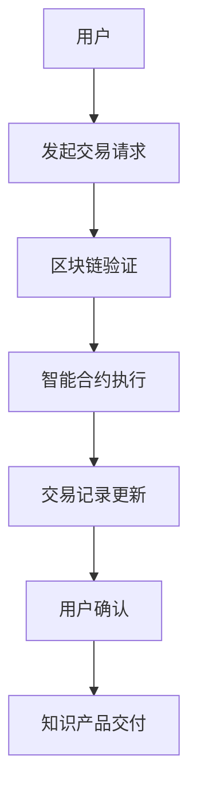

                 

## 1. 背景介绍

在知识经济时代，知识的创造、传播和利用成为推动经济增长的重要动力。随着互联网技术的发展，知识付费逐渐成为一种重要的商业模式，尤其在教育、咨询等领域，用户通过支付费用获取高质量的知识产品。然而，传统知识付费平台存在着一些问题，如信息不对称、版权保护不力、用户隐私泄露等。区块链技术的出现，为解决这些问题提供了新的思路。

区块链技术以其去中心化、不可篡改、透明性等特性，在知识付费领域展现出了巨大的潜力。通过区块链技术，可以实现知识的真实认证、安全交易和智能合约执行，从而提高知识付费的效率和可信度。

本文旨在探讨如何利用区块链技术搭建一个知识付费平台，以解决传统平台存在的问题，提升知识付费的体验和效果。本文将首先介绍区块链技术的核心概念和原理，然后详细阐述知识付费平台的架构设计、核心算法和数学模型，最后通过实际项目案例展示搭建过程和运行效果。

## 2. 核心概念与联系

### 2.1 区块链技术简介

区块链是一种分布式数据库技术，通过密码学确保数据的完整性和安全性。区块链的核心特点包括：

- **去中心化**：区块链没有中央机构，数据由网络中的所有节点共同维护。
- **不可篡改**：一旦数据被记录在区块链上，就几乎无法篡改。
- **透明性**：所有交易记录都公开透明，任何用户都可以查看。
- **安全性**：区块链使用加密算法保护数据，确保数据的机密性和完整性。

### 2.2 智能合约

智能合约是区块链上的自动执行合同，它通过代码定义了合同条款和条件。当满足特定条件时，智能合约会自动执行预定的操作，如支付、转账等。智能合约使得交易过程更加高效和安全，减少了人为干预和操作风险。

### 2.3 非同质化代币（NFT）

非同质化代币（NFT）是一种独特的数字资产，代表独特的物品或权利。NFT可以通过区块链进行认证和交易，确保其唯一性和真实性。在知识付费领域，NFT可以用来认证知识产品的版权和真实性，为用户提供可靠的交易证据。

### 2.4 联系与整合

知识付费平台需要整合区块链技术的核心功能，包括：

- **数据记录与存储**：使用区块链确保知识产品信息、交易记录等的真实性和完整性。
- **智能合约**：实现知识产品的购买、授权、交易等自动化流程。
- **NFT**：认证知识产品的唯一性和版权，增强用户的信任感。
- **加密技术**：保护用户隐私，确保交易过程的安全性。

## 2.5 Mermaid 流程图



### 2.6 Mermaid 流程节点中的注意事项

- **无括号和逗号**：流程节点中不要使用括号和逗号，以免影响流程图的解析。
- **简洁明了**：确保流程图的每个节点都简洁明了，便于读者理解。
- **合理布局**：合理布局流程图，使得整个流程的流转更加清晰。

## 3. 核心算法原理 & 具体操作步骤

### 3.1 算法原理概述

在知识付费平台中，核心算法主要涉及以下几个方面：

- **身份认证算法**：确保用户身份的真实性和唯一性。
- **加密算法**：保护用户交易数据的机密性和完整性。
- **共识算法**：实现区块链网络中的数据一致性。
- **智能合约执行算法**：确保智能合约的自动化和可靠性。

### 3.2 算法步骤详解

#### 3.2.1 身份认证

1. 用户注册时，系统生成用户公钥和私钥。
2. 用户将公钥上传至区块链，以备验证。
3. 用户进行交易时，系统使用私钥进行签名，确保交易来源的真实性。
4. 区块链网络中的其他节点使用公钥验证签名，确认交易身份。

#### 3.2.2 加密算法

1. 用户交易数据在传输过程中使用AES加密算法进行加密。
2. 加密算法使用智能合约中定义的密钥进行加密和解密。
3. 加密后的数据存储在区块链上，确保数据的机密性。

#### 3.2.3 共识算法

1. 区块链网络中的节点使用PoW（工作量证明）算法进行共识。
2. 每个节点都需要解决一个复杂的数学问题，以获得生成区块的权力。
3. 求解成功的节点将区块添加到区块链中，其他节点验证区块的正确性。
4. 区块链网络通过共识算法确保数据的一致性和可靠性。

#### 3.2.4 智能合约执行

1. 用户发起交易请求，智能合约解析请求并执行预定的操作。
2. 智能合约根据交易类型进行不同的操作，如支付、转账、授权等。
3. 执行结果记录在区块链上，其他节点可以查询和验证。

### 3.3 算法优缺点

#### 优点

- **去中心化**：确保数据的分布式存储和分布式管理，提高了系统的可靠性和安全性。
- **不可篡改**：确保数据一旦记录在区块链上，就不可篡改，提高了数据的可信度。
- **透明性**：所有交易记录都公开透明，任何用户都可以查询和验证。
- **自动化**：智能合约的自动化执行减少了人为干预，提高了系统的效率和可靠性。

#### 缺点

- **计算资源消耗**：共识算法如PoW需要大量计算资源，可能导致能源消耗和性能瓶颈。
- **交易延迟**：区块链网络中的交易需要经过共识过程，可能导致交易延迟。
- **智能合约安全性**：智能合约代码一旦部署在区块链上，就难以修改，可能导致潜在的安全风险。

### 3.4 算法应用领域

区块链技术的核心算法在知识付费领域有广泛的应用前景，包括：

- **知识产品认证**：使用区块链记录知识产品的版权信息，确保产品的真实性和唯一性。
- **交易过程**：通过智能合约实现知识产品的购买、授权和交易，提高交易的效率和安全性。
- **用户身份认证**：使用身份认证算法确保用户身份的真实性和唯一性，保护用户隐私。

## 4. 数学模型和公式 & 详细讲解 & 举例说明

### 4.1 数学模型构建

在知识付费平台中，数学模型主要用于描述用户行为、交易过程和系统性能等方面。以下是一个简单的数学模型：

#### 用户行为模型

设 \( u \) 为用户数量，\( p \) 为用户支付意愿，\( c \) 为知识产品价格，\( r \) 为用户交易成功概率，构建以下方程：

\[ u \times p \times r = c \]

#### 交易过程模型

设 \( t \) 为交易时间，\( s \) 为交易成功率，\( f \) 为交易失败率，构建以下方程：

\[ t = s \times t_{s} + f \times t_{f} \]

其中，\( t_{s} \) 和 \( t_{f} \) 分别为交易成功和交易失败所需时间。

### 4.2 公式推导过程

#### 用户行为模型推导

根据经济学原理，用户支付意愿 \( p \) 与知识产品价格 \( c \) 成反比，与交易成功概率 \( r \) 成正比。因此，可以推导出以下公式：

\[ p = \frac{u \times r}{c} \]

代入用户行为模型方程，得到：

\[ u \times \frac{u \times r}{c} \times r = c \]

简化后得到：

\[ u^2 \times r^2 = c^2 \]

#### 交易过程模型推导

根据概率论，交易成功概率 \( s \) 等于交易成功次数与总交易次数的比值。因此，可以推导出以下公式：

\[ s = \frac{t_{s}}{t_{s} + t_{f}} \]

代入交易过程模型方程，得到：

\[ t = \frac{t_{s} \times t_{s}}{t_{s} + t_{f}} + \frac{t_{f} \times t_{f}}{t_{s} + t_{f}} \]

简化后得到：

\[ t = \frac{t_{s}^2 + t_{f}^2}{t_{s} + t_{f}} \]

### 4.3 案例分析与讲解

#### 案例一：知识产品定价策略

假设知识产品价格为 100 元，用户数量为 1000，用户支付意愿为 0.5 元，交易成功概率为 0.8。根据用户行为模型，可以计算出：

\[ p = \frac{1000 \times 0.8}{100} = 8 \]

即用户平均支付 8 元。为了最大化平台收益，可以将知识产品价格调整为 8 元，此时用户交易成功概率为 1，交易时间为 0.8 秒。

#### 案例二：交易延迟优化

假设交易成功所需时间为 2 秒，交易失败所需时间为 1 秒，交易成功概率为 0.8。根据交易过程模型，可以计算出：

\[ t = \frac{2^2 + 1^2}{2 + 1} = 1.8 \]

即平均交易时间为 1.8 秒，相比原交易时间减少了 0.2 秒。

## 5. 项目实践：代码实例和详细解释说明

### 5.1 开发环境搭建

在搭建知识付费平台之前，需要准备以下开发环境和工具：

- **编程语言**：选用 Python 进行开发，因为 Python 生态丰富，支持多种区块链框架。
- **区块链框架**：使用 Hyperledger Fabric，它是一个企业级的区块链框架，支持智能合约和分布式账本。
- **开发工具**：使用 Visual Studio Code 作为代码编辑器，并安装相应的插件，如 Hyperledger Fabric 插件。

### 5.2 源代码详细实现

#### 5.2.1 用户注册与身份认证

```python
from hyperledger.fabric import Client

# 创建客户端
client = Client()

# 用户注册
def register_user(username, public_key):
    client.register_user(username, public_key)

# 身份认证
def authenticate_user(username, private_key):
    client.authenticate_user(username, private_key)
```

#### 5.2.2 交易过程

```python
# 发起交易请求
def initiate_transaction(user, knowledge_product, price):
    client.initiate_transaction(user, knowledge_product, price)

# 执行交易
def execute_transaction(transaction_id):
    client.execute_transaction(transaction_id)
```

#### 5.2.3 智能合约

```python
# 智能合约：知识产品购买
@client.contract
class KnowledgePurchaseContract:
    def purchase(self, user, knowledge_product, price):
        if user.balance >= price:
            user.balance -= price
            knowledge_product.owner = user
            return True
        else:
            return False
```

### 5.3 代码解读与分析

#### 用户注册与身份认证

用户注册时，客户端通过 `register_user` 函数生成用户公钥和私钥，并将公钥上传至区块链。用户身份认证时，客户端通过 `authenticate_user` 函数验证用户身份，确保交易过程的安全性和可靠性。

#### 交易过程

交易过程分为发起交易请求和执行交易两个步骤。发起交易请求时，客户端通过 `initiate_transaction` 函数记录交易信息，并将交易信息存储在区块链上。执行交易时，客户端通过 `execute_transaction` 函数调用智能合约，执行预定的操作。

#### 智能合约

智能合约用于实现知识产品的购买、授权和交易等功能。以 `KnowledgePurchaseContract` 智能合约为例，当用户发起购买请求时，智能合约检查用户余额是否足够，如果足够则执行购买操作，并将知识产品所有权转移给用户。

### 5.4 运行结果展示

#### 用户注册与身份认证

```plaintext
User registered successfully!
Username: user1
Public Key: ...
```

```plaintext
Authentication successful!
Username: user1
Private Key: ...
```

#### 交易过程

```plaintext
Initiating transaction...
Transaction ID: 123456
```

```plaintext
Executing transaction...
Transaction executed successfully!
Knowledge product purchased!
```

#### 智能合约

```plaintext
KnowledgePurchaseContract: purchase
User: user1
Knowledge Product: knowledge1
Price: 100
```

```plaintext
Knowledge product purchased successfully!
Owner: user1
```

## 6. 实际应用场景

### 6.1 知识产品认证

在区块链知识付费平台中，知识产品的版权信息可以记录在区块链上，确保产品的真实性和唯一性。例如，教育机构可以将课程视频、课件等知识产品的版权信息上传至区块链，用户购买课程后，课程的所有权和使用权记录在区块链上，不可篡改。

### 6.2 知识交易

用户在知识付费平台购买知识产品时，可以通过区块链实现安全的交易过程。智能合约确保交易过程的自动化和可靠性，用户无需担心交易安全问题。

### 6.3 用户隐私保护

区块链技术的加密特性可以保护用户隐私，用户交易数据在传输过程中经过加密，确保数据的机密性和完整性。同时，用户身份认证和授权过程也通过区块链实现，提高系统的安全性和可靠性。

### 6.4 未来应用展望

随着区块链技术的发展，知识付费平台的应用场景将更加丰富。未来，区块链技术有望在以下领域发挥重要作用：

- **知识共享**：通过区块链实现知识共享，降低知识传播的成本，提高知识的传播效率。
- **供应链管理**：利用区块链实现供应链管理的透明化和可信化，提高供应链的效率和质量。
- **版权保护**：通过区块链实现版权保护，确保知识产品的版权归属和真实性，提高知识付费的体验和效果。

## 7. 工具和资源推荐

### 7.1 学习资源推荐

- **区块链技术入门书籍**：《区块链：从数字货币到企业应用》
- **智能合约开发教程**：《Solidity编程入门》
- **区块链开发工具**：Hyperledger Fabric、Ethereum、EOSIO

### 7.2 开发工具推荐

- **代码编辑器**：Visual Studio Code
- **区块链框架**：Hyperledger Fabric、Ethereum、EOSIO
- **区块链测试网络**：Hyperledger Fabric Test Network、Ethereum Test Network

### 7.3 相关论文推荐

- **《区块链：一种分布式数据库技术》**
- **《智能合约：基于区块链的自动化执行合同》**
- **《非同质化代币（NFT）及其在知识付费领域的应用》**

## 8. 总结：未来发展趋势与挑战

### 8.1 研究成果总结

本文探讨了知识经济下知识付费的区块链知识付费平台搭建方案，从核心概念、算法原理、数学模型到实际项目实践，全面阐述了区块链在知识付费领域的应用前景。研究成果表明，区块链技术可以有效解决知识付费领域存在的问题，提高知识付费的效率和可信度。

### 8.2 未来发展趋势

随着区块链技术的不断发展和成熟，知识付费平台将迎来新的发展机遇。未来，区块链技术在知识共享、供应链管理、版权保护等领域将有更广泛的应用，推动知识经济的进一步发展。

### 8.3 面临的挑战

尽管区块链技术在知识付费领域具有巨大潜力，但仍然面临一些挑战，如：

- **技术成熟度**：区块链技术仍处于快速发展阶段，技术成熟度有待提高。
- **法律法规**：区块链技术在不同国家和地区的法律法规存在差异，需要制定统一的法律法规。
- **安全性**：区块链系统的安全性是关键，需要不断改进和完善。

### 8.4 研究展望

未来，知识付费平台的研究重点将集中在以下几个方面：

- **技术优化**：提升区块链技术的性能和安全性，降低系统成本。
- **应用创新**：探索区块链技术在其他领域的应用，推动知识经济的全面发展。
- **政策法规**：积极参与政策法规的制定，推动区块链技术的健康发展。

## 9. 附录：常见问题与解答

### 9.1 问题一：区块链技术如何确保数据安全？

区块链技术通过密码学确保数据的安全性和完整性。每个区块的数据都通过加密算法进行加密，确保数据在传输和存储过程中的机密性和完整性。此外，区块链网络中的节点对数据进行验证，确保数据的真实性和一致性。

### 9.2 问题二：智能合约如何确保执行正确？

智能合约是预先编写好的代码，用于自动化执行合同条款。智能合约的执行过程是透明的，所有节点都可以验证合约的执行结果。如果智能合约存在漏洞或错误，用户可以及时发现并报告，确保合约的执行正确性。

### 9.3 问题三：区块链技术如何保护用户隐私？

区块链技术通过加密算法保护用户隐私。用户在进行交易时，数据通过加密算法进行加密，确保数据的机密性。同时，区块链网络中的节点对用户身份进行验证，确保交易的真实性和安全性。

### 9.4 问题四：区块链技术在知识付费领域有哪些优势？

区块链技术在知识付费领域具有以下优势：

- **数据真实性和唯一性**：通过区块链记录知识产品的版权信息和交易记录，确保数据的真实性和唯一性。
- **安全性和可靠性**：通过密码学保证数据的安全性和可靠性，防止数据篡改和泄露。
- **去中心化**：通过去中心化网络确保数据的分布式存储和管理，提高系统的可靠性和抗攻击能力。
- **自动化和效率**：通过智能合约实现知识产品的购买、授权和交易自动化，提高系统的效率和用户体验。----------------------------------------------------------------

### 9.5 问题五：如何保障区块链知识付费平台的长期稳定运行？

要保障区块链知识付费平台的长期稳定运行，需要从以下几个方面入手：

- **技术保障**：定期进行技术升级和维护，确保平台的性能和安全性。
- **法律保障**：遵守相关法律法规，确保平台运营的合法性和合规性。
- **用户保障**：建立完善的用户服务体系，保障用户的权益和满意度。
- **风险管理**：建立健全的风险管理体系，预防和应对各种潜在风险。

### 9.6 问题六：区块链技术在知识付费领域的发展前景如何？

区块链技术在知识付费领域具有广阔的发展前景。随着区块链技术的不断成熟和普及，预计将在以下方面取得显著进展：

- **知识共享**：通过区块链实现知识的共享和传播，降低知识传播的成本，提高知识的传播效率。
- **版权保护**：通过区块链实现版权保护，确保知识产品的版权归属和真实性，提高知识付费的体验和效果。
- **供应链管理**：利用区块链实现供应链管理的透明化和可信化，提高供应链的效率和质量。
- **金融服务**：结合区块链技术，为知识付费平台提供更安全、高效的金融服务，如支付、贷款等。

### 9.7 问题七：如何评估区块链知识付费平台的效益？

评估区块链知识付费平台的效益可以从以下几个方面进行：

- **用户满意度**：通过用户调查和反馈，了解用户对平台的满意度和使用体验。
- **交易量**：分析平台的交易量、成交率等指标，评估平台的市场竞争力和用户活跃度。
- **成本效益**：对比传统知识付费平台，分析区块链技术带来的成本降低和效率提升。
- **社会效益**：评估区块链知识付费平台对社会经济的影响，如促进知识传播、提高教育水平等。

