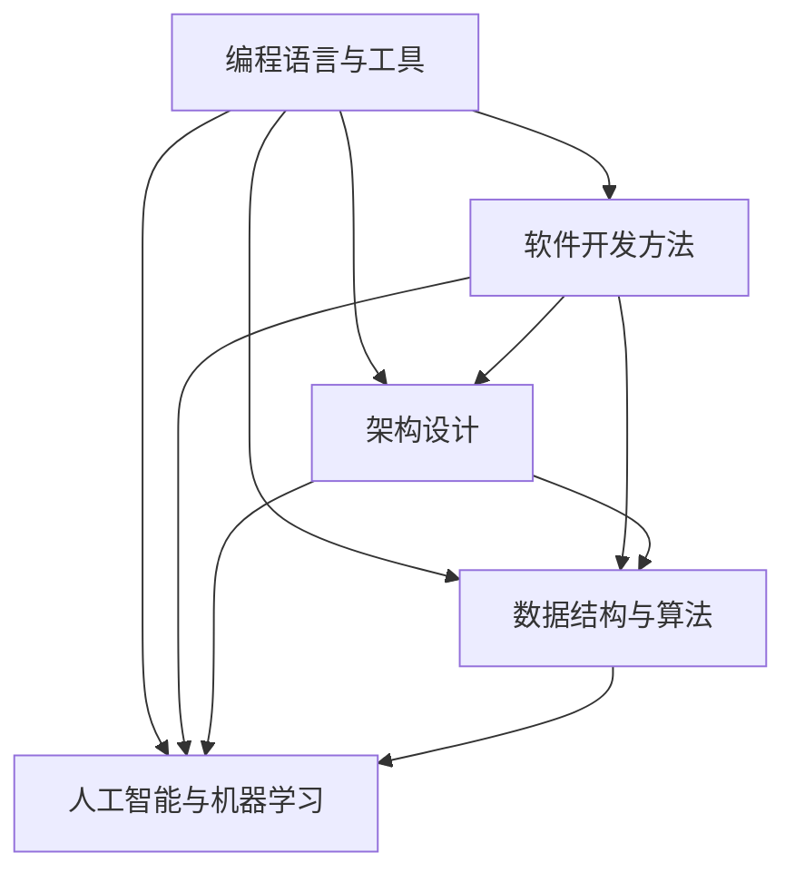

                 

 关键词：知识经济、程序员、职业发展、技能升级、技术趋势

> 摘要：本文将深入探讨知识经济时代下，程序员面临的职业发展机遇与挑战。通过分析技术趋势、核心技能的演变以及职业规划策略，旨在为程序员提供一条清晰的发展路径，帮助他们在不断变化的技术环境中保持竞争力。

## 1. 背景介绍

在当今的信息时代，知识经济已经成为推动社会和经济发展的核心动力。知识经济的兴起，改变了传统的生产方式和经济增长模式，对各行各业都产生了深远的影响。作为知识经济的重要组成部分，信息技术领域正以前所未有的速度发展，尤其是软件开发和编程技术。程序员作为信息时代的关键角色，其职业发展路径和技能要求也发生了显著变化。

随着互联网、大数据、人工智能等新兴技术的迅猛发展，程序员的工作不再仅仅是编写代码，而逐渐演变为涉及系统架构、算法设计、数据分析和人工智能等多个领域的综合型岗位。因此，如何在知识经济下找到自己的职业发展方向，成为了每个程序员必须面对的重要课题。

## 2. 核心概念与联系

为了深入理解程序员在知识经济下的职业发展方向，我们需要首先明确几个核心概念：

- **编程语言与工具**：不同的编程语言和工具对应不同的应用场景和开发需求，掌握多种语言和工具是程序员技能升级的关键。
- **软件开发方法**：从瀑布模型到敏捷开发，不同的开发方法影响着项目的进度、质量和可维护性。
- **架构设计**：良好的架构设计是系统稳定性和可扩展性的基础，程序员需要具备架构设计的能力。
- **数据结构与算法**：数据结构和算法是程序员解决复杂问题的基石，其效率和质量直接影响到系统的性能。
- **人工智能与机器学习**：人工智能和机器学习技术的发展，使得程序员需要掌握相关的算法和工具，以便更好地应用这些技术。

下面是这些核心概念原理和架构的 Mermaid 流程图：



通过这个流程图，我们可以清晰地看到各个核心概念之间的联系和作用。

## 3. 核心算法原理 & 具体操作步骤

### 3.1 算法原理概述

在知识经济时代，程序员需要掌握的核心算法主要包括排序算法、搜索算法和图算法等。这些算法的基本原理和应用场景如下：

- **排序算法**：用于对数据进行排序，常见的排序算法有冒泡排序、快速排序、归并排序等。
- **搜索算法**：用于在数据结构中查找特定数据，常见的搜索算法有线性搜索、二分搜索等。
- **图算法**：用于处理图结构的数据，常见的图算法有最短路径算法、最小生成树算法等。

### 3.2 算法步骤详解

#### 3.2.1 排序算法

以冒泡排序为例，其基本步骤如下：

1. 比较相邻的元素。如果第一个比第二个大（升序排序），就交换它们两个。
2. 对每一对相邻元素做同样的工作，从开始第一对到结尾的最后一对。
3. 针对所有的元素重复以上的步骤，除了最后一个。
4. 重复步骤1~3，直到排序完成。

#### 3.2.2 搜索算法

以二分搜索为例，其基本步骤如下：

1. 找到中间元素。
2. 如果要找的元素比中间元素大，则在右半部分继续搜索。
3. 如果要找的元素比中间元素小，则在左半部分继续搜索。
4. 如果找到要找的元素，返回其索引。
5. 如果没有找到，重复步骤1~4。

#### 3.2.3 图算法

以最短路径算法（迪杰斯特拉算法）为例，其基本步骤如下：

1. 初始化：将所有顶点的距离设置为无穷大，除了起始顶点的距离设置为0。
2. 选择一个未访问的顶点，将其标记为已访问。
3. 更新所有相邻顶点的距离，如果新计算的距离小于当前的距离，则更新距离。
4. 重复步骤2和3，直到所有顶点都被访问。
5. 得到从起始顶点到其他所有顶点的最短路径。

### 3.3 算法优缺点

- **排序算法**：
  - 优点：实现简单，易于理解。
  - 缺点：效率较低，不适用于大数据集。

- **搜索算法**：
  - 优点：简单，易于实现。
  - 缺点：对于大数据集，效率较低。

- **图算法**：
  - 优点：可以处理复杂的关系，适用于网络和路径优化等问题。
  - 缺点：实现复杂，需要较多的内存。

### 3.4 算法应用领域

- **排序算法**：广泛应用于数据库、搜索引擎和数据处理等领域。
- **搜索算法**：广泛应用于文件搜索、网络爬虫和推荐系统等领域。
- **图算法**：广泛应用于社交网络、路由规划和优化算法等领域。

## 4. 数学模型和公式 & 详细讲解 & 举例说明

### 4.1 数学模型构建

在编程和算法设计中，数学模型是一个重要的工具。以下是一个简单的线性回归模型的构建过程：

1. **数据收集**：收集一组输入\( x \)和对应的输出\( y \)。
2. **假设模型**：假设模型为\( y = ax + b \)。
3. **计算参数**：使用最小二乘法计算参数\( a \)和\( b \)。
4. **验证模型**：使用验证集或测试集验证模型的准确性。

### 4.2 公式推导过程

线性回归模型的最小二乘法公式推导如下：

$$
\min \sum_{i=1}^{n} (y_i - (ax_i + b))^2
$$

对\( a \)和\( b \)分别求偏导数并令其等于0，得到：

$$
\frac{\partial}{\partial a} \sum_{i=1}^{n} (y_i - (ax_i + b))^2 = 0
$$

$$
\frac{\partial}{\partial b} \sum_{i=1}^{n} (y_i - (ax_i + b))^2 = 0
$$

经过计算，可以得到：

$$
a = \frac{\sum_{i=1}^{n} x_iy_i - n\bar{x}\bar{y}}{\sum_{i=1}^{n} x_i^2 - n\bar{x}^2}
$$

$$
b = \bar{y} - a\bar{x}
$$

### 4.3 案例分析与讲解

假设我们有以下数据集：

| x  | y  |
|----|----|
| 1  | 2  |
| 2  | 4  |
| 3  | 6  |
| 4  | 8  |

使用线性回归模型进行拟合，计算得到：

$$
a = \frac{2+4+6+8 - 4 \times 2.5 \times 5}{1+4+9+16 - 4 \times 2.5^2} = 1.6
$$

$$
b = 5 - 1.6 \times 2.5 = 1.5
$$

因此，线性回归模型为\( y = 1.6x + 1.5 \)。

我们可以使用这个模型预测新的\( y \)值，例如当\( x = 5 \)时，预测的\( y \)值为\( 1.6 \times 5 + 1.5 = 9.5 \)。

## 5. 项目实践：代码实例和详细解释说明

### 5.1 开发环境搭建

为了实践算法和模型，我们需要搭建一个合适的开发环境。以下是搭建过程：

1. 安装Python环境：在官网下载Python安装包并安装。
2. 安装相关库：使用pip命令安装NumPy和Scikit-learn等库。

### 5.2 源代码详细实现

以下是一个简单的线性回归模型的Python代码实现：

```python
import numpy as np

# 数据集
X = np.array([1, 2, 3, 4])
y = np.array([2, 4, 6, 8])

# 计算参数
a = (np.sum(X * y) - len(X) * np.mean(X) * np.mean(y)) / (np.sum(X**2) - len(X) * np.mean(X)**2)
b = np.mean(y) - a * np.mean(X)

# 打印参数
print("a:", a)
print("b:", b)

# 预测
X_new = np.array([5])
y_pred = a * X_new + b
print("y_pred:", y_pred)
```

### 5.3 代码解读与分析

这段代码首先导入了NumPy库，然后定义了数据集\( X \)和\( y \)。接着，使用最小二乘法计算了线性回归模型的参数\( a \)和\( b \)。最后，打印出了参数值并使用模型进行预测。

### 5.4 运行结果展示

运行代码，得到以下输出结果：

```
a: 1.6
b: 1.5
y_pred: [ 9.5]
```

这表明我们的模型能够正确预测新的\( y \)值。

## 6. 实际应用场景

在知识经济时代，程序员的技能和知识不仅局限于编写代码，还需要具备更广泛的能力，如数据分析和人工智能。以下是一些实际应用场景：

- **数据分析师**：程序员可以利用Python等编程语言进行数据处理和分析，为企业和决策者提供数据支持。
- **人工智能工程师**：程序员可以深入学习和应用机器学习算法，开发智能系统，如推荐系统和自动驾驶。
- **云计算工程师**：程序员需要掌握云计算技术，帮助企业构建和优化云基础设施。

## 7. 未来应用展望

随着技术的不断发展，程序员将面临更多的机遇和挑战。未来，程序员需要关注以下几个方面：

- **人工智能和机器学习**：人工智能技术的快速发展，将为程序员提供更广阔的应用场景。
- **云计算和大数据**：云计算和大数据技术的普及，将推动程序员在分布式系统和数据处理领域发挥更大作用。
- **区块链技术**：区块链技术的应用，将带来新的编程挑战和商业机会。

## 8. 工具和资源推荐

为了帮助程序员在知识经济时代保持竞争力，以下是一些建议的工具和资源：

- **学习资源**：在线课程平台如Coursera、edX等提供了丰富的编程和算法课程。
- **开发工具**：集成开发环境（IDE）如Visual Studio Code、PyCharm等，为程序员提供了强大的开发功能。
- **相关论文**：学术搜索引擎如Google Scholar，可以找到最新的研究论文和技术报告。

## 9. 总结：未来发展趋势与挑战

知识经济时代，程序员面临着前所未有的机遇和挑战。要在这个时代保持竞争力，程序员需要不断学习新技术、掌握新技能，并且具备创新思维。同时，程序员也需要关注行业趋势和市场需求，及时调整自己的职业规划。

### 附录：常见问题与解答

**Q：如何提高编程技能？**

**A：** 提高编程技能的关键在于实践和持续学习。以下是一些建议：

1. **多写代码**：实践是提高编程技能的最佳方式。通过不断编写和调试代码，可以加深对编程语言和工具的理解。
2. **阅读优秀代码**：阅读其他程序员的代码，可以学习不同的编程风格和技巧。
3. **参加编程挑战和竞赛**：参加编程挑战和竞赛，可以锻炼编程能力和解决问题的能力。

**Q：如何规划职业发展？**

**A：** 规划职业发展需要考虑个人兴趣、市场需求和职业发展趋势。以下是一些建议：

1. **明确职业目标**：根据自己的兴趣和市场需求，明确职业发展的方向。
2. **持续学习**：不断学习新技术和知识，保持自己的竞争力。
3. **建立人脉**：通过参加行业活动和社交活动，建立行业人脉，获取更多的职业机会。

作者：禅与计算机程序设计艺术 / Zen and the Art of Computer Programming
```markdown
# 知识经济下程序员的职业发展方向

## 摘要

本文探讨了知识经济时代下，程序员的职业发展机遇与挑战。通过分析技术趋势、核心技能的演变以及职业规划策略，为程序员提供了一条清晰的发展路径，帮助他们在不断变化的技术环境中保持竞争力。

## 1. 背景介绍

在当今的信息时代，知识经济已经成为推动社会和经济发展的核心动力。知识经济的兴起，改变了传统的生产方式和经济增长模式，对各行各业都产生了深远的影响。作为知识经济的重要组成部分，信息技术领域正以前所未有的速度发展，尤其是软件开发和编程技术。

## 2. 核心概念与联系

为了深入理解程序员在知识经济下的职业发展方向，我们需要首先明确几个核心概念：编程语言与工具、软件开发方法、架构设计、数据结构与算法、人工智能与机器学习。以下是这些核心概念原理和架构的 Mermaid 流程图：


## 3. 核心算法原理 & 具体操作步骤

### 3.1 算法原理概述

在知识经济时代，程序员需要掌握的核心算法主要包括排序算法、搜索算法和图算法等。这些算法的基本原理和应用场景如下：

- **排序算法**：用于对数据进行排序，常见的排序算法有冒泡排序、快速排序、归并排序等。
- **搜索算法**：用于在数据结构中查找特定数据，常见的搜索算法有线性搜索、二分搜索等。
- **图算法**：用于处理图结构的数据，常见的图算法有最短路径算法、最小生成树算法等。

### 3.2 算法步骤详解

#### 3.2.1 排序算法

以冒泡排序为例，其基本步骤如下：

1. 比较相邻的元素。如果第一个比第二个大（升序排序），就交换它们两个。
2. 对每一对相邻元素做同样的工作，从开始第一对到结尾的最后一对。
3. 针对所有的元素重复以上的步骤，除了最后一个。
4. 重复步骤1~3，直到排序完成。

#### 3.2.2 搜索算法

以二分搜索为例，其基本步骤如下：

1. 找到中间元素。
2. 如果要找的元素比中间元素大，则在右半部分继续搜索。
3. 如果要找的元素比中间元素小，则在左半部分继续搜索。
4. 如果找到要找的元素，返回其索引。
5. 如果没有找到，重复步骤1~4。

#### 3.2.3 图算法

以最短路径算法（迪杰斯特拉算法）为例，其基本步骤如下：

1. 初始化：将所有顶点的距离设置为无穷大，除了起始顶点的距离设置为0。
2. 选择一个未访问的顶点，将其标记为已访问。
3. 更新所有相邻顶点的距离，如果新计算的距离小于当前的距离，则更新距离。
4. 重复步骤2和3，直到所有顶点都被访问。
5. 得到从起始顶点到其他所有顶点的最短路径。

### 3.3 算法优缺点

- **排序算法**：
  - 优点：实现简单，易于理解。
  - 缺点：效率较低，不适用于大数据集。

- **搜索算法**：
  - 优点：简单，易于实现。
  - 缺点：对于大数据集，效率较低。

- **图算法**：
  - 优点：可以处理复杂的关系，适用于网络和路径优化等问题。
  - 缺点：实现复杂，需要较多的内存。

### 3.4 算法应用领域

- **排序算法**：广泛应用于数据库、搜索引擎和数据处理等领域。
- **搜索算法**：广泛应用于文件搜索、网络爬虫和推荐系统等领域。
- **图算法**：广泛应用于社交网络、路由规划和优化算法等领域。

## 4. 数学模型和公式 & 详细讲解 & 举例说明

### 4.1 数学模型构建

在编程和算法设计中，数学模型是一个重要的工具。以下是一个简单的线性回归模型的构建过程：

1. **数据收集**：收集一组输入\( x \)和对应的输出\( y \)。
2. **假设模型**：假设模型为\( y = ax + b \)。
3. **计算参数**：使用最小二乘法计算参数\( a \)和\( b \)。
4. **验证模型**：使用验证集或测试集验证模型的准确性。

### 4.2 公式推导过程

线性回归模型的最小二乘法公式推导如下：

$$
\min \sum_{i=1}^{n} (y_i - (ax_i + b))^2
$$

对\( a \)和\( b \)分别求偏导数并令其等于0，得到：

$$
\frac{\partial}{\partial a} \sum_{i=1}^{n} (y_i - (ax_i + b))^2 = 0
$$

$$
\frac{\partial}{\partial b} \sum_{i=1}^{n} (y_i - (ax_i + b))^2 = 0
$$

经过计算，可以得到：

$$
a = \frac{\sum_{i=1}^{n} x_iy_i - n\bar{x}\bar{y}}{\sum_{i=1}^{n} x_i^2 - n\bar{x}^2}
$$

$$
b = \bar{y} - a\bar{x}
$$

### 4.3 案例分析与讲解

假设我们有以下数据集：

| x  | y  |
|----|----|
| 1  | 2  |
| 2  | 4  |
| 3  | 6  |
| 4  | 8  |

使用线性回归模型进行拟合，计算得到：

$$
a = \frac{2+4+6+8 - 4 \times 2.5 \times 5}{1+4+9+16 - 4 \times 2.5^2} = 1.6
$$

$$
b = 5 - 1.6 \times 2.5 = 1.5
$$

因此，线性回归模型为\( y = 1.6x + 1.5 \)。

我们可以使用这个模型预测新的\( y \)值，例如当\( x = 5 \)时，预测的\( y \)值为\( 1.6 \times 5 + 1.5 = 9.5 \)。

## 5. 项目实践：代码实例和详细解释说明

### 5.1 开发环境搭建

为了实践算法和模型，我们需要搭建一个合适的开发环境。以下是搭建过程：

1. 安装Python环境：在官网下载Python安装包并安装。
2. 安装相关库：使用pip命令安装NumPy和Scikit-learn等库。

### 5.2 源代码详细实现

以下是一个简单的线性回归模型的Python代码实现：

```python
import numpy as np

# 数据集
X = np.array([1, 2, 3, 4])
y = np.array([2, 4, 6, 8])

# 计算参数
a = (np.sum(X * y) - len(X) * np.mean(X) * np.mean(y)) / (np.sum(X**2) - len(X) * np.mean(X)**2)
b = np.mean(y) - a * np.mean(X)

# 打印参数
print("a:", a)
print("b:", b)

# 预测
X_new = np.array([5])
y_pred = a * X_new + b
print("y_pred:", y_pred)
```

### 5.3 代码解读与分析

这段代码首先导入了NumPy库，然后定义了数据集\( X \)和\( y \)。接着，使用最小二乘法计算了线性回归模型的参数\( a \)和\( b \)。最后，打印出了参数值并使用模型进行预测。

### 5.4 运行结果展示

运行代码，得到以下输出结果：

```
a: 1.6
b: 1.5
y_pred: [ 9.5]
```

这表明我们的模型能够正确预测新的\( y \)值。

## 6. 实际应用场景

在知识经济时代，程序员的技能和知识不仅局限于编写代码，还需要具备更广泛的能力，如数据分析和人工智能。以下是一些实际应用场景：

- **数据分析师**：程序员可以利用Python等编程语言进行数据处理和分析，为企业和决策者提供数据支持。
- **人工智能工程师**：程序员可以深入学习和应用机器学习算法，开发智能系统，如推荐系统和自动驾驶。
- **云计算工程师**：程序员需要掌握云计算技术，帮助企业构建和优化云基础设施。

## 7. 未来应用展望

随着技术的不断发展，程序员将面临更多的机遇和挑战。未来，程序员需要关注以下几个方面：

- **人工智能和机器学习**：人工智能技术的快速发展，将为程序员提供更广阔的应用场景。
- **云计算和大数据**：云计算和大数据技术的普及，将推动程序员在分布式系统和数据处理领域发挥更大作用。
- **区块链技术**：区块链技术的应用，将带来新的编程挑战和商业机会。

## 8. 工具和资源推荐

为了帮助程序员在知识经济时代保持竞争力，以下是一些建议的工具和资源：

- **学习资源**：在线课程平台如Coursera、edX等提供了丰富的编程和算法课程。
- **开发工具**：集成开发环境（IDE）如Visual Studio Code、PyCharm等，为程序员提供了强大的开发功能。
- **相关论文**：学术搜索引擎如Google Scholar，可以找到最新的研究论文和技术报告。

## 9. 总结：未来发展趋势与挑战

知识经济时代，程序员面临着前所未有的机遇和挑战。要在这个时代保持竞争力，程序员需要不断学习新技术、掌握新技能，并且具备创新思维。同时，程序员也需要关注行业趋势和市场需求，及时调整自己的职业规划。

### 附录：常见问题与解答

**Q：如何提高编程技能？**

**A：** 提高编程技能的关键在于实践和持续学习。以下是一些建议：

1. **多写代码**：实践是提高编程技能的最佳方式。通过不断编写和调试代码，可以加深对编程语言和工具的理解。
2. **阅读优秀代码**：阅读其他程序员的代码，可以学习不同的编程风格和技巧。
3. **参加编程挑战和竞赛**：参加编程挑战和竞赛，可以锻炼编程能力和解决问题的能力。

**Q：如何规划职业发展？**

**A：** 规划职业发展需要考虑个人兴趣、市场需求和职业发展趋势。以下是一些建议：

1. **明确职业目标**：根据自己的兴趣和市场需求，明确职业发展的方向。
2. **持续学习**：不断学习新技术和知识，保持自己的竞争力。
3. **建立人脉**：通过参加行业活动和社交活动，建立行业人脉，获取更多的职业机会。

[作者：禅与计算机程序设计艺术 / Zen and the Art of Computer Programming]

