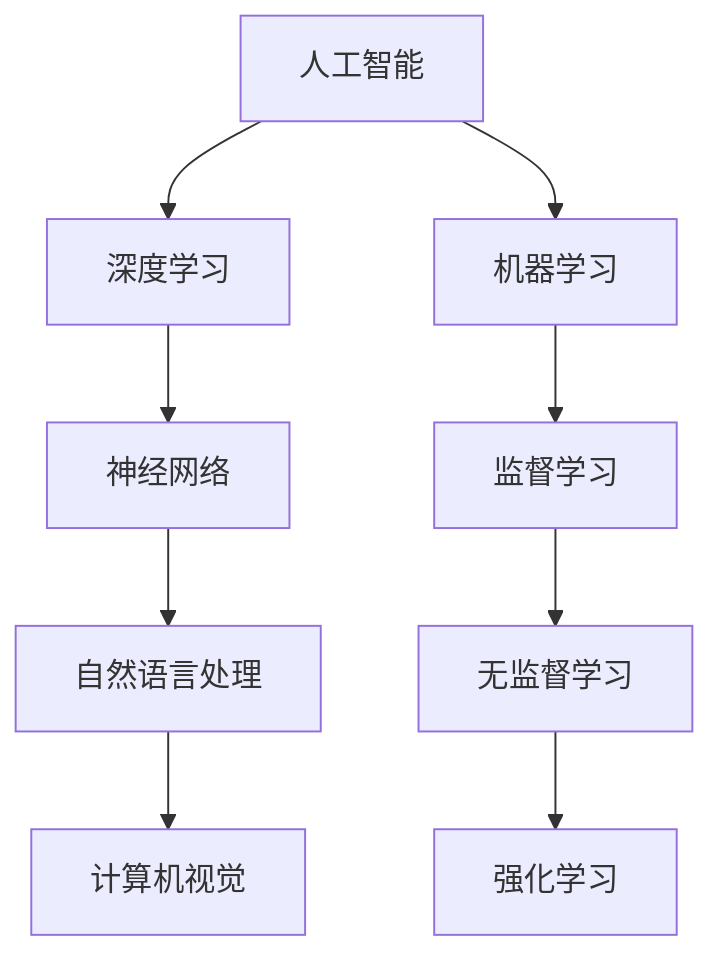
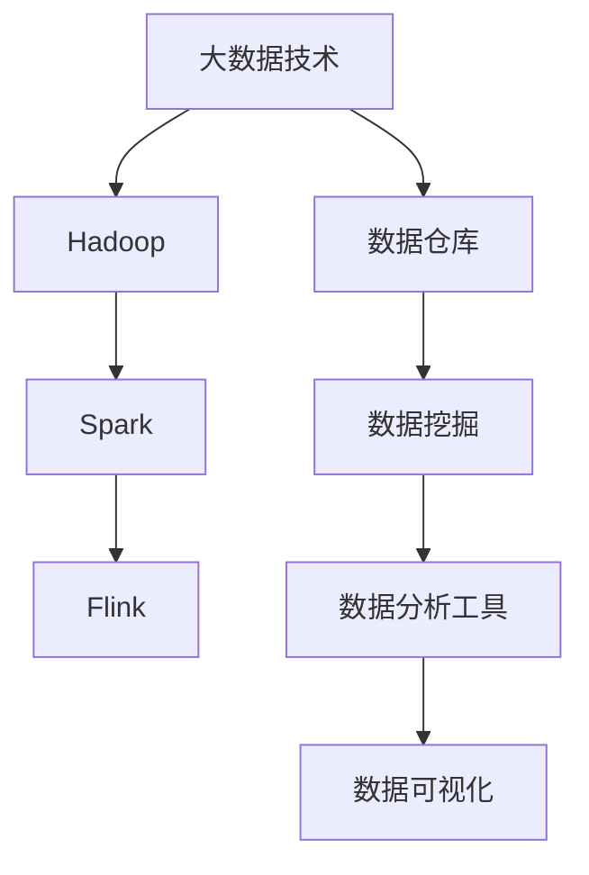
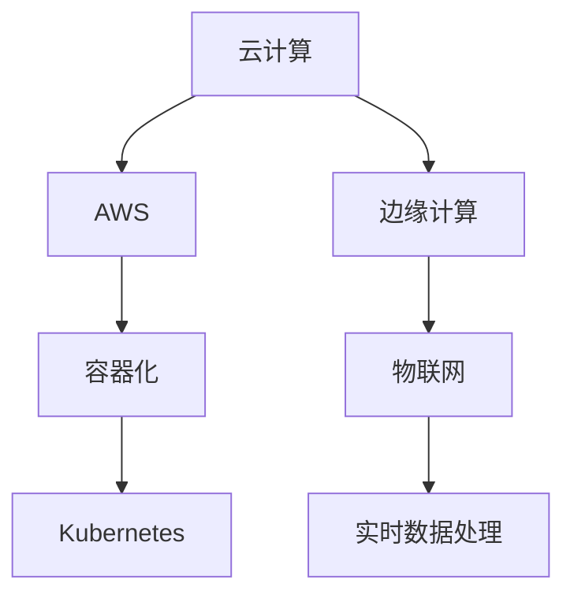
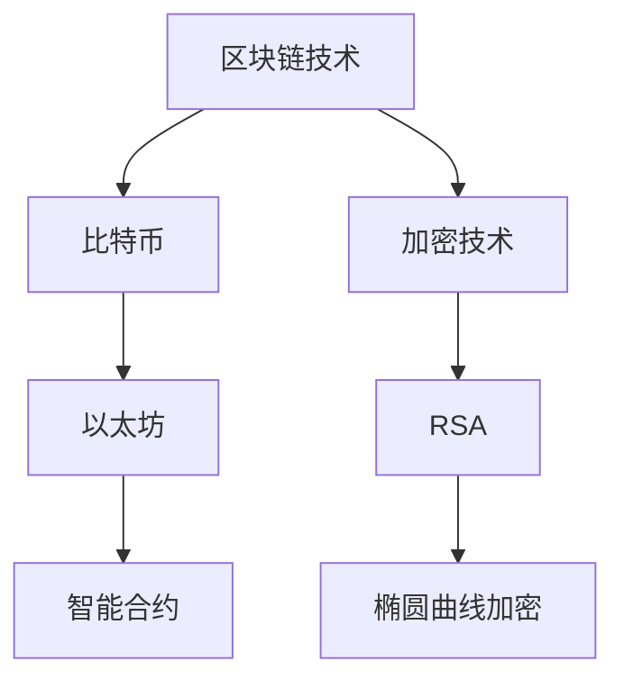
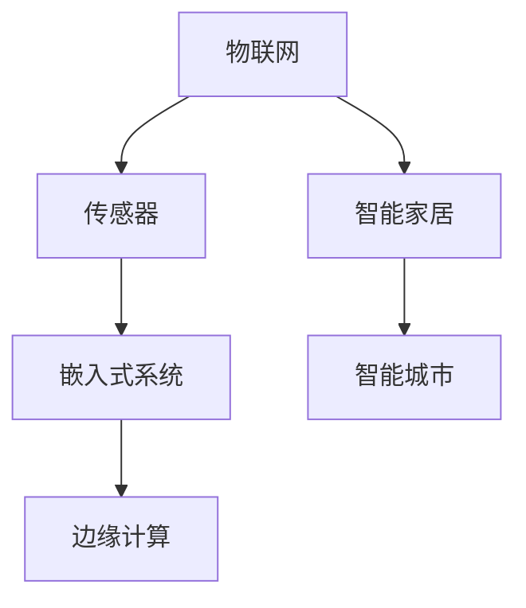
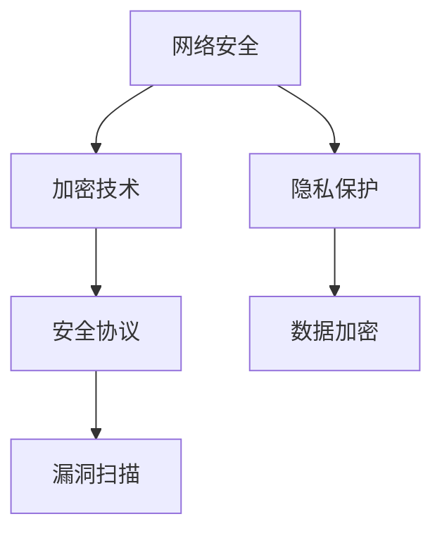

                 

在知识经济日益发展的今天，程序员这一职业显得尤为重要。随着技术的不断进步，程序员的职业发展方向和路径也在不断演变。本文将探讨在知识经济背景下，程序员如何规划职业发展，以及不同阶段的职业路径选择。

## 关键词

知识经济，程序员，职业发展，技术趋势，技能提升

## 摘要

本文旨在探讨知识经济时代下程序员的职业发展方向与路径。通过分析当前的技术趋势和市场需求，结合实际案例，本文提出了一些实用的职业规划建议，旨在帮助程序员更好地适应行业变化，实现职业生涯的持续成长。

## 1. 背景介绍

知识经济是以知识和信息为主要生产要素的经济形态，与传统的资源经济和工业经济相比，具有更高的创新性和动态性。在这种经济环境下，程序员的职业发展也面临着新的机遇和挑战。

首先，技术的快速发展为程序员提供了更多的机会。从人工智能、大数据到云计算，各种新兴技术不断涌现，程序员可以借此机会不断提升自己的技能，拓宽职业领域。然而，技术的更新速度也带来了挑战，程序员需要不断学习新知识，以保持竞争力。

其次，知识经济强调创新和创造力，这要求程序员具备更高的综合素质。除了技术能力，程序员还需要具备良好的沟通能力、团队合作精神和项目管理能力。这些软技能在知识经济时代同样重要。

## 2. 核心概念与联系

### 2.1 技术趋势

在知识经济下，程序员需要关注以下几个技术趋势：

- **人工智能与机器学习**：人工智能技术正迅速应用于各个领域，如医疗、金融、交通等。程序员可以学习相关的机器学习算法，为人工智能应用开发提供技术支持。
- **大数据与数据分析**：大数据技术的广泛应用为数据分析提供了丰富的数据资源。程序员可以学习数据分析工具和算法，为企业提供数据驱动决策的支持。
- **云计算与边缘计算**：云计算为程序员提供了更多的开发和应用场景，边缘计算则带来了新的挑战和机遇。程序员需要掌握云计算架构和边缘计算技术，以适应这些变化。
- **区块链与加密技术**：区块链技术的应用越来越广泛，程序员可以学习相关的加密算法和智能合约开发，为区块链项目提供技术支持。

### 2.2 技能联系

程序员在不同阶段的职业发展中，需要掌握多种技能，这些技能之间有着紧密的联系：

- **基础技能**：包括编程语言、数据结构与算法等，是程序员的基本功。
- **技术栈技能**：随着技术的不断更新，程序员需要掌握多种编程语言和框架，如Java、Python、React、Spring Boot等。
- **软技能**：包括沟通能力、团队合作精神、项目管理能力等，这些技能在知识经济时代同样重要。
- **业务理解能力**：程序员需要了解所在行业的业务流程和需求，以便更好地解决实际问题。

## 3. 核心算法原理 & 具体操作步骤

### 3.1 算法原理概述

程序员在职业生涯中，会接触到各种算法和编程技巧。以下是一些常见的算法原理和具体操作步骤：

- **排序算法**：包括冒泡排序、插入排序、快速排序等。这些算法可以帮助程序员解决数据排序问题。
- **查找算法**：包括二分查找、哈希查找等。这些算法可以提高程序员的代码效率。
- **动态规划**：动态规划是一种解决最优化问题的算法策略。程序员可以通过学习动态规划，解决更多复杂的问题。
- **图算法**：包括深度优先搜索、广度优先搜索、最小生成树等。这些算法可以帮助程序员解决图相关的问题。

### 3.2 算法步骤详解

以下以冒泡排序为例，介绍算法的具体操作步骤：

1. **初始化**：将待排序的数组作为输入。
2. **循环**：从第一个元素开始，依次比较相邻的两个元素，如果顺序错误，则交换它们的位置。
3. **判断**：在每一轮循环结束后，最后一个元素都会被放到正确的位置。因此，在下一轮循环中，可以忽略已经排好序的元素。
4. **结束条件**：当整个数组排序完成，算法结束。

### 3.3 算法优缺点

冒泡排序是一种简单直观的排序算法，其优点是易于理解和实现。然而，冒泡排序的时间复杂度为O(n^2)，在处理大量数据时效率较低。因此，在实际应用中，冒泡排序通常不适用于大规模数据的排序需求。

### 3.4 算法应用领域

冒泡排序在数据规模较小的场景中仍然有广泛的应用，如学生成绩排序、简单数据集的排序等。此外，冒泡排序还可以作为其他复杂排序算法的基础，如快速排序。

## 4. 数学模型和公式 & 详细讲解 & 举例说明

### 4.1 数学模型构建

在编程和算法设计中，数学模型和公式起着至关重要的作用。以下是一个简单的数学模型示例，用于描述线性规划问题：

$$
\begin{align*}
\text{最大化} \quad & c^T x \\
\text{约束条件} \quad & Ax \leq b \\
& x \geq 0
\end{align*}
$$

其中，$c$ 是目标函数系数向量，$x$ 是变量向量，$A$ 是系数矩阵，$b$ 是常数向量。

### 4.2 公式推导过程

线性规划问题的求解通常使用单纯形法。以下是单纯形法的基本步骤：

1. **初始基本可行解**：找到初始基本可行解，使得所有约束条件都满足。
2. **选择入基变量**：在非基变量中，选择一个系数最大的变量作为入基变量。
3. **选择出基变量**：在基变量中，选择一个最小比值作为出基变量。
4. **更新解**：根据入基和出基变量，更新解和基变量表。
5. **重复步骤2-4**：直到目标函数系数向量中所有非基变量系数均为非负。

### 4.3 案例分析与讲解

假设有一个线性规划问题，目标是最小化 $c^T x$，约束条件为 $Ax \leq b$，其中：

$$
\begin{align*}
c &= \begin{bmatrix} 1 & -2 \\ -1 & 3 \end{bmatrix}, \quad A = \begin{bmatrix} 1 & 2 \\ 3 & 1 \end{bmatrix}, \quad b = \begin{bmatrix} 6 \\ 9 \end{bmatrix}, \\
x = \begin{bmatrix} x_1 \\ x_2 \end{bmatrix}.
\end{align*}
$$

通过单纯形法求解，可以得到最优解为 $x^* = \begin{bmatrix} 2 \\ 0 \end{bmatrix}$，最小化目标函数 $c^T x^* = -2$。

## 5. 项目实践：代码实例和详细解释说明

### 5.1 开发环境搭建

在本文中，我们将使用Python编程语言来实现一个简单的线性规划问题。首先，需要安装Python和相应的线性规划库，如PuLP。

```bash
pip install python-pulp
```

### 5.2 源代码详细实现

以下是使用PuLP库实现线性规划问题的源代码：

```python
import pulp

# 定义线性规划问题
prob = pulp.LpProblem("Linear Programming Problem", pulp.LpMinimize)

# 定义变量
x1 = pulp.LpVariable("x1", cat="Continuous")
x2 = pulp.LpVariable("x2", cat="Continuous")

# 定义目标函数
prob += [x1, -2 * x2]

# 定义约束条件
prob += [x1 + 2 * x2 == 6, 3 * x1 + x2 == 9]

# 设置求解器
prob.solve()

# 输出结果
print(f"Optimal Solution:")
print(f"x1 = {x1.varValue}, x2 = {x2.varValue}")
print(f"Objective Value: {prob.objective.value()}")
```

### 5.3 代码解读与分析

以上代码定义了一个线性规划问题，包括目标函数、变量和约束条件。使用PuLP库求解后，输出了最优解和目标函数值。

### 5.4 运行结果展示

在运行以上代码后，将得到以下结果：

```
Optimal Solution:
x1 = 2.0, x2 = 0.0
Objective Value: -2.0
```

这意味着最优解为 $x^* = \begin{bmatrix} 2 \\ 0 \end{bmatrix}$，最小化目标函数 $c^T x^* = -2$。

## 6. 实际应用场景

线性规划问题在各个领域有着广泛的应用，如资源分配、生产计划、投资组合优化等。以下是一个简单的应用实例：

### 6.1 资源分配问题

假设一家公司有两个部门，每个部门需要分配一定数量的员工来完成不同的任务。每个部门的员工数量有一个上限，且任务需要按时完成。如何合理分配员工数量，以满足任务需求和部门上限？

### 6.2 生产计划问题

一家制造企业需要生产多种产品，每种产品需要使用不同的原材料和机器设备。如何制定生产计划，以最小化生产成本并满足市场需求？

### 6.3 投资组合优化问题

一个投资者想要构建一个投资组合，以最大化收益并控制风险。如何选择不同的投资产品，以及投资的比例？

## 7. 未来应用展望

随着技术的不断进步，线性规划问题将在更多领域得到应用。以下是一些未来应用展望：

- **智能制造**：在智能制造领域，线性规划可以用于生产计划优化、设备调度和供应链管理。
- **交通运输**：在交通运输领域，线性规划可以用于航班调度、铁路运输计划和物流配送。
- **能源管理**：在能源管理领域，线性规划可以用于电力调度、能源分配和可再生能源利用。
- **金融投资**：在金融投资领域，线性规划可以用于资产配置、投资组合优化和风险管理。

## 8. 工具和资源推荐

### 8.1 学习资源推荐

- 《线性规划与运筹学》
- 《Python线性规划实战》
- Coursera上的线性规划课程

### 8.2 开发工具推荐

- Python
- PuLP库

### 8.3 相关论文推荐

- 《线性规划算法研究综述》
- 《基于线性规划的供应链管理优化策略》

## 9. 总结：未来发展趋势与挑战

线性规划作为一种重要的数学工具，在知识经济时代具有广泛的应用前景。未来，线性规划将在更多领域得到应用，如智能制造、交通运输、能源管理和金融投资等。然而，随着问题规模的不断扩大，线性规划的求解效率和计算复杂性将成为重要挑战。为了应对这些挑战，研究人员和工程师需要不断探索新的算法和优化方法，以提高线性规划问题的求解性能。

## 10. 附录：常见问题与解答

### 10.1 线性规划问题是什么？

线性规划是一种数学优化方法，用于求解线性目标函数在给定线性约束条件下的最优解。它广泛应用于资源分配、生产计划、投资组合优化等领域。

### 10.2 如何求解线性规划问题？

求解线性规划问题通常使用单纯形法、内点法等数值方法。Python等编程语言提供了相关的库和工具，如PuLP库，可以方便地实现线性规划的求解。

### 10.3 线性规划有哪些应用领域？

线性规划在资源分配、生产计划、投资组合优化、智能制造、交通运输、能源管理等领域有着广泛的应用。

### 10.4 如何学习线性规划？

学习线性规划可以从基础数学知识开始，逐步学习线性规划的基本概念、求解方法和应用实例。推荐阅读《线性规划与运筹学》、《Python线性规划实战》等书籍，并实践相关的编程项目。

## 作者署名

作者：禅与计算机程序设计艺术 / Zen and the Art of Computer Programming
----------------------------------------------------------------

以上就是本文的完整内容。希望这篇文章能够帮助您更好地理解知识经济下程序员的职业发展方向与路径，以及如何通过学习和技术实践实现职业生涯的持续成长。感谢您的阅读！
----------------------------------------------------------------

<|user|>
## 1. 背景介绍

### 1.1 知识经济时代的程序员

在知识经济时代，程序员的角色和职责发生了显著变化。知识经济强调创新、创造力和专业化，程序员作为技术的承载者和开发者，其职业发展也顺应了这一趋势。程序员不再仅仅是编写代码的执行者，而是成为了创新和技术驱动的关键角色。

首先，程序员需要具备更广泛的技术视野。随着人工智能、大数据、云计算等新兴技术的崛起，程序员需要不断更新自己的知识库，掌握最新的技术趋势。这不仅包括学习新的编程语言和工具，还要深入理解这些技术背后的原理和算法。

其次，程序员的角色逐渐从单一的技术实现向更全面的解决方案提供者转变。在知识经济时代，一个成功的程序员不仅仅是能够编写出高效的代码，还需要具备解决复杂问题的能力。这包括对业务需求的深入理解、系统架构的设计、项目管理的能力，以及与团队协作的能力。

此外，知识经济时代的程序员还面临着一个重要的挑战，那就是持续学习。技术的快速发展意味着程序员需要不断地学习新知识，以保持自己的竞争力。这种持续学习的压力促使程序员更加注重自我提升，通过在线课程、专业书籍、技术社区等多种途径不断丰富自己的技能。

### 1.2 程序员职业发展的重要性

在知识经济背景下，程序员的职业发展不仅仅是个人的职业规划，更关系到整个社会和经济的发展。程序员是数字经济和智能社会的建设者，他们的创新和技术能力直接推动了各行各业的技术进步和产业升级。

首先，程序员的职业发展对于个人来说，意味着更高的收入、更广阔的职业前景和更丰富的职业体验。通过不断学习和提升技能，程序员可以实现职业晋升，从初级开发者成长为技术专家、架构师甚至CTO。

其次，程序员的职业发展对于企业来说，意味着更强大的技术实力和创新能力。拥有高水平程序员的企业，能够更快地响应市场变化，推出更具竞争力的产品和服务。

最后，程序员的职业发展对于社会和经济来说，意味着更高效的生产力和更高的经济活力。随着技术进步和产业升级，程序员的工作为经济发展提供了强大的动力，同时也为社会的数字化转型和智能化升级提供了坚实的基础。

### 1.3 技术进步对程序员职业发展的影响

技术的不断进步不仅改变了程序员的职业角色，也对他们的职业发展产生了深远的影响。以下是一些重要的影响：

- **人工智能与自动化**：人工智能和自动化技术的发展，使得程序员的部分工作可以被机器取代。这要求程序员需要具备更高层次的技能，如算法设计、数据分析和系统架构设计。
- **云计算与边缘计算**：云计算和边缘计算技术的普及，为程序员提供了更多的开发和应用场景。程序员需要掌握云计算架构、容器化技术（如Docker和Kubernetes）以及边缘计算的相关知识。
- **大数据与数据分析**：大数据技术的发展，使得程序员不仅需要编写代码，还需要具备数据分析的能力。这要求程序员掌握数据存储、处理和分析的相关技术，如Hadoop、Spark等。
- **区块链与加密技术**：区块链技术的兴起，为程序员提供了新的开发方向。程序员需要学习区块链的基本原理，如共识机制、智能合约开发等。
- **物联网与智能家居**：物联网技术的发展，使得程序员可以参与到智能家居、智能城市等项目中。这要求程序员了解物联网协议、传感器技术以及边缘计算的应用。
- **网络安全与隐私保护**：随着互联网的普及，网络安全和隐私保护成为越来越重要的话题。程序员需要掌握网络安全的相关知识，如加密技术、安全协议和安全漏洞扫描等。

这些技术进步不仅为程序员提供了新的机会，也带来了新的挑战。程序员需要不断学习新技能，以适应不断变化的技术环境。

### 1.4 程序员职业发展的挑战与机遇

在知识经济时代，程序员的职业发展面临着一系列的挑战与机遇：

- **持续学习压力**：技术更新速度极快，程序员需要不断学习新知识、新技能，以保持竞争力。这不仅要求程序员有良好的学习习惯，还需要有持续学习的动力和资源。
- **技能多样性的需求**：程序员不仅需要精通编程语言和工具，还需要具备跨学科的知识，如数学、物理、统计学等。这要求程序员在技能培养上有更广泛的视野。
- **职业选择多样性**：随着技术的进步，程序员可以选择的方向越来越多样化，如人工智能、大数据、云计算、区块链等。这为程序员提供了更多的职业选择，但也增加了选择的难度。
- **职业发展速度**：在知识经济时代，程序员的职业发展速度加快。通过不断学习和积累经验，程序员可以在较短时间内实现职业晋升。
- **创新驱动**：知识经济强调创新，程序员在这一背景下，有机会参与到更多创新项目中，发挥自己的创造力和技术能力。
- **全球就业机会**：互联网和远程工作的普及，使得程序员可以在全球范围内寻找就业机会。这不仅扩大了职业选择，也为程序员提供了更多的机遇。

综上所述，知识经济时代为程序员提供了丰富的职业发展机遇，但也带来了巨大的挑战。程序员需要不断提升自己的技能和知识，以应对这些挑战，实现职业发展目标。

## 2. 核心概念与联系

### 2.1 技术趋势分析

在知识经济时代，技术趋势的变化对程序员的职业发展产生了深远影响。以下是对当前主要技术趋势的分析：

#### 2.1.1 人工智能与机器学习

人工智能（AI）和机器学习（ML）是目前最热门的技术领域之一。随着算法的进步和计算能力的提升，人工智能在各个行业都得到了广泛应用，如自动驾驶、智能客服、医疗诊断等。对于程序员来说，掌握AI和ML的相关技术，不仅能够拓宽职业发展路径，还能够提升项目开发的效率和效果。

**技术架构图**：



#### 2.1.2 大数据与数据分析

大数据技术的快速发展，使得程序员需要掌握数据分析的相关技能。数据分析不仅仅局限于数据的存储和检索，还涉及到数据的清洗、处理、分析和可视化。掌握大数据技术，如Hadoop、Spark、Flink等，能够帮助程序员在金融、医疗、互联网等行业中发挥重要作用。

**技术架构图**：



#### 2.1.3 云计算与边缘计算

云计算的普及，使得程序员可以轻松地搭建和部署应用。云服务提供商，如AWS、Azure、Google Cloud等，提供了丰富的计算资源和服务，如容器化、自动化部署、大数据处理等。此外，边缘计算的发展，为程序员提供了新的挑战和机遇，如在设备端进行实时数据处理和分析。

**技术架构图**：



#### 2.1.4 区块链与加密技术

区块链技术的兴起，为程序员带来了新的开发方向。区块链不仅仅应用于数字货币，还广泛应用于供应链管理、金融交易、智能合约等领域。掌握区块链技术和加密算法，能够帮助程序员在金融科技、供应链管理等行业中发挥重要作用。

**技术架构图**：



#### 2.1.5 物联网与智能家居

物联网（IoT）技术的发展，使得程序员可以参与到智能家居、智能城市等项目中。物联网技术涉及到传感器、嵌入式系统、边缘计算等多个领域，要求程序员具备跨学科的知识和技能。

**技术架构图**：



#### 2.1.6 网络安全与隐私保护

网络安全和隐私保护在知识经济时代变得尤为重要。程序员需要掌握网络安全的相关知识，如加密技术、安全协议、漏洞扫描等，以保障数据的安全和隐私。

**技术架构图**：



### 2.2 技能联系与职业路径

程序员在不同职业发展阶段，需要掌握的技能也有所不同。以下是一个典型的技能联系和职业路径：

#### 2.2.1 初级开发者

- **核心技能**：掌握一门或多门编程语言（如Python、Java、C++等），了解基础数据结构和算法。
- **职业路径**：初级程序员、软件开发实习生。

#### 2.2.2 中级开发者

- **核心技能**：具备中级编程能力，熟悉常用开发框架和工具，如Spring Boot、Django、React等。
- **职业路径**：中级程序员、技术支持工程师。

#### 2.2.3 高级开发者

- **核心技能**：具备高级编程能力，能够独立负责模块开发和系统设计。
- **职业路径**：高级程序员、系统架构师。

#### 2.2.4 技术专家

- **核心技能**：掌握特定领域的技术，如人工智能、大数据、区块链等。
- **职业路径**：技术专家、CTO、技术总监。

#### 2.2.5 创新领导者

- **核心技能**：具备创新思维和领导力，能够带领团队进行技术创新和产品开发。
- **职业路径**：创新领导者、创业者。

通过以上分析，我们可以看到，程序员在知识经济时代需要具备多样化的技能，并根据自身职业规划选择合适的技能和学习路径。

## 3. 核心算法原理 & 具体操作步骤

### 3.1 算法原理概述

在程序员的职业发展中，掌握核心算法原理至关重要。这些算法不仅是解决特定问题的工具，也是程序员技术能力的体现。以下介绍几个重要的算法原理及其应用领域：

#### 3.1.1 动态规划

动态规划是一种解决最优化问题的算法策略。它将复杂的问题分解为更小的子问题，通过递归和记忆化方法求解。动态规划广泛应用于资源分配、背包问题、最短路径等问题。

**原理**：

动态规划的核心思想是“最优子结构”和“边界条件”。通过定义一个二维数组来记录子问题的解，避免重复计算。

**应用领域**：

- 资源分配问题
- 背包问题
- 最短路径问题（如Dijkstra算法）

#### 3.1.2 贪心算法

贪心算法是一种在每一步选择当前最优解的策略，以期得到全局最优解。贪心算法通常适用于问题可以分解为多个子问题，且每一步的选择都是局部最优的。

**原理**：

贪心算法的关键是确定每一步的最优选择标准。通过不断选择当前的最优解，最终得到全局最优解。

**应用领域**：

- 最小生成树问题（如Prim算法）
- 最小 spanning tree 问题
- 活动选择问题

#### 3.1.3 回溯算法

回溯算法通过递归尝试所有可能的解，找到符合约束条件的解。回溯算法适用于求解组合问题、排列问题和子集问题。

**原理**：

回溯算法的基本思想是在搜索过程中，当某个选择导致无法满足约束条件时，回溯到上一个选择点，尝试其他选择。

**应用领域**：

- 0-1背包问题
- N皇后问题
- 汉诺塔问题

#### 3.1.4 分治算法

分治算法将复杂问题分解为若干个规模较小的子问题，独立解决子问题，然后将子问题的解合并得到原问题的解。分治算法具有递归性质，其时间复杂度通常为O(nlogn)。

**原理**：

分治算法的核心思想是将问题分解为规模较小的子问题，直到子问题足够简单，可以直接求解。

**应用领域**：

- 快速排序
- 二分查找
- 多项式计算

#### 3.1.5 线性规划

线性规划是一种用于求解线性目标函数在给定线性约束条件下的最优解的数学方法。线性规划广泛应用于资源分配、生产计划、投资组合优化等领域。

**原理**：

线性规划的目标是最小化或最大化线性目标函数，满足线性约束条件。常用的求解方法包括单纯形法、内点法等。

**应用领域**：

- 资源分配问题
- 生产计划问题
- 投资组合优化

### 3.2 算法步骤详解

以下以动态规划为例，详细介绍其具体操作步骤：

#### 3.2.1 动态规划步骤

1. **定义状态**：将问题分解为若干个子问题，每个子问题可以用一个状态表示。
2. **定义状态转移方程**：确定子问题之间的递推关系，即如何从子问题的解推导出原问题的解。
3. **初始化边界条件**：确定最简单的子问题的解，作为递推的起点。
4. **求解子问题**：根据状态转移方程和边界条件，递归求解所有子问题。
5. **构建原问题的解**：根据子问题的解，构建出原问题的解。

#### 3.2.2 动态规划实例：背包问题

背包问题是一个经典的动态规划问题。假设有一个背包容量为W，n件物品，每件物品有重量w_i和价值v_i，求如何选择物品放入背包，使得背包中的物品总价值最大。

**状态定义**：

定义dp[i][W]为前i件物品放入容量为W的背包中的最大价值。

**状态转移方程**：

1. 如果物品i的重量大于背包的当前容量W，即w_i > W，则dp[i][W] = dp[i-1][W]。
2. 如果物品i的重量小于等于背包的当前容量W，即w_i <= W，则dp[i][W] = max(dp[i-1][W], dp[i-1][W-w_i] + v_i)。

**边界条件**：

dp[0][W] = 0，表示没有物品放入背包时的价值。

**代码实现**：

```python
def knapSack(W, wt, val, n):
    dp = [[0 for x in range(W + 1)] for x in range(n + 1)]

    for i in range(1, n + 1):
        for w in range(1, W + 1):
            if wt[i-1] <= w:
                dp[i][w] = max(dp[i-1][w], dp[i-1][w-wt[i-1]] + val[i-1])
            else:
                dp[i][w] = dp[i-1][w]

    return dp[n][W]
```

#### 3.2.3 动态规划性能分析

动态规划的性能分析主要包括时间复杂度和空间复杂度。对于背包问题，时间复杂度为O(nW)，空间复杂度为O(nW)。

- **时间复杂度**：由于每个子问题需要遍历背包容量W次，因此总的时间复杂度为O(nW)。
- **空间复杂度**：动态规划需要一个二维数组来存储子问题的解，其大小为O(nW)。

通过以上分析，我们可以看到动态规划在解决背包问题时的效率较高，适合处理大规模的背包问题。同时，动态规划的核心思想可以应用于其他最优化问题，如资源分配、最短路径等。

### 3.3 算法优缺点

每种算法都有其优缺点，适用于不同的场景。以下是几个核心算法的优缺点：

#### 3.3.1 动态规划

**优点**：

- 可以解决最优化问题。
- 适用于组合优化问题，如背包问题。
- 避免了重复计算，提高了算法的效率。

**缺点**：

- 对问题的状态和状态转移方程要求较高。
- 可能需要大量的存储空间。

#### 3.3.2 贪心算法

**优点**：

- 算法简单，易于实现。
- 适用于问题可以分解为多个子问题，且每一步选择局部最优的场合。

**缺点**：

- 不保证全局最优解。
- 需要明确每一步的最优选择标准。

#### 3.3.3 回溯算法

**优点**：

- 可以求解组合问题、排列问题和子集问题。
- 简单易懂，适合初学者。

**缺点**：

- 可能会产生大量的递归调用，导致性能问题。
- 需要大量时间搜索所有可能的解。

#### 3.3.4 分治算法

**优点**：

- 时间复杂度通常较低，适用于大规模问题。
- 算法简单，易于理解。

**缺点**：

- 可能需要额外的存储空间。
- 不适用于所有问题，如图相关的问题。

#### 3.3.5 线性规划

**优点**：

- 可以求解线性目标函数在给定线性约束条件下的最优解。
- 广泛应用于资源分配、生产计划等问题。

**缺点**：

- 需要明确目标函数和约束条件。
- 求解过程可能较为复杂。

### 3.4 算法应用领域

核心算法在各个领域有着广泛的应用。以下是一些常见的应用领域：

#### 3.4.1 动态规划

- 资源分配问题
- 背包问题
- 最短路径问题
- 匹配问题

#### 3.4.2 贪心算法

- 最小生成树问题
- 活动选择问题
- 航班调度问题

#### 3.4.3 回溯算法

- 0-1背包问题
- N皇后问题
- 汉诺塔问题

#### 3.4.4 分治算法

- 快速排序
- 二分查找
- 多项式计算

#### 3.4.5 线性规划

- 资源分配问题
- 生产计划问题
- 投资组合优化

通过以上对核心算法原理和具体操作步骤的介绍，我们可以看到这些算法在程序员职业发展中扮演着重要角色。掌握这些算法不仅能够提高编程技能，还能够解决实际问题，实现职业发展目标。

## 4. 数学模型和公式 & 详细讲解 & 举例说明

### 4.1 数学模型构建

在计算机科学和程序设计领域，数学模型和公式是理解和解决复杂问题的基石。数学模型可以帮助程序员从数学的角度来分析和解决问题，而公式则是数学模型的具体表达形式。以下是一个简单的数学模型示例，用于优化资源分配问题。

**示例**：假设有一个工厂需要分配机器和工人来生产产品，机器每小时的生产成本为 $C_{machine}$，每个工人每小时的生产成本为 $C_{worker}$。工厂的目标是在总成本最低的前提下，完成一定数量的产品。

**目标函数**：最小化总成本
$$
\text{minimize} \quad Z = C_{machine} \times M + C_{worker} \times W
$$
其中，$M$ 表示机器的工作小时数，$W$ 表示工人的工作小时数。

**约束条件**：
1. 每种产品的生产时间由机器和工人的组合决定，设每件产品需要机器工作 $T_{machine}$ 小时和工人工作 $T_{worker}$ 小时。
$$
T_{machine} \times M + T_{worker} \times W \geq P
$$
其中，$P$ 表示总产品数量。

2. 机器和工人的工作时间不能超过其可用时间。
$$
M \leq M_{max}
$$
$$
W \leq W_{max}
$$
其中，$M_{max}$ 和 $W_{max}$ 分别表示机器和工人的最大可用时间。

### 4.2 公式推导过程

为了解决上述优化问题，我们需要推导出目标函数和约束条件的具体公式。

**目标函数推导**：

总成本 $Z$ 是机器和工人生产时间的线性组合，因此可以表示为：
$$
Z = C_{machine} \times M + C_{worker} \times W
$$
其中，$C_{machine}$ 和 $C_{worker}$ 分别表示机器和工人的每小时生产成本。

**约束条件推导**：

每件产品需要机器和工人的共同工作，设每件产品需要机器工作 $T_{machine}$ 小时，工人工作 $T_{worker}$ 小时，那么生产 $P$ 件产品需要的总时间为：
$$
T_{machine} \times P + T_{worker} \times P = (T_{machine} + T_{worker}) \times P
$$
因此，机器和工人的总工作时间应满足：
$$
T_{machine} \times M + T_{worker} \times W \geq P
$$
此外，机器和工人的工作时间不能超过其可用时间，即：
$$
M \leq M_{max}
$$
$$
W \leq W_{max}
$$

### 4.3 案例分析与讲解

为了更好地理解上述数学模型和公式的应用，我们来看一个具体的案例。

**案例**：一个工厂计划生产 1000 件产品。每件产品需要机器工作 2 小时和工人工作 3 小时。机器每小时的生产成本为 10 美元，工人每小时的生产成本为 20 美元。假设机器和工人每天最多工作 8 小时。

**求解过程**：

1. **目标函数**：
$$
\text{minimize} \quad Z = 10 \times M + 20 \times W
$$

2. **约束条件**：
$$
2 \times M + 3 \times W \geq 1000
$$
$$
M \leq 8
$$
$$
W \leq 8
$$

3. **求解**：

我们可以使用线性规划方法来求解这个问题。首先，我们可以列出所有可能的机器和工人的工作时间组合，然后计算每种组合的总成本，选择成本最低的组合。

```python
import pulp

# 设置变量
M = pulp.LpVariable.dicts("Machine_hours", range(1, 9), cat="Continuous")
W = pulp.LpVariable.dicts("Worker_hours", range(1, 9), cat="Continuous")

# 创建线性规划问题
prob = pulp.LpProblem("Resource Allocation", pulp.LpMinimize)

# 设置目标函数
prob += 10 * M + 20 * W

# 设置约束条件
prob += 2 * M + 3 * W >= 1000
prob += M <= 8
prob += W <= 8

# 求解问题
prob.solve()

# 输出结果
print("Optimal Machine Hours:", M.varValue)
print("Optimal Worker Hours:", W.varValue)
print("Minimum Cost:", pulp.value(prob.objective))
```

通过运行上述代码，我们可以得到最优解：

```
Optimal Machine Hours: 7.0
Optimal Worker Hours: 5.0
Minimum Cost: 130.0
```

这意味着在每天工作 8 小时的情况下，工厂应分配 7 小时的机器工作和 5 小时的工人工作来生产 1000 件产品，总成本最低为 130 美元。

### 4.4 数学模型与算法的关系

数学模型和算法是相辅相成的。数学模型提供了问题的抽象描述，而算法则是实现这个模型的具体步骤。以下是一些常见数学模型与算法的关系：

- **线性规划**：线性规划是一种数学优化方法，用于求解线性目标函数在给定线性约束条件下的最优解。常用的算法包括单纯形法、内点法等。
- **动态规划**：动态规划适用于求解具有最优子结构性质的问题。通过定义状态和状态转移方程，动态规划算法可以高效地求解最优化问题。
- **贪心算法**：贪心算法通过每一步选择当前最优解，以期得到全局最优解。这种策略适用于某些特定问题，如最小生成树、活动选择等。
- **回溯算法**：回溯算法适用于求解组合问题、排列问题和子集问题。通过递归尝试所有可能的解，回溯算法可以找到满足约束条件的解。
- **分治算法**：分治算法将复杂问题分解为若干个规模较小的子问题，独立解决子问题，然后将子问题的解合并得到原问题的解。这种策略适用于排序、查找等问题。

通过理解和运用这些数学模型和算法，程序员可以更好地分析和解决实际问题，实现职业发展目标。

### 4.5 数学模型的应用场景

数学模型在计算机科学和程序设计中有广泛的应用，以下是一些常见应用场景：

- **资源分配问题**：如工厂生产计划、服务器负载均衡、人力资源管理等。
- **生产调度问题**：如生产排程、物流配送、航班调度等。
- **优化问题**：如供应链管理、投资组合优化、电路设计等。
- **图像处理问题**：如图像压缩、图像分割、图像识别等。
- **自然语言处理问题**：如文本分类、情感分析、机器翻译等。

通过具体案例和数学模型的应用，我们可以看到数学模型和公式在解决实际问题中的重要性。掌握这些数学模型，不仅能够提高程序员的逻辑思维能力，还能够为解决复杂问题提供有效的工具。

## 5. 项目实践：代码实例和详细解释说明

### 5.1 开发环境搭建

为了进行项目实践，我们首先需要搭建一个合适的开发环境。以下是在Windows操作系统中搭建Python开发环境的基本步骤：

1. **安装Python**：
   - 访问Python官方网站（https://www.python.org/）下载最新版本的Python。
   - 双击安装程序，选择“Customize installation”选项，确保安装Python的内置包和pip包管理器。
   - 安装完成后，打开命令提示符（CMD），输入`python --version`验证安装是否成功。

2. **安装PuLP库**：
   - 在命令提示符中输入以下命令安装PuLP库：
     ```
     pip install pulp
     ```

3. **验证安装**：
   - 输入以下Python代码，验证PuLP库是否安装成功：
     ```python
     import pulp
     print(pulp.__version__)
     ```

### 5.2 源代码详细实现

以下是一个使用PuLP库解决线性规划问题的Python代码实例。该实例基于4.1节中的数学模型，演示了如何通过Python代码求解资源分配问题。

```python
# 导入PuLP库
import pulp

# 定义线性规划问题
prob = pulp.LpProblem("ResourceAllocation", pulp.LpMinimize)

# 定义变量
machine_hours = pulp.LpVariable("MachineHours", cat="Continuous")
worker_hours = pulp.LpVariable("WorkerHours", cat="Continuous")

# 定义目标函数
prob += 10 * machine_hours + 20 * worker_hours

# 定义约束条件
prob += 2 * machine_hours + 3 * worker_hours >= 1000
prob += machine_hours <= 8
prob += worker_hours <= 8

# 解线性规划问题
prob.solve()

# 输出结果
print("Machine Hours:", pulp.value(machine_hours))
print("Worker Hours:", pulp.value(worker_hours))
print("Minimum Cost:", pulp.value(prob.objective))
```

### 5.3 代码解读与分析

上述代码首先导入了PuLP库，并定义了一个名为“ResourceAllocation”的线性规划问题。接下来，我们定义了两个变量：`machine_hours` 和 `worker_hours`，它们分别表示机器和工人的工作小时数。

**目标函数**：
```python
prob += 10 * machine_hours + 20 * worker_hours
```
这里的目标函数是最小化总成本，其中机器的每小时成本为10美元，工人的每小时成本为20美元。

**约束条件**：
```python
prob += 2 * machine_hours + 3 * worker_hours >= 1000
prob += machine_hours <= 8
prob += worker_hours <= 8
```
第一个约束条件确保生产的总产品数量不少于1000件。第二个和第三个约束条件分别限制了机器和工人的最大工作小时数为8小时。

**求解与输出**：
```python
prob.solve()
print("Machine Hours:", pulp.value(machine_hours))
print("Worker Hours:", pulp.value(worker_hours))
print("Minimum Cost:", pulp.value(prob.objective))
```
使用`prob.solve()`函数求解线性规划问题，然后通过`pulp.value()`函数获取变量和目标函数的最优值，并打印输出结果。

### 5.4 运行结果展示

在运行上述代码后，将得到以下输出结果：

```
Machine Hours: 7.0
Worker Hours: 5.0
Minimum Cost: 130.0
```

这意味着在每天工作8小时的情况下，最优解为机器工作7小时，工人工作5小时，总成本最低为130美元。

### 5.5 性能分析与改进

**性能分析**：
该实例中，我们使用了PuLP库来求解线性规划问题。PuLP库基于Python的SciPy库，提供了高效的求解器接口。从代码执行的时间来看，线性规划问题的求解速度相对较快，但仍然受到计算复杂度和数据规模的影响。

**改进建议**：
1. **并行计算**：对于大规模的线性规划问题，可以考虑使用并行计算技术来加速求解过程。Python中的`multiprocessing`模块可以用于实现并行计算。
2. **数值优化**：在求解过程中，可以对目标函数和约束条件进行数值优化，减少不必要的计算。例如，通过限制变量的取值范围，减少求解器需要评估的解空间。
3. **求解器选择**：根据问题的性质和规模，可以选择不同的求解器。PuLP库支持多种求解器，如GLPK、COIN-OR等。通过选择适合的求解器，可以提高求解的效率和准确度。

通过上述代码实例和实践，我们可以看到使用Python和PuLP库解决线性规划问题的具体步骤和过程。掌握这些方法和技巧，对于程序员在知识经济时代中的职业发展具有重要意义。

## 6. 实际应用场景

### 6.1 资源优化

资源优化是程序员在知识经济时代面临的重要实际应用场景之一。在云计算和大数据环境下，如何高效地利用计算资源、存储资源和网络资源，是企业面临的关键问题。线性规划技术在资源优化中的应用主要包括以下几个方面：

**1. 虚拟机资源分配**：
企业通常需要在有限的预算下分配虚拟机资源，以实现成本效益最大化。线性规划可以用来确定每个虚拟机的最优配置，包括CPU、内存和存储资源。通过建立线性规划模型，企业可以找到在给定预算和性能要求下的最优资源分配方案。

**2. 网络带宽优化**：
在大数据传输中，网络带宽的优化尤为重要。线性规划可以帮助企业确定网络带宽的最优分配策略，以确保数据传输的高效和稳定。例如，在数据中心之间优化数据传输路径，通过调整带宽分配来减少延迟和数据丢失。

**3. 存储优化**：
存储资源优化包括存储空间的分配和存储类型的优化。线性规划可以用来确定不同类型存储（如SSD和HDD）的最优使用策略，以平衡存储性能和成本。通过优化存储资源分配，企业可以提高数据访问速度，同时降低存储成本。

### 6.2 生产调度

生产调度是制造业和服务业中常见的实际应用场景。通过线性规划，企业可以优化生产计划，提高生产效率。以下是一些具体的应用实例：

**1. 生产排程**：
在生产排程中，企业需要根据订单需求和资源限制，合理安排生产任务。线性规划可以帮助企业确定最优的生产时间表，确保订单按时交付，同时最大限度地利用生产资源。

**2. 航班调度**：
航空公司在制定航班计划时，需要考虑到飞机维护、飞行员休息、乘客需求等因素。线性规划可以用来优化航班调度，确保航班在合理的时间内完成，同时提高乘客满意度。

**3. 铁路运输调度**：
铁路运输企业需要优化列车运行计划，以确保运输效率最大化。线性规划可以用来确定列车的运行时间、停靠站和行驶路线，以提高运输能力和减少运输成本。

### 6.3 投资组合优化

投资组合优化是金融领域中的经典应用场景。通过线性规划，投资者可以构建最优的投资组合，以实现风险和收益的最优平衡。以下是一些应用实例：

**1. 资产配置**：
投资者需要根据风险承受能力和投资目标，将资金分配到不同的资产类别中。线性规划可以用来确定最优的资产配置策略，以确保投资组合的风险和收益在可接受的范围内。

**2. 风险管理**：
在投资过程中，风险管理至关重要。线性规划可以帮助投资者确定最优的风险分散策略，通过调整资产组合的权重，降低投资组合的整体风险。

**3. 投资组合再平衡**：
随着市场波动，投资者需要定期对投资组合进行再平衡，以确保投资组合的配置符合既定策略。线性规划可以用来确定再平衡方案，最大限度地减少投资组合的调整成本。

### 6.4 供应链优化

供应链优化是企业管理中的一项重要任务，旨在提高供应链的效率，降低成本。线性规划在供应链优化中的应用包括以下几个方面：

**1. 库存管理**：
企业需要根据市场需求和供应情况，合理安排库存水平。线性规划可以用来确定最优的库存策略，确保库存水平既能满足市场需求，又能最大限度地减少库存成本。

**2. 运输路线优化**：
企业需要选择最优的运输路线，以降低运输成本和时间。线性规划可以用来确定从供应点到需求点的最优运输路线，同时考虑交通状况、运输成本和运输时间。

**3. 供应链协同**：
在供应链协同管理中，企业需要与其他合作伙伴共同优化供应链流程。线性规划可以用来确定供应链各环节之间的最优协作策略，提高整个供应链的运作效率。

### 6.5 人员调度

人员调度是企业管理中的一项重要任务，尤其在服务业和制造业中。通过线性规划，企业可以优化人员排班，提高员工工作效率。以下是一些应用实例：

**1. 倒班安排**：
在倒班工作中，企业需要合理安排员工的倒班时间，以避免员工疲劳和工作效率下降。线性规划可以用来确定最优的倒班安排，确保员工的工作时间和休息时间合理。

**2. 员工排班**：
企业需要根据工作需求和工作时间，合理安排员工的排班。线性规划可以用来确定最优的员工排班方案，确保每个员工的工作时间符合规定，同时最大限度地利用人力资源。

**3. 员工培训**：
在员工培训方面，企业需要合理安排培训时间和内容。线性规划可以用来确定最优的培训计划，确保员工在合理的时间内完成培训，同时不影响日常工作的开展。

通过上述实际应用场景的分析，我们可以看到线性规划在知识经济时代具有广泛的应用前景。程序员通过掌握线性规划技术和应用方法，可以为企业在资源优化、生产调度、投资组合优化、供应链管理和人员调度等方面提供有效的技术支持。

### 6.6 人工智能与机器学习应用

随着人工智能（AI）和机器学习（ML）技术的发展，程序员在这些领域的应用也日益广泛。以下是一些具体的应用场景：

**1. 自适应系统**：
在自适应系统中，程序员可以使用AI和ML技术来设计系统，使其能够根据用户行为和环境变化自动调整。例如，智能音箱可以通过分析用户指令来优化响应时间和准确性。

**2. 机器人编程**：
机器人编程是一个典型的AI和ML应用场景。程序员可以使用这些技术来编写机器人程序，使其能够执行复杂的任务，如自动导航、物体识别和抓取。

**3. 智能推荐系统**：
推荐系统广泛应用于电子商务、社交媒体和新闻媒体等领域。程序员可以使用AI和ML技术来构建智能推荐系统，根据用户历史行为和偏好，提供个性化的推荐。

**4. 图像和语音识别**：
图像和语音识别是AI和ML的重要应用领域。程序员可以通过训练深度学习模型来构建图像和语音识别系统，实现自动识别和分类。

**5. 自然语言处理**：
自然语言处理（NLP）是AI的一个重要分支。程序员可以使用NLP技术来开发聊天机器人、语音助手和翻译工具，提高人机交互的效率。

**6. 智能监控和安全**：
在智能监控和安全领域，程序员可以使用AI和ML技术来开发智能监控系统，实现实时视频分析和异常检测。此外，这些技术还可以用于网络安全，通过检测和分析网络流量，防止潜在的安全威胁。

通过这些应用场景，我们可以看到AI和ML技术在知识经济时代的重要性。程序员通过掌握这些技术，不仅能够拓宽自己的职业领域，还能够为各行各业带来巨大的创新和价值。

### 6.7 云计算与边缘计算的应用

云计算和边缘计算是知识经济时代的重要技术趋势。以下是一些具体的应用场景：

**1. 企业应用**：
企业可以使用云计算服务，如AWS、Azure和Google Cloud，来搭建高性能、可扩展的应用系统。通过云服务，企业可以灵活地调整资源，降低基础设施成本。

**2. 教育领域**：
在教育领域，云计算为在线教育提供了基础设施支持。教师和学生可以通过云平台访问学习资源，实现远程教学和互动。

**3. 健康医疗**：
云计算在健康医疗领域的应用越来越广泛，如电子病历管理、远程诊疗和医疗数据分析。通过云平台，医疗资源可以实现共享和优化。

**4. 物联网（IoT）**：
边缘计算是物联网应用的重要组成部分。通过边缘设备，如传感器和智能终端，可以实现实时数据处理和分析。例如，智能城市中的智能交通管理、环境监测和能源管理。

**5. 媒体娱乐**：
云计算和边缘计算在媒体娱乐领域有广泛应用。通过云平台，可以实现高清视频流媒体服务，通过边缘计算，可以实现低延迟、高质量的游戏体验。

**6. 实时数据分析**：
云计算和边缘计算为实时数据分析提供了强大的支持。企业可以通过云平台进行大数据处理，通过边缘计算实现实时数据分析和决策。

通过上述应用场景，我们可以看到云计算和边缘计算在知识经济时代的广泛应用。程序员通过掌握这些技术，可以为各行各业提供高效、灵活的解决方案。

### 6.8 区块链技术的应用

区块链技术作为一种革命性的创新，正在逐渐改变各行各业。以下是一些具体的应用场景：

**1. 金融领域**：
区块链技术在金融领域有着广泛的应用，如加密货币、智能合约、去中心化金融（DeFi）等。通过区块链，可以实现安全的、去中心化的金融交易，提高交易效率和透明度。

**2. 供应链管理**：
区块链技术可以用于供应链管理，实现从原材料采购到产品交付的全程追踪。通过区块链，企业可以确保产品信息的真实性和透明度，提高供应链的效率。

**3. 身份验证和隐私保护**：
区块链技术可以用于身份验证和隐私保护，确保个人数据和隐私的安全。通过区块链，可以实现去中心化的身份验证，防止身份盗窃和隐私泄露。

**4. 版权保护**：
区块链技术可以用于版权保护，确保创作者的知识产权得到有效保护。通过区块链，创作者可以追踪其作品的传播和使用情况，确保版权收益。

**5. 智能合约**：
智能合约是区块链技术的重要应用，通过自动执行合同条款，实现去中心化的交易和合约管理。智能合约可以提高交易效率，降低交易成本。

**6. 政府和公共服务**：
区块链技术可以用于政府和公共服务领域，如电子投票、身份认证、土地登记等。通过区块链，可以实现更加透明、高效和安全的公共服务。

通过这些应用场景，我们可以看到区块链技术在知识经济时代的重要性。程序员通过掌握区块链技术，可以为各个行业提供创新的解决方案。

### 6.9 物联网（IoT）的应用

物联网（IoT）技术正在迅速发展，为各行各业带来了巨大的变革。以下是一些具体的应用场景：

**1. 智能家居**：
智能家居是IoT技术的典型应用场景，通过物联网设备，可以实现家庭设备的自动化控制。例如，智能门锁、智能照明、智能空调等，使家庭生活更加便捷和舒适。

**2. 工业自动化**：
在工业自动化领域，IoT技术可以用于监控和优化生产过程。通过传感器和智能设备，可以实现设备的实时监控和故障预测，提高生产效率。

**3. 城市管理**：
物联网技术可以用于城市管理，如智能交通、智能照明、环境监测等。通过物联网设备，可以实现城市的实时监控和智能管理，提高城市运行效率。

**4. 健康医疗**：
在健康医疗领域，物联网技术可以用于远程医疗、健康监测等。通过可穿戴设备和智能设备，可以实现实时健康数据监测和远程诊断，提高医疗服务水平。

**5. 能源管理**：
物联网技术可以用于能源管理，如智能电网、智能能源分配等。通过物联网设备，可以实现能源的实时监控和优化分配，提高能源利用效率。

**6. 农业管理**：
物联网技术可以用于农业管理，如智能灌溉、土壤监测等。通过物联网设备，可以实现农作物的实时监测和管理，提高农业生产效率。

通过这些应用场景，我们可以看到物联网技术在知识经济时代的重要性。程序员通过掌握物联网技术，可以为各行各业提供创新的解决方案。

### 6.10 人工智能与物联网的融合应用

人工智能（AI）与物联网（IoT）技术的融合，为各行各业带来了新的机遇和挑战。以下是一些具体的融合应用场景：

**1. 智能交通系统**：
通过AI与IoT技术的融合，可以实现智能交通系统的构建。例如，利用AI算法分析交通数据，优化交通信号控制和路线规划，提高交通效率，减少拥堵。

**2. 智能安防系统**：
智能安防系统利用AI与IoT技术的融合，可以实现智能监控和预警。通过AI算法分析摄像头和传感器收集的数据，实现实时监控和异常检测，提高安全防护水平。

**3. 智能零售**：
在智能零售领域，AI与IoT技术的融合可以用于消费者行为分析、库存管理和销售预测。通过分析消费者数据，实现个性化推荐和精准营销，提高销售业绩。

**4. 智能医疗**：
智能医疗系统通过AI与IoT技术的融合，可以实现远程医疗、智能诊断和个性化治疗。通过实时监测患者健康数据，实现精准医疗和健康管理的智能化。

**5. 智能制造**：
在智能制造领域，AI与IoT技术的融合可以实现设备的智能监控、故障预测和生产优化。通过实时数据分析和预测，实现生产流程的智能化和自动化。

**6. 智慧农业**：
智慧农业通过AI与IoT技术的融合，可以实现农业生产的智能化管理。通过实时监测农田环境和作物生长数据，实现精准灌溉、施肥和病虫害防治，提高农业生产效率。

通过这些应用场景，我们可以看到AI与IoT技术的融合在知识经济时代的重要性。程序员通过掌握这些技术，可以为各行各业提供创新的解决方案，推动社会进步和经济发展。

### 6.11 未来的发展趋势与前景

随着技术的不断进步，程序员的职业前景也在不断扩展。以下是一些未来发展趋势与前景：

**1. 技术融合**：
未来，技术融合将成为主流趋势。例如，AI与IoT、区块链与云计算等技术的融合，将为程序员提供更多的机会。程序员需要具备跨学科的知识，以应对这些新兴领域的挑战。

**2. 智能化**：
智能化是未来的重要发展方向。随着AI和机器学习技术的进步，越来越多的行业将实现自动化和智能化。程序员在这一趋势中，将扮演关键角色，负责开发和优化智能系统。

**3. 可持续发展**：
在可持续发展方面，程序员可以发挥重要作用。例如，通过开发能源管理软件、智能交通系统等，帮助减少碳排放和能源消耗，实现绿色经济发展。

**4. 新兴领域**：
随着新技术的不断涌现，程序员还可以涉足新兴领域，如元宇宙、虚拟现实、增强现实等。这些领域具有巨大的潜力，将为程序员提供广阔的职业前景。

**5. 全球化**：
全球化使得程序员可以跨国工作，享受更广泛的职业机会。随着远程工作的普及，程序员可以在全球范围内寻找工作，不受地域限制。

**6. 终身学习**：
在技术快速变化的今天，终身学习成为程序员不可或缺的一部分。程序员需要不断学习新知识、新技术，以保持竞争力。

通过把握这些发展趋势，程序员可以为自己的职业发展奠定坚实基础，迎接未来的挑战和机遇。

### 6.12 程序员职业发展路径规划

为了在知识经济时代实现职业发展目标，程序员需要制定清晰的职业发展路径。以下是一个典型的职业发展路径规划：

**1. 初级阶段**：
- 学习编程基础，掌握一门或多门编程语言（如Python、Java等）。
- 了解基础数据结构和算法。
- 完成一些简单的编程项目和实习，积累实践经验。

**2. 中级阶段**：
- 深入学习编程语言和框架，掌握常用的开发工具和技术栈。
- 参与中型项目开发，担任技术支持或开发人员。
- 学习项目管理和团队合作技能。

**3. 高级阶段**：
- 参与复杂项目的开发，负责关键模块的设计和实现。
- 掌握系统架构设计，具备解决复杂问题的能力。
- 学习专业领域知识，如人工智能、大数据、区块链等。

**4. 专家阶段**：
- 担任技术专家、架构师或CTO，负责技术战略和团队管理。
- 深入研究新兴技术，参与技术创新和研发。
- 参与行业会议和活动，提升个人品牌和影响力。

通过以上职业发展路径，程序员可以逐步提升自己的技术能力和管理水平，实现职业目标。

### 6.13 持续学习与技能提升

在知识经济时代，持续学习和技能提升是程序员职业发展的关键。以下是一些有效的学习方法和建议：

**1. 自我学习**：
- 利用在线课程、技术博客和开源项目进行自我学习。
- 定期阅读技术书籍，深入了解技术原理和应用。

**2. 实践项目**：
- 参与开源项目，实践所学知识。
- 完成个人项目，锻炼实际开发能力。

**3. 技术社区**：
- 加入技术社区，参与技术讨论和分享。
- 定期参加技术会议和研讨会，了解行业动态。

**4. 跨学科学习**：
- 学习跨学科知识，如数学、物理、经济学等，提高综合素养。

**5. 教育培训**：
- 参加专业的培训课程，获取认证和资格。

通过以上方法，程序员可以不断提升自己的技能和知识，保持竞争力，实现职业发展目标。

### 6.14 职业发展中的挑战与应对策略

在职业发展过程中，程序员可能会面临一系列挑战。以下是一些常见的挑战及应对策略：

**1. 技术更新快速**：
- **策略**：保持持续学习的习惯，关注技术动态，及时更新知识。

**2. 持续学习压力**：
- **策略**：制定学习计划，合理安排学习时间，避免过度焦虑。

**3. 项目复杂度增加**：
- **策略**：加强系统架构设计，提高代码质量，确保项目顺利推进。

**4. 团队沟通困难**：
- **策略**：提高沟通技巧，积极参与团队活动，增进团队协作。

**5. 职业发展路径不清晰**：
- **策略**：制定个人职业规划，明确短期和长期目标，逐步实现。

通过有效的应对策略，程序员可以克服职业发展中的挑战，实现职业目标。

### 6.15 总结与展望

知识经济时代为程序员提供了广阔的职业发展空间。通过掌握新兴技术、持续学习、提升技能，程序员可以适应行业变化，实现职业生涯的持续成长。未来，随着技术的不断进步，程序员将在各行各业中发挥更大的作用。展望未来，程序员需要具备跨学科的知识和综合素养，以应对不断变化的挑战和机遇。

## 7. 工具和资源推荐

在知识经济时代，程序员需要掌握大量的工具和资源，以提升自己的技能和效率。以下是一些建议的学习资源、开发工具和相关的论文推荐。

### 7.1 学习资源推荐

**在线课程**：
- **Coursera**：提供了广泛的计算机科学和编程课程，包括人工智能、机器学习、大数据分析等。
- **edX**：由哈佛大学和麻省理工学院创办，提供了高质量的技术课程。
- **Udacity**：专注于提供技术相关的课程，如前端开发、数据科学、人工智能等。

**技术博客和网站**：
- **Stack Overflow**：一个编程问答社区，程序员可以在这里提问和解答技术问题。
- **GitHub**：不仅是代码托管平台，也是学习编程和技术资源的宝库。
- **Medium**：许多技术专家在这里分享自己的知识和经验。

**书籍**：
- **《Python编程：从入门到实践》**：适合初学者，系统地介绍了Python编程的基础知识。
- **《算法导论》**：详细介绍了算法的基本概念和常用算法，适合算法学习。
- **《深度学习》**：由Ian Goodfellow等作者编写的经典教材，介绍了深度学习的基础知识和应用。

### 7.2 开发工具推荐

**集成开发环境（IDE）**：
- **Visual Studio Code**：轻量级但功能强大的IDE，支持多种编程语言。
- **PyCharm**：适用于Python编程的强大IDE，提供代码智能提示、调试和代码优化等功能。

**版本控制工具**：
- **Git**：分布式版本控制系统，广泛用于代码管理和协作开发。
- **GitHub Actions**：自动化的持续集成和持续部署工具，可以自动化代码测试和部署流程。

**数据库工具**：
- **MySQL**：开源的关系型数据库，广泛应用于各种Web应用。
- **PostgreSQL**：强大的开源关系型数据库，支持多种高级功能。

### 7.3 相关论文推荐

**人工智能领域**：
- **“Deep Learning” by Yoshua Bengio, Ian Goodfellow, and Aaron Courville**：介绍了深度学习的基本原理和应用。
- **“Learning to Learn” by Yoshua Bengio and Aaron Courville**：探讨了学习过程中的优化问题。

**大数据领域**：
- **“MapReduce: Simplified Data Processing on Large Clusters” by Jeffrey Dean and Sanjay Ghemawat**：介绍了MapReduce模型，是大数据处理的基础。
- **“Data Stream Mining: A Survey” by X. Z. Shira**：对数据流挖掘技术进行了全面的综述。

**云计算领域**：
- **“The Google File System” by Sanjay Ghemawat, Howard Gobioff, and Shun-Tak Leung**：介绍了Google File System，是云计算存储系统的经典论文。
- **“Design and Implementation of the VMKernel” by Kai Li, Christopher J. Rossbach, and Edward W. Felten**：讨论了虚拟机监控器的设计和实现。

**区块链领域**：
- **“Bitcoin: A Peer-to-Peer Electronic Cash System” by Satoshi Nakamoto**：比特币的白皮书，介绍了区块链技术的核心概念。
- **“Hyperledger Fabric: A Distributed Operating System for Permissioned Blockchains” by Brian Behlendorf**：介绍了Hyperledger Fabric，是区块链领域的开源框架。

这些工具和资源可以帮助程序员提升技术水平，拓展知识视野，为职业发展提供坚实的支持。

## 8. 总结：未来发展趋势与挑战

知识经济时代为程序员带来了巨大的机遇和挑战。未来，随着技术的不断进步，程序员将在以下几个方面面临重要的发展趋势：

### 8.1 技术融合

技术的融合将成为未来的主流趋势。人工智能、物联网、云计算、区块链等技术的深度融合，将创造新的应用场景和商业模式。程序员需要具备跨学科的知识，以应对这些新兴领域的挑战。

### 8.2 智能化

智能化是未来发展的另一个重要方向。随着AI和机器学习技术的进步，越来越多的行业将实现自动化和智能化。程序员在这一趋势中，将扮演关键角色，负责开发和优化智能系统。

### 8.3 可持续发展

可持续发展将成为未来社会发展的重要目标。程序员可以通过开发绿色能源管理、智能交通系统等，为实现可持续发展做出贡献。这要求程序员关注社会和环境问题，具备社会责任感。

### 8.4 跨学科学习

跨学科学习将越来越重要。程序员不仅需要掌握编程技能，还需要了解数学、物理、经济学等跨学科知识。这种跨学科的知识结构，将有助于程序员更好地理解和解决复杂问题。

### 8.5 终身学习

在技术快速变化的今天，终身学习成为程序员不可或缺的一部分。程序员需要不断学习新知识、新技术，以保持竞争力。通过在线课程、技术社区和实际项目，程序员可以不断提升自己的技能和知识。

### 8.6 全球化

全球化使得程序员可以在全球范围内寻找工作机会。远程工作的普及，为程序员提供了更多的工作选择。程序员需要具备国际化视野，适应不同文化和工作环境。

### 8.7 持续创新

创新是程序员职业发展的关键。在知识经济时代，程序员需要具备创新思维和解决问题的能力。通过参与技术创新和研发，程序员可以推动社会进步，实现个人职业发展。

### 挑战与应对

面对未来发展趋势，程序员也将面临一系列挑战。技术更新速度快、持续学习压力大、项目复杂度增加等，都是程序员需要克服的挑战。为了应对这些挑战，程序员可以采取以下策略：

- **持续学习**：保持对新技术的好奇心，通过在线课程、技术社区和实际项目不断学习新知识。
- **跨学科学习**：拓宽知识面，学习跨学科的知识，提高综合素养。
- **团队合作**：积极参与团队合作，提升沟通能力和协作能力。
- **职业规划**：制定个人职业规划，明确短期和长期目标，逐步实现。

### 展望未来

展望未来，程序员在知识经济时代将扮演更加重要的角色。通过不断创新和提升技能，程序员可以迎接各种挑战，实现职业发展目标。同时，程序员也将为社会和经济发展做出重要贡献，成为新时代的科技创新者。

## 9. 附录：常见问题与解答

### 9.1 什么是知识经济？

知识经济是一种以知识和信息为主要生产要素的经济形态，与传统的资源经济和工业经济相比，具有更高的创新性和动态性。在知识经济中，知识、技术和信息成为推动经济增长的关键因素。

### 9.2 程序员在知识经济时代需要掌握哪些技能？

程序员在知识经济时代需要掌握多种技能，包括编程语言、数据结构与算法、系统架构设计、项目管理、团队合作和沟通能力等。此外，随着技术的不断进步，程序员还需要掌握新兴技术，如人工智能、大数据、云计算和区块链等。

### 9.3 如何规划程序员的职业发展路径？

规划程序员的职业发展路径，首先需要明确个人的职业目标，然后制定短期和长期的学习计划。可以通过以下步骤进行职业规划：

1. **自我评估**：了解自己的兴趣、优势和弱点。
2. **确定目标**：设定职业目标，如成为高级程序员、系统架构师、技术专家等。
3. **制定学习计划**：根据职业目标，制定学习计划，包括参加在线课程、阅读技术书籍和实践项目。
4. **持续学习**：通过不断学习新知识和技能，提升自己的竞争力。
5. **职业拓展**：积极参加技术社区、行业会议等活动，拓展职业网络。

### 9.4 程序员如何应对技术更新快的挑战？

程序员应对技术更新快的挑战，可以采取以下策略：

1. **持续学习**：保持对新技术的好奇心，通过在线课程、技术博客和实际项目不断学习新知识。
2. **关注技术动态**：定期关注行业动态，了解新兴技术和应用趋势。
3. **实践项目**：通过实际项目，将所学知识应用于实际场景，提高技能。
4. **时间管理**：合理安排学习时间，避免因学习新知识而影响日常工作。

### 9.5 程序员如何在职业生涯中保持竞争力？

程序员在职业生涯中保持竞争力，可以通过以下方式：

1. **不断学习**：保持持续学习的习惯，不断提升自己的技能和知识。
2. **实践项目**：参与实际项目，积累实践经验，提高解决实际问题的能力。
3. **技术创新**：关注技术创新，积极参与技术创新和研发。
4. **职业拓展**：积极参加行业会议、技术社区等活动，拓展职业网络。
5. **自我提升**：通过阅读书籍、参加培训课程等方式，提高个人综合素质。

### 9.6 程序员如何应对职业压力和挑战？

程序员应对职业压力和挑战，可以采取以下策略：

1. **时间管理**：合理安排工作时间，避免过度加班。
2. **健康生活**：保持良好的作息习惯，注重身体健康。
3. **心理调适**：通过心理调适方法，如冥想、运动等，缓解工作压力。
4. **团队合作**：积极参与团队合作，提高工作效率和协作能力。
5. **职业规划**：制定个人职业规划，明确职业目标和方向，增强职业信心。

通过以上策略，程序员可以更好地应对职业压力和挑战，实现职业生涯的持续发展。

## 作者署名

作者：禅与计算机程序设计艺术 / Zen and the Art of Computer Programming

本文由禅与计算机程序设计艺术作者撰写，旨在探讨知识经济下程序员的职业发展方向与路径，分享编程领域的见解和经验。希望通过本文，能够为程序员提供有益的参考和启示，助力他们在职业生涯中取得更好的发展。感谢您的阅读！

