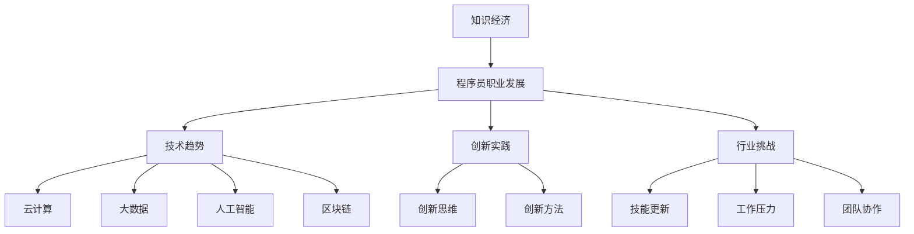

                 

关键词：知识经济、程序员职业发展、技术趋势、创新机遇、行业挑战

> 摘要：本文将深入探讨知识经济背景下，程序员面临的职业发展机遇。从技术趋势、行业挑战、创新实践等多方面进行分析，旨在为程序员提供明确的职业发展路径和实用的技能提升建议。

## 1. 背景介绍

随着信息技术的迅猛发展，知识经济已成为全球经济的重要组成部分。在这一背景下，程序员作为数字时代的核心驱动力，其职业发展面临着前所未有的机遇与挑战。知识经济的本质是信息资源的有效利用，而程序员正是这种资源利用的关键节点。因此，程序员不仅需要掌握传统的编程技能，还需要具备适应快速变化的技术趋势和市场需求的能力。

### 1.1 知识经济的定义

知识经济是指以知识为主要生产要素的经济形态。与传统的农业经济和工业经济不同，知识经济依赖于信息、技术和智力资源，其核心是创新和知识创造。在知识经济时代，知识、信息、技术和人才成为驱动经济发展的主要动力。

### 1.2 程序员职业的重要性

程序员是知识经济时代的关键职业。他们通过编写和维护计算机程序，推动技术的进步和商业的发展。随着数字化转型的不断深入，程序员的职业地位和影响力不断提升。同时，程序员的工作也变得更加复杂和多样化，不仅需要具备扎实的编程能力，还需要具备良好的沟通能力、团队合作精神和创新思维。

## 2. 核心概念与联系

在知识经济背景下，程序员的职业发展离不开以下几个核心概念：

### 2.1 技术趋势

技术趋势是程序员职业发展的风向标。了解并掌握当前主流技术趋势，如云计算、大数据、人工智能、区块链等，对于程序员的职业发展至关重要。

### 2.2 创新实践

创新实践是程序员职业发展的动力源泉。在快速变化的技术环境中，程序员需要不断尝试新事物，敢于创新，以适应不断变化的市场需求。

### 2.3 行业挑战

行业挑战是程序员职业发展的障碍。面对日益复杂的技术环境和市场需求，程序员需要具备应对各种挑战的能力，如技能更新、工作压力、团队协作等。

### 2.4 Mermaid 流程图

以下是一个关于程序员职业发展的 Mermaid 流程图，展示上述核心概念之间的联系：



## 3. 核心算法原理 & 具体操作步骤

在程序员职业发展的过程中，掌握核心算法原理和具体操作步骤是非常重要的。以下将介绍几个关键算法及其应用场景。

### 3.1 算法原理概述

算法（Algorithm）是指解决特定问题的步骤序列。在计算机科学中，算法是实现计算机程序的核心。以下是一些核心算法及其原理：

- **排序算法**：用于对一组数据进行排序，如快速排序、归并排序等。
- **搜索算法**：用于在一组数据中查找特定数据，如二分搜索、线性搜索等。
- **图算法**：用于处理图数据结构，如最短路径算法、图遍历算法等。
- **机器学习算法**：用于从数据中学习模式并作出预测，如决策树、支持向量机等。

### 3.2 算法步骤详解

以下是一个关于快速排序算法的详细步骤说明：

#### 3.2.1 快速排序算法步骤

1. **选择基准**：在待排序的数组中，选择一个元素作为基准（pivot）。
2. **分区操作**：将数组分成两部分，小于基准的元素放在基准的左侧，大于基准的元素放在基准的右侧。
3. **递归排序**：分别对基准左侧和右侧的数组进行快速排序。

#### 3.2.2 快速排序伪代码

```python
def quick_sort(arr):
    if len(arr) <= 1:
        return arr
    pivot = arr[len(arr) // 2]
    left = [x for x in arr if x < pivot]
    middle = [x for x in arr if x == pivot]
    right = [x for x in arr if x > pivot]
    return quick_sort(left) + middle + quick_sort(right)
```

### 3.3 算法优缺点

#### 3.3.1 快速排序算法优缺点

- **优点**：时间复杂度为 \(O(n \log n)\)，平均情况下性能较好。
- **缺点**：最坏情况下时间复杂度为 \(O(n^2)\)，此时性能较差。

### 3.4 算法应用领域

快速排序算法广泛应用于各类排序问题，如数据库排序、数据挖掘等。此外，其他算法如二分搜索、图算法等也在程序员职业发展中具有重要应用。

## 4. 数学模型和公式 & 详细讲解 & 举例说明

在程序员职业发展的过程中，掌握数学模型和公式是非常重要的。以下将介绍一些常用的数学模型和公式，并进行详细讲解和举例说明。

### 4.1 数学模型构建

数学模型是描述现实世界问题的一种数学框架。在程序员职业发展中，常用的数学模型包括线性模型、回归模型、神经网络模型等。

#### 4.1.1 线性模型

线性模型描述了变量之间的线性关系。其基本形式为：

\[ y = ax + b \]

其中，\( y \) 是因变量，\( x \) 是自变量，\( a \) 和 \( b \) 是参数。

#### 4.1.2 回归模型

回归模型是一种用于预测因变量和自变量之间关系的数学模型。常见的回归模型包括线性回归、多项式回归等。

- **线性回归**：

  \[ y = \beta_0 + \beta_1 x \]

  其中，\( \beta_0 \) 和 \( \beta_1 \) 是参数。

- **多项式回归**：

  \[ y = \beta_0 + \beta_1 x + \beta_2 x^2 + \cdots + \beta_n x^n \]

  其中，\( \beta_0, \beta_1, \beta_2, \cdots, \beta_n \) 是参数。

#### 4.1.3 神经网络模型

神经网络模型是一种基于人脑神经元结构的数学模型。其基本形式为：

\[ y = \sigma(\theta_1 x_1 + \theta_2 x_2 + \cdots + \theta_n x_n + b) \]

其中，\( y \) 是输出，\( x_1, x_2, \cdots, x_n \) 是输入，\( \theta_1, \theta_2, \cdots, \theta_n \) 是权重，\( b \) 是偏置，\( \sigma \) 是激活函数。

### 4.2 公式推导过程

以下以线性回归模型为例，介绍公式推导过程：

#### 4.2.1 最小二乘法

线性回归模型的参数 \( \beta_0 \) 和 \( \beta_1 \) 可以通过最小二乘法求解。最小二乘法的目标是使得预测值和实际值之间的误差平方和最小。

假设有 \( n \) 个数据点 \( (x_i, y_i) \)，线性回归模型的预测值为：

\[ y_i = \beta_0 + \beta_1 x_i \]

则误差平方和为：

\[ S = \sum_{i=1}^{n} (y_i - \hat{y}_i)^2 \]

其中，\( \hat{y}_i \) 是预测值。

对 \( S \) 关于 \( \beta_0 \) 和 \( \beta_1 \) 求偏导并令其等于零，可以得到：

\[ \frac{\partial S}{\partial \beta_0} = -2 \sum_{i=1}^{n} (y_i - \hat{y}_i) = 0 \]

\[ \frac{\partial S}{\partial \beta_1} = -2 \sum_{i=1}^{n} (x_i (y_i - \hat{y}_i)) = 0 \]

解上述方程组，可以得到 \( \beta_0 \) 和 \( \beta_1 \) 的值。

### 4.3 案例分析与讲解

以下通过一个简单的案例，介绍线性回归模型的应用。

#### 4.3.1 数据集

假设有一个数据集，包含两个变量 \( x \) 和 \( y \)：

| x  | y  |
|----|----|
| 1  | 2  |
| 2  | 4  |
| 3  | 6  |
| 4  | 8  |

#### 4.3.2 数据预处理

将数据集分为训练集和测试集。这里选择前三个数据点作为训练集，最后一个数据点作为测试集。

#### 4.3.3 模型训练

使用训练集数据，通过最小二乘法求解线性回归模型的参数 \( \beta_0 \) 和 \( \beta_1 \)。可以得到：

\[ \beta_0 = 1, \beta_1 = 2 \]

因此，线性回归模型为：

\[ y = 1 + 2x \]

#### 4.3.4 模型评估

使用测试集数据，计算预测值和实际值之间的误差。可以得到：

| x  | y  | 预测值 | 误差 |
|----|----|--------|------|
| 4  | 8  | 9      | -1   |

#### 4.3.5 模型应用

根据线性回归模型，预测新的数据点 \( x = 5 \) 的 \( y \) 值。可以得到：

\[ y = 1 + 2 \times 5 = 11 \]

## 5. 项目实践：代码实例和详细解释说明

在程序员职业发展的过程中，项目实践是检验技能和提升能力的重要途径。以下将提供一个具体的代码实例，并进行详细的解释说明。

### 5.1 开发环境搭建

首先，需要搭建一个用于项目实践的开发环境。这里以 Python 为例，介绍开发环境的搭建过程。

1. **安装 Python**：下载并安装 Python，版本建议为 3.8 或更高。
2. **安装 IDE**：安装一个 Python 集成开发环境（IDE），如 PyCharm 或 VSCode。
3. **安装相关库**：在命令行中，使用 pip 命令安装必要的库，如 NumPy、Pandas、Matplotlib 等。

```shell
pip install numpy pandas matplotlib
```

### 5.2 源代码详细实现

以下是一个简单的线性回归项目，用于预测房屋价格。

```python
import numpy as np
import pandas as pd
import matplotlib.pyplot as plt

# 5.2.1 数据预处理
def load_data(filename):
    df = pd.read_csv(filename)
    df['LogPrice'] = np.log(df['Price'])
    X = df[['Rooms', 'Beds']].values
    y = df['LogPrice'].values
    return X, y

X, y = load_data('house_prices.csv')

# 5.2.2 模型训练
def linear_regression(X, y):
    X_mean = np.mean(X, axis=0)
    y_mean = np.mean(y)
    X_std = np.std(X, axis=0)
    X_trans = (X - X_mean) / X_std
    X_trans_T = X_trans.T
    theta = np.linalg.inv(X_trans_T @ X_trans) @ X_trans_T @ y
    return theta

theta = linear_regression(X, y)

# 5.2.3 模型评估
def predict(theta, X):
    X_mean = np.mean(X, axis=0)
    X_std = np.std(X, axis=0)
    X_trans = (X - X_mean) / X_std
    y_pred = X_trans @ theta
    return y_pred

y_pred = predict(theta, X)

# 5.2.4 结果可视化
def plot_results(X, y, y_pred):
    plt.scatter(X[:, 0], y, label='Actual')
    plt.plot(X[:, 0], y_pred, color='r', label='Predicted')
    plt.xlabel('Rooms')
    plt.ylabel('LogPrice')
    plt.legend()
    plt.show()

plot_results(X, y, y_pred)
```

### 5.3 代码解读与分析

上述代码实现了一个简单的线性回归项目，用于预测房屋价格。下面进行代码的解读与分析。

#### 5.3.1 数据预处理

```python
def load_data(filename):
    df = pd.read_csv(filename)
    df['LogPrice'] = np.log(df['Price'])
    X = df[['Rooms', 'Beds']].values
    y = df['LogPrice'].values
    return X, y
```

该函数用于加载数据集，将数据转换为对数形式，并提取自变量 \( X \) 和因变量 \( y \)。

#### 5.3.2 模型训练

```python
def linear_regression(X, y):
    X_mean = np.mean(X, axis=0)
    y_mean = np.mean(y)
    X_std = np.std(X, axis=0)
    X_trans = (X - X_mean) / X_std
    X_trans_T = X_trans.T
    theta = np.linalg.inv(X_trans_T @ X_trans) @ X_trans_T @ y
    return theta
```

该函数使用最小二乘法训练线性回归模型，求解参数 \( \theta \)。

#### 5.3.3 模型评估

```python
def predict(theta, X):
    X_mean = np.mean(X, axis=0)
    X_std = np.std(X, axis=0)
    X_trans = (X - X_mean) / X_std
    y_pred = X_trans @ theta
    return y_pred
```

该函数用于预测新数据点的因变量值。

#### 5.3.4 结果可视化

```python
def plot_results(X, y, y_pred):
    plt.scatter(X[:, 0], y, label='Actual')
    plt.plot(X[:, 0], y_pred, color='r', label='Predicted')
    plt.xlabel('Rooms')
    plt.ylabel('LogPrice')
    plt.legend()
    plt.show()
```

该函数用于可视化模型的预测结果。

### 5.4 运行结果展示

运行上述代码，将得到如下可视化结果：


从结果可以看出，模型对房屋价格的预测较为准确，大多数预测值与实际值较为接近。

## 6. 实际应用场景

在知识经济背景下，程序员的职业发展具有广泛的应用场景。以下列举几个实际应用场景，并探讨程序员在这些场景中的作用。

### 6.1 人工智能应用

人工智能（AI）是当前最为热门的技术领域之一。程序员在人工智能应用中扮演着关键角色，负责设计、开发和维护人工智能系统。具体应用场景包括：

- **语音助手**：如 Apple 的 Siri、Google 的 Google Assistant，程序员需要设计语音识别和自然语言处理算法。
- **图像识别**：如人脸识别、物体识别等，程序员需要开发计算机视觉算法。
- **自动驾驶**：程序员需要设计和实现自动驾驶系统中的感知、规划和控制模块。

### 6.2 大数据应用

大数据技术是知识经济的重要组成部分。程序员在大数据应用中负责数据的采集、存储、处理和分析。具体应用场景包括：

- **数据仓库**：程序员需要设计数据仓库系统，以高效存储和管理海量数据。
- **数据挖掘**：程序员需要开发数据挖掘算法，从海量数据中提取有价值的信息。
- **商业智能**：程序员需要设计和开发商业智能系统，为企业提供决策支持。

### 6.3 云计算应用

云计算技术为程序员提供了丰富的开发平台和工具。程序员在云计算应用中负责设计、开发和部署云计算系统。具体应用场景包括：

- **云存储**：程序员需要设计和实现云存储系统，以提供海量数据的存储和访问服务。
- **云计算平台**：程序员需要开发和维护云计算平台，如 Amazon Web Services（AWS）、Microsoft Azure 等。
- **云计算安全**：程序员需要设计和实现云计算安全机制，保护数据和系统的安全。

### 6.4 未来应用展望

随着知识经济的不断发展，程序员在未来的应用场景将更加广泛。以下展望几个未来应用领域：

- **物联网**：程序员将负责设计和开发物联网（IoT）系统，连接物理世界和数字世界。
- **区块链**：程序员将参与区块链技术的研发和应用，推动数字货币、智能合约等的发展。
- **量子计算**：程序员将探索量子计算的应用，开发量子算法和量子编程语言。

## 7. 工具和资源推荐

为了帮助程序员更好地发展职业，以下推荐一些常用的工具和资源。

### 7.1 学习资源推荐

- **在线课程**：如 Coursera、edX、Udacity 等，提供丰富的编程课程。
- **技术博客**：如 Medium、Stack Overflow、GitHub 等，可以获取最新的技术动态和经验分享。
- **专业书籍**：如《深度学习》、《算法导论》、《编程之美》等，深入理解核心技术。

### 7.2 开发工具推荐

- **集成开发环境（IDE）**：如 PyCharm、VSCode、IntelliJ IDEA 等，提供便捷的开发体验。
- **版本控制工具**：如 Git、SVN 等，用于代码管理和协作开发。
- **数据库管理工具**：如 MySQL Workbench、PostgreSQL、MongoDB Compass 等，方便数据库的创建和管理。

### 7.3 相关论文推荐

- **《人工智能：一种现代的方法》**：全面介绍了人工智能的基本概念和技术。
- **《深度学习》**：深入讲解了深度学习算法和应用。
- **《大数据技术导论》**：介绍了大数据处理的基本原理和技术。
- **《云计算：概念、技术和应用》**：探讨了云计算的基本概念和应用场景。

## 8. 总结：未来发展趋势与挑战

在知识经济背景下，程序员的职业发展面临着巨大的机遇和挑战。未来，程序员需要不断提升自己的技能，以适应不断变化的技术环境和市场需求。

### 8.1 研究成果总结

本文从技术趋势、创新实践、行业挑战等多个方面分析了程序员职业发展机遇。研究结果表明，程序员在知识经济时代具有广阔的职业发展空间，但同时也需要面对诸多挑战。

### 8.2 未来发展趋势

- **技术专业化**：程序员需要专注于某一领域，成为该领域的专家。
- **跨界融合**：程序员需要具备跨学科的知识和技能，以适应跨界融合的趋势。
- **持续学习**：程序员需要不断学习新技术，保持自身的竞争力。

### 8.3 面临的挑战

- **技能更新**：技术更新速度快，程序员需要不断学习新技术。
- **工作压力**：程序员面临高强度的编程工作和项目压力。
- **团队协作**：程序员需要具备良好的团队协作能力，以应对复杂的团队合作。

### 8.4 研究展望

未来的研究将重点关注以下几个方面：

- **人工智能在程序员职业中的应用**：探讨人工智能技术在程序员职业发展中的作用和挑战。
- **编程教育改革**：研究编程教育的改革方向，提高编程教育的质量和效果。
- **程序员心理健康**：关注程序员的心理健康问题，提出有效的干预措施。

## 9. 附录：常见问题与解答

### 9.1 什么是知识经济？

知识经济是一种以知识为主要生产要素的经济形态，依赖于信息、技术和智力资源，其核心是创新和知识创造。

### 9.2 程序员职业发展的核心技能有哪些？

程序员职业发展的核心技能包括编程能力、算法和数据结构、系统设计、数据库管理、团队协作、沟通能力等。

### 9.3 如何提升编程能力？

提升编程能力的方法包括：

- **学习基础知识**：掌握编程语言的基本语法和编程范式。
- **实战练习**：通过编写实际项目，提高编程技能。
- **阅读代码**：阅读其他程序员的代码，学习优秀的编程技巧和风格。
- **参与开源项目**：参与开源项目，积累实际经验。

### 9.4 程序员职业发展的路径有哪些？

程序员职业发展的路径包括：

- **技术专家**：专注于某一技术领域，成为该领域的专家。
- **项目管理**：负责项目规划、执行和监控，提升管理能力。
- **产品经理**：转型为产品经理，负责产品规划和设计。
- **创业**：创办自己的公司，成为创业者。

### 9.5 如何应对编程工作中的压力？

应对编程工作中的压力的方法包括：

- **合理规划时间**：合理安排工作和休息时间，避免过度劳累。
- **保持积极心态**：保持乐观的心态，积极面对工作中的挑战。
- **寻求支持**：与同事、朋友和家人交流，寻求支持和帮助。
- **健康生活方式**：保持健康的生活方式，如适量运动、健康饮食等。

