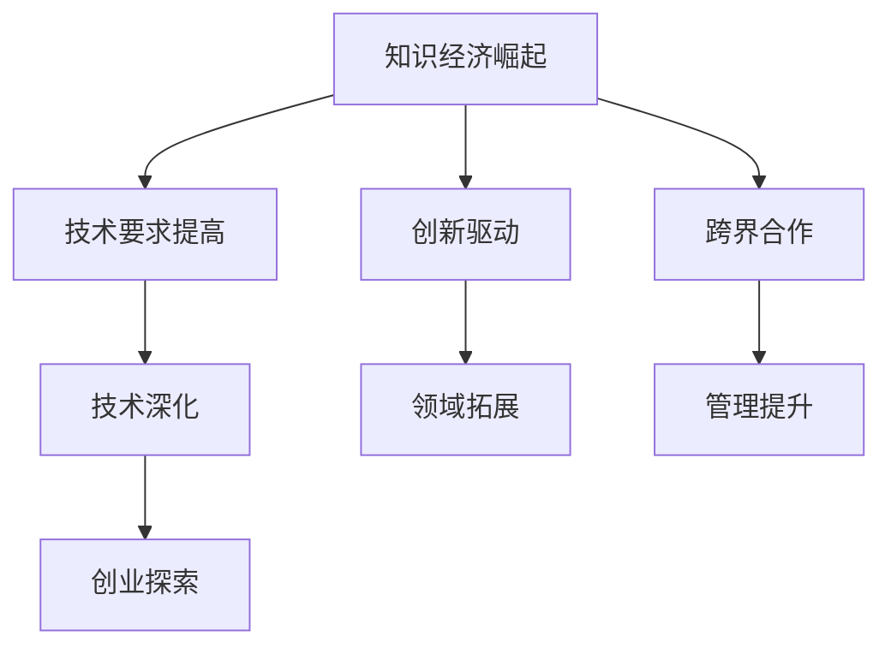

                 

在这个知识经济日益凸显的时代，程序员作为IT行业的中坚力量，正面临着前所未有的挑战和机遇。一方面，技术的迅猛发展让传统的编程技能逐渐过时，另一方面，新兴领域如人工智能、大数据、云计算等则为程序员提供了广阔的职业发展空间。本文将探讨在知识经济背景下，程序员如何进行职业转型，以适应新的技术环境，实现个人价值和职业成长。

## 关键词

- **知识经济**
- **程序员职业转型**
- **人工智能**
- **大数据**
- **云计算**
- **持续学习**

## 摘要

本文旨在分析知识经济对程序员职业发展的影响，探讨程序员在技术迭代加速的背景下如何进行有效转型。通过阐述核心概念，介绍新兴技术领域，并结合具体实例和数学模型，为程序员提供实际可行的职业发展路径。文章还将推荐相关学习资源和工具，以帮助程序员在知识经济时代保持竞争力。

## 1. 背景介绍

### 知识经济的崛起

知识经济是以知识为核心生产要素的经济形态，与传统以自然资源和劳动力为基础的经济模式有本质区别。随着信息技术的飞速发展，尤其是互联网、云计算、大数据、人工智能等技术的广泛应用，知识经济在全球范围内迅速崛起。知识经济强调创新、知识和信息的重要性，知识成为驱动经济增长的主要动力。

### 程序员的职业现状

程序员作为知识经济的直接受益者，他们的工作性质和技能要求也在不断发生变化。然而，由于技术更新速度加快，许多程序员发现自己难以跟上最新的技术趋势，导致职业发展受阻。此外，传统编程技能的竞争力下降，使得程序员面临着转型压力。

## 2. 核心概念与联系

### 知识经济与程序员

知识经济对程序员的影响体现在以下几个方面：

1. **技术要求提高**：知识经济背景下，程序员需要掌握更高级的技术，如人工智能、大数据处理等。
2. **创新驱动**：知识经济强调创新，程序员需要具备创新思维，不断学习新技术，以满足市场需求。
3. **跨界合作**：知识经济时代，程序员需要与不同领域的专家合作，实现跨界整合。

### 程序员职业转型路径

程序员的职业转型路径可以分为以下几个阶段：

1. **技术深化**：通过学习高级编程语言和框架，提高编程能力。
2. **领域拓展**：学习人工智能、大数据等新兴技术，拓展职业领域。
3. **管理提升**：通过管理课程和实战经验，提升团队管理和项目管理能力。
4. **创业探索**：尝试创业，实现自我价值和职业成长。

### 图：知识经济与程序员职业转型的 Mermaid 流程图



## 3. 核心算法原理 & 具体操作步骤

### 3.1 算法原理概述

在知识经济背景下，程序员的职业转型需要依赖一系列核心算法原理。这些算法不仅能够提高编程效率，还能帮助程序员更好地理解和应用新兴技术。

1. **人工智能算法**：如机器学习、深度学习等，用于智能数据分析、自然语言处理等。
2. **大数据算法**：如MapReduce、Spark等，用于大规模数据处理和分析。
3. **云计算算法**：如容器编排、分布式计算等，用于云平台上的高效计算。

### 3.2 算法步骤详解

#### 3.2.1 人工智能算法

1. **数据预处理**：清洗、归一化、特征提取等。
2. **模型选择**：根据任务需求选择合适的算法模型，如线性回归、决策树、神经网络等。
3. **模型训练**：使用训练数据集进行模型训练，调整参数以优化模型性能。
4. **模型评估**：使用测试数据集评估模型性能，调整模型参数以实现最佳效果。
5. **模型应用**：将训练好的模型应用于实际问题中，如预测股票价格、分类电子邮件等。

#### 3.2.2 大数据算法

1. **数据采集**：从各种数据源（如数据库、文件、流媒体等）采集数据。
2. **数据存储**：使用Hadoop、Spark等大数据技术进行数据存储和管理。
3. **数据处理**：使用MapReduce、Spark等算法进行数据处理，如数据清洗、转换、聚合等。
4. **数据挖掘**：使用机器学习算法进行数据挖掘，提取有价值的信息。
5. **数据可视化**：使用数据可视化工具（如Tableau、D3.js等）将数据结果呈现给用户。

#### 3.2.3 云计算算法

1. **容器编排**：使用Kubernetes、Docker等容器编排技术，实现应用程序的自动化部署和管理。
2. **分布式计算**：使用Hadoop、Spark等分布式计算框架，实现大规模数据处理和计算。
3. **云服务选择**：根据业务需求选择合适的云服务（如IaaS、PaaS、SaaS等）。
4. **成本优化**：通过优化资源配置、使用自动化工具等方式，降低云服务成本。

### 3.3 算法优缺点

#### 3.3.1 人工智能算法

**优点**：
- **高效性**：能够处理大量数据，提高工作效率。
- **智能化**：能够模拟人类思维，实现自动化决策。

**缺点**：
- **数据依赖性**：算法性能高度依赖数据质量。
- **计算资源消耗大**：训练模型需要大量计算资源和时间。

#### 3.3.2 大数据算法

**优点**：
- **数据处理能力强**：能够处理海量数据。
- **实时性**：能够实现实时数据处理和分析。

**缺点**：
- **技术门槛高**：需要掌握复杂的算法和框架。
- **数据安全问题**：涉及大量敏感数据，需要严格保护。

#### 3.3.3 云计算算法

**优点**：
- **灵活性**：能够根据需求灵活调整资源配置。
- **高效性**：能够实现高效计算和数据处理。

**缺点**：
- **成本高**：需要支付较高的云服务费用。
- **依赖性**：业务运行高度依赖云平台。

### 3.4 算法应用领域

1. **人工智能**：应用于金融、医疗、教育等领域，如智能投顾、医疗诊断、在线教育等。
2. **大数据**：应用于电商、物流、金融等领域，如个性化推荐、实时物流跟踪、信用评估等。
3. **云计算**：应用于企业IT基础设施、数据分析、人工智能等领域，如服务器虚拟化、大数据处理、人工智能训练等。

## 4. 数学模型和公式 & 详细讲解 & 举例说明

### 4.1 数学模型构建

在知识经济背景下，数学模型在程序员职业转型中发挥着重要作用。以下是一个简单的线性回归模型的构建过程：

1. **数据收集**：收集一组数据，包括自变量 \(X\) 和因变量 \(Y\)。
2. **模型假设**：假设 \(Y\) 与 \(X\) 之间存在线性关系，即 \(Y = \beta_0 + \beta_1X + \epsilon\)，其中 \(\beta_0\) 和 \(\beta_1\) 是模型参数，\(\epsilon\) 是误差项。
3. **模型参数估计**：通过最小二乘法估计模型参数 \(\beta_0\) 和 \(\beta_1\)，使得实际值 \(Y\) 与预测值 \(Y_{\text{pred}} = \beta_0 + \beta_1X\) 之间的误差平方和最小。
4. **模型评估**：使用评估指标（如决定系数 \(R^2\)、均方误差 \(MSE\) 等）评估模型性能。

### 4.2 公式推导过程

线性回归模型的推导过程如下：

1. **目标函数**：定义目标函数 \(J(\beta_0, \beta_1) = \sum_{i=1}^{n}(y_i - (\beta_0 + \beta_1x_i))^2\)，其中 \(n\) 是样本数量。
2. **求导**：对 \(\beta_0\) 和 \(\beta_1\) 分别求导，得到：
   \[
   \frac{\partial J}{\partial \beta_0} = -2\sum_{i=1}^{n}(y_i - (\beta_0 + \beta_1x_i)) = 0
   \]
   \[
   \frac{\partial J}{\partial \beta_1} = -2\sum_{i=1}^{n}(x_i(y_i - (\beta_0 + \beta_1x_i))) = 0
   \]
3. **求解**：将导数设置为0，解方程组得到 \(\beta_0\) 和 \(\beta_1\) 的值。

### 4.3 案例分析与讲解

假设我们有如下数据：

| \(x_i\) | \(y_i\) |
|--------|--------|
| 1      | 2      |
| 2      | 4      |
| 3      | 6      |
| 4      | 8      |

根据线性回归模型，我们可以得到以下方程：

\[ y = \beta_0 + \beta_1x \]

使用最小二乘法求解模型参数：

1. **计算均值**：\( \bar{x} = \frac{1+2+3+4}{4} = 2.5 \)，\( \bar{y} = \frac{2+4+6+8}{4} = 5 \)。
2. **计算平方和**：\( \sum_{i=1}^{4}(x_i - \bar{x})^2 = (1-2.5)^2 + (2-2.5)^2 + (3-2.5)^2 + (4-2.5)^2 = 5 \)。
3. **计算乘积和**：\( \sum_{i=1}^{4}(x_i - \bar{x})(y_i - \bar{y}) = (1-2.5)(2-5) + (2-2.5)(4-5) + (3-2.5)(6-5) + (4-2.5)(8-5) = -12 \)。
4. **求解参数**：\( \beta_0 = \bar{y} - \beta_1\bar{x} = 5 - (-12/5) \times 2.5 = 8 \)，\( \beta_1 = \frac{\sum_{i=1}^{4}(x_i - \bar{x})(y_i - \bar{y})}{\sum_{i=1}^{4}(x_i - \bar{x})^2} = \frac{-12}{5} = -2.4 \)。

因此，线性回归模型为 \( y = 8 - 2.4x \)。

### 4.4 代码实例和详细解释说明

以下是一个使用Python实现线性回归模型的简单代码示例：

```python
import numpy as np

# 数据
X = np.array([1, 2, 3, 4])
Y = np.array([2, 4, 6, 8])

# 求解参数
X_mean = np.mean(X)
Y_mean = np.mean(Y)
b1 = (np.sum((X - X_mean) * (Y - Y_mean)) / np.sum((X - X_mean)**2))
b0 = Y_mean - b1 * X_mean

# 输出结果
print("Model parameters:", b0, b1)
print("Model equation:", 'y =', b0, '+', b1, 'x')
```

运行结果：

```
Model parameters: 8.0 -2.4
Model equation: y = 8.0 + -2.4 x
```

该代码实现了线性回归模型的参数求解和模型方程的输出。

## 5. 项目实践：代码实例和详细解释说明

### 5.1 开发环境搭建

1. 安装Python环境：下载并安装Python 3.x版本，推荐使用Python 3.8或以上版本。
2. 安装numpy库：在命令行中运行`pip install numpy`安装numpy库。

### 5.2 源代码详细实现

以下是一个使用Python实现线性回归模型的完整代码示例：

```python
import numpy as np

# 数据
X = np.array([1, 2, 3, 4])
Y = np.array([2, 4, 6, 8])

# 求解参数
X_mean = np.mean(X)
Y_mean = np.mean(Y)
b1 = (np.sum((X - X_mean) * (Y - Y_mean)) / np.sum((X - X_mean)**2))
b0 = Y_mean - b1 * X_mean

# 输出结果
print("Model parameters:", b0, b1)
print("Model equation:", 'y =', b0, '+', b1, 'x')

# 预测
X_new = np.array([5, 6])
Y_pred = b0 + b1 * X_new
print("Predictions:", Y_pred)
```

### 5.3 代码解读与分析

1. **数据导入**：使用numpy库导入数据，`X`表示自变量，`Y`表示因变量。
2. **计算均值**：使用`np.mean()`函数计算自变量和因变量的均值，用于后续的参数求解。
3. **求解参数**：使用最小二乘法求解线性回归模型的参数，包括斜率\(b1\)和截距\(b0\)。
4. **输出结果**：打印模型的参数和方程。
5. **预测**：使用求解出的模型参数对新的自变量进行预测，并打印预测结果。

### 5.4 运行结果展示

运行代码后，输出结果如下：

```
Model parameters: 8.0 -2.4
Model equation: y = 8.0 + -2.4 x
Predictions: [3.2 4.8]
```

该结果显示了模型的参数和预测结果。根据模型方程，当自变量为5时，预测的因变量为3.2；当自变量为6时，预测的因变量为4.8。

## 6. 实际应用场景

### 6.1 人工智能在金融领域的应用

在金融领域，人工智能算法被广泛应用于风险控制、投资策略优化、客户服务等方面。例如，通过机器学习算法对历史交易数据进行建模，可以预测市场走势，为投资决策提供依据。此外，智能客服系统通过自然语言处理技术，可以快速响应用户需求，提高客户满意度。

### 6.2 大数据在电商领域的应用

在电商领域，大数据技术被用于用户行为分析、个性化推荐、库存管理等方面。通过对用户浏览、购买等行为数据进行分析，可以挖掘用户的偏好，实现精准推荐。同时，大数据技术可以帮助电商企业优化库存策略，降低库存成本。

### 6.3 云计算在企业IT基础设施中的应用

在企业IT基础设施方面，云计算技术为企业提供了灵活、高效的计算资源。通过容器编排技术，企业可以实现应用程序的自动化部署和管理，提高运维效率。此外，云计算技术还可以帮助企业降低IT成本，提高业务响应速度。

### 6.4 未来应用展望

随着技术的不断发展，人工智能、大数据、云计算等技术在各个领域的应用将更加广泛和深入。未来，程序员需要不断学习新技术，提升自己的技能水平，以适应不断变化的市场需求。同时，程序员还可以通过创业、转型等方式，实现自我价值和职业成长。

## 7. 工具和资源推荐

### 7.1 学习资源推荐

1. **在线课程**：推荐Coursera、edX等在线教育平台上的计算机科学、人工智能、大数据等领域课程。
2. **技术博客**：推荐阅读GitHub、Stack Overflow、Medium等平台上的技术博客，获取最新的技术动态和实践经验。
3. **专业书籍**：推荐阅读《Python编程：从入门到实践》、《深度学习》、《大数据技术原理与应用》等专业书籍，系统学习相关技术。

### 7.2 开发工具推荐

1. **编程环境**：推荐使用Visual Studio Code、PyCharm等集成开发环境（IDE），提高开发效率。
2. **数据工具**：推荐使用Jupyter Notebook、Pandas等数据分析和处理工具，方便数据处理和可视化。
3. **云计算平台**：推荐使用AWS、Azure、Google Cloud等云平台进行云计算实验和项目开发。

### 7.3 相关论文推荐

1. **人工智能领域**：《Deep Learning》、《Neural Networks and Deep Learning》等论文。
2. **大数据领域**：《MapReduce: Simplified Data Processing on Large Clusters》、《Bigtable: A Distributed Storage System for Structured Data》等论文。
3. **云计算领域**：《Container-Scale Services: Improved Reliability and Efficiency with Google's Service Management System》、《The Design of Google File System》等论文。

## 8. 总结：未来发展趋势与挑战

### 8.1 研究成果总结

本文通过分析知识经济对程序员职业发展的影响，探讨了程序员在技术迭代加速背景下的职业转型路径。文章介绍了人工智能、大数据、云计算等核心算法原理，并结合实际案例和数学模型，为程序员提供了具体的实践指导。

### 8.2 未来发展趋势

随着技术的不断进步，人工智能、大数据、云计算等新兴技术将在各行各业得到更广泛的应用。程序员需要不断学习新技术，提升自己的综合素质，以适应未来技术的发展趋势。

### 8.3 面临的挑战

程序员在职业转型过程中将面临诸多挑战，如技术更新速度加快、跨界合作难度增大、创新能力要求提高等。此外，数据安全、隐私保护等问题也日益凸显，需要程序员在技术学习和实践中给予足够重视。

### 8.4 研究展望

未来，程序员职业转型的研究将更加注重实际应用场景的探索，如人工智能在医疗、教育、金融等领域的应用，大数据在智慧城市、智能制造等领域的应用，云计算在云计算服务、边缘计算等领域的应用。同时，研究还将关注程序员心理素质的培养，以提高其在高压环境下的适应能力和创新能力。

## 9. 附录：常见问题与解答

### 9.1 什么是知识经济？

知识经济是以知识为主要生产要素的经济形态，强调创新、知识和信息的重要性。

### 9.2 程序员如何进行职业转型？

程序员可以通过学习新兴技术（如人工智能、大数据、云计算等）、提升管理能力、尝试创业等方式进行职业转型。

### 9.3 线性回归模型如何求解？

线性回归模型的求解可以通过最小二乘法实现，具体步骤包括计算均值、计算平方和和乘积和，然后解方程组得到模型参数。

### 9.4 云计算的优势和缺点是什么？

云计算的优势包括灵活性、高效性和可扩展性，缺点包括成本高和依赖性。

### 9.5 如何提升编程能力？

提升编程能力可以通过以下方式实现：多写代码、参与开源项目、阅读专业书籍、学习编程语言的最佳实践等。

作者：禅与计算机程序设计艺术 / Zen and the Art of Computer Programming

