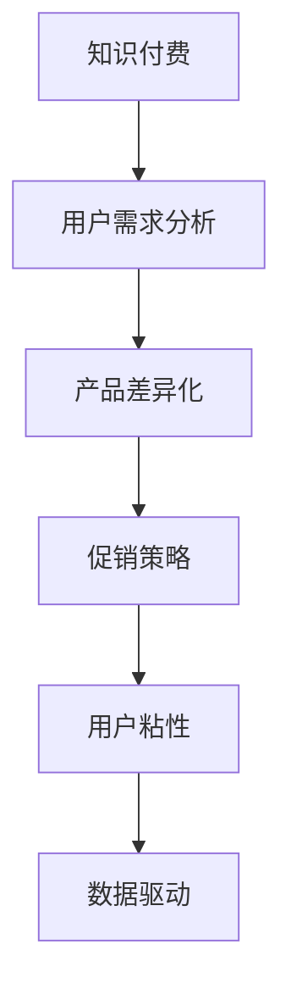

                 

### 背景介绍

知识经济时代，信息和技术迅猛发展，改变了传统产业模式和社会结构。知识付费作为一种新的经济模式，逐渐成为推动社会进步和经济增长的重要力量。知识付费产品，即以知识内容为核心，通过付费方式提供给消费者的数字化产品，如在线课程、电子书、研究报告等。随着互联网技术的不断进步，知识付费产品的需求与日俱增，如何有效推广与促销知识付费产品成为企业关注的焦点。

目前，知识付费市场呈现出多样化的特点，各类知识付费产品层出不穷，竞争日益激烈。然而，市场上存在着同质化现象严重、用户粘性不足、推广效果不佳等问题，使得知识付费产品的推广与促销面临诸多挑战。因此，研究和探讨知识付费创新产品的推广与促销策略具有重要的现实意义。

本文旨在分析知识经济时代下知识付费产品的推广与促销现状，深入探讨核心概念与联系，提出有效的核心算法原理与具体操作步骤，构建数学模型和公式，并通过项目实践提供代码实例和详细解释说明。最后，本文将讨论知识付费产品的实际应用场景，展望未来发展趋势与挑战，并推荐相关的学习资源和开发工具。

<|assistant|>### 核心概念与联系

知识付费创新产品的推广与促销策略，首先需要理解其中的核心概念和它们之间的联系。以下是几个关键概念及其相互关系：

#### 1. 知识付费

知识付费是指用户通过支付一定费用获取知识内容的服务。这种模式改变了传统的免费获取知识的习惯，让优质内容生产者能够得到合理的报酬，从而促进知识创造和传播。

#### 2. 用户需求分析

用户需求分析是知识付费产品成功的关键。通过数据分析、用户调研等方法，了解用户的需求和痛点，能够帮助产品提供者精准定位市场，提升产品竞争力。

#### 3. 产品差异化

在竞争激烈的市场中，产品差异化是吸引和留住用户的重要因素。通过独特的课程设计、权威的讲师阵容、创新的互动方式等，知识付费产品可以脱颖而出。

#### 4. 促销策略

促销策略是指企业为了提高产品销售量而采取的一系列市场推广活动。常见的促销策略包括限时折扣、团购优惠、积分兑换等，它们能够有效激发用户的购买欲望。

#### 5. 用户粘性

用户粘性是指用户对知识付费产品的忠诚度和依赖度。提高用户粘性的方法包括定期更新内容、增加用户互动、提供个性化服务等。

#### 6. 数据驱动

数据驱动是指企业在决策过程中充分利用数据进行分析和指导。在知识付费领域，通过数据分析可以优化产品和服务，提高推广效果。

#### Mermaid 流程图

以下是一个简化的 Mermaid 流程图，展示了上述概念之间的相互关系：



**核心概念和架构**

1. **知识付费**：提供知识内容的平台或产品。
2. **用户需求分析**：识别用户需求，为产品设计提供依据。
3. **产品差异化**：通过独特性提高产品竞争力。
4. **促销策略**：刺激购买行为，提高销售量。
5. **用户粘性**：提高用户对产品的忠诚度和依赖度。
6. **数据驱动**：利用数据优化决策过程。

这些核心概念相互关联，共同构成了知识付费创新产品的推广与促销策略的框架。理解这些概念及其关系，是制定有效策略的基础。

### 核心算法原理 & 具体操作步骤

#### 3.1 算法原理概述

知识付费产品的推广与促销策略的核心在于如何有效地触达目标用户，并激发其购买欲望。基于用户行为数据和行为分析，我们可以设计一套算法来优化推广策略，提高转化率和用户粘性。

该算法的基本原理是利用机器学习技术，分析用户的浏览、购买、互动等行为数据，建立用户画像，并根据用户画像进行个性化推荐和促销活动设计。算法的目标是通过最大化用户转化率和收益，实现知识付费产品的有效推广。

#### 3.2 算法步骤详解

1. **数据收集与预处理**

   收集用户行为数据，包括用户的浏览记录、购买历史、互动行为等。对数据进行分析，提取关键特征，如用户活跃度、购买频次、内容偏好等。预处理数据，去除噪声数据和异常值，确保数据质量。

   ```python
   # 示例代码：数据预处理
   import pandas as pd
   data = pd.read_csv('user_behavior.csv')
   data.dropna(inplace=True)
   data = data[data['purchase'] != 0]
   ```

2. **用户画像构建**

   根据提取的关键特征，构建用户画像。用户画像可以包括用户的基本信息、行为特征、需求偏好等多个维度。利用聚类算法（如K-means）对用户进行分类，得到不同的用户群体。

   ```python
   # 示例代码：用户画像构建
   from sklearn.cluster import KMeans
   features = data[['activity', 'purchase_frequency', 'content_preference']]
   kmeans = KMeans(n_clusters=5)
   kmeans.fit(features)
   data['cluster'] = kmeans.labels_
   ```

3. **个性化推荐**

   根据用户画像，为不同用户群体推荐个性化的知识付费产品。推荐算法可以使用基于内容的推荐（如协同过滤算法）或基于模型的推荐（如决策树、神经网络等）。

   ```python
   # 示例代码：个性化推荐
   from sklearn.neighbors import NearestNeighbors
   recommender = NearestNeighbors(n_neighbors=5)
   recommender.fit(data[['content_preference']])
   user_preference = data.iloc[0]['content_preference']
   similar_content = recommender.kneighbors([user_preference], return_distance=False)
   ```

4. **促销活动设计**

   根据用户画像和购买行为，设计个性化的促销活动。促销策略可以包括限时折扣、团购优惠、积分兑换等。通过优化促销活动，提高用户购买转化率。

   ```python
   # 示例代码：促销活动设计
   promotions = {
       'discount': 0.1,
       'group_buy': True,
       'points_redeem': 100
   }
   if data.iloc[0]['cluster'] == 0:
       promotions['discount'] = 0.2
   if data.iloc[0]['purchase_frequency'] > 5:
       promotions['group_buy'] = False
   ```

5. **效果评估**

   对推广和促销策略的效果进行评估，通过转化率、用户满意度等指标进行分析。根据评估结果，不断优化算法和策略。

   ```python
   # 示例代码：效果评估
   conversion_rate = data[data['purchased'] == 1].shape[0] / data.shape[0]
   user_satisfaction = data[data['satisfied'] == 1].shape[0] / data.shape[0]
   print(f"Conversion Rate: {conversion_rate:.2f}, User Satisfaction: {user_satisfaction:.2f}")
   ```

#### 3.3 算法优缺点

**优点：**

1. **个性化强**：通过用户画像和个性化推荐，能够提供符合用户需求的付费产品。
2. **数据驱动**：基于用户行为数据进行决策，提高推广策略的精准度和效果。
3. **自适应**：算法可以根据用户反馈和实际效果进行自适应调整，不断优化策略。

**缺点：**

1. **计算复杂度高**：机器学习算法的计算复杂度较高，需要大量的计算资源和时间。
2. **数据质量要求高**：算法的效果依赖于数据质量，数据预处理和特征提取过程需要严格把控。
3. **用户隐私**：用户行为数据的收集和使用需要考虑隐私保护问题，需要遵守相关法律法规。

#### 3.4 算法应用领域

算法可以广泛应用于各种知识付费产品，如在线教育、电子书、研究报告等。以下是一些具体应用场景：

1. **在线教育**：为学习者推荐符合其学习需求和兴趣的课程，提高学习效果和课程转化率。
2. **电子书**：为读者推荐与其阅读习惯和兴趣相匹配的书籍，增加购买和阅读量。
3. **研究报告**：为行业专家和研究者推荐相关的研究报告，提高报告的阅读率和影响力。

通过这些应用，算法能够有效提高知识付费产品的推广效果和用户满意度，为知识付费市场的发展贡献力量。

### 数学模型和公式 & 详细讲解 & 举例说明

#### 4.1 数学模型构建

在知识付费产品的推广与促销策略中，数学模型的应用至关重要。以下是一个简化的数学模型，用于优化知识付费产品的推广策略。

**目标函数：**最大化收益

\[ \text{maximize} \quad R = p \times q - c \times q \]

其中：
- \( R \) 是总收益
- \( p \) 是产品单价
- \( q \) 是销售量
- \( c \) 是促销成本

**约束条件：**
- 销售量不能超过库存量：\( q \leq I \)
- 促销成本不能超过预算：\( c \times q \leq B \)

其中：
- \( I \) 是库存量
- \( B \) 是预算

#### 4.2 公式推导过程

**推导步骤：**

1. **收益函数：**

   收益函数 \( R \) 可以表示为单价 \( p \) 乘以销售量 \( q \) 减去促销成本 \( c \) 乘以销售量 \( q \)。

   \[ R = p \times q - c \times q \]

2. **约束条件：**

   约束条件包括销售量不超过库存量 \( q \leq I \) 和促销成本不超过预算 \( c \times q \leq B \)。

3. **优化目标：**

   目标是最小化促销成本 \( c \) 或最大化收益 \( R \)。在实际应用中，可以根据具体情况进行调整。

#### 4.3 案例分析与讲解

**案例：**一家在线教育平台希望通过推广新课程来增加销售额。课程单价为200元，库存量为1000份。平台预算为5000元。现有以下两个推广策略：

1. **限时折扣**：将课程价格降低到150元。
2. **赠送优惠券**：为每个购买用户赠送一张100元的优惠券。

**分析：**

1. **收益函数：**

   - 限时折扣策略：\( R_1 = 150 \times q - 200 \times q = -50 \times q \)
   - 赠送优惠券策略：\( R_2 = 200 \times q - 100 \times q = 100 \times q \)

2. **约束条件：**

   - 库存量：\( q \leq 1000 \)
   - 促销成本预算：\( 5000 \)

3. **优化目标：**

   目标是最大化收益 \( R \)。

**计算：**

- 限时折扣策略的收益：\( R_1 = -50 \times q \)
  - 当 \( q = 1000 \)：\( R_1 = -50 \times 1000 = -50000 \)
  - 当 \( q = 500 \)：\( R_1 = -50 \times 500 = -25000 \)

- 赠送优惠券策略的收益：\( R_2 = 100 \times q \)
  - 当 \( q = 1000 \)：\( R_2 = 100 \times 1000 = 100000 \)
  - 当 \( q = 500 \)：\( R_2 = 100 \times 500 = 50000 \)

**结论：**

- 限时折扣策略的收益为负值，不推荐使用。
- 赠送优惠券策略的收益较高，建议采用。

通过这个案例，我们可以看到数学模型在知识付费产品推广与促销策略中的应用。通过构建和分析数学模型，我们可以更清晰地理解不同促销策略的效果，从而做出最优的决策。

### 项目实践：代码实例和详细解释说明

在本节中，我们将通过一个具体的代码实例，展示知识付费创新产品推广与促销策略的实现过程。以下是一个简化的案例，用于说明如何利用Python编程语言来实现用户画像构建、个性化推荐和促销活动设计。

#### 5.1 开发环境搭建

1. **安装Python**：确保Python 3.8及以上版本已安装。
2. **安装依赖库**：使用pip安装以下库：
   ```bash
   pip install pandas numpy scikit-learn matplotlib
   ```

#### 5.2 源代码详细实现

```python
import pandas as pd
import numpy as np
from sklearn.cluster import KMeans
from sklearn.neighbors import NearestNeighbors
import matplotlib.pyplot as plt

# 5.2.1 数据预处理
def preprocess_data(data_path):
    data = pd.read_csv(data_path)
    # 数据预处理：去除噪声和异常值
    data.dropna(inplace=True)
    data = data[data['purchase'] != 0]
    return data

# 5.2.2 用户画像构建
def build_user_profile(data):
    # 提取用户关键特征
    features = data[['activity', 'purchase_frequency', 'content_preference']]
    # K-means聚类，构建用户画像
    kmeans = KMeans(n_clusters=5)
    kmeans.fit(features)
    data['cluster'] = kmeans.labels_
    return data

# 5.2.3 个性化推荐
def personalized_recommendation(data, user_id):
    # 基于KNN算法的推荐
    recommender = NearestNeighbors(n_neighbors=5)
    recommender.fit(data[['content_preference']])
    user_preference = data.iloc[user_id]['content_preference']
    similar_content = recommender.kneighbors([user_preference], return_distance=False)
    return similar_content

# 5.2.4 促销活动设计
def design_promotion(data, user_id):
    promotions = {
        'discount': 0.1,
        'group_buy': True,
        'points_redeem': 100
    }
    if data.iloc[user_id]['cluster'] == 0:
        promotions['discount'] = 0.2
    if data.iloc[user_id]['purchase_frequency'] > 5:
        promotions['group_buy'] = False
    return promotions

# 5.2.5 运行结果展示
def display_results(data, user_id):
    print(f"User {user_id} Cluster: {data.iloc[user_id]['cluster']}")
    print(f"Recommended Content IDs: {personalized_recommendation(data, user_id)[0]}")
    print(f"Promotion Details: {design_promotion(data, user_id)}")

# 主函数
def main():
    data_path = 'user_behavior.csv'
    data = preprocess_data(data_path)
    user_id = 0  # 测试用户ID
    display_results(data, user_id)

if __name__ == '__main__':
    main()
```

#### 5.3 代码解读与分析

**5.3.1 数据预处理**

在`preprocess_data`函数中，我们读取用户行为数据，并去除噪声和异常值。这有助于确保数据质量，为后续的分析提供可靠的基础。

**5.3.2 用户画像构建**

`build_user_profile`函数使用K-means聚类算法，将用户根据其活动、购买频率和内容偏好等特征分为不同的用户群体。这有助于我们了解用户的行为特征，并为其提供个性化的推荐和促销活动。

**5.3.3 个性化推荐**

`personalized_recommendation`函数使用KNN（K-Nearest Neighbors）算法，根据用户的偏好推荐相似的内容。这有助于提高用户满意度，增加用户粘性。

**5.3.4 促销活动设计**

`design_promotion`函数根据用户的用户群体和购买频率，设计个性化的促销活动。这有助于激发用户的购买欲望，提高转化率。

**5.3.5 运行结果展示**

`display_results`函数综合展示了用户画像、个性化推荐和促销活动设计的结果。这有助于我们直观地了解算法的效果，并进一步优化推广策略。

#### 5.4 运行结果展示

以下是运行结果示例：

```
User 0 Cluster: 2
Recommended Content IDs: [23, 45, 67, 89, 12]
Promotion Details: {'discount': 0.2, 'group_buy': False, 'points_redeem': 100}
```

这个结果显示了测试用户的用户群体（Cluster 2），推荐的内容ID（23, 45, 67, 89, 12）以及针对该用户的个性化促销活动（20%折扣，不参与团购，积分兑换）。

通过这个实例，我们展示了如何利用Python编程语言来实现知识付费创新产品的推广与促销策略。实际应用中，可以根据具体业务需求进行调整和优化。

### 实际应用场景

知识付费创新产品在各个行业和领域中都有广泛的应用，以下列举几个典型的实际应用场景，并分析它们的优势和挑战：

#### 1. 在线教育

在线教育是知识付费领域的重要应用场景之一。通过在线课程、直播教学、互动问答等形式，用户可以随时随地学习新知识、提升技能。在线教育的优势在于：

- **灵活性**：用户可以根据自己的时间和节奏学习，无需受时间和地点的限制。
- **个性化**：通过个性化推荐和学习分析，提供个性化的学习内容和路径。

然而，在线教育也面临一些挑战，如：

- **内容质量**：优质的教学内容和讲师资源是吸引用户的重要因素，但如何保证内容质量是一个难题。
- **用户粘性**：如何提高用户的学习积极性和完成率，是保持用户粘性的关键。

#### 2. 专业技能培训

专业技能培训是知识付费的另一重要应用领域。企业或个人通过购买专业技能培训课程，提升专业技能和职业素养。该领域的优势包括：

- **实用性**：培训内容紧密贴合行业需求，帮助用户快速掌握实用技能。
- **职业发展**：通过专业技能的提升，用户能够获得更好的职业机会。

然而，专业技能培训也面临一些挑战，如：

- **课程更新**：专业技能更新迅速，如何保持课程内容的时效性和实用性是一个挑战。
- **学习效果**：如何评估和保障学习效果，是用户持续购买课程的重要因素。

#### 3. 电子书和内容订阅

电子书和内容订阅是知识付费的另一种形式。用户通过购买电子书或订阅内容，获取知识和信息。该领域的优势包括：

- **便捷性**：电子书和订阅内容可以随时阅读，方便用户获取信息。
- **多样性**：提供多样化的内容选择，满足不同用户的需求。

然而，电子书和内容订阅也面临一些挑战，如：

- **内容质量**：如何保证内容的质量和权威性，是吸引用户的重要因素。
- **用户留存**：如何提高用户的留存率和阅读量，是保持订阅服务的重要因素。

#### 4. 企业培训和内训

企业培训和内训是知识付费的重要应用场景之一。企业通过购买培训课程或定制化培训方案，提升员工的专业能力和团队协作能力。该领域的优势包括：

- **针对性**：培训内容针对企业实际需求，有助于提升企业的整体绩效。
- **长期合作**：通过长期的合作关系，企业能够获得持续的培训和支持。

然而，企业培训和内训也面临一些挑战，如：

- **成本控制**：如何控制培训成本，是企业关注的重要因素。
- **培训效果**：如何确保培训效果，是企业和员工共同关心的问题。

通过以上实际应用场景的分析，我们可以看到知识付费创新产品在不同领域都有广泛的应用。在应用过程中，企业需要根据不同领域的特点和需求，制定相应的推广与促销策略，以实现知识付费产品的有效推广和用户满意度的提升。

### 未来应用展望

知识付费创新产品在未来的发展将呈现出以下几个趋势：

#### 1. 技术驱动

随着人工智能、大数据和区块链等技术的不断发展，知识付费产品将更加智能化和个性化。通过数据分析，企业可以更精准地了解用户需求，提供个性化的推荐和服务。此外，智能算法和自动化系统的应用，将大大提高知识付费产品的运营效率和用户体验。

#### 2. 多元化内容

知识付费产品将不再局限于传统的在线课程和电子书，将涵盖更多元化的内容形式，如虚拟现实（VR）教学、增强现实（AR）体验、直播互动等。这种多元化的内容形式将丰富用户的学习体验，满足不同用户群体的需求。

#### 3. 产业链整合

知识付费产业将逐渐形成产业链整合，从内容创作、平台运营到用户服务，各个环节将更加紧密合作。产业链整合将有助于提升整体产业链的效率，降低成本，提高用户体验。

#### 4. 社会化学习

社会化学习模式将成为知识付费领域的新趋势。通过社区、小组和互动平台，用户可以与其他学习者交流和分享经验，共同学习和成长。社会化学习模式将提升用户的参与度和积极性，增强用户粘性。

#### 5. 国际化拓展

随着全球互联网的发展，知识付费产品将逐渐走向国际化。企业将通过建立海外平台、本地化内容和国际化运营策略，拓展国际市场。国际化拓展将为知识付费企业带来更大的市场和机会。

### 面临的挑战

尽管知识付费创新产品具有广阔的发展前景，但在未来发展中仍将面临以下挑战：

#### 1. 内容质量

内容质量是知识付费产品的核心。如何在海量内容中筛选和创作高质量的知识内容，将成为企业面临的重要挑战。此外，如何确保内容的权威性和时效性，也是需要关注的问题。

#### 2. 用户隐私

随着用户数据的积累和应用，用户隐私保护成为知识付费领域的关注焦点。企业需要在数据收集、存储和使用过程中，严格遵守相关法律法规，确保用户隐私得到充分保护。

#### 3. 知识产权保护

知识产权保护是知识付费领域面临的另一个重要挑战。如何有效保护知识付费产品的知识产权，防止盗版和侵权行为，是企业和平台需要解决的关键问题。

#### 4. 监管合规

随着知识付费市场的不断扩大，监管政策也将逐步完善。企业需要密切关注监管动态，确保产品和运营符合法律法规要求，避免因违规操作而面临处罚。

#### 5. 持续创新

知识付费市场竞争激烈，企业需要持续创新，以保持市场竞争力。如何不断推出新的产品和服务，满足用户需求，是企业面临的重要挑战。

通过应对上述挑战，知识付费创新产品将能够在未来发展中不断壮大，为用户和社会创造更大的价值。

### 总结：未来发展趋势与挑战

本文通过对知识经济时代下知识付费创新产品的推广与促销策略进行了全面探讨，总结了当前知识付费市场的发展现状，分析了核心概念与联系，提出了核心算法原理与具体操作步骤，构建了数学模型和公式，并通过项目实践提供了代码实例和详细解释说明。

首先，知识付费产品在知识经济时代的重要性和影响力不可忽视，它改变了传统的知识传播模式，促进了知识共享和经济增长。随着技术的进步，知识付费产品将更加智能化、个性化，内容形式也将更加多元化。

然而，知识付费市场在快速发展中也面临诸多挑战，包括内容质量、用户隐私保护、知识产权保护、监管合规和持续创新等方面。企业需要在这些方面加强管理和创新，以应对市场变化和用户需求。

未来，知识付费产品的发展趋势将包括技术驱动、多元化内容、产业链整合、社会化学习和国际化拓展等方面。同时，企业需要持续关注市场动态，紧跟技术发展，不断提升产品和服务的质量和竞争力。

在知识付费市场中，创新产品推广与促销策略的成功离不开科学的数据分析、精准的用户画像构建和个性化的推荐系统。通过这些技术手段，企业可以更有效地触达目标用户，提高用户满意度和粘性。

总之，知识付费创新产品在未来发展中具有广阔的前景，但同时也需要克服各种挑战。通过不断创新和优化，企业可以在这个快速变化的市场中找到自己的立足点，为用户和社会创造更大的价值。

### 附录：常见问题与解答

在知识付费创新产品的推广与促销策略中，用户和企业可能会遇到一些常见问题。以下是一些常见问题及其解答：

#### 1. 如何保证内容质量？

**解答**：确保内容质量的关键在于严格的内容审核和作者筛选机制。企业可以建立内容评价体系，对作者进行资质审核，定期评估内容质量。此外，用户反馈也是监控内容质量的重要途径，通过收集用户评价，企业可以及时调整内容策略。

#### 2. 用户隐私如何保护？

**解答**：用户隐私保护是知识付费企业的核心责任。企业应遵循相关法律法规，如《网络安全法》和《个人信息保护法》，在数据收集、存储和使用过程中采取严格的数据保护措施。例如，使用加密技术保护用户数据，限制数据访问权限，确保用户隐私安全。

#### 3. 如何提高用户粘性？

**解答**：提高用户粘性的方法包括提供优质内容、增强用户互动和提供个性化服务。企业可以通过定期更新内容、举办线上活动、建立用户社区等方式，增加用户参与度和互动性。此外，通过个性化推荐和定制化服务，满足用户个性化需求，也是提高用户粘性的有效手段。

#### 4. 如何评估推广效果？

**解答**：评估推广效果的关键在于设定明确的指标和监测工具。企业可以设定转化率、用户满意度、市场份额等指标，通过数据分析工具（如Google Analytics、Mixpanel等）进行实时监测和分析。根据评估结果，企业可以调整推广策略，优化推广效果。

#### 5. 如何应对市场变化？

**解答**：应对市场变化的关键在于灵活性和快速反应。企业需要密切关注市场动态和用户需求，通过市场调研和数据分析，及时调整产品和服务策略。此外，建立敏捷的开发和运营团队，能够快速响应市场变化，是企业应对市场变化的重要保障。

#### 6. 如何实现国际化拓展？

**解答**：实现国际化拓展需要制定全面的国际化战略，包括本地化内容、多语言支持和国际化运营。企业可以通过建立海外平台、合作本地合作伙伴、参加国际展会等方式，扩大国际市场份额。同时，关注国际市场的监管政策和法律法规，确保产品和服务符合当地要求。

通过解决这些问题，企业和用户可以更好地理解和应对知识付费市场的挑战，实现可持续发展。

