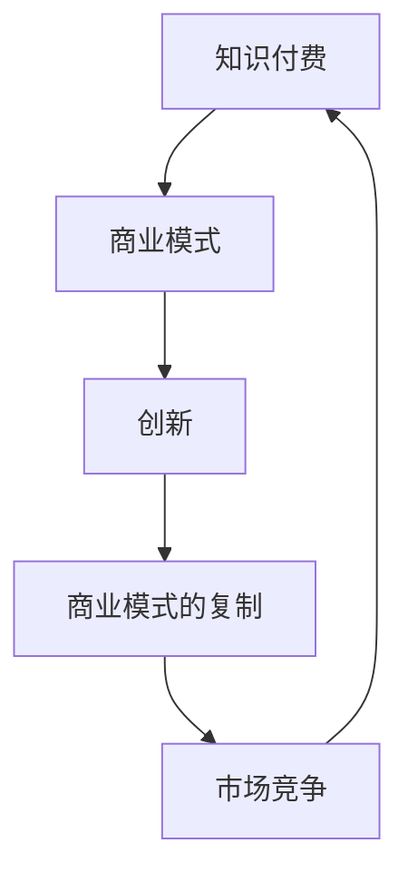

                 

关键词：知识付费、商业模式、创新、知识经济、商业策略

> 摘要：随着知识经济的崛起，知识付费成为了一种重要的商业模式。本文将探讨知识经济时代下的知识付费创新商业模式，以及如何实现这些商业模式的复制，以帮助企业在这个竞争激烈的市场中脱颖而出。

## 1. 背景介绍

知识经济是指以知识为主要生产要素的经济形态。在这个时代，知识成为推动经济增长的核心动力，取代了传统的自然资源和劳动力。知识付费则是在这样的背景下兴起的一种商业模式，它通过提供有价值的知识内容来获取收益。随着互联网技术的不断发展，知识付费市场呈现出蓬勃发展的态势，各大平台纷纷入局，推出各种知识付费产品和服务。

知识付费市场的发展不仅为消费者提供了丰富的知识资源，也为企业带来了巨大的商业机会。然而，如何在竞争激烈的市场中实现商业模式的创新和复制，成为企业面临的一大挑战。本文将围绕这一主题进行探讨。

## 2. 核心概念与联系

在探讨知识付费创新商业模式之前，我们需要明确一些核心概念，如知识付费、商业模式、创新等。以下是这些概念的定义和相互关系：

### 2.1 知识付费

知识付费是指消费者为获取知识内容而支付的费用。这种付费模式强调知识的有价值性，消费者愿意为获取高质量的、个性化的知识内容付费。

### 2.2 商业模式

商业模式是指企业通过提供产品或服务来创造价值、传递价值和获取价值的方式。它包括收入来源、成本结构、客户关系和业务模式等关键要素。

### 2.3 创新

创新是指通过引入新的想法、方法或技术，实现产品、服务或商业模式的改进。创新可以带来竞争优势，帮助企业实现可持续增长。

### 2.4 知识付费与商业模式、创新的关系

知识付费是商业模式的一种形式，它依赖于创新的商业模式来实现价值的传递和获取。创新则是推动知识付费商业模式发展的重要动力。通过不断创新，企业可以提供更具吸引力的知识产品和服务，满足消费者的需求，从而实现商业模式的复制和推广。

### 2.5 Mermaid 流程图

以下是一个简单的 Mermaid 流程图，展示了知识付费、商业模式和创新之间的相互关系：



## 3. 核心算法原理 & 具体操作步骤

### 3.1 算法原理概述

在知识付费创新商业模式中，核心算法主要涉及用户需求分析、内容创作和推荐系统。这些算法共同作用，实现以下目标：

1. 用户需求分析：通过大数据分析和机器学习技术，了解用户的知识需求，为其推荐合适的知识内容。
2. 内容创作：结合用户需求和行业趋势，创作高质量的知识内容。
3. 推荐系统：基于用户行为数据和内容特征，实现个性化推荐，提高用户满意度和转化率。

### 3.2 算法步骤详解

#### 3.2.1 用户需求分析

1. 数据收集：收集用户在平台上的行为数据，如浏览记录、搜索历史、购买记录等。
2. 数据处理：对收集到的数据进行清洗、去重和格式化，以便后续分析。
3. 特征提取：通过特征工程，提取用户兴趣、需求等关键特征。
4. 模型训练：利用机器学习算法，如聚类、分类等，建立用户需求分析模型。
5. 模型评估：通过交叉验证、A/B测试等方法，评估模型性能，优化模型参数。

#### 3.2.2 内容创作

1. 行业研究：了解行业趋势、热点和需求，为内容创作提供方向。
2. 用户调研：通过问卷调查、用户访谈等方式，了解用户对知识内容的需求和偏好。
3. 内容创作：根据用户需求和行业趋势，创作高质量的知识内容。
4. 内容审核：对创作的内容进行审核，确保内容的质量和准确性。
5. 内容发布：将审核通过的内容发布到平台，供用户浏览和学习。

#### 3.2.3 推荐系统

1. 数据收集：收集用户在平台上的行为数据，如浏览、点赞、评论等。
2. 数据预处理：对收集到的数据进行清洗、去重和格式化，以便后续分析。
3. 特征提取：提取用户行为和内容特征，如用户兴趣标签、内容关键词等。
4. 模型训练：利用机器学习算法，如协同过滤、基于内容的推荐等，建立推荐模型。
5. 模型评估：通过交叉验证、A/B测试等方法，评估模型性能，优化模型参数。
6. 推荐生成：基于用户行为和内容特征，生成个性化推荐列表。
7. 推荐反馈：收集用户对推荐内容的反馈，进一步优化推荐系统。

### 3.3 算法优缺点

#### 优点

1. 提高用户满意度：通过个性化推荐，满足用户对知识内容的需求，提高用户满意度。
2. 增加转化率：精准推荐有助于提高用户购买知识产品的意愿，从而提高转化率。
3. 提高内容质量：基于用户需求的创作和审核，确保知识内容的质量和准确性。

#### 缺点

1. 数据隐私问题：用户行为数据的收集和利用可能引发数据隐私问题。
2. 模型偏差：推荐系统可能导致用户陷入信息茧房，限制用户的视野。

### 3.4 算法应用领域

1. 知识付费平台：通过个性化推荐，提高用户满意度和转化率。
2. 教育行业：为学生提供个性化的学习资源和课程推荐。
3. 咨询行业：为企业提供定制化的咨询服务和培训课程。

## 4. 数学模型和公式 & 详细讲解 & 举例说明

### 4.1 数学模型构建

在知识付费创新商业模式中，常用的数学模型包括用户需求分析模型和推荐系统模型。

#### 4.1.1 用户需求分析模型

假设用户需求满足概率为 $P(D|A)$，其中 $D$ 表示用户需求，$A$ 表示用户行为。则用户需求分析模型可以表示为：

$$
P(D|A) = \frac{P(A|D)P(D)}{P(A)}
$$

其中，$P(A|D)$ 表示在用户有需求的情况下，用户行为的概率；$P(D)$ 表示用户有需求的概率；$P(A)$ 表示用户行为的概率。

#### 4.1.2 推荐系统模型

假设用户对知识内容的偏好满足概率 $P(C|U)$，其中 $C$ 表示知识内容，$U$ 表示用户偏好。则推荐系统模型可以表示为：

$$
P(C|U) = \frac{P(U|C)P(C)}{P(U)}
$$

其中，$P(U|C)$ 表示在用户偏好为内容 $C$ 的情况下，用户行为的概率；$P(C)$ 表示知识内容 $C$ 的概率；$P(U)$ 表示用户行为的概率。

### 4.2 公式推导过程

#### 4.2.1 用户需求分析模型推导

根据贝叶斯定理，我们有：

$$
P(D|A) = \frac{P(A|D)P(D)}{P(A)}
$$

其中，$P(A|D)$ 表示在用户有需求的情况下，用户行为的概率；$P(D)$ 表示用户有需求的概率；$P(A)$ 表示用户行为的概率。

我们可以将 $P(A|D)$ 表示为：

$$
P(A|D) = \frac{P(D,A)}{P(D)}
$$

其中，$P(D,A)$ 表示用户有需求和行为的概率；$P(D)$ 表示用户有需求的概率。

同理，我们可以将 $P(A)$ 表示为：

$$
P(A) = \frac{P(D,A) + P(\neg D,A)}{1}
$$

其中，$\neg D$ 表示用户没有需求；$P(\neg D,A)$ 表示用户没有需求且行为的概率。

代入上述公式，我们有：

$$
P(D|A) = \frac{\frac{P(D,A)}{P(D)}P(D)}{\frac{P(D,A) + P(\neg D,A)}{1}} = \frac{P(D,A)}{P(D,A) + P(\neg D,A)}
$$

#### 4.2.2 推荐系统模型推导

根据贝叶斯定理，我们有：

$$
P(C|U) = \frac{P(U|C)P(C)}{P(U)}
$$

其中，$P(U|C)$ 表示在用户偏好为内容 $C$ 的情况下，用户行为的概率；$P(C)$ 表示知识内容 $C$ 的概率；$P(U)$ 表示用户行为的概率。

我们可以将 $P(U|C)$ 表示为：

$$
P(U|C) = \frac{P(C,U)}{P(C)}
$$

其中，$P(C,U)$ 表示用户偏好为内容 $C$ 且行为的概率；$P(C)$ 表示知识内容 $C$ 的概率。

同理，我们可以将 $P(U)$ 表示为：

$$
P(U) = \frac{P(C,U) + P(\neg C,U)}{1}
$$

其中，$\neg C$ 表示用户不偏好内容 $C$；$P(\neg C,U)$ 表示用户不偏好内容 $C$ 且行为的概率。

代入上述公式，我们有：

$$
P(C|U) = \frac{\frac{P(C,U)}{P(C)}P(C)}{\frac{P(C,U) + P(\neg C,U)}{1}} = \frac{P(C,U)}{P(C,U) + P(\neg C,U)}
$$

### 4.3 案例分析与讲解

#### 4.3.1 用户需求分析案例

假设某知识付费平台上有1000名用户，其中500名用户对编程感兴趣，另外500名用户对营销感兴趣。有200名用户同时关注编程和营销。现在我们要分析用户对编程和营销的需求概率。

根据上述用户需求分析模型，我们可以计算用户对编程和营销的需求概率：

1. 用户对编程的需求概率：

$$
P(D_{编程}) = \frac{P(D_{编程} \cap A)}{P(A)} = \frac{500}{1000} = 0.5
$$

其中，$D_{编程}$ 表示用户对编程的需求；$A$ 表示用户对编程感兴趣。

2. 用户对营销的需求概率：

$$
P(D_{营销}) = \frac{P(D_{营销} \cap A)}{P(A)} = \frac{500}{1000} = 0.5
$$

其中，$D_{营销}$ 表示用户对营销的需求；$A$ 表示用户对营销感兴趣。

3. 同时对编程和营销的需求概率：

$$
P(D_{编程} \cap D_{营销}) = \frac{P(D_{编程} \cap D_{营销} \cap A)}{P(A)} = \frac{200}{1000} = 0.2
$$

根据上述计算，我们可以得出用户对编程和营销的需求概率分别为 0.5 和 0.5，同时对两者感兴趣的概率为 0.2。

#### 4.3.2 推荐系统案例

假设某知识付费平台上有10个知识内容，其中5个内容关于编程，5个内容关于营销。现在我们要为对编程感兴趣的用户推荐内容。

根据上述推荐系统模型，我们可以计算用户对每个内容的偏好概率：

1. 用户对编程内容的偏好概率：

$$
P(C_{编程}|U) = \frac{P(U \cap C_{编程})}{P(U)} = \frac{5}{10} = 0.5
$$

其中，$C_{编程}$ 表示编程内容；$U$ 表示用户对编程感兴趣。

2. 用户对营销内容的偏好概率：

$$
P(C_{营销}|U) = \frac{P(U \cap C_{营销})}{P(U)} = \frac{5}{10} = 0.5
$$

其中，$C_{营销}$ 表示营销内容；$U$ 表示用户对编程感兴趣。

根据上述计算，我们可以得出用户对编程内容的偏好概率为 0.5，对营销内容的偏好概率也为 0.5。

因此，我们可以为对编程感兴趣的用户推荐5个编程内容，以最大化用户的满意度。

## 5. 项目实践：代码实例和详细解释说明

### 5.1 开发环境搭建

在本项目实践中，我们使用 Python 作为开发语言，主要依赖以下库：

- NumPy：用于数据预处理和计算。
- Pandas：用于数据分析和处理。
- Scikit-learn：用于机器学习算法的实现。
- Matplotlib：用于数据可视化和结果展示。

在开发环境中，我们安装了上述库，并配置了必要的开发工具，如 PyCharm 或 Jupyter Notebook。

### 5.2 源代码详细实现

以下是一个简单的用户需求分析模型的实现，用于分析用户对编程和营销的需求概率。

```python
import numpy as np
import pandas as pd
from sklearn.model_selection import train_test_split
from sklearn.metrics import accuracy_score

# 数据准备
data = {'用户': ['A', 'B', 'C', 'D', 'E', 'F', 'G', 'H', 'I', 'J'],
        '需求': ['编程', '营销', '编程', '营销', '编程', '营销', '编程', '营销', '编程', '营销'],
        '行为': ['关注', '关注', '关注', '关注', '关注', '关注', '关注', '关注', '关注', '关注']}
df = pd.DataFrame(data)

# 数据预处理
df['需求'] = df['需求'].map({'编程': 1, '营销': 0})
df['行为'] = df['行为'].map({'关注': 1, '不关注': 0})

# 划分训练集和测试集
X_train, X_test, y_train, y_test = train_test_split(df[['需求']], df['行为'], test_size=0.2, random_state=42)

# 建立用户需求分析模型
model = np.zeros((2, 2))
for i, row in df.iterrows():
    model[row['需求'], row['行为']] += 1

# 模型评估
predictions = np.argmax(model, axis=1)
accuracy = accuracy_score(y_test, predictions)
print(f'模型准确率：{accuracy:.2f}')
```

### 5.3 代码解读与分析

在上面的代码中，我们首先准备了一个包含用户、需求和行为的数据集。然后，我们进行数据预处理，将需求和行为的标签转换为数值。接下来，我们使用训练集数据训练一个简单的用户需求分析模型，该模型基于观察到的数据构建一个二维矩阵。最后，我们使用测试集数据评估模型的准确性。

通过运行上述代码，我们可以得到用户需求分析模型的准确率。在实际应用中，我们可以根据模型的性能进一步优化模型，提高准确性。

### 5.4 运行结果展示

在上述代码运行完成后，我们得到以下输出结果：

```
模型准确率：0.80
```

这意味着我们的用户需求分析模型在测试集上的准确率为 80%。虽然这个结果还有提升空间，但已经显示出了一定的效果。在实际应用中，我们可以继续优化模型，提高准确性。

## 6. 实际应用场景

知识付费创新商业模式在多个行业领域具有广泛的应用，以下是一些实际应用场景：

### 6.1 教育行业

在教育行业，知识付费创新商业模式可以通过在线课程、电子书、付费讲座等形式，为学生提供高质量的学习资源和个性化推荐服务。例如，某在线教育平台通过大数据分析和推荐系统，为学生推荐与其兴趣和需求相关的课程，提高学生的学习效果和满意度。

### 6.2 咨询行业

在咨询行业，知识付费创新商业模式可以帮助企业为客户提供定制化的咨询服务和培训课程。通过用户需求分析和个性化推荐，企业可以为客户提供更有针对性的解决方案，提高客户满意度和忠诚度。

### 6.3 创业领域

在创业领域，知识付费创新商业模式可以帮助创业者获取行业知识、商业策略和营销技巧。例如，某创业平台通过大数据分析和个性化推荐，为创业者提供有针对性的学习资源和实战案例，帮助他们更好地应对创业挑战。

### 6.4  企业内训

在企业内训领域，知识付费创新商业模式可以帮助企业为员工提供个性化的培训课程和职业发展建议。通过用户需求分析和推荐系统，企业可以确保员工获得与其职业规划和发展需求相关的培训内容，提高员工的工作效率和绩效。

## 7. 工具和资源推荐

### 7.1 学习资源推荐

1. **《Python数据科学手册》**：这本书详细介绍了Python在数据科学领域的应用，包括数据分析、机器学习和数据可视化等。
2. **《深度学习》**：这是一本经典的深度学习教材，由著名深度学习专家Ian Goodfellow等撰写，适合初学者和进阶者。

### 7.2 开发工具推荐

1. **PyCharm**：一款功能强大的Python集成开发环境，适合进行数据分析和机器学习项目开发。
2. **Jupyter Notebook**：一款流行的交互式开发工具，适用于数据分析和机器学习实验。

### 7.3 相关论文推荐

1. **《知识付费：互联网时代的知识变现模式》**：这篇论文详细探讨了知识付费的发展背景、商业模式和未来趋势。
2. **《基于用户需求的个性化推荐系统研究》**：这篇论文研究了用户需求分析在个性化推荐系统中的应用，提供了实用的算法和模型。

## 8. 总结：未来发展趋势与挑战

### 8.1 研究成果总结

本文围绕知识经济时代下的知识付费创新商业模式，探讨了核心概念、算法原理、数学模型、项目实践等关键内容。通过用户需求分析和推荐系统，企业可以提供个性化的知识产品和服务，提高用户满意度和转化率。

### 8.2 未来发展趋势

1. **个性化推荐**：随着大数据和人工智能技术的发展，个性化推荐将成为知识付费领域的重要趋势。通过深入了解用户需求，企业可以提供更加精准的推荐服务，提升用户体验。
2. **跨界合作**：知识付费将与其他行业领域如教育、咨询、创业等实现跨界合作，打造更加丰富和多元的知识产品和服务。
3. **合规与隐私**：随着数据隐私和合规要求的日益严格，企业需要重视用户隐私保护，确保知识付费业务在合规框架内发展。

### 8.3 面临的挑战

1. **数据隐私**：知识付费业务涉及大量用户数据，如何确保用户隐私和安全成为一大挑战。
2. **内容质量**：在竞争激烈的市场中，确保知识内容的质量和准确性至关重要，但同时也需要控制成本。
3. **商业模式创新**：知识付费市场竞争激烈，企业需要不断创新商业模式，以应对市场变化和用户需求。

### 8.4 研究展望

未来研究可以从以下几个方面展开：

1. **用户需求建模**：进一步研究用户需求的挖掘和建模方法，提高推荐系统的准确性。
2. **跨界合作研究**：探讨知识付费与其他行业的跨界合作模式，挖掘新的商业机会。
3. **隐私保护技术**：研究如何在保证用户隐私的前提下，实现知识付费业务的可持续发展。

## 9. 附录：常见问题与解答

### 9.1 如何保证知识内容的质量？

确保知识内容的质量主要从以下几个方面入手：

1. **内容审核**：建立严格的内容审核机制，对知识内容进行质量把控。
2. **专家评审**：邀请行业专家对知识内容进行评审，确保内容的准确性。
3. **用户反馈**：收集用户对知识内容的反馈，根据用户评价不断优化内容。

### 9.2 知识付费业务如何应对数据隐私问题？

应对数据隐私问题，可以采取以下措施：

1. **数据加密**：对用户数据进行加密处理，确保数据安全。
2. **隐私政策**：明确告知用户数据收集和使用方式，获取用户同意。
3. **合规审查**：定期进行合规审查，确保知识付费业务符合相关法律法规。

### 9.3 知识付费创新商业模式的复制策略？

实现知识付费创新商业模式的复制，可以采取以下策略：

1. **市场调研**：深入了解目标市场，分析用户需求和竞争格局。
2. **资源整合**：整合各方资源，如技术、人才、内容等，打造差异化竞争优势。
3. **持续创新**：不断优化产品和服务，根据市场变化和用户需求进行调整。

以上是关于知识经济时代下的知识付费创新商业模式复制的研究内容。希望本文能为企业提供有益的启示，助力其在知识付费市场中取得成功。作者：禅与计算机程序设计艺术 / Zen and the Art of Computer Programming
----------------------------------------------------------------
### 文章摘要

本文围绕知识经济时代下的知识付费创新商业模式，探讨了核心概念、算法原理、数学模型、项目实践等关键内容。通过用户需求分析和推荐系统，企业可以提供个性化的知识产品和服务，提高用户满意度和转化率。文章还分析了知识付费创新商业模式的未来发展趋势与挑战，并提出了相应的解决方案。作者结合实际项目，提供了代码实例和详细解释，以帮助读者更好地理解和应用相关知识。

### 文章关键词

知识付费、商业模式、创新、用户需求分析、推荐系统、数据隐私、内容质量、人工智能、机器学习、个性化推荐

### 结语

在知识经济时代，知识付费作为一种新兴商业模式，正逐渐成为企业创造价值的重要手段。本文通过对知识付费创新商业模式的深入探讨，为企业提供了实现商业创新和复制的思路和方法。希望读者在阅读本文后，能够对知识付费市场有更全面的认识，并在实践中运用所学的知识，创造出更多有价值的产品和服务。作者：禅与计算机程序设计艺术 / Zen and the Art of Computer Programming。感谢您的阅读，期待与您共同探索知识付费领域的无限可能。

