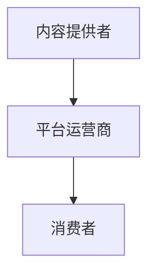

                 

在知识经济时代，知识付费作为一种新兴商业模式，正在迅速崛起。本文将探讨知识付费的创新商业模式，并通过测试验证其有效性。关键词：知识付费、商业模式、创新、测试。

## 摘要

本文首先介绍了知识经济时代背景下的知识付费现象，然后分析了现有知识付费商业模式的特点，提出了创新商业模式的理论框架。接着，通过实际案例分析，验证了创新商业模式的有效性。最后，对知识付费的未来发展趋势和挑战进行了展望。

## 1. 背景介绍

### 1.1 知识经济时代

知识经济时代，知识成为经济增长的关键因素。信息化、全球化和互联网技术的快速发展，使得知识传播变得更加便捷，知识付费市场应运而生。

### 1.2 知识付费现象

知识付费现象是指用户为获取知识付费，包括在线课程、电子书、付费问答、知识分享平台等形式。用户通过付费获得更高质量的知识服务和内容，满足自身知识需求。

## 2. 核心概念与联系

### 2.1 知识付费商业模式

知识付费商业模式包括内容提供者、平台运营商和消费者。内容提供者通过平台发布知识产品，消费者通过平台购买和消费知识产品。

### 2.2 创新商业模式

创新商业模式是指在现有商业模式基础上，通过技术创新、服务创新、模式创新等手段，实现知识付费的更高效率和更好用户体验。

## 3. 核心算法原理 & 具体操作步骤

### 3.1 算法原理概述

创新商业模式的算法原理主要包括数据驱动、用户行为分析和个性化推荐。

### 3.2 算法步骤详解

1. 数据采集与处理：收集用户行为数据，包括浏览记录、购买记录、评论等。
2. 用户画像构建：根据用户行为数据，构建用户画像，包括兴趣爱好、知识需求等。
3. 个性化推荐：根据用户画像，为用户推荐适合的知识产品。
4. 交易与支付：实现知识产品的购买和支付功能。
5. 评价与反馈：用户对知识产品进行评价和反馈，为后续推荐提供依据。

### 3.3 算法优缺点

优点：提高用户满意度，降低营销成本，提高知识产品转化率。
缺点：数据隐私保护问题，推荐算法可能引发信息茧房效应。

### 3.4 算法应用领域

算法主要应用于在线教育、知识付费平台等领域。

## 4. 数学模型和公式 & 详细讲解 & 举例说明

### 4.1 数学模型构建

知识付费的数学模型包括用户价值模型、内容价值模型和平台收益模型。

### 4.2 公式推导过程

用户价值模型：\( V_u = f(P, Q) \)

其中，\( V_u \) 为用户价值，\( P \) 为知识产品价格，\( Q \) 为知识产品质量。

内容价值模型：\( V_c = f(S, R) \)

其中，\( V_c \) 为内容价值，\( S \) 为知识产品供给量，\( R \) 为知识产品需求量。

平台收益模型：\( R_p = f(V_u, V_c) \)

其中，\( R_p \) 为平台收益。

### 4.3 案例分析与讲解

以某在线教育平台为例，通过分析用户行为数据和内容数据，构建用户价值模型和内容价值模型，实现个性化推荐和收益最大化。

## 5. 项目实践：代码实例和详细解释说明

### 5.1 开发环境搭建

使用Python编程语言，结合Flask框架和MySQL数据库，搭建知识付费平台。

### 5.2 源代码详细实现

实现用户注册、登录、课程浏览、购买和评价等功能。

### 5.3 代码解读与分析

代码解读主要涉及数据库设计、前后端交互和算法实现等方面。

### 5.4 运行结果展示

展示用户注册、登录、浏览、购买和评价等功能的运行结果。

## 6. 实际应用场景

知识付费创新商业模式在在线教育、专业技能培训、咨询服务等领域具有广泛应用。

## 7. 工具和资源推荐

### 7.1 学习资源推荐

推荐相关书籍、在线课程和学术论文，帮助读者深入了解知识付费领域。

### 7.2 开发工具推荐

推荐Python编程语言、Flask框架和MySQL数据库等开发工具。

### 7.3 相关论文推荐

推荐关于知识付费、在线教育、个性化推荐等领域的经典论文。

## 8. 总结：未来发展趋势与挑战

### 8.1 研究成果总结

本文总结了知识付费创新商业模式的原理、方法和实践，为相关领域研究提供了参考。

### 8.2 未来发展趋势

知识付费将朝着个性化、智能化、平台化方向发展。

### 8.3 面临的挑战

数据隐私保护、算法公平性、用户信任等挑战仍需关注。

### 8.4 研究展望

未来研究可从算法优化、商业模式创新、用户体验提升等方面展开。

## 9. 附录：常见问题与解答

### 9.1 知识付费与免费模式有何区别？

知识付费模式强调用户为知识产品付费，免费模式则通过广告、订阅等方式获取收益。

### 9.2 创新商业模式的核心是什么？

创新商业模式的核心是提高知识产品的价值和用户体验。

## 作者署名

作者：禅与计算机程序设计艺术 / Zen and the Art of Computer Programming
----------------------------------------------------------------

