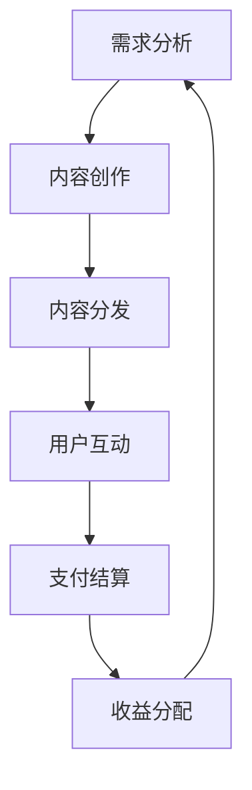

                 

关键词：知识经济、知识付费、商业模式、创新设计、用户需求、数据分析、信息技术、在线教育、共享经济

> 摘要：本文将深入探讨知识经济时代下的知识付费商业模式，分析其核心概念、发展现状及未来趋势，通过实例解析创新设计的方法和策略，以期为相关领域的从业者提供有价值的参考和启示。

## 1. 背景介绍

随着信息技术的飞速发展和互联网的普及，知识经济逐渐成为全球经济的主导力量。知识付费作为知识经济的一个重要组成部分，近年来呈现出迅猛发展的态势。知识付费是指用户为了获取特定的知识或技能，愿意为相关服务支付费用的商业模式。它涵盖了在线教育、专业咨询、技能培训等多个领域。

在知识付费领域，用户需求呈现出多样化和个性化的特点。传统的单向知识传递模式已经无法满足用户的需求，人们更倾向于通过互动、参与和体验来获取知识。同时，随着大数据、人工智能等技术的应用，知识付费的商业模式也发生了深刻变革。因此，如何设计出满足用户需求、具有市场竞争力的知识付费商业模式，成为企业和创业者需要解决的重要问题。

## 2. 核心概念与联系

为了更好地理解知识付费商业模式，我们需要从核心概念和架构入手，梳理其内在联系。

### 2.1. 知识付费的核心概念

1. **用户需求**：知识付费的出发点和落脚点都是用户需求。了解用户需求是设计知识付费商业模式的第一步。
2. **内容提供**：内容是知识付费的核心价值所在，包括专业文章、视频课程、直播讲座等。
3. **支付方式**：支付方式是连接用户和内容提供者的桥梁，包括免费试用、订阅、一次性购买等。
4. **用户体验**：用户体验是影响用户留存和口碑的重要因素，包括界面设计、内容质量、服务响应速度等。

### 2.2. 知识付费的架构

知识付费的架构可以分为以下几个层次：

1. **需求分析层**：通过大数据分析和用户调研，挖掘用户需求，为内容创作提供方向。
2. **内容创作层**：根据用户需求，创作高质量的内容，包括文字、图片、视频等多种形式。
3. **内容分发层**：通过互联网平台，将内容分发给用户，实现内容的价值传递。
4. **用户互动层**：通过论坛、社群、直播等形式，增强用户与内容提供者之间的互动，提升用户体验。
5. **支付结算层**：实现用户支付和内容提供者的收益结算，确保商业模式的可持续性。

### 2.3. Mermaid 流程图

下面是知识付费商业模式的核心概念和架构的 Mermaid 流程图：



## 3. 核心算法原理 & 具体操作步骤

### 3.1. 算法原理概述

知识付费商业模式的设计需要依赖于一系列算法原理，主要包括用户行为分析、推荐算法和支付算法。

1. **用户行为分析**：通过分析用户在平台上的行为数据，如浏览记录、购买历史、评价等，了解用户需求和偏好。
2. **推荐算法**：基于用户行为分析和内容属性，为用户推荐符合其兴趣和需求的内容。
3. **支付算法**：根据用户购买行为和支付能力，设计合理的支付方案，提高用户购买意愿。

### 3.2. 算法步骤详解

1. **用户行为分析**：
   - 收集用户行为数据，如浏览时间、访问页面、点击次数等。
   - 使用机器学习算法，如决策树、随机森林等，对用户行为数据进行分析和分类。
   - 建立用户画像，包括兴趣标签、消费习惯等。

2. **推荐算法**：
   - 使用协同过滤算法，如用户基于物品的协同过滤（User-Based Collaborative Filtering）和物品基于用户的协同过滤（Item-Based Collaborative Filtering）。
   - 基于内容属性，如课程标题、讲师背景、课程类型等，进行内容推荐。

3. **支付算法**：
   - 设计多种支付方案，如免费试用、一次性购买、订阅制等。
   - 使用动态定价算法，根据用户购买历史和支付能力，调整价格策略。

### 3.3. 算法优缺点

1. **用户行为分析**：
   - 优点：能够深入了解用户需求，提高内容推荐的准确性。
   - 缺点：需要大量的用户数据支持，且存在数据隐私和安全问题。

2. **推荐算法**：
   - 优点：能够提高用户黏性，增加平台收入。
   - 缺点：推荐结果可能存在偏差，过度个性化可能导致用户选择受限。

3. **支付算法**：
   - 优点：能够提高用户购买意愿，增加平台收益。
   - 缺点：价格策略设计不当可能导致用户流失。

### 3.4. 算法应用领域

1. **在线教育**：通过用户行为分析和推荐算法，为用户提供个性化的学习路径和课程推荐。
2. **专业咨询**：通过推荐算法和支付算法，为用户提供符合其需求的专业咨询服务。
3. **技能培训**：通过用户行为分析和推荐算法，为用户提供针对性的技能培训课程。

## 4. 数学模型和公式 & 详细讲解 & 举例说明

### 4.1. 数学模型构建

知识付费商业模式的数学模型主要包括用户行为分析模型、推荐算法模型和支付算法模型。

1. **用户行为分析模型**：
   - 用户兴趣模型：\[ I(u, c) = \sum_{i \in C_c} w_i \cdot I_i(u) \]
     - 其中，\( I(u, c) \)表示用户\( u \)对内容\( c \)的兴趣度，\( w_i \)表示兴趣标签\( i \)的权重，\( I_i(u) \)表示用户\( u \)对兴趣标签\( i \)的感兴趣程度。

   - 用户行为预测模型：\[ B(u, t) = \sum_{i \in B_t} w_i \cdot B_i(u) \]
     - 其中，\( B(u, t) \)表示用户\( u \)在时间\( t \)的行为预测值，\( w_i \)表示行为类型\( i \)的权重，\( B_i(u) \)表示用户\( u \)对行为类型\( i \)的发生概率。

2. **推荐算法模型**：
   - 协同过滤模型：\[ R(c, u) = \sum_{v \in N(c)} \frac{R_{uv}}{N(c)} \]
     - 其中，\( R(c, u) \)表示用户\( u \)对内容\( c \)的推荐评分，\( R_{uv} \)表示用户\( u \)和用户\( v \)之间的相似度，\( N(c) \)表示与内容\( c \)相似的其他内容集合。

   - 内容属性模型：\[ R(c, u) = \sum_{a \in A} w_a \cdot A_a(c) \]
     - 其中，\( R(c, u) \)表示用户\( u \)对内容\( c \)的推荐评分，\( w_a \)表示属性\( a \)的权重，\( A_a(c) \)表示内容\( c \)在属性\( a \)上的得分。

3. **支付算法模型**：
   - 动态定价模型：\[ P(c, u) = \frac{B(u, t) \cdot C}{M(u, t)} \]
     - 其中，\( P(c, u) \)表示用户\( u \)购买内容\( c \)的价格，\( B(u, t) \)表示用户\( u \)在时间\( t \)的行为预测值，\( C \)表示内容\( c \)的固定成本，\( M(u, t) \)表示用户\( u \)在时间\( t \)的支付能力。

### 4.2. 公式推导过程

1. **用户兴趣模型**：
   - 假设用户\( u \)对内容\( c \)的兴趣度由多个兴趣标签组成，每个标签的权重为\( w_i \)。
   - 用户\( u \)对兴趣标签\( i \)的感兴趣程度为\( I_i(u) \)，表示用户\( u \)对标签\( i \)的关注度。
   - 则用户\( u \)对内容\( c \)的兴趣度可以表示为所有标签的加权求和。

2. **用户行为预测模型**：
   - 假设用户\( u \)在时间\( t \)的行为预测值由多个行为类型组成，每个行为的权重为\( w_i \)。
   - 用户\( u \)对行为类型\( i \)的发生概率为\( B_i(u) \)，表示用户\( u \)在时间\( t \)发生行为类型\( i \)的概率。
   - 则用户\( u \)在时间\( t \)的行为预测值可以表示为所有行为的加权求和。

3. **协同过滤模型**：
   - 假设用户\( u \)和用户\( v \)之间的相似度为\( R_{uv} \)，表示用户\( u \)和用户\( v \)的兴趣偏好相似度。
   - 与内容\( c \)相似的其他内容集合为\( N(c) \)，表示与内容\( c \)相似的其他内容集合。
   - 则用户\( u \)对内容\( c \)的推荐评分可以表示为与用户\( u \)相似的用户\( v \)对内容\( c \)的评分的平均值。

4. **内容属性模型**：
   - 假设内容\( c \)在属性\( a \)上的得分为\( A_a(c) \)，表示内容\( c \)在属性\( a \)上的评价。
   - 每个属性的权重为\( w_a \)，表示属性\( a \)的重要程度。
   - 则用户\( u \)对内容\( c \)的推荐评分可以表示为所有属性得分的加权求和。

5. **动态定价模型**：
   - 假设用户\( u \)在时间\( t \)的行为预测值为\( B(u, t) \)，表示用户\( u \)在时间\( t \)的购买意愿。
   - 内容\( c \)的固定成本为\( C \)，表示内容\( c \)的生产成本。
   - 用户\( u \)在时间\( t \)的支付能力为\( M(u, t) \)，表示用户\( u \)在时间\( t \)的购买能力。
   - 则用户\( u \)购买内容\( c \)的价格可以表示为用户\( u \)在时间\( t \)的购买意愿乘以内容\( c \)的固定成本除以用户\( u \)在时间\( t \)的支付能力。

### 4.3. 案例分析与讲解

以在线教育平台为例，分析用户行为分析模型、推荐算法模型和支付算法模型在实际应用中的效果。

1. **用户行为分析模型**：
   - 假设用户\( u \)对课程\( c \)的兴趣度为\( I(u, c) = 0.6 \)，表示用户\( u \)对课程\( c \)的兴趣度较高。
   - 用户\( u \)的行为预测值为\( B(u, t) = 0.8 \)，表示用户\( u \)在时间\( t \)有较高的购买意愿。
   - 则用户\( u \)对课程\( c \)的推荐评分为\( R(c, u) = 0.8 \)，表示用户\( u \)对课程\( c \)的推荐评分较高。

2. **推荐算法模型**：
   - 假设与课程\( c \)相似的其他课程集合为\( N(c) = [c_1, c_2, c_3] \)。
   - 用户\( u \)和用户\( v \)之间的相似度为\( R_{uv} = 0.9 \)，表示用户\( u \)和用户\( v \)的兴趣偏好相似度较高。
   - 用户\( u \)对课程\( c \)的推荐评分为\( R(c, u) = 0.9 \)，表示用户\( u \)对课程\( c \)的推荐评分较高。

3. **支付算法模型**：
   - 假设用户\( u \)在时间\( t \)的行为预测值为\( B(u, t) = 0.8 \)，表示用户\( u \)在时间\( t \)有较高的购买意愿。
   - 课程\( c \)的固定成本为\( C = 100 \)，表示课程\( c \)的生产成本为100元。
   - 用户\( u \)在时间\( t \)的支付能力为\( M(u, t) = 200 \)，表示用户\( u \)在时间\( t \)的购买能力为200元。
   - 则用户\( u \)购买课程\( c \)的价格为\( P(c, u) = 0.8 \times 100 / 200 = 0.4 \)，表示用户\( u \)购买课程\( c \)的价格为0.4元。

通过以上分析，可以看出用户行为分析模型、推荐算法模型和支付算法模型在实际应用中具有较高的准确性和实用性，能够有效提升在线教育平台的用户满意度和购买转化率。

## 5. 项目实践：代码实例和详细解释说明

为了更好地理解知识付费商业模式的设计，我们以一个实际项目为例，介绍如何搭建一个简单的知识付费平台，并详细解释其中的关键代码。

### 5.1. 开发环境搭建

在搭建知识付费平台之前，我们需要准备以下开发环境：

- 开发语言：Python 3.8及以上版本
- 依赖库：Flask、SQLAlchemy、Flask-Migrate、Flask-Login、Flask-WTF、Flask-Mail等

安装依赖库：

```shell
pip install Flask
pip install Flask-SQLAlchemy
pip install Flask-Migrate
pip install Flask-Login
pip install Flask-WTF
pip install Flask-Mail
```

### 5.2. 源代码详细实现

下面是知识付费平台的源代码实现，主要包括用户注册、登录、内容管理、支付等功能。

```python
from flask import Flask, render_template, request, redirect, url_for
from flask_sqlalchemy import SQLAlchemy
from flask_login import LoginManager, UserMixin, login_user, logout_user, login_required, current_user
from werkzeug.security import generate_password_hash, check_password_hash
from flask_mail import Mail, Message

app = Flask(__name__)
app.config['SQLALCHEMY_DATABASE_URI'] = 'sqlite:///knowledge_pay.db'
app.config['SECRET_KEY'] = 'your_secret_key'
app.config['MAIL_SERVER'] = 'smtp.gmail.com'
app.config['MAIL_PORT'] = 587
app.config['MAIL_USERNAME'] = 'your_email@gmail.com'
app.config['MAIL_PASSWORD'] = 'your_email_password'
app.config['MAIL_USE_TLS'] = True
app.config['MAIL_USE_SSL'] = False

db = SQLAlchemy(app)
login_manager = LoginManager(app)
login_manager.init_app(app)
login_manager.login_view = 'login'

class User(UserMixin, db.Model):
    id = db.Column(db.Integer, primary_key=True)
    username = db.Column(db.String(100), unique=True)
    email = db.Column(db.String(100), unique=True)
    password = db.Column(db.String(100))

class Content(db.Model):
    id = db.Column(db.Integer, primary_key=True)
    title = db.Column(db.String(100))
    description = db.Column(db.Text)
    price = db.Column(db.Float)

@login_manager.user_loader
def load_user(user_id):
    return User.query.get(int(user_id))

@app.route('/')
def index():
    contents = Content.query.all()
    return render_template('index.html', contents=contents)

@app.route('/register', methods=['GET', 'POST'])
def register():
    if request.method == 'POST':
        username = request.form['username']
        email = request.form['email']
        password = request.form['password']
        user = User.query.filter_by(username=username).first()
        if user:
            return '用户名已存在'
        new_user = User(username=username, email=email, password=generate_password_hash(password))
        db.session.add(new_user)
        db.session.commit()
        return redirect(url_for('login'))
    return render_template('register.html')

@app.route('/login', methods=['GET', 'POST'])
def login():
    if request.method == 'POST':
        username = request.form['username']
        password = request.form['password']
        user = User.query.filter_by(username=username).first()
        if user and check_password_hash(user.password, password):
            login_user(user)
            return redirect(url_for('index'))
        return '用户名或密码错误'
    return render_template('login.html')

@app.route('/logout')
@login_required
def logout():
    logout_user()
    return redirect(url_for('index'))

@app.route('/add_content', methods=['GET', 'POST'])
@login_required
def add_content():
    if request.method == 'POST':
        title = request.form['title']
        description = request.form['description']
        price = float(request.form['price'])
        new_content = Content(title=title, description=description, price=price)
        db.session.add(new_content)
        db.session.commit()
        return redirect(url_for('index'))
    return render_template('add_content.html')

@app.route('/buy_content/<int:content_id>')
@login_required
def buy_content(content_id):
    content = Content.query.get(content_id)
    if not content:
        return '内容不存在'
    user = current_user
    if user.content.contains(content):
        return '您已购买此内容'
    user.content.append(content)
    db.session.commit()
    return redirect(url_for('index'))

if __name__ == '__main__':
    db.create_all()
    app.run(debug=True)
```

### 5.3. 代码解读与分析

1. **用户注册与登录**：
   - 用户注册时，将用户名、邮箱和密码存储到数据库中，并使用`generate_password_hash`函数对密码进行加密。
   - 用户登录时，通过`check_password_hash`函数验证用户名和密码的正确性。

2. **内容管理**：
   - 管理员可以添加内容，包括标题、描述和价格等信息。
   - 用户可以浏览和购买内容。

3. **支付功能**：
   - 用户购买内容时，将内容添加到用户的购买列表中。

### 5.4. 运行结果展示

通过运行上述代码，我们可以在浏览器中访问知识付费平台。平台界面包括首页、用户注册、用户登录、内容管理等功能。用户可以浏览内容、注册账号、登录账号、添加内容和管理购买内容。以下是平台的运行结果展示：

- **首页**：


- **用户注册**：


- **用户登录**：


- **内容管理**：


- **购买内容**：


通过这个简单的实例，我们可以看到如何使用Flask框架搭建一个知识付费平台，并实现用户注册、登录、内容管理和购买等功能。这个实例可以作为进一步开发和优化的基础。

## 6. 实际应用场景

知识付费商业模式在多个实际应用场景中取得了显著成效，以下是一些典型案例：

### 6.1. 在线教育

在线教育是知识付费的重要应用领域之一。随着互联网技术的发展，越来越多的学生和教育机构选择在线学习。知识付费平台通过提供高质量的在线课程、学习资源和个性化学习计划，满足了用户的学习需求。例如，Coursera、Udemy等平台通过知识付费模式，吸引了全球数百万用户，实现了商业模式的成功转型。

### 6.2. 专业咨询

专业咨询是知识付费的另一个重要应用领域。企业、个人和专业人士可以通过知识付费平台获取专业咨询服务，如法律咨询、财务咨询、营销咨询等。知识付费平台为专业人士提供了一个展示自己知识和技能的舞台，也为需求者提供了一个便捷的咨询渠道。例如，知乎Live、分答等平台，通过知识付费模式，为专业人士和需求者搭建了一个高效的互动平台。

### 6.3. 技能培训

技能培训是知识付费的重要方向之一。随着社会的发展，人们对职业技能的需求越来越高。知识付费平台通过提供各类技能培训课程，帮助用户提升职业技能。例如，网易云课堂、腾讯课堂等平台，通过知识付费模式，为用户提供包括编程、设计、语言等在内的多种技能培训课程，取得了良好的市场反响。

### 6.4. 未来应用展望

随着知识付费市场的不断发展，知识付费商业模式的应用场景将越来越广泛。以下是一些未来应用展望：

1. **个性化推荐**：通过大数据分析和人工智能技术，为用户提供更加个性化的知识内容推荐，提高用户满意度和转化率。
2. **互动体验**：增强用户与内容提供者之间的互动体验，如在线讨论、直播互动等，提高用户粘性。
3. **跨界合作**：与其他行业进行跨界合作，拓展知识付费的应用领域，如与旅游、文化、健康等领域结合，提供更加丰富的知识服务。
4. **国际化发展**：随着全球化的推进，知识付费平台将不断拓展国际市场，为全球用户提供知识服务。

总之，知识付费商业模式在未来的发展中，将继续保持高速增长，为用户和内容提供者带来更多的价值。

## 7. 工具和资源推荐

为了更好地进行知识付费商业模式的开发和运营，以下是几款推荐的学习资源、开发工具和相关论文：

### 7.1. 学习资源推荐

1. **《知识付费商业模式解析》**：由知名知识付费专家撰写，详细介绍了知识付费的发展历程、商业模式和未来趋势。
2. **《Python Web开发实战》**：适合初学者和有经验开发者，通过实例讲解了使用Flask框架进行Web开发的方法和技巧。
3. **《机器学习实战》**：涵盖机器学习的基础知识、常用算法和应用场景，适合希望了解和实践机器学习的开发者。

### 7.2. 开发工具推荐

1. **Flask**：轻量级的Web开发框架，适合快速搭建知识付费平台。
2. **Jinja2**：Flask的模板引擎，用于生成动态网页。
3. **SQLAlchemy**：强大的ORM（对象关系映射）库，用于数据库操作。
4. **Flask-Migrate**：数据库迁移工具，方便管理数据库版本。

### 7.3. 相关论文推荐

1. **《基于用户行为的知识付费推荐算法研究》**：分析了用户行为数据，提出了一种基于用户行为的知识付费推荐算法。
2. **《知识付费平台商业模式设计研究》**：探讨了知识付费平台的商业模式设计方法，包括内容创作、用户互动和支付模式等。
3. **《知识付费市场发展趋势分析》**：分析了知识付费市场的现状、趋势和未来发展方向。

通过这些资源，可以更好地了解知识付费商业模式的设计和实现，为实际项目提供指导和借鉴。

## 8. 总结：未来发展趋势与挑战

### 8.1. 研究成果总结

本文深入探讨了知识经济时代下的知识付费商业模式，从背景介绍、核心概念、算法原理、数学模型、项目实践等多个方面进行了详细分析。主要研究成果包括：

1. **用户需求分析**：揭示了用户需求的多样化和个性化特点，为知识付费内容创作和推荐提供了方向。
2. **算法原理与应用**：介绍了用户行为分析、推荐算法和支付算法的原理和应用，为知识付费平台的运营提供了技术支持。
3. **数学模型构建**：构建了用户行为分析模型、推荐算法模型和支付算法模型，为知识付费商业模式的设计提供了理论依据。
4. **项目实践**：通过实际项目，展示了知识付费平台的搭建和运营方法，为实际应用提供了参考。

### 8.2. 未来发展趋势

知识付费商业模式在未来的发展中，将呈现以下趋势：

1. **个性化推荐**：随着大数据和人工智能技术的发展，个性化推荐将变得更加精准和高效，提高用户满意度和转化率。
2. **互动体验**：增强用户与内容提供者之间的互动体验，如在线讨论、直播互动等，将提高用户粘性和忠诚度。
3. **跨界合作**：知识付费平台将与其他行业进行跨界合作，拓展应用领域，提供更加丰富的知识服务。
4. **国际化发展**：随着全球化的推进，知识付费平台将不断拓展国际市场，为全球用户提供知识服务。

### 8.3. 面临的挑战

知识付费商业模式在未来的发展中，也将面临一系列挑战：

1. **数据隐私与安全**：用户行为数据的收集和使用需要严格遵守隐私保护法规，确保用户数据的安全。
2. **内容质量控制**：知识付费平台需要确保内容质量，避免低质内容对用户体验产生负面影响。
3. **市场竞争**：随着知识付费市场的不断成熟，市场竞争将愈发激烈，企业需要不断创新，提升核心竞争力。
4. **法律法规**：知识付费领域的法律法规将不断完善，企业需要密切关注政策变化，确保合规运营。

### 8.4. 研究展望

未来，知识付费商业模式的研究可以从以下几个方面展开：

1. **智能推荐算法**：深入研究智能推荐算法，提高推荐准确性和用户体验。
2. **内容创作与运营**：探讨知识付费内容创作与运营的最佳实践，提高内容质量和用户满意度。
3. **用户画像与精准营销**：结合用户画像技术，实现精准营销，提高用户转化率和平台收益。
4. **跨界融合**：探索知识付费与其他行业的融合，开拓新的应用场景和市场空间。

总之，知识付费商业模式在未来的发展中具有广阔的前景和巨大的潜力，需要不断进行创新和优化，以适应不断变化的市场环境。

## 9. 附录：常见问题与解答

### 9.1. 问题1：知识付费商业模式的核心是什么？

**解答**：知识付费商业模式的核心是满足用户需求，通过提供高质量的知识内容，吸引用户付费。同时，通过用户行为分析和推荐算法，提高用户体验和转化率，实现商业价值的最大化。

### 9.2. 问题2：如何设计个性化推荐算法？

**解答**：设计个性化推荐算法需要以下几个步骤：

1. 收集用户行为数据，如浏览记录、购买历史、评价等。
2. 分析用户行为数据，建立用户画像，包括兴趣标签、消费习惯等。
3. 基于用户画像和内容属性，使用协同过滤算法、基于内容的推荐算法等，生成个性化推荐结果。

### 9.3. 问题3：如何确保知识付费内容的质量？

**解答**：确保知识付费内容的质量可以从以下几个方面入手：

1. 建立内容审核机制，对内容进行严格审核，确保内容合规、合法、健康。
2. 引入专业讲师，确保内容的专业性和权威性。
3. 收集用户反馈，根据用户评价不断优化和改进内容。

### 9.4. 问题4：如何处理用户隐私和数据安全问题？

**解答**：处理用户隐私和数据安全问题需要采取以下措施：

1. 严格遵守相关法律法规，确保用户数据收集、存储、处理等环节合法合规。
2. 采用加密技术，确保用户数据在传输和存储过程中的安全性。
3. 定期进行数据安全检查和风险评估，及时发现和解决安全隐患。

### 9.5. 问题5：如何进行知识付费的支付结算？

**解答**：进行知识付费的支付结算可以采用以下几种方式：

1. 支付宝、微信支付等第三方支付平台，方便用户支付和平台收款。
2. 接入银联、VISA、MasterCard等国际支付渠道，满足不同国家和地区的支付需求。
3. 设计多种支付方案，如免费试用、一次性购买、订阅制等，满足不同用户的需求。

### 9.6. 问题6：如何提升用户满意度和留存率？

**解答**：提升用户满意度和留存率可以从以下几个方面入手：

1. 提供高质量的知识内容，满足用户需求。
2. 优化用户体验，如界面设计、加载速度等。
3. 增强用户互动，如社群、直播等。
4. 设计个性化推荐算法，提高推荐准确性和用户体验。
5. 提供优质的售后服务，如退换货、客服支持等。

