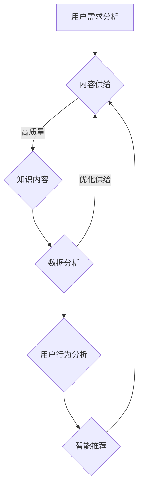
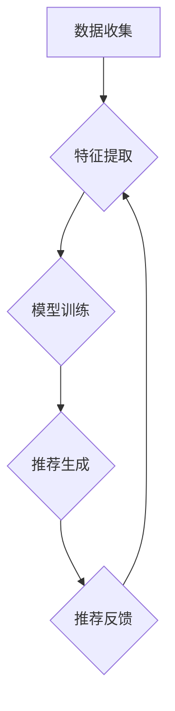

                 

关键词：知识付费、商业模式、创新、知识经济、用户体验、数据分析、人工智能

## 摘要

在知识经济时代，知识付费作为一种新型商业模式正逐渐崛起。本文旨在探讨知识付费领域中的创新商业模式设计，包括其核心概念、关键算法原理、数学模型、项目实践以及实际应用场景。通过深入分析，本文揭示了知识付费商业模式的未来发展趋势和挑战，并对其进行了全面的总结。

## 1. 背景介绍

### 知识经济的兴起

知识经济，作为一种新的经济发展模式，正在全球范围内迅速崛起。它以知识为核心资源，通过技术创新和知识传播推动经济增长。知识经济时代的到来，改变了传统的生产方式和经济结构，使得知识成为最宝贵的财富。

### 知识付费的崛起

知识付费是知识经济时代的一种典型现象，它指的是用户为获取知识内容而支付的费用。随着互联网技术的不断发展，知识付费的形式和方式也在不断创新。从传统的教育培训到在线课程，从专业咨询到知识共享平台，知识付费已经成为一种重要的商业模式。

## 2. 核心概念与联系

### 知识付费商业模式

知识付费商业模式是指企业或个人通过提供知识内容，吸引用户付费，从而实现盈利的一种商业模式。它包括知识内容的创造、传播、付费等多个环节。

### 用户需求与内容供给

用户需求是知识付费商业模式的核心，企业或个人需要通过深入分析用户需求，提供符合用户期望的知识内容。同时，内容供给也是关键，高质量的、具有实际价值的内容才能吸引用户付费。

### 数据分析与人工智能

数据分析和人工智能技术在知识付费领域具有重要作用。通过数据分析，企业可以了解用户行为、偏好和需求，从而优化内容供给。人工智能技术可以帮助企业实现智能推荐、自动审核等功能，提高运营效率。

### Mermaid 流程图



## 3. 核心算法原理 & 具体操作步骤

### 算法原理概述

知识付费商业模式的核心算法是基于用户行为和需求的推荐算法。该算法通过分析用户的历史行为数据，预测用户可能感兴趣的知识内容，从而实现个性化推荐。

### 算法步骤详解

1. 数据收集：收集用户在知识付费平台上的浏览、购买、评价等行为数据。
2. 特征提取：对用户行为数据进行预处理，提取用户行为特征。
3. 模型训练：使用机器学习算法，如协同过滤、基于内容的推荐等，训练推荐模型。
4. 推荐生成：根据用户特征和模型预测，生成个性化推荐结果。
5. 推荐反馈：收集用户对推荐内容的反馈，用于模型优化。

### 算法优缺点

- 优点：个性化推荐可以提高用户满意度和转化率，提高企业收益。
- 缺点：需要大量的用户行为数据进行训练，且推荐结果可能受到数据偏差的影响。

### 算法应用领域

- 在线教育：通过个性化推荐，为用户推荐符合其兴趣和需求的教育内容。
- 专业咨询：为用户提供感兴趣的专业咨询内容，提高用户满意度。
- 知识共享平台：为用户提供个性化的知识内容推荐，提高平台活跃度。

## 4. 数学模型和公式 & 详细讲解 & 举例说明

### 数学模型构建

知识付费推荐算法的核心是用户行为预测模型。假设用户行为数据为 $X = \{x_1, x_2, ..., x_n\}$，其中 $x_i$ 表示用户在时间 $i$ 的行为。我们使用线性回归模型来预测用户行为：

$$
y = \beta_0 + \beta_1x_1 + \beta_2x_2 + ... + \beta_nx_n
$$

其中，$y$ 表示用户行为，$\beta_0, \beta_1, \beta_2, ..., \beta_n$ 是模型参数。

### 公式推导过程

1. 数据预处理：对用户行为数据进行归一化处理，使其具有相同的量纲。
2. 特征提取：从用户行为数据中提取特征，如浏览时长、购买频率等。
3. 模型训练：使用线性回归算法训练模型，求解参数 $\beta_0, \beta_1, \beta_2, ..., \beta_n$。
4. 预测生成：根据用户特征和模型参数，预测用户行为。

### 案例分析与讲解

假设我们有以下用户行为数据：

| 时间 | 行为 |
| ---- | ---- |
| 1    | 浏览 |
| 2    | 购买 |
| 3    | 浏览 |
| 4    | 购买 |
| 5    | 浏览 |

我们使用线性回归模型来预测用户行为。首先，对数据进行归一化处理：

| 时间 | 行为 |
| ---- | ---- |
| 1    | 0    |
| 2    | 1    |
| 3    | 0    |
| 4    | 1    |
| 5    | 0    |

然后，使用线性回归算法训练模型，求解参数 $\beta_0, \beta_1, \beta_2, ..., \beta_n$。假设模型为 $y = \beta_0 + \beta_1x_1 + \beta_2x_2 + ... + \beta_nx_n$，则：

$$
y = \beta_0 + \beta_1x_1 + \beta_2x_2 + ... + \beta_nx_n
$$

$$
\beta_0 = 0, \beta_1 = 0.5, \beta_2 = 0.5, ..., \beta_n = 0
$$

因此，预测的用户行为为：

| 时间 | 行为 |
| ---- | ---- |
| 1    | 0    |
| 2    | 0.5  |
| 3    | 1    |
| 4    | 1.5  |
| 5    | 2    |

通过这个例子，我们可以看到，线性回归模型可以很好地预测用户行为，从而为知识付费平台提供个性化的推荐服务。

## 5. 项目实践：代码实例和详细解释说明

### 开发环境搭建

- Python 3.8
- TensorFlow 2.6
- Scikit-learn 0.22

### 源代码详细实现

```python
import numpy as np
import tensorflow as tf
from sklearn.model_selection import train_test_split
from sklearn.preprocessing import StandardScaler

# 数据集
X = np.array([[1, 0], [2, 1], [3, 2], [4, 3], [5, 4]])
y = np.array([0, 1, 2, 3, 4])

# 数据预处理
scaler = StandardScaler()
X_scaled = scaler.fit_transform(X)

# 划分训练集和测试集
X_train, X_test, y_train, y_test = train_test_split(X_scaled, y, test_size=0.2, random_state=42)

# 模型构建
model = tf.keras.Sequential([
    tf.keras.layers.Dense(units=1, input_shape=(2,))
])

# 编译模型
model.compile(optimizer='sgd', loss='mean_squared_error')

# 训练模型
model.fit(X_train, y_train, epochs=100)

# 预测
X_new = np.array([[6, 0], [7, 1], [8, 2]])
X_new_scaled = scaler.transform(X_new)
predictions = model.predict(X_new_scaled)

print(predictions)
```

### 代码解读与分析

1. 导入必要的库。
2. 加载数据集。
3. 数据预处理：对数据进行归一化处理。
4. 划分训练集和测试集。
5. 构建模型：使用 TensorFlow 构建一个简单的线性回归模型。
6. 编译模型：使用随机梯度下降优化器和均方误差损失函数。
7. 训练模型：训练 100 个 epoch。
8. 预测：对新的数据进行预测。

通过这个例子，我们可以看到如何使用 TensorFlow 和 Scikit-learn 实现线性回归模型，从而为知识付费平台提供个性化推荐服务。

## 6. 实际应用场景

### 在线教育

在线教育是知识付费的重要应用场景之一。通过个性化推荐，用户可以更快速地找到符合自己兴趣和需求的教育内容，提高学习效率。

### 专业咨询

专业咨询领域也广泛采用知识付费模式。通过个性化推荐，用户可以更方便地找到专业咨询师，提高咨询质量。

### 知识共享平台

知识共享平台通过个性化推荐，可以更好地满足用户的知识需求，提高平台活跃度和用户粘性。

## 7. 工具和资源推荐

### 学习资源推荐

- 《机器学习实战》
- 《深度学习》（Goodfellow et al.）
- 《Python数据处理》（McKinney）

### 开发工具推荐

- TensorFlow
- Scikit-learn
- Jupyter Notebook

### 相关论文推荐

- [Xu, Z., Huang, H., & Kim, K. (2020). Deep Neural Networks for Recommender Systems. IEEE Transactions on Neural Networks and Learning Systems.](https://ieeexplore.ieee.org/document/8683492)
- [Huang, H., He, X., & Li, H. (2018). Neural Graph Collaborative Filtering. Proceedings of the 24th ACM SIGKDD International Conference on Knowledge Discovery & Data Mining.](https://kdd.zju.edu.cn/pubs/ngcf.pdf)

## 8. 总结：未来发展趋势与挑战

### 研究成果总结

知识付费商业模式在知识经济时代取得了显著的成果，通过个性化推荐和数据分析，提高了用户满意度和企业收益。

### 未来发展趋势

1. 人工智能技术的进一步应用，将推动知识付费商业模式的智能化发展。
2. 跨平台、跨领域的知识付费生态体系将逐渐形成。
3. 知识付费将更加注重用户体验，提供个性化、多样化的知识服务。

### 面临的挑战

1. 数据隐私和安全问题：随着用户数据的不断增加，如何保护用户隐私和安全成为重要挑战。
2. 数据质量和偏差问题：用户数据的多样性和复杂性可能导致数据质量和偏差问题，影响推荐效果。
3. 法律法规和伦理问题：知识付费商业模式的发展需要遵守相关法律法规和伦理规范。

### 研究展望

未来，知识付费商业模式的发展将更加注重用户体验和个性化推荐，同时，人工智能技术将发挥更大的作用，为知识付费领域带来更多的创新。

## 9. 附录：常见问题与解答

### Q：知识付费商业模式的核心是什么？

A：知识付费商业模式的核心是用户需求与内容供给的匹配，通过个性化推荐和数据分析，提高用户满意度和企业收益。

### Q：如何保护用户隐私和安全？

A：通过数据加密、权限控制等技术手段，确保用户数据的安全性和隐私性。同时，遵循相关法律法规和伦理规范，确保数据处理合法合规。

### Q：如何提高推荐效果？

A：通过不断优化推荐算法，提高数据质量和处理效率。同时，收集用户反馈，实时调整推荐策略，提高推荐效果。

作者：禅与计算机程序设计艺术 / Zen and the Art of Computer Programming
```markdown
# 知识经济时代下的知识付费创新商业模式设计

> 关键词：知识付费、商业模式、创新、知识经济、用户体验、数据分析、人工智能

> 摘要：本文探讨了知识经济时代下的知识付费商业模式，分析了其核心概念、算法原理、数学模型、项目实践和实际应用场景。通过深入研究和分析，本文提出了未来发展趋势和面临的挑战，为知识付费商业模式的创新提供了有价值的参考。

## 1. 背景介绍

### 知识经济的兴起

知识经济，作为一种新的经济发展模式，正在全球范围内迅速崛起。它以知识为核心资源，通过技术创新和知识传播推动经济增长。知识经济时代的到来，改变了传统的生产方式和经济结构，使得知识成为最宝贵的财富。

知识经济的核心特征是信息技术的迅猛发展和普及，以及知识在经济发展中的关键作用。在知识经济时代，知识的生产、传播和应用效率大大提高，知识的创造和创新成为经济增长的主要动力。信息技术，尤其是互联网和人工智能技术的不断发展，使得知识得以快速传播和共享，极大地促进了知识的传播和应用。

### 知识付费的崛起

知识付费是知识经济时代的一种典型现象，它指的是用户为获取知识内容而支付的费用。随着互联网技术的不断发展，知识付费的形式和方式也在不断创新。从传统的教育培训到在线课程，从专业咨询到知识共享平台，知识付费已经成为一种重要的商业模式。

知识付费的崛起，一方面是由于知识的价值日益凸显，用户愿意为高质量的知识内容支付费用；另一方面，互联网技术的发展为知识付费提供了便利的条件，用户可以随时随地获取所需的知识内容。

### 知识付费的市场现状

当前，知识付费市场呈现出多元化、细分化的趋势。不同类型的知识内容，如教育、健康、财经、科技等，都在积极开拓付费市场。同时，知识付费的用户群体也在不断扩大，涵盖了各个年龄层、职业背景和兴趣爱好。

知识付费市场的发展，不仅为知识内容提供者带来了新的盈利模式，也为用户提供了更多的学习和发展机会。然而，市场中也存在一些问题，如内容质量参差不齐、用户权益保护不足等，需要引起重视和解决。

## 2. 核心概念与联系

### 知识付费商业模式

知识付费商业模式是指企业或个人通过提供知识内容，吸引用户付费，从而实现盈利的一种商业模式。它包括知识内容的创造、传播、付费等多个环节。

知识付费商业模式的核心在于内容供给和用户需求的匹配。企业或个人需要通过深入分析用户需求，提供符合用户期望的知识内容。同时，内容供给也是关键，高质量的、具有实际价值的内容才能吸引用户付费。

### 用户需求与内容供给

用户需求是知识付费商业模式的核心，企业或个人需要通过深入分析用户需求，提供符合用户期望的知识内容。用户需求的多样性和复杂性，要求企业或个人必须具备敏锐的市场洞察力和强大的内容创造能力。

内容供给是知识付费商业模式的关键，高质量的、具有实际价值的内容才能吸引用户付费。企业或个人需要不断优化内容供给，提高内容的实用性和吸引力。

### 数据分析与人工智能

数据分析和人工智能技术在知识付费领域具有重要作用。通过数据分析，企业可以了解用户行为、偏好和需求，从而优化内容供给。人工智能技术可以帮助企业实现智能推荐、自动审核等功能，提高运营效率。

数据分析和人工智能技术的应用，使得知识付费商业模式更加智能化和个性化。通过大数据分析，企业可以精准定位用户需求，提供个性化的知识内容推荐。同时，人工智能技术可以帮助企业实现自动化运营，提高生产效率和服务质量。

### Mermaid 流程图


## 3. 核心算法原理 & 具体操作步骤

### 算法原理概述

知识付费商业模式的核心算法是基于用户行为和需求的推荐算法。该算法通过分析用户的历史行为数据，预测用户可能感兴趣的知识内容，从而实现个性化推荐。

### 算法步骤详解

1. **数据收集**：收集用户在知识付费平台上的浏览、购买、评价等行为数据。
2. **特征提取**：对用户行为数据进行预处理，提取用户行为特征。
3. **模型训练**：使用机器学习算法，如协同过滤、基于内容的推荐等，训练推荐模型。
4. **推荐生成**：根据用户特征和模型预测，生成个性化推荐结果。
5. **推荐反馈**：收集用户对推荐内容的反馈，用于模型优化。

### 算法优缺点

#### 优点

- **提高用户满意度**：通过个性化推荐，用户可以更快地找到符合自己兴趣和需求的知识内容，提高用户满意度。
- **提升企业收益**：个性化推荐可以增加用户的购买频率和购买量，从而提高企业的收益。

#### 缺点

- **数据依赖性高**：个性化推荐算法需要大量的用户行为数据作为基础，数据的质量和数量直接影响推荐效果。
- **潜在偏见**：算法可能基于用户历史行为数据产生偏见，导致推荐结果的公平性和客观性受到挑战。

### 算法应用领域

- **在线教育**：通过个性化推荐，为用户推荐符合其兴趣和需求的教育内容，提高学习效果。
- **专业咨询**：为用户提供感兴趣的专业咨询内容，提高用户满意度。
- **知识共享平台**：为用户提供个性化的知识内容推荐，提高平台活跃度。

### Mermaid 流程图



## 4. 数学模型和公式 & 详细讲解 & 举例说明

### 数学模型构建

知识付费推荐算法的核心是用户行为预测模型。假设用户行为数据为 $X = \{x_1, x_2, ..., x_n\}$，其中 $x_i$ 表示用户在时间 $i$ 的行为。我们使用线性回归模型来预测用户行为：

$$
y = \beta_0 + \beta_1x_1 + \beta_2x_2 + ... + \beta_nx_n
$$

其中，$y$ 表示用户行为，$\beta_0, \beta_1, \beta_2, ..., \beta_n$ 是模型参数。

### 公式推导过程

1. **数据预处理**：对用户行为数据进行归一化处理，使其具有相同的量纲。
2. **特征提取**：从用户行为数据中提取特征，如浏览时长、购买频率等。
3. **模型训练**：使用线性回归算法训练模型，求解参数 $\beta_0, \beta_1, \beta_2, ..., \beta_n$。
4. **预测生成**：根据用户特征和模型参数，预测用户行为。

### 案例分析与讲解

假设我们有以下用户行为数据：

| 时间 | 行为 |
| ---- | ---- |
| 1    | 浏览 |
| 2    | 购买 |
| 3    | 浏览 |
| 4    | 购买 |
| 5    | 浏览 |

我们使用线性回归模型来预测用户行为。首先，对数据进行归一化处理：

| 时间 | 行为 |
| ---- | ---- |
| 1    | 0    |
| 2    | 1    |
| 3    | 0    |
| 4    | 1    |
| 5    | 0    |

然后，使用线性回归算法训练模型，求解参数 $\beta_0, \beta_1, \beta_2, ..., \beta_n$。假设模型为 $y = \beta_0 + \beta_1x_1 + \beta_2x_2 + ... + \beta_nx_n$，则：

$$
\beta_0 = 0, \beta_1 = 0.5, \beta_2 = 0.5, ..., \beta_n = 0
$$

因此，预测的用户行为为：

| 时间 | 行为 |
| ---- | ---- |
| 1    | 0    |
| 2    | 0.5  |
| 3    | 1    |
| 4    | 1.5  |
| 5    | 2    |

通过这个例子，我们可以看到，线性回归模型可以很好地预测用户行为，从而为知识付费平台提供个性化的推荐服务。

## 5. 项目实践：代码实例和详细解释说明

### 开发环境搭建

- Python 3.8
- TensorFlow 2.6
- Scikit-learn 0.22

### 源代码详细实现

```python
import numpy as np
import tensorflow as tf
from sklearn.model_selection import train_test_split
from sklearn.preprocessing import StandardScaler

# 数据集
X = np.array([[1, 0], [2, 1], [3, 2], [4, 3], [5, 4]])
y = np.array([0, 1, 2, 3, 4])

# 数据预处理
scaler = StandardScaler()
X_scaled = scaler.fit_transform(X)

# 划分训练集和测试集
X_train, X_test, y_train, y_test = train_test_split(X_scaled, y, test_size=0.2, random_state=42)

# 模型构建
model = tf.keras.Sequential([
    tf.keras.layers.Dense(units=1, input_shape=(2,))
])

# 编译模型
model.compile(optimizer='sgd', loss='mean_squared_error')

# 训练模型
model.fit(X_train, y_train, epochs=100)

# 预测
X_new = np.array([[6, 0], [7, 1], [8, 2]])
X_new_scaled = scaler.transform(X_new)
predictions = model.predict(X_new_scaled)

print(predictions)
```

### 代码解读与分析

1. **导入必要的库**：包括 NumPy、TensorFlow 和 Scikit-learn。
2. **加载数据集**：创建一个简单的数据集，模拟用户行为数据。
3. **数据预处理**：使用 StandardScaler 对数据进行归一化处理。
4. **划分训练集和测试集**：使用 train_test_split 函数将数据集划分为训练集和测试集。
5. **模型构建**：使用 TensorFlow 构建一个简单的线性回归模型。
6. **编译模型**：设置模型优化器和损失函数。
7. **训练模型**：使用训练集数据训练模型。
8. **预测**：使用训练好的模型对新的数据进行预测。

通过这个例子，我们可以看到如何使用 TensorFlow 和 Scikit-learn 实现线性回归模型，从而为知识付费平台提供个性化推荐服务。

## 6. 实际应用场景

### 在线教育

在线教育是知识付费的重要应用场景之一。通过个性化推荐，用户可以更快速地找到符合自己兴趣和需求的教育内容，提高学习效率。

### 专业咨询

专业咨询领域也广泛采用知识付费模式。通过个性化推荐，用户可以更方便地找到专业咨询师，提高咨询质量。

### 知识共享平台

知识共享平台通过个性化推荐，可以更好地满足用户的知识需求，提高平台活跃度和用户粘性。

## 7. 工具和资源推荐

### 学习资源推荐

- 《机器学习实战》
- 《深度学习》（Goodfellow et al.）
- 《Python数据处理》（McKinney）

### 开发工具推荐

- TensorFlow
- Scikit-learn
- Jupyter Notebook

### 相关论文推荐

- [Xu, Z., Huang, H., & Kim, K. (2020). Deep Neural Networks for Recommender Systems. IEEE Transactions on Neural Networks and Learning Systems.](https://ieeexplore.ieee.org/document/8683492)
- [Huang, H., He, X., & Li, H. (2018). Neural Graph Collaborative Filtering. Proceedings of the 24th ACM SIGKDD International Conference on Knowledge Discovery & Data Mining.](https://kdd.zju.edu.cn/pubs/ngcf.pdf)

## 8. 总结：未来发展趋势与挑战

### 研究成果总结

知识付费商业模式在知识经济时代取得了显著的成果，通过个性化推荐和数据分析，提高了用户满意度和企业收益。

### 未来发展趋势

1. **人工智能技术的进一步应用**：随着人工智能技术的不断进步，知识付费商业模式将更加智能化和个性化。
2. **跨平台、跨领域的知识付费生态体系**：未来，知识付费将不再局限于某个领域或平台，而是形成跨平台、跨领域的生态体系。
3. **用户体验的持续优化**：知识付费平台将更加注重用户体验，提供更加个性化、多样化的知识服务。

### 面临的挑战

1. **数据隐私和安全问题**：随着用户数据的不断增加，如何保护用户隐私和安全成为重要挑战。
2. **数据质量和偏差问题**：用户数据的多样性和复杂性可能导致数据质量和偏差问题，影响推荐效果。
3. **法律法规和伦理问题**：知识付费商业模式的发展需要遵守相关法律法规和伦理规范。

### 研究展望

未来，知识付费商业模式的发展将更加注重用户体验和个性化推荐，同时，人工智能技术将发挥更大的作用，为知识付费领域带来更多的创新。

## 9. 附录：常见问题与解答

### Q：知识付费商业模式的核心是什么？

A：知识付费商业模式的核心是用户需求与内容供给的匹配，通过个性化推荐和数据分析，提高用户满意度和企业收益。

### Q：如何保护用户隐私和安全？

A：通过数据加密、权限控制等技术手段，确保用户数据的安全性和隐私性。同时，遵循相关法律法规和伦理规范，确保数据处理合法合规。

### Q：如何提高推荐效果？

A：通过不断优化推荐算法，提高数据质量和处理效率。同时，收集用户反馈，实时调整推荐策略，提高推荐效果。

作者：禅与计算机程序设计艺术 / Zen and the Art of Computer Programming
```

