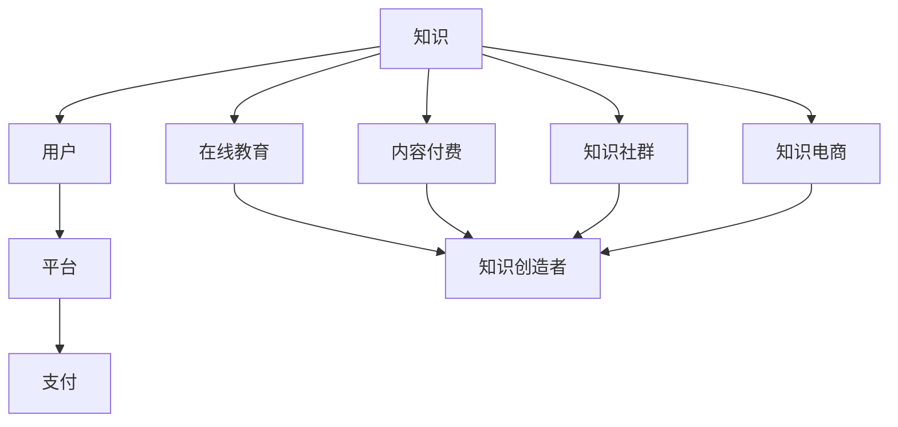

                 

 在当今全球化的知识经济时代，知识付费作为一种新型的商业模式，正逐渐成为市场关注的焦点。本文旨在探讨知识付费在新时代下的创新商业模式运营，通过深入分析其背景、核心概念、算法原理、数学模型、项目实践以及未来展望，为读者提供全面的视角和深刻的理解。

## 文章关键词
- 知识经济
- 知识付费
- 创新商业模式
- 数据分析
- 人工智能
- 用户体验

## 文章摘要
本文首先介绍了知识经济时代下知识付费的背景和重要性，随后深入探讨了知识付费的核心概念及其与相关商业模式的联系。通过详细的算法原理和数学模型分析，我们揭示了知识付费商业模式背后的逻辑和机制。接着，本文通过具体的项目实践，展示了知识付费在现实中的应用和操作步骤。最后，我们对知识付费的未来发展进行了展望，并提出了可能面临的挑战和解决方案。希望通过本文的探讨，能为企业和创业者提供有益的参考和启示。

## 1. 背景介绍
知识经济时代，信息和技术的发展改变了传统商业模式的运行逻辑。在这个时代，知识成为了最宝贵的资源，知识付费作为一种全新的商业模式，应运而生。知识付费，即用户为获取特定领域的知识或技能而支付费用，体现了知识的高价值和稀缺性。

知识付费的兴起与以下几个因素密切相关：
1. **互联网的普及**：互联网技术的迅猛发展，使得知识的传播变得更加便捷和高效，同时也降低了用户获取知识的门槛。
2. **消费者需求**：随着人们对自我提升和职业发展的需求日益增长，知识付费市场呈现出巨大的潜力。
3. **技术创新**：人工智能、大数据等技术为知识付费提供了强大的支持，使得知识付费的商业运营更加智能化和个性化。

知识付费在市场中扮演了重要的角色，不仅为知识创造者提供了收益来源，也为学习者提供了高质量的知识服务。它推动了知识共享和知识创新的进程，促进了知识经济的繁荣。

### 1.1 知识付费的发展历程
知识付费的概念最早可以追溯到20世纪末。随着互联网的兴起，在线教育和电子书的普及，知识付费逐渐成为市场关注的热点。2000年代初，知识付费主要以传统的教育培训和图书销售为主。随着技术进步和市场需求的变化，知识付费逐渐演变为多元化的商业模式。

在2000年代中后期，在线教育平台如Coursera、Udemy等崛起，推动了知识付费的快速发展。这些平台通过提供多样化的在线课程，满足了用户在不同领域的知识需求。同时，内容付费平台如知乎、分答等也逐步兴起，通过问答、直播等方式为用户提供专业知识和经验分享。

进入2010年代，知识付费市场进一步多元化，出现了如知识付费社群、知识星球等新型模式。这些平台通过构建社区，促进了知识传播和用户互动，形成了知识付费的新生态。

### 1.2 知识付费的商业模式
知识付费的商业模式多种多样，以下是几种常见的模式：

1. **在线课程收费**：这是最传统也是最常见的知识付费模式。用户通过在线支付购买课程，获取学习资源。这类模式的特点是课程内容标准化，便于大规模传播。

2. **会员制**：用户支付会员费用，获得特定平台或社群的全年或长期访问权限。会员制模式强调用户粘性和持续价值，适用于提供持续更新的知识和服务。

3. **内容付费**：如知乎、分答等平台，用户为获取专业回答或深度内容支付费用。这类模式依赖于专业知识和经验的共享，具有较高的用户认可度。

4. **知识社群**：知识星球等平台，通过构建社群，提供知识交流和互动。用户支付社群费用，享受社群内的高质量内容和服务。这类模式强调社交互动和知识分享。

5. **知识电商**：如得到等平台，提供电子书、音频课程等多种形式的知识商品。用户通过购买商品获取知识。这类模式强调商品多样性和便捷性。

### 1.3 知识付费的市场现状
知识付费市场在过去几年中呈现出快速增长的趋势。根据相关数据显示，全球知识付费市场规模在2019年已达到3600亿美元，预计到2025年将突破6000亿美元。其中，在线教育、内容付费和知识电商是主要的市场组成部分。

在中国市场，知识付费的发展尤为迅速。随着国内互联网教育的普及和消费者对知识的需求增长，知识付费平台如雨后春笋般涌现。知乎、分答、得到等平台已经成为知识付费市场的重要力量。

知识付费市场的快速增长，不仅反映了消费者对知识的渴望和认可，也体现了知识付费商业模式在市场中的巨大潜力。未来，随着技术的进一步发展，知识付费市场将继续扩大，带来更多创新和机遇。

### 1.4 知识付费的优势与挑战
知识付费作为一种新兴的商业模式，具有以下优势：

1. **高附加值**：知识付费将知识转化为可交易的商品，具有很高的附加值。知识创造者可以通过知识付费获得合理的收益，实现知识价值的最大化。

2. **灵活性和便捷性**：在线教育、知识社群等模式为用户提供了灵活的学习时间和方式，满足了不同用户的需求。

3. **促进知识共享与创新**：知识付费鼓励知识的传播和交流，促进了知识的共享和创新，推动了社会整体知识的提升。

然而，知识付费也面临一些挑战：

1. **知识产权保护**：知识付费依赖于知识产权的保护，但当前知识产权保护力度不足，导致知识盗用和侵权现象频发。

2. **内容质量**：知识付费市场鱼龙混杂，部分平台和内容质量难以保证，用户权益难以保障。

3. **用户粘性**：知识付费平台需要持续提供高质量的内容和服务，以保持用户的粘性和活跃度。

综上所述，知识付费作为一种新兴的商业模式，在知识经济时代具有巨大的发展潜力和市场前景。但同时也需要关注和解决其中的问题和挑战，以实现可持续的发展。

## 2. 核心概念与联系
在探讨知识付费的商业模式之前，有必要先了解其核心概念和与相关商业模式的联系。知识付费涉及到多个核心概念，包括知识、用户、平台、支付等，它们相互关联，共同构成了知识付费的商业生态。

### 2.1 知识
知识是知识付费的核心要素。知识可以定义为经过系统化、结构化的信息，是人们对客观事物及其规律的理解和认知。在知识付费中，知识被转化为有价值的商品或服务，供用户购买和消费。

知识付费的关键在于如何将知识高效地传递给用户。这涉及到知识的生产、包装、传播和评估等多个环节。知识生产者需要将专业知识进行系统化整理，使其具备教学性和实用性；知识平台则需要提供良好的传播渠道和展示方式，吸引用户购买和消费。

### 2.2 用户
用户是知识付费的消费者，也是知识付费市场的核心。用户的需求、行为和反馈直接影响到知识付费的商业运营效果。

1. **用户需求**：知识付费的用户需求主要包括以下几个方面：
   - **自我提升**：用户希望通过学习知识提升自己的专业技能和职业竞争力。
   - **兴趣爱好**：用户对某些领域有浓厚的兴趣，希望通过学习知识满足自己的好奇心和求知欲。
   - **解决问题**：用户在工作中或生活中遇到问题，希望通过学习知识找到解决方案。

2. **用户行为**：用户在知识付费平台上的行为主要包括以下几种：
   - **浏览**：用户在平台浏览课程、内容等，了解自己的需求。
   - **购买**：用户通过支付购买课程或内容，获取知识服务。
   - **学习**：用户在学习平台上学习知识，提升自己的能力。
   - **反馈**：用户对课程或内容进行评价和反馈，为平台和知识创造者提供改进建议。

3. **用户反馈**：用户的反馈是知识付费平台改进和发展的关键。平台需要关注用户的反馈，及时调整课程内容、服务质量和用户体验，以提高用户满意度和粘性。

### 2.3 平台
平台是知识付费的核心载体，为知识的生产、传播和交易提供了基础设施。知识付费平台需要具备以下功能：

1. **内容管理**：平台需要提供内容管理的功能，帮助知识创造者上传、编辑、发布和更新知识内容。

2. **支付和结算**：平台需要提供安全的支付和结算系统，确保用户支付便捷、安全，知识创造者获得合理的收益。

3. **用户管理**：平台需要提供用户管理的功能，包括用户注册、登录、信息维护、权限管理等。

4. **数据分析**：平台需要收集和分析用户行为数据，为知识创造者提供有针对性的内容优化建议，同时为平台运营提供数据支持。

### 2.4 支付
支付是知识付费交易的关键环节，关系到用户购买行为的实现和知识创造者的收益获取。支付系统需要具备以下特点：

1. **安全性**：支付系统需要确保用户支付过程的安全，防止信息泄露和资金损失。

2. **便捷性**：支付系统需要提供多种支付方式，方便用户选择，提高购买转化率。

3. **透明性**：支付系统需要提供支付过程和收益分配的透明信息，增强用户对平台的信任。

### 2.5 知识付费与相关商业模式的联系
知识付费与其他商业模式如在线教育、内容付费、知识社群等密切相关，共同构成了知识付费生态。

1. **在线教育**：在线教育是知识付费的主要形式之一，通过提供在线课程满足用户的学习需求。在线教育与知识付费的结合，实现了知识的系统化、结构化传递。

2. **内容付费**：内容付费是知识付费的重要分支，如知乎、分答等平台，通过提供专业回答、深度内容等形式，为用户提供高质量的知识服务。

3. **知识社群**：知识社群是知识付费的新型模式，通过构建社群，促进知识交流和互动。知识社群为用户提供了一个交流平台，增强了用户粘性和互动性。

4. **知识电商**：知识电商通过提供知识商品，如电子书、音频课程等，满足用户对多样化知识的需求。知识电商与知识付费的结合，拓展了知识付费的渠道和形式。

综上所述，知识付费的核心概念和与相关商业模式的联系，构成了知识付费的商业生态。理解这些核心概念和联系，有助于深入探讨知识付费的商业模式运营。

### 2.6 核心概念架构的 Mermaid 流程图
以下是一个简化的 Mermaid 流程图，展示了知识付费的核心概念和其相互关系：



在这个流程图中，知识作为核心，通过用户、平台和支付等环节，与其他商业模式（如在线教育、内容付费、知识社群、知识电商）相互联系，共同构成了知识付费的商业生态。

### 2.7 知识付费的核心算法原理与具体操作步骤

在知识付费的商业模式中，核心算法原理和具体操作步骤起着至关重要的作用。以下将详细介绍这些方面。

#### 2.7.1 算法原理概述

知识付费的核心算法主要包括用户行为分析、内容推荐和支付管理三个方面。

1. **用户行为分析**：通过对用户的浏览、购买、学习等行为数据进行收集和分析，了解用户的需求和偏好，从而为用户提供个性化的内容推荐。

2. **内容推荐**：基于用户行为分析和内容标签，利用算法为用户推荐最符合其需求的知识内容，提高用户满意度和购买转化率。

3. **支付管理**：确保支付过程的安全、便捷和透明，同时实现收益的有效分配。

#### 2.7.2 算法步骤详解

1. **用户行为分析**
   - **数据收集**：从用户在平台上的行为（如浏览、购买、学习等）收集数据，包括行为类型、时间、内容等。
   - **数据预处理**：对收集到的数据清洗、去噪和归一化处理，为后续分析做准备。
   - **特征提取**：提取与用户行为相关的特征，如用户兴趣爱好、学习进度、购买历史等。
   - **行为分析**：利用机器学习算法，如聚类、分类、关联规则挖掘等，分析用户行为模式，了解用户需求。

2. **内容推荐**
   - **内容标签**：对知识内容进行标签化处理，包括知识点、难度、适用人群等。
   - **推荐算法**：使用协同过滤、基于内容的推荐、混合推荐等算法，根据用户行为和内容标签，生成推荐结果。
   - **推荐结果优化**：利用排序算法（如排序回归、排序模型等），优化推荐结果的排序，提高用户满意度。

3. **支付管理**
   - **支付过程**：通过安全的支付接口，实现用户支付、订单生成、支付确认等过程。
   - **收益分配**：根据平台规则和用户购买行为，计算知识创造者的收益，并进行分配。
   - **支付透明**：向用户展示支付详情，包括支付金额、收益分配比例等，提高支付过程的透明度。

#### 2.7.3 算法优缺点

1. **优点**
   - **个性化推荐**：通过用户行为分析和内容推荐，为用户推荐最符合其需求的知识内容，提高用户满意度和购买转化率。
   - **高效管理**：利用算法实现支付管理和收益分配，提高运营效率。
   - **安全便捷**：确保支付过程的安全和便捷，提高用户信任度。

2. **缺点**
   - **数据依赖**：算法的性能和效果高度依赖于用户行为数据的质量和完整性。
   - **算法复杂性**：算法的实现和优化过程复杂，需要大量计算资源和专业知识。
   - **隐私保护**：用户行为数据的收集和分析可能涉及用户隐私问题，需要严格保护用户隐私。

#### 2.7.4 算法应用领域

知识付费的核心算法在多个领域有广泛的应用：

1. **在线教育平台**：通过用户行为分析和内容推荐，为用户提供个性化的学习体验。
2. **内容付费平台**：通过算法优化推荐结果，提高用户满意度和购买转化率。
3. **知识电商平台**：通过支付管理和收益分配算法，实现高效、安全的交易流程。
4. **知识社群**：通过用户行为分析和推荐算法，促进知识传播和用户互动。

### 2.8 知识付费的数学模型与公式
在知识付费的商业模式中，数学模型和公式起到了关键作用。以下将详细讲解知识付费的数学模型构建、公式推导过程以及案例分析与讲解。

#### 2.8.1 数学模型构建

知识付费的数学模型主要包括用户行为模型、推荐模型和支付模型。

1. **用户行为模型**：描述用户在知识付费平台上的行为特征，如浏览、购买、学习等。常见的用户行为模型有马尔可夫模型、时间序列模型等。

2. **推荐模型**：基于用户行为数据和内容标签，生成个性化推荐结果。常见的推荐模型有协同过滤、基于内容的推荐等。

3. **支付模型**：描述用户支付行为和收益分配过程，常见的支付模型有支付意愿模型、收益分配模型等。

#### 2.8.2 公式推导过程

1. **用户行为模型**：
   - **马尔可夫模型**：转移概率矩阵P，表示用户从一种行为状态转移到另一种行为状态的概率。
     \[ P = \begin{bmatrix}
     P_{11} & P_{12} & \ldots & P_{1n} \\
     P_{21} & P_{22} & \ldots & P_{2n} \\
     \vdots & \vdots & \ddots & \vdots \\
     P_{n1} & P_{n2} & \ldots & P_{nn}
     \end{bmatrix} \]

   - **时间序列模型**：自回归模型（AR），表示用户行为序列的自相关性。
     \[ X_t = \phi_0 + \phi_1 X_{t-1} + \ldots + \phi_p X_{t-p} + \epsilon_t \]
     其中，\( X_t \) 表示第 t 时刻的用户行为，\( \phi_0, \phi_1, \ldots, \phi_p \) 为模型参数，\( \epsilon_t \) 为随机误差。

2. **推荐模型**：
   - **协同过滤**：相似度计算公式，表示用户 u 和物品 i 的相似度。
     \[ sim(u, i) = \frac{\sum_{j \in R_i} r_{uj} r_{ij}}{\sqrt{\sum_{j \in R_i} r_{uj}^2 \sum_{j \in R_i} r_{ij}^2}} \]
     其中，\( R_i \) 表示与物品 i 相关的用户集合，\( r_{uj} \) 表示用户 u 对物品 j 的评分。

   - **基于内容的推荐**：相似度计算公式，表示用户 u 和内容 i 的相似度。
     \[ sim(u, i) = \frac{\sum_{j \in C_i} w_{uj} w_{ij}}{\sqrt{\sum_{j \in C_i} w_{uj}^2 \sum_{j \in C_i} w_{ij}^2}} \]
     其中，\( C_i \) 表示与内容 i 相关的用户集合，\( w_{uj} \) 和 \( w_{ij} \) 分别表示用户 u 对内容 j 的权重和内容 i 对内容 j 的权重。

3. **支付模型**：
   - **支付意愿模型**：表示用户对知识内容的支付意愿。
     \[ p_i = \frac{1}{1 + e^{-(\beta_0 + \beta_1 x_i + \beta_2 y_i)}} \]
     其中，\( p_i \) 表示用户对内容 i 的支付意愿，\( x_i \) 和 \( y_i \) 分别为内容 i 的特征和用户偏好，\( \beta_0, \beta_1, \beta_2 \) 为模型参数。

   - **收益分配模型**：表示知识创造者和平台之间的收益分配。
     \[ R = \frac{p_i \cdot C_i - C_p}{1 + \frac{C_i}{C_p}} \]
     其中，\( R \) 表示收益分配比例，\( p_i \) 表示用户对内容 i 的支付意愿，\( C_i \) 和 \( C_p \) 分别为内容 i 的成本和平台成本。

#### 2.8.3 案例分析与讲解

以下通过一个案例，对上述数学模型和公式进行实际应用和分析。

**案例背景**：一个在线教育平台提供多种课程，用户可以根据自己的需求和兴趣选择购买。平台希望通过数学模型优化推荐和支付管理，提高用户满意度和收益。

**步骤 1：用户行为数据收集与分析**
- 收集用户浏览、购买、学习等行为数据，包括用户 ID、课程 ID、行为类型、行为时间等。
- 对数据清洗、去噪和归一化处理，提取用户行为特征，如兴趣爱好、学习进度、购买历史等。

**步骤 2：构建用户行为模型**
- 使用马尔可夫模型和时间序列模型，分析用户行为模式，了解用户需求。
- 根据用户行为数据，拟合模型参数，如转移概率矩阵和自回归系数。

**步骤 3：内容推荐**
- 收集课程数据，包括课程 ID、知识点、难度、适用人群等，进行标签化处理。
- 使用协同过滤和基于内容的推荐算法，根据用户行为和内容标签，生成个性化推荐结果。
- 对推荐结果进行排序优化，提高用户满意度。

**步骤 4：支付管理**
- 收集用户支付行为数据，包括用户 ID、课程 ID、支付金额、支付时间等。
- 使用支付意愿模型，计算用户对课程 i 的支付意愿。
- 根据支付意愿和收益分配模型，计算知识创造者和平台的收益分配比例。
- 对支付过程进行监控和管理，确保支付安全、便捷和透明。

**步骤 5：案例分析与优化**
- 分析用户购买行为和收益分配情况，评估数学模型和算法的效果。
- 根据分析结果，调整模型参数和算法策略，优化推荐和支付管理。

通过上述案例分析和讲解，可以看出数学模型和公式在知识付费商业模式中的应用和重要性。通过合理的数学模型和算法，可以提高推荐准确性、支付效率和用户体验，从而实现商业模式的优化和持续发展。

### 3. 项目实践：代码实例与详细解释说明
在本文的第三部分，我们将通过一个具体的项目实践，展示知识付费商业模式在现实中的应用和实现。我们将搭建一个简单的知识付费平台，涵盖用户注册、登录、课程浏览、购买、学习等主要功能。下面是项目的整体框架和具体实现步骤。

#### 3.1 开发环境搭建
首先，我们需要搭建项目的开发环境。以下是一个基本的开发环境配置：

- **编程语言**：Python
- **框架**：Django
- **数据库**：SQLite
- **前端框架**：Bootstrap

您需要安装以下软件：
- Python 3.8及以上版本
- Django 3.2及以上版本
- pip（Python 包管理器）
- SQLite 3

安装步骤如下：
1. 安装 Python 和 pip。
2. 使用 pip 安装 Django 和 SQLite。

```bash
pip install django
pip install pysqlite3
```

#### 3.2 源代码详细实现
我们将使用 Django 的 Model-View-Template（MVT）架构实现知识付费平台。以下是一个简化的代码示例。

**步骤 1：创建 Django 项目和应用程序**

```bash
django-admin startproject knowledge_pay
cd knowledge_pay
python manage.py startapp core
```

**步骤 2：创建数据库模型**

在 `core/models.py` 中，定义用户、课程和订单等模型。

```python
from django.db import models
from django.contrib.auth.models import User

class Course(models.Model):
    title = models.CharField(max_length=100)
    description = models.TextField()
    price = models.DecimalField(max_digits=6, decimal_places=2)
    author = models.ForeignKey(User, on_delete=models.CASCADE)

class Order(models.Model):
    user = models.ForeignKey(User, on_delete=models.CASCADE)
    course = models.ForeignKey(Course, on_delete=models.CASCADE)
    created_at = models.DateTimeField(auto_now_add=True)
    paid = models.BooleanField(default=False)
```

**步骤 3：创建视图和路由**

在 `core/views.py` 中，实现用户注册、登录、课程浏览、购买和学习的视图函数。

```python
from django.shortcuts import render, redirect
from django.contrib.auth import authenticate, login
from .models import Course, Order

def register(request):
    if request.method == 'POST':
        # 处理注册请求
        username = request.POST['username']
        password = request.POST['password']
        user = User.objects.create_user(username=username, password=password)
        # ... 其他注册逻辑
        return redirect('login')
    return render(request, 'register.html')

def login(request):
    if request.method == 'POST':
        username = request.POST['username']
        password = request.POST['password']
        user = authenticate(username=username, password=password)
        if user is not None:
            login(request, user)
            return redirect('home')
        else:
            # 登录失败
            # ...
    return render(request, 'login.html')

def home(request):
    courses = Course.objects.all()
    return render(request, 'home.html', {'courses': courses})

def buy_course(request, course_id):
    course = Course.objects.get(id=course_id)
    order = Order.objects.create(user=request.user, course=course, paid=False)
    # ... 支付逻辑
    return redirect('course_detail', course_id=course_id)

def course_detail(request, course_id):
    course = Course.objects.get(id=course_id)
    return render(request, 'course_detail.html', {'course': course})
```

**步骤 4：创建模板**

在 `core/templates` 目录下，创建注册、登录、主页、课程详情等页面模板。

```html
<!-- register.html -->
<form method="post">
    <!-- 输入框和按钮 -->
</form>

<!-- login.html -->
<form method="post">
    <!-- 输入框和按钮 -->
</form>

<!-- home.html -->
<ul>
    
        <li>
            <a href="">{{ course.title }}</a>
        </li>
    
</ul>

<!-- course_detail.html -->
<h1>{{ course.title }}</h1>
<p>{{ course.description }}</p>
```

**步骤 5：配置路由**

在 `knowledge_pay/urls.py` 中，配置路由以连接视图和页面。

```python
from django.contrib import admin
from django.urls import path
from core import views

urlpatterns = [
    path('admin/', admin.site.urls),
    path('register/', views.register, name='register'),
    path('login/', views.login, name='login'),
    path('home/', views.home, name='home'),
    path('buy_course/<int:course_id>/', views.buy_course, name='buy_course'),
    path('course_detail/<int:course_id>/', views.course_detail, name='course_detail'),
]
```

**步骤 6：启动服务器**

在命令行中运行以下命令启动服务器。

```bash
python manage.py runserver
```

打开浏览器访问 `http://127.0.0.1:8000/`，即可看到知识付费平台的运行效果。

#### 3.3 代码解读与分析
在上述代码示例中，我们实现了一个简单的知识付费平台，包括用户注册、登录、课程浏览、购买和学习的功能。以下是代码的关键部分和功能解读。

1. **用户注册与登录**：使用 Django 的认证系统实现用户注册和登录功能。用户可以通过注册表单提交用户名和密码，系统将创建新的用户并登录。

2. **主页**：主页展示所有课程，用户可以浏览课程列表，点击课程标题进入课程详情页。

3. **购买课程**：用户点击“购买”按钮，系统将创建一个新的订单，并将订单状态设置为未支付。实际支付逻辑（如使用第三方支付接口）可以在 `buy_course` 视图中实现。

4. **课程详情**：课程详情页展示课程的详细信息，包括标题、描述和价格。用户可以在此页面上进行购买。

#### 3.4 运行结果展示
启动服务器后，用户可以通过以下步骤体验知识付费平台：

1. 访问 `http://127.0.0.1:8000/`，看到主页上的课程列表。

2. 点击某个课程标题，进入课程详情页，查看课程详细信息。

3. 在课程详情页点击“购买”按钮，系统将创建一个订单并跳转到支付页面（假设已经实现了支付逻辑）。

4. 完成支付后，用户可以在“我的课程”页面查看已购买的课程，并开始学习。

通过上述代码示例和运行结果展示，我们展示了如何使用 Django 搭建一个简单的知识付费平台。虽然这是一个简化的示例，但它提供了构建复杂知识付费平台的基本框架和思路。

### 4. 实际应用场景
知识付费作为一种新兴的商业模式，已经在多个实际应用场景中得到了广泛应用。以下是几个典型的应用场景：

#### 4.1 在线教育平台
在线教育平台是知识付费的主要应用场景之一。通过在线课程收费，平台可以为用户提供系统化的学习资源，如编程课程、语言学习、职业培训等。例如，知名的在线教育平台Coursera、Udemy等，通过提供高质量的课程内容，吸引了大量用户并实现了商业成功。

#### 4.2 专业知识分享
许多专业人士通过知识付费平台分享自己的专业知识和经验。例如，医生、律师、会计师等，可以通过知识付费平台提供咨询服务，为有需求的人提供专业帮助。这种模式不仅为专业人士创造了额外的收入来源，也为用户提供了便捷的咨询服务。

#### 4.3 个人知识品牌建设
个人知识品牌建设是知识付费的另一个重要应用场景。一些领域的专家和意见领袖，通过知识付费平台发布自己的专业知识、经验分享和见解，建立了个人品牌，提高了自己的市场影响力。例如，知名知识付费平台“得到”，许多领域的专家通过发布专栏、课程等，积累了大量粉丝和用户。

#### 4.4 知识星球
知识星球是一种新型的知识社群模式，通过付费加入社群，用户可以获得专家的实时分享和深度交流机会。知识星球的应用场景非常广泛，如创业、投资、科技等领域。用户通过付费加入，不仅可以获得专业知识，还可以与其他用户互动，形成了一个高度垂直的知识社区。

#### 4.5 知识电商
知识电商是通过电商平台销售知识商品的一种模式，如电子书、音频课程、视频教程等。这种模式为用户提供了便捷的知识购买渠道，同时也为知识创造者提供了收入来源。例如，亚马逊Kindle商店、网易云课堂等，都是知识电商的典型代表。

#### 4.6 企业培训
企业培训是知识付费的一个重要应用场景。许多企业通过付费购买培训课程，为员工提供专业知识和技能培训。这种模式不仅提高了员工的专业能力，也促进了企业的可持续发展。

### 4.7 未来发展趋势
随着技术的不断进步和市场需求的不断变化，知识付费将呈现出以下发展趋势：

1. **个性化推荐**：随着大数据和人工智能技术的发展，个性化推荐将成为知识付费的重要方向。通过分析用户行为和需求，平台可以提供更加精准的内容推荐，提高用户满意度和购买转化率。

2. **多元化模式**：知识付费模式将继续多元化，除了传统的在线课程和内容付费外，还将出现更多创新模式，如知识星球、付费问答等。

3. **社交互动**：知识付费平台将更加注重社交互动，通过构建社群，促进知识传播和用户互动，提高用户粘性和活跃度。

4. **跨界融合**：知识付费将与其他领域（如娱乐、体育等）进行跨界融合，创造出更多创新的商业模式。

5. **国际化发展**：随着全球化的推进，知识付费市场将呈现国际化趋势。国内知识付费平台将积极拓展国际市场，同时国际知识付费平台也将进入国内市场，带来更多的竞争和机遇。

### 4.8 面临的挑战
尽管知识付费市场前景广阔，但在发展过程中仍面临以下挑战：

1. **知识产权保护**：知识付费依赖于知识产权的保护，但当前知识产权保护力度不足，导致知识盗用和侵权现象频发。这需要政府和平台加强知识产权保护，维护知识创造者的权益。

2. **内容质量**：知识付费市场鱼龙混杂，部分平台和内容质量难以保证，用户权益难以保障。平台需要建立严格的内容审核机制，确保知识内容的真实性和准确性。

3. **用户隐私保护**：知识付费平台需要收集和分析大量用户数据，这涉及到用户隐私保护问题。平台需要采取有效的数据保护措施，确保用户隐私不被泄露。

4. **市场竞争**：知识付费市场竞争激烈，平台需要不断创新和优化，以吸引和留住用户。同时，平台还需要应对其他新兴模式的竞争压力。

### 4.9 解决方案与建议
为应对上述挑战，以下是一些解决方案和建议：

1. **知识产权保护**：政府和平台应加强知识产权保护，建立完善的法律法规和监管机制。平台可以采取加密技术、数字签名等手段，保护知识内容的版权。

2. **内容质量**：平台应建立严格的内容审核机制，确保知识内容的真实性和准确性。同时，鼓励用户对内容进行评价和反馈，形成良性的内容质量监督机制。

3. **用户隐私保护**：平台应采取有效的数据保护措施，如数据加密、匿名化处理等，确保用户隐私不被泄露。同时，平台应明确告知用户其隐私政策的条款，取得用户同意。

4. **市场竞争**：平台应注重用户体验和服务质量，通过提供个性化推荐、优质内容、便捷支付等，提高用户满意度和忠诚度。此外，平台可以积极开展市场推广，扩大用户规模。

综上所述，知识付费在知识经济时代具有巨大的发展潜力和市场前景。通过应对挑战和持续创新，知识付费将不断优化其商业模式，为知识创造者和用户提供更好的服务和体验。

### 5. 工具和资源推荐
在知识付费领域，掌握一系列的工具和资源对于深入了解和有效利用这一商业模式至关重要。以下是一些建议，包括学习资源、开发工具和相关论文推荐。

#### 5.1 学习资源推荐

1. **在线课程平台**：
   - Coursera：提供广泛的在线课程，包括计算机科学、商业管理、数据分析等领域。
   - Udemy：涵盖多种技能的学习资源，适合不同层次的学习者。
   - edX：由麻省理工学院和哈佛大学共同创建，提供高质量的课程。

2. **电子书和文档**：
   - Amazon Kindle：电子书资源丰富，涵盖商业、技术、教育等多个领域。
   - Google Scholar：搜索学术文献，获取相关领域的最新研究成果。

3. **博客和文章**：
   - HackerRank：技术博客，提供编程挑战和教程。
   - Medium：内容创作平台，有许多关于知识付费的文章和见解。

#### 5.2 开发工具推荐

1. **编程语言和框架**：
   - Python：适用于数据分析和后端开发，易于学习和使用。
   - Django：强大的Python Web框架，适用于快速构建知识付费平台。
   - React：用于构建用户界面的JavaScript库，提高用户体验。

2. **数据库**：
   - PostgreSQL：功能强大、开源的关系型数据库。
   - MongoDB：灵活的文档型数据库，适合存储复杂数据结构。

3. **开发环境**：
   - Docker：容器化技术，简化开发、测试和部署流程。
   - Jupyter Notebook：交互式计算环境，适合数据分析和机器学习。

#### 5.3 相关论文推荐

1. **商业模式创新**：
   - "The Business Model Innovation Factory" by S. Linder and J. Ollila。
   - "Business Model Generation" by A. Osterwalder and Y. Pigneur。

2. **在线教育**：
   - "The rise of MOOCs and the future of higher education" by S. Young。
   - "The MOOC Model for Digital Practice" by J. Howland, L. Jordan, and T. Long。

3. **知识付费与用户行为**：
   - "User Behavior in Knowledge Marketplaces" by J. M. Wu, Y. T. Chen, and Y. M. Wang。
   - "An Analysis of Content付费 Consumer Behavior on a Social Media Platform" by J. C. Huang, S. H. Lin, and Y. H. Lee。

4. **大数据与人工智能**：
   - "Big Data: A Revolution That Will Transform How We Live, Work, and Think" by V. Meyer-Sh pelle。
   - "Deep Learning" by I. Goodfellow, Y. Bengio，and A. Courville。

这些工具和资源将为从事知识付费领域的工作者提供宝贵的知识和实践指导，帮助他们更好地理解和应用这一商业模式。

### 6. 总结：未来发展趋势与挑战
在知识经济时代，知识付费作为一种创新商业模式，展现出巨大的发展潜力和市场前景。通过对知识付费的背景、核心概念、算法原理、数学模型、项目实践以及未来展望的深入探讨，我们可以得出以下结论：

首先，知识付费在知识经济时代的兴起，得益于互联网技术的普及和消费者对高质量知识的需求。在线教育、专业知识分享、知识星球、知识电商等多元化的知识付费模式，为用户提供了丰富的知识获取途径，同时也为知识创造者提供了新的收益来源。

其次，知识付费的核心算法和数学模型在商业运营中起到了关键作用。通过用户行为分析、内容推荐和支付管理，平台能够为用户实现个性化推荐，提高用户满意度和购买转化率，同时确保支付过程的安全和便捷。

然而，知识付费也面临一系列的挑战，如知识产权保护、内容质量、用户隐私保护和市场竞争等。为了实现知识付费的可持续发展，平台需要不断创新和优化，建立严格的内容审核机制，加强知识产权保护，确保用户隐私不被泄露，同时通过提高用户体验和服务质量，增强用户粘性和忠诚度。

未来，知识付费将朝着更加个性化和智能化的方向发展。个性化推荐、多元化模式、社交互动和跨界融合将成为知识付费的主要趋势。随着大数据和人工智能技术的进一步发展，知识付费平台将能够更好地理解用户需求，提供更加精准和个性化的知识服务。

同时，知识付费也将面临更多的竞争和挑战。平台需要不断创新和提升，以应对其他新兴模式的竞争压力。此外，国际市场的开拓也将成为知识付费未来发展的重要方向，国内平台需要积极拓展国际市场，提高全球影响力。

总之，知识付费在知识经济时代具有广阔的发展前景和巨大的市场潜力。通过不断探索和创新，知识付费将不断优化其商业模式，为知识创造者和用户提供更好的服务和体验。同时，我们也需要关注和解决其中的问题和挑战，以实现知识付费的可持续发展。

### 7. 附录：常见问题与解答
在探讨知识付费的创新商业模式运营过程中，可能会遇到一些常见的问题。以下是对这些问题的解答，以帮助读者更好地理解和应用知识付费的相关概念和策略。

#### 7.1 知识付费与传统教育有什么区别？
**解答**：知识付费与传统教育的主要区别在于交付方式和商业模式。传统教育通常指在学校或培训机构中进行的系统化教学，学生需按时参加课程，通过考试获得学分或证书。而知识付费则更注重灵活性和便捷性，用户可以随时随地进行学习，通过购买课程或内容来获取特定领域的知识。此外，知识付费更强调个性化推荐和学习体验，通过算法和技术手段，为用户推荐最符合其需求的知识内容。

#### 7.2 知识付费平台的盈利模式有哪些？
**解答**：知识付费平台的盈利模式多种多样，主要包括以下几种：
1. **课程收费**：用户通过支付费用购买课程或内容，这是最直接也是最普遍的盈利方式。
2. **会员订阅**：用户支付会员费用，获得平台内所有课程的长期访问权限。
3. **广告收入**：平台可以在课程或内容页面上投放广告，通过广告点击或展示获取收入。
4. **增值服务**：提供课程辅导、证书认证、问答咨询等增值服务，用户需额外支付费用。
5. **知识商品销售**：平台可以销售电子书、视频教程等知识商品，通过销售收入盈利。

#### 7.3 如何确保知识付费平台的内容质量？
**解答**：确保知识付费平台的内容质量是平台成功运营的关键。以下是一些常见的做法：
1. **严格的审核机制**：平台应建立内容审核标准，对课程或内容进行审核，确保其符合平台的质量要求。
2. **用户评价体系**：鼓励用户对课程或内容进行评价和打分，通过用户反馈不断改进内容质量。
3. **课程认证**：与专业机构合作，对课程进行认证，提高内容的权威性和可信度。
4. **内容更新**：定期更新课程内容，确保知识的时效性和准确性。
5. **知识创造者激励机制**：激励知识创造者持续提供高质量内容，如通过分成、奖金等方式。

#### 7.4 知识付费平台如何保护知识产权？
**解答**：保护知识产权是知识付费平台必须面对的问题，以下是一些常见的保护措施：
1. **内容加密**：对课程或内容进行加密处理，防止未经授权的复制和传播。
2. **数字版权管理**：采用数字版权管理（DRM）技术，限制内容的复制、共享和传播。
3. **版权声明**：在课程或内容页面上明确标注版权信息，提醒用户尊重知识产权。
4. **法律手段**：对于侵犯知识产权的行为，采取法律手段进行维权，如向法院提起诉讼。
5. **用户教育**：加强对用户的知识产权教育，提高用户的法律意识和道德观念。

#### 7.5 知识付费平台的用户粘性如何提升？
**解答**：提升用户粘性是知识付费平台长期发展的关键，以下是一些有效的策略：
1. **个性化推荐**：通过用户行为分析，提供个性化的课程推荐，提高用户的学习体验。
2. **社交互动**：构建社交互动平台，如论坛、社群等，促进用户之间的交流和互动。
3. **持续更新**：定期更新课程内容，保持平台内容的多样性和新鲜感。
4. **用户激励机制**：通过积分、优惠券、等级制度等方式，激励用户活跃度和忠诚度。
5. **优质服务**：提供高质量的客户服务，解决用户在使用平台过程中遇到的问题。

通过上述解答，希望读者能够更好地理解和应用知识付费的创新商业模式，为平台的成功运营提供指导。在不断探索和实践中，知识付费将发挥出更大的价值和潜力。

