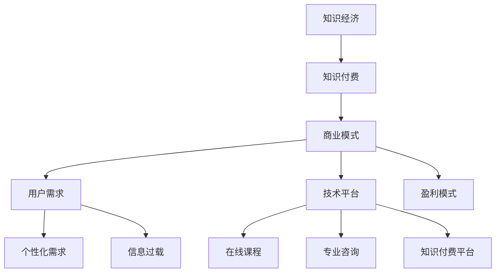

                 

在当今这个快速发展的数字化时代，知识经济已经成为了驱动经济增长的重要引擎。知识付费作为知识经济的一个关键组成部分，其商业模式也随着技术的进步而不断创新。本文将探讨知识经济时代下的知识付费创新商业模式运营，分析其背后的逻辑、实践案例以及未来趋势。

## 关键词

- 知识经济
- 知识付费
- 商业模式
- 创新运营
- 数字化转型

## 摘要

本文旨在探讨知识付费在知识经济时代下的创新商业模式。通过分析当前市场的趋势和案例，本文提出了几种创新的商业模式，如订阅制、知识社区、内容电商等，并探讨了这些模式在运营过程中面临的挑战和解决方案。同时，本文也对未来知识付费的发展趋势和面临的挑战进行了展望。

### 1. 背景介绍

知识付费，顾名思义，是指用户为获取知识或技能而付费的一种商业模式。在传统的知识传播渠道中，知识通常以免费的形式传递，而知识付费的出现改变了这一格局。随着互联网技术的发展，特别是移动互联网和社交媒体的普及，知识付费逐渐成为了一个重要的市场领域。

知识付费的兴起，不仅源于用户对高质量内容的需求，还受到以下几个因素的影响：

1. **信息过载**：在信息爆炸的时代，用户很难从海量信息中筛选出有价值的内容，因此，专业的知识服务成为了用户寻求帮助的首选。
2. **个性化需求**：随着用户对个性化的追求，知识付费能够提供定制化的学习内容和解决方案，满足用户的特定需求。
3. **商业模式创新**：互联网企业的兴起，使得知识付费有了更多的商业模式创新空间，如订阅制、直播授课等。

### 2. 核心概念与联系

为了更好地理解知识付费的商业模式，我们需要先了解几个核心概念：

#### 2.1 知识经济

知识经济是指以知识为主要生产要素的经济形态，其核心在于知识的创造、传播和应用。与传统经济相比，知识经济更依赖于人类的智力资源，如创新思维、专业技能等。

#### 2.2 知识付费

知识付费是知识经济的一个重要组成部分，它指的是用户为获取知识或技能而支付的费用。知识付费不仅包括传统的教育培训服务，还包括在线课程、专业咨询、知识付费平台等多种形式。

#### 2.3 商业模式

商业模式是企业如何创造、传递和获取价值的一种战略规划。在知识付费领域，商业模式决定了企业如何向用户收费、如何提供知识服务以及如何盈利。

下面是一个Mermaid流程图，展示了知识付费商业模式的核心概念和联系：



### 3. 核心算法原理 & 具体操作步骤

#### 3.1 算法原理概述

在知识付费的商业模式中，核心算法主要涉及以下几个方面：

1. **用户画像分析**：通过分析用户的行为数据，构建用户画像，以便提供个性化推荐。
2. **内容质量评估**：利用机器学习算法，评估课程或内容的质量，从而确保提供高质量的知识服务。
3. **付费预测模型**：通过分析用户的付费行为，预测哪些用户可能成为付费用户，以便进行精准营销。

#### 3.2 算法步骤详解

1. **用户画像分析**：

   - **数据收集**：收集用户的基本信息、浏览记录、购买历史等。
   - **特征提取**：从数据中提取有用的特征，如用户年龄、职业、兴趣爱好等。
   - **模型训练**：使用机器学习算法（如决策树、随机森林等）训练用户画像模型。
   - **个性化推荐**：根据用户画像，向用户推荐个性化的知识服务。

2. **内容质量评估**：

   - **内容评分**：收集用户对课程的评分数据。
   - **特征工程**：提取课程的特征，如讲师资质、课程时长、更新频率等。
   - **模型训练**：使用机器学习算法（如线性回归、支持向量机等）训练内容质量评估模型。
   - **质量预测**：根据课程特征，预测课程的质量。

3. **付费预测模型**：

   - **数据收集**：收集用户的付费行为数据。
   - **特征提取**：提取与付费行为相关的特征，如用户活跃度、购买历史等。
   - **模型训练**：使用机器学习算法（如逻辑回归、随机森林等）训练付费预测模型。
   - **付费预测**：根据用户特征，预测用户是否愿意付费。

#### 3.3 算法优缺点

1. **用户画像分析**：

   - **优点**：能够提供个性化的推荐，提升用户体验。
   - **缺点**：需要大量用户数据支持，且数据隐私问题值得关注。

2. **内容质量评估**：

   - **优点**：能够确保提供高质量的知识服务，提升用户满意度。
   - **缺点**：评估模型可能受限于数据质量，且评估标准可能存在主观性。

3. **付费预测模型**：

   - **优点**：能够精准预测用户付费意愿，提升营销效果。
   - **缺点**：需要大量用户行为数据支持，且预测结果可能存在偏差。

#### 3.4 算法应用领域

1. **在线教育平台**：通过用户画像分析，推荐个性化的课程，提升用户留存率和转化率。
2. **专业咨询公司**：通过内容质量评估，确保提供高质量的专业咨询服务，提升品牌信誉。
3. **广告营销公司**：通过付费预测模型，精准预测潜在客户，提高广告投放效果。

### 4. 数学模型和公式 & 详细讲解 & 举例说明

在知识付费的商业模式中，数学模型和公式发挥着重要作用，下面我们将详细讲解几个关键的数学模型和公式，并通过具体案例进行说明。

#### 4.1 数学模型构建

1. **用户画像模型**：

   用户画像模型的目的是通过分析用户的行为数据，构建用户的个性化特征。常见的用户画像模型有：

   - **逻辑回归模型**：用于预测用户的某个行为（如购买课程）的概率。
   - **决策树模型**：用于分类用户，以便提供个性化的推荐。

2. **内容质量评估模型**：

   内容质量评估模型的目的是通过对课程的特征进行分析，评估课程的质量。常见的质量评估模型有：

   - **支持向量机（SVM）**：用于分类课程，判断其质量等级。
   - **线性回归模型**：用于预测课程的质量评分。

3. **付费预测模型**：

   付费预测模型的目的是通过分析用户的行为数据，预测用户是否愿意付费。常见的付费预测模型有：

   - **逻辑回归模型**：用于预测用户付费的概率。
   - **随机森林模型**：用于预测用户的付费行为。

#### 4.2 公式推导过程

1. **逻辑回归模型**：

   逻辑回归模型的核心公式为：

   $$P(y=1) = \frac{1}{1 + e^{-(\beta_0 + \beta_1x_1 + \beta_2x_2 + \ldots + \beta_nx_n)}}$$

   其中，$P(y=1)$表示用户行为发生的概率，$\beta_0, \beta_1, \beta_2, \ldots, \beta_n$为模型参数，$x_1, x_2, \ldots, x_n$为特征值。

2. **支持向量机（SVM）**：

   支持向量机的基本公式为：

   $$\min_{\beta, \beta_0} \frac{1}{2} ||\beta||^2 + C \sum_{i=1}^n \max(0, 1 - y_i(\beta^T x_i + \beta_0))$$

   其中，$\beta, \beta_0$为模型参数，$C$为惩罚参数，$y_i$为样本标签，$x_i$为样本特征。

3. **线性回归模型**：

   线性回归模型的基本公式为：

   $$y = \beta_0 + \beta_1x_1 + \beta_2x_2 + \ldots + \beta_nx_n$$

   其中，$y$为预测值，$\beta_0, \beta_1, \beta_2, \ldots, \beta_n$为模型参数，$x_1, x_2, \ldots, x_n$为特征值。

#### 4.3 案例分析与讲解

以下通过一个实际案例，展示如何使用逻辑回归模型进行用户画像分析。

**案例背景**：

某在线教育平台希望通过分析用户的行为数据，预测用户是否愿意付费购买课程。

**数据集**：

- 特征：用户年龄、用户职业、用户浏览时长、用户购买历史等。
- 标签：付费（1）/ 未付费（0）。

**模型训练**：

1. **数据预处理**：

   - 对数据进行归一化处理，以便模型训练。
   - 删除缺失值和异常值。

2. **特征工程**：

   - 构建用户活跃度特征，如浏览时长、购买历史等。
   - 构建用户年龄和职业的交叉特征。

3. **模型训练**：

   - 使用Python中的Scikit-learn库，实现逻辑回归模型。
   - 使用交叉验证方法，优化模型参数。

**模型评估**：

- 使用准确率、召回率、F1值等指标，评估模型性能。

### 5. 项目实践：代码实例和详细解释说明

下面我们将通过一个具体的案例，展示如何搭建一个知识付费平台，并对其关键功能进行实现。

#### 5.1 开发环境搭建

1. **技术栈**：

   - 后端：使用Python的Django框架。
   - 前端：使用React框架。
   - 数据库：使用MySQL数据库。

2. **环境配置**：

   - 安装Python、Django、React、MySQL等依赖项。
   - 配置开发环境，包括虚拟环境、数据库连接等。

#### 5.2 源代码详细实现

以下将分别介绍后端和前端的核心代码实现。

**后端实现**：

1. **用户管理模块**：

   - 实现用户注册、登录、密码找回等功能。
   - 使用Django的用户认证系统，确保用户数据安全。

2. **课程管理模块**：

   - 实现课程添加、编辑、删除等功能。
   - 使用RESTful API设计，方便前端调用。

3. **订单管理模块**：

   - 实现订单创建、支付、退款等功能。
   - 使用支付宝或微信支付接口，确保支付流程顺畅。

**前端实现**：

1. **用户界面**：

   - 使用React框架，实现用户注册、登录、课程浏览等功能。
   - 使用Ant Design组件库，提升界面美观度和用户体验。

2. **课程列表**：

   - 使用React的虚拟DOM技术，实现动态加载课程列表。
   - 使用React Router进行路由管理，确保页面跳转顺畅。

3. **课程详情**：

   - 显示课程详情信息，包括课程简介、讲师介绍、课程大纲等。
   - 提供课程购买按钮，方便用户一键购买。

#### 5.3 代码解读与分析

以下将对关键代码段进行解读和分析。

**后端代码解读**：

```python
# 用户注册接口
from django.contrib.auth.models import User
from rest_framework import status
from rest_framework.response import Response
from rest_framework.views import APIView

class UserRegistrationView(APIView):
    def post(self, request, format=None):
        username = request.data.get('username')
        password = request.data.get('password')
        email = request.data.get('email')
        
        user = User.objects.create_user(username=username, password=password, email=email)
        user.save()
        
        return Response({'message': 'User registered successfully!'}, status=status.HTTP_201_CREATED)
```

该代码段实现了用户注册接口，通过接收用户提交的用户名、密码和邮箱，创建一个新的用户，并保存到数据库。

**前端代码解读**：

```jsx
// 用户注册表单
import React, { useState } from 'react';
import { Form, Input, Button } from 'antd';

const UserRegistrationForm = () => {
    const [username, setUsername] = useState('');
    const [password, setPassword] = useState('');
    const [email, setEmail] = useState('');

    const handleSubmit = () => {
        // 发送注册请求
    };

    return (
        <Form
            name="user-registration"
            initialValues={{ remember: true }}
            onFinish={handleSubmit}
        >
            <Form.Item
                name="username"
                rules={[{ required: true, message: 'Please input your username!' }]}
            >
                <Input placeholder="Username" value={username} onChange={e => setUsername(e.target.value)} />
            </Form.Item>
            <Form.Item
                name="password"
                rules={[{ required: true, message: 'Please input your password!' }]}
            >
                <Input.Password placeholder="Password" value={password} onChange={e => setPassword(e.target.value)} />
            </Form.Item>
            <Form.Item
                name="email"
                rules={[{ required: true, message: 'Please input your email!' }]}
            >
                <Input placeholder="Email" value={email} onChange={e => setEmail(e.target.value)} />
            </Form.Item>
            <Form.Item>
                <Button type="primary" htmlType="submit">
                    Register
                </Button>
            </Form.Item>
        </Form>
    );
};

export default UserRegistrationForm;
```

该代码段实现了用户注册表单，通过使用Ant Design的Form组件，收集用户输入的用户名、密码和邮箱，并在提交表单时触发注册请求。

#### 5.4 运行结果展示

以下是知识付费平台的运行结果展示：

1. **用户注册**：

   用户可以注册一个新账户，填写用户名、密码和邮箱等信息。

2. **课程列表**：

   用户可以浏览平台上的所有课程，包括课程名称、讲师、课程简介等信息。

3. **课程详情**：

   用户可以查看某门课程的详细信息，包括课程大纲、讲师介绍、课程评价等。

4. **课程购买**：

   用户可以选择购买某门课程，并完成支付流程。

### 6. 实际应用场景

知识付费商业模式在多个领域都有着广泛的应用，以下列举几个典型的应用场景：

#### 6.1 在线教育

在线教育是知识付费模式最典型的应用场景之一。用户可以通过付费购买在线课程，学习各种知识和技能。例如，Coursera、Udemy等平台提供了海量的在线课程，涵盖了从编程、数据分析到语言学习等各个领域。

#### 6.2 专业咨询

专业咨询公司通常提供专业的咨询服务，如法律咨询、财务咨询、营销咨询等。用户可以通过付费获取专业的咨询服务，解决实际问题。例如，领英（LinkedIn）上的专业人士通过付费模式提供一对一的咨询服务。

#### 6.3 内容创作

内容创作者通过付费模式提供高质量的内容，如文章、视频、音频等。用户可以付费订阅创作者的内容，享受独家、专业的观点和资讯。例如，喜马拉雅、得到等平台上的内容创作者通过付费模式获得收益。

#### 6.4 企业培训

企业通过付费模式购买在线培训课程，对员工进行职业技能培训。这种模式不仅提高了员工的专业技能，也提升了企业的整体竞争力。例如，企业的员工可以通过在线平台学习编程、项目管理等课程。

### 6.4 未来应用展望

知识付费模式在未来将继续发展，并可能呈现出以下几个趋势：

1. **个性化服务**：随着人工智能技术的发展，知识付费平台将能够更好地理解用户需求，提供个性化的知识服务。
2. **内容多样化**：知识付费的内容将更加多样化，不仅包括传统的在线课程，还包括虚拟现实（VR）培训、直播授课等。
3. **平台生态化**：知识付费平台将构建一个完整的生态体系，包括课程创作、内容审核、用户反馈等环节，实现闭环运营。
4. **跨界合作**：知识付费将与更多行业进行跨界合作，如电商、社交网络等，实现资源共享和共赢。

### 7. 工具和资源推荐

为了更好地进行知识付费商业模式运营，以下推荐一些实用的工具和资源：

#### 7.1 学习资源推荐

- **在线教育平台**：如Coursera、Udemy、网易云课堂等，提供丰富的课程资源。
- **专业咨询平台**：如领英（LinkedIn）、知乎专栏等，提供专业的咨询服务。
- **内容创作工具**：如WordPress、Blogger等，帮助创作者搭建自己的内容平台。

#### 7.2 开发工具推荐

- **后端开发**：如Django、Flask等Python框架，快速搭建后端系统。
- **前端开发**：如React、Vue等JavaScript框架，提升前端开发效率。
- **数据库**：如MySQL、PostgreSQL等关系型数据库，存储和管理数据。

#### 7.3 相关论文推荐

- **《知识付费商业模式研究》**：探讨知识付费的商业逻辑和发展趋势。
- **《人工智能在知识付费中的应用》**：分析人工智能在知识付费领域的应用场景和效果。
- **《在线教育商业模式研究》**：分析在线教育的商业模式和创新点。

### 8. 总结：未来发展趋势与挑战

知识付费作为知识经济的重要组成部分，其商业模式在不断创新。未来，知识付费将朝着个性化、多样化、生态化的方向发展。然而，这一过程中也将面临诸多挑战：

1. **内容质量**：确保知识付费平台上的内容质量，是用户选择付费的关键。
2. **用户体验**：提升用户体验，提供优质的客户服务，是知识付费平台成功的关键。
3. **数据安全**：保护用户数据安全，防止信息泄露，是知识付费平台面临的重大挑战。
4. **监管合规**：遵守相关法律法规，确保知识付费业务的合规性，是平台长期发展的基础。

### 9. 附录：常见问题与解答

**Q1**：知识付费与免费学习的区别是什么？

**A1**：知识付费通常提供更高质量、更专业的学习内容，而免费学习则更多依赖于开放资源和社区互助。知识付费通常有专门的讲师、系统化的课程结构和反馈机制，而免费学习则更多依赖于自学和社区讨论。

**Q2**：知识付费模式是否会对传统教育体系造成冲击？

**A2**：知识付费模式在一定程度上冲击了传统教育体系，尤其是在成人教育和职业培训领域。然而，高等教育和基础教育仍然需要面对面的教学和严格的考试体系，因此传统教育体系不会被完全替代。

**Q3**：知识付费平台如何确保内容质量？

**A3**：知识付费平台通常通过以下方式确保内容质量：

- **讲师审核**：对讲师进行资质审核，确保其具有相关领域的专业知识和经验。
- **用户反馈**：收集用户对课程的评价和反馈，不断优化课程内容。
- **内容审核**：建立内容审核机制，确保课程内容的准确性和合规性。

**Q4**：知识付费是否只适用于专业领域？

**A4**：知识付费不仅适用于专业领域，还涵盖了生活、兴趣、技能等各个方面。例如，有针对艺术爱好者的绘画课程、音乐课程，有针对生活技能的提升课程，如烹饪、家居装修等。

---

**作者：禅与计算机程序设计艺术 / Zen and the Art of Computer Programming**

